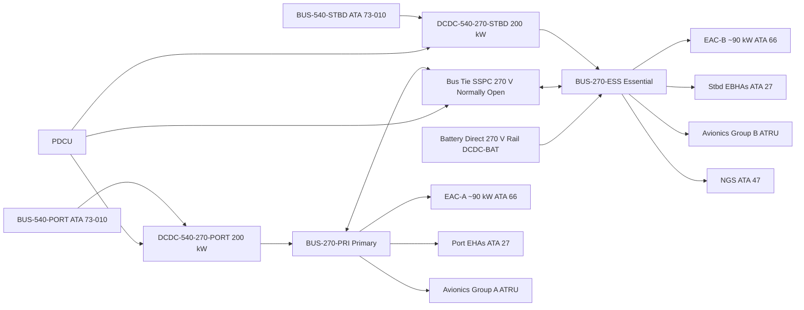
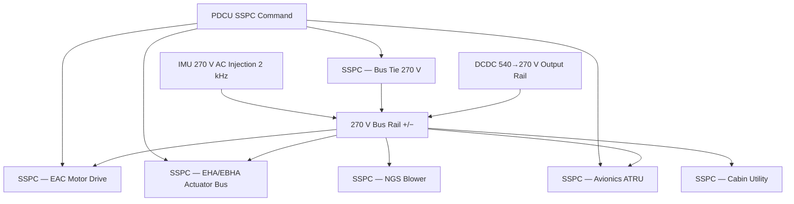

<!-- ──────────────────────────────────────────────────────────────────────────
     QATL-ATLAS-1000-ATLAS-070-079-07-073-020-MEDIUM-VOLTAGE-DISTRIBUTION-ARCHITECTURE
     ATA 73 · Medium Voltage Distribution Architecture
     AMPEL360E eWTW — ATLAS Register 1000
────────────────────────────────────────────────────────────────────────────── -->

# Medium Voltage Distribution Architecture

---

## §0 Hyperlink Policy

> All hyperlinks in this document are **relative** (five directory levels: `../../../../../`).
> Absolute URLs are forbidden. Every linked document must exist in the Q+ATLANTIDE repository
> before the link is activated. Broken links are treated as open issues and must be resolved
> before the document is promoted from `DRAFT` to `APPROVED`.

---

## §1 Purpose

This document defines the HVDC 270 V secondary distribution architecture of the AMPEL360E eWTW. The 270 V network is the secondary power tier, derived from the 540 V propulsion buses via isolated LLC-resonant DC-DC converters. It supplies all secondary electrical consumers: Electric Air Compressors (EACs, ATA 66), Electro-Hydrostatic Actuators and Electro-Backup-Hydrostatic Actuators (EHAs/EBHAs, ATA 27), avionics ATRUs, the Nitrogen Generation System (NGS, ATA 47), and cabin utility loads.

The 270 V architecture provides full fail-operative capability: the **270 V Primary Bus** and the **270 V Essential Bus** are segregated, cross-connected by a bus-tie SSPC, and the Essential Bus is backed by the LiNMC battery pack in all failure cases including dual step-down converter loss.

---

## §2 Applicability

| Parameter | Value |
|---|---|
| Aircraft Program | AMPEL360E eWTW |
| ATA reference | ATA 73-020 — Medium Voltage Distribution Architecture |
| Certification basis | EASA CS-25 Amdt 27+ |
| S1000D SNS | 073-020-00 |

---

## §3 Functional Description ![DRAFT]

The HVDC 270 V network splits into two independently managed bus segments:

- **BUS-270-PRI (Primary):** fed by DCDC-540-270-PORT; supplies EAC-A (~90 kW), port-side EHAs (ATA 27), avionics ATRU group A, and cabin utility loads.
- **BUS-270-ESS (Essential):** fed by DCDC-540-270-STBD; supplies EAC-B (~90 kW), stbd-side EBHAs (ATA 27), avionics ATRU group B, and NGS (ATA 47).

A normally-open **Bus-Tie SSPC (270 V)** connects the two buses. On loss of one step-down converter, the PDCU commands the bus tie closed, restoring the de-powered bus from the healthy converter. If both step-down converters fail, the battery DC-DC converter (ATA 73-010, DCDC-BAT) provides direct 270 V essential bus sustain via a dedicated output rail, ensuring continued operation of flight-critical loads.

The 270 V essential bus maintains the following minimum loads under all battery-only scenarios: stbd EBHA (ATA 27), avionics group B ATRU, and PDCU itself — together totalling approximately 60 kW.

---

## §4 Functional Breakdown

| ID | Name | Description | Lead Division |
|---|---|---|---|
| F-001 | 270 V primary bus | BUS-270-PRI: fed from DCDC-540-270-PORT; EAC-A, port EHA, avionics group A | Q-GREENTECH |
| F-002 | 270 V essential bus | BUS-270-ESS: fed from DCDC-540-270-STBD; EAC-B, stbd EBHA, avionics group B, NGS | Q-GREENTECH |
| F-003 | Bus tie SSPC logic | Normally-open 270 V bus tie SSPC; PDCU closes on step-down converter failure | Q-MECHANICS |
| F-004 | Battery essential feed | DCDC-BAT 270 V direct output to BUS-270-ESS when both step-down converters lost | Q-INDUSTRY |
| F-005 | EAC and actuator power distribution | Per-load SSPCs on 270 V buses distributing power to EAC-A/B and all EHA/EBHA units | Q-AIR |

---

## §5 System Context — Mermaid Diagram

---

## §6 Internal Architecture — Mermaid Diagram

---

## §7 Components and LRUs

| Component | Part Number | Qty | Location | Maintenance Interval | Notes |
|---|---|---|---|---|---|
| DCDC-540-270-PORT | DCDC-540-270-P-PN-TBD | 1 | EE bay rack | C-check efficiency test η ≥ 96 % | LLC resonant; 200 kW; galvanic isolation |
| DCDC-540-270-STBD | DCDC-540-270-S-PN-TBD | 1 | EE bay rack | C-check efficiency test η ≥ 96 % | Identical to port unit |
| Bus Tie SSPC (270 V) | BT-SSPC-270-PN-TBD | 1 | EE bay power panel | A-check functional test | Normally open; PDCU commanded |
| SSPC — EAC-A (270 V) | SSPC-EAC-A-PN-TBD | 1 | EE bay power panel | A-check trip-count check | 350 A rated; over-current ≤ 100 μs trip |
| SSPC — EAC-B (270 V) | SSPC-EAC-B-PN-TBD | 1 | EE bay power panel | A-check trip-count check | Identical to SSPC-EAC-A |
| SSPC — EHA Bus (270 V) | SSPC-EHA-PN-TBD | 4 | EE bay power panel | A-check functional test | Per actuator bus zone |
| SSPC — Avionics ATRU A/B | SSPC-AVI-PN-TBD | 2 | EE bay power panel | C-check | One per avionics group |
| IMU-270-PRI / IMU-270-ESS | IMU-270-PN-TBD | 2 | EE bay near bus rails | Calibration ≤ 24 months | IEC 61557-8 compliant |

---

## §8 Interfaces

| Interface Type | Connected System | Protocol / Medium | Data / Function |
|---|---|---|---|
| ATA 73-010 | 540 V High Voltage Buses | HVDC cable + isolated DCDC output | 400 kW combined 270 V generation |
| ATA 66 Air Compressor | EAC-A / EAC-B PMSM motor drives | HVDC cable 270 V | ~90 kW per EAC |
| ATA 27 Flight Controls | EHA and EBHA actuator drives | HVDC cable 270 V | Variable; up to 50 kW per actuator zone |
| ATA 47 NGS | Nitrogen Generation System blower | HVDC cable 270 V | ~15 kW nominal |
| ATA 34 / Avionics | Avionics ATRU group A/B | HVDC cable 270 V | ~30 kW per group |
| ATA 45 CMS | Central Maintenance System | AFDX ARINC 664 P7 | 270 V bus health, SSPC status, IMU data |
| ATA 72 Battery BMS | LiNMC battery emergency feed | HVDC 270 V direct rail from DCDC-BAT | Emergency essential bus sustain ~60 kW |

---

## §9 Operating Modes

| Mode | Trigger | System State | Actions / Consequences |
|---|---|---|---|
| Normal dual step-down | Both DCDC-540-270 healthy | BUS-270-PRI and BUS-270-ESS independent; bus tie open | All loads powered; PDCU monitors all SSPCs |
| Single step-down failure | One DCDC-540-270 fault | Bus tie SSPC closed by PDCU; both buses fed from healthy converter | Healthy converter at 200 kW capacity — load shed of low-priority loads if needed |
| Dual step-down failure | Both DCDC-540-270 fault | DCDC-BAT direct 270 V rail feeds BUS-270-ESS | Essential loads only (~60 kW); ECAM red warning |
| Ground power (GPU) | On ground; GPU connected | GPU feeds BUS-270-ESS via GPU SSPC | DCDC-540-270 offline; minimum ground operation |
| EAC load shed | Single step-down fault with high total load | SSPC-EAC-A (lower priority) tripped by PDCU | ECS continues on EAC-B; ECAM amber caution |

---

## §10 Performance and Budgets ![DRAFT]

| Parameter | Requirement | Target / Design Value | Status |
|---|---|---|---|
| 270 V bus voltage (steady state) | 270 V ± 3 % | 270 V ± 2 % | ![TBD] |
| DCDC-540-270 efficiency | η ≥ 96 % at 50 % load | η ≥ 97 % | ![TBD] |
| Bus tie closure time | ≤ 200 ms from fault detect | ≤ 100 ms target | ![TBD] |
| Essential bus minimum load | 60 kW (battery-only) | 58 kW design | ![TBD] |
| SSPC trip response (EAC/EHA) | ≤ 100 μs | ≤ 80 μs target | ![TBD] |

---

## §11 Safety, Redundancy and Fault Tolerance

- Dual 270 V bus topology (primary + essential) provides fail-operative capability; no single step-down converter failure de-powers essential flight-critical loads.
- Battery emergency 270 V feed ensures essential bus continuity even after dual step-down converter failure; autonomy sized for approach and landing.
- EAC loads are SSPC-shedable — loss of one EAC is gracefully handled per ATA 66 single-EAC degraded mode.
- EHA/EBHA actuators have independent SSPC per zone; zone fault does not propagate to other actuator buses.
- IMU-270-PRI and IMU-270-ESS provide insulation monitoring on both 270 V bus segments; alarm thresholds per IEC 61557-8.
- DCDC galvanic isolation prevents 540 V faults from propagating to 270 V loads and avionics.

---

## §12 Maintenance and Diagnostics

| Task | Interval | Access | Special Tools |
|---|---|---|---|
| DCDC-540-270 efficiency test (port and stbd) | C-check | EE bay rack | Precision load bank; power analyser |
| Bus tie SSPC functional test | A-check | PDCU GSE command | SSPC test console |
| SSPC trip-count review (EAC, EHA SSPCs) | A-check | CMS terminal | CMS GSE terminal |
| IMU-270 calibration verification | ≤ 24 months | EE bay | IMU calibration kit (IEC 61557-8) |
| Battery 270 V essential feed test | C-check | EE bay + battery bay | Load bank; PDCU GSE |

---

## §13 Footprint

| Footprint Type | Parameter | Value | Notes |
|---|---|---|---|
| Physical | DCDC-540-270 converter mass (each) | ![TBD] | Pending OEM |
| Electrical | Normal combined 270 V load | ~300 kW | Both EACs + actuators + avionics |
| Electrical | Essential-only minimum load | ~60 kW | Battery sustain scenario |
| Maintenance | DCDC access category | EE bay rack — line maintenance | Per AMM |
| Data | SSPC status update rate | ![TBD] | Per AFDX load analysis |

---

## §14 Safety and Certification References ![DRAFT]

| Standard / Document | Title | Issuing Body | Applicability |
|---|---|---|---|
| MIL-STD-704F §5.2 | Aircraft Electrical Power — HVDC 270 V | US DoD | 270 V bus quality and transient limits |
| DO-160G | Environmental Conditions and Test Procedures | RTCA | DCDC converter qualification |
| EASA CS-25 §25.1351 | General — Electrical systems | EASA | Essential bus continuity after dual failure |
| IEC 61557-8 | Insulation monitoring devices | IEC | IMU-270 specification |
| SAE AS50881 | Wiring Aerospace Vehicle | SAE | Cable and connector for 270 V distribution |

---

## §15 V&V Approach ![TBD]

| Phase | Method | Acceptance Criterion | Status |
|---|---|---|---|
| Design | Power flow analysis — DCDC 540→270 V load model | Bus voltage ± 3 %; essential load covered in all failure modes | ![TBD] |
| Unit | DCDC bench test at 50 % and 100 % load | η ≥ 96 % both loading conditions | ![TBD] |
| Integration | Ground rig — bus tie transfer test; battery essential feed test | Transfer ≤ 100 ms; essential bus maintained at 270 V ± 3 % | ![TBD] |
| Qualification | DO-160G environmental (DCDC, SSPCs) | All categories pass | ![TBD] |
| Certification | CS-25 §25.1351 essential bus analysis and test | Essential loads available after worst-case failure | ![TBD] |

---

## §16 Glossary

| Term | Definition |
|---|---|
| **BUS-270-PRI** | Primary HVDC 270 V bus; fed from DCDC-540-270-PORT. |
| **BUS-270-ESS** | Essential HVDC 270 V bus; fed from DCDC-540-270-STBD; battery-backed. |
| **DCDC-540-270** | Isolated LLC resonant DC-DC converter stepping 540 V to 270 V; 200 kW. |
| **Bus tie SSPC (270 V)** | Normally-open solid-state switch linking primary and essential 270 V buses. |
| **EHA** | Electro-Hydrostatic Actuator — flight control actuator powered from 270 V bus. |
| **EBHA** | Electro-Backup Hydrostatic Actuator — actuator with electric backup mode; 270 V. |
| **Galvanic isolation** | Electrical separation between 540 V and 270 V tiers via DCDC HF transformer. |
| **Essential bus** | Minimum set of loads that must remain powered to complete flight safely. |
| **LLC resonant** | Inductor-Inductor-Capacitor resonant converter topology; high efficiency. |

---

## §17 Open Issues

| ID | Description | Owner | Target |
|---|---|---|---|
| OI-073-020-001 | Confirm combined 270 V load at max dispatch with all systems OEMs | Q-GREENTECH | 2026-Q4 |
| OI-073-020-002 | Define EAC load shed priority logic with ATA 66 and ATA 21 systems engineers | Q-AIR | 2027-Q1 |
| OI-073-020-003 | Validate essential bus autonomy (battery SoC vs load profile) with ATA 72 | Q-INDUSTRY | 2027-Q1 |

---

## §18 Status Legend

| Badge | Meaning |
|---|---|
| `![DRAFT]` | Section is drafted but not yet reviewed |
| `![TBD]` | Content not yet started — to be defined |
| `![To Be Completed]` | Partially complete — needs additional content |
| `![APPROVED]` | Reviewed and formally approved |

---

## §19 Related Documents (Siblings in this Subsection)

- [073-000](./073-000-Power-Distribution-MV-HV-General.md)
- [073-010](./073-010-High-Voltage-Distribution-Architecture.md)
- [073-030](./073-030-Power-Electronics-Converters-and-Rectifiers.md)
- [073-040](./073-040-SSPC-Contactors-Breakers-and-Protection.md)
- [073-050](./073-050-HVDC-Busbars-Cables-and-Connectors.md)
- [073-060](./073-060-Insulation-Monitoring-and-Ground-Fault-Detection.md)
- [073-070](./073-070-Power-Distribution-Test-and-Maintenance.md)
- [073-080](./073-080-Power-Distribution-Monitoring-Diagnostics-and-Control-Interfaces.md)
- [073-090](./073-090-S1000D-CSDB-Mapping-and-Traceability.md)

---

## §20 Change Log

| Rev | Date | Author | Description |
|---|---|---|---|
| 0.1 | 2026-05-11 | @copilot | Initial DRAFT — HVDC 270 V dual-bus secondary architecture for AMPEL360E eWTW |
