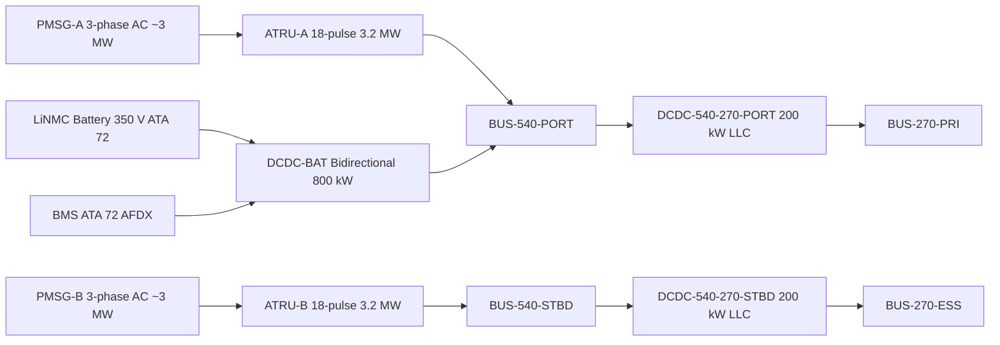

<!-- ──────────────────────────────────────────────────────────────────────────
     QATL-ATLAS-1000-ATLAS-070-079-07-073-030-POWER-ELECTRONICS-CONVERTERS-AND-RECTIFIERS
     ATA 73 · Power Electronics Converters and Rectifiers
     AMPEL360E eWTW — ATLAS Register 1000
────────────────────────────────────────────────────────────────────────────── -->

# Power Electronics Converters and Rectifiers

---

## §0 Hyperlink Policy

> All hyperlinks in this document are **relative** (five directory levels: `../../../../../`).
> Absolute URLs are forbidden. Every linked document must exist in the Q+ATLANTIDE repository
> before the link is activated. Broken links are treated as open issues and must be resolved
> before the document is promoted from `DRAFT` to `APPROVED`.

---

## §1 Purpose

This document describes all power electronics converters and rectifiers in the AMPEL360E eWTW HVDC power distribution system. These comprise:

1. **ATRU-A and ATRU-B** — 18-pulse Auto-Transformer Rectifier Units converting 3-phase AC output from the PMSGs (~3 MW each) to HVDC 540 V.
2. **DCDC-540-270-PORT and DCDC-540-270-STBD** — Isolated LLC-resonant DC-DC converters stepping 540 V to 270 V (200 kW each), providing galvanic isolation between the propulsion and secondary distribution tiers.
3. **DCDC-BAT** — Bidirectional DC-DC converter interfacing the LiNMC battery pack (ATA 72, nominal 350 V) with the HVDC 540 V propulsion bus for peak power injection and energy recovery.

This document specifies the topology, electrical characteristics, interfaces, and qualification requirements for all three converter types.

---

## §2 Applicability

| Parameter | Value |
|---|---|
| Aircraft Program | AMPEL360E eWTW |
| ATA reference | ATA 73-030 — Power Electronics Converters and Rectifiers |
| Certification basis | EASA CS-25 Amdt 27+ |
| S1000D SNS | 073-030-00 |

---

## §3 Functional Description ![DRAFT]

**ATRU (×2):** Each ATRU uses an 18-pulse auto-transformer with six three-phase bridge rectifier modules phase-shifted by 20° to cancel 5th, 7th, 11th, and 13th harmonic orders. This topology achieves THD ≤ 4 % at the 540 V DC output without additional active filters. Each ATRU is rated 3.2 MW continuous, with an oil-cooling loop thermally managed by the nacelle cooling circuit. A soft-start pre-charge resistor network limits inrush current to ≤ 120 % of rated current at bus energisation.

**DC-DC 540→270 V (×2):** Each DCDC-540-270 converter employs a dual-interleaved LLC resonant half-bridge topology operating at 100 kHz switching frequency. The HF transformer (ferrite core, isolation class 1500 V) provides galvanic isolation between 540 V and 270 V networks. Interleaving of two 100 kW stages achieves output voltage ripple ≤ 0.5 % at full load. SiC MOSFET switches enable the high switching frequency at high efficiency (η ≥ 97 % at 50 % load).

**DCDC-BAT (×1):** The bidirectional converter is a phase-shifted full-bridge topology with HF transformer isolation. Boost mode (350 V → 540 V, up to 800 kW peak for 60 s): battery discharges into propulsion bus for take-off augmentation. Buck mode (540 V → 350 V, up to 200 kW): propulsion bus charges battery during cruise and descent. The converter interfaces with the Battery Management System (BMS, ATA 72) via AFDX for SoC-based charge current control.

---

## §4 Functional Breakdown

| ID | Name | Description | Lead Division |
|---|---|---|---|
| F-001 | ATRU-A AC/DC rectification | 18-pulse rectifier on port; PMSG-A 3-phase AC → 540 V DC; 3.2 MW | Q-GREENTECH |
| F-002 | ATRU-B AC/DC rectification | 18-pulse rectifier on stbd; PMSG-B 3-phase AC → 540 V DC; 3.2 MW | Q-GREENTECH |
| F-003 | Step-down DC-DC port | LLC resonant 540→270 V; 200 kW; galvanic isolation; feeds BUS-270-PRI | Q-MECHANICS |
| F-004 | Step-down DC-DC stbd | LLC resonant 540→270 V; 200 kW; galvanic isolation; feeds BUS-270-ESS | Q-MECHANICS |
| F-005 | Battery bidirectional DC-DC | Phase-shifted full-bridge; 540 V ↔ 350 V; ±800 kW peak / 200 kW charge | Q-INDUSTRY |

---

## §5 System Context — Mermaid Diagram

---

## §6 Internal Architecture — Mermaid Diagram

```mermaid
flowchart TB
    subgraph ATRU [ATRU 18-Pulse Rectifier]
        AT_TRANS[Auto-Transformer 18-pulse] --> BRIDGE_1[Bridge Module 1]
        AT_TRANS --> BRIDGE_2[Bridge Module 2 +20°]
        AT_TRANS --> BRIDGE_3[Bridge Module 3 +40°]
        BRIDGE_1 & BRIDGE_2 & BRIDGE_3 --> DC_FILTER[DC Bus Capacitor + Filter]
        DC_FILTER --> PRECHARGE[Pre-Charge Resistor Network]
        PRECHARGE --> OUT_540[540 V Output Rail]
    end
    subgraph DCDC [DC-DC 540→270 V LLC Resonant]
        SIC_HB[SiC MOSFET Half-Bridge ×2 Interleaved] --> HF_TRANS[HF Transformer 1500 V Isolation]
        HF_TRANS --> RECT_270[Secondary Rectifier + Filter]
        RECT_270 --> OUT_270[270 V Output Rail]
    end
    subgraph DCDC_B [DCDC-BAT Bidirectional]
        BRIDGE_BAT[Phase-Shifted Full-Bridge SiC] --> HF_ISO[HF Transformer Isolation]
        HF_ISO --> OUT_540B[540 V Bus Interface]
        HF_ISO --> OUT_350[350 V Battery Interface]
    end
```

---

## §7 Components and LRUs

| Component | Part Number | Qty | Location | Maintenance Interval | Notes |
|---|---|---|---|---|---|
| ATRU-A 18-pulse 3.2 MW | ATRU-A-PN-TBD | 1 | Port pylon | C-check THD test + oil circuit check | Oil-cooled; 18-pulse; THD ≤ 4 % |
| ATRU-B 18-pulse 3.2 MW | ATRU-B-PN-TBD | 1 | Stbd pylon | C-check THD test + oil circuit check | Identical to ATRU-A |
| DCDC-540-270-PORT 200 kW | DCDC-P-PN-TBD | 1 | EE bay rack | C-check efficiency test | LLC resonant; SiC MOSFET; 100 kHz |
| DCDC-540-270-STBD 200 kW | DCDC-S-PN-TBD | 1 | EE bay rack | C-check efficiency test | Identical to port unit |
| DCDC-BAT Bidirectional 800 kW | DCDC-BAT-PN-TBD | 1 | EE bay rack | C-check cycle count + efficiency | Phase-shifted full-bridge; SiC; ±800 kW peak |
| ATRU Oil-Cooling Module | ATRU-OIL-PN-TBD | 2 | Port / stbd pylon | C-check oil sample + filter | Shared with nacelle cooling circuit |

---

## §8 Interfaces

| Interface Type | Connected System | Protocol / Medium | Data / Function |
|---|---|---|---|
| ATA 24 / PMSG | PMSG-A/B 3-phase AC output | 3-phase AC cable, ATRU input | ~3 MW generation feed |
| ATA 73-010 | BUS-540-PORT / BUS-540-STBD | HVDC cable 540 V | ATRU and DCDC-BAT DC output to propulsion buses |
| ATA 73-020 | BUS-270-PRI / BUS-270-ESS | HVDC cable 270 V | DCDC-540-270 output to secondary buses |
| ATA 72 Battery / BMS | LiNMC pack + BMS | HVDC cable 350 V + AFDX | DCDC-BAT charge/discharge; BMS SoC control |
| ATA 45 CMS | Central Maintenance System | AFDX ARINC 664 P7 | Converter efficiency, THD, temperature, fault codes |
| ATA 31 ECAM | Cockpit display | AFDX | Converter status on ELEC 73 synoptic |

---

## §9 Operating Modes

| Mode | Trigger | System State | Actions / Consequences |
|---|---|---|---|
| Normal rectification | Both PMSGs generating | ATRU-A/B converting AC to 540 V DC | 540 V buses at rated voltage; THD ≤ 4 % |
| Single ATRU (degraded) | One ATRU fault | Remaining ATRU feeds both 540 V buses via bus tie | PDCU commands bus tie; ECAM amber |
| DCDC step-down normal | Dual 270 V demand | Both DCDC-540-270 active at 50–100 % load | 270 V buses at 270 V ± 2 % |
| Battery boost (take-off) | PDCU command: take-off augmentation | DCDC-BAT boost mode: 350 V → 540 V; 800 kW peak | Battery SoC decreases; time-limited 60 s |
| Battery charge (cruise) | PDCU command: charge cycle | DCDC-BAT buck mode: 540 V → 350 V; 200 kW | Battery SoC increases; BMS controls rate |
| ATRU pre-charge | Bus energisation | Pre-charge resistors limit inrush | Inrush ≤ 120 % rated; buses reach 540 V within 2 s |

---

## §10 Performance and Budgets ![DRAFT]

| Parameter | Requirement | Target / Design Value | Status |
|---|---|---|---|
| ATRU THD (each, full load) | ≤ 5 % (IEEE 519) | ≤ 4 % | ![TBD] |
| ATRU inrush current limit | ≤ 150 % rated current | ≤ 120 % | ![TBD] |
| DCDC-540-270 efficiency (50 % load) | η ≥ 96 % | η ≥ 97 % | ![TBD] |
| DCDC-540-270 output ripple | ≤ 1 % p-p at full load | ≤ 0.5 % target | ![TBD] |
| DCDC-BAT peak output power | ≥ 800 kW for ≥ 60 s | 800 kW / 60 s | ![TBD] |
| DCDC-BAT charge efficiency | η ≥ 94 % at 200 kW | η ≥ 95 % target | ![TBD] |
| ATRU oil temperature limit | ≤ 120 °C at max load | ≤ 105 °C at design point | ![TBD] |

---

## §11 Safety, Redundancy and Fault Tolerance

- Dual ATRU architecture: failure of one ATRU leaves one 540 V bus fed by the remaining unit via bus tie — full secondary load and partial traction load maintained.
- Pre-charge circuits prevent surge current at bus energisation; pre-charge relay bypassed after bus reaches 80 % nominal voltage.
- ATRU over-temperature protection: current de-rating at 100 °C; forced shutdown at 120 °C to prevent insulation damage.
- DCDC-540-270 galvanic isolation prevents 540 V faults from propagating to 270 V avionics and actuator loads.
- DCDC-BAT has input and output SSPCs on both 540 V and 350 V sides; any converter fault isolated without affecting the 540 V bus.
- SiC MOSFET devices monitored for junction temperature; PDCU de-rates converter output at elevated temperature before fault.
- IEEE 519 compliance for ATRU THD is a DO-160G EMI prerequisite — failure to meet limits triggers ATRU replacement, not waveform filter patching.

---

## §12 Maintenance and Diagnostics

| Task | Interval | Access | Special Tools |
|---|---|---|---|
| ATRU THD measurement at rated load | C-check | Pylon panel — 4 h task | ATRU harmonic analyser (IEEE 519 compatible) |
| ATRU oil sample and filter inspection | C-check | Oil circuit access panel | Oil analysis kit; filter replacement set |
| DCDC-540-270 efficiency bench test | C-check | EE bay rack | Precision load bank; bidirectional power analyser |
| DCDC-BAT cycle count and efficiency | C-check | EE bay rack | PDCU GSE readout; load bank |
| SiC junction temperature trend review | A-check | CMS terminal | CMS GSE terminal |

---

## §13 Footprint

| Footprint Type | Parameter | Value | Notes |
|---|---|---|---|
| Physical | ATRU mass (each) | ![TBD] | OEM design pending |
| Physical | DCDC-540-270 mass (each) | ![TBD] | OEM design pending |
| Physical | DCDC-BAT mass | ![TBD] | OEM design pending |
| Electrical | ATRU thermal dissipation (each) | ![TBD] | ~2 % of 3.2 MW = ~64 kW at full load |
| Electrical | DCDC-540-270 thermal dissipation (each) | ~6 kW | η 97 % at 200 kW → ~6 kW heat |
| Maintenance | ATRU LRU replacement time | ~8 h | Pylon panel removal + ATRU swap |

---

## §14 Safety and Certification References ![DRAFT]

| Standard / Document | Title | Issuing Body | Applicability |
|---|---|---|---|
| IEEE 519 | Harmonic Control in Electric Power Systems | IEEE | ATRU THD ≤ 5 % at point of common coupling |
| DO-160G | Environmental Conditions and Test Procedures | RTCA | ATRU, DCDC qualification (vibration, thermal, EMI) |
| RTCA DO-293 | Minimum Aviation System Performance Standards for Power Converters | RTCA | ATRU and DCDC minimum performance benchmarks |
| EASA CS-25 §25.1353 | Electrical equipment and installations | EASA | Protection and isolation requirements |
| MIL-STD-704F | Aircraft Electrical Power Characteristics | US DoD | 540 V bus quality limits for converter output |
| IEC 62109-1 | Safety of power converters for use in PV power systems | IEC | SiC MOSFET converter safety reference for high-voltage converters |

---

## §15 V&V Approach ![TBD]

| Phase | Method | Acceptance Criterion | Status |
|---|---|---|---|
| Design | SPICE/PSCAD simulation — 18-pulse ATRU harmonic model | THD ≤ 4 % across PMSG speed range | ![TBD] |
| Unit | ATRU bench test — full load at rated PMSG speeds | THD ≤ 4 %; efficiency ≥ 98 % (ATRU); oil temperature ≤ 105 °C | ![TBD] |
| Unit | DCDC-540-270 bench test — 25 %, 50 %, 100 % load | η ≥ 96 % all points; ripple ≤ 0.5 % | ![TBD] |
| Unit | DCDC-BAT peak power test — 800 kW / 60 s cycle | Power delivered without thermal shutdown | ![TBD] |
| Qualification | DO-160G — vibration, thermal, EMI for all converters | All categories pass | ![TBD] |
| Certification | Flight test — ATRU harmonic monitoring; DCDC thermal monitoring | IEEE 519 limits and MIL-STD-704F met throughout flight envelope | ![TBD] |

---

## §16 Glossary

| Term | Definition |
|---|---|
| **ATRU** | Auto-Transformer Rectifier Unit — 18-pulse AC/DC converter. |
| **18-pulse** | Rectifier configuration with 18 current pulses per AC cycle, reducing harmonic distortion. |
| **LLC resonant** | Inductor-Inductor-Capacitor resonant converter topology; soft-switching reduces switching losses. |
| **SiC MOSFET** | Silicon-Carbide Metal-Oxide-Semiconductor Field-Effect Transistor — wide-bandgap device enabling high-frequency, high-efficiency switching. |
| **Galvanic isolation** | Complete electrical separation between primary (540 V) and secondary (270 V) circuits via HF transformer. |
| **Phase-shifted full-bridge** | DC-DC converter topology suitable for high-power bidirectional operation; used in DCDC-BAT. |
| **THD** | Total Harmonic Distortion — harmonic content as percentage of fundamental; ≤ 5 % per IEEE 519. |
| **Boost mode** | DCDC-BAT operating as battery-to-bus: 350 V → 540 V; discharging. |
| **Buck mode** | DCDC-BAT operating as bus-to-battery: 540 V → 350 V; charging. |
| **Inrush current** | Transient current spike at bus energisation; limited by pre-charge resistor network. |

---

## §17 Open Issues

| ID | Description | Owner | Target |
|---|---|---|---|
| OI-073-030-001 | Confirm ATRU OEM selection and THD ≤ 4 % compliance test plan at full PMSG speed range | Q-MECHANICS | 2026-Q4 |
| OI-073-030-002 | Validate SiC MOSFET switch qualification per DO-160G for both DCDC-540-270 units | Q-GREENTECH | 2027-Q1 |
| OI-073-030-003 | Define DCDC-BAT 800 kW peak / 60 s thermal duty cycle with battery OEM (ATA 72) | Q-INDUSTRY | 2027-Q1 |

---

## §18 Status Legend

| Badge | Meaning |
|---|---|
| `![DRAFT]` | Section is drafted but not yet reviewed |
| `![TBD]` | Content not yet started — to be defined |
| `![To Be Completed]` | Partially complete — needs additional content |
| `![APPROVED]` | Reviewed and formally approved |

---

## §19 Related Documents (Siblings in this Subsection)

- [073-000](./073-000-Power-Distribution-MV-HV-General.md)
- [073-010](./073-010-High-Voltage-Distribution-Architecture.md)
- [073-020](./073-020-Medium-Voltage-Distribution-Architecture.md)
- [073-040](./073-040-SSPC-Contactors-Breakers-and-Protection.md)
- [073-050](./073-050-HVDC-Busbars-Cables-and-Connectors.md)
- [073-060](./073-060-Insulation-Monitoring-and-Ground-Fault-Detection.md)
- [073-070](./073-070-Power-Distribution-Test-and-Maintenance.md)
- [073-080](./073-080-Power-Distribution-Monitoring-Diagnostics-and-Control-Interfaces.md)
- [073-090](./073-090-S1000D-CSDB-Mapping-and-Traceability.md)

---

## §20 Change Log

| Rev | Date | Author | Description |
|---|---|---|---|
| 0.1 | 2026-05-11 | @copilot | Initial DRAFT — ATRU, DC-DC converters and bidirectional battery converter for AMPEL360E eWTW |
