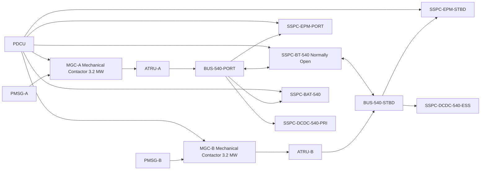
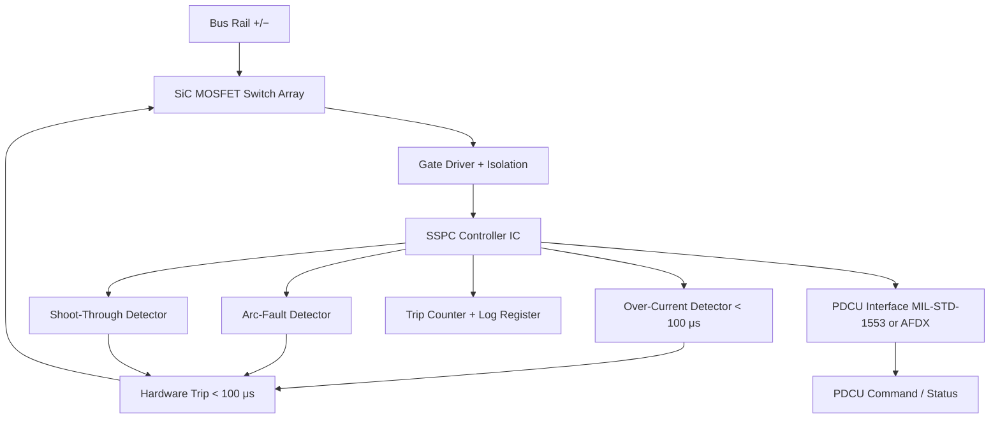

<!-- ──────────────────────────────────────────────────────────────────────────
     QATL-ATLAS-1000-ATLAS-070-079-07-073-040-SSPC-CONTACTORS-BREAKERS-AND-PROTECTION
     ATA 73 · SSPC Contactors Breakers and Protection
     AMPEL360E eWTW — ATLAS Register 1000
────────────────────────────────────────────────────────────────────────────── -->

# SSPC Contactors Breakers and Protection

---

## §0 Hyperlink Policy

> All hyperlinks in this document are **relative** (five directory levels: `../../../../../`).
> Absolute URLs are forbidden. Every linked document must exist in the Q+ATLANTIDE repository
> before the link is activated. Broken links are treated as open issues and must be resolved
> before the document is promoted from `DRAFT` to `APPROVED`.

---

## §1 Purpose

This document describes the switching and protection architecture of the AMPEL360E eWTW HVDC power distribution network, covering Solid State Power Controllers (SSPCs) on both the 540 V and 270 V buses, the Main Generator Contactors (MGC-A/B), pre-charge contactors for capacitive load energisation, and PDCU-managed trip and reconfiguration logic.

SSPCs replace all legacy thermal circuit breakers and electromechanical contactors on the HVDC buses (except the MGC-A/B at the PMSG/ATRU interface, which remain mechanical due to the extreme 3.2 MW current rating and vibration environment). SSPCs provide arc-flash-free semiconductor switching with over-current trip response under 100 μs, remote commanding by the PDCU, and integrated fault logging for predictive maintenance.

---

## §2 Applicability

| Parameter | Value |
|---|---|
| Aircraft Program | AMPEL360E eWTW |
| ATA reference | ATA 73-040 — SSPC Contactors Breakers and Protection |
| Certification basis | EASA CS-25 Amdt 27+ |
| S1000D SNS | 073-040-00 |

---

## §3 Functional Description ![DRAFT]

**540 V SSPCs:** Three SSPC positions on each 540 V bus:
- SSPC-EPM-PORT / SSPC-EPM-STBD: feeds EPM variable frequency drive; rated ~3 MW per unit.
- SSPC-BT-540: bus tie SSPC between port and stbd 540 V buses; normally open.
- SSPC-BAT-540: battery DCDC-BAT interface SSPC; rated 800 kW peak.
- SSPC-DCDC-540-PRI / SSPC-DCDC-540-ESS: feed to each 540→270 V converter.

**270 V SSPCs:** Per-load SSPCs on each 270 V bus:
- SSPC-EAC-A / SSPC-EAC-B: feeds EAC motor drives (~350 A each).
- SSPC-EHA-PORT, SSPC-EHA-STBD: feeds actuator bus zones (~200 A each).
- SSPC-AVI-A, SSPC-AVI-B: feeds avionics ATRU groups (~120 A each).
- SSPC-NGS: feeds NGS blower (~60 A).
- SSPC-BT-270: bus-tie SSPC between primary and essential 270 V buses; normally open.

**MGC-A/B (Mechanical):** The Main Generator Contactors at the PMSG/ATRU interface are mechanical vacuum contactors rated 3.2 MW, retained due to vibration environment at the nacelle junction box and the extreme fault current levels. MGC open/close is PDCU-commanded via discrete wire; SSPC protection is not applicable at this fault current level.

**Pre-charge contactors:** For capacitive load buses (540 V and 270 V bus capacitor banks), dedicated pre-charge resistor-contactor assemblies limit bus energisation inrush to ≤ 120 % rated current. Pre-charge contactor closes first; main SSPC closes after bus reaches 80 % nominal voltage; pre-charge contactor then opens.

---

## §4 Functional Breakdown

| ID | Name | Description | Lead Division |
|---|---|---|---|
| F-001 | 540 V SSPCs | EPM drive, battery interface, bus tie, and DCDC feed SSPCs on 540 V buses | Q-GREENTECH |
| F-002 | 270 V SSPCs | Per-load SSPCs for EAC-A/B, actuator buses, avionics, NGS, and bus tie on 270 V buses | Q-MECHANICS |
| F-003 | Main generator contactors MGC-A/B | Mechanical vacuum contactors at PMSG/ATRU interface; 3.2 MW rated; PDCU commanded | Q-MECHANICS |
| F-004 | Pre-charge logic | Pre-charge resistor-contactor for 540 V and 270 V bus capacitor banks; limits inrush | Q-INDUSTRY |
| F-005 | SSPC trip and reconfiguration | PDCU-managed over-current / arc-fault / shoot-through protection; trip-log and auto-reconfigure | Q-HPC |

---

## §5 System Context — Mermaid Diagram

---

## §6 Internal Architecture — Mermaid Diagram

---

## §7 Components and LRUs

| Component | Part Number | Qty | Location | Maintenance Interval | Notes |
|---|---|---|---|---|---|
| SSPC-EPM-PORT (540 V, ~3 MW) | SSPC-EPM-P-PN-TBD | 1 | EE bay power panel | A-check trip-count review | SiC MOSFET; over-current < 100 μs |
| SSPC-EPM-STBD (540 V, ~3 MW) | SSPC-EPM-S-PN-TBD | 1 | EE bay power panel | A-check trip-count review | Identical to port |
| SSPC-BT-540 (540 V bus tie) | SSPC-BT-540-PN-TBD | 1 | EE bay power panel | A-check functional test | Normally open; PDCU commanded |
| SSPC-BAT-540 (800 kW peak) | SSPC-BAT-PN-TBD | 1 | EE bay power panel | A-check trip-count review | Battery interface SSPC |
| SSPC-EAC-A (270 V, 350 A) | SSPC-EAC-A-PN-TBD | 1 | EE bay power panel | A-check trip-count review | EAC-A motor drive feed |
| SSPC-EAC-B (270 V, 350 A) | SSPC-EAC-B-PN-TBD | 1 | EE bay power panel | A-check trip-count review | Identical to SSPC-EAC-A |
| SSPC-EHA-PORT/STBD (270 V, 200 A) | SSPC-EHA-PN-TBD | 2 | EE bay power panel | A-check functional test | One per actuator bus zone |
| SSPC-AVI-A/B (270 V, 120 A) | SSPC-AVI-PN-TBD | 2 | EE bay power panel | C-check | One per avionics group |
| SSPC-NGS (270 V, 60 A) | SSPC-NGS-PN-TBD | 1 | EE bay power panel | C-check | NGS blower feed |
| SSPC-BT-270 (270 V bus tie) | SSPC-BT-270-PN-TBD | 1 | EE bay power panel | A-check functional test | Normally open; PDCU commanded |
| MGC-A Vacuum Contactor | MGC-A-PN-TBD | 1 | Port nacelle junction box | On condition; C-check contact inspection | 3.2 MW; mechanical vacuum type |
| MGC-B Vacuum Contactor | MGC-B-PN-TBD | 1 | Stbd nacelle junction box | On condition; C-check contact inspection | Identical to MGC-A |
| Pre-Charge Assembly (540 V) | PRECHARGE-540-PN-TBD | 2 | EE bay | C-check resistor value verify | One per 540 V bus |
| Pre-Charge Assembly (270 V) | PRECHARGE-270-PN-TBD | 2 | EE bay | C-check resistor value verify | One per 270 V bus |

---

## §8 Interfaces

| Interface Type | Connected System | Protocol / Medium | Data / Function |
|---|---|---|---|
| ATA 73-010 | 540 V High Voltage Buses | Embedded on bus | SSPC switching controls bus topology |
| ATA 73-020 | 270 V Secondary Buses | Embedded on bus | Per-load SSPC protection and control |
| ATA 73-080 PDCU | Power Distribution Control Unit | MIL-STD-1553 / AFDX ARINC 664 | SSPC command, status, trip log |
| ATA 72 EPM drives | Electric Propulsion Motor VFD | SSPC output rail 540 V | Traction power switched by SSPC-EPM |
| ATA 66 EAC drives | EAC-A/B PMSM drives | SSPC output rail 270 V | EAC power switched by SSPC-EAC |
| ATA 27 Actuators | EHA/EBHA drives | SSPC output rail 270 V | Actuator power switched by SSPC-EHA |
| ATA 45 CMS | Central Maintenance System | AFDX | SSPC trip-count, fault codes, health data |

---

## §9 Operating Modes

| Mode | Trigger | System State | Actions / Consequences |
|---|---|---|---|
| Normal operation | All buses healthy | All SSPCs closed per normal config; bus ties open | PDCU monitors all SSPC states; logs baseline |
| Over-current fault | Load fault > trip threshold | SSPC hardware trip < 100 μs | SSPC opens; PDCU logs trip; ECAM caution |
| Arc-fault detection | Arc signature on bus | SSPC arc-fault detector triggers trip | SSPC opens immediately; PDCU logs; ECAM warning |
| Bus tie closure | Source failure — PDCU commanded | Bus tie SSPC (540 V or 270 V) closes | Cross-bus feed restored; PDCU load-sheds if needed |
| Pre-charge sequence | Bus energisation | Pre-charge contactor closes; bus rises; main SSPC closes | Inrush ≤ 120 % rated; bus at 80 % before main SSPC |
| Load shed | Source degraded; PDCU load management | Non-essential SSPCs opened in priority order | Essential loads retained; ECAM load-shed advisory |

---

## §10 Performance and Budgets ![DRAFT]

| Parameter | Requirement | Target / Design Value | Status |
|---|---|---|---|
| SSPC over-current trip response | ≤ 100 μs | ≤ 80 μs target | ![TBD] |
| SSPC shoot-through protection | < 1 μs gate drive inhibit | < 500 ns target | ![TBD] |
| MGC open time (fault condition) | ≤ 10 ms | ≤ 5 ms target | ![TBD] |
| Pre-charge inrush limit | ≤ 150 % rated current | ≤ 120 % | ![TBD] |
| SSPC trip-count life limit | ≥ 100 000 cycles | ≥ 150 000 design | ![TBD] |
| SSPC on-state voltage drop (540 V) | ≤ 0.5 V at rated current | ≤ 0.3 V SiC target | ![TBD] |

---

## §11 Safety, Redundancy and Fault Tolerance

- Hardware over-current trip (< 100 μs) is independent of PDCU software — fault protection does not rely on software intervention.
- Arc-fault detection prevents sustained arcing that could cause busbar insulation damage or fire in the EE bay.
- Shoot-through protection on SiC MOSFET gate drivers prevents cross-conduction faults in back-to-back SSPC configurations.
- MGC-A/B rated to break full ATRU fault current (≥ 20 kA peak); SSPC is not required to interrupt at this level.
- Pre-charge sequence prevents voltage step-stress on bus capacitor banks, extending capacitor lifetime and preventing mechanical shock to busbars.
- SSPC trip-count tracking in PDCU enables condition-based replacement before end of rated cycle life — proactive, not reactive.
- All SSPC maintenance requires HVDC LOTO; power-on SSPC replacement is prohibited.

---

## §12 Maintenance and Diagnostics

| Task | Interval | Access | Special Tools |
|---|---|---|---|
| SSPC trip-count review (all units) | A-check | CMS terminal | CMS GSE terminal |
| Bus tie SSPC functional test (540 V and 270 V) | A-check | PDCU GSE command | SSPC test console |
| MGC-A/B contact resistance check | C-check | Nacelle junction box | Contact resistance test set (≤ 50 μΩ) |
| Pre-charge resistor value verification | C-check | EE bay panel | Precision ohmmeter |
| SSPC full functional test (open/close/trip sim) | C-check | PDCU GSE | SSPC test console + fault injection tool |
| SSPC LRU replacement | On condition (trip-count > 80 % life) | EE bay power panel | HVDC isolation kit; anti-static tools |

---

## §13 Footprint

| Footprint Type | Parameter | Value | Notes |
|---|---|---|---|
| Physical | SSPC panel mass (all units, estimated) | ![TBD] | Pending OEM design |
| Physical | MGC mass (each) | ![TBD] | Pending OEM |
| Electrical | Total SSPC on-state loss (estimated) | ![TBD] | Sum of all SSPC voltage drops × current |
| Maintenance | SSPC LRU swap time | ~1 h | EE bay panel access; LOTO required |
| Data | SSPC trip-count data rate | ![TBD] | Per AFDX load analysis |

---

## §14 Safety and Certification References ![DRAFT]

| Standard / Document | Title | Issuing Body | Applicability |
|---|---|---|---|
| SAE AS50881 | Wiring Aerospace Vehicle | SAE | SSPC installation and cable protection |
| MIL-STD-1553 | Digital Time Division Command/Response Multiplex Data Bus | MIL | SSPC data interface to PDCU |
| DO-160G | Environmental Conditions and Test Procedures | RTCA | SSPC environmental qualification |
| EASA CS-25 §25.1353 | Electrical equipment and installations | EASA | Protection and fault isolation for HVDC |
| SAE ARP4761 | Guidelines and Methods for the Conduct of the Safety Assessment Process | SAE | FHA for SSPC loss scenarios |

---

## §15 V&V Approach ![TBD]

| Phase | Method | Acceptance Criterion | Status |
|---|---|---|---|
| Design | SPICE simulation — SSPC trip response and inrush model | Trip < 100 μs; inrush ≤ 120 % | ![TBD] |
| Unit | SSPC bench test — over-current / arc-fault / shoot-through injection | All protection functions trigger within spec | ![TBD] |
| Unit | MGC bench test — contact resistance and break time | Contact ≤ 50 μΩ; break ≤ 5 ms | ![TBD] |
| Integration | Ground rig — PDCU SSPC command/status loop | All SSPCs respond within 10 ms to PDCU command | ![TBD] |
| Qualification | DO-160G — vibration, thermal, EMI for SSPC and MGC | All categories pass | ![TBD] |

---

## §16 Glossary

| Term | Definition |
|---|---|
| **SSPC** | Solid State Power Controller — semiconductor-based power switch with integrated protection. |
| **MGC** | Main Generator Contactor — mechanical vacuum contactor at PMSG/ATRU interface; 3.2 MW. |
| **Arc-fault detection** | Electronic detection of arc signatures (high-frequency current transients) indicating arcing faults. |
| **Shoot-through** | Simultaneous conduction of both switches in a half-bridge; SSPC gate driver inhibits this condition. |
| **Trip-count** | Number of fault-triggered switch-off events; tracked for condition-based SSPC replacement. |
| **Pre-charge** | Controlled resistive bus energisation to limit inrush current into bus capacitors. |
| **Load shed** | PDCU-commanded opening of non-essential SSPCs to reduce bus loading under degraded source condition. |
| **Over-current trip** | Hardware-level SSPC shutdown on current exceeding threshold; < 100 μs response. |
| **SiC MOSFET** | Silicon-Carbide switch enabling low voltage drop, high-speed switching in SSPC. |
| **DAL** | Design Assurance Level — PDCU SSPC command software is DAL B per DO-178C. |

---

## §17 Open Issues

| ID | Description | Owner | Target |
|---|---|---|---|
| OI-073-040-001 | Define SSPC-EPM 540 V current rating with EPM VFD OEM (fault current and steady-state load) | Q-MECHANICS | 2026-Q4 |
| OI-073-040-002 | Confirm MGC-A/B fault-break current rating with ATRU OEM (prospective short-circuit current) | Q-GREENTECH | 2026-Q4 |
| OI-073-040-003 | Establish SSPC trip-count life limit with SSPC OEM and integrate into PDCU SSPC register | Q-HPC | 2027-Q1 |

---

## §18 Status Legend

| Badge | Meaning |
|---|---|
| `![DRAFT]` | Section is drafted but not yet reviewed |
| `![TBD]` | Content not yet started — to be defined |
| `![To Be Completed]` | Partially complete — needs additional content |
| `![APPROVED]` | Reviewed and formally approved |

---

## §19 Related Documents (Siblings in this Subsection)

- [073-000](./073-000-Power-Distribution-MV-HV-General.md)
- [073-010](./073-010-High-Voltage-Distribution-Architecture.md)
- [073-020](./073-020-Medium-Voltage-Distribution-Architecture.md)
- [073-030](./073-030-Power-Electronics-Converters-and-Rectifiers.md)
- [073-050](./073-050-HVDC-Busbars-Cables-and-Connectors.md)
- [073-060](./073-060-Insulation-Monitoring-and-Ground-Fault-Detection.md)
- [073-070](./073-070-Power-Distribution-Test-and-Maintenance.md)
- [073-080](./073-080-Power-Distribution-Monitoring-Diagnostics-and-Control-Interfaces.md)
- [073-090](./073-090-S1000D-CSDB-Mapping-and-Traceability.md)

---

## §20 Change Log

| Rev | Date | Author | Description |
|---|---|---|---|
| 0.1 | 2026-05-11 | @copilot | Initial DRAFT — SSPC, MGC, pre-charge and protection architecture for AMPEL360E eWTW HVDC |
