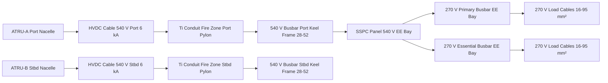
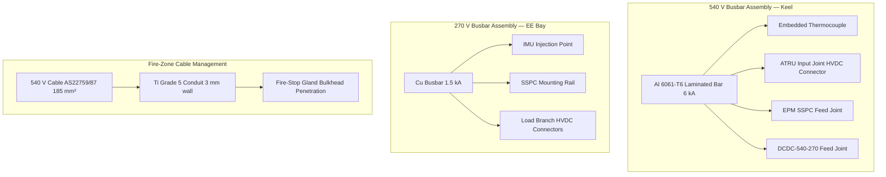

<!-- ──────────────────────────────────────────────────────────────────────────
     QATL-ATLAS-1000-ATLAS-070-079-07-073-050-HVDC-BUSBARS-CABLES-AND-CONNECTORS
     ATA 73 · HVDC Busbars Cables and Connectors
     AMPEL360E eWTW — ATLAS Register 1000
────────────────────────────────────────────────────────────────────────────── -->

# HVDC Busbars Cables and Connectors

---

## §0 Hyperlink Policy

> All hyperlinks in this document are **relative** (five directory levels: `../../../../../`).
> Absolute URLs are forbidden. Every linked document must exist in the Q+ATLANTIDE repository
> before the link is activated. Broken links are treated as open issues and must be resolved
> before the document is promoted from `DRAFT` to `APPROVED`.

---

## §1 Purpose

This document describes the physical HVDC power distribution infrastructure of the AMPEL360E eWTW: the 540 V and 270 V busbars, HVDC power cables, signal/control cables, connector standards, and cable routing segregation and fire-zone shielding requirements.

The physical infrastructure must safely carry continuous currents up to 6 kA on the 540 V buses and up to 1.5 kA on the 270 V buses, while ensuring electrical segregation between voltage tiers, mechanical protection in fire zones (engine pylons), and maintainability per SAE AS50881 and CS-25 §25.1353.

---

## §2 Applicability

| Parameter | Value |
|---|---|
| Aircraft Program | AMPEL360E eWTW |
| ATA reference | ATA 73-050 — HVDC Busbars Cables and Connectors |
| Certification basis | EASA CS-25 Amdt 27+ |
| S1000D SNS | 073-050-00 |

---

## §3 Functional Description ![DRAFT]

**540 V Busbars:** Two aluminium alloy (6061-T6) laminated busbars, one per 540 V bus (port/stbd), rated 6 kA continuous. Located in the lower fuselage keel structure between Frames 28 and 52, providing a short, low-resistance path between ATRUs, the EPM SSPC panel, and the DCDC-540-270 converters. Busbar cross-section designed for ≤ 0.5 mΩ/m resistance; thermally monitored by embedded thermocouple sensors reported to PDCU.

**270 V Busbars:** Copper busbars rated 1.5 kA continuous, located in the EE bay (standard aircraft EE bay, forward fuselage). Copper selected for its lower resistance and compatibility with EE bay connectors. Two busbar assemblies (primary and essential), each fitted with IMU injection points and SSPC panel mounting rails.

**HVDC Power Cables:** PTFE-insulated, single-conductor shielded cables per SAE AS22759/87, rated for 600 V DC service (derated to 540 V per MIL-STD-704F). Each cable assembly is a fully shielded coaxial construction (power conductor + shield return) reducing stray magnetic fields. Cable cross-sections range from 185 mm² (ATRU → busbar, ~6 kA) down to 16 mm² (270 V load branches, ~60 A).

**Control / Signal Cables:** Shielded twisted-pair (STP) per AS22759/87 for SSPC gate commands, PDCU discrete signals, and IMU data cables. Connector standard: MIL-DTL-38999 Series III for signal and control wiring.

**Power Connectors:** Custom high-power orange-coded HVDC connectors at all serviceable joints (ATRU output, busbar junction boxes, DCDC module interfaces). Connector concept references IEC 62196 mechanical keying and colour coding principles, with additional HVDC-specific features: mandatory dead-front shroud, sequential mating (grounding pin first), and a pull-to-mate locking collar rated to MIL-DTL-38999 vibration environments.

**Cable Routing Segregation:** 540 V power cables routed ≥ 150 mm from all 270 V and avionics wiring bundles. In engine pylons (designated fire zones), 540 V cables enclosed in titanium alloy conduit (Grade 5, 3 mm wall) providing mechanical protection and fire resistance.

---

## §4 Functional Breakdown

| ID | Name | Description | Lead Division |
|---|---|---|---|
| F-001 | 540 V busbar assembly | Aluminium laminated busbars, 6 kA rated, lower fuselage keel; embedded thermocouple monitoring | Q-GREENTECH |
| F-002 | 270 V busbar assembly | Copper busbars, 1.5 kA rated, EE bay; IMU injection point and SSPC panel mounting | Q-MECHANICS |
| F-003 | HVDC power cable routing | SAE AS22759/87 PTFE-insulated shielded cables; 185 mm² to 16 mm²; routed per segregation rules | Q-INDUSTRY |
| F-004 | Connector and termination management | Orange-coded HVDC power connectors; MIL-DTL-38999 Series III for signal; torque-verified joints | Q-MECHANICS |
| F-005 | Cable segregation and fire-zone shielding | ≥ 150 mm segregation; titanium conduit in pylon fire zones | Q-AIR |

---

## §5 System Context — Mermaid Diagram

---

## §6 Internal Architecture — Mermaid Diagram

---

## §7 Components and LRUs

| Component | Part Number | Qty | Location | Maintenance Interval | Notes |
|---|---|---|---|---|---|
| 540 V Busbar Assembly — Port | BB-540-P-PN-TBD | 1 | Keel Frames 28–52, port | C-check torque + visual | Al 6061-T6; 6 kA; embedded thermocouple |
| 540 V Busbar Assembly — Stbd | BB-540-S-PN-TBD | 1 | Keel Frames 28–52, stbd | C-check torque + visual | Identical to port unit |
| 270 V Primary Busbar Assembly | BB-270-PRI-PN-TBD | 1 | EE bay, fwd fuselage | C-check torque + visual | Cu; 1.5 kA |
| 270 V Essential Busbar Assembly | BB-270-ESS-PN-TBD | 1 | EE bay, fwd fuselage | C-check torque + visual | Identical to primary unit |
| HVDC Power Cable — ATRU to Busbar (185 mm², ×4) | CABLE-185-PN-TBD | 4 | Pylon + keel | C-check insulation resistance | SAE AS22759/87; PTFE; Ti conduit section |
| HVDC Connector Assembly (ATRU interface, ×4) | CONN-ATRU-PN-TBD | 4 | Pylon / keel junction box | C-check connector inspect | Orange-coded; dead-front shroud; IEC 62196-concept |
| Titanium Conduit Assembly (port pylon) | TI-COND-P-PN-TBD | 1 | Port engine pylon | C-check visual + integrity | Grade 5 Ti; 3 mm wall; fire zone |
| Titanium Conduit Assembly (stbd pylon) | TI-COND-S-PN-TBD | 1 | Stbd engine pylon | C-check visual + integrity | Identical to port unit |

---

## §8 Interfaces

| Interface Type | Connected System | Protocol / Medium | Data / Function |
|---|---|---|---|
| ATA 73-010 | 540 V buses and ATRU outputs | Busbar rails + HVDC cables | Physical 540 V power path |
| ATA 73-020 | 270 V buses and DCDC outputs | Busbar rails + HVDC cables | Physical 270 V power path |
| ATA 73-040 | SSPC and contactor assemblies | Busbar mounting and cable feeds | SSPC mechanical mounting on busbar rails |
| ATA 73-060 | IMU insulation monitoring | Copper bonding conductor + injection point | IMU measurement point on busbar |
| ATA 73-080 PDCU | Busbar thermocouple monitoring | Discrete analogue signal | Busbar temperature reported to PDCU |
| Fuselage structure (keel) | Aircraft primary structure | Mechanical fasteners | Busbar mounting; electrical bonding strap |

---

## §9 Operating Modes

| Mode | Trigger | System State | Actions / Consequences |
|---|---|---|---|
| Normal power | All buses energised | Busbars at rated current; cables at operating temperature | Thermocouple data to PDCU; cable temp ≤ 85 °C |
| HVDC LOTO | Maintenance access required | All buses de-energised; SSPCs open; MGC open | Capacitor discharge ≤ 50 V verified; LOTO applied |
| Cable over-temperature | Busbar thermocouple > 100 °C | PDCU alert; load-shed commanded | SSPC opens load; PDCU logs over-temperature event |
| Connector demate | ATRU replacement | HVDC LOTO applied; connector unmated | Dead-front shroud prevents accidental contact |
| Fire-zone integrity loss | Pylon damage (inspection finding) | LOTO; titanium conduit inspected | Aircraft grounded until conduit integrity restored |

---

## §10 Performance and Budgets ![DRAFT]

| Parameter | Requirement | Target / Design Value | Status |
|---|---|---|---|
| 540 V busbar resistance | ≤ 0.5 mΩ/m | ≤ 0.3 mΩ/m Al 6061-T6 | ![TBD] |
| 540 V busbar current rating | ≥ 6 kA continuous | 6 kA | ![TBD] |
| 270 V busbar current rating | ≥ 1.5 kA continuous | 1.5 kA | ![TBD] |
| HVDC cable insulation resistance | ≥ 1 MΩ (hot, post-flight) | ≥ 10 MΩ design target | ![TBD] |
| Cable routing segregation | ≥ 150 mm from lower voltage wiring | ≥ 150 mm; 200 mm target | ![TBD] |
| Fire zone cable survival | CS-25 Appendix F Part III fire test | Titanium conduit 15 min protection | ![TBD] |

---

## §11 Safety, Redundancy and Fault Tolerance

- Titanium Grade 5 conduit in pylon fire zones provides ≥ 15 min protection for 540 V cables against fire per CS-25 Appendix F Part III requirements.
- 540 V and 270 V busbars are physically separated (keel vs EE bay) preventing common-cause damage from localised fire or fluid ingress.
- Orange colour coding and dead-front connector shrouds prevent inadvertent contact with energised HVDC connectors during maintenance.
- Busbar embedded thermocouples provide continuous temperature monitoring; PDCU load-shed prevents busbar overload before thermal damage.
- Cable segregation (≥ 150 mm) prevents arc-fault propagation between 540 V power cables and avionics/signal wiring.
- All busbar joints are torque-verified (calibrated torque wrench) at installation and C-check; contact resistance ≤ 50 μΩ per joint.
- IMU injection points on busbars enable in-situ insulation monitoring without disconnecting the bus.

---

## §12 Maintenance and Diagnostics

| Task | Interval | Access | Special Tools |
|---|---|---|---|
| Busbar visual inspection (all joints, insulation) | C-check | Keel access panel / EE bay | Inspection mirror; borescope |
| Busbar joint torque verification | C-check | Keel / EE bay | Calibrated torque wrench set (per joint torque table) |
| HVDC cable insulation resistance test | C-check | Cable end connectors | HVDC insulation tester (500 V DC rated) |
| Titanium conduit integrity inspection | C-check | Pylon access | Torque wrench; dye penetrant kit for cracks |
| Connector inspection — dead-front and locking collar | C-check | All HVDC connector access points | Connector inspection kit |
| Busbar thermocouple check | A-check via PDCU | PDCU BITE output | CMS terminal |

---

## §13 Footprint

| Footprint Type | Parameter | Value | Notes |
|---|---|---|---|
| Physical | 540 V busbar mass (each) | ![TBD] | Al 6061-T6; pending cross-section final design |
| Physical | 270 V busbar mass (each) | ![TBD] | Cu; pending |
| Physical | Ti conduit mass (port pylon) | ![TBD] | Grade 5 Ti; 3 mm wall; ~3 m length estimated |
| Electrical | 540 V cable weight per metre (185 mm²) | ![TBD] | SAE AS22759/87 PTFE |
| Maintenance | Busbar C-check access time | ~6 h | Keel + EE bay combined |
| Data | Busbar thermocouple data rate | ![TBD] | Per PDCU analogue input rate |

---

## §14 Safety and Certification References ![DRAFT]

| Standard / Document | Title | Issuing Body | Applicability |
|---|---|---|---|
| SAE AS50881 | Wiring Aerospace Vehicle | SAE | Cable sizing, routing, and segregation |
| SAE AS22759/87 | Wire, Electrical, Fluoropolymer-Insulated, Shielded | SAE | HVDC cable insulation specification |
| EASA CS-25 §25.1353 | Electrical equipment and installations | EASA | Wiring protection and fault isolation |
| CS-25 Appendix F Part III | Fire protection — powerplant zone | EASA | Ti conduit fire survival requirement |
| MIL-DTL-38999 Series III | Connector, Electrical, Circular Threaded | US DoD | Signal and control connector standard |
| IEC 62196 | Plugs, socket-outlets for electric vehicles | IEC | Conceptual reference for HVDC connector keying/colour coding |
| MIL-STD-704F | Aircraft Electrical Power Characteristics | US DoD | HVDC cable voltage rating reference |

---

## §15 V&V Approach ![TBD]

| Phase | Method | Acceptance Criterion | Status |
|---|---|---|---|
| Design | Busbar resistance analysis; cable ampacity calculation per AS50881 | Busbar ≤ 0.5 mΩ/m; cable ≤ 85 °C at rated current | ![TBD] |
| Unit | Busbar joint resistance test at installation | ≤ 50 μΩ per joint | ![TBD] |
| Unit | HVDC cable insulation resistance test | ≥ 1 MΩ cold; ≥ 1 MΩ hot (post-qualification thermal cycle) | ![TBD] |
| Integration | Full system ground power-up — busbar temperature monitoring | Thermocouple data consistent with analysis; no anomalies | ![TBD] |
| Qualification | CS-25 Appendix F Part III fire test on Ti conduit assembly | Conduit protects cable for ≥ 15 min | ![TBD] |

---

## §16 Glossary

| Term | Definition |
|---|---|
| **Busbar** | Rigid metal conductor distributing power from a source to multiple loads. |
| **Al 6061-T6** | Aluminium alloy temper used for 540 V busbars; good conductivity and strength. |
| **SAE AS22759/87** | PTFE-insulated aerospace wire standard; used for HVDC power cables. |
| **Dead-front connector** | Connector design where no live metal is accessible when unmated; required for HVDC connectors. |
| **IEC 62196** | International standard for EV connectors; colour coding and keying principles referenced for HVDC. |
| **MIL-DTL-38999 Series III** | Threaded circular connector standard for signal and control wiring. |
| **Titanium conduit** | Grade 5 Ti tube protecting 540 V cables in engine pylon fire zones. |
| **Segregation** | Physical separation (≥ 150 mm) between different voltage level cable bundles. |
| **Torque verification** | Confirmation of joint torque at installation and C-check to ensure low contact resistance. |
| **IMU injection point** | Physical connection on busbar enabling AC current injection for insulation monitoring. |

---

## §17 Open Issues

| ID | Description | Owner | Target |
|---|---|---|---|
| OI-073-050-001 | Confirm 540 V busbar cross-section (Al 6061-T6) with final ATRU and EPM current specifications | Q-MECHANICS | 2026-Q4 |
| OI-073-050-002 | Qualify titanium conduit assembly per CS-25 Appendix F Part III — test article procurement | Q-AIR | 2027-Q1 |
| OI-073-050-003 | Define HVDC connector standard (IEC 62196-based) and obtain DO-160G qualification from connector OEM | Q-INDUSTRY | 2027-Q1 |

---

## §18 Status Legend

| Badge | Meaning |
|---|---|
| `![DRAFT]` | Section is drafted but not yet reviewed |
| `![TBD]` | Content not yet started — to be defined |
| `![To Be Completed]` | Partially complete — needs additional content |
| `![APPROVED]` | Reviewed and formally approved |

---

## §19 Related Documents (Siblings in this Subsection)

- [073-000](./073-000-Power-Distribution-MV-HV-General.md)
- [073-010](./073-010-High-Voltage-Distribution-Architecture.md)
- [073-020](./073-020-Medium-Voltage-Distribution-Architecture.md)
- [073-030](./073-030-Power-Electronics-Converters-and-Rectifiers.md)
- [073-040](./073-040-SSPC-Contactors-Breakers-and-Protection.md)
- [073-060](./073-060-Insulation-Monitoring-and-Ground-Fault-Detection.md)
- [073-070](./073-070-Power-Distribution-Test-and-Maintenance.md)
- [073-080](./073-080-Power-Distribution-Monitoring-Diagnostics-and-Control-Interfaces.md)
- [073-090](./073-090-S1000D-CSDB-Mapping-and-Traceability.md)

---

## §20 Change Log

| Rev | Date | Author | Description |
|---|---|---|---|
| 0.1 | 2026-05-11 | @copilot | Initial DRAFT — HVDC busbars, cables, connectors and routing for AMPEL360E eWTW |
