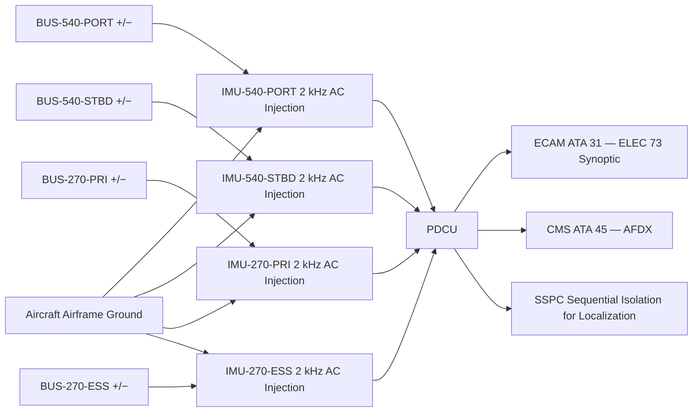
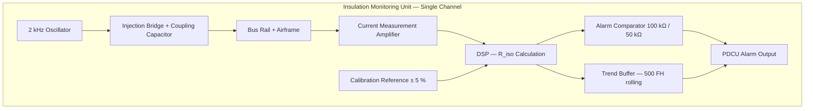

<!-- ──────────────────────────────────────────────────────────────────────────
     QATL-ATLAS-1000-ATLAS-070-079-07-073-060-INSULATION-MONITORING-AND-GROUND-FAULT-DETECTION
     ATA 73 · Insulation Monitoring and Ground Fault Detection
     AMPEL360E eWTW — ATLAS Register 1000
────────────────────────────────────────────────────────────────────────────── -->

# Insulation Monitoring and Ground Fault Detection

---

## §0 Hyperlink Policy

> All hyperlinks in this document are **relative** (five directory levels: `../../../../../`).
> Absolute URLs are forbidden. Every linked document must exist in the Q+ATLANTIDE repository
> before the link is activated. Broken links are treated as open issues and must be resolved
> before the document is promoted from `DRAFT` to `APPROVED`.

---

## §1 Purpose

This document describes the Insulation Monitoring and Ground Fault Detection system for the AMPEL360E eWTW HVDC power distribution network. The AMPEL360E HVDC networks (both 540 V and 270 V) are **isolated from airframe ground** (IT network topology, IEC 60364-1 classification: IT DC). In this topology, a single ground fault does not immediately cause an over-current trip, but it reduces the safety margin against a second fault. Insulation Monitoring Units (IMUs) continuously detect insulation degradation before a fault develops, enabling corrective maintenance before any safety hazard arises.

Four IMUs are installed — one per bus segment (IMU-540-PORT, IMU-540-STBD, IMU-270-PRI, IMU-270-ESS). Each IMU uses a 2 kHz AC injection method to measure insulation resistance between the HVDC rail pair (+/−) and the aircraft airframe. Alarms at < 100 kΩ (warning) and < 50 kΩ (caution) are reported to the PDCU and ECAM.

---

## §2 Applicability

| Parameter | Value |
|---|---|
| Aircraft Program | AMPEL360E eWTW |
| ATA reference | ATA 73-060 — Insulation Monitoring and Ground Fault Detection |
| Certification basis | EASA CS-25 Amdt 27+ |
| S1000D SNS | 073-060-00 |

---

## §3 Functional Description ![DRAFT]

**AC Injection Method:** Each IMU injects a low-level 2 kHz AC signal between the bus positive rail and the airframe, and separately between the negative rail and the airframe. The resulting AC current through the insulation path is measured; insulation resistance R_iso is calculated from the injected voltage and measured current. The 2 kHz frequency is selected to be well above the DC bus frequency (DC) and below the SSPC gate drive noise spectrum, providing reliable insulation measurement in service.

**Alarm Thresholds:**
- R_iso < 100 kΩ: **Warning** — insulation degrading; maintenance action required at next opportunity. ECAM advisory message; PDCU logs event with timestamp.
- R_iso < 50 kΩ: **Caution** — insulation critically degraded; ground fault risk elevated. ECAM caution; PDCU triggers bus reconfiguration (load shed) to reduce risk; maintenance action required before next departure.

**Ground Fault Localization:** On detection of an alarm, the PDCU can initiate a localization sequence: pulsed DC injection with node-by-node bus segment isolation (opening SSPCs sequentially) to identify which load branch has the degraded insulation. This reduces the maintenance footprint to the affected branch without de-powering the entire bus.

**Insulation Resistance Trending:** PDCU logs R_iso values with timestamps for each IMU. A declining trend (e.g., > 10 % degradation per 100 FH) triggers a PDCU predictive maintenance advisory to CMS before the warning threshold is reached.

---

## §4 Functional Breakdown

| ID | Name | Description | Lead Division |
|---|---|---|---|
| F-001 | 540 V IMU port and stbd | IMU-540-PORT and IMU-540-STBD; 2 kHz AC injection; monitors BUS-540-PORT and BUS-540-STBD | Q-GREENTECH |
| F-002 | 270 V IMU primary and essential | IMU-270-PRI and IMU-270-ESS; 2 kHz AC injection; monitors both 270 V bus segments | Q-GREENTECH |
| F-003 | Ground fault localization | PDCU-commanded SSPC sequential isolation to localize faulted branch | Q-HPC |
| F-004 | Insulation resistance trending | PDCU stores R_iso time-series; predictive maintenance advisory at > 10 % degradation/100 FH | Q-HPC |
| F-005 | ECAM / PDCU integration | IMU alarms reported to ECAM synoptic "ELEC 73" and CMS ATA 45 via AFDX; calibration date tracked | Q-INDUSTRY |

---

## §5 System Context — Mermaid Diagram

---

## §6 Internal Architecture — Mermaid Diagram

---

## §7 Components and LRUs

| Component | Part Number | Qty | Location | Maintenance Interval | Notes |
|---|---|---|---|---|---|
| IMU-540-PORT | IMU-540-P-PN-TBD | 1 | EE bay, 540 V port bus panel | Calibration ≤ 24 months | IEC 61557-8 compliant; 2 kHz; 540 V rated |
| IMU-540-STBD | IMU-540-S-PN-TBD | 1 | EE bay, 540 V stbd bus panel | Calibration ≤ 24 months | Identical to port unit |
| IMU-270-PRI | IMU-270-P-PN-TBD | 1 | EE bay, 270 V primary bus panel | Calibration ≤ 24 months | IEC 61557-8 compliant; 2 kHz; 270 V rated |
| IMU-270-ESS | IMU-270-E-PN-TBD | 1 | EE bay, 270 V essential bus panel | Calibration ≤ 24 months | Identical to primary unit |
| IMU Calibration Reference Module | IMU-CAL-PN-TBD | 1 | GSE / maintenance kit | Per calibration cycle | External precision R reference; ± 0.5 % |

---

## §8 Interfaces

| Interface Type | Connected System | Protocol / Medium | Data / Function |
|---|---|---|---|
| ATA 73-010 | BUS-540-PORT and BUS-540-STBD | Coupling capacitor + injection lead on busbar | R_iso measurement on 540 V buses |
| ATA 73-020 | BUS-270-PRI and BUS-270-ESS | Coupling capacitor + injection lead on busbar | R_iso measurement on 270 V buses |
| ATA 73-040 | SSPCs (for localization) | PDCU SSPC command | Sequential branch isolation during fault localization |
| ATA 73-080 PDCU | Power Distribution Control Unit | Discrete alarm + serial data | R_iso values, alarm status, trend data |
| ATA 31 ECAM | Cockpit display | AFDX | R_iso values, warning / caution annunciation on ELEC 73 |
| ATA 45 CMS | Central Maintenance System | AFDX ARINC 664 P7 | Predictive maintenance R_iso trending; calibration due date |
| Aircraft airframe | Structural ground reference | Copper bonding lead | IMU ground reference for insulation measurement |

---

## §9 Operating Modes

| Mode | Trigger | System State | Actions / Consequences |
|---|---|---|---|
| Normal monitoring | Buses energised | All IMUs measuring continuously; R_iso > 100 kΩ | PDCU logs R_iso; no alarms; ECAM normal |
| Warning (R_iso 50–100 kΩ) | Insulation degradation | IMU alarm output → PDCU | ECAM advisory; PDCU logs with timestamp; maintenance at next opportunity |
| Caution (R_iso < 50 kΩ) | Severe insulation degradation | IMU caution output → PDCU | ECAM caution; PDCU initiates load shed; maintenance before next departure |
| Fault localization | PDCU localization sequence | SSPCs opened sequentially; R_iso re-measured per branch | Faulted branch identified; minimum bus disruption |
| Predictive advisory | R_iso trend > 10 % / 100 FH | PDCU trend model triggers CMS advisory | CMS generates predictive maintenance message; no ECAM annunciation |
| IMU calibration overdue | Calibration date > 24 months | IMU data flagged as unvalidated in PDCU | CMS advisory: IMU calibration required before measurements valid |

---

## §10 Performance and Budgets ![DRAFT]

| Parameter | Requirement | Target / Design Value | Status |
|---|---|---|---|
| IMU insulation measurement range | 1 kΩ to 10 MΩ | 500 Ω to 20 MΩ target | ![TBD] |
| IMU measurement accuracy | ± 10 % per IEC 61557-8 | ± 5 % target | ![TBD] |
| Warning threshold | ≤ 100 kΩ | 100 kΩ | ![TBD] |
| Caution threshold | ≤ 50 kΩ | 50 kΩ | ![TBD] |
| Injection frequency | 2 kHz (selectable 1–5 kHz) | 2 kHz nominal | ![TBD] |
| IMU response time | ≤ 5 s from fault to alarm output | ≤ 3 s target | ![TBD] |
| Calibration interval | ≤ 24 months | 24 months | ![TBD] |

---

## §11 Safety, Redundancy and Fault Tolerance

- IT network topology (isolated from airframe) means a single insulation fault does not cause immediate over-current trip; IMU provides early warning before the hazardous second-fault condition can develop.
- Four IMUs (one per bus segment) ensure that a fault in one IMU does not leave any bus segment unmonitored; IMU failure reported as PDCU fault and CMS advisory.
- IMU 2 kHz injection is low-energy (< 1 mA AC), posing no hazard to personnel or equipment during normal operation.
- Ground fault localization (branch isolation sequence) minimises bus disruption during maintenance: only the faulted branch is isolated, not the entire bus.
- IMU calibration overdue flag ensures maintenance crews are aware when R_iso measurements cannot be considered validated — preventing dispatch with suspect insulation data.
- R_iso trending provides condition-based alert before threshold breach, enabling proactive cable or connector replacement.

---

## §12 Maintenance and Diagnostics

| Task | Interval | Access | Special Tools |
|---|---|---|---|
| IMU calibration verification | ≤ 24 months | EE bay — IMU calibration port | IMU calibration reference module (± 0.5 %) |
| IMU R_iso trend download and review | A-check | CMS terminal | CMS GSE terminal |
| Manual ground fault localization test | C-check | PDCU GSE command | SSPC test console; PDCU GSE |
| IMU LRU replacement | On condition | EE bay panel | HVDC isolation kit; anti-static tools |
| Airframe bonding lead inspection | C-check | EE bay | Bonding resistance test set (≤ 2.5 mΩ) |

---

## §13 Footprint

| Footprint Type | Parameter | Value | Notes |
|---|---|---|---|
| Physical | IMU mass (each) | ![TBD] | OEM design pending |
| Physical | IMU form factor | ![TBD] | EE bay rack module; estimated 0.5 kg |
| Electrical | IMU injection current | < 1 mA AC | 2 kHz; low-energy; harmless |
| Maintenance | IMU calibration time | ~2 h per unit | EE bay access; reference module connection |
| Data | R_iso log data rate | ![TBD] | Per PDCU data rate |

---

## §14 Safety and Certification References ![DRAFT]

| Standard / Document | Title | Issuing Body | Applicability |
|---|---|---|---|
| IEC 61557-8 | Insulation monitoring devices for IT systems | IEC | IMU performance and accuracy specification |
| IEC 60364-7-710 | Electrical installations of buildings — medical locations | IEC | IT network insulation monitoring reference concept |
| IEC 60364-1 | Low-voltage electrical installations — fundamental principles | IEC | IT network topology definition |
| DO-160G | Environmental Conditions and Test Procedures | RTCA | IMU environmental qualification |
| EASA CS-25 §25.1353 | Electrical equipment and installations | EASA | Protection and isolation in HVDC systems |
| MIL-STD-704F | Aircraft Electrical Power Characteristics | US DoD | HVDC bus quality; IMU measurement basis |

---

## §15 V&V Approach ![TBD]

| Phase | Method | Acceptance Criterion | Status |
|---|---|---|---|
| Design | IMU circuit simulation — R_iso accuracy vs. bus noise | Accuracy ± 5 % over 500 Ω to 20 MΩ range | ![TBD] |
| Unit | IMU bench calibration with precision reference resistors | ± 5 % accuracy at 50 kΩ, 100 kΩ, 1 MΩ reference points | ![TBD] |
| Integration | Ground rig — simulate insulation degradation; IMU alarm test | Alarm within 3 s at 100 kΩ and 50 kΩ; PDCU receives correct data | ![TBD] |
| Integration | Fault localization test — introduce fault on known branch; PDCU isolates | Correct branch identified; other branches unaffected | ![TBD] |
| Qualification | DO-160G — vibration, thermal, EMI for IMU units | All categories pass | ![TBD] |

---

## §16 Glossary

| Term | Definition |
|---|---|
| **IMU** | Insulation Monitoring Unit — device measuring insulation resistance between HVDC bus and airframe. |
| **IT network** | Isolated Terra — network topology where neither bus rail is intentionally connected to earth/airframe. |
| **R_iso** | Insulation resistance — measured value in kΩ or MΩ; degradation indicates potential ground fault. |
| **2 kHz injection** | AC signal injected by IMU to measure insulation resistance without DC component affecting bus loads. |
| **Warning threshold** | R_iso < 100 kΩ — ECAM advisory; insulation degrading. |
| **Caution threshold** | R_iso < 50 kΩ — ECAM caution; ground fault risk elevated; maintenance before next departure. |
| **Ground fault localization** | Sequential SSPC branch isolation to identify the specific load branch with degraded insulation. |
| **Calibration date** | Date of last IMU calibration; must be ≤ 24 months for measurements to be considered valid. |
| **R_iso trending** | Time-series tracking of insulation resistance to predict degradation before threshold breach. |

---

## §17 Open Issues

| ID | Description | Owner | Target |
|---|---|---|---|
| OI-073-060-001 | Confirm IMU measurement accuracy at 540 V bus noise levels with IMU OEM (2 kHz vs. SiC switching noise) | Q-GREENTECH | 2026-Q4 |
| OI-073-060-002 | Define R_iso trend degradation model (threshold for predictive maintenance advisory) with Q-HPC analytics team | Q-HPC | 2027-Q1 |
| OI-073-060-003 | Confirm airframe bonding resistance target (≤ 2.5 mΩ) with structures team for IMU ground reference integrity | Q-INDUSTRY | 2026-Q4 |

---

## §18 Status Legend

| Badge | Meaning |
|---|---|
| `![DRAFT]` | Section is drafted but not yet reviewed |
| `![TBD]` | Content not yet started — to be defined |
| `![To Be Completed]` | Partially complete — needs additional content |
| `![APPROVED]` | Reviewed and formally approved |

---

## §19 Related Documents (Siblings in this Subsection)

- [073-000](./073-000-Power-Distribution-MV-HV-General.md)
- [073-010](./073-010-High-Voltage-Distribution-Architecture.md)
- [073-020](./073-020-Medium-Voltage-Distribution-Architecture.md)
- [073-030](./073-030-Power-Electronics-Converters-and-Rectifiers.md)
- [073-040](./073-040-SSPC-Contactors-Breakers-and-Protection.md)
- [073-050](./073-050-HVDC-Busbars-Cables-and-Connectors.md)
- [073-070](./073-070-Power-Distribution-Test-and-Maintenance.md)
- [073-080](./073-080-Power-Distribution-Monitoring-Diagnostics-and-Control-Interfaces.md)
- [073-090](./073-090-S1000D-CSDB-Mapping-and-Traceability.md)

---

## §20 Change Log

| Rev | Date | Author | Description |
|---|---|---|---|
| 0.1 | 2026-05-11 | @copilot | Initial DRAFT — IMU insulation monitoring and ground fault detection for AMPEL360E eWTW HVDC |
