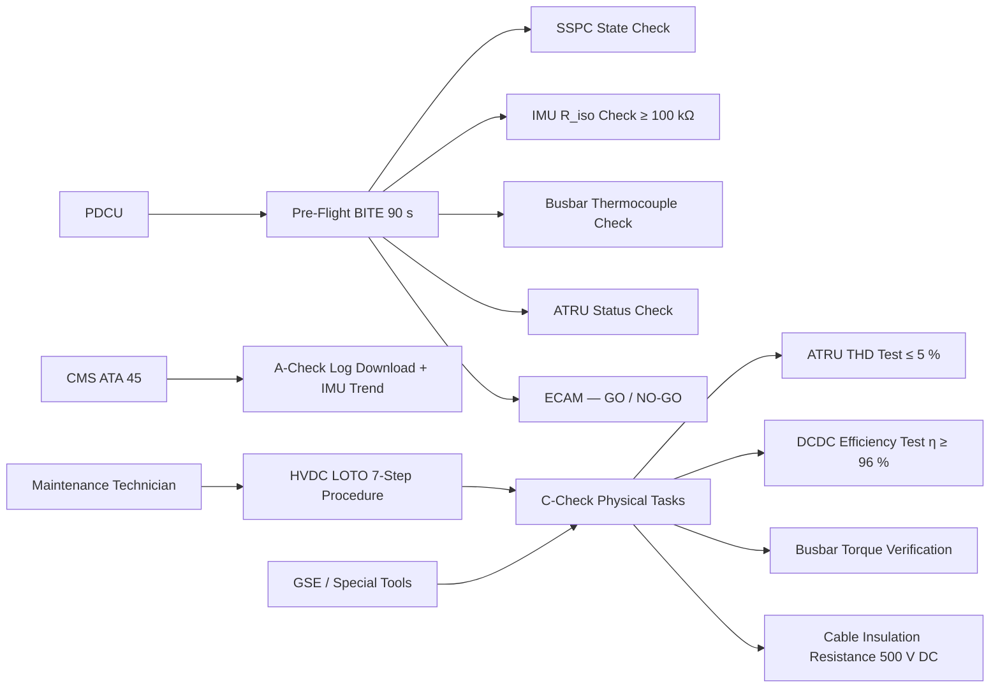

<!-- ──────────────────────────────────────────────────────────────────────────
     QATL-ATLAS-1000-ATLAS-070-079-07-073-070-POWER-DISTRIBUTION-TEST-AND-MAINTENANCE
     ATA 73 · Power Distribution Test and Maintenance
     AMPEL360E eWTW — ATLAS Register 1000
────────────────────────────────────────────────────────────────────────────── -->

# Power Distribution Test and Maintenance

---

## §0 Hyperlink Policy

> All hyperlinks in this document are **relative** (five directory levels: `../../../../../`).
> Absolute URLs are forbidden. Every linked document must exist in the Q+ATLANTIDE repository
> before the link is activated. Broken links are treated as open issues and must be resolved
> before the document is promoted from `DRAFT` to `APPROVED`.

---

## §1 Purpose

This document defines the test and maintenance philosophy, scheduled tasks, and ground support equipment (GSE) for the AMPEL360E eWTW ATA 73 MV/HV Power Distribution system. It covers:

- **Pre-flight BITE checks** via the PDCU verifying all SSPC statuses, IMU insulation values, and busbar thermocouple continuity before each departure.
- **A-check tasks** (transit / overnight): PDCU fault log download, IMU insulation trend review, and one SSPC functional test per bus.
- **C-check tasks** (heavy maintenance): full busbar visual and torque inspection, ATRU harmonic distortion test, DC-DC converter efficiency verification, and insulation resistance hot/cold measurement.
- **HVDC isolation (LOTO) procedure** — the mandatory safety procedure before any busbar or converter access.
- **GSE and special tools** required for all scheduled and unscheduled maintenance tasks.

---

## §2 Applicability

| Parameter | Value |
|---|---|
| Aircraft Program | AMPEL360E eWTW |
| ATA reference | ATA 73-070 — Power Distribution Test and Maintenance |
| Certification basis | EASA CS-25 Amdt 27+ |
| S1000D SNS | 073-070-00 |

---

## §3 Functional Description ![DRAFT]

**Pre-flight BITE:** The PDCU executes an automatic BITE sequence during each pre-flight system test (approx. 90 s duration). The sequence verifies: all SSPC states against expected configuration, IMU R_iso values (all four units ≥ 100 kΩ), busbar thermocouple continuity (all four sensors in range), and ATRU status (healthy / fault). Any discrepancy generates a PDCU fault code reported to ECAM and CMS. A failed pre-flight BITE on a safety-relevant component (SSPC-EPM, bus tie, IMU) results in a NO-GO item per the MEL/CDL philosophy.

**A-check:** Download PDCU fault log via CMS ACARS or ground maintenance terminal. Review IMU insulation trend for all four segments (look for > 10 % degradation per 100 FH). Perform one SSPC open/close functional test per bus (rotating through SSPCs across A-checks to complete a full circuit within 12 A-checks).

**C-check:** Full busbar visual inspection (torque marks, corrosion, cracked insulation sleeves). Busbar joint torque verification (calibrated wrench per joint torque table). ATRU harmonic distortion test (THD ≤ 5 % at rated load). DC-DC converter efficiency test for all three converter types (η ≥ 96 % at 50 % load). Insulation resistance measurement — hot (within 15 min of flight) and cold (ambient) for all HVDC cables using a 500 V DC insulation tester. IMU calibration verification (if ≤ 24 months has not expired since last calibration).

**HVDC LOTO Procedure:** Before accessing any busbar, converter, or SSPC component:
1. Complete all pre-LOTO checklists per AMM.
2. Open MGC-A and MGC-B (PDCU command or manual override).
3. Open all SSPCs via PDCU GSE command — verify PDCU confirms all SSPCs open.
4. Apply mechanical LOTO locks on MGC-A/B and isolation switchgear.
5. Verify residual voltage on 540 V and 270 V buses ≤ 50 V using calibrated HVDC voltmeter (within 5 min of isolation).
6. Post "HVDC ISOLATED — DO NOT ENERGISE" tags.
7. Confirm with second technician (two-person LOTO rule for HVDC).

---

## §4 Functional Breakdown

| ID | Name | Description | Lead Division |
|---|---|---|---|
| F-001 | BITE pre-flight check | PDCU automatic 90 s BITE: SSPC states, IMU R_iso, thermocouple, ATRU status | Q-HPC |
| F-002 | A-check log download and trend review | PDCU fault log download; IMU trend analysis; one SSPC functional test per bus | Q-INDUSTRY |
| F-003 | C-check physical inspection | Busbar visual + torque; ATRU THD test; DCDC efficiency test; cable insulation resistance | Q-MECHANICS |
| F-004 | HVDC LOTO procedure | Mandatory energy isolation before busbar/converter/SSPC access; 7-step procedure; two-person rule | Q-AIR |
| F-005 | GSE and special tools | HVDC insulation tester (500 V DC), SSPC test console, ATRU harmonic analyser, precision load bank | Q-INDUSTRY |

---

## §5 System Context — Mermaid Diagram

---

## §6 Internal Architecture — Mermaid Diagram

```mermaid
flowchart TB
    subgraph PREFLIGHT [Pre-Flight BITE — PDCU Sequence]
        P1[1. SSPC Configuration Verify] --> P2[2. IMU R_iso Read all 4 channels]
        P2 --> P3[3. Busbar Thermocouple Continuity]
        P3 --> P4[4. ATRU Health Status]
        P4 --> P5[5. BITE Pass/Fail Decision]
        P5 --> P6[6. Report to ECAM + CMS]
    end
    subgraph LOTO [HVDC LOTO — 7-Step Procedure]
        L1[1. AMM Pre-LOTO Checklist] --> L2[2. Open MGC-A and MGC-B]
        L2 --> L3[3. Open all SSPCs via PDCU GSE]
        L3 --> L4[4. Apply LOTO Locks on MGC + Switchgear]
        L4 --> L5[5. Verify Residual Voltage ≤ 50 V]
        L5 --> L6[6. Post HVDC Tags]
        L6 --> L7[7. Two-Person Confirmation]
    end
```

---

## §7 Components and LRUs

| Component | Part Number | Qty | Location | Maintenance Interval | Notes |
|---|---|---|---|---|---|
| PDCU GSE terminal | GSE-PDCU-PN-TBD | 1 | GSE kit | Calibration annual | Used for BITE, LOTO commands, SSPC tests |
| HVDC insulation tester (500 V DC rated) | GSE-INS-500V-TBD | 1 | GSE kit | Calibration annual | For cable R_iso measurement; 500 V output |
| SSPC test console | GSE-SSPC-CON-TBD | 1 | GSE kit | Calibration annual | Functional test and fault injection for SSPCs |
| ATRU harmonic analyser | GSE-ATRU-HARM-TBD | 1 | GSE kit | Calibration annual | Measures THD; IEEE 519 compatible |
| Precision load bank (400 kW) | GSE-LOAD-BANK-TBD | 1 | GSE kit | Calibration annual | For DCDC efficiency test at 50 % and 100 % load |
| Bidirectional power analyser | GSE-PWR-ANA-TBD | 1 | GSE kit | Calibration annual | Measures input/output power for η calculation |
| Calibrated torque wrench set | GSE-TORQUE-TBD | 1 | GSE kit | Annual calibration | Per busbar joint torque table (N·m values TBD) |
| HVDC voltmeter (600 V DC rated) | GSE-VOLT-600V-TBD | 1 | GSE kit | Calibration annual | LOTO residual voltage check; 600 V Cat III |

---

## §8 Interfaces

| Interface Type | Connected System | Protocol / Medium | Data / Function |
|---|---|---|---|
| ATA 73-080 PDCU | Power Distribution Control Unit | GSE serial / AFDX | BITE commands, SSPC control, fault log access |
| ATA 45 CMS | Central Maintenance System | AFDX / ACARS | Fault log download; IMU trending data |
| ATA 73-040 SSPCs | All SSPC units | PDCU GSE command | Functional test open/close; trip injection |
| ATA 73-030 ATRUs | ATRU-A / ATRU-B | Harmonic analyser cable to ATRU output | THD measurement at rated load |
| ATA 73-030 DC-DC converters | All three converter units | Load bank + power analyser | Efficiency test at 50 % and 100 % load |
| ATA 73-050 Busbars | 540 V and 270 V busbars | Torque wrench; insulation tester | Physical inspection and cable R_iso measurement |

---

## §9 Operating Modes

| Mode | Trigger | System State | Actions / Consequences |
|---|---|---|---|
| Pre-flight BITE | Engine start sequence; avionics power-up | PDCU automated; aircraft powered on ground | 90 s sequence; GO/NO-GO to ECAM; faults to CMS |
| A-check maintenance | Aircraft at A-check interval | Aircraft grounded; normal power available | Log download; IMU trend; one SSPC test per bus |
| C-check maintenance | Aircraft at C-check interval | Aircraft grounded; HVDC LOTO applied for physical tasks | Full inspection; ATRU THD; DCDC efficiency; cable R_iso |
| HVDC LOTO | Before any busbar/converter access | All HVDC de-energised; LOTO locks applied | Residual ≤ 50 V within 5 min; two-person confirmation |
| LOTO removal | Maintenance complete; return to service | LOTO tags removed; SSPC restore sequence | PDCU re-energises buses per normal startup |

---

## §10 Performance and Budgets ![DRAFT]

| Parameter | Requirement | Target / Design Value | Status |
|---|---|---|---|
| Pre-flight BITE duration | ≤ 120 s | ≤ 90 s design | ![TBD] |
| BITE fault detection coverage | ≥ 85 % | ≥ 90 % target | ![TBD] |
| ATRU THD (C-check acceptance) | ≤ 5 % | ≤ 4 % pass criterion | ![TBD] |
| DCDC efficiency (C-check acceptance) | η ≥ 96 % at 50 % load | η ≥ 97 % pass criterion | ![TBD] |
| Cable R_iso (C-check acceptance, hot) | ≥ 1 MΩ | ≥ 1 MΩ (hot); ≥ 10 MΩ (cold) | ![TBD] |
| LOTO residual voltage | ≤ 50 V within 5 min | ≤ 50 V within 3 min target | ![TBD] |
| A-check duration (ATA 73 tasks) | ≤ 2 h per A-check | ≤ 1.5 h target | ![TBD] |

---

## §11 Safety, Redundancy and Fault Tolerance

- HVDC LOTO is a mandatory two-person procedure; no single-person busbar access is permitted on the AMPEL360E eWTW.
- Residual capacitor voltage verification (≤ 50 V) before busbar access prevents electric shock from stored energy — this is a hard requirement, not a guideline.
- Pre-flight BITE is automated and non-deferrable for safety-critical SSPCs and IMU channels; any BITE failure on a safety-critical component is a NO-GO.
- C-check ATRU THD acceptance limit (≤ 5 %) is set at the IEEE 519 limit — units measuring 4–5 % are flagged for early replacement at next A-check.
- DCDC efficiency acceptance limit (η ≥ 96 %) detects developing converter faults (e.g., degraded SiC MOSFET, increased core losses) before complete failure.
- All GSE must be annually calibrated; use of non-calibrated GSE for HVDC tasks is prohibited and constitutes a maintenance quality escape.

---

## §12 Maintenance and Diagnostics

| Task | Interval | Access | Special Tools |
|---|---|---|---|
| PDCU BITE fault log download | A-check | CMS terminal or ACARS | CMS GSE terminal |
| IMU R_iso trend review (all 4 channels) | A-check | CMS terminal | CMS GSE terminal |
| SSPC functional test (one per bus, rotating) | A-check | PDCU GSE command | SSPC test console |
| ATRU THD test at rated load (both ATRUs) | C-check | Pylon panel | ATRU harmonic analyser |
| DCDC efficiency test (all three converters) | C-check | EE bay rack | Precision load bank; bidirectional power analyser |
| Busbar visual inspection + joint torque verify | C-check | Keel + EE bay panels | Calibrated torque wrench set |
| HVDC cable insulation resistance (hot + cold) | C-check | Cable end connectors | HVDC insulation tester (500 V DC) |
| IMU calibration verification | ≤ 24 months | EE bay | IMU calibration reference module |

---

## §13 Footprint

| Footprint Type | Parameter | Value | Notes |
|---|---|---|---|
| Maintenance | A-check task duration (ATA 73) | ≤ 2 h | Log download + trend + one SSPC test |
| Maintenance | C-check task duration (ATA 73) | ![TBD] | Busbar + ATRU + DCDC + cable combined |
| GSE | Total GSE kit mass | ![TBD] | All 8 tools listed in §7 |
| Maintenance | LOTO confirmation time | ≤ 5 min to ≤ 50 V | Per AMM LOTO procedure |
| Maintenance | Minimum task crew | 2 persons | Two-person LOTO rule for HVDC |

---

## §14 Safety and Certification References ![DRAFT]

| Standard / Document | Title | Issuing Body | Applicability |
|---|---|---|---|
| EASA CS-25 §25.1353 | Electrical equipment and installations | EASA | Maintenance-related electrical isolation requirements |
| CS-25 Appendix H | Instructions for Continued Airworthiness | EASA | AMM task content requirements |
| IEEE 519 | Harmonic Control in Electric Power Systems | IEEE | ATRU THD ≤ 5 % C-check acceptance |
| SAE AS50881 | Wiring Aerospace Vehicle | SAE | Cable insulation resistance acceptance criteria |
| SAE ARP4761 | Safety Assessment Process | SAE | BITE coverage analysis for ATA 73 |
| OSHA 29 CFR 1910.147 | Control of Hazardous Energy (LOTO) | OSHA | HVDC LOTO procedure reference |

---

## §15 V&V Approach ![TBD]

| Phase | Method | Acceptance Criterion | Status |
|---|---|---|---|
| Design | BITE coverage analysis per SAE ARP4761 | BITE fault detection ≥ 90 % | ![TBD] |
| Integration | Ground test — full pre-flight BITE sequence | All BITE tests pass; duration ≤ 90 s | ![TBD] |
| Integration | LOTO procedure validation — residual voltage test | Residual ≤ 50 V within 3 min on ground test rig | ![TBD] |
| Qualification | DO-160G qualification of PDCU and GSE tools | All categories pass | ![TBD] |
| Certification | EASA CS-25 Appendix H review — AMM task completeness | All ICA requirements satisfied | ![TBD] |

---

## §16 Glossary

| Term | Definition |
|---|---|
| **BITE** | Built-In Test Equipment — automated diagnostic sequence executed by PDCU at pre-flight. |
| **LOTO** | Lockout/Tagout — energy isolation and physical lock procedure preventing unexpected re-energisation. |
| **A-check** | Frequent line maintenance check interval (typically transit or overnight). |
| **C-check** | Heavy maintenance check interval; full physical inspection and functional testing. |
| **THD** | Total Harmonic Distortion — ATRU output quality metric; ≤ 5 % per IEEE 519. |
| **η** | Efficiency — ratio of output power to input power; ≥ 96 % for DC-DC converters at 50 % load. |
| **R_iso** | Insulation resistance — measured by IMU; must be ≥ 1 MΩ (hot) per AMM acceptance. |
| **Two-person rule** | Requirement for a second qualified technician to independently verify LOTO completion before busbar access. |
| **Residual voltage** | Voltage remaining on bus capacitors after de-energisation; must be ≤ 50 V before access. |
| **MEL** | Minimum Equipment List — dispatching guidance; failed pre-flight BITE on safety items → NO-GO. |

---

## §17 Open Issues

| ID | Description | Owner | Target |
|---|---|---|---|
| OI-073-070-001 | Define complete busbar joint torque table with structures and busbar OEM | Q-MECHANICS | 2026-Q4 |
| OI-073-070-002 | Finalise ATRU THD test procedure and accept/reject criteria with ATRU OEM | Q-MECHANICS | 2026-Q4 |
| OI-073-070-003 | Define HVDC cable R_iso hot acceptance limit with cable OEM (material ageing model) | Q-INDUSTRY | 2027-Q1 |

---

## §18 Status Legend

| Badge | Meaning |
|---|---|
| `![DRAFT]` | Section is drafted but not yet reviewed |
| `![TBD]` | Content not yet started — to be defined |
| `![To Be Completed]` | Partially complete — needs additional content |
| `![APPROVED]` | Reviewed and formally approved |

---

## §19 Related Documents (Siblings in this Subsection)

- [073-000](./073-000-Power-Distribution-MV-HV-General.md)
- [073-010](./073-010-High-Voltage-Distribution-Architecture.md)
- [073-020](./073-020-Medium-Voltage-Distribution-Architecture.md)
- [073-030](./073-030-Power-Electronics-Converters-and-Rectifiers.md)
- [073-040](./073-040-SSPC-Contactors-Breakers-and-Protection.md)
- [073-050](./073-050-HVDC-Busbars-Cables-and-Connectors.md)
- [073-060](./073-060-Insulation-Monitoring-and-Ground-Fault-Detection.md)
- [073-080](./073-080-Power-Distribution-Monitoring-Diagnostics-and-Control-Interfaces.md)
- [073-090](./073-090-S1000D-CSDB-Mapping-and-Traceability.md)

---

## §20 Change Log

| Rev | Date | Author | Description |
|---|---|---|---|
| 0.1 | 2026-05-11 | @copilot | Initial DRAFT — test and maintenance procedures for AMPEL360E eWTW ATA 73 HVDC distribution |
