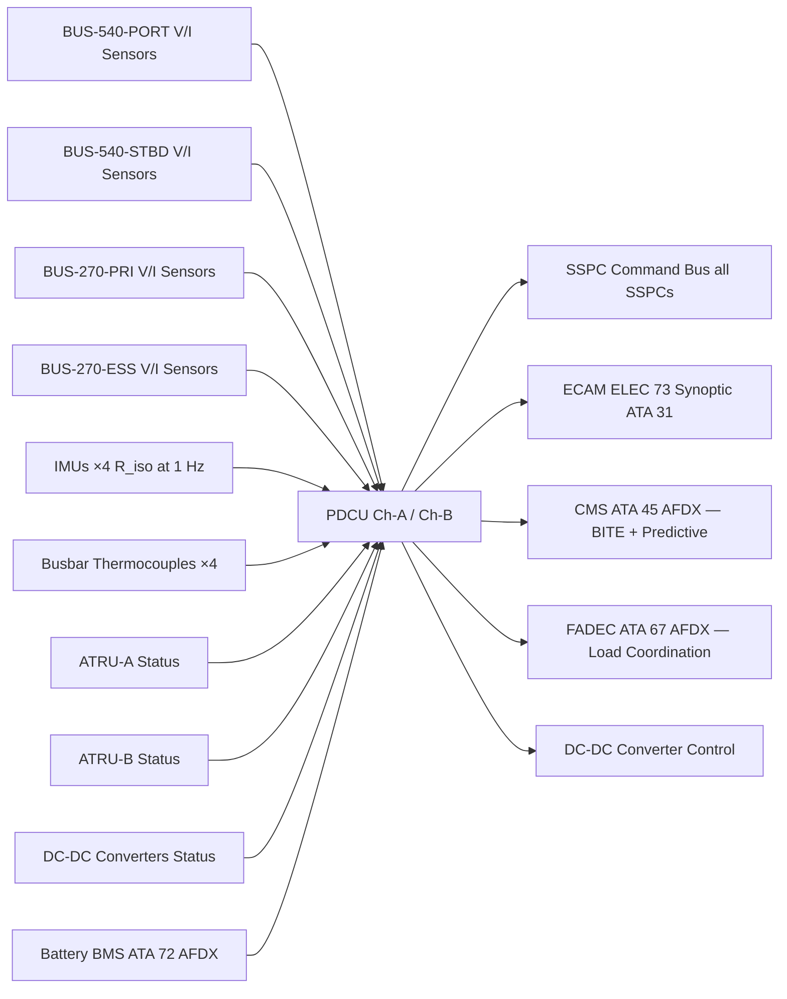
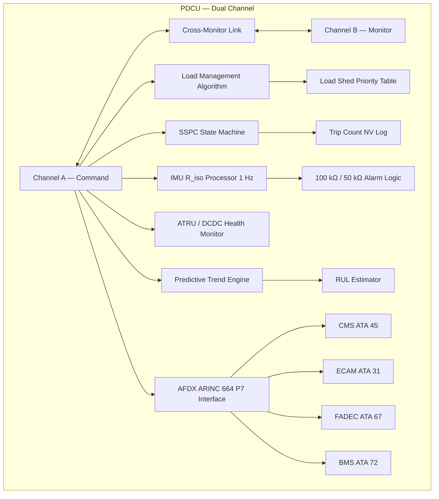

<!-- ──────────────────────────────────────────────────────────────────────────
     QATL-ATLAS-1000-ATLAS-070-079-07-073-080-POWER-DISTRIBUTION-MONITORING-DIAGNOSTICS-AND-CONTROL-INTERFACES
     ATA 73 · Power Distribution Monitoring Diagnostics and Control Interfaces
     AMPEL360E eWTW — ATLAS Register 1000
────────────────────────────────────────────────────────────────────────────── -->

# Power Distribution Monitoring Diagnostics and Control Interfaces

---

## §0 Hyperlink Policy

> All hyperlinks in this document are **relative** (five directory levels: `../../../../../`).
> Absolute URLs are forbidden. Every linked document must exist in the Q+ATLANTIDE repository
> before the link is activated. Broken links are treated as open issues and must be resolved
> before the document is promoted from `DRAFT` to `APPROVED`.

---

## §1 Purpose

This document describes the Power Distribution Control Unit (PDCU) and its interfaces for monitoring, diagnostics, and control of the AMPEL360E eWTW ATA 73 MV/HV power distribution system. The PDCU is the central digital controller for the HVDC network, implementing real-time bus load management, SSPC commanding, insulation monitoring, ATRU and converter health checking, and predictive maintenance analytics.

The PDCU provides the crew with an ECAM synoptic page "ELEC 73" showing the live state of the 540 V and 270 V buses, and reports detailed diagnostic data to the Central Maintenance System (CMS, ATA 45) via AFDX ARINC 664 P7 for condition monitoring and scheduled maintenance planning.

---

## §2 Applicability

| Parameter | Value |
|---|---|
| Aircraft Program | AMPEL360E eWTW |
| ATA reference | ATA 73-080 — Power Distribution Monitoring Diagnostics and Control Interfaces |
| Certification basis | EASA CS-25 Amdt 27+ |
| S1000D SNS | 073-080-00 |

---

## §3 Functional Description ![DRAFT]

**PDCU Architecture:** The PDCU is a dual-channel digital controller (Channel A / Channel B), qualified to DO-178C Design Assurance Level B and DO-254 DAL B. The two channels operate in a monitor-monitor-command architecture: both channels independently execute all control algorithms; Channel A is the command channel; Channel B cross-monitors and can assume command in < 50 ms if Channel A fails. The PDCU is hosted in the main EE bay rack.

**Bus Load Management:** The PDCU implements a load management algorithm based on real-time bus voltage and current measurements. When bus load exceeds safe operating limits (e.g., after a source failure), the PDCU executes a pre-defined load shed sequence, opening non-essential SSPCs in priority order to maintain essential loads within source capacity.

**SSPC Commanding and Status:** The PDCU commands all SSPCs (open/close/trip reset) and monitors their state. SSPC trip counts are logged in non-volatile memory; a SSPC with trip count approaching the life limit generates a CMS advisory for scheduled replacement.

**IMU Monitoring and Fault Reporting:** The PDCU reads R_iso values from all four IMUs at a rate of 1 Hz. Values are logged with timestamps; alarm and caution thresholds trigger ECAM annunciation and CMS fault messages. The PDCU trending algorithm flags accelerating R_iso degradation before the alarm threshold is reached.

**ATRU and Converter Health:** PDCU monitors ATRU oil temperature, ATRU output voltage/current, and DCDC converter efficiency parameters. Over-temperature or efficiency-out-of-limit conditions generate advisory messages and initiate de-rating.

**ECAM Synoptic "ELEC 73":** The PDCU drives a dedicated ECAM synoptic page showing: 540 V bus port/stbd voltage and current (per bus), 270 V bus primary/essential voltage and current, SSPC state (green/amber indicators), IMU R_iso values for all four segments, ATRU and converter status indicators, and battery SoC summary from ATA 72 BMS.

**Predictive Maintenance:** The PDCU runs continuous health analytics: busbar thermocouple temperature trending, SSPC trip-frequency tracking, IMU R_iso degradation curve fitting, and converter efficiency degradation trend. Predictions are reported to CMS as predictive maintenance messages with remaining useful life (RUL) estimates.

---

## §4 Functional Breakdown

| ID | Name | Description | Lead Division |
|---|---|---|---|
| F-001 | PDCU dual-channel control | Dual-channel DO-178C DAL B; monitor-monitor-command architecture; Channel B takeover < 50 ms | Q-HPC |
| F-002 | Load management and SSPC commanding | Real-time bus load monitoring; load shed sequence; SSPC open/close/trip commands and status | Q-GREENTECH |
| F-003 | IMU monitoring and fault reporting | 1 Hz R_iso read; alarm/caution logic; trend detection; ECAM and CMS reporting | Q-INDUSTRY |
| F-004 | ECAM synoptic "ELEC 73" | Dedicated ECAM page: bus voltages/currents, SSPC status, IMU values, converter and battery status | Q-AIR |
| F-005 | CMS BITE and predictive maintenance | SSPC trip-count advisories; ATRU/DCDC efficiency degradation trend; busbar temperature trend; RUL estimates | Q-HPC |

---

## §5 System Context — Mermaid Diagram

---

## §6 Internal Architecture — Mermaid Diagram

---

## §7 Components and LRUs

| Component | Part Number | Qty | Location | Maintenance Interval | Notes |
|---|---|---|---|---|---|
| PDCU Power Distribution Control Unit | PDCU-PN-TBD | 1 | EE bay rack | Software update per SB; C-check BITE | Dual-channel; DO-178C DAL B; DO-254 DAL B; ~2U rack |
| Bus Voltage / Current Sensor — 540 V (×2 per bus) | VCS-540-PN-TBD | 4 | EE bay bus panel | C-check calibration | Hall-effect; 0–6 kA; 0–600 V range |
| Bus Voltage / Current Sensor — 270 V (×2 per bus) | VCS-270-PN-TBD | 4 | EE bay bus panel | C-check calibration | Hall-effect; 0–2 kA; 0–300 V range |
| AFDX Network Interface Card (PDCU) | NIC-AFDX-PN-TBD | 1 | PDCU internal | Per SB schedule | ARINC 664 P7; Ethernet 100BASE-TX |

---

## §8 Interfaces

| Interface Type | Connected System | Protocol / Medium | Data / Function |
|---|---|---|---|
| ATA 31 ECAM | Electronic Centralised Aircraft Monitor | AFDX ARINC 664 P7 | ELEC 73 synoptic page data; bus V/I; SSPC states; IMU values; alarms |
| ATA 45 CMS | Central Maintenance System | AFDX ARINC 664 P7 | BITE fault codes; SSPC trip-count log; IMU trend data; predictive maintenance advisories |
| ATA 67 FADEC | Full Authority Digital Engine Control | AFDX | Engine torque/speed request coordination with PDCU bus load management |
| ATA 72 BMS | Battery Management System | AFDX | Battery SoC, charge/discharge current limits; DCDC-BAT control setpoints |
| ATA 73-040 SSPCs | All SSPCs on 540 V and 270 V buses | Discrete command + SSPC serial | Open/close/trip commands; status feedback; trip-count register |
| ATA 73-060 IMUs | Four IMU units | PDCU serial data bus | R_iso values at 1 Hz; calibration date |
| ATA 73-030 ATRUs | ATRU-A / ATRU-B | PDCU serial + discrete | Oil temperature; output voltage; fault status |
| ATA 73-050 Busbars | Busbar thermocouples ×4 | Analogue 4–20 mA | Busbar temperature for load management and trending |

---

## §9 Operating Modes

| Mode | Trigger | System State | Actions / Consequences |
|---|---|---|---|
| Normal dual-source | All sources healthy | PDCU Ch-A command; Ch-B monitoring | All buses managed; ECAM ELEC 73 normal green |
| Channel B takeover | PDCU Ch-A failure | Ch-B assumes command in < 50 ms | Seamless transition; ECAM advisory: "PDCU CH-A FAULT" |
| Load shed active | Source degraded; bus overloaded | PDCU executes load shed priority table | Non-essential SSPCs opened; ECAM amber; CMS log |
| Predictive advisory | Trend engine detects degradation | PDCU generates CMS predictive message | CMS schedules maintenance; no ECAM crew alert |
| IMU alarm | R_iso < 100 kΩ or < 50 kΩ | PDCU alarm logic triggers | ECAM advisory or caution; localization sequence available |
| BITE mode (pre-flight) | System power-up | Automated 90 s BITE sequence | GO/NO-GO to ECAM; faults to CMS |

---

## §10 Performance and Budgets ![DRAFT]

| Parameter | Requirement | Target / Design Value | Status |
|---|---|---|---|
| PDCU dual-channel availability | ≥ 99.99 % | Dual-channel architecture | ![TBD] |
| PDCU Ch-B takeover time | ≤ 100 ms | ≤ 50 ms target | ![TBD] |
| SSPC command response (PDCU → SSPC) | ≤ 10 ms | ≤ 5 ms target | ![TBD] |
| ECAM ELEC 73 refresh rate | ≥ 1 Hz | 2 Hz target | ![TBD] |
| IMU data sampling rate | 1 Hz per channel | 1 Hz | ![TBD] |
| CMS BITE data upload | ≤ 30 s for full log | ≤ 20 s target | ![TBD] |
| PDCU BITE fault detection coverage | ≥ 85 % | ≥ 90 % target | ![TBD] |

---

## §11 Safety, Redundancy and Fault Tolerance

- Dual-channel PDCU (DO-178C DAL B, DO-254 DAL B) ensures continued control function after single-channel failure; loss of both channels constitutes a catastrophic hazard (Extremely Improbable per FHA).
- SSPC hardware trip (< 100 μs, ATA 73-040) is independent of PDCU software — over-current protection does not rely on PDCU for trip action.
- Cross-monitoring between PDCU channels detects silent failure (channel runs but produces incorrect outputs); cross-monitor disagreement triggers channel isolation and Ch-B takeover.
- Predictive maintenance data from PDCU reduces unscheduled maintenance events; RUL estimates for SSPCs, converters, and insulation allow proactive planning.
- ECAM ELEC 73 synoptic is the primary crew interface for HVDC system health; crew procedures for SSPC trip, bus fault, and IMU alarm are driven by ECAM messages.

---

## §12 Maintenance and Diagnostics

| Task | Interval | Access | Special Tools |
|---|---|---|---|
| PDCU fault log download | A-check | CMS terminal or ACARS | CMS GSE terminal |
| PDCU software update | Per SB schedule | EE bay rack; PDCU data loader port | Certified data loader; software part number verified |
| Bus V/I sensor calibration | C-check | EE bay bus panel | Calibrated current source; precision voltmeter |
| PDCU BITE full test (all functions) | C-check | PDCU GSE | PDCU GSE terminal; SSPC test console |
| ECAM ELEC 73 display verification | C-check | Cockpit; ECAM test mode | PDCU GSE stimulates known states |

---

## §13 Footprint

| Footprint Type | Parameter | Value | Notes |
|---|---|---|---|
| Physical | PDCU mass | ![TBD] | ~2U rack module; OEM design pending |
| Physical | PDCU power consumption | ![TBD] | Estimated < 100 W dual-channel |
| Electrical | AFDX bandwidth (PDCU all interfaces) | ![TBD] | Per AFDX bus load analysis |
| Maintenance | PDCU software update time | ~2 h | Data loader + verify + BITE retest |
| Data | PDCU non-volatile log capacity | ![TBD] | Sized for ≥ 500 FH of data retention |

---

## §14 Safety and Certification References ![DRAFT]

| Standard / Document | Title | Issuing Body | Applicability |
|---|---|---|---|
| DO-178C | Software Considerations in Airborne Systems | RTCA | PDCU software DAL B |
| DO-254 | Design Assurance Guidance for Airborne Electronic Hardware | RTCA | PDCU hardware DAL B |
| ARINC 664 Part 7 | Aircraft Data Network — Avionics Full-Duplex Switched Ethernet | ARINC | PDCU communications bus |
| DO-160G | Environmental Conditions and Test Procedures | RTCA | PDCU environmental qualification |
| SAE ARP4761 | Safety Assessment Process | SAE | FHA for PDCU dual-channel failure |
| EASA CS-25 §25.1309 | Equipment, Systems, and Installations | EASA | System safety assessment for PDCU |

---

## §15 V&V Approach ![TBD]

| Phase | Method | Acceptance Criterion | Status |
|---|---|---|---|
| Design | PDCU software design review per DO-178C DAL B | All DO-178C DAL B objectives met | ![TBD] |
| Unit | PDCU hardware qualification per DO-254 DAL B | All DO-254 DAL B objectives met | ![TBD] |
| Integration | Ch-B takeover test — inject Ch-A failure; measure takeover time | Takeover ≤ 50 ms; no SSPC spurious commands | ![TBD] |
| Integration | ECAM ELEC 73 test — all known states stimulated | Correct display for all 540 V/270 V bus states | ![TBD] |
| Integration | Predictive trending test — inject known R_iso trend | PDCU generates CMS advisory before 100 kΩ threshold | ![TBD] |
| Qualification | DO-160G — vibration, thermal, EMI for PDCU | All categories pass | ![TBD] |

---

## §16 Glossary

| Term | Definition |
|---|---|
| **PDCU** | Power Distribution Control Unit — dual-channel digital controller for ATA 73 HVDC buses. |
| **ECAM ELEC 73** | Dedicated ECAM synoptic page for ATA 73 HVDC power distribution status. |
| **Load shed** | PDCU-commanded sequential SSPC opening to reduce bus loading under degraded source condition. |
| **Monitor-monitor-command** | PDCU dual-channel architecture: both channels monitor; command channel active; monitor channel ready to take over. |
| **Cross-monitor** | Inter-channel comparison of outputs; disagreement triggers channel isolation and takeover. |
| **RUL** | Remaining Useful Life — PDCU predictive estimate of time before SSPC, converter, or IMU requires replacement. |
| **AFDX** | Avionics Full-Duplex Switched Ethernet — ARINC 664 Part 7; PDCU communications bus. |
| **DAL B** | Design Assurance Level B — DO-178C/DO-254 requirement for PDCU; second highest assurance level. |
| **Trip-count log** | Non-volatile PDCU record of SSPC fault-triggered switch-off events per SSPC unit. |
| **Load management algorithm** | PDCU software function computing optimal SSPC state given source capability and load priorities. |

---

## §17 Open Issues

| ID | Description | Owner | Target |
|---|---|---|---|
| OI-073-080-001 | Define PDCU OEM selection and DO-178C/DO-254 DAL B certification plan | Q-HPC | 2026-Q4 |
| OI-073-080-002 | Define ECAM ELEC 73 synoptic content and layout with avionics team (ATA 31 interface) | Q-AIR | 2027-Q1 |
| OI-073-080-003 | Define AFDX bus load allocation for PDCU (all interfaces combined) with AFDX network owner | Q-HPC | 2026-Q4 |

---

## §18 Status Legend

| Badge | Meaning |
|---|---|
| `![DRAFT]` | Section is drafted but not yet reviewed |
| `![TBD]` | Content not yet started — to be defined |
| `![To Be Completed]` | Partially complete — needs additional content |
| `![APPROVED]` | Reviewed and formally approved |

---

## §19 Related Documents (Siblings in this Subsection)

- [073-000](./073-000-Power-Distribution-MV-HV-General.md)
- [073-010](./073-010-High-Voltage-Distribution-Architecture.md)
- [073-020](./073-020-Medium-Voltage-Distribution-Architecture.md)
- [073-030](./073-030-Power-Electronics-Converters-and-Rectifiers.md)
- [073-040](./073-040-SSPC-Contactors-Breakers-and-Protection.md)
- [073-050](./073-050-HVDC-Busbars-Cables-and-Connectors.md)
- [073-060](./073-060-Insulation-Monitoring-and-Ground-Fault-Detection.md)
- [073-070](./073-070-Power-Distribution-Test-and-Maintenance.md)
- [073-090](./073-090-S1000D-CSDB-Mapping-and-Traceability.md)

---

## §20 Change Log

| Rev | Date | Author | Description |
|---|---|---|---|
| 0.1 | 2026-05-11 | @copilot | Initial DRAFT — PDCU monitoring, diagnostics and control interfaces for AMPEL360E eWTW |
