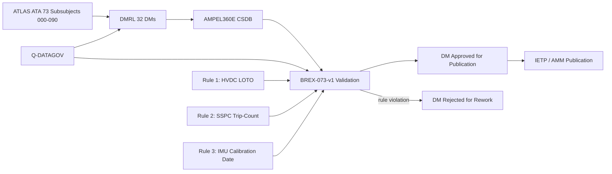
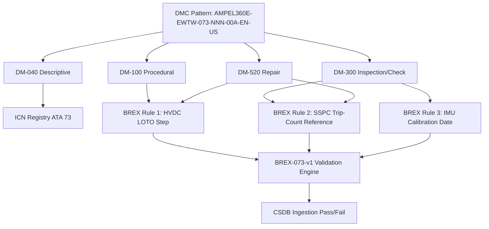

<!-- ──────────────────────────────────────────────────────────────────────────
     QATL-ATLAS-1000-ATLAS-070-079-07-073-090-S1000D-CSDB-MAPPING-AND-TRACEABILITY
     ATA 73 · S1000D / CSDB Mapping and Traceability
     AMPEL360E eWTW — ATLAS Register 1000
────────────────────────────────────────────────────────────────────────────── -->

# S1000D / CSDB Mapping and Traceability

---

## §0 Hyperlink Policy

> All hyperlinks in this document are **relative** (five directory levels: `../../../../../`).
> Absolute URLs are forbidden. Every linked document must exist in the Q+ATLANTIDE repository
> before the link is activated. Broken links are treated as open issues and must be resolved
> before the document is promoted from `DRAFT` to `APPROVED`.

---

## §1 Purpose

This document maps the ATLAS ATA 73 subsubject structure to S1000D Data Module Codes (DMCs) and defines the Data Module Requirement List (DMRL) and Business Rules eXchange (BREX) constraints for the AMPEL360E eWTW Power Distribution MV/HV Common Source DataBase (CSDB).

ATA 73 DMRL for AMPEL360E eWTW: **32 data modules**. DMC pattern: `AMPEL360E-EWTW-073-{NNN}-00A-EN-US`. BREX document: `AMPEL360E-BREX-073-v1`, enforcing three domain-specific constraints specific to the HVDC MV/HV power distribution system, as described in §3.

This document is owned by Q-DATAGOV and reviewed at each CSDB milestone (DMRL baseline, DMRL first issue, DMRL final). It is the authoritative traceability record linking ATLAS ATA 73 ATLAS documents to the S1000D technical publication set.

---

## §2 Applicability

| Parameter | Value |
|---|---|
| Aircraft Program | AMPEL360E eWTW |
| ATA reference | ATA 73-090 — S1000D / CSDB Mapping and Traceability |
| Certification basis | S1000D Issue 5.0 |
| S1000D SNS | 073-090-00 |

---

## §3 Functional Description ![DRAFT]

**BREX AMPEL360E-BREX-073-v1 enforces three domain-specific constraints:**

1. **HVDC isolation rule:** All maintenance Data Modules (DM type 300, 520, or 100) that require busbar, converter, or SSPC physical access must include the HVDC LOTO procedure step with an explicit residual voltage check (≤ 50 V) before any hands-on task begins. This rule prevents maintenance DMs from being issued without the mandatory HVDC energy isolation sequence, protecting maintenance personnel from electric shock hazard at 540 V or 270 V DC.

2. **SSPC trip-count rule:** All DMs for SSPC removal, replacement, or functional test (DM type 300 or 520) must reference the SSPC trip-count register in the PDCU for life tracking. This ensures that when an SSPC is replaced, the new SSPC trip count is initialized in the PDCU and the old trip count is archived — preventing life-tracking gaps that could allow an over-limit SSPC to remain in service.

3. **IMU calibration rule:** All DMs referencing insulation resistance measurements (any R_iso measurement by IMU) must cite the IMU calibration date (≤ 24 months) before the measured value is considered valid. This rule prevents acceptance of R_iso measurements from an out-of-calibration IMU, which could produce falsely high readings masking true insulation degradation.

---

## §4 Functional Breakdown

| ID | Name | Description | Lead Division |
|---|---|---|---|
| F-001 | DMRL — 32 DMs | Full DMRL for ATA 73: all 32 DM codes tracked; status managed by Q-DATAGOV | Q-DATAGOV |
| F-002 | BREX-073-v1 — 3 rules | HVDC LOTO rule, SSPC trip-count rule, IMU calibration rule; checked at CSDB ingestion | Q-DATAGOV |
| F-003 | ICN registry ATA 73 | Illustration Control Numbers for all HVDC schematics, busbar diagrams, SSPC panel layouts, ECAM synoptic screenshots | Q-DATAGOV |
| F-004 | DM-040 descriptive modules | System description DMs for PDCU, ATRUs, busbars, SSPCs, IMUs, converters | Q-MECHANICS |
| F-005 | DM-300 inspection / check modules | Scheduled maintenance task DMs for A-check and C-check per MPD | Q-AIR |

---

## §5 System Context — Mermaid Diagram

---

## §6 Internal Architecture — Mermaid Diagram

---

## §7 Components and LRUs

| Component | Part Number | Qty | Location | Maintenance Interval | Notes |
|---|---|---|---|---|---|
| S1000D Issue 5.0 | S1000D.org | CSDB | IT infrastructure | Per S1000D issue update | XML authoring standard for all 32 DMs |
| BREX-073-v1 | Programme document | CSDB validator | IT | Per programme revision | Three HVDC domain rules enforced |
| DMRL — 32 DMs | Q-DATAGOV tracker | PMO | PMO tool | Monthly review | All 32 DMs tracked for status |
| ICN registry ATA 73 | Q-DATAGOV database | CSDB | IT | Continuous | All HVDC schematics and diagrams traced |
| SSPC trip-count register reference | PDCU NV log + DMRL | Q-DATAGOV + CAMO | IT | Per SSPC replacement | Links BREX Rule 2 to PDCU operational data |

---

## §8 Interfaces

| Interface Type | Connected System | Protocol / Medium | Data / Function |
|---|---|---|---|
| ATA 45 CMS | Central Maintenance System | AFDX | BITE fault codes cross-referenced to DM-300 task codes |
| S1000D CSDB | Common Source DataBase | XML / HTTP | DM storage, BREX validation, publication |
| PDCU SSPC Trip-Count Log | PDCU NV memory | GSE serial / CMS | Source data for BREX Rule 2 — SSPC life tracking |
| IMU Calibration Registry | Q-DATAGOV document control | Document exchange | Source data for BREX Rule 3 — IMU calibration dates |
| IETP Publication | Interactive Electronic Technical Publication | HTML5 / XML | Technician access to approved DMs |
| Q-DATAGOV DMRL Tracker | PMO tool | Web-based | 32 DM status tracking |

---

## §9 Operating Modes

| Mode | Trigger | System State | Actions / Consequences |
|---|---|---|---|
| DMRL baseline | PDR milestone | Initial 32 DM codes allocated | Q-DATAGOV issues DMRL-073-v0 |
| DM authoring | Programme schedule | Authors create DMs per DMRL | BREX-073-v1 checked at CSDB ingestion |
| BREX violation | Rule 1, 2, or 3 triggered | DM rejected | Author corrects DM; re-submits to CSDB |
| CSDB milestone review | Per programme gate | All DMs reviewed for status | Q-DATAGOV reports DM completion % |
| SSPC replacement event | SSPC LRU swap in service | PDCU trip-count archived; new SSPC initialized | DM-520 SSPC task must reference PDCU log per Rule 2 |
| IETP publication | Certification milestone | All 32 DMs approved | IETP issued to airline customers |

---

## §10 Performance and Budgets ![DRAFT]

| Parameter | Requirement | Target / Design Value | Status |
|---|---|---|---|
| DMRL completeness at CDR | ≥ 80 % DMs in DRAFT | 90 % target | ![TBD] |
| BREX validation pass rate | 100 % at final milestone | 100 % | ![TBD] |
| ICN traceability coverage | 100 % of figures in DMs | 100 % | ![TBD] |
| DM review cycle time | ≤ 10 working days per DM | 7 days target | ![TBD] |
| IETP publication lead time | ≤ 3 months pre-EIS | On schedule | ![TBD] |

---

## §11 Safety, Redundancy and Fault Tolerance

- BREX Rule 1 (HVDC LOTO) is a safety-critical rule: absence of the mandatory LOTO step in a maintenance DM could expose maintenance personnel to lethal 540 V DC. The BREX engine rejects any DM requiring physical access without the LOTO step.
- BREX Rule 2 (SSPC trip-count) is a maintenance quality rule: failure to reference trip-count at SSPC replacement could result in an over-limit SSPC being returned to service.
- BREX Rule 3 (IMU calibration date) is a safety-relevant quality rule: accepting R_iso measurements from an out-of-calibration IMU could mask insulation degradation and delay maintenance action.
- CSDB version control ensures only approved DMs are published; superseded DMs are archived with obsolescence date.
- BREX rules are programme-configuration-controlled; any rule change requires Q-DATAGOV change authority approval.

---

## §12 Maintenance and Diagnostics

| Task | Interval | Access | Special Tools |
|---|---|---|---|
| DMRL status review | Monthly | Q-DATAGOV PMO tool | PMO tracker |
| BREX validation run on all 32 DMs | At each CSDB milestone | CSDB BREX engine | CSDB tool |
| SSPC trip-count archive verify (per SSPC replacement) | On SSPC replacement event | PDCU GSE log + DM-520 | PDCU GSE terminal |
| IMU calibration date registry update | After each IMU calibration | Q-DATAGOV document control | Calibration certificate database |
| ICN registry audit | Annually | Q-DATAGOV database | ICN tool |

---

## §13 Footprint

| Footprint Type | Parameter | Value | Notes |
|---|---|---|---|
| Data | Total DMs ATA 73 | 32 DMs | Per DMRL-073 |
| Data | DM types | 040/100/300/520 | Descriptive/Procedural/Inspection/Repair |
| Data | CSDB storage estimate | ![TBD] | Per DM average size × 32 |
| Maintenance | DMRL review man-hours | ~2 h/month | Q-DATAGOV |
| Data | BREX rules count | 3 rules | BREX-073-v1 |

---

## §14 Safety and Certification References ![DRAFT]

| Standard / Document | Title | Issuing Body | Applicability |
|---|---|---|---|
| S1000D Issue 5.0 | Technical Publications Standard | S1000D.org | DM authoring standard for all 32 DMs |
| ATA iSpec 2200 | Chapter 73 | ATA | ATA SNS reference for DM coding |
| EASA CS-25 §25.1529 | Instructions for Continued Airworthiness | EASA | ICA requirement driving DM content |
| AMPEL360E GP-CSDB-001 | CSDB Governance Procedure | Q-DATAGOV | CSDB workflow and DMRL management |
| OSHA 29 CFR 1910.147 | Control of Hazardous Energy (LOTO) | OSHA | Regulatory basis for BREX Rule 1 HVDC LOTO |

---

## §15 V&V Approach ![TBD]

| Phase | Method | Acceptance Criterion | Status |
|---|---|---|---|
| Design | DMRL review at PDR | All 32 DM codes allocated and scoped | ![TBD] |
| Integration | BREX validation run at CDR | Zero BREX violations in submitted DMs | ![TBD] |
| Qualification | Full CSDB review at SOW milestone | All 32 DMs in REVIEW or APPROVED status | ![TBD] |
| Certification | EASA ICA review — CS-25 §25.1529 | AMM/CMM approved; IETP published | ![TBD] |

---

## §16 Glossary

| Term | Definition |
|---|---|
| **DMC** | Data Module Code — unique S1000D identifier for each DM. |
| **DMRL** | Data Module Requirement List — list of all required DMs for a publication. |
| **BREX** | Business Rules eXchange — enforced at CSDB ingestion to apply programme-specific rules. |
| **ICN** | Illustration Control Number — unique identifier for each graphic in a DM. |
| **CSDB** | Common Source DataBase — authoritative storage for S1000D DMs. |
| **IETP** | Interactive Electronic Technical Publication — electronic format for technician use. |
| **DM-040** | S1000D descriptive data module type (system description). |
| **DM-100** | S1000D procedural data module type (operational procedures). |
| **DM-300** | S1000D inspection/check data module type (scheduled maintenance tasks). |
| **DM-520** | S1000D repair data module type (unscheduled maintenance, LRU replacement). |
| **HVDC LOTO rule** | BREX Rule 1: all busbar access DMs must include LOTO step with ≤ 50 V residual voltage check. |
| **SSPC trip-count rule** | BREX Rule 2: all SSPC R&R DMs must reference PDCU trip-count register. |
| **IMU calibration rule** | BREX Rule 3: all R_iso measurement DMs must cite IMU calibration date (≤ 24 months). |

---

## §17 Open Issues

| ID | Description | Owner | Target |
|---|---|---|---|
| OI-073-090-001 | Obtain PDCU OEM SSPC trip-count data format specification to populate BREX Rule 2 reference in DM-520 template | Q-DATAGOV | 2026-Q4 |
| OI-073-090-002 | Confirm CSDB BREX engine capability to validate LOTO step presence in procedural DMs (BREX Rule 1) | Q-DATAGOV / IT | 2026-Q4 |
| OI-073-090-003 | Define ICN numbering scheme for HVDC schematic diagrams (ATA 73 wiring diagrams, busbar layout, SSPC panel) | Q-DATAGOV | 2027-Q1 |

---

## §18 Status Legend

| Badge | Meaning |
|---|---|
| `![DRAFT]` | Section is drafted but not yet reviewed |
| `![TBD]` | Content not yet started — to be defined |
| `![To Be Completed]` | Partially complete — needs additional content |
| `![APPROVED]` | Reviewed and formally approved |

---

## §19 Related Documents (Siblings in this Subsection)

- [073-000](./073-000-Power-Distribution-MV-HV-General.md)
- [073-010](./073-010-High-Voltage-Distribution-Architecture.md)
- [073-020](./073-020-Medium-Voltage-Distribution-Architecture.md)
- [073-030](./073-030-Power-Electronics-Converters-and-Rectifiers.md)
- [073-040](./073-040-SSPC-Contactors-Breakers-and-Protection.md)
- [073-050](./073-050-HVDC-Busbars-Cables-and-Connectors.md)
- [073-060](./073-060-Insulation-Monitoring-and-Ground-Fault-Detection.md)
- [073-070](./073-070-Power-Distribution-Test-and-Maintenance.md)
- [073-080](./073-080-Power-Distribution-Monitoring-Diagnostics-and-Control-Interfaces.md)

---

## §20 Change Log

| Rev | Date | Author | Description |
|---|---|---|---|
| 0.1 | 2026-05-11 | @copilot | Initial DRAFT — S1000D CSDB mapping, DMRL 32 DMs, BREX-073-v1 for AMPEL360E eWTW ATA 73 |
