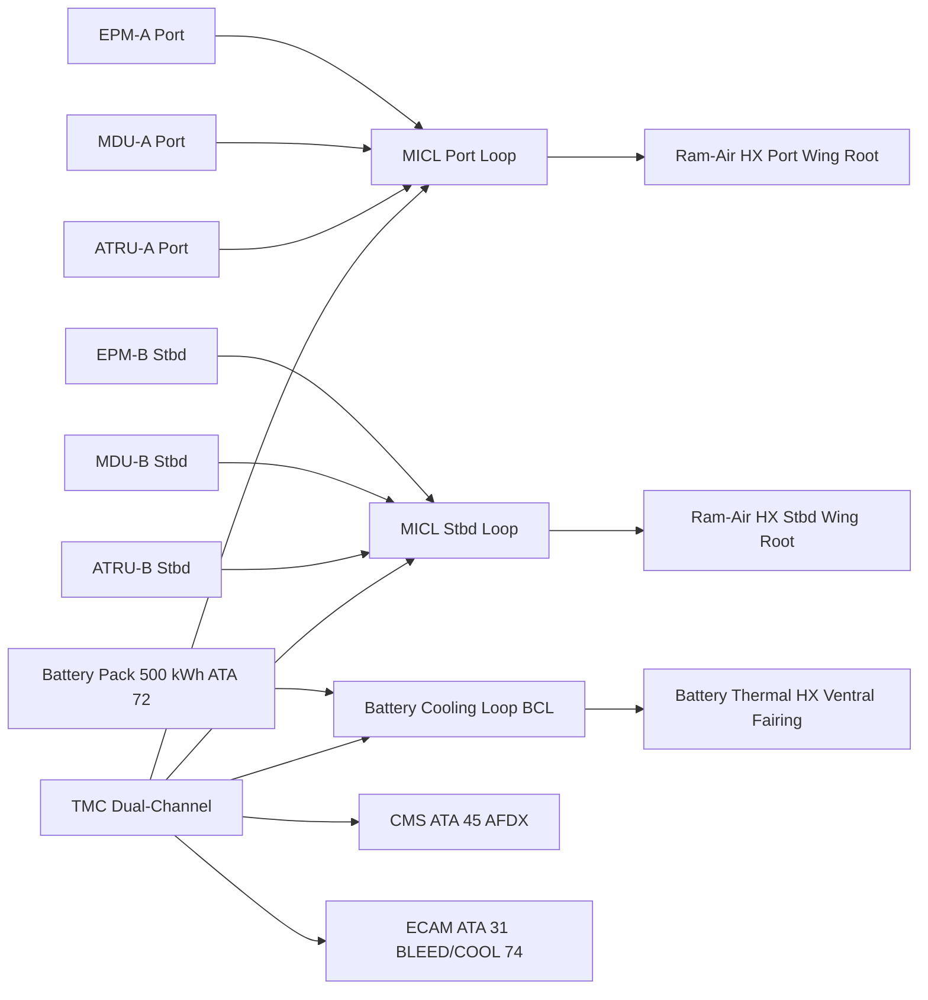
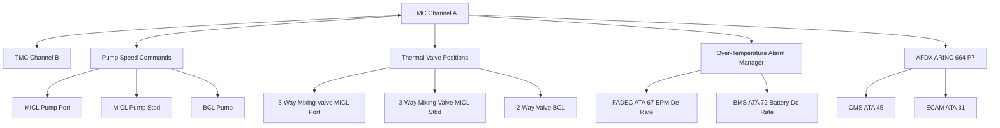

<!-- ──────────────────────────────────────────────────────────────────────────
     QATL-ATLAS-1000-ATLAS-070-079-07-074-000-THERMAL-MANAGEMENT-HYBRID-GENERAL
     ATA 74 · Thermal Management Hybrid General
     AMPEL360E eWTW — ATLAS Register 1000
────────────────────────────────────────────────────────────────────────────── -->

# Thermal Management Hybrid General

---

## §0 Hyperlink Policy

> All hyperlinks in this document are **relative** (five directory levels: `../../../../../`).
> Absolute URLs are forbidden. Every linked document must exist in the Q+ATLANTIDE repository
> before the link is activated. Broken links are treated as open issues and must be resolved
> before the document is promoted from `DRAFT` to `APPROVED`.

---

## §1 Purpose

ATA Chapter 74 covers the Thermal Management System (TMS) for the hybrid-electric propulsion of the AMPEL360E eWTW. The AMPEL360E employs a **bleed-less all-electric architecture** in which Electric Propulsion Motors (EPMs), Inverters/Motor Drive Units (MDUs), and Lithium-NMC Battery Packs (ATA 72) generate significant waste heat that must be managed to maintain component temperatures within qualified limits across all phases of flight.

The TMS encompasses two segregated liquid cooling circuits:

- **Motor–Inverter Cooling Loop (MICL)** — glycol-water 50/50 circuit, nominal operating temperature 65 °C, rejecting up to 600 kW of inverter and EPM stator waste heat via ram-air heat exchangers located in the wing root fairings.
- **Battery Cooling Loop (BCL)** — glycol-water 50/50 circuit, nominal operating temperature 30 °C, rejecting up to 120 kW of battery module waste heat via a dedicated battery thermal heat exchanger (BTHX) in the lower fuselage ventral fairing.

The entire TMS is supervised by the **Thermal Management Controller (TMC)**, a dual-channel digital controller qualified to DO-178C DAL B and DO-254 DAL B. This document establishes the general scope, top-level architecture, and governing standards for the ATA 74 Thermal Management system. All subsubject documents (074-010 through 074-090) are subordinate to this general baseline.

---

## §2 Applicability

| Parameter | Value |
|---|---|
| Aircraft Program | AMPEL360E eWTW |
| ATA reference | ATA 74-000 — Thermal Management Hybrid General |
| Certification basis | EASA CS-25 Amdt 27+ |
| S1000D SNS | 074-000-00 |

---

## §3 Functional Description ![DRAFT]

The ATA 74 system on the AMPEL360E eWTW manages the thermal energy generated by five primary heat sources in the hybrid-electric propulsion chain:

1. **EPM stator windings** — each of two EPMs dissipates up to 50 kW at maximum continuous thrust; copper losses dominate at high torque.
2. **Inverter/MDU IGBT modules** — each of two MDUs dissipates up to 250 kW at maximum power; junction temperature limit 125 °C (IGBT rated 175 °C, derated per IEC 62317 for extended life).
3. **Battery pack internal resistance** — the 500 kWh LiNMC pack (ATA 72) dissipates up to 120 kW total during maximum charge/discharge events; cell temperature limit 45 °C.
4. **ATRU waste heat** — Auto-Transformer Rectifier Units (ATA 73) each dissipate up to 40 kW (96 % efficiency, 3.2 MW throughput); cooled via the MICL.
5. **DC-DC converters (540→270 V)** — each dissipates up to 8 kW (97 % efficiency, 200 kW throughput); cooled via the MICL.

The MICL operates as a closed-loop forced-circulation circuit: brushless electric pump → EPM cold jacket → MDU cold plate → ATRU cold plate → ram-air heat exchanger → back to pump. The BCL is a parallel circuit: brushless electric pump → battery module cold plates → BTHX → back to pump.

The TMC manages pump speed, mixing valve positions, and thermal alarm thresholds. It reports to the ECAM synoptic page "BLEED/COOL 74" via AFDX and to the CMS (ATA 45) for predictive diagnostics.

---

## §4 Functional Breakdown

| ID | Name | Description | Lead Division |
|---|---|---|---|
| F-001 | Motor–Inverter Cooling Loop (MICL) | Closed glycol-water loop cooling EPMs, MDUs, ATRUs and DC-DC converters; ram-air HX rejection | Q-GREENTECH |
| F-002 | Battery Cooling Loop (BCL) | Closed glycol-water loop cooling LiNMC battery modules; BTHX rejection | Q-GREENTECH |
| F-003 | TMC control and supervision | Dual-channel digital controller; pump speed, valve position, thermal alarms, AFDX reporting | Q-HPC |
| F-004 | Overtemperature protection | TMC-commanded load shed and de-rating upon over-temperature; fire-zone thermal isolation barriers | Q-AIR |
| F-005 | Health monitoring and ECAM interface | TMC predictive analytics; ECAM "BLEED/COOL 74" synoptic; CMS ATA 45 AFDX | Q-HPC |

---

## §5 System Context — Mermaid Diagram

---

## §6 Internal Architecture — Mermaid Diagram

---

## §7 Components and LRUs

| Component | Part Number | Qty | Location | Maintenance Interval | Notes |
|---|---|---|---|---|---|
| MICL Pump Assembly — Port | MICL-PUMP-P-PN-TBD | 1 | Wing root fairing, port | On condition; A-check BITE | Brushless centrifugal; 15 kW max; glycol-rated |
| MICL Pump Assembly — Stbd | MICL-PUMP-S-PN-TBD | 1 | Wing root fairing, stbd | On condition; A-check BITE | Identical to port unit |
| BCL Pump Assembly | BCL-PUMP-PN-TBD | 1 | Lower fuselage, Frame 30 | On condition; A-check BITE | Brushless centrifugal; 5 kW max; glycol-rated |
| Ram-Air Heat Exchanger — Port | RAHX-P-PN-TBD | 1 | Wing root NACA duct, port | C-check core cleaning + inspection | Al brazed core; 600 kW rated (both loops combined) |
| Ram-Air Heat Exchanger — Stbd | RAHX-S-PN-TBD | 1 | Wing root NACA duct, stbd | C-check core cleaning + inspection | Identical to port unit |
| Battery Thermal Heat Exchanger (BTHX) | BTHX-PN-TBD | 1 | Ventral fairing, Frame 35–40 | C-check core cleaning + inspection | Al brazed core; 120 kW rated |
| TMC Thermal Management Controller | TMC-PN-TBD | 1 | EE bay rack | Software update per SB; C-check BITE | Dual-channel; DO-178C DAL B; DO-254 DAL B |
| 3-Way Mixing Valve — MICL Port | VALVE-3W-P-PN-TBD | 1 | Wing root, port | C-check actuation verify | Motorized; 0–100 % modulation; TMC-commanded |
| 3-Way Mixing Valve — MICL Stbd | VALVE-3W-S-PN-TBD | 1 | Wing root, stbd | C-check actuation verify | Identical to port unit |

---

## §8 Interfaces

| Interface Type | Connected System | Protocol / Medium | Data / Function |
|---|---|---|---|
| ATA 72 Battery / BMS | Battery pack thermal interface | Coolant piping (BCL) + AFDX | Cell temperature data; TMC ↔ BMS co-regulation |
| ATA 71/72 EPM | EPM stator cooling jacket | Coolant piping (MICL) | Stator heat rejection; winding temperature monitoring |
| ATA 73 Power Distribution | MDU/inverter and ATRU cold plates | Coolant piping (MICL) | IGBT junction and ATRU waste heat rejection |
| ATA 45 CMS | Central Maintenance System | AFDX ARINC 664 P7 | BITE faults; coolant temperature and flow trends; predictive maintenance |
| ATA 31 ECAM | Cockpit electronic centralized display | AFDX | BLEED/COOL 74 synoptic; fluid temperatures; pump status; alarms |
| ATA 67 / FADEC | Full Authority Digital Engine Control | AFDX | EPM de-rate command on MICL over-temperature |
| ATA 21 ECS | Environmental Control System | Shared ram-air ducting interface | Ram air allocation between ECS and MICL HX |

---

## §9 Operating Modes

| Mode | Trigger | System State | Actions / Consequences |
|---|---|---|---|
| Normal flight | Both EPMs and battery pack operating within thermal limits | MICL and BCL at rated flow; HX and BTHX rejecting heat | TMC monitors all temperatures; ECAM "BLEED/COOL 74" normal |
| Cruise thermal regulation | Reduced power setting — EPM heat load decreases | TMC reduces pump speed; 3-way mixing valve partially recirculates | Reduced pump power; coolant temperature maintained at setpoint |
| High-power (T/O or climb) | EPMs at maximum continuous power; MDU at maximum throughput | Pumps at 100 % speed; mixing valves fully open to HX | Coolant temperature approaches 65 °C limit; ECAM advisory if ≥ 60 °C |
| Over-temperature protection | Any component exceeds thermal alarm threshold | TMC commands EPM de-rate (FADEC) or battery de-rate (BMS) | Power reduced to restore temperature; ECAM amber caution |
| Ground cooling | Aircraft on ground, EPMs inactive; pre-conditioning | BCL operates on ground power to pre-cool battery before flight | Battery target ≤ 25 °C at departure; MICL in standby |

---

## §10 Performance and Budgets ![DRAFT]

| Parameter | Requirement | Target / Design Value | Status |
|---|---|---|---|
| MICL maximum heat rejection (per circuit) | ≥ 600 kW at ISA, SL, 250 KTAS | 620 kW design target | ![TBD] |
| BCL maximum heat rejection | ≥ 120 kW at ISA, SL, 250 KTAS | 130 kW design target | ![TBD] |
| EPM stator temperature limit | ≤ 120 °C (class H insulation) | ≤ 105 °C target | ![TBD] |
| MDU IGBT junction temperature limit | ≤ 125 °C (derated from 175 °C) | ≤ 110 °C target | ![TBD] |
| Battery cell temperature limit | ≤ 45 °C (NMC 811 OEM limit) | ≤ 40 °C target | ![TBD] |
| MICL coolant setpoint temperature | 65 °C ± 5 °C | 65 °C ± 3 °C target | ![TBD] |
| BCL coolant setpoint temperature | 30 °C ± 3 °C | 30 °C ± 2 °C target | ![TBD] |
| TMC availability | ≥ 99.99 % dispatch | Dual-channel architecture | ![TBD] |

---

## §11 Safety, Redundancy and Fault Tolerance

- Dual MICL circuits (port and stbd) are thermally independent; single circuit loss results in EPM de-rate on the affected side only, not total propulsion loss.
- BCL single-circuit failure requires battery de-rate by BMS; flight continuation limited by cell temperature rise rate (TMC calculates estimated thermal autonomy).
- TMC dual-channel architecture; single-channel failure allows degraded monitoring; dual-channel failure constitutes a catastrophic hazard (DAL B).
- Over-temperature alarms are hard-wired to FADEC and BMS for EPM and battery de-rate independent of AFDX — fail-safe design for critical thermal events.
- Coolant leak detection via flow transmitters in each loop; TMC generates ECAM caution on flow loss before thermal runaway can occur.
- All glycol-water coolant connections in fire zones use fire-resistant hose per CS-25 §25.993 and fittings per NAS1760.

---

## §12 Maintenance and Diagnostics

| Task | Interval | Access | Special Tools |
|---|---|---|---|
| TMC BITE log download and coolant temperature trend review | A-check | CMS terminal or ACARS | CMS GSE terminal |
| Pump inlet/outlet pressure and flow rate functional check | A-check | BITE via TMC GSE | Pump test console |
| Coolant sample (concentration and pH) | 6 months or on-condition | Drain valve — wing root fairing / ventral fairing | Coolant refractometer; pH test kit |
| Ram-air heat exchanger core cleaning (both units) | C-check | Wing root NACA duct panel — 4 h per side | HX cleaning kit; nitrogen blow-through |
| BTHX core cleaning | C-check | Ventral fairing access panel — 3 h | HX cleaning kit |
| 3-way mixing valve actuation verify | C-check | Wing root panel, both sides | TMC GSE actuation command; valve position sensor readout |
| Coolant full drain, flush, and refill | D-check or per SB | Drain valves — three loops | Coolant filling rig; concentration tester |

---

## §13 Footprint

| Footprint Type | Parameter | Value | Notes |
|---|---|---|---|
| Physical | Total TMS fluid volume (MICL + BCL) | ![TBD] | Pending detailed pipe routing |
| Physical | MICL pump mass (each) | ![TBD] | Brushless centrifugal; pending OEM data |
| Physical | TMC envelope | ![TBD] | EE bay rack — 2U estimated |
| Thermal | Peak total heat rejection (MICL + BCL) | ~1.34 MW | 2 × 620 kW MICL + 130 kW BCL at T/O |
| Maintenance | MICL pump access time | ~2 h | Wing root fairing panel |
| Data | AFDX bandwidth (TMC to CMS) | ![TBD] | Per AFDX bus load analysis |

---

## §14 Safety and Certification References ![DRAFT]

| Standard / Document | Title | Issuing Body | Applicability |
|---|---|---|---|
| EASA CS-25 §25.1043 | Cooling tests | EASA | Engine and propulsion cooling demonstration |
| EASA CS-25 §25.993 | Fuel system lines and fittings | EASA | Coolant line fire resistance in fire zones |
| DO-160G | Environmental Conditions and Test Procedures | RTCA | Environmental qualification for TMC, pumps, HX assemblies |
| DO-178C | Software Considerations in Airborne Systems | RTCA | TMC software DAL B |
| DO-254 | Design Assurance Guidance for Airborne Electronic Hardware | RTCA | TMC hardware DAL B |
| IEC 62317 | Ferrite cores — dimensions | IEC | IGBT thermal derating reference standard |
| SAE AIR1168/3 | Aerothermodynamic Systems Engineering and Design | SAE | TMS sizing methodology |
| NAS1760 | Fittings, tube, flared, hydraulic and pneumatic | NAS | Coolant line fitting standard |
| MIL-PRF-23699 | Lubricating Oil, Aircraft Turbine Engine | MIL | Baseline for coolant chemistry compatibility |

---

## §15 V&V Approach ![TBD]

| Phase | Method | Acceptance Criterion | Status |
|---|---|---|---|
| Design | Thermal network analysis (1D/3D CFD) | Coolant temperatures within limits at max power; SAE AIR1168/3 methodology | ![TBD] |
| Unit | HX thermal performance bench test | MICL HX ≥ 620 kW; BCL BTHX ≥ 130 kW per test | ![TBD] |
| Integration | Ground power-up — full TMS functional test | All pumps, valves, sensors nominal; TMC BITE pass | ![TBD] |
| Qualification | DO-160G qualification (TMC, pumps, HX assemblies) | All categories pass | ![TBD] |
| Certification | EASA CS-25 §25.1043 cooling test — flight envelope | All component temperatures within qualified limits | ![TBD] |

---

## §16 Glossary

| Term | Definition |
|---|---|
| **TMS** | Thermal Management System — ATA 74 system managing propulsion waste heat on AMPEL360E eWTW. |
| **TMC** | Thermal Management Controller — dual-channel digital controller for ATA 74. |
| **MICL** | Motor–Inverter Cooling Loop — glycol-water circuit cooling EPMs, MDUs, ATRUs. |
| **BCL** | Battery Cooling Loop — glycol-water circuit cooling LiNMC battery modules. |
| **EPM** | Electric Propulsion Motor — hybrid thrust motor (ATA 72). |
| **MDU** | Motor Drive Unit / Inverter — power electronics converting HVDC 540 V to EPM AC drive. |
| **BTHX** | Battery Thermal Heat Exchanger — dedicated ram-air HX for battery loop heat rejection. |
| **IGBT** | Insulated Gate Bipolar Transistor — switching device in MDU; junction temperature limit 125 °C (derated). |
| **NMC 811** | Nickel-Manganese-Cobalt 8:1:1 lithium-ion cell chemistry used in ATA 72 battery pack. |
| **DAL** | Design Assurance Level — DO-178C/DO-254 classification; TMC is DAL B. |
| **NACA duct** | National Advisory Committee for Aeronautics inlet duct design; provides ram-air flow to wing root HX. |

---

## §17 Open Issues

| ID | Description | Owner | Target |
|---|---|---|---|
| OI-074-000-001 | Finalise MICL HX sizing with EPM and MDU OEM maximum heat dissipation specifications | Q-GREENTECH | 2026-Q4 |
| OI-074-000-002 | Confirm BCL BTHX sizing with battery pack OEM thermal characterisation data (120 kW peak vs. C-rate) | Q-GREENTECH | 2026-Q4 |
| OI-074-000-003 | Complete FHA for dual-TMC-channel failure (DAL B rationale documentation) | Q-AIR / Safety | 2027-Q1 |

---

## §18 Status Legend

| Badge | Meaning |
|---|---|
| `![DRAFT]` | Section is drafted but not yet reviewed |
| `![TBD]` | Content not yet started — to be defined |
| `![To Be Completed]` | Partially complete — needs additional content |
| `![APPROVED]` | Reviewed and formally approved |

---

## §19 Related Documents (Siblings in this Subsection)

- [074-010](./074-010-Propulsion-Thermal-Architecture.md)
- [074-020](./074-020-Liquid-Cooling-Loops-and-Pumps.md)
- [074-030](./074-030-Heat-Exchangers-Cold-Plates-and-Radiators.md)
- [074-040](./074-040-Motor-Inverter-and-Battery-Cooling-Interfaces.md)
- [074-050](./074-050-Thermal-Control-Valves-and-Regulation.md)
- [074-060](./074-060-Overtemperature-and-Fire-Zone-Thermal-Isolation.md)
- [074-070](./074-070-Thermal-System-Service-and-Maintenance.md)
- [074-080](./074-080-Thermal-Management-Monitoring-Diagnostics-and-Control-Interfaces.md)
- [074-090](./074-090-S1000D-CSDB-Mapping-and-Traceability.md)

---

## §20 Change Log

| Rev | Date | Author | Description |
|---|---|---|---|
| 0.1 | 2026-05-12 | @copilot | Initial DRAFT — general overview of ATA 74 TMS for AMPEL360E eWTW hybrid-electric propulsion |
