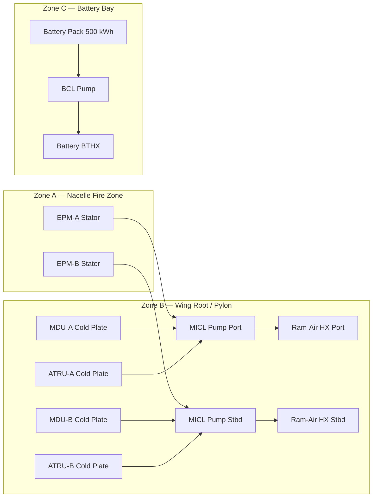
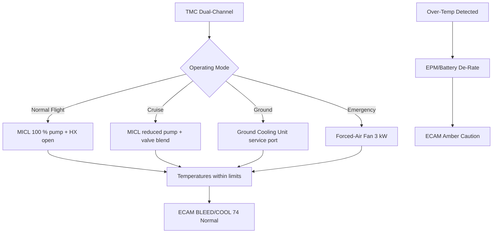

<!-- ──────────────────────────────────────────────────────────────────────────
     QATL-ATLAS-1000-ATLAS-070-079-07-074-010-PROPULSION-THERMAL-ARCHITECTURE
     ATA 74 · Propulsion Thermal Architecture
     AMPEL360E eWTW — ATLAS Register 1000
────────────────────────────────────────────────────────────────────────────── -->

# Propulsion Thermal Architecture

---

## §0 Hyperlink Policy

> All hyperlinks in this document are **relative** (five directory levels: `../../../../../`).
> Absolute URLs are forbidden. Every linked document must exist in the Q+ATLANTIDE repository
> before the link is activated. Broken links are treated as open issues and must be resolved
> before the document is promoted from `DRAFT` to `APPROVED`.

---

## §1 Purpose

This document defines the top-level propulsion thermal architecture for the AMPEL360E eWTW hybrid-electric propulsion system. It establishes the heat source inventory, heat flux budgets, fluid loop topology, heat rejection pathway hierarchy, and thermal zoning across the airframe — providing the system context from which all lower-level ATA 74 subsubject documents derive.

The propulsion thermal architecture must ensure that all propulsion components remain within their qualified temperature limits from engine start through maximum continuous cruise, including worst-case take-off at ISA+20 °C at sea level, sustained climb, and emergency single-channel cooling degraded mode.

---

## §2 Applicability

| Parameter | Value |
|---|---|
| Aircraft Program | AMPEL360E eWTW |
| ATA reference | ATA 74-010 — Propulsion Thermal Architecture |
| Certification basis | EASA CS-25 Amdt 27+ |
| S1000D SNS | 074-010-00 |

---

## §3 Functional Description ![DRAFT]

**Heat Source Inventory:**

The propulsion thermal load is composed of five sources, distributed across port and starboard channels:

| Heat Source | Location | Peak Waste Heat (each) | Cooling Circuit |
|---|---|---|---|
| EPM-A / EPM-B stator | Wing nacelle (port/stbd) | 50 kW | MICL port / stbd |
| MDU-A / MDU-B IGBT modules | Wing root (port/stbd) | 250 kW | MICL port / stbd |
| ATRU-A / ATRU-B | Pylon interface (port/stbd) | 40 kW | MICL port / stbd |
| DC-DC Converter (540→270 V, port/stbd) | EE bay | 8 kW | MICL (shared) |
| Battery pack modules (ATA 72) | Lower fuselage Frame 28–48 | 120 kW total | BCL |

**Total peak propulsion thermal load: ~796 kW.**

**Thermal Zoning:**

The aircraft is divided into three thermal management zones:

- **Zone A — Propulsion Nacelle (Fire Zone):** Contains EPM stator and nacelle-mounted temperature sensors. Heat conducted to MICL via EPM water-cooling jacket. Ambient air temperature up to 200 °C during engine-pylon fire scenario; MICL piping in this zone enclosed in stainless-steel fire-resistant conduit.
- **Zone B — Wing Root and Pylon Interface:** Contains MDU cold plates, ATRU cold plates, MICL pump assemblies, 3-way mixing valves, and ram-air HX. This zone operates at ambient temperatures between −54 °C (cruise altitude) and +55 °C (hot-day ground). Coolant antifreeze rating: −65 °C for 50/50 glycol-water.
- **Zone C — Lower Fuselage (Battery Bay):** Contains battery pack, BCL pump, and BTHX. Passively insulated from lower fuselage structure to reduce solar heat gain; temperature-controlled by BCL at 30 °C setpoint.

**Heat Rejection Pathways:**

1. **Primary (flight):** Ram-air heat exchangers in wing root NACA ducts — operates from V2 onwards; capacity increases with airspeed and altitude density.
2. **Secondary (ground):** Ground cooling units (GCUs) connected to MICL and BCL service ports when aircraft is on ground with EPMs inactive — supports pre-flight battery pre-conditioning.
3. **Emergency (degraded):** Forced-air fans (electric, 3 kW each) downstream of MICL HX provide minimum heat rejection during prolonged ground hold with engines running but without forward airspeed.

---

## §4 Functional Breakdown

| ID | Name | Description | Lead Division |
|---|---|---|---|
| F-001 | Heat source mapping | Inventory and location of all propulsion heat sources; peak and continuous heat flux per source | Q-GREENTECH |
| F-002 | Thermal zoning | Definition of Zones A/B/C; temperature ranges; fire-zone pipe protection requirements | Q-AIR |
| F-003 | MICL topology | Port and stbd MICL loop routing from pump → heat sources → HX → back to pump | Q-MECHANICS |
| F-004 | BCL topology | Battery cooling loop routing from BCL pump → battery modules → BTHX → back to pump | Q-MECHANICS |
| F-005 | Heat rejection pathway hierarchy | Primary (ram-air), secondary (GCU), emergency (forced-air fan) | Q-GREENTECH |

---

## §5 System Context — Mermaid Diagram

---

## §6 Internal Architecture — Mermaid Diagram

---

## §7 Components and LRUs

| Component | Part Number | Qty | Location | Maintenance Interval | Notes |
|---|---|---|---|---|---|
| MICL Pump — Port | MICL-PUMP-P-PN-TBD | 1 | Wing root, port | On condition | Brushless; 15 kW; feeds EPM-A + MDU-A + ATRU-A |
| MICL Pump — Stbd | MICL-PUMP-S-PN-TBD | 1 | Wing root, stbd | On condition | Identical to port |
| BCL Pump | BCL-PUMP-PN-TBD | 1 | Frame 30, lower fuselage | On condition | Brushless; 5 kW; feeds all battery module cold plates |
| Forced-Air Fan — MICL HX Port | FAF-P-PN-TBD | 1 | Wing root, port HX duct | C-check inspect | 3 kW; emergency ground cooling backup |
| Forced-Air Fan — MICL HX Stbd | FAF-S-PN-TBD | 1 | Wing root, stbd HX duct | C-check inspect | Identical to port |
| GCU Service Port (MICL) | GCUPORT-MICL-PN-TBD | 2 | Wing root service panel (port/stbd) | As required | Quick-connect coupling for ground cooling cart |
| GCU Service Port (BCL) | GCUPORT-BCL-PN-TBD | 1 | Lower fuselage service panel | As required | Quick-connect coupling for battery pre-cond cart |

---

## §8 Interfaces

| Interface Type | Connected System | Protocol / Medium | Data / Function |
|---|---|---|---|
| ATA 74-020 | Liquid cooling loops and pumps | Coolant piping | Detailed pump and loop design subordinate to this architecture |
| ATA 74-030 | Heat exchangers and cold plates | Coolant piping | MICL HX, BTHX, EPM jacket, MDU cold plate — subordinate |
| ATA 74-050 | Thermal control valves | Valve actuator signal | Loop routing control subordinate to this architecture |
| ATA 21 ECS | Environmental Control System | Shared NACA duct ram air | Ram-air apportionment between ECS pre-cooler and MICL HX |
| ATA 72 EPM / Battery | Propulsion heat sources | Coolant piping + AFDX | Heat source temperatures and TMC co-regulation |
| ATA 73 Power Distribution | MDU / ATRU heat sources | Coolant piping | IGBT and ATRU heat rejection |

---

## §9 Operating Modes

| Mode | Trigger | System State | Actions / Consequences |
|---|---|---|---|
| T/O and initial climb | Maximum EPM + MDU power demand | All pumps 100 %; HX fully open; fans off | Highest thermal load; ram air increases with speed; temperatures peak then stabilise |
| Cruise | Reduced EPM demand | Pump speed reduced; 3-way mixing valves partially recirculate | Lower heat rejection needed; pump power savings |
| Descent and approach | EPM regenerative braking | Battery charging increases BCL load; MICL load reduces | BCL pump at higher speed; MICL at idle |
| Ground hold | EPMs stationary; battery pack conditioning | BCL active with GCU or fans; MICL on standby | Battery pre-conditioning; EPM and MDU allowed to cool |
| Single-loop degraded | One MICL pump failure | Affected EPM and MDU de-rated by TMC via FADEC | ECAM amber; continued flight with asymmetric de-rate |

---

## §10 Performance and Budgets ![DRAFT]

| Parameter | Requirement | Target / Design Value | Status |
|---|---|---|---|
| Peak total propulsion thermal load | ![TBD] | ~796 kW (all sources, max power) | ![TBD] |
| MICL heat rejection per circuit at ISA SL cruise | ≥ 600 kW | 620 kW | ![TBD] |
| BCL heat rejection at ISA SL | ≥ 120 kW | 130 kW | ![TBD] |
| Thermal architecture margin (MICL) | ≥ 10 % over peak load | ~3 % per circuit; supplemented by fans | ![TBD] |
| Emergency fan heat rejection per circuit | ≥ 50 kW (ground, 0 KTAS) | 55 kW target | ![TBD] |

---

## §11 Safety, Redundancy and Fault Tolerance

- Port and stbd MICL circuits are hydraulically and thermally independent — single circuit loss does not affect the opposite side.
- BCL is a single circuit; its failure requires BMS to de-rate battery current (reducing heat generation) until temperatures stabilise.
- Emergency forced-air fans provide minimum heat rejection capability at zero airspeed — ensures safe ground hold of up to 30 min at ISA+20 °C after MICL pump failure before over-temperature limit.
- Fire-zone pipe protection (Zone A stainless conduit) prevents propellant or oil fire from degrading coolant lines before fire suppression.
- All thermal loop pressure-test to 1.5 × MEOP (Maximum Expected Operating Pressure) per CS-25 §25.993 proof pressure requirements.

---

## §12 Maintenance and Diagnostics

| Task | Interval | Access | Special Tools |
|---|---|---|---|
| TMC thermal architecture parameter review | A-check | CMS BITE download | CMS GSE terminal |
| Forced-air fan functional check | C-check | Wing root duct panel | Fan test console via TMC GSE |
| GCU service port seal inspection | C-check | Wing root / lower fuselage panels | Service port inspection kit |
| Thermal zone pipe routing visual inspection | C-check | Multiple access panels | Inspection mirror; borescope |

---

## §13 Footprint

| Footprint Type | Parameter | Value | Notes |
|---|---|---|---|
| Thermal | Peak total propulsion thermal load | ~796 kW | All sources at maximum; T/O ISA+20 °C SL |
| Thermal | MICL circuit heat rejection capacity | 620 kW per circuit | Ram-air HX; ISA SL 250 KTAS |
| Thermal | BCL heat rejection capacity | 130 kW | BTHX; ISA SL 250 KTAS |
| Physical | Number of cooling loops | 3 | MICL port, MICL stbd, BCL |
| Physical | Thermal zones | 3 | Zone A (nacelle), B (wing root), C (battery bay) |

---

## §14 Safety and Certification References ![DRAFT]

| Standard / Document | Title | Issuing Body | Applicability |
|---|---|---|---|
| EASA CS-25 §25.1043 | Cooling tests | EASA | Propulsion cooling design and test |
| SAE AIR1168/3 | Aerothermodynamic Systems Engineering | SAE | TMS architecture sizing and methodology |
| MIL-HDBK-310 | Global Climatic Data for Developing Military Products | US DoD | ISA+20 °C ground ambient specification basis |
| EASA CS-25 §25.993 | Fuel system lines and fittings | EASA | Coolant line pressure test requirements |

---

## §15 V&V Approach ![TBD]

| Phase | Method | Acceptance Criterion | Status |
|---|---|---|---|
| Design | 1D thermal network model (all sources and sinks) | All component temperatures within limits at worst-case mission point | ![TBD] |
| Integration | Ground functional test — full thermal architecture activation | All pumps, HX, valves, sensors operational; no leaks | ![TBD] |
| Qualification | Flight test — ISA+20 °C at SL T/O and sustained climb | All temperatures within qualified limits per CS-25 §25.1043 | ![TBD] |

---

## §16 Glossary

| Term | Definition |
|---|---|
| **MICL** | Motor–Inverter Cooling Loop — glycol-water circuit serving EPMs, MDUs, and ATRUs. |
| **BCL** | Battery Cooling Loop — glycol-water circuit serving battery modules. |
| **Zone A** | Nacelle fire zone — high-temperature propulsion environment requiring fire-resistant pipe protection. |
| **Zone B** | Wing root and pylon interface — primary location of MICL pumps, valves, and HX. |
| **Zone C** | Battery bay — lower fuselage zone housing battery pack and BCL. |
| **GCU** | Ground Cooling Unit — external cart providing coolant cooling on ground. |
| **MEOP** | Maximum Expected Operating Pressure — design pressure basis for coolant circuit proof test. |
| **NACA duct** | Flush ram-air inlet design; used for wing root HX ram-air flow. |

---

## §17 Open Issues

| ID | Description | Owner | Target |
|---|---|---|---|
| OI-074-010-001 | Confirm Zone A stainless conduit fire resistance rating against CS-25 Appendix F Part III for coolant lines | Q-AIR | 2027-Q1 |
| OI-074-010-002 | Size NACA duct area for MICL HX ram-air flow at minimum V2 — coordinate with ATA 21 ECS team for shared duct allocation | Q-GREENTECH / Q-AIR | 2026-Q4 |
| OI-074-010-003 | Define GCU service port standard (quick-connect coupling specification) | Q-MECHANICS | 2026-Q4 |

---

## §18 Status Legend

| Badge | Meaning |
|---|---|
| `![DRAFT]` | Section is drafted but not yet reviewed |
| `![TBD]` | Content not yet started — to be defined |
| `![To Be Completed]` | Partially complete — needs additional content |
| `![APPROVED]` | Reviewed and formally approved |

---

## §19 Related Documents (Siblings in this Subsection)

- [074-000](./074-000-Thermal-Management-Hybrid-General.md)
- [074-020](./074-020-Liquid-Cooling-Loops-and-Pumps.md)
- [074-030](./074-030-Heat-Exchangers-Cold-Plates-and-Radiators.md)
- [074-040](./074-040-Motor-Inverter-and-Battery-Cooling-Interfaces.md)
- [074-050](./074-050-Thermal-Control-Valves-and-Regulation.md)
- [074-060](./074-060-Overtemperature-and-Fire-Zone-Thermal-Isolation.md)
- [074-070](./074-070-Thermal-System-Service-and-Maintenance.md)
- [074-080](./074-080-Thermal-Management-Monitoring-Diagnostics-and-Control-Interfaces.md)
- [074-090](./074-090-S1000D-CSDB-Mapping-and-Traceability.md)

---

## §20 Change Log

| Rev | Date | Author | Description |
|---|---|---|---|
| 0.1 | 2026-05-12 | @copilot | Initial DRAFT — propulsion thermal architecture, heat source inventory, zoning, loop topology for AMPEL360E eWTW |
