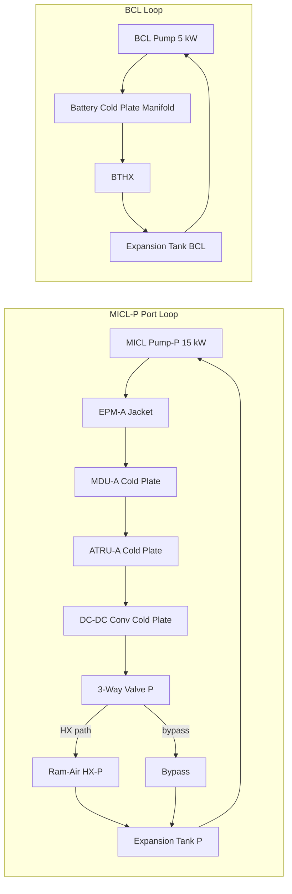
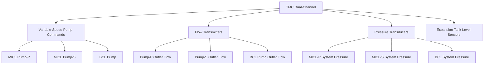

<!-- ──────────────────────────────────────────────────────────────────────────
     QATL-ATLAS-1000-ATLAS-070-079-07-074-020-LIQUID-COOLING-LOOPS-AND-PUMPS
     ATA 74 · Liquid Cooling Loops and Pumps
     AMPEL360E eWTW — ATLAS Register 1000
────────────────────────────────────────────────────────────────────────────── -->

# Liquid Cooling Loops and Pumps

---

## §0 Hyperlink Policy

> All hyperlinks in this document are **relative** (five directory levels: `../../../../../`).
> Absolute URLs are forbidden. Every linked document must exist in the Q+ATLANTIDE repository
> before the link is activated. Broken links are treated as open issues and must be resolved
> before the document is promoted from `DRAFT` to `APPROVED`.

---

## §1 Purpose

This document describes the liquid cooling circuit design, fluid specification, pump assemblies, loop routing, and flow management for the Motor–Inverter Cooling Loop (MICL) and Battery Cooling Loop (BCL) of the AMPEL360E eWTW ATA 74 Thermal Management System.

Three closed-loop forced-circulation circuits are defined:
- **MICL-P** (port): serves EPM-A, MDU-A, ATRU-A; rejects heat via Ram-Air HX Port.
- **MICL-S** (stbd): serves EPM-B, MDU-B, ATRU-B; rejects heat via Ram-Air HX Stbd.
- **BCL**: serves all battery module cold plates; rejects heat via BTHX.

All circuits use a **50/50 ethylene glycol-water (EGW) mixture** conforming to ASTM D3306 Type A, providing freeze protection to −65 °C and a flash point well above the operating temperature range.

---

## §2 Applicability

| Parameter | Value |
|---|---|
| Aircraft Program | AMPEL360E eWTW |
| ATA reference | ATA 74-020 — Liquid Cooling Loops and Pumps |
| Certification basis | EASA CS-25 Amdt 27+ |
| S1000D SNS | 074-020-00 |

---

## §3 Functional Description ![DRAFT]

**Fluid Specification:**

| Parameter | MICL (Port and Stbd) | BCL |
|---|---|---|
| Fluid | 50/50 EGW, ASTM D3306 Type A | 50/50 EGW, ASTM D3306 Type A |
| Operating temperature range | 0 °C to 75 °C | −10 °C to 45 °C |
| Freeze protection | −65 °C | −65 °C |
| pH range | 7.0–8.5 | 7.0–8.5 |
| Max system pressure | 4.5 bar | 3.0 bar |
| MEOP | 4.0 bar | 2.7 bar |
| Total circuit volume (each MICL) | ~18 L (estimated) | ~12 L (estimated) |

**MICL Pump Assemblies (×2, port and stbd):**

Each MICL pump assembly consists of a brushless DC centrifugal pump driven by a dedicated pump controller (integrated electronics). Operating point: 15 kW shaft power, 120 L/min at 3.5 bar differential pressure, with TMC-commanded variable-speed modulation from 20 % to 100 % speed. The pump housing is titanium Grade 5; impeller is PEEK composite for chemical compatibility. Pump life: ≥ 10,000 h before first overhaul.

**BCL Pump Assembly (×1):**

The BCL pump assembly is a brushless DC centrifugal pump sized for 50 L/min at 2.0 bar differential pressure, shaft power 5 kW maximum. Identical fluid and construction to MICL pumps, scaled for lower flow demand. TMC-commanded variable speed from 20 % to 100 %.

**Loop Routing:**

The MICL-P routing (port side): Pump outlet → EPM-A stator cooling jacket (nacelle, Zone A) → MDU-A cold plate (wing root, Zone B) → ATRU-A cold plate (pylon, Zone B) → DC-DC converter cold plate (EE bay) → 3-way mixing valve (bypass/HX port) → Ram-Air HX-P → expansion tank → pump inlet.

The MICL-S routing is mirror-identical on the stbd side.

The BCL routing: BCL pump outlet → Battery module cold plate manifold input (Frames 28–48, Zone C) → BTHX → expansion tank → pump inlet.

**Expansion Tanks:**

Each circuit has a sealed pressurised expansion tank (ASME-equivalent design, 0.5 L nominal volume per circuit) with a sight glass for fluid level monitoring and a nitrogen pre-charge pressure of 1.0 bar absolute. Located at the highest point of each loop to facilitate air purging.

---

## §4 Functional Breakdown

| ID | Name | Description | Lead Division |
|---|---|---|---|
| F-001 | MICL-P loop (port) | EPM-A + MDU-A + ATRU-A cooling circuit; pump, valves, HX-P | Q-GREENTECH |
| F-002 | MICL-S loop (stbd) | EPM-B + MDU-B + ATRU-B cooling circuit; pump, valves, HX-S | Q-GREENTECH |
| F-003 | BCL loop | Battery module cooling circuit; BCL pump, BTHX | Q-GREENTECH |
| F-004 | Fluid management | EGW fluid specification, pH control, expansion tanks, drain/fill provisions | Q-MECHANICS |
| F-005 | Pump speed control | TMC-commanded variable-speed pump modulation; flow and pressure monitoring | Q-HPC |

---

## §5 System Context — Mermaid Diagram

---

## §6 Internal Architecture — Mermaid Diagram

---

## §7 Components and LRUs

| Component | Part Number | Qty | Location | Maintenance Interval | Notes |
|---|---|---|---|---|---|
| MICL Pump Assembly — Port | MICL-PUMP-P-PN-TBD | 1 | Wing root fairing, port | On condition; A-check BITE | Brushless; 15 kW; 120 L/min; Ti housing; PEEK impeller |
| MICL Pump Assembly — Stbd | MICL-PUMP-S-PN-TBD | 1 | Wing root fairing, stbd | On condition; A-check BITE | Identical to port |
| BCL Pump Assembly | BCL-PUMP-PN-TBD | 1 | Lower fuselage Frame 30 | On condition; A-check BITE | Brushless; 5 kW; 50 L/min |
| Expansion Tank — MICL Port | EXP-MICL-P-PN-TBD | 1 | Wing root, port (highest point of loop) | A-check level check; C-check N₂ pressure | 0.5 L; N₂ pre-charge 1.0 bar; sight glass |
| Expansion Tank — MICL Stbd | EXP-MICL-S-PN-TBD | 1 | Wing root, stbd | A-check level check; C-check N₂ pressure | Identical to port |
| Expansion Tank — BCL | EXP-BCL-PN-TBD | 1 | Lower fuselage, Frame 30 | A-check level check; C-check N₂ pressure | 0.5 L; N₂ pre-charge 1.0 bar |
| Flow Transmitter — MICL-P | FT-MICL-P-PN-TBD | 1 | MICL-P pump outlet | C-check calibration | Turbine-type; 0–150 L/min; 4–20 mA output |
| Flow Transmitter — MICL-S | FT-MICL-S-PN-TBD | 1 | MICL-S pump outlet | C-check calibration | Identical to port |
| Flow Transmitter — BCL | FT-BCL-PN-TBD | 1 | BCL pump outlet | C-check calibration | Turbine-type; 0–70 L/min |

---

## §8 Interfaces

| Interface Type | Connected System | Protocol / Medium | Data / Function |
|---|---|---|---|
| ATA 74-030 | Heat exchangers and cold plates | Coolant piping | MICL and BCL fluid flows into HX and cold plate assemblies |
| ATA 74-050 | Thermal control valves | Coolant piping + valve actuator signal | 3-way mixing valves downstream of MICL heat sources |
| ATA 74-080 TMC | Thermal Management Controller | AFDX / discrete | Pump speed commands; flow and pressure sensor data |
| ATA 72 Battery / BMS | Battery pack thermal | Coolant piping (BCL) | BCL fluid flow through battery module cold plates |
| ATA 71/72 EPM | Electric Propulsion Motor | Coolant piping (MICL) | MICL fluid flow through EPM stator cooling jacket |

---

## §9 Operating Modes

| Mode | Trigger | System State | Actions / Consequences |
|---|---|---|---|
| Full-power cooling | EPMs at maximum demand | MICL pumps at 100 % (120 L/min each); BCL pump at 80 % | Maximum heat rejection; coolant temperature rising toward 65 °C limit |
| Cruise regulation | Coolant temperature at setpoint | MICL pumps at 40–60 % speed (TMC-modulated) | Reduced pump power; quieter operation |
| Standby | EPMs and MDUs inactive | MICL pumps at idle (20 % speed, minimum flow for system health) | Prevents air lock and freezing at altitude; loop pressure maintained |
| Pump failed (one MICL circuit) | Pump BITE failure; flow sensor zero | TMC commands pump at 100 % (recovery attempt); then declares failed if no flow | EPM and MDU on failed side de-rated; ECAM amber; continued flight |
| Low fluid level | Expansion tank level sensor alarm | TMC declares low fluid level caution | Crew advised; maintenance action on landing; no immediate power change |

---

## §10 Performance and Budgets ![DRAFT]

| Parameter | Requirement | Target / Design Value | Status |
|---|---|---|---|
| MICL pump max flow rate (each) | ≥ 100 L/min at 3.0 bar ΔP | 120 L/min at 3.5 bar ΔP | ![TBD] |
| BCL pump max flow rate | ≥ 40 L/min at 1.8 bar ΔP | 50 L/min at 2.0 bar ΔP | ![TBD] |
| Pump life before first overhaul | ≥ 10,000 h | 12,000 h target | ![TBD] |
| EGW freeze protection | ≤ −55 °C (min operating altitude requirement) | −65 °C (50/50 EGW) | Confirmed by ASTM D3306 |
| MICL system pressure (normal) | ≤ 4.0 bar (MEOP) | 3.0–3.5 bar | ![TBD] |
| BCL system pressure (normal) | ≤ 2.7 bar (MEOP) | 2.0–2.5 bar | ![TBD] |
| Expansion tank pre-charge pressure | 1.0 bar N₂ absolute | 1.0 ± 0.1 bar | ![TBD] |

---

## §11 Safety, Redundancy and Fault Tolerance

- MICL-P and MICL-S are fully independent circuits; pump failure on one side does not affect the opposite side.
- BCL is a single circuit; failure triggers BMS battery de-rate, reducing heat generation and extending thermal autonomy.
- All pump shaft seals are double mechanical seal design with a leak-detection interstitial pressure sensor — leaks detected before fluid loss.
- Expansion tanks prevent cavitation at high altitude by maintaining positive circuit suction pressure; minimum pump inlet pressure ≥ 0.5 bar absolute at all altitudes.
- EGW coolant is non-flammable and non-toxic; spill in fire zones does not create additional fire hazard.
- Pump BITE monitors motor current, speed feedback, outlet pressure, and outlet temperature; fault flags to TMC within 100 ms.

---

## §12 Maintenance and Diagnostics

| Task | Interval | Access | Special Tools |
|---|---|---|---|
| Pump BITE fault log download | A-check | TMC GSE terminal / CMS | CMS GSE terminal |
| Expansion tank fluid level visual check | A-check | Wing root / lower fuselage sight glass | None (visual) |
| Expansion tank N₂ pre-charge pressure check | C-check | Expansion tank service port | N₂ pressure gauge; N₂ supply rig |
| Coolant sample for pH and concentration | 6 months or on-condition | Drain valve at pump inlet | Refractometer; pH test kit; sample vial |
| Flow transmitter calibration check | C-check | Pump outlet line | Portable flow reference; TMC GSE |
| Full coolant drain and refill | D-check or per SB | Drain valves — three loops | Coolant filling rig; vacuum purge kit |
| Pump unit replacement | On condition or pump BITE fault | Wing root / fuselage access panel | Standard hand tools; torque wrench; coolant catch rig |

---

## §13 Footprint

| Footprint Type | Parameter | Value | Notes |
|---|---|---|---|
| Physical | MICL-P total fluid volume | ~18 L | Estimated pending detailed routing |
| Physical | MICL-S total fluid volume | ~18 L | Mirror of MICL-P |
| Physical | BCL total fluid volume | ~12 L | Battery cold plate manifold and piping |
| Physical | MICL pump mass (each) | ![TBD] | Pending OEM data |
| Physical | BCL pump mass | ![TBD] | Pending OEM data |
| Power | MICL pump max power (each) | 15 kW | Drawn from HVDC 270 V bus |
| Power | BCL pump max power | 5 kW | Drawn from HVDC 270 V bus |

---

## §14 Safety and Certification References ![DRAFT]

| Standard / Document | Title | Issuing Body | Applicability |
|---|---|---|---|
| ASTM D3306 | Specification for Ethylene Glycol Base Engine Coolant | ASTM | EGW fluid specification |
| EASA CS-25 §25.993 | Fuel system lines and fittings | EASA | Coolant line pressure test requirements |
| SAE AS4059 | Aerospace Fluid Power — Cleanliness Classification | SAE | Fluid cleanliness for pump protection |
| DO-160G | Environmental Conditions and Test Procedures | RTCA | Pump and transmitter environmental qualification |
| MIL-PRF-5606 | Hydraulic Fluid, Petroleum Base (reference) | MIL | Compatibility comparison baseline |

---

## §15 V&V Approach ![TBD]

| Phase | Method | Acceptance Criterion | Status |
|---|---|---|---|
| Design | Hydraulic loop pressure drop analysis | Pump operating point within rated envelope; ΔP per component < budget | ![TBD] |
| Unit | Pump bench test — flow vs. pressure curve | ≥ 120 L/min at 3.5 bar ΔP for MICL; ≥ 50 L/min at 2.0 bar for BCL | ![TBD] |
| Integration | Ground circuit pressurisation and leak test | No leak at 1.5 × MEOP (6 bar MICL; 4 bar BCL) for 30 min | ![TBD] |
| Qualification | DO-160G environmental qualification | All categories pass for pump, transmitter, expansion tank | ![TBD] |
| Certification | CS-25 §25.1043 cooling test — full flight envelope | Coolant temperatures within limits across all flight phases | ![TBD] |

---

## §16 Glossary

| Term | Definition |
|---|---|
| **EGW** | Ethylene Glycol-Water — coolant mixture; 50/50 volume ratio per ASTM D3306. |
| **MICL** | Motor–Inverter Cooling Loop — glycol-water circuit for EPM, MDU, and ATRU cooling. |
| **BCL** | Battery Cooling Loop — glycol-water circuit for battery module cooling. |
| **MEOP** | Maximum Expected Operating Pressure — design basis for circuit pressure testing. |
| **PEEK** | Polyether ether ketone — high-performance thermoplastic used for pump impeller. |
| **Expansion tank** | Sealed pressurised reservoir absorbing fluid volume change with temperature; prevents cavitation. |
| **N₂ pre-charge** | Nitrogen gas pre-loaded into expansion tank to maintain positive circuit pressure. |
| **BITE** | Built-In Test Equipment — onboard self-test logic for pump health monitoring. |

---

## §17 Open Issues

| ID | Description | Owner | Target |
|---|---|---|---|
| OI-074-020-001 | Confirm pump OEM selection for MICL and BCL units; obtain performance curve and MTBF data | Q-MECHANICS | 2026-Q4 |
| OI-074-020-002 | Validate total MICL-P fluid volume against detailed pipe routing model | Q-MECHANICS | 2026-Q4 |
| OI-074-020-003 | Define coolant drain/fill connection standard (quick-connect type) for GCU interface | Q-MECHANICS | 2026-Q4 |

---

## §18 Status Legend

| Badge | Meaning |
|---|---|
| `![DRAFT]` | Section is drafted but not yet reviewed |
| `![TBD]` | Content not yet started — to be defined |
| `![To Be Completed]` | Partially complete — needs additional content |
| `![APPROVED]` | Reviewed and formally approved |

---

## §19 Related Documents (Siblings in this Subsection)

- [074-000](./074-000-Thermal-Management-Hybrid-General.md)
- [074-010](./074-010-Propulsion-Thermal-Architecture.md)
- [074-030](./074-030-Heat-Exchangers-Cold-Plates-and-Radiators.md)
- [074-040](./074-040-Motor-Inverter-and-Battery-Cooling-Interfaces.md)
- [074-050](./074-050-Thermal-Control-Valves-and-Regulation.md)
- [074-060](./074-060-Overtemperature-and-Fire-Zone-Thermal-Isolation.md)
- [074-070](./074-070-Thermal-System-Service-and-Maintenance.md)
- [074-080](./074-080-Thermal-Management-Monitoring-Diagnostics-and-Control-Interfaces.md)
- [074-090](./074-090-S1000D-CSDB-Mapping-and-Traceability.md)

---

## §20 Change Log

| Rev | Date | Author | Description |
|---|---|---|---|
| 0.1 | 2026-05-12 | @copilot | Initial DRAFT — liquid cooling loops, EGW fluid spec, pump assemblies and loop routing for AMPEL360E eWTW ATA 74 |
