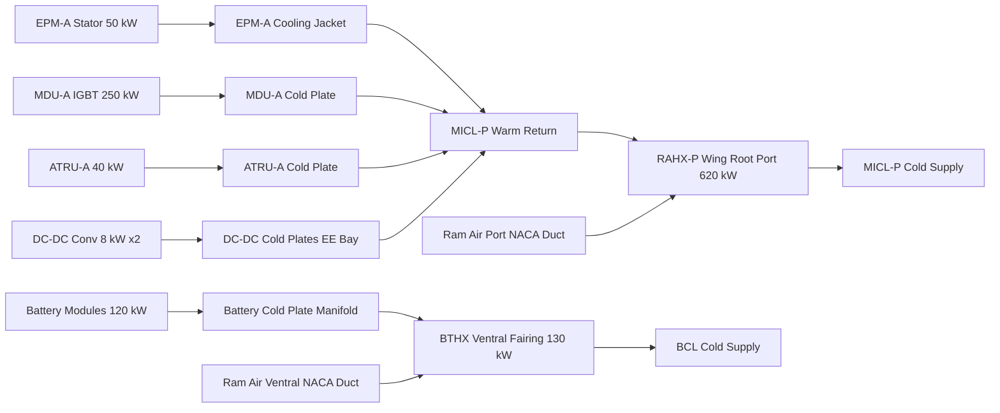
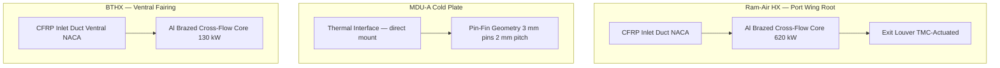

<!-- ──────────────────────────────────────────────────────────────────────────
     QATL-ATLAS-1000-ATLAS-070-079-07-074-030-HEAT-EXCHANGERS-COLD-PLATES-AND-RADIATORS
     ATA 74 · Heat Exchangers Cold Plates and Radiators
     AMPEL360E eWTW — ATLAS Register 1000
────────────────────────────────────────────────────────────────────────────── -->

# Heat Exchangers Cold Plates and Radiators

---

## §0 Hyperlink Policy

> All hyperlinks in this document are **relative** (five directory levels: `../../../../../`).
> Absolute URLs are forbidden. Every linked document must exist in the Q+ATLANTIDE repository
> before the link is activated. Broken links are treated as open issues and must be resolved
> before the document is promoted from `DRAFT` to `APPROVED`.

---

## §1 Purpose

This document describes the heat transfer components of the AMPEL360E eWTW ATA 74 Thermal Management System: the ram-air heat exchangers (RAHX) for Motor–Inverter Cooling Loop (MICL) heat rejection, the Battery Thermal Heat Exchanger (BTHX) for Battery Cooling Loop (BCL) heat rejection, the EPM stator cooling jackets, the MDU and ATRU cold plates, and the DC-DC converter cold plates.

These components form the thermal interface between the propulsion waste heat sources and the two coolant circuits, and between the coolant circuits and the ambient ram-air heat sink.

---

## §2 Applicability

| Parameter | Value |
|---|---|
| Aircraft Program | AMPEL360E eWTW |
| ATA reference | ATA 74-030 — Heat Exchangers Cold Plates and Radiators |
| Certification basis | EASA CS-25 Amdt 27+ |
| S1000D SNS | 074-030-00 |

---

## §3 Functional Description ![DRAFT]

**Ram-Air Heat Exchangers (RAHX-P and RAHX-S):**

Two identical aluminium-brazed cross-flow heat exchanger cores installed in the wing root NACA ducts (port and stbd). Each RAHX is designed to reject up to 620 kW of propulsion waste heat from the MICL to ambient ram air at cruise conditions (ISA, FL370, M0.82). Core dimensions: ~800 mm × 600 mm × 80 mm (L × W × D). Corrugated aluminium offset-strip fin geometry; fin density 14 fins/inch; louvered fin type for enhanced convective transfer.

Inlet and outlet ducts are composite (CFRP face-sheet, aluminium honeycomb core) with an electrically actuated exit louver that modulates air flow through the core under TMC command — providing airflow control independent of aircraft speed variation.

**Battery Thermal Heat Exchanger (BTHX):**

One aluminium-brazed cross-flow heat exchanger installed in the ventral fairing NACA duct (lower fuselage, Frames 35–40). Rated heat rejection: 130 kW at ISA, SL, 250 KTAS. Core dimensions: ~500 mm × 400 mm × 60 mm. Identical corrugated louvered aluminium fin construction to RAHX. No exit louver — BCL pump speed modulation alone controls heat rejection in the BCL.

**EPM Stator Cooling Jackets:**

Each EPM (ATA 72) has an integral water-cooling jacket encircling the stator outer diameter, manufactured in aluminium alloy 6061-T6. Coolant channels are helical, 12 mm diameter, 6 passes, providing ~50 kW maximum heat rejection from stator copper losses. Jacket-to-stator thermal resistance target: ≤ 0.03 K/W. Inlet/outlet connections are O-ring face-seal (ORFS) fittings per SAE J1453.

**MDU Cold Plates:**

Each MDU (Motor Drive Unit / inverter, ATA 73) is mounted on a custom aluminium liquid cold plate. The cold plate uses pin-fin internal geometry (3 mm diameter pins, 2 mm pitch) for maximised convective area. Rated for 250 kW per MDU at a coolant inlet temperature of 65 °C with IGBT junction temperature ≤ 110 °C. Cold plate-to-MDU baseplate thermal resistance target: ≤ 0.02 K/W.

**ATRU Cold Plates:**

Each ATRU (ATA 73) is cooled by a flat aluminium cold plate with serpentine internal channels. Rated for 40 kW per ATRU. Simpler geometry than MDU cold plate given lower heat flux. Cold plate-to-ATRU chassis thermal contact via thermally conductive elastomeric interface pad (λ ≥ 3 W/m·K).

**DC-DC Converter Cold Plates:**

Two cold plates (one per 540→270 V converter) with serpentine channel geometry. Rated for 8 kW each. Shared MICL port circuit — both converters are in the EE bay, tapped off the MICL-P return line.

---

## §4 Functional Breakdown

| ID | Name | Description | Lead Division |
|---|---|---|---|
| F-001 | RAHX-P and RAHX-S | Ram-air HX in wing root NACA ducts; MICL heat rejection; 620 kW each | Q-GREENTECH |
| F-002 | BTHX | Battery ram-air HX in ventral fairing; BCL heat rejection; 130 kW | Q-GREENTECH |
| F-003 | EPM stator cooling jacket | Integral helical coolant channel in each EPM stator; 50 kW per motor | Q-MECHANICS |
| F-004 | MDU cold plates | Pin-fin aluminium cold plates for each MDU; 250 kW each | Q-MECHANICS |
| F-005 | ATRU and DC-DC cold plates | Serpentine channel cold plates for ATRUs (40 kW) and DC-DC converters (8 kW) | Q-INDUSTRY |

---

## §5 System Context — Mermaid Diagram

---

## §6 Internal Architecture — Mermaid Diagram

---

## §7 Components and LRUs

| Component | Part Number | Qty | Location | Maintenance Interval | Notes |
|---|---|---|---|---|---|
| Ram-Air HX — Port (RAHX-P) | RAHX-P-PN-TBD | 1 | Wing root NACA duct, port | C-check core clean + inspection | Al brazed; 620 kW; exit louver included |
| Ram-Air HX — Stbd (RAHX-S) | RAHX-S-PN-TBD | 1 | Wing root NACA duct, stbd | C-check core clean + inspection | Identical to port |
| Battery Thermal HX (BTHX) | BTHX-PN-TBD | 1 | Ventral fairing NACA duct | C-check core clean + inspection | Al brazed; 130 kW; no exit louver |
| Exit Louver Actuator — RAHX-P | LOUVER-ACT-P-PN-TBD | 1 | Wing root, port | C-check actuation verify | Electric; TMC-commanded; position feedback |
| Exit Louver Actuator — RAHX-S | LOUVER-ACT-S-PN-TBD | 1 | Wing root, stbd | C-check actuation verify | Identical to port |
| EPM-A Cooling Jacket | EPM-JKT-A-PN-TBD | 1 | EPM-A stator (nacelle, port) | On condition; inspect at engine removal | Al 6061-T6; integral to EPM stator; ORFS connections |
| EPM-B Cooling Jacket | EPM-JKT-B-PN-TBD | 1 | EPM-B stator (nacelle, stbd) | On condition; inspect at engine removal | Identical to EPM-A |
| MDU-A Cold Plate | MDU-CP-A-PN-TBD | 1 | Wing root, port (MDU-A underside) | C-check visual + leak check | Al 6061-T6; pin-fin; 250 kW rated |
| MDU-B Cold Plate | MDU-CP-B-PN-TBD | 1 | Wing root, stbd (MDU-B underside) | C-check visual + leak check | Identical to MDU-A |
| ATRU-A Cold Plate | ATRU-CP-A-PN-TBD | 1 | Pylon, port | C-check visual + TIM inspect | Al; serpentine; 40 kW; TIM pad |
| ATRU-B Cold Plate | ATRU-CP-B-PN-TBD | 1 | Pylon, stbd | C-check visual + TIM inspect | Identical to ATRU-A |

---

## §8 Interfaces

| Interface Type | Connected System | Protocol / Medium | Data / Function |
|---|---|---|---|
| ATA 74-020 | Liquid cooling loops and pumps | Coolant piping | MICL and BCL fluid supply and return connections |
| ATA 74-050 | Thermal control valves | Coolant piping | MICL 3-way valve upstream of RAHX input |
| ATA 74-080 TMC | Thermal Management Controller | Exit louver actuator signal; AFDX | Louver position command; HX inlet/outlet temperature monitoring |
| ATA 72 EPM | Electric Propulsion Motor | Coolant piping (MICL) + ORFS fittings | EPM stator jacket coolant supply and return |
| ATA 73 MDU / ATRU | Motor Drive Unit and ATRU | Coolant piping (MICL) | MDU and ATRU cold plate supply and return |
| ATA 21 ECS | Environmental Control System | Shared NACA duct | Ram-air apportionment in wing root duct between MICL HX and ECS pre-cooler |

---

## §9 Operating Modes

| Mode | Trigger | System State | Actions / Consequences |
|---|---|---|---|
| Full HX mode (T/O climb) | Max thermal load; MICL inlet > 60 °C | Exit louver fully open; ram-air flow maximised | Maximum heat rejection; HX core at full duty |
| Partial HX mode (cruise) | MICL temperature at setpoint | Exit louver partially closed; TMC modulates | Reduced airflow over HX; pump speed also reduced |
| Ground cooling (pre-flight) | Aircraft on ground; EPMs inactive | BCL pump active; BTHX provides passive convection; GCU option | Battery pre-conditioning to ≤ 25 °C target |
| HX bypass (pre-heat cold soak) | Coolant temperature < 10 °C at start-up | 3-way valve bypasses RAHX to warm coolant quickly | Prevents cold thermal shock to EPM jacket and MDU cold plate |
| Exit louver failed open | Actuator fault | HX operates at full ram-air flow | Slight over-cooling at cruise; acceptable |

---

## §10 Performance and Budgets ![DRAFT]

| Parameter | Requirement | Target / Design Value | Status |
|---|---|---|---|
| RAHX heat rejection (each, ISA SL 250 KTAS) | ≥ 600 kW | 620 kW | ![TBD] |
| RAHX heat rejection (each, ISA FL370 M0.82) | ≥ 400 kW | 450 kW target | ![TBD] |
| BTHX heat rejection (ISA SL 250 KTAS) | ≥ 120 kW | 130 kW | ![TBD] |
| MDU cold plate thermal resistance | ≤ 0.02 K/W | 0.015 K/W target | ![TBD] |
| EPM jacket thermal resistance | ≤ 0.03 K/W | 0.025 K/W target | ![TBD] |
| ATRU cold plate TIM thermal resistance | ≤ 0.05 K/W | 0.04 K/W target | ![TBD] |
| RAHX core pressure drop (coolant side) | ≤ 0.5 bar at rated flow | 0.4 bar target | ![TBD] |

---

## §11 Safety, Redundancy and Fault Tolerance

- RAHX-P and RAHX-S are independent; single HX failure results in de-rate of the affected propulsion channel only.
- Exit louver fail-safe position is "open" — spring-loaded to fully open; actuator provides modulation. Louver failure therefore degrades efficiency but not safety.
- BTHX has no bypass; BCL pump speed modulation alone controls heat rejection — simpler failure mode with no valve fault risk.
- MDU cold plate leak detection: differential pressure across cold plate is monitored; pressure drop increase signals blockage; pressure loss signals leak.
- EPM cooling jacket leak in fire zone (Zone A) is detected by MICL flow transmitter; low-flow alarm to TMC within 5 s.
- All HX and cold plate connections are O-ring face-seal (ORFS) per SAE J1453 — no wrench-tightened threaded joints that could lose torque in vibration.

---

## §12 Maintenance and Diagnostics

| Task | Interval | Access | Special Tools |
|---|---|---|---|
| RAHX core visual inspection (fouling, fin damage) | C-check | Wing root NACA duct panel — 4 h per side | Inspection mirror; borescope |
| RAHX core cleaning (nitrogen blow-through + water rinse) | C-check | Wing root panel | Nitrogen cart; wash rig |
| BTHX core inspection and cleaning | C-check | Ventral fairing access panel — 3 h | Nitrogen cart; wash rig |
| Exit louver actuation and position sensor check | C-check | Wing root panel; TMC GSE actuator command | TMC GSE |
| MDU cold plate leak test | C-check | Wing root panel; MDU removal | Pressure test kit; 1.5 × MEOP |
| ATRU cold plate TIM pad inspection (for desiccation / cracking) | C-check | Pylon panel | Torque wrench; replacement TIM pad kit |
| EPM cooling jacket inspection | Engine removal interval | Nacelle; EPM removal | Hydraulic leak test bench |

---

## §13 Footprint

| Footprint Type | Parameter | Value | Notes |
|---|---|---|---|
| Physical | RAHX core mass (each) | ![TBD] | Al brazed; pending OEM weight data |
| Physical | BTHX core mass | ![TBD] | Pending OEM weight data |
| Physical | RAHX core dimensions | ~800 × 600 × 80 mm | Estimated; final per OEM detail design |
| Physical | BTHX core dimensions | ~500 × 400 × 60 mm | Estimated |
| Thermal | Total cold plate count | 6 | 2 MDU + 2 ATRU + 2 DC-DC converter |
| Maintenance | RAHX C-check access time | ~4 h per side | Wing root NACA duct panel |

---

## §14 Safety and Certification References ![DRAFT]

| Standard / Document | Title | Issuing Body | Applicability |
|---|---|---|---|
| SAE AIR1168/3 | Aerothermodynamic Systems Engineering | SAE | HX sizing and thermal performance methodology |
| SAE J1453 | Fitting, O-Ring Face Seal | SAE | ORFS fitting standard for HX connections |
| EASA CS-25 §25.1043 | Cooling tests | EASA | HX performance demonstration requirements |
| DO-160G Section 8 | Humidity, Temperature | RTCA | HX and cold plate environmental qualification |
| ASTM B209 | Specification for Aluminum and Aluminum-Alloy Sheet and Plate | ASTM | Al 6061-T6 material for HX cores and cold plates |

---

## §15 V&V Approach ![TBD]

| Phase | Method | Acceptance Criterion | Status |
|---|---|---|---|
| Design | CFD thermal simulation of RAHX core at design point | ≥ 620 kW rejection at ISA SL 250 KTAS; MDU junction ≤ 110 °C | ![TBD] |
| Unit | RAHX thermal performance bench test | Measured rejection ≥ 620 kW ± 5 % at design point | ![TBD] |
| Unit | Cold plate thermal resistance measurement | MDU cold plate ≤ 0.02 K/W; EPM jacket ≤ 0.03 K/W | ![TBD] |
| Integration | Ground system power-up — all HX and cold plates in circuit | Temperatures within limits; no coolant leaks | ![TBD] |
| Certification | CS-25 §25.1043 flight cooling test | All component temperatures within qualified limits across flight envelope | ![TBD] |

---

## §16 Glossary

| Term | Definition |
|---|---|
| **RAHX** | Ram-Air Heat Exchanger — air-to-liquid HX in wing root NACA duct for MICL heat rejection. |
| **BTHX** | Battery Thermal Heat Exchanger — air-to-liquid HX in ventral fairing for BCL heat rejection. |
| **Cold plate** | Liquid-cooled metal plate with internal channels; mounts directly to electronic component (MDU, ATRU). |
| **Pin-fin** | Internal cold plate geometry using arrays of pins to maximise convective surface area. |
| **TIM** | Thermal Interface Material — thermally conductive elastomeric pad between cold plate and component chassis. |
| **ORFS** | O-Ring Face Seal — reliable push-to-connect fluid fitting per SAE J1453. |
| **Exit louver** | Electrically actuated air-flow modulation flap at RAHX exit; controls ram-air flow through HX core. |
| **Al brazed** | Aluminium vacuum-brazed HX core construction — high thermal conductivity and structural integrity. |

---

## §17 Open Issues

| ID | Description | Owner | Target |
|---|---|---|---|
| OI-074-030-001 | Confirm RAHX OEM selection and obtain detailed performance curves vs. airspeed and altitude | Q-GREENTECH | 2026-Q4 |
| OI-074-030-002 | Define ram-air NACA duct area apportionment with ATA 21 ECS team for shared wing root inlet | Q-GREENTECH / Q-AIR | 2026-Q4 |
| OI-074-030-003 | Qualify MDU cold plate-to-MDU baseplate thermal interface; confirm TIM vs. direct solder mount | Q-MECHANICS | 2027-Q1 |

---

## §18 Status Legend

| Badge | Meaning |
|---|---|
| `![DRAFT]` | Section is drafted but not yet reviewed |
| `![TBD]` | Content not yet started — to be defined |
| `![To Be Completed]` | Partially complete — needs additional content |
| `![APPROVED]` | Reviewed and formally approved |

---

## §19 Related Documents (Siblings in this Subsection)

- [074-000](./074-000-Thermal-Management-Hybrid-General.md)
- [074-010](./074-010-Propulsion-Thermal-Architecture.md)
- [074-020](./074-020-Liquid-Cooling-Loops-and-Pumps.md)
- [074-040](./074-040-Motor-Inverter-and-Battery-Cooling-Interfaces.md)
- [074-050](./074-050-Thermal-Control-Valves-and-Regulation.md)
- [074-060](./074-060-Overtemperature-and-Fire-Zone-Thermal-Isolation.md)
- [074-070](./074-070-Thermal-System-Service-and-Maintenance.md)
- [074-080](./074-080-Thermal-Management-Monitoring-Diagnostics-and-Control-Interfaces.md)
- [074-090](./074-090-S1000D-CSDB-Mapping-and-Traceability.md)

---

## §20 Change Log

| Rev | Date | Author | Description |
|---|---|---|---|
| 0.1 | 2026-05-12 | @copilot | Initial DRAFT — RAHX, BTHX, EPM jackets, MDU/ATRU cold plates for AMPEL360E eWTW ATA 74 |
