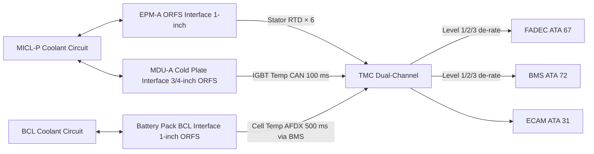
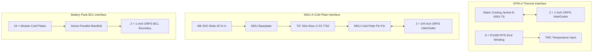

<!-- ──────────────────────────────────────────────────────────────────────────
     QATL-ATLAS-1000-ATLAS-070-079-07-074-040-MOTOR-INVERTER-AND-BATTERY-COOLING-INTERFACES
     ATA 74 · Motor Inverter and Battery Cooling Interfaces
     AMPEL360E eWTW — ATLAS Register 1000
────────────────────────────────────────────────────────────────────────────── -->

# Motor Inverter and Battery Cooling Interfaces

---

## §0 Hyperlink Policy

> All hyperlinks in this document are **relative** (five directory levels: `../../../../../`).
> Absolute URLs are forbidden. Every linked document must exist in the Q+ATLANTIDE repository
> before the link is activated. Broken links are treated as open issues and must be resolved
> before the document is promoted from `DRAFT` to `APPROVED`.

---

## §1 Purpose

This document defines the thermal and mechanical interfaces between the ATA 74 Thermal Management System (TMS) coolant circuits and the three principal heat-generating propulsion subsystems: Electric Propulsion Motors (EPMs, ATA 72), Motor Drive Units / Inverters (MDUs, ATA 73), and the Lithium-NMC Battery Pack (ATA 72). These interfaces establish the thermal contact requirements, connector standards, temperature monitoring, and inter-system co-regulation protocols between ATA 74 and the subsystems it cools.

---

## §2 Applicability

| Parameter | Value |
|---|---|
| Aircraft Program | AMPEL360E eWTW |
| ATA reference | ATA 74-040 — Motor Inverter and Battery Cooling Interfaces |
| Certification basis | EASA CS-25 Amdt 27+ |
| S1000D SNS | 074-040-00 |

---

## §3 Functional Description ![DRAFT]

**EPM–MICL Interface:**

Each EPM (ATA 72) provides two coolant connections to the MICL: a 1-inch ORFS (O-Ring Face Seal, SAE J1453) inlet and a 1-inch ORFS outlet on the stator cooling jacket. The EPM OEM is responsible for the cooling jacket as part of the EPM assembly; ATA 74 is responsible for the coolant line routing, connection fittings, and MICL pump and HX sizing. Thermal monitoring uses six Pt1000 resistance temperature detectors (RTDs) embedded in the stator end-windings (three per phase), hardwired to the TMC via shielded cable through the motor terminal box. Winding temperature limit: 120 °C (Class H insulation).

**MDU–MICL Interface:**

Each MDU (ATA 73) baseplate bolts directly onto the MDU cold plate (ATA 74-030) using M8 stainless steel socket-head cap screws with calibrated torque (25 N·m). Thermal interface compound (TIC) — Shin-Etsu X-23-7762 silicone-based, λ = 4.5 W/m·K — is applied to the MDU-to-cold-plate interface at installation. Two ORFS 3/4-inch fittings (inlet/outlet) connect the cold plate to the MICL piping. MDU IGBT junction temperatures are monitored by the MDU's internal IGBT gate driver board and reported via CAN bus to the TMC at 100 ms cycle rate; MDU junction limit: 125 °C.

**Battery Pack–BCL Interface:**

The battery pack (ATA 72) consists of 24 modules arranged in four rows. Each module has a dedicated aluminium cold plate integrated into the module housing by the battery OEM; the cold plate has two 1/2-inch ORFS ports. Modules in each row are connected in series-parallel coolant manifold piping within Zone C (battery bay), aggregated to two 1-inch ORFS connections (supply and return) at the battery pack boundary — the ATA 74 BCL interface point. Cell temperature monitoring is the responsibility of the Battery Management System (BMS, ATA 72), which reports cell temperatures to the TMC via AFDX at 500 ms cycle rate. Cell temperature limit: 45 °C. The TMC uses BMS-reported cell temperatures to modulate BCL pump speed independently of BCL outlet temperature measurement.

**Co-Regulation Protocol:**

The TMC implements a three-level thermal co-regulation protocol:

1. **Level 1 (Thermal Advisory):** Component temperature ≥ 80 % of limit → TMC increases pump speed and opens MICL mixing valve to HX → ECAM advisory message.
2. **Level 2 (Thermal Caution):** Component temperature ≥ 90 % of limit → TMC sends de-rate command to FADEC (EPM) or BMS (battery) requesting 20 % power reduction → ECAM amber caution.
3. **Level 3 (Thermal Warning / Emergency):** Component temperature ≥ limit → TMC sends maximum de-rate command → ECAM red warning; crew action required.

---

## §4 Functional Breakdown

| ID | Name | Description | Lead Division |
|---|---|---|---|
| F-001 | EPM–MICL coolant interface | ORFS connections, cooling jacket, stator RTD monitoring | Q-MECHANICS |
| F-002 | MDU–MICL cold plate interface | MDU baseplate bolting, TIC application, IGBT temperature monitoring | Q-MECHANICS |
| F-003 | Battery–BCL interface | Module cold plate manifold, 1-inch ORFS BCL boundary connection, BMS temperature reporting | Q-GREENTECH |
| F-004 | Temperature monitoring and reporting | Stator RTDs, IGBT junction temps (via CAN), BMS cell temps (via AFDX) — all aggregated by TMC | Q-HPC |
| F-005 | Co-regulation protocol | Three-level thermal advisory/caution/warning with FADEC and BMS interface | Q-HPC |

---

## §5 System Context — Mermaid Diagram

---

## §6 Internal Architecture — Mermaid Diagram

---

## §7 Components and LRUs

| Component | Part Number | Qty | Location | Maintenance Interval | Notes |
|---|---|---|---|---|---|
| EPM-A ORFS Coolant Connection Kit | EPM-A-ORFS-KIT-TBD | 1 | EPM-A nacelle interface | On EPM removal | Includes two 1-inch ORFS unions, O-rings, dust caps |
| EPM-B ORFS Coolant Connection Kit | EPM-B-ORFS-KIT-TBD | 1 | EPM-B nacelle interface | On EPM removal | Identical to EPM-A kit |
| MDU-A Cold Plate Interface Kit | MDU-A-CP-KIT-TBD | 1 | MDU-A wing root | On MDU removal | Includes TIC syringe (Shin-Etsu X-23-7762), M8 bolts, two 3/4-inch ORFS unions |
| MDU-B Cold Plate Interface Kit | MDU-B-CP-KIT-TBD | 1 | MDU-B wing root | On MDU removal | Identical to MDU-A |
| Battery BCL Interface Manifold | BAT-BCL-MAN-PN-TBD | 1 | Battery bay, Frame 28 | On battery module removal | Aluminium; 1-inch ORFS supply/return; 24-module series-parallel |
| Stator RTD Assembly (×6 per EPM) | RTD-EPM-PN-TBD | 12 total | EPM stator end-windings | On EPM replacement | Pt1000 Class A; shielded cable; M3 connector |

---

## §8 Interfaces

| Interface Type | Connected System | Protocol / Medium | Data / Function |
|---|---|---|---|
| ATA 72 EPM | Electric Propulsion Motor stator cooling | ORFS coolant piping + RTD cable | Stator heat rejection; winding temperature monitoring |
| ATA 73 MDU | Motor Drive Unit / Inverter | Cold plate mounting + ORFS coolant + CAN bus | IGBT heat rejection; junction temperature reporting |
| ATA 72 Battery / BMS | Battery Management System | ORFS coolant piping (BCL) + AFDX | Cell heat rejection; cell temperature reporting to TMC |
| ATA 67 / FADEC | Full Authority Digital Engine Control | AFDX | EPM de-rate commands at Level 2 and Level 3 thermal events |
| ATA 31 ECAM | Cockpit electronic centralized display | AFDX | Thermal advisory/caution/warning messages — BLEED/COOL 74 page |

---

## §9 Operating Modes

| Mode | Trigger | System State | Actions / Consequences |
|---|---|---|---|
| Normal thermal (all in limits) | All temperatures below Level 1 threshold | MICL and BCL pump at commanded speed; no de-rate | ECAM normal; no crew action |
| Level 1 — Advisory | Any temperature ≥ 80 % of limit | TMC increases pump speed; mixing valve opens | ECAM advisory (white); crew awareness only |
| Level 2 — Caution | Any temperature ≥ 90 % of limit | TMC issues de-rate command to FADEC or BMS (20 %) | ECAM amber; crew monitors; flight continues with reduced performance |
| Level 3 — Warning | Any temperature ≥ limit | TMC issues maximum de-rate to FADEC or BMS | ECAM red warning; abnormal procedure; may require diversion |
| Cold soak start-up | Coolant temperature < 5 °C | MICL pump at minimum speed; bypass valve active | EPM winding target ≥ 10 °C before full-power commanded |

---

## §10 Performance and Budgets ![DRAFT]

| Parameter | Requirement | Target / Design Value | Status |
|---|---|---|---|
| EPM winding temperature limit | ≤ 120 °C (Class H) | ≤ 105 °C at max continuous power | ![TBD] |
| MDU IGBT junction temperature limit | ≤ 125 °C | ≤ 110 °C target | ![TBD] |
| Battery cell temperature limit | ≤ 45 °C (NMC 811 OEM) | ≤ 40 °C target | ![TBD] |
| EPM stator RTD measurement accuracy | ± 2 °C | Pt1000 Class A: ± 0.4 °C | Confirmed per IEC 60751 |
| IGBT temperature reporting latency (MDU to TMC) | ≤ 200 ms | 100 ms (CAN cycle) | Confirmed by MDU ICD |
| BMS cell temperature reporting latency | ≤ 1 s | 500 ms (AFDX cycle) | Confirmed by BMS ICD |

---

## §11 Safety, Redundancy and Fault Tolerance

- Six RTDs per EPM provides per-phase and per-end-winding temperature coverage; any single RTD failure does not disable winding temperature monitoring (redundant sensors per phase).
- MDU IGBT temperature is monitored by the MDU-internal gate driver — this is independent of the TMC and provides a hard trip if junction temperature exceeds 175 °C (hardware protection), independent of TMC Level 3 action.
- BMS cell temperature monitoring has BMS-internal over-temperature protection as well as the TMC Level 3 interface; dual-independent protection for battery thermal runaway.
- TIC application at MDU-to-cold-plate interface is torque-verified (M8 bolts 25 N·m) and documented on the installation work order — ensuring repeatable thermal contact resistance after every MDU replacement.
- ORFS fittings prevent over-torque and under-torque installation errors inherent in tapered-thread fittings; thread-locking compound not required.

---

## §12 Maintenance and Diagnostics

| Task | Interval | Access | Special Tools |
|---|---|---|---|
| EPM ORFS connection inspection (leak check, O-ring condition) | C-check | Nacelle panel; EPM service access | ORFS leak test kit; O-ring replacement kit |
| MDU cold plate TIC condition inspection | On MDU removal/replacement | Wing root panel; MDU removal | TIC syringe kit; torque wrench 25 N·m |
| Stator RTD continuity and calibration check | C-check | TMC GSE: RTD channel read | TMC GSE; Pt1000 calibration reference |
| Battery BCL manifold leak check | C-check | Battery bay access panel | Pressure test kit; coolant catch tray |
| IGBT temperature calibration check (MDU internal) | Per MDU BITE schedule | MDU BITE command | MDU GSE terminal |
| Co-regulation protocol functional test (Level 1/2/3 simulation) | C-check | TMC GSE test mode | TMC GSE; FADEC test harness |

---

## §13 Footprint

| Footprint Type | Parameter | Value | Notes |
|---|---|---|---|
| Physical | ORFS connections (ATA 74/72/73 boundary) | 10 total | 2 EPM (×2) + 2 MDU (×2) + 2 battery BCL boundary |
| Physical | RTD channels (per EPM) | 6 | 3 phases × 2 locations (DE and NDE) |
| Data | MDU–TMC CAN messages (per MDU) | ~5 parameters | IGBT temps (3 phases), coolant inlet/outlet temp, alarm flags |
| Data | BMS–TMC AFDX messages | ~30 cell temperature values | 24 module average + hotspot per module |

---

## §14 Safety and Certification References ![DRAFT]

| Standard / Document | Title | Issuing Body | Applicability |
|---|---|---|---|
| SAE J1453 | Fitting, O-Ring Face Seal | SAE | ORFS fitting specification for all ATA 74/72/73 interfaces |
| IEC 60751 | Industrial platinum resistance thermometers | IEC | Pt1000 Class A RTD accuracy specification |
| IEC 62317 | Ferrite cores — design dimensions | IEC | IGBT thermal derating reference |
| EASA CS-25 §25.1043 | Cooling tests | EASA | Thermal interface performance requirement |
| DO-178C DAL B | Software in FADEC and TMC co-regulation logic | RTCA | De-rate command software assurance level |

---

## §15 V&V Approach ![TBD]

| Phase | Method | Acceptance Criterion | Status |
|---|---|---|---|
| Design | Thermal resistance calculation at each interface | EPM jacket ≤ 0.03 K/W; MDU cold plate ≤ 0.02 K/W | ![TBD] |
| Unit | MDU cold plate assembly torque and TIC inspection | All M8 bolts at 25 N·m; TIC coverage confirmed | ![TBD] |
| Integration | Ground power-up — thermal co-regulation Level 1/2/3 simulation test | Correct de-rate commands to FADEC and BMS at each level | ![TBD] |
| Qualification | EPM winding temperature — flight test at max continuous power | RTD readings ≤ 105 °C throughout max-power climb segment | ![TBD] |

---

## §16 Glossary

| Term | Definition |
|---|---|
| **ORFS** | O-Ring Face Seal — reliable sealed fluid fitting per SAE J1453. |
| **TIC** | Thermal Interface Compound — Shin-Etsu X-23-7762; λ = 4.5 W/m·K; applied between MDU baseplate and cold plate. |
| **RTD** | Resistance Temperature Detector — Pt1000 precision temperature sensor; used for EPM winding monitoring. |
| **Pt1000** | Platinum RTD with 1000 Ω nominal resistance at 0 °C; Class A accuracy ± 0.4 °C (IEC 60751). |
| **NMC 811** | Lithium-ion cell chemistry (Ni₀.₈Mn₀.₁Co₀.₁); cell temperature limit 45 °C. |
| **Co-regulation** | Coordinated thermal control between TMC (ATA 74) and FADEC/BMS to protect propulsion components. |
| **DE / NDE** | Drive End / Non-Drive End — motor shaft ends; RTDs located at both ends for coverage. |

---

## §17 Open Issues

| ID | Description | Owner | Target |
|---|---|---|---|
| OI-074-040-001 | Confirm ORFS fitting size and torque specification with EPM and MDU OEMs | Q-MECHANICS | 2026-Q4 |
| OI-074-040-002 | Agree IGBT junction temperature CAN message format and 100 ms reporting rate with MDU OEM ICD | Q-HPC | 2026-Q4 |
| OI-074-040-003 | Confirm BMS AFDX cell temperature message rate (500 ms) and data format for ATA 74 co-regulation | Q-HPC / Q-GREENTECH | 2026-Q4 |

---

## §18 Status Legend

| Badge | Meaning |
|---|---|
| `![DRAFT]` | Section is drafted but not yet reviewed |
| `![TBD]` | Content not yet started — to be defined |
| `![To Be Completed]` | Partially complete — needs additional content |
| `![APPROVED]` | Reviewed and formally approved |

---

## §19 Related Documents (Siblings in this Subsection)

- [074-000](./074-000-Thermal-Management-Hybrid-General.md)
- [074-010](./074-010-Propulsion-Thermal-Architecture.md)
- [074-020](./074-020-Liquid-Cooling-Loops-and-Pumps.md)
- [074-030](./074-030-Heat-Exchangers-Cold-Plates-and-Radiators.md)
- [074-050](./074-050-Thermal-Control-Valves-and-Regulation.md)
- [074-060](./074-060-Overtemperature-and-Fire-Zone-Thermal-Isolation.md)
- [074-070](./074-070-Thermal-System-Service-and-Maintenance.md)
- [074-080](./074-080-Thermal-Management-Monitoring-Diagnostics-and-Control-Interfaces.md)
- [074-090](./074-090-S1000D-CSDB-Mapping-and-Traceability.md)

---

## §20 Change Log

| Rev | Date | Author | Description |
|---|---|---|---|
| 0.1 | 2026-05-12 | @copilot | Initial DRAFT — EPM, MDU, and battery cooling interfaces and co-regulation protocol for AMPEL360E eWTW ATA 74 |
