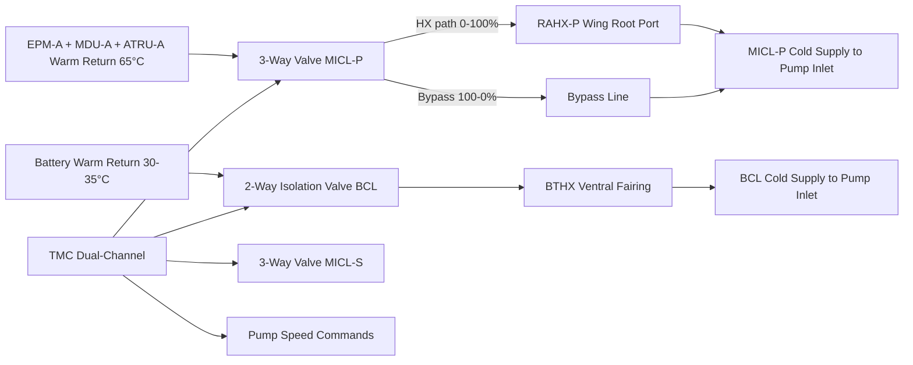
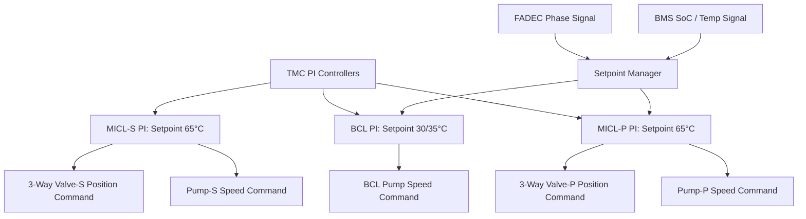

<!-- ──────────────────────────────────────────────────────────────────────────
     QATL-ATLAS-1000-ATLAS-070-079-07-074-050-THERMAL-CONTROL-VALVES-AND-REGULATION
     ATA 74 · Thermal Control Valves and Regulation
     AMPEL360E eWTW — ATLAS Register 1000
────────────────────────────────────────────────────────────────────────────── -->

# Thermal Control Valves and Regulation

---

## §0 Hyperlink Policy

> All hyperlinks in this document are **relative** (five directory levels: `../../../../../`).
> Absolute URLs are forbidden. Every linked document must exist in the Q+ATLANTIDE repository
> before the link is activated. Broken links are treated as open issues and must be resolved
> before the document is promoted from `DRAFT` to `APPROVED`.

---

## §1 Purpose

This document describes the thermal control valves, regulation logic, and closed-loop temperature control algorithms used in the AMPEL360E eWTW ATA 74 Thermal Management System. It covers the three-way mixing valves in the Motor–Inverter Cooling Loops (MICL-P and MICL-S), the two-way isolation valves in the Battery Cooling Loop (BCL), and the Thermal Management Controller (TMC) regulation algorithms that modulate pump speed and valve position to maintain component temperatures within qualified limits across all flight phases.

---

## §2 Applicability

| Parameter | Value |
|---|---|
| Aircraft Program | AMPEL360E eWTW |
| ATA reference | ATA 74-050 — Thermal Control Valves and Regulation |
| Certification basis | EASA CS-25 Amdt 27+ |
| S1000D SNS | 074-050-00 |

---

## §3 Functional Description ![DRAFT]

**Three-Way Mixing Valves (MICL-P and MICL-S):**

Two motorised three-way mixing valves (one per MICL circuit) are installed at the exit of the heat source string (EPM → MDU → ATRU → DC-DC) and before the Ram-Air HX. Each valve operates in "mix" mode: Port-A directs hot coolant through the RAHX for heat rejection; Port-B bypasses the RAHX for recirculation. The TMC continuously modulates the valve between 0 % (full bypass — for cold soak warm-up) and 100 % (full RAHX — for maximum heat rejection). Valve type: motorised ball-in-sleeve; brushless DC actuator; 0–100 % travel in 8 s maximum; position feedback via LVDT sensor. Fail-safe: spring-return to 100 % RAHX open (full heat rejection) on power loss.

**BCL Isolation Valve:**

One two-way motorised ball valve in the BCL return line enables isolation of the battery pack from the BCL for maintenance and for pre-conditioning pump testing. Normally open (N/O) during flight; TMC can command to closed for BCL servicing on ground. Fail-safe: spring-return to open.

**TMC Regulation Algorithms:**

The TMC implements three parallel control loops:

1. **MICL-P Temperature Control Loop:** PI controller with coolant outlet temperature setpoint (MICL-P return to HX) at 65 °C ± 3 °C. Controlled variable: MICL-P pump speed + three-way valve position (combined actuation matrix). Anti-windup and rate limiting applied to prevent valve hunting at low thermal loads.

2. **MICL-S Temperature Control Loop:** Identical PI structure to MICL-P, independent channel.

3. **BCL Temperature Control Loop:** PI controller with BCL supply temperature to battery modules setpoint at 30 °C ± 2 °C. Controlled variable: BCL pump speed only (no mixing valve in BCL). BCL setpoint raised to 35 °C at high altitude (above FL250) to prevent cell condensation risk from overcooling.

**Setpoint Management:**

The TMC dynamically adjusts coolant setpoints based on operational context signals received via AFDX from FADEC (flight phase: ground, T/O, climb, cruise, descent, landing) and BMS (SoC and target charge temperature):

| Flight Phase | MICL Setpoint | BCL Setpoint |
|---|---|---|
| Ground pre-conditioning | 40 °C (warm-up mode) | 25 °C (battery cooling) |
| T/O and initial climb | 65 °C (maximum cooling) | 30 °C |
| Cruise | 60 °C (reduced demand) | 30 °C |
| Cruise above FL250 | 60 °C | 35 °C (anti-condensation) |
| Descent and regeneration | 60 °C | 28 °C (cell cooling for regen heat) |

---

## §4 Functional Breakdown

| ID | Name | Description | Lead Division |
|---|---|---|---|
| F-001 | 3-way mixing valve MICL-P | Motorised ball-in-sleeve; 0–100 % bypass/HX; TMC-commanded; fail-safe open | Q-MECHANICS |
| F-002 | 3-way mixing valve MICL-S | Identical to MICL-P valve; independent stbd circuit | Q-MECHANICS |
| F-003 | BCL isolation valve | 2-way N/O ball valve; BCL return line; maintenance isolation function | Q-MECHANICS |
| F-004 | MICL-P/S temperature regulation | PI control loops; pump + valve combined actuation; coolant setpoint management | Q-HPC |
| F-005 | BCL temperature regulation | PI control loop; pump speed control; setpoint management per flight phase / SoC | Q-HPC |

---

## §5 System Context — Mermaid Diagram

---

## §6 Internal Architecture — Mermaid Diagram

---

## §7 Components and LRUs

| Component | Part Number | Qty | Location | Maintenance Interval | Notes |
|---|---|---|---|---|---|
| 3-Way Mixing Valve — MICL-P | VALVE-3W-P-PN-TBD | 1 | Wing root fairing, port | C-check actuation + LVDT check | Brushless DC actuator; 8 s stroke; LVDT feedback; fail-safe open |
| 3-Way Mixing Valve — MICL-S | VALVE-3W-S-PN-TBD | 1 | Wing root fairing, stbd | C-check actuation + LVDT check | Identical to port unit |
| BCL Isolation Valve | VALVE-2W-BCL-PN-TBD | 1 | Lower fuselage Frame 30 | C-check actuation verify | Motorised ball; N/O; fail-safe open |
| Valve Actuator — 3-Way (×2) | ACTUATOR-3W-PN-TBD | 2 | Wing root (port and stbd) | On condition; C-check BITE | Brushless DC; integral position LVDT; TMC-commanded |
| Valve Actuator — BCL | ACTUATOR-BCL-PN-TBD | 1 | Lower fuselage Frame 30 | On condition | Motorised ball actuator |
| Coolant Temperature Sensor (MICL-P outlet) | TSENS-MICL-P-OUT-TBD | 1 | MICL-P pump inlet return line | C-check calibration | Pt1000; TMC PI loop feedback |
| Coolant Temperature Sensor (MICL-S outlet) | TSENS-MICL-S-OUT-TBD | 1 | MICL-S pump inlet return line | C-check calibration | Identical to MICL-P sensor |
| Coolant Temperature Sensor (BCL supply) | TSENS-BCL-SUPPLY-TBD | 1 | BCL pump outlet supply line | C-check calibration | Pt1000; BCL PI loop feedback |

---

## §8 Interfaces

| Interface Type | Connected System | Protocol / Medium | Data / Function |
|---|---|---|---|
| ATA 74-020 | Liquid cooling loops and pumps | Coolant piping + TMC signals | Pump speed commanded in coordination with valve position |
| ATA 74-030 | Heat exchangers | Coolant piping | 3-way valve upstream of RAHX inlet |
| ATA 74-080 TMC | Thermal Management Controller | LVDT position feedback; actuator command signals | Valve position monitoring and closed-loop control |
| ATA 67 / FADEC | Full Authority Digital Engine Control | AFDX | Flight phase signal for MICL setpoint management |
| ATA 72 BMS | Battery Management System | AFDX | SoC and cell temperature signal for BCL setpoint management |

---

## §9 Operating Modes

| Mode | Trigger | System State | Actions / Consequences |
|---|---|---|---|
| Cold soak warm-up | MICL coolant < 10 °C at start-up | 3-way valve at 0 % HX (full bypass); pump at minimum speed | Coolant warms rapidly via motor and MDU waste heat; RAHX bypassed |
| Normal regulation | MICL temperature approaching setpoint | 3-way valve modulated 0–100 % by TMC PI; pump speed modulated | Stable temperature at setpoint; optimal pump/valve duty |
| Maximum cooling | MICL temperature > setpoint by 5 °C | 3-way valve 100 % open to RAHX; pump at 100 % | Maximum heat rejection; if temperature still rising → Level 1 advisory |
| BCL anti-condensation | Altitude > FL250 | BCL setpoint raised to 35 °C; BCL pump speed reduced | Prevents battery module surface temperature below dew point |
| Valve failed-safe | Actuator power loss (either 3-way valve) | Spring-return to 100 % HX open | Full heat rejection — conservative safe state; overcooling at cruise |
| BCL isolation (maintenance) | Ground; BCL service commanded | BCL isolation valve closed; BCL pressure equalised | BCL circuit isolated; maintenance access to BTHX or manifold |

---

## §10 Performance and Budgets ![DRAFT]

| Parameter | Requirement | Target / Design Value | Status |
|---|---|---|---|
| 3-way valve stroke time (0–100 %) | ≤ 10 s | 8 s | ![TBD] |
| MICL-P/S temperature regulation accuracy | ± 5 °C of setpoint in steady state | ± 3 °C target | ![TBD] |
| BCL temperature regulation accuracy | ± 3 °C of setpoint in steady state | ± 2 °C target | ![TBD] |
| Valve position measurement accuracy (LVDT) | ± 2 % of full scale | ± 1 % target | ![TBD] |
| TMC PI control loop cycle time | ≤ 500 ms | 200 ms target | ![TBD] |
| Valve fail-safe spring-return time | ≤ 3 s | 2 s target | ![TBD] |

---

## §11 Safety, Redundancy and Fault Tolerance

- Both 3-way valves fail to the "full HX open" position (100 % heat rejection) on power loss — conservative fail-safe that ensures cooling even without TMC control authority.
- BCL isolation valve fails open — BCL circuit remains active in all power-loss scenarios, maintaining battery cooling.
- LVDT position feedback on 3-way valves enables TMC to detect valve jam or partial actuation failure and alert the crew via ECAM.
- Valve jam at intermediate position is managed by TMC increasing pump speed to compensate for sub-optimal HX flow split.
- All valve actuators are powered from the HVDC 270 V essential bus (ATA 73) with over-current SSPC protection — valve operation maintained on essential bus even during primary bus fault.

---

## §12 Maintenance and Diagnostics

| Task | Interval | Access | Special Tools |
|---|---|---|---|
| 3-way valve full-stroke actuation test (MICL-P and MICL-S) | C-check | Wing root panel; TMC GSE command | TMC GSE; valve position read-back |
| 3-way valve LVDT calibration check | C-check | TMC GSE channel read | TMC GSE; LVDT calibration reference |
| BCL isolation valve open/close test | C-check | Lower fuselage panel; TMC GSE command | TMC GSE |
| Coolant temperature sensor calibration | C-check | Inline sensor access at pump | Pt1000 calibration bath; reference thermometer |
| Valve actuator BITE download | A-check | TMC GSE / CMS | CMS GSE terminal |
| Valve body and seat leak inspection | C-check | Wing root / lower fuselage panels | Soap solution leak test or pressure decay test |

---

## §13 Footprint

| Footprint Type | Parameter | Value | Notes |
|---|---|---|---|
| Physical | 3-way valve mass (each) | ![TBD] | Pending OEM data |
| Physical | BCL isolation valve mass | ![TBD] | Pending OEM data |
| Power | 3-way valve actuator max power (each) | ![TBD] | Brushless DC; estimated < 200 W |
| Power | BCL valve actuator max power | ![TBD] | Estimated < 100 W |
| Control | TMC PI control loop count | 3 | MICL-P, MICL-S, BCL |
| Data | Valve position LVDT data rate to TMC | 50 ms update | Per TMC sensor scan rate |

---

## §14 Safety and Certification References ![DRAFT]

| Standard / Document | Title | Issuing Body | Applicability |
|---|---|---|---|
| DO-178C | Software Considerations in Airborne Systems | RTCA | TMC PI control algorithm software — DAL B |
| DO-254 | Design Assurance Guidance for Airborne Electronic Hardware | RTCA | TMC control hardware — DAL B |
| EASA CS-25 §25.1091 | Air induction — general | EASA | Valve regulation effects on ram-air inlet |
| SAE ARP4754A | Guidelines for Development of Civil Aircraft | SAE | Fail-safe valve design requirement rationale |
| MIL-HDBK-217F | Reliability Prediction of Electronic Equipment | US DoD | Valve actuator reliability modelling |

---

## §15 V&V Approach ![TBD]

| Phase | Method | Acceptance Criterion | Status |
|---|---|---|---|
| Design | PI controller stability analysis (root locus / frequency domain) | Gain margin ≥ 6 dB; phase margin ≥ 40 ° for MICL and BCL loops | ![TBD] |
| Unit | 3-way valve stroke time and LVDT accuracy bench test | Stroke ≤ 8 s; position accuracy ± 1 % FS | ![TBD] |
| Integration | Ground thermal control test — setpoint step response for MICL and BCL | Stable at setpoint within 2 min; no oscillation | ![TBD] |
| Qualification | Flight test — temperature regulation across full mission profile | MICL ± 3 °C; BCL ± 2 °C at all phases | ![TBD] |

---

## §16 Glossary

| Term | Definition |
|---|---|
| **3-way mixing valve** | Motorised valve with one inlet and two outlets; mixes bypass and HX flow proportions. |
| **PI controller** | Proportional-Integral feedback controller; regulates coolant temperature to setpoint. |
| **LVDT** | Linear Variable Differential Transformer — position sensor for valve actuator feedback. |
| **Fail-safe open** | Valve default position on actuator power loss; spring-returns to 100 % HX path for maximum cooling. |
| **Anti-windup** | PI controller feature preventing integrator saturation during valve saturation. |
| **Setpoint management** | TMC dynamic adjustment of coolant temperature target based on flight phase and battery state. |
| **N/O** | Normally Open — valve position at rest or on power loss. |
| **BCL anti-condensation** | Raising BCL setpoint at altitude to prevent battery cell surface temperature below ambient dew point. |

---

## §17 Open Issues

| ID | Description | Owner | Target |
|---|---|---|---|
| OI-074-050-001 | Select 3-way valve OEM; confirm brushless actuator LVDT specification and DO-160G environmental qualification | Q-MECHANICS | 2026-Q4 |
| OI-074-050-002 | Tune MICL PI controller gains using validated 1D thermal model — confirm anti-windup parameters | Q-HPC | 2027-Q1 |
| OI-074-050-003 | Define BCL anti-condensation altitude threshold (FL250 baseline) with battery OEM dew-point analysis | Q-GREENTECH | 2026-Q4 |

---

## §18 Status Legend

| Badge | Meaning |
|---|---|
| `![DRAFT]` | Section is drafted but not yet reviewed |
| `![TBD]` | Content not yet started — to be defined |
| `![To Be Completed]` | Partially complete — needs additional content |
| `![APPROVED]` | Reviewed and formally approved |

---

## §19 Related Documents (Siblings in this Subsection)

- [074-000](./074-000-Thermal-Management-Hybrid-General.md)
- [074-010](./074-010-Propulsion-Thermal-Architecture.md)
- [074-020](./074-020-Liquid-Cooling-Loops-and-Pumps.md)
- [074-030](./074-030-Heat-Exchangers-Cold-Plates-and-Radiators.md)
- [074-040](./074-040-Motor-Inverter-and-Battery-Cooling-Interfaces.md)
- [074-060](./074-060-Overtemperature-and-Fire-Zone-Thermal-Isolation.md)
- [074-070](./074-070-Thermal-System-Service-and-Maintenance.md)
- [074-080](./074-080-Thermal-Management-Monitoring-Diagnostics-and-Control-Interfaces.md)
- [074-090](./074-090-S1000D-CSDB-Mapping-and-Traceability.md)

---

## §20 Change Log

| Rev | Date | Author | Description |
|---|---|---|---|
| 0.1 | 2026-05-12 | @copilot | Initial DRAFT — thermal control valves, regulation logic, and TMC PI control algorithms for AMPEL360E eWTW ATA 74 |
