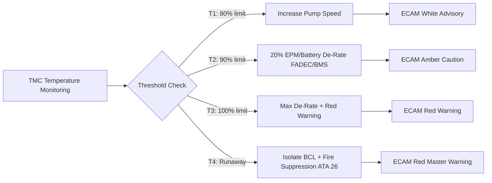
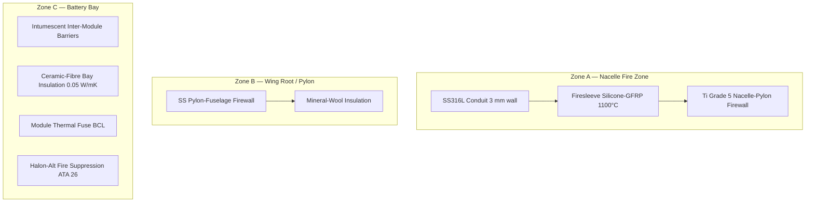

<!-- ──────────────────────────────────────────────────────────────────────────
     QATL-ATLAS-1000-ATLAS-070-079-07-074-060-OVERTEMPERATURE-AND-FIRE-ZONE-THERMAL-ISOLATION
     ATA 74 · Overtemperature and Fire Zone Thermal Isolation
     AMPEL360E eWTW — ATLAS Register 1000
────────────────────────────────────────────────────────────────────────────── -->

# Overtemperature and Fire Zone Thermal Isolation

---

## §0 Hyperlink Policy

> All hyperlinks in this document are **relative** (five directory levels: `../../../../../`).
> Absolute URLs are forbidden. Every linked document must exist in the Q+ATLANTIDE repository
> before the link is activated. Broken links are treated as open issues and must be resolved
> before the document is promoted from `DRAFT` to `APPROVED`.

---

## §1 Purpose

This document describes the overtemperature protection strategy and fire-zone thermal isolation provisions for the AMPEL360E eWTW ATA 74 Thermal Management System. It covers the overtemperature alarm hierarchy, thermal runaway containment for the battery pack, fire-zone pipe and cable protection in the propulsion nacelle and pylon, thermal isolation barriers between propulsion zones, and the crew procedures associated with thermal emergency events.

---

## §2 Applicability

| Parameter | Value |
|---|---|
| Aircraft Program | AMPEL360E eWTW |
| ATA reference | ATA 74-060 — Overtemperature and Fire Zone Thermal Isolation |
| Certification basis | EASA CS-25 Amdt 27+ |
| S1000D SNS | 074-060-00 |

---

## §3 Functional Description ![DRAFT]

**Overtemperature Alarm Hierarchy:**

The TMC implements a four-tier overtemperature alarm hierarchy across all monitored propulsion thermal components:

| Tier | Threshold | System Response | ECAM | Crew Action |
|---|---|---|---|---|
| T1 — Caution | ≥ 80 % of component limit | TMC increases pump speed; MICL/BCL max cooling | White advisory | Monitor |
| T2 — Warning | ≥ 90 % of limit | TMC de-rates EPM/battery by 20 % via FADEC/BMS | Amber caution | Reduce power setting |
| T3 — Emergency | ≥ limit (component limit reached) | TMC de-rates EPM/battery to minimum; ECAM warning | Red warning | Abnormal procedure |
| T4 — Thermal Runaway (battery) | Cell temperature > 65 °C AND internal pressure rise | TMC commands BCL isolation; battery discharge inhibit; crew alert | Red master warning | Emergency descent; land asap |

**Battery Thermal Runaway Containment:**

The battery pack (ATA 72) housing includes integral intumescent fire-blocking material between cell modules and between the battery pack and the airframe structure (Zone C — battery bay). In the event of T4 thermal runaway:
- The BCL isolation valve is commanded closed by the TMC to prevent coolant from acting as a thermal bridge propagating heat to other systems.
- An independent thermal fuse on each module severs the coolant flow path within the module cold plate, preventing coolant from reaching runaway cells.
- The battery bay is classified as a designated fire zone per CS-25 §25.859; active fire suppression (ATA 26) is provided by a halon-alternative agent.
- Structural fire protection: battery bay enclosure is aluminium alloy with ceramic-fibre insulation blankets (λ = 0.05 W/m·K), rated to maintain structural integrity for ≥ 15 min at 1000 °C external fire per CS-25 §25.855.

**Fire Zone Pipe and Cable Protection (Zone A — Nacelle):**

The propulsion nacelle and engine pylon are designated fire zones per CS-25 §25.1183. All MICL coolant lines within the fire zone (from the nacelle bulkhead to the EPM cooling jacket connections) are enclosed in stainless steel 316L conduit (3 mm wall) with firesleeve wrap (silicone-coated fibreglass, rated to 1100 °C for 5 min per CS-25 Appendix F). All conduit connections use fire-resistant couplings with positive retention against vibration per NAS1760.

**Thermal Isolation Barriers:**

The following thermal isolation barriers are installed:

1. **Nacelle-to-pylon firewall:** Titanium alloy (Grade 5) firewall at nacelle–pylon interface, consistent with legacy turbofan nacelle design; coolant lines penetrate through fire-resistant bulkhead fitting with intumescent seal.
2. **Pylon-to-fuselage firewall:** Stainless steel firewall with mineral-wool insulation; MICL lines penetrate via fire-resistant bulkhead unions.
3. **Battery bay structural insulation:** Ceramic-fibre insulation blankets lining the battery bay (Zone C); prevents external fuselage fire from reaching the battery pack for ≥ 15 min.

---

## §4 Functional Breakdown

| ID | Name | Description | Lead Division |
|---|---|---|---|
| F-001 | Four-tier overtemperature alarm hierarchy | T1–T4 thresholds, TMC responses, ECAM messages, FADEC/BMS de-rate commands | Q-HPC |
| F-002 | Battery thermal runaway containment | BCL isolation, module thermal fuse, intumescent barriers, fire suppression (ATA 26) | Q-AIR |
| F-003 | Fire zone pipe protection (Zone A) | SS316L conduit + firesleeve for MICL lines in nacelle and pylon | Q-AIR |
| F-004 | Thermal isolation barriers | Nacelle/pylon firewall; pylon/fuselage firewall; battery bay insulation | Q-MECHANICS |
| F-005 | Overtemperature crew procedures | QRH abnormal procedures for T2, T3, T4 events; coordinated with ATA 26 and ATA 31 | Q-AIR |

---

## §5 System Context — Mermaid Diagram

---

## §6 Internal Architecture — Mermaid Diagram

---

## §7 Components and LRUs

| Component | Part Number | Qty | Location | Maintenance Interval | Notes |
|---|---|---|---|---|---|
| SS316L MICL Conduit — Nacelle (port) | COND-MICL-NAC-P-TBD | 1 set | Nacelle Zone A, port | C-check visual; replace on fire event | 3 mm wall; includes fire-resistant bulkhead fitting |
| SS316L MICL Conduit — Nacelle (stbd) | COND-MICL-NAC-S-TBD | 1 set | Nacelle Zone A, stbd | C-check visual; replace on fire event | Identical to port |
| Firesleeve Assembly — MICL (×2) | FSLEEVE-MICL-PN-TBD | 2 | Nacelle Zone A (port and stbd) | C-check inspect; replace on fire event | Silicone-GFRP; 1100 °C rated; CS-25 App F |
| Ti Firewall Assembly — Nacelle-Pylon | FW-NAC-PYL-PN-TBD | 2 | Nacelle–pylon interface (port and stbd) | 5-year or after fire event | Grade 5 Ti; includes MICL bulkhead fittings |
| SS Firewall Assembly — Pylon-Fuselage | FW-PYL-FUS-PN-TBD | 2 | Pylon–fuselage interface (port and stbd) | 5-year or after fire event | SS with mineral-wool insert; MICL bulkhead fittings |
| Battery Module Thermal Fuse (×24) | THERMAL-FUSE-BAT-TBD | 24 | Battery modules (each module) | Replace on T4 event | One-time trigger at 70 °C module skin temp |
| Battery Bay Ceramic-Fibre Insulation | CERAF-INS-BAT-PN-TBD | 1 set | Battery bay lining (Zone C) | 5-year inspect; replace on degradation | λ = 0.05 W/m·K; 15 min 1000 °C structural protection |

---

## §8 Interfaces

| Interface Type | Connected System | Protocol / Medium | Data / Function |
|---|---|---|---|
| ATA 26 Fire Protection | Aircraft fire suppression | Hardwired command + AFDX | T4 event triggers halon-alt discharge in battery bay |
| ATA 72 BMS | Battery Management System | AFDX | Cell temperature and pressure rise data for T4 detection |
| ATA 67 / FADEC | Full Authority Digital Engine Control | AFDX | EPM de-rate command for T2 and T3 events |
| ATA 31 ECAM | Cockpit electronic centralized display | AFDX | T1–T4 messages on BLEED/COOL 74 and FIRE pages |
| ATA 74-080 TMC | Thermal Management Controller | Internal | TMC hosts overtemperature alarm logic and generates FADEC/BMS/ATA 26 commands |

---

## §9 Operating Modes

| Mode | Trigger | System State | Actions / Consequences |
|---|---|---|---|
| Normal (below T1) | All temperatures < 80 % limit | Standard pump/valve control | No alarms; ECAM normal |
| T1 Caution | Temperature ≥ 80 % of limit | Pumps at 100 %; valves at max HX | ECAM white; crew monitors |
| T2 Warning | Temperature ≥ 90 % of limit | EPM or battery de-rated 20 % | ECAM amber; crew reduces power if able |
| T3 Emergency | Temperature ≥ limit | Maximum de-rate; cooling at max | ECAM red warning; abnormal procedure |
| T4 Thermal Runaway | Cell > 65 °C + pressure rise | BCL isolated; ATA 26 armed; discharge inhibit | ECAM red master warning; emergency descent; land ASAP |
| Post-fire inspection | Post any fire zone event | Aircraft grounded | Full fire zone inspection per AMM before return to service |

---

## §10 Performance and Budgets ![DRAFT]

| Parameter | Requirement | Target / Design Value | Status |
|---|---|---|---|
| Firesleeve fire resistance | ≥ 5 min at 1100 °C (CS-25 App F) | 5 min; OEM qualification test | ![TBD] |
| Battery bay insulation fire resistance | ≥ 15 min at 1000 °C (CS-25 §25.855) | 15 min; ceramic-fibre blanket test | ![TBD] |
| T4 detection latency (TMC) | ≤ 2 s from cell > 65 °C + pressure rise | ≤ 1 s target | ![TBD] |
| BCL isolation valve close time on T4 | ≤ 5 s from T4 command | ≤ 3 s target | ![TBD] |
| Battery thermal fuse trigger temperature | 70 °C module skin (±5 °C) | 70 °C ± 3 °C target | ![TBD] |

---

## §11 Safety, Redundancy and Fault Tolerance

- T4 thermal runaway detection is dual-independent: TMC detects via BMS-reported cell temperature AND independent cell internal pressure rise sensor (directly hardwired to BMS, not via AFDX); either signal alone triggers T4 response.
- ATA 26 fire suppression discharge is hardwired from BMS to fire suppression system — independent of TMC and AFDX for lowest latency response.
- Nacelle firewall (Ti Grade 5) and pylon firewall (SS + mineral wool) comply with CS-25 §25.1182 fire resistance requirements; coolant lines isolated from fire zone ambient temperature up to the firewall design point.
- Thermal fuse on each battery module cold plate provides self-acting protection without relying on TMC or BMS commands — passive thermal isolation of runaway module.
- All fire zone pipe protections (conduit, firesleeve) are designed with positive retention per NAS1760 against vibration-induced connector separation in fire zone.

---

## §12 Maintenance and Diagnostics

| Task | Interval | Access | Special Tools |
|---|---|---|---|
| Firesleeve visual inspection (nacelle Zone A) | C-check | Nacelle access panel | Inspection mirror; borescope |
| Nacelle-to-pylon firewall integrity inspection | 5-year or after fire event | Nacelle removal | Dye penetrant inspection kit; torque wrench |
| Battery bay insulation inspection | 5-year or on condition | Battery bay access panels | Flashlight; thickness gauge |
| Battery thermal fuse continuity check (all 24) | C-check | Battery module terminals; BMS tool | BMS GSE; continuity tester |
| T4 overtemperature simulation test (TMC GSE) | C-check | TMC GSE test mode | TMC GSE; ECAM test harness |
| Post-fire zone inspection (if fire event occurred) | After any fire event | Full nacelle/pylon/battery bay access | AMM full fire zone inspection checklist |

---

## §13 Footprint

| Footprint Type | Parameter | Value | Notes |
|---|---|---|---|
| Physical | Firesleeve mass (per circuit) | ![TBD] | Silicone-GFRP; pending OEM data |
| Physical | Ti nacelle firewall mass (each) | ![TBD] | Grade 5 Ti; pending detail design |
| Physical | Battery bay insulation mass | ![TBD] | Ceramic-fibre; pending detail design |
| Safety | T4 detection latency | ≤ 1 s | From cell over-temp to BCL isolation command |
| Maintenance | Post-fire inspection groundtime | ![TBD] | Per AMM; to be determined |

---

## §14 Safety and Certification References ![DRAFT]

| Standard / Document | Title | Issuing Body | Applicability |
|---|---|---|---|
| EASA CS-25 §25.855 | Thermal and fire protection (cargo) | EASA | Battery bay 15-min structural fire protection |
| EASA CS-25 §25.859 | Combustion heater fire protection | EASA | Battery bay designated fire zone |
| EASA CS-25 §25.1182 | Nacelle zones and areas | EASA | Nacelle fire zone pipe protection |
| EASA CS-25 §25.1183 | Lines, fittings, and components | EASA | Fire-resistant line fittings in fire zone |
| CS-25 Appendix F | Test criteria and procedures | EASA | Firesleeve and conduit fire resistance test |
| SAE ARP4754A | Civil Aircraft Development Guidelines | SAE | T4 detection safety argument (DAL rationale) |
| NAS1760 | Fittings, tube, flared, hydraulic | NAS | Vibration-resistant fitting standard for fire zone |

---

## §15 V&V Approach ![TBD]

| Phase | Method | Acceptance Criterion | Status |
|---|---|---|---|
| Design | FHA / fault tree analysis for T4 thermal runaway chain | Probability of uncontained battery thermal event ≤ 10⁻⁹/FH | ![TBD] |
| Unit | Firesleeve fire test per CS-25 App F | Integrity maintained ≥ 5 min at 1100 °C | ![TBD] |
| Unit | Battery bay insulation fire test | Structural integrity ≥ 15 min at 1000 °C per CS-25 §25.855 | ![TBD] |
| Integration | T4 simulation test (injected fault, ground) | BCL isolation ≤ 3 s; ATA 26 signal correct; ECAM master warning | ![TBD] |
| Certification | EASA CS-25 §25.1183 compliance — fire zone line qualification | All fire zone pipes qualified per CS-25 App F | ![TBD] |

---

## §16 Glossary

| Term | Definition |
|---|---|
| **T1–T4** | Four-tier overtemperature alarm levels defined by ATA 74 TMC for propulsion thermal protection. |
| **Thermal runaway** | Exothermic self-sustaining reaction in battery cell, triggered by cell temperature exceeding safe threshold. |
| **Intumescent barrier** | Passive fire-blocking material that expands on heat exposure, sealing gaps between cell modules. |
| **Firesleeve** | Silicone-coated fibreglass protection sleeve for coolant lines in fire zones; rated to 1100 °C. |
| **Ti Grade 5 (6Al-4V)** | High-strength titanium alloy used for nacelle-to-pylon firewall. |
| **Ceramic-fibre insulation** | High-temperature fibrous insulation (λ = 0.05 W/m·K); used for battery bay thermal and fire protection. |
| **Module thermal fuse** | Passive one-time thermal device that severs coolant path in a runaway battery module at 70 °C. |
| **CS-25 App F** | EASA CS-25 Appendix F — fire test methods for aircraft materials and components. |

---

## §17 Open Issues

| ID | Description | Owner | Target |
|---|---|---|---|
| OI-074-060-001 | Complete FHA for T4 battery thermal runaway; confirm probability of uncontained event meets ≤ 10⁻⁹/FH | Q-AIR / Safety | 2027-Q1 |
| OI-074-060-002 | Qualify ceramic-fibre battery bay insulation per CS-25 §25.855 fire test — initiate test article procurement | Q-AIR | 2027-Q1 |
| OI-074-060-003 | Confirm battery module thermal fuse trigger temperature with battery OEM (70 °C vs. OEM recommended value) | Q-GREENTECH | 2026-Q4 |

---

## §18 Status Legend

| Badge | Meaning |
|---|---|
| `![DRAFT]` | Section is drafted but not yet reviewed |
| `![TBD]` | Content not yet started — to be defined |
| `![To Be Completed]` | Partially complete — needs additional content |
| `![APPROVED]` | Reviewed and formally approved |

---

## §19 Related Documents (Siblings in this Subsection)

- [074-000](./074-000-Thermal-Management-Hybrid-General.md)
- [074-010](./074-010-Propulsion-Thermal-Architecture.md)
- [074-020](./074-020-Liquid-Cooling-Loops-and-Pumps.md)
- [074-030](./074-030-Heat-Exchangers-Cold-Plates-and-Radiators.md)
- [074-040](./074-040-Motor-Inverter-and-Battery-Cooling-Interfaces.md)
- [074-050](./074-050-Thermal-Control-Valves-and-Regulation.md)
- [074-070](./074-070-Thermal-System-Service-and-Maintenance.md)
- [074-080](./074-080-Thermal-Management-Monitoring-Diagnostics-and-Control-Interfaces.md)
- [074-090](./074-090-S1000D-CSDB-Mapping-and-Traceability.md)

---

## §20 Change Log

| Rev | Date | Author | Description |
|---|---|---|---|
| 0.1 | 2026-05-12 | @copilot | Initial DRAFT — overtemperature hierarchy, battery thermal runaway containment, fire-zone pipe protection for AMPEL360E eWTW ATA 74 |
