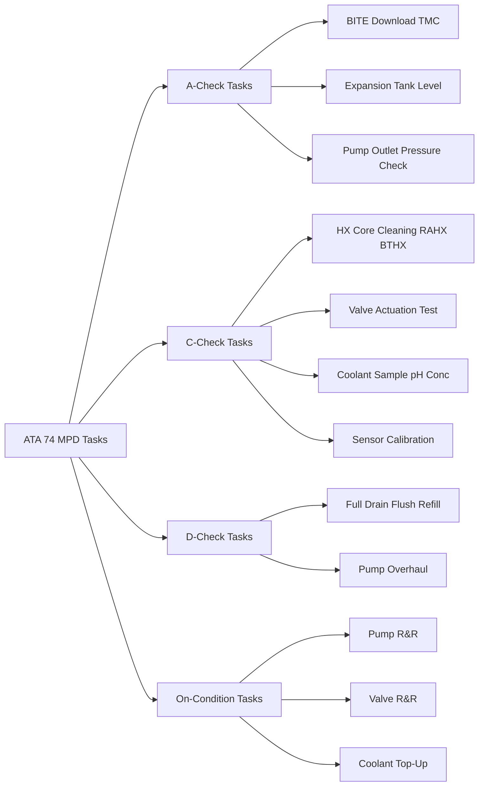
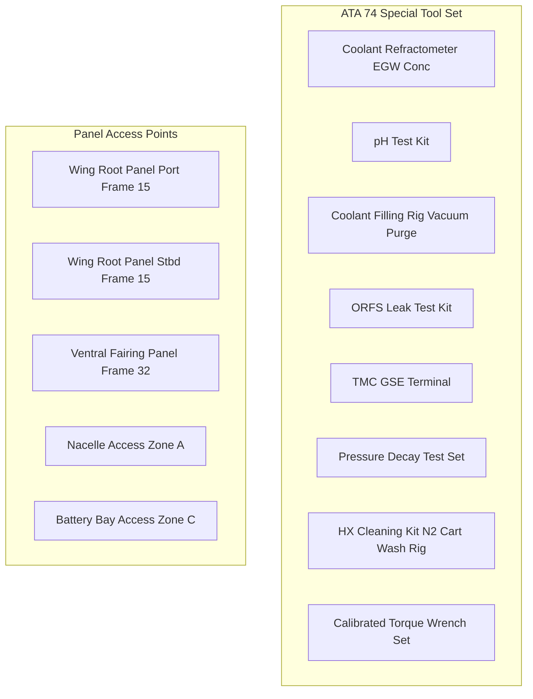

<!-- ──────────────────────────────────────────────────────────────────────────
     QATL-ATLAS-1000-ATLAS-070-079-07-074-070-THERMAL-SYSTEM-SERVICE-AND-MAINTENANCE
     ATA 74 · Thermal System Service and Maintenance
     AMPEL360E eWTW — ATLAS Register 1000
────────────────────────────────────────────────────────────────────────────── -->

# Thermal System Service and Maintenance

---

## §0 Hyperlink Policy

> All hyperlinks in this document are **relative** (five directory levels: `../../../../../`).
> Absolute URLs are forbidden. Every linked document must exist in the Q+ATLANTIDE repository
> before the link is activated. Broken links are treated as open issues and must be resolved
> before the document is promoted from `DRAFT` to `APPROVED`.

---

## §1 Purpose

This document defines the servicing, scheduled maintenance tasks, unscheduled maintenance procedures, special tool requirements, and access provisions for the AMPEL360E eWTW ATA 74 Thermal Management System. It covers all three cooling circuits (MICL-P, MICL-S, and BCL), heat exchangers, pumps, valves, thermal sensors, and fire-zone thermal protection components.

---

## §2 Applicability

| Parameter | Value |
|---|---|
| Aircraft Program | AMPEL360E eWTW |
| ATA reference | ATA 74-070 — Thermal System Service and Maintenance |
| Certification basis | EASA CS-25 Amdt 27+ |
| S1000D SNS | 074-070-00 |

---

## §3 Functional Description ![DRAFT]

**Maintenance Programme Overview:**

The ATA 74 maintenance tasks are allocated to four check levels per the aircraft Maintenance Planning Document (MPD):

| Check Level | Interval | Typical ATA 74 Tasks |
|---|---|---|
| A-check | ~500 FH | BITE download, expansion tank level, pump pressure check |
| C-check | ~7,500 FH | HX core cleaning, valve actuation tests, coolant sample, sensor calibration, leak tests |
| D-check | ~30,000 FH | Full coolant drain/flush/refill, pump overhaul, valve overhaul |
| On-condition | Any time BITE flag | Pump replacement, valve replacement, sensor replacement, coolant top-up |

**Coolant Servicing (Fill, Top-Up, Drain):**

All three loops (MICL-P, MICL-S, BCL) use dedicated service ports located at accessible panel locations:
- **MICL-P fill/drain port:** Wing root fairing panel, port side, Frame 15 area. Quick-connect coupling (to-be-standardised per OI-074-020-003).
- **MICL-S fill/drain port:** Wing root fairing panel, stbd side — identical location.
- **BCL fill/drain port:** Lower fuselage ventral fairing panel, Frame 32 area.

Each loop has a high-point air bleed valve for purging air from the circuit after fill. Procedure: fill from drain port → bleed air from high-point → top-up to sight glass level → close bleed → pressurise to N₂ pre-charge (expansion tank). Coolant specification: ASTM D3306 Type A 50/50 EGW, pre-mixed and pre-inhibited.

**Pump Removal and Replacement (On-Condition):**

MICL pump replacement (port or stbd): Isolate loop with MICL isolation valve → drain local loop section via drain valve at pump inlet → disconnect ORFS coolant fittings → disconnect electrical connector → remove pump mounting bolts (4 × M8, 25 N·m) → replace pump → reverse procedure → pressure test → bleed air → function test via TMC GSE.

BCL pump replacement: Identical procedure using BCL isolation valve.

**Heat Exchanger Removal and Replacement (C-Check and On-Condition):**

RAHX (port or stbd) removal: Isolate MICL circuit → drain → disconnect ORFS coolant fittings → remove ram-air duct exit louver actuator electrical connector → remove HX mounting brackets (8 × M10 bolts) → slide HX out through wing root panel → replace → reverse → pressure test → airflow test.

BTHX removal: Isolate BCL → drain → disconnect ORFS fittings → remove 6 × M10 mounting bolts → replace.

**TMC Software Update:**

TMC software is updateable on-aircraft via the CMS GSE port (ARINC 615A data load). Software updates require FADEC inhibit (engines off, propulsion isolated) before initiating to prevent inadvertent propulsion commands during load. Post-load BITE self-test confirms software integrity. All TMC software updates are controlled per Q-HPC software configuration management procedure GP-SW-001.

---

## §4 Functional Breakdown

| ID | Name | Description | Lead Division |
|---|---|---|---|
| F-001 | Coolant servicing | Fill, drain, top-up, bleed procedures for MICL-P, MICL-S, BCL | Q-MECHANICS |
| F-002 | Pump R&R | MICL-P, MICL-S, and BCL pump removal, replacement, and functional test | Q-MECHANICS |
| F-003 | HX R&R (RAHX and BTHX) | Removal, cleaning, replacement, and airflow test procedures | Q-MECHANICS |
| F-004 | Valve and sensor R&R | 3-way valve, BCL isolation valve, coolant temperature sensors, flow transmitters | Q-MECHANICS |
| F-005 | TMC maintenance | Software updates, BITE log management, channel A/B diagnostics | Q-HPC |

---

## §5 System Context — Mermaid Diagram

---

## §6 Internal Architecture — Mermaid Diagram

---

## §7 Components and LRUs

| Component | Part Number | Qty | Location | Maintenance Interval | Notes |
|---|---|---|---|---|---|
| MICL-P Fill/Drain Service Port | SVC-PORT-MICL-P-TBD | 1 | Wing root panel, port Frame 15 | As required | Quick-connect coupling; per OI-074-020-003 standard |
| MICL-S Fill/Drain Service Port | SVC-PORT-MICL-S-TBD | 1 | Wing root panel, stbd Frame 15 | As required | Identical to port |
| BCL Fill/Drain Service Port | SVC-PORT-BCL-TBD | 1 | Ventral fairing panel, Frame 32 | As required | Quick-connect coupling |
| High-Point Air Bleed Valve — MICL-P | BLEED-MICL-P-TBD | 1 | Highest point MICL-P loop (wing root) | As required | Manual needle valve; cap when not in use |
| High-Point Air Bleed Valve — MICL-S | BLEED-MICL-S-TBD | 1 | Highest point MICL-S loop | As required | Identical |
| High-Point Air Bleed Valve — BCL | BLEED-BCL-TBD | 1 | Highest point BCL loop | As required | Manual needle valve |
| Coolant Filling Rig (GSE) | GSE-FILL-RIG-TBD | 1 | Ground support equipment | Calibrate annually | Vacuum purge capability; flow meter |
| Coolant Refractometer (GSE) | GSE-REFRACT-TBD | 1 | Ground support equipment | Calibrate 12 months | EGW concentration 30–70 %; ± 1 % accuracy |
| TMC GSE Terminal (GSE) | GSE-TMC-TBD | 1 | Ground support equipment | Software update per programme | ARINC 615A compatible; MIL-STD-1553 fallback |
| Pressure Decay Test Set (GSE) | GSE-PRESS-DECAY-TBD | 1 | Ground support equipment | Calibrate 12 months | 0–10 bar; ± 0.1 bar; per MICL and BCL MEOP |

---

## §8 Interfaces

| Interface Type | Connected System | Protocol / Medium | Data / Function |
|---|---|---|---|
| ATA 74-080 TMC | Thermal Management Controller | TMC GSE terminal | BITE log download; pump test commands; valve actuation tests |
| ATA 45 CMS | Central Maintenance System | AFDX / ACARS | Remote BITE download; deferred maintenance tracking |
| ATA 72 Battery / BMS | Battery Management System | BMS GSE terminal | Battery thermal fuse status; module temperature pre-check before coolant fill |
| Ground Support | Coolant filling rig, GCU | Physical connection | Fill, drain, flush, and pre-conditioning operations |

---

## §9 Operating Modes

| Mode | Trigger | System State | Actions / Consequences |
|---|---|---|---|
| Coolant fill | Post-drain or low level | Circuit depressurised; pumps off | Fill from service port; bleed air; pressurise expansion tank |
| Pressure test (post-maintenance) | After any line break or replacement | Circuit filled; all connections closed | Pressure to 1.5 × MEOP; hold 30 min; zero decay required |
| HX cleaning | C-check schedule | MICL/BCL isolated; HX removed | N₂ blow-through; water rinse; dry; reinstall; pressure test |
| Pump functional test | Post-pump replacement | Aircraft on ground; propulsion isolated | TMC GSE commands pump; verify flow rate and outlet pressure |
| TMC software load | Per SB or service instruction | Aircraft on ground; engines off; propulsion isolated | ARINC 615A data load; BITE self-test; function test |

---

## §10 Performance and Budgets ![DRAFT]

| Parameter | Requirement | Target / Design Value | Status |
|---|---|---|---|
| Coolant fill time (per circuit) | ≤ 30 min | 20 min target (vacuum fill) | ![TBD] |
| Pressure test pass criterion | Zero decay at 1.5 × MEOP for 30 min | 0 bar decay | Must pass |
| Pump function test pass criterion | ≥ rated flow at rated ΔP | MICL ≥ 120 L/min at 3.5 bar | Must pass |
| HX C-check cleaning time | ≤ 4 h per HX | 3.5 h RAHX; 3 h BTHX | ![TBD] |
| BITE download time (all channels) | ≤ 5 min | 3 min target | ![TBD] |

---

## §11 Safety, Redundancy and Fault Tolerance

- All coolant fill and drain operations require propulsion isolation (EPMs off; HVDC buses de-energised) per ATA 73 HVDC LOTO procedure — prevents electrical contact with EGW coolant at MDU cold plate connections.
- Pressure test to 1.5 × MEOP is required after every line break — prevents return-to-service with an undetected leak that could cause fire or electrical insulation fault.
- EGW coolant is non-toxic and non-flammable; spilled coolant in an aircraft zone does not create fire risk; however, spill on energised HVDC bus bars constitutes an insulation risk — requires HVDC isolation before any coolant maintenance.
- All coolant maintenance is performed with the aircraft on HVDC LOTO (ATA 73); TMC is in maintenance mode and cannot command propulsion de-rate during coolant servicing.

---

## §12 Maintenance and Diagnostics

| Task | Interval | Access | Special Tools |
|---|---|---|---|
| BITE log download (TMC channels A and B) | A-check | TMC GSE terminal / CMS ACARS | TMC GSE |
| Expansion tank level visual check (×3 loops) | A-check | Wing root and ventral fairing sight glasses | None (visual) |
| Coolant sample — pH and EGW concentration check | 6 months | Service port drain sample | pH kit; refractometer |
| RAHX core cleaning (N₂ + water, both units) | C-check | Wing root NACA duct panels — 4 h per side | N₂ cart; wash rig; HX cleaning kit |
| BTHX core cleaning | C-check | Ventral fairing panel — 3 h | N₂ cart; wash rig |
| Pump functional test (all three pumps) | A-check | TMC GSE pump command | TMC GSE; flow readout |
| 3-way valve full-stroke test (MICL-P and MICL-S) | C-check | Wing root panel; TMC GSE command | TMC GSE; LVDT readout |
| Coolant temperature sensor calibration (all sensors) | C-check | Inline sensor access | Pt1000 calibration bath; reference thermometer |
| Full system pressure test (1.5 × MEOP, 30 min) | After any line break | All panels; circuits isolated | Pressure decay test set |
| Full coolant drain, flush, and refill (all loops) | D-check | All service ports | Coolant filling rig; vacuum purge; N₂ blanket |
| TMC software update | Per SB | Aircraft grounded; engines off; propulsion isolated | TMC GSE / CMS; ARINC 615A data loader |

---

## §13 Footprint

| Footprint Type | Parameter | Value | Notes |
|---|---|---|---|
| Maintenance | A-check ATA 74 man-hours | ~2 h | BITE, level check, pump check |
| Maintenance | C-check ATA 74 man-hours | ~20 h | HX cleaning, valve tests, sensor cal, leak tests |
| Maintenance | D-check ATA 74 man-hours | ~40 h | Full drain, flush, refill, pump and valve overhaul |
| GSE | Number of ATA 74 special tools | 8 | Fill rig, refractometer, pH kit, pressure decay set, TMC GSE, ORFS kit, HX cleaning kit, torque set |
| Physical | Service panel count | 3 | Wing root port, wing root stbd, ventral fairing |

---

## §14 Safety and Certification References ![DRAFT]

| Standard / Document | Title | Issuing Body | Applicability |
|---|---|---|---|
| EASA CS-25 §25.1529 | Instructions for Continued Airworthiness | EASA | ICA requirement; drives ATA 74 AMM content |
| SAE ARP4761 | Safety Assessment Processes | SAE | Maintenance task safety assessment |
| ASTM D3306 | Ethylene Glycol Base Engine Coolant | ASTM | Coolant fill specification |
| SAE J1453 | Fitting, O-Ring Face Seal | SAE | ORFS fitting specification for all service connections |
| OSHA 29 CFR 1910.147 | Control of Hazardous Energy (LOTO) | OSHA | HVDC LOTO requirement before coolant maintenance |

---

## §15 V&V Approach ![TBD]

| Phase | Method | Acceptance Criterion | Status |
|---|---|---|---|
| Design | AMM procedure review by Q-MECHANICS and Q-AIR teams | All tasks per CS-25 §25.1529 ICA requirements | ![TBD] |
| Integration | First article maintenance demonstration (ground) | All tasks completable per AMM time limits with standard GSE | ![TBD] |
| Certification | EASA ICA review and approval | ATA 74 AMM chapter approved for type certificate | ![TBD] |

---

## §16 Glossary

| Term | Definition |
|---|---|
| **MPD** | Maintenance Planning Document — defines scheduled maintenance intervals and tasks for the aircraft. |
| **BITE** | Built-In Test Equipment — onboard self-test; TMC BITE covers pump health, valve position, sensor status. |
| **EGW** | Ethylene Glycol-Water — coolant fluid; ASTM D3306 Type A 50/50 mix. |
| **ORFS** | O-Ring Face Seal — fluid fitting per SAE J1453; used at all serviceable ATA 74 connections. |
| **Pressure decay test** | Pressurisation of coolant circuit to 1.5 × MEOP; zero pressure decay over 30 min confirms no leak. |
| **Vacuum fill** | Filling technique using vacuum pump to evacuate circuit air before introducing coolant; prevents air lock. |
| **N₂ blow-through** | Heat exchanger cleaning technique using nitrogen gas flow to remove debris from HX core passages. |
| **LOTO** | Lockout/Tagout — ATA 73 HVDC energy isolation required before ATA 74 coolant maintenance. |
| **ARINC 615A** | Data loading standard for avionic systems; used for TMC software updates. |

---

## §17 Open Issues

| ID | Description | Owner | Target |
|---|---|---|---|
| OI-074-070-001 | Define coolant service port quick-connect coupling standard (per OI-074-020-003) and specify in AMM | Q-MECHANICS | 2026-Q4 |
| OI-074-070-002 | Determine pump overhaul interval (D-check TBD) with pump OEM MTBR data | Q-MECHANICS | 2027-Q1 |
| OI-074-070-003 | Confirm TMC GSE tool specification and ARINC 615A compatibility with TMC OEM for software update procedure | Q-HPC | 2026-Q4 |

---

## §18 Status Legend

| Badge | Meaning |
|---|---|
| `![DRAFT]` | Section is drafted but not yet reviewed |
| `![TBD]` | Content not yet started — to be defined |
| `![To Be Completed]` | Partially complete — needs additional content |
| `![APPROVED]` | Reviewed and formally approved |

---

## §19 Related Documents (Siblings in this Subsection)

- [074-000](./074-000-Thermal-Management-Hybrid-General.md)
- [074-010](./074-010-Propulsion-Thermal-Architecture.md)
- [074-020](./074-020-Liquid-Cooling-Loops-and-Pumps.md)
- [074-030](./074-030-Heat-Exchangers-Cold-Plates-and-Radiators.md)
- [074-040](./074-040-Motor-Inverter-and-Battery-Cooling-Interfaces.md)
- [074-050](./074-050-Thermal-Control-Valves-and-Regulation.md)
- [074-060](./074-060-Overtemperature-and-Fire-Zone-Thermal-Isolation.md)
- [074-080](./074-080-Thermal-Management-Monitoring-Diagnostics-and-Control-Interfaces.md)
- [074-090](./074-090-S1000D-CSDB-Mapping-and-Traceability.md)

---

## §20 Change Log

| Rev | Date | Author | Description |
|---|---|---|---|
| 0.1 | 2026-05-12 | @copilot | Initial DRAFT — ATA 74 service and maintenance tasks, coolant servicing, pump/HX/valve R&R for AMPEL360E eWTW |
