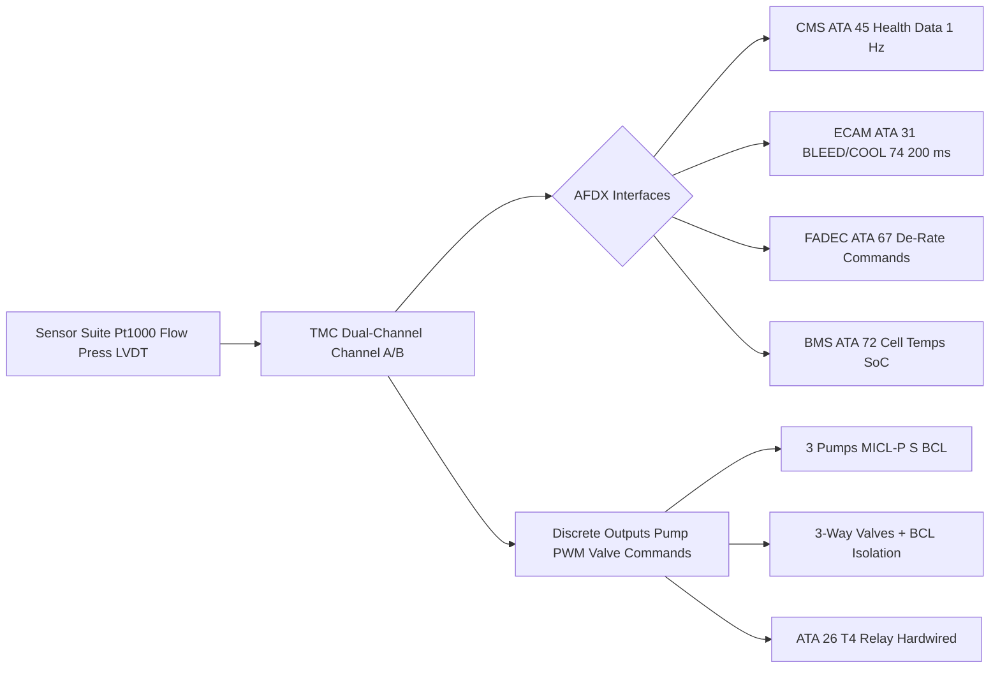
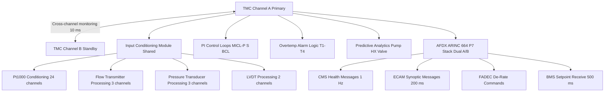

<!-- ──────────────────────────────────────────────────────────────────────────
     QATL-ATLAS-1000-ATLAS-070-079-07-074-080-THERMAL-MANAGEMENT-MONITORING-DIAGNOSTICS-AND-CONTROL-INTERFACES
     ATA 74 · Thermal Management Monitoring Diagnostics and Control Interfaces
     AMPEL360E eWTW — ATLAS Register 1000
────────────────────────────────────────────────────────────────────────────── -->

# Thermal Management Monitoring Diagnostics and Control Interfaces

---

## §0 Hyperlink Policy

> All hyperlinks in this document are **relative** (five directory levels: `../../../../../`).
> Absolute URLs are forbidden. Every linked document must exist in the Q+ATLANTIDE repository
> before the link is activated. Broken links are treated as open issues and must be resolved
> before the document is promoted from `DRAFT` to `APPROVED`.

---

## §1 Purpose

This document describes the Thermal Management Controller (TMC) architecture, its monitoring and diagnostic capabilities, the sensor suite, the AFDX and discrete interface set, the ECAM presentation, and the predictive maintenance data outputs for the AMPEL360E eWTW ATA 74 Thermal Management System.

The TMC is the central control and intelligence node for all ATA 74 functions: it receives sensor inputs from the thermal circuits and propulsion subsystems, executes the PI regulation algorithms, generates propulsion de-rate commands, formats ECAM synoptic data, and provides maintenance diagnostic data to the CMS (ATA 45).

---

## §2 Applicability

| Parameter | Value |
|---|---|
| Aircraft Program | AMPEL360E eWTW |
| ATA reference | ATA 74-080 — Thermal Management Monitoring Diagnostics and Control Interfaces |
| Certification basis | EASA CS-25 Amdt 27+ |
| S1000D SNS | 074-080-00 |

---

## §3 Functional Description ![DRAFT]

**TMC Hardware Architecture:**

The TMC is a dual-channel modular LRU housed in the EE bay rack (2U, standard ARINC 600 form factor). Channel A is the primary computing channel; Channel B is the hot-standby monitoring channel. Both channels share sensor inputs via a dedicated input conditioning module but operate on independent processing boards. Channel B takes over primary control within 100 ms of Channel A fault detection. TMC software qualification: DO-178C DAL B. TMC hardware qualification: DO-254 DAL B. Power supply: dual-feed from HVDC 270 V essential bus (ATA 73) via independent SSPCs.

**Sensor Suite:**

| Sensor Type | Qty | Location | Output | TMC Input |
|---|---|---|---|---|
| Coolant temperature (MICL-P, inlet) | 1 | MICL-P pump inlet | Pt1000 4-wire | TMC analogue |
| Coolant temperature (MICL-P, outlet) | 1 | MICL-P pump outlet | Pt1000 4-wire | TMC analogue |
| Coolant temperature (MICL-S, inlet) | 1 | MICL-S pump inlet | Pt1000 4-wire | TMC analogue |
| Coolant temperature (MICL-S, outlet) | 1 | MICL-S pump outlet | Pt1000 4-wire | TMC analogue |
| Coolant temperature (BCL, supply) | 1 | BCL pump outlet | Pt1000 4-wire | TMC analogue |
| Coolant temperature (BCL, return) | 1 | BCL return to pump | Pt1000 4-wire | TMC analogue |
| Coolant flow (MICL-P) | 1 | MICL-P pump outlet | 4–20 mA turbine | TMC analogue |
| Coolant flow (MICL-S) | 1 | MICL-S pump outlet | 4–20 mA turbine | TMC analogue |
| Coolant flow (BCL) | 1 | BCL pump outlet | 4–20 mA turbine | TMC analogue |
| System pressure (MICL-P) | 1 | MICL-P expansion tank | 4–20 mA | TMC analogue |
| System pressure (MICL-S) | 1 | MICL-S expansion tank | 4–20 mA | TMC analogue |
| System pressure (BCL) | 1 | BCL expansion tank | 4–20 mA | TMC analogue |
| EPM stator RTDs (EPM-A, ×6) | 6 | EPM-A stator end-windings | Pt1000 4-wire | TMC analogue |
| EPM stator RTDs (EPM-B, ×6) | 6 | EPM-B stator end-windings | Pt1000 4-wire | TMC analogue |
| 3-way valve LVDT (MICL-P) | 1 | MICL-P valve actuator | LVDT ±10 V | TMC analogue |
| 3-way valve LVDT (MICL-S) | 1 | MICL-S valve actuator | LVDT ±10 V | TMC analogue |
| Expansion tank level (×3) | 3 | Each expansion tank | Reed switch | TMC discrete |

**AFDX Interface Set:**

The TMC communicates over AFDX ARINC 664 P7 (dual-channel A/B) with:
- **CMS (ATA 45):** Health parameter export (temperatures, flows, pressures, pump BITE, valve position) at 1 Hz; fault messages at event; predictive analytics trending data.
- **ECAM (ATA 31):** BLEED/COOL 74 synoptic page data at 200 ms cycle rate; overtemperature alarm flags.
- **FADEC (ATA 67):** EPM de-rate commands (Level 2 and Level 3 thermal events); flight phase signal reception.
- **BMS (ATA 72):** Cell temperature and SoC data reception at 500 ms; BCL setpoint adjustment.

**Discrete Interface Set:**

- **Outputs:** Pump-P speed command (PWM); Pump-S speed command (PWM); BCL pump speed command (PWM); 3-way valve-P actuator (±10 V); 3-way valve-S actuator (±10 V); BCL isolation valve command (28 V DC); ATA 26 T4 trigger (hardwired relay, 28 V).
- **Inputs:** Pump-P health status (digital); Pump-S health status (digital); BCL pump health status (digital); ATA 26 fire suppression armed status (discrete); External power mode (28 V discrete from ATA 24).

**ECAM BLEED/COOL 74 Synoptic:**

The ECAM synoptic page "BLEED/COOL 74" displays (in real-time):
- MICL-P and MICL-S loop schematic with colour-coded temperature values (green/amber/red) at pump, EPM, MDU, and HX.
- BCL loop schematic with battery module temperature bar and BCL pump/BTHX status.
- Pump health indicators (running/stopped/failed).
- Valve positions (% open, animated).
- Overtemperature alarm tier (T1–T4) colour coded.

**Predictive Maintenance Analytics:**

The TMC computes the following predictive metrics exported to CMS:
- **Pump health index:** Motor current trend over 500-hour rolling window; current increase indicates bearing wear — alerts at +15 % above baseline.
- **HX fouling index:** MICL outlet temperature at constant pump speed vs. ambient — increasing delta indicates HX core fouling; alert when fouling equivalent to 10 % capacity reduction.
- **Coolant degradation index:** Not computed in-flight; flag set when coolant sample interval exceeds 180 days without sample confirmation.
- **Valve wear index:** LVDT position vs. command tracking error trend; increasing lag indicates actuator wear.

---

## §4 Functional Breakdown

| ID | Name | Description | Lead Division |
|---|---|---|---|
| F-001 | TMC dual-channel architecture | Channel A/B hot standby; DO-178C DAL B software; DO-254 DAL B hardware | Q-HPC |
| F-002 | Sensor suite | Pt1000 RTDs, flow transmitters, pressure transducers, LVDTs, reed switches | Q-HPC |
| F-003 | AFDX interface set | CMS, ECAM, FADEC, BMS interfaces at defined cycle rates and formats | Q-HPC |
| F-004 | ECAM BLEED/COOL 74 synoptic | Real-time loop schematics; temperature and alarm colour coding | Q-HPC |
| F-005 | Predictive maintenance analytics | Pump health, HX fouling, valve wear indices exported to CMS | Q-HPC |

---

## §5 System Context — Mermaid Diagram

---

## §6 Internal Architecture — Mermaid Diagram

---

## §7 Components and LRUs

| Component | Part Number | Qty | Location | Maintenance Interval | Notes |
|---|---|---|---|---|---|
| TMC LRU (Thermal Management Controller) | TMC-PN-TBD | 1 | EE bay rack, 2U ARINC 600 | Software update per SB; C-check BITE | Dual-channel; DO-178C DAL B; DO-254 DAL B |
| Coolant Temperature Sensor (×8 loop sensors) | TSENS-PT1000-TBD | 8 | MICL-P, MICL-S, BCL pump inlet/outlet | C-check calibration | Pt1000 Class A; 4-wire; shielded cable |
| Flow Transmitter (×3) | FT-TURB-TBD | 3 | MICL-P, MICL-S, BCL pump outlets | C-check calibration | Turbine; 4–20 mA; ±1 % FS |
| System Pressure Transducer (×3) | PRESS-TRX-TBD | 3 | Expansion tanks (MICL-P, MICL-S, BCL) | C-check calibration | 4–20 mA; 0–10 bar; ±0.5 % FS |
| Expansion Tank Level Reed Switch (×3) | REED-LEVEL-TBD | 3 | Each expansion tank | C-check functional check | Normally open; float-actuated |
| LVDT Valve Position Sensor (×2) | LVDT-VALVE-TBD | 2 | 3-way valve actuators (MICL-P and MICL-S) | C-check calibration | ±10 V; ±1 % FS accuracy |

---

## §8 Interfaces

| Interface Type | Connected System | Protocol / Medium | Data / Function |
|---|---|---|---|
| ATA 45 CMS | Central Maintenance System | AFDX ARINC 664 P7 | Fault codes, health parameters, predictive metrics — 1 Hz |
| ATA 31 ECAM | Cockpit electronic centralized display | AFDX | BLEED/COOL 74 synoptic — 200 ms cycle |
| ATA 67 / FADEC | Full Authority Digital Engine Control | AFDX | EPM de-rate commands; flight phase reception |
| ATA 72 BMS | Battery Management System | AFDX | Cell temperatures; SoC; T4 trigger co-signal |
| ATA 26 Fire Protection | Halon-alt fire suppression | Hardwired relay (28 V DC) | T4 thermal runaway trigger — independent of AFDX |
| ATA 73 PDCU | Power Distribution Control Unit | AFDX | HVDC bus health status; load management coordination |

---

## §9 Operating Modes

| Mode | Trigger | System State | Actions / Consequences |
|---|---|---|---|
| Channel A primary (normal) | Both channels healthy | Channel A controls; Channel B monitors | Full TMC control authority; ECAM normal |
| Channel B takeover | Channel A fault detected | Channel B assumes primary; ECAM advisory | Degraded monitoring capability (some predictive analytics suspended) |
| BITE self-test | TMC power-on or GSE command | All sensors scanned; actuators exercised | BITE pass → normal operation; BITE fail → ECAM fault |
| Maintenance mode | TMC GSE connected; ground only | BITE inhibited; manual pump and valve commands enabled | Maintenance tasks per ATA 74-070 |
| AFDX link failed | AFDX A and B both lost | TMC operates on last-known-good parameters; discrete fallback | Pump speeds and valve positions frozen; ECAM advisory via ATA 31 discrete backup |

---

## §10 Performance and Budgets ![DRAFT]

| Parameter | Requirement | Target / Design Value | Status |
|---|---|---|---|
| TMC channel A→B switchover time | ≤ 200 ms | 100 ms target | ![TBD] |
| Pt1000 temperature measurement accuracy | ± 2 °C (system) | ± 1 °C target (Pt1000 Class A + conditioning) | ![TBD] |
| Flow transmitter accuracy | ± 2 % FS | ± 1 % FS target | ![TBD] |
| ECAM synoptic update rate | ≤ 500 ms | 200 ms | Confirmed by AFDX message schedule |
| PI control loop cycle time | ≤ 500 ms | 200 ms | ![TBD] |
| BITE self-test completion time | ≤ 3 min | 2 min target | ![TBD] |
| Predictive analytics export to CMS | 1 Hz | 1 Hz | ![TBD] |

---

## §11 Safety, Redundancy and Fault Tolerance

- TMC dual-channel hot standby provides ≥ 99.99 % availability; loss of both channels is a catastrophic hazard addressed by DAL B software/hardware and demonstrated Extremely Improbable by FHA.
- All 24 Pt1000 sensor inputs are individually conditioned and validated; a failed sensor is flagged in BITE and excluded from the PI control loop without causing control degradation (redundant sensors per thermal zone).
- AFDX dual A/B paths provide redundant communication; TMC holds last-known-good values on AFDX path loss and continues control.
- T4 thermal runaway trigger to ATA 26 is hardwired (28 V relay, not AFDX) to ensure fire suppression response is independent of TMC AFDX communication state.
- TMC power supply from dual SSPCs on HVDC 270 V essential bus; loss of one SSPC does not interrupt TMC power.

---

## §12 Maintenance and Diagnostics

| Task | Interval | Access | Special Tools |
|---|---|---|---|
| TMC BITE self-test (power-on) | Each power-on | Automatic | None |
| TMC BITE log download (channels A and B) | A-check | TMC GSE / CMS ACARS | TMC GSE |
| Sensor calibration — Pt1000 temperature sensors | C-check | Inline sensor access | Calibration bath; reference Pt1000 |
| Flow transmitter calibration | C-check | Pump outlet access | Portable reference flow meter |
| LVDT valve sensor calibration | C-check | Valve actuator access | LVDT reference signal; TMC GSE |
| Predictive analytics baseline reset (post-major maintenance) | After pump/HX replacement | TMC GSE | TMC GSE |
| TMC LRU replacement (on condition) | On BITE fault | EE bay rack | ARINC 600 rack tools; AFDX re-configuration |

---

## §13 Footprint

| Footprint Type | Parameter | Value | Notes |
|---|---|---|---|
| Physical | TMC LRU envelope | 2U ARINC 600 | EE bay rack |
| Physical | TMC mass | ![TBD] | Pending OEM design data |
| Power | TMC power consumption (dual-channel) | ![TBD] | Estimated < 200 W; pending OEM data |
| Data | AFDX messages per second (TMC total) | ![TBD] | Per AFDX bus load analysis |
| Data | Total monitored parameters | 34 | Per sensor suite table (§3) |

---

## §14 Safety and Certification References ![DRAFT]

| Standard / Document | Title | Issuing Body | Applicability |
|---|---|---|---|
| DO-178C | Software Considerations in Airborne Systems | RTCA | TMC software DAL B |
| DO-254 | Design Assurance Guidance for Airborne Electronic Hardware | RTCA | TMC hardware DAL B |
| ARINC 664 P7 | Aircraft Data Network — AFDX | ARINC | AFDX interface standard for TMC |
| ARINC 600 | Air Transport Avionics Equipment Interfaces | ARINC | TMC LRU mechanical form factor |
| IEC 60751 | Industrial platinum resistance thermometers | IEC | Pt1000 Class A sensor accuracy |
| DO-160G | Environmental Conditions and Test Procedures | RTCA | TMC and sensor environmental qualification |

---

## §15 V&V Approach ![TBD]

| Phase | Method | Acceptance Criterion | Status |
|---|---|---|---|
| Design | Software V&V plan per DO-178C DAL B | All code paths verified; MC/DC coverage 100 % | ![TBD] |
| Unit | TMC hardware bench test — channel A/B switchover | Switchover ≤ 100 ms; no control output glitch | ![TBD] |
| Integration | Ground integration test — full sensor suite and AFDX interface | All 34 sensors read correctly; AFDX messages at correct rates | ![TBD] |
| Integration | ECAM BLEED/COOL 74 page display test | All parameters displayed correctly at 200 ms update rate | ![TBD] |
| Qualification | DO-160G environmental qualification for TMC LRU | All categories pass | ![TBD] |
| Certification | EASA SW/HW approval per DO-178C/DO-254 DAL B | TMC software and hardware approved by EASA DAN | ![TBD] |

---

## §16 Glossary

| Term | Definition |
|---|---|
| **TMC** | Thermal Management Controller — dual-channel DAL B LRU managing all ATA 74 functions. |
| **Hot standby** | Channel B mirrors Channel A processing and takes over within 100 ms on Channel A fault. |
| **Pt1000** | Platinum RTD; 1000 Ω at 0 °C; Class A accuracy ± 0.4 °C (IEC 60751). |
| **LVDT** | Linear Variable Differential Transformer — valve position sensor. |
| **Predictive analytics** | TMC algorithms trending sensor data to predict maintenance actions before component failure. |
| **ECAM** | Electronic Centralized Aircraft Monitor — cockpit system displaying ATA 74 BLEED/COOL 74 synoptic. |
| **AFDX** | Avionics Full DupleX Ethernet — ARINC 664 P7 data network for TMC interfaces. |
| **MC/DC** | Modified Condition/Decision Coverage — DO-178C DAL B software test coverage criterion. |

---

## §17 Open Issues

| ID | Description | Owner | Target |
|---|---|---|---|
| OI-074-080-001 | Select TMC LRU OEM; confirm DO-178C DAL B development environment and ARINC 664 P7 AFDX stack | Q-HPC | 2026-Q4 |
| OI-074-080-002 | Define AFDX message catalogue for all TMC interfaces (CMS, ECAM, FADEC, BMS) — allocate virtual links and bandwidths | Q-HPC | 2027-Q1 |
| OI-074-080-003 | Define ECAM BLEED/COOL 74 synoptic page layout and colour logic with ATA 31 ECAM team | Q-HPC / Q-AIR | 2027-Q1 |

---

## §18 Status Legend

| Badge | Meaning |
|---|---|
| `![DRAFT]` | Section is drafted but not yet reviewed |
| `![TBD]` | Content not yet started — to be defined |
| `![To Be Completed]` | Partially complete — needs additional content |
| `![APPROVED]` | Reviewed and formally approved |

---

## §19 Related Documents (Siblings in this Subsection)

- [074-000](./074-000-Thermal-Management-Hybrid-General.md)
- [074-010](./074-010-Propulsion-Thermal-Architecture.md)
- [074-020](./074-020-Liquid-Cooling-Loops-and-Pumps.md)
- [074-030](./074-030-Heat-Exchangers-Cold-Plates-and-Radiators.md)
- [074-040](./074-040-Motor-Inverter-and-Battery-Cooling-Interfaces.md)
- [074-050](./074-050-Thermal-Control-Valves-and-Regulation.md)
- [074-060](./074-060-Overtemperature-and-Fire-Zone-Thermal-Isolation.md)
- [074-070](./074-070-Thermal-System-Service-and-Maintenance.md)
- [074-090](./074-090-S1000D-CSDB-Mapping-and-Traceability.md)

---

## §20 Change Log

| Rev | Date | Author | Description |
|---|---|---|---|
| 0.1 | 2026-05-12 | @copilot | Initial DRAFT — TMC architecture, sensor suite, AFDX interfaces, ECAM synoptic, predictive analytics for AMPEL360E eWTW ATA 74 |
