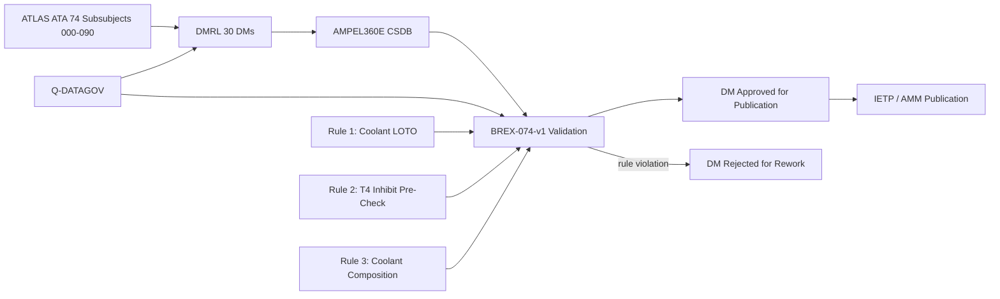
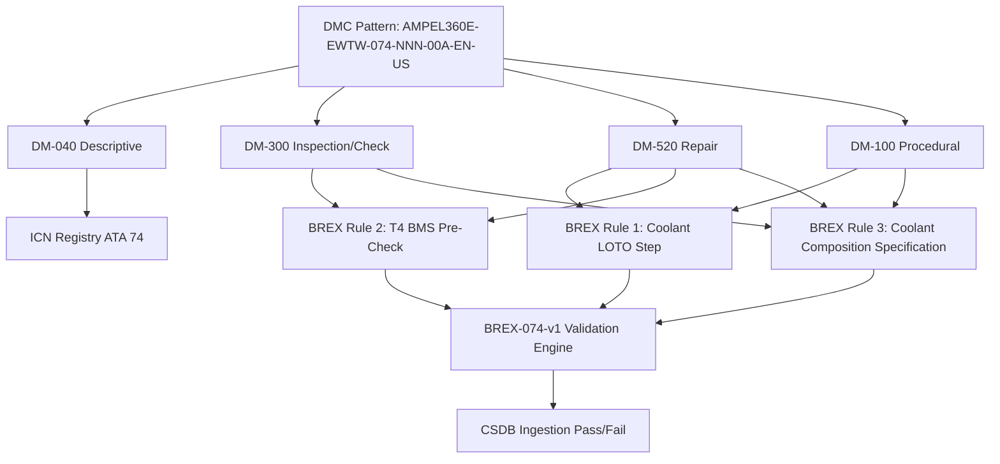

<!-- ──────────────────────────────────────────────────────────────────────────
     QATL-ATLAS-1000-ATLAS-070-079-07-074-090-S1000D-CSDB-MAPPING-AND-TRACEABILITY
     ATA 74 · S1000D / CSDB Mapping and Traceability
     AMPEL360E eWTW — ATLAS Register 1000
────────────────────────────────────────────────────────────────────────────── -->

# S1000D / CSDB Mapping and Traceability

---

## §0 Hyperlink Policy

> All hyperlinks in this document are **relative** (five directory levels: `../../../../../`).
> Absolute URLs are forbidden. Every linked document must exist in the Q+ATLANTIDE repository
> before the link is activated. Broken links are treated as open issues and must be resolved
> before the document is promoted from `DRAFT` to `APPROVED`.

---

## §1 Purpose

This document maps the ATLAS ATA 74 subsubject structure to S1000D Data Module Codes (DMCs) and defines the Data Module Requirement List (DMRL) and Business Rules eXchange (BREX) constraints for the AMPEL360E eWTW Thermal Management System Common Source DataBase (CSDB).

ATA 74 DMRL for AMPEL360E eWTW: **30 data modules**. DMC pattern: `AMPEL360E-EWTW-074-{NNN}-00A-EN-US`. BREX document: `AMPEL360E-BREX-074-v1`, enforcing three domain-specific constraints specific to the hybrid-electric propulsion thermal management system, as described in §3.

This document is owned by Q-DATAGOV and reviewed at each CSDB milestone (DMRL baseline, DMRL first issue, DMRL final). It is the authoritative traceability record linking ATLAS ATA 74 ATLAS documents to the S1000D technical publication set.

---

## §2 Applicability

| Parameter | Value |
|---|---|
| Aircraft Program | AMPEL360E eWTW |
| ATA reference | ATA 74-090 — S1000D / CSDB Mapping and Traceability |
| Certification basis | S1000D Issue 5.0 |
| S1000D SNS | 074-090-00 |

---

## §3 Functional Description ![DRAFT]

**BREX AMPEL360E-BREX-074-v1 enforces three domain-specific constraints:**

1. **Coolant LOTO rule:** All maintenance Data Modules (DM type 300, 520, or 100) that require opening any MICL or BCL coolant connection (line break, pump removal, HX removal, valve replacement) must include the HVDC LOTO procedure step (per ATA 73 AMM) before the coolant servicing step begins. This prevents maintenance personnel from breaking coolant lines on a live HVDC system, which would expose the EGW coolant to the MDU cold plate at HVDC 270 V potential — creating an electrocution hazard.

2. **Thermal runaway T4 inhibit rule:** All DMs for battery module cold plate or BCL manifold maintenance (DM type 300 or 520) must include a Battery Management System pre-check step confirming all cell temperatures are below 35 °C and no T4 alarm is active before any battery cooling system work begins. This prevents maintenance from proceeding on a battery pack that may be in a latent thermal condition, which could escalate to thermal runaway when coolant isolation is applied.

3. **Coolant composition rule:** All DMs for coolant fill, top-up, or change (DM type 100 or 300) must specify the coolant as ASTM D3306 Type A 50/50 EGW pre-mix, and must prohibit substitution with water-only or alternative coolants. This prevents coolant specification error that could result in freeze-up at altitude (compromising cooling function) or corrosion of aluminium HX cores and MDU cold plates.

---

## §4 Functional Breakdown

| ID | Name | Description | Lead Division |
|---|---|---|---|
| F-001 | DMRL — 30 DMs | Full DMRL for ATA 74: all 30 DM codes tracked; status managed by Q-DATAGOV | Q-DATAGOV |
| F-002 | BREX-074-v1 — 3 rules | Coolant LOTO rule, T4 inhibit rule, coolant composition rule; checked at CSDB ingestion | Q-DATAGOV |
| F-003 | ICN registry ATA 74 | Illustration Control Numbers for TMS schematics, loop diagrams, ECAM synoptic screenshots, cold plate drawings | Q-DATAGOV |
| F-004 | DM-040 descriptive modules | System description DMs for TMC, MICL, BCL, RAHX, BTHX, pumps, valves | Q-MECHANICS |
| F-005 | DM-300 inspection / check modules | Scheduled maintenance task DMs for A-check and C-check per MPD | Q-AIR |

---

## §5 System Context — Mermaid Diagram

---

## §6 Internal Architecture — Mermaid Diagram

---

## §7 Components and LRUs

| Component | Part Number | Qty | Location | Maintenance Interval | Notes |
|---|---|---|---|---|---|
| S1000D Issue 5.0 | S1000D.org | CSDB | IT infrastructure | Per S1000D issue update | XML authoring standard for all 30 DMs |
| BREX-074-v1 | Programme document | CSDB validator | IT | Per programme revision | Three TMS domain rules enforced |
| DMRL — 30 DMs | Q-DATAGOV tracker | PMO | PMO tool | Monthly review | All 30 DMs tracked for status |
| ICN registry ATA 74 | Q-DATAGOV database | CSDB | IT | Continuous | All TMS schematics and diagrams traced |
| Coolant composition specification reference | ASTM D3306 Type A + DM-100 template | Q-DATAGOV + CAMO | IT | Per coolant SB update | Links BREX Rule 3 to coolant fill DM templates |

---

## §8 Interfaces

| Interface Type | Connected System | Protocol / Medium | Data / Function |
|---|---|---|---|
| ATA 45 CMS | Central Maintenance System | AFDX | BITE fault codes cross-referenced to DM-300 task codes |
| S1000D CSDB | Common Source DataBase | XML / HTTP | DM storage, BREX validation, publication |
| ATA 73 AMM (HVDC LOTO) | HVDC LOTO procedure | Document reference | BREX Rule 1 references ATA 73 LOTO DM step |
| ATA 72 BMS (T4 pre-check) | Battery Management System | GSE interface | BREX Rule 2 T4 pre-check step references BMS cell temperature display |
| IETP Publication | Interactive Electronic Technical Publication | HTML5 / XML | Technician access to approved DMs |
| Q-DATAGOV DMRL Tracker | PMO tool | Web-based | 30 DM status tracking |

---

## §9 DMRL — ATA 74 Data Module Summary

| DM Code | Title | DM Type | BREX Rules | Status |
|---|---|---|---|---|
| 074-000-00A | Thermal Management Hybrid — System Description | DM-040 | — | ![TBD] |
| 074-010-00A | Propulsion Thermal Architecture — System Description | DM-040 | — | ![TBD] |
| 074-020-00A | Liquid Cooling Loops — System Description | DM-040 | — | ![TBD] |
| 074-020-10A | MICL Pump — Removal and Installation | DM-520 | Rule 1 | ![TBD] |
| 074-020-20A | BCL Pump — Removal and Installation | DM-520 | Rule 1 | ![TBD] |
| 074-020-30A | Coolant Fill and Bleed — Procedural | DM-100 | Rule 1, Rule 3 | ![TBD] |
| 074-020-40A | Coolant Drain — Procedural | DM-100 | Rule 1, Rule 3 | ![TBD] |
| 074-030-00A | Heat Exchangers — System Description | DM-040 | — | ![TBD] |
| 074-030-10A | RAHX-P Removal and Installation | DM-520 | Rule 1 | ![TBD] |
| 074-030-20A | RAHX-S Removal and Installation | DM-520 | Rule 1 | ![TBD] |
| 074-030-30A | BTHX Removal and Installation | DM-520 | Rule 1, Rule 2 | ![TBD] |
| 074-030-40A | HX Core Cleaning (RAHX) — Procedural | DM-300 | Rule 1 | ![TBD] |
| 074-030-50A | HX Core Cleaning (BTHX) — Procedural | DM-300 | Rule 1, Rule 2 | ![TBD] |
| 074-040-00A | Motor-Inverter-Battery Cooling Interfaces — System Description | DM-040 | — | ![TBD] |
| 074-040-10A | EPM Cooling Jacket ORFS Inspection | DM-300 | Rule 1 | ![TBD] |
| 074-040-20A | MDU Cold Plate Removal and Installation | DM-520 | Rule 1 | ![TBD] |
| 074-040-30A | Battery BCL Manifold Leak Check | DM-300 | Rule 1, Rule 2 | ![TBD] |
| 074-050-00A | Thermal Control Valves — System Description | DM-040 | — | ![TBD] |
| 074-050-10A | 3-Way Valve (MICL-P) Removal and Installation | DM-520 | Rule 1 | ![TBD] |
| 074-050-20A | 3-Way Valve (MICL-S) Removal and Installation | DM-520 | Rule 1 | ![TBD] |
| 074-050-30A | 3-Way Valve Full-Stroke Test | DM-300 | Rule 1 | ![TBD] |
| 074-060-00A | Overtemperature and Fire Zone Isolation — System Description | DM-040 | — | ![TBD] |
| 074-060-10A | Battery Thermal Fuse Continuity Check | DM-300 | Rule 2 | ![TBD] |
| 074-060-20A | Fire Zone Conduit and Firesleeve Inspection | DM-300 | — | ![TBD] |
| 074-070-00A | Thermal System Maintenance General | DM-040 | — | ![TBD] |
| 074-070-10A | Coolant Sample — pH and Concentration Check | DM-300 | Rule 3 | ![TBD] |
| 074-070-20A | Full Coolant Drain, Flush, and Refill | DM-100 | Rule 1, Rule 3 | ![TBD] |
| 074-080-00A | TMC — System Description | DM-040 | — | ![TBD] |
| 074-080-10A | TMC Software Update — Procedural | DM-100 | Rule 1 | ![TBD] |
| 074-080-20A | Coolant Temperature Sensor Calibration | DM-300 | Rule 1 | ![TBD] |

---

## §10 Performance and Budgets ![DRAFT]

| Parameter | Requirement | Target / Design Value | Status |
|---|---|---|---|
| DMRL completeness at CDR | ≥ 80 % DMs in DRAFT | 90 % target | ![TBD] |
| BREX validation pass rate | 100 % at final milestone | 100 % | ![TBD] |
| ICN traceability coverage | 100 % of figures in DMs | 100 % | ![TBD] |
| DM review cycle time | ≤ 10 working days per DM | 7 days target | ![TBD] |
| IETP publication lead time | ≤ 3 months pre-EIS | On schedule | ![TBD] |

---

## §11 Safety, Redundancy and Fault Tolerance

- BREX Rule 1 (Coolant LOTO) is a safety-critical rule: absence of the mandatory HVDC LOTO step in a coolant maintenance DM could expose maintenance personnel to lethal HVDC 270 V on MDU cold plates. The BREX engine rejects any coolant-line-break DM without the LOTO step.
- BREX Rule 2 (T4 inhibit pre-check) is a safety-relevant rule: proceeding with battery cooling maintenance during a latent thermal condition could trigger thermal runaway when coolant is isolated, leading to uncontained battery fire.
- BREX Rule 3 (Coolant composition) is a safety and operational quality rule: wrong coolant type could cause freeze-up (loss of cooling at altitude) or corrosion (progressive HX and cold plate degradation).
- CSDB version control ensures only approved DMs are published; superseded DMs are archived with obsolescence date.
- BREX rules are programme-configuration-controlled; any rule change requires Q-DATAGOV change authority approval.

---

## §12 Maintenance and Diagnostics

| Task | Interval | Access | Special Tools |
|---|---|---|---|
| DMRL status review | Monthly | Q-DATAGOV PMO tool | PMO tracker |
| BREX validation run on all 30 DMs | At each CSDB milestone | CSDB BREX engine | CSDB tool |
| Battery T4 pre-check procedure verify (per battery system change) | On battery system change | BMS GSE | BMS GSE terminal |
| Coolant specification reference update (if coolant SB issued) | On coolant SB | Q-DATAGOV document control | BREX rule update tool |
| ICN registry audit | Annually | Q-DATAGOV database | ICN tool |

---

## §13 Footprint

| Footprint Type | Parameter | Value | Notes |
|---|---|---|---|
| Data | Total DMs ATA 74 | 30 DMs | Per DMRL-074 |
| Data | DM types | 040/100/300/520 | Descriptive/Procedural/Inspection/Repair |
| Data | CSDB storage estimate | ![TBD] | Per DM average size × 30 |
| Maintenance | DMRL review man-hours | ~2 h/month | Q-DATAGOV |
| Data | BREX rules count | 3 rules | BREX-074-v1 |

---

## §14 Safety and Certification References ![DRAFT]

| Standard / Document | Title | Issuing Body | Applicability |
|---|---|---|---|
| S1000D Issue 5.0 | Technical Publications Standard | S1000D.org | DM authoring standard for all 30 DMs |
| ATA iSpec 2200 | Chapter 74 | ATA | ATA SNS reference for DM coding |
| EASA CS-25 §25.1529 | Instructions for Continued Airworthiness | EASA | ICA requirement driving DM content |
| AMPEL360E GP-CSDB-001 | CSDB Governance Procedure | Q-DATAGOV | CSDB workflow and DMRL management |
| OSHA 29 CFR 1910.147 | Control of Hazardous Energy (LOTO) | OSHA | Regulatory basis for BREX Rule 1 Coolant LOTO |
| ASTM D3306 | Ethylene Glycol Base Engine Coolant | ASTM | Regulatory basis for BREX Rule 3 coolant specification |

---

## §15 V&V Approach ![TBD]

| Phase | Method | Acceptance Criterion | Status |
|---|---|---|---|
| Design | DMRL review at PDR | All 30 DM codes allocated and scoped | ![TBD] |
| Integration | BREX validation run at CDR | Zero BREX violations in submitted DMs | ![TBD] |
| Qualification | Full CSDB review at SOW milestone | All 30 DMs in REVIEW or APPROVED status | ![TBD] |
| Certification | EASA ICA review — CS-25 §25.1529 | AMM/CMM approved; IETP published | ![TBD] |

---

## §16 Glossary

| Term | Definition |
|---|---|
| **DMC** | Data Module Code — unique S1000D identifier for each DM. |
| **DMRL** | Data Module Requirement List — list of all required DMs for a publication. |
| **BREX** | Business Rules eXchange — enforced at CSDB ingestion to apply programme-specific rules. |
| **ICN** | Illustration Control Number — unique identifier for each graphic in a DM. |
| **CSDB** | Common Source DataBase — authoritative storage for S1000D DMs. |
| **IETP** | Interactive Electronic Technical Publication — electronic format for technician use. |
| **DM-040** | S1000D descriptive data module type (system description). |
| **DM-100** | S1000D procedural data module type (operational procedures). |
| **DM-300** | S1000D inspection/check data module type (scheduled maintenance tasks). |
| **DM-520** | S1000D repair data module type (unscheduled maintenance, LRU replacement). |
| **Coolant LOTO rule** | BREX Rule 1: all coolant line-break DMs must include ATA 73 HVDC LOTO step before coolant work. |
| **T4 inhibit rule** | BREX Rule 2: all battery cooling DMs must confirm no T4 alarm and cell temp < 35 °C before work. |
| **Coolant composition rule** | BREX Rule 3: all coolant fill DMs must specify ASTM D3306 Type A 50/50 EGW; no substitution. |

---

## §17 Open Issues

| ID | Description | Owner | Target |
|---|---|---|---|
| OI-074-090-001 | Confirm CSDB BREX engine capability to validate HVDC LOTO step cross-reference from ATA 73 into ATA 74 DMs (Rule 1) | Q-DATAGOV / IT | 2026-Q4 |
| OI-074-090-002 | Define BMS cell temperature display procedure in T4 pre-check DM template (BREX Rule 2) — obtain BMS GSE screen format from OEM | Q-DATAGOV / Q-GREENTECH | 2026-Q4 |
| OI-074-090-003 | Define ICN numbering scheme for TMS loop schematics, ECAM BLEED/COOL 74 screenshot, and cold plate assembly drawings | Q-DATAGOV | 2027-Q1 |

---

## §18 Status Legend

| Badge | Meaning |
|---|---|
| `![DRAFT]` | Section is drafted but not yet reviewed |
| `![TBD]` | Content not yet started — to be defined |
| `![To Be Completed]` | Partially complete — needs additional content |
| `![APPROVED]` | Reviewed and formally approved |

---

## §19 Related Documents (Siblings in this Subsection)

- [074-000](./074-000-Thermal-Management-Hybrid-General.md)
- [074-010](./074-010-Propulsion-Thermal-Architecture.md)
- [074-020](./074-020-Liquid-Cooling-Loops-and-Pumps.md)
- [074-030](./074-030-Heat-Exchangers-Cold-Plates-and-Radiators.md)
- [074-040](./074-040-Motor-Inverter-and-Battery-Cooling-Interfaces.md)
- [074-050](./074-050-Thermal-Control-Valves-and-Regulation.md)
- [074-060](./074-060-Overtemperature-and-Fire-Zone-Thermal-Isolation.md)
- [074-070](./074-070-Thermal-System-Service-and-Maintenance.md)
- [074-080](./074-080-Thermal-Management-Monitoring-Diagnostics-and-Control-Interfaces.md)

---

## §20 Change Log

| Rev | Date | Author | Description |
|---|---|---|---|
| 0.1 | 2026-05-12 | @copilot | Initial DRAFT — S1000D CSDB mapping, DMRL 30 DMs, BREX-074-v1 for AMPEL360E eWTW ATA 74 thermal management |
