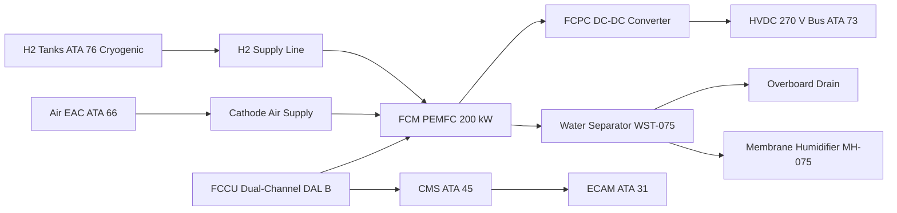
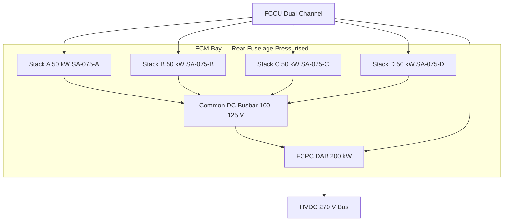

<!-- ──────────────────────────────────────────────────────────────────────────
     QATL-ATLAS-1000-ATLAS-070-079-07-075-000-FUEL-CELL-INTEGRATION-GENERAL
     ATA 75 · Fuel Cell Integration General
     AMPEL360E eWTW — ATLAS Register 1000
────────────────────────────────────────────────────────────────────────────── -->

# Fuel Cell Integration General

---

## §0 Hyperlink Policy

> All hyperlinks in this document are **relative** (five directory levels: `../../../../../`).
> Absolute URLs are forbidden. Every linked document must exist in the Q+ATLANTIDE repository
> before the link is activated. Broken links are treated as open issues and must be resolved
> before the document is promoted from `DRAFT` to `APPROVED`.

---

## §1 Purpose

The AMPEL360E eWTW integrates a 200 kW Proton Exchange Membrane Fuel Cell (PEMFC) system as an auxiliary power source providing supplemental electrical power and ground/emergency power. The Fuel Cell Module (FCM) comprises a cluster of four 50 kW PEMFC stacks managed by a dual-channel Fuel Cell Control Unit (FCCU) certified to DO-178C DAL B and DO-254 DAL B.

The FCM delivers power to the HVDC 270 V primary bus (ATA 73) via the Fuel Cell Power Converter (FCPC). Cryogenic hydrogen stored in ATA 76 tanks serves as the fuel, while ambient air supplied by the Environmental Air Compressor (EAC, ATA 66) acts as the oxidant. By-product water from the cathode reaction is managed by the ATA 75 water management subsystem. The FCM is physically located in the rear fuselage pressurised bay.

This document (075-000) establishes the general scope, top-level architecture, and cross-references for the entire ATA 75 Fuel Cell Integration subsection of the AMPEL360E eWTW ATLAS baseline. It is the parent reference for all subsubjects 075-010 through 075-090.

---

## §2 Applicability

| Parameter | Value |
|---|---|
| Aircraft Program | AMPEL360E eWTW |
| ATA reference | ATA 75-000 — Fuel Cell Integration General |
| Certification basis | EASA CS-25 Amdt 27+ |
| S1000D SNS | 075-000-00 |

---

## §3 Functional Description ![DRAFT]

The PEMFC stack cluster generates electrical power through electrochemical oxidation of hydrogen at the anode and reduction of oxygen at the cathode, producing water as the only by-product. Four 50 kW stacks are operated in parallel on a common DC busbar (100–125 V), which feeds the FCPC for voltage conversion to 270 V HVDC. The FCCU governs stoichiometry, thermal management, cell voltage monitoring, fault detection, and reporting.

The Balance of Plant (BoP) provides all ancillary support to maintain optimal stack operating conditions: an electric air compressor delivers humidified cathode air, pressure regulators supply H2 from cryogenic tanks, and a dual deionised water cooling loop rejects up to 60 kW to a ventral fuselage heat exchanger. A membrane humidifier recovers cathode exhaust moisture to maintain membrane hydration between 70–90 % RH.

Safety systems include four H2 concentration detectors (HDS-075), dual fail-safe solenoid isolation valves (SIV-075-A/B), a manual isolation valve (MIV-075), a pressure relief valve (PRV-075) venting to the upper aft fuselage mast, and FCCU-initiated emergency shutdown sequences. The FCM bay is continuously ventilated at ≥6 air changes per hour (ACH) whenever the aircraft is electrically powered.

---

## §4 Functional Breakdown

| ID | Name | Description | Lead Division |
|---|---|---|---|
| F-001 | Stack power generation | 4 × 50 kW PEMFC stacks in parallel cluster producing 200 kW DC | Q-GREENTECH |
| F-002 | Balance of Plant (BoP) | Air compressor, H2 pressure regulation, DI water cooling loop, membrane humidifier | Q-MECHANICS |
| F-003 | Power conditioning (FCPC) | DAB DC-DC converter 100–125 V to 270 V HVDC, 200 kW rated, galvanic isolation ≥10 MΩ | Q-GREENTECH |
| F-004 | Water management | Cathode product water separator, accumulator, humidifier reuse loop, overboard drain | Q-MECHANICS |
| F-005 | Safety and isolation | H2 detectors × 4, dual solenoid isolation valves, manual isolation valve, PRV, bay ventilation | Q-AIR |
| F-006 | FCCU control | Dual-channel controller DO-178C DAL B; stoichiometry, thermal and CVM control; FDI; AFDX reporting | Q-HPC |

---

## §5 System Context — Mermaid Diagram

---

## §6 Internal Architecture — Mermaid Diagram

---

## §7 Components and LRUs

| Component | Part Number | Qty | Location | Maintenance Interval | Notes |
|---|---|---|---|---|---|
| Stack Assembly SA-075-A | SA-075-A | 1 | Rear fuselage FCM bay | D-check / 20,000 FH MEA replacement | 50 kW PEMFC stack, 400 cells |
| Stack Assembly SA-075-B | SA-075-B | 1 | Rear fuselage FCM bay | D-check / 20,000 FH MEA replacement | Identical to SA-075-A |
| Stack Assembly SA-075-C | SA-075-C | 1 | Rear fuselage FCM bay | D-check / 20,000 FH MEA replacement | Identical to SA-075-A |
| Stack Assembly SA-075-D | SA-075-D | 1 | Rear fuselage FCM bay | D-check / 20,000 FH MEA replacement | Identical to SA-075-A |
| FCCU Fuel Cell Control Unit | FCCU-075 | 1 | EE bay adjacent to FCM | SW update per SB | DO-178C DAL B / DO-254 DAL B, dual-channel |
| FCPC Fuel Cell Power Converter | FCPC-075 | 1 | FCM bay | C-check efficiency test | DAB topology 200 kW, SiC MOSFET |

---

## §8 Interfaces

| Interface Type | Connected System | Protocol / Medium | Data / Function |
|---|---|---|---|
| Power output | ATA 73 HVDC 270 V bus | HVDC cable + SSPC-FC-01 | FCPC output 200 kW to primary bus |
| Fuel supply | ATA 76 H2 cryogenic tanks | SS316L H2 piping + SIV + PR | H2 fuel supply at 2.0–2.5 bar |
| Oxidant supply | ATA 66 EAC air supply | Ducting + flow control valve | Cathode oxidant air |
| Health monitoring | ATA 45 CMS | AFDX ARINC 664 P7 | BITE faults and health data at 100 ms |
| Crew indication | ATA 31 ECAM | AFDX | FC synoptic page power/status |
| Water management | ATA 75 water subsystem | SS316L piping + drain valve | Product water routing to drain or humidifier |

---

## §9 Operating Modes

| Mode | Trigger | System State | Actions / Consequences |
|---|---|---|---|
| Standby | Aircraft powered, no power request | SIV closed, FCPC offline, DWP-A low speed, VF-075 on | FCM ready; minimal power draw; ECAM normal |
| Start-up | Power request from EMS | SIV-A/B open, ABoP-C spin-up, stack warming | Stack temp rises to 60 °C; ≤5 min to 50% power; FCPC connects when cluster >100 V |
| Normal power | FCCU active stoichiometry control | 200 kW regulated, all 4 stacks, λH2=1.3, λair=2.0 | Full power delivered to HVDC 270 V bus; ECAM normal |
| Degraded | One or more stacks isolated by FCCU | Reduced power ceiling (150/100/50 kW) | ECAM amber advisory; power reduction notified to EMS |
| Shutdown | Power release or emergency | N2 purge sequence, SIV close, FCPC disconnect | DWP runs post-shutdown until stack <40 °C; ECAM normal |

---

## §10 Performance and Budgets ![DRAFT]

| Parameter | Requirement | Target / Design Value | Status |
|---|---|---|---|
| Peak power output | ≥200 kW at rated H2 pressure and temperature | 200 kW | ![TBD] |
| Stack efficiency | ≥55 % net LHV at 50 % load | 58 % | ![TBD] |
| Cold start time | ≤5 min from −20 °C ambient to 50 % power | 5 min | ![TBD] |
| FCCU availability | ≥99.9 % dispatch, dual-channel | 99.99 % | ![TBD] |
| H2 consumption at rated power | ≤1.2 g/s LHV-based | 1.1 g/s | ![TBD] |
| FCPC efficiency | ≥97 % at 50 % load | 97.5 % | ![TBD] |

---

## §11 Safety, Redundancy and Fault Tolerance

- **H2 safety**: Dual series SIV-075-A/B fail-safe normally-closed solenoid valves plus manual MIV-075 ensure positive H2 isolation; FCCU auto-closes SIV on HDS ≥25 % LEL detection.
- **Redundant isolation**: FCCU-commanded emergency shutdown at 25 % LEL H2 is well below the 4 % v/v H2 Lower Flammable Limit, providing substantial safety margin.
- **H2 detection**: Four electrochemical HDS-075 sensors in FCM bay corners; calibrated ≤12 months per IEC 60079-29-1; dual-alarm architecture (1 % LEL caution, 25 % LEL emergency).
- **Bay ventilation**: VF-075 fan at ≥6 ACH continuously while aircraft is powered prevents H2 accumulation; double-walled H2 supply lines vent leaks directly to upper aft fuselage vent mast.
- **FCCU dual-channel**: DO-178C DAL B dual-channel controller with cross-channel comparison at 10 ms prevents single-channel fault causing false shutdown or fail-to-unsafe.
- **Galvanic isolation**: FCPC provides ≥10 MΩ galvanic isolation between PEMFC stack (~125 V DC) and HVDC 270 V bus, preventing ground fault propagation.

---

## §12 Maintenance and Diagnostics

| Task | Interval | Access | Special Tools |
|---|---|---|---|
| FCCU BITE log download | A-check | FCCU ARINC 429 GSE port or CMS terminal | CMS GSE Terminal PN CMS-GSE-TRM |
| Coolant pH and conductivity sample | A-check | FCM bay coolant drain port | DI Conductivity Meter PN DICM-GSE-075 |
| Stack CVM cell voltage balance check | C-check | FCCU GSE port, FCM bay | CVM Interface Unit PN CVMIU-GSE-075 |
| H2 supply line N2 pressure decay test | C-check | FCM bay (H2 LOTO required) | N2 Purge Cart PN N2PC-GSE-075 |
| FCPC efficiency test | C-check | FCM bay + calibrated load | FCPC Power Analyser PN PAR-GSE-075 |
| MEA replacement all 4 stacks | D-check / 20,000 FH | FCM bay (H2 LOTO required) | Stack Torque Wrench Set PN TWS-ST-075 |

---

## §13 Footprint

| Footprint Type | Parameter | Value | Notes |
|---|---|---|---|
| Physical location | FCM bay | Rear fuselage pressurised bay | Adjacent to EE bay |
| Mass estimate | FCM total mass | TBD | Stacks + BoP + FCPC + FCCU |
| Volume | FCM bay volume | TBD | To be confirmed with structures |
| Electrical connection | HVDC 270 V | Bus port SSPC-FC-01 | Port and starboard supply considered |
| Fuel interface | H2 supply line size | TBD | SS316L double-wall |
| Thermal | Cooling loop capacity | ~60 kW rejection | Via HEX-075 ventral fuselage |

---

## §14 Safety and Certification References ![DRAFT]

| Standard / Document | Title | Issuing Body | Applicability |
|---|---|---|---|
| EASA CS-25 §25.1353 | Storage battery installation and electrical equipment | EASA | Electrical system safety |
| SAE AS6858 | Airworthiness Guidelines for PEMFC Systems | SAE International | PEMFC airworthiness |
| DO-178C | Software Considerations in Airborne Systems | RTCA | FCCU software DAL B |
| DO-254 | Design Assurance Guidance for Airborne Electronic Hardware | RTCA | FCCU hardware DAL B |
| DO-160G | Environmental Conditions and Test Procedures for Airborne Equipment | RTCA | All FCM LRUs |
| IEC 62282-2 | Fuel Cell Technologies — Fuel Cell Modules — Performance | IEC | PEMFC performance standard |
| SAE ARP4754A | Guidelines for Development of Civil Aircraft and Systems | SAE International | System development assurance |

---

## §15 V&V Approach ![TBD]

| Phase | Method | Acceptance Criterion | Status |
|---|---|---|---|
| Design analysis | System-level model and FMEA | All single-point failures identified; FHA complete | ![TBD] |
| Stack bench test | 200 kW power and LHV efficiency measurement | ≥200 kW, ≥55 % net LHV efficiency | ![TBD] |
| Integration ground test | Full FCM functional test on ground with H2 | All modes demonstrated; ECAM correct | ![TBD] |
| Qualification | DO-160G environmental testing of all LRUs | All LRUs pass temperature, vibration, humidity | ![TBD] |
| Certification flight test | CS-25 flight test with FCM in normal and degraded modes | CS-25 compliance demonstrated | ![TBD] |

---

## §16 Glossary

| Term | Definition |
|---|---|
| PEMFC | Proton Exchange Membrane Fuel Cell — electrochemical energy converter using a solid polymer electrolyte membrane |
| FCM | Fuel Cell Module — the complete PEMFC system including stacks, BoP, FCPC, and FCCU |
| FCCU | Fuel Cell Control Unit — dual-channel DO-178C DAL B digital controller for the FCM |
| FCPC | Fuel Cell Power Converter — DAB DC-DC converter from stack voltage to HVDC 270 V |
| BoP | Balance of Plant — all ancillary systems supporting PEMFC stack operation |
| MEA | Membrane Electrode Assembly — the core electrochemical component of each cell (anode GDL + catalyst + Nafion + catalyst + cathode GDL) |
| CVM | Cell Voltage Monitor — per-cell voltage measurement unit (400 channels per stack) |
| HVDC | High-Voltage Direct Current — 270 V DC power bus standard on AMPEL360E eWTW |
| DAL | Design Assurance Level — per DO-178C/DO-254; DAL B = ≤10⁻⁷/h failure probability |
| LOTO | Lockout/Tagout — safety isolation procedure mandatory before FCM bay access |
| H2 LEL | Hydrogen Lower Explosive Limit — 4 % v/v in air (alarm thresholds: 1 % and 25 % of LEL) |
| SNS | Standard Numbering System — S1000D data module numbering scheme |

---

## §17 Open Issues

| ID | Description | Owner | Target |
|---|---|---|---|
| OI-075-000-001 | Finalise H2 supply interface with ATA 76 (pressure, flow rate, connector spec) | Q-GREENTECH | 2026-Q4 |
| OI-075-000-002 | Complete Functional Hazard Assessment (FHA) for FCM dual-stack failure scenario | Q-AIR / Safety | 2027-Q1 |
| OI-075-000-003 | Confirm PEMFC OEM selection and performance validation plan | Q-MECHANICS | 2026-Q4 |

---

## §18 Status Legend

| Badge | Meaning |
|---|---|
| `![DRAFT]` | Section is drafted but not yet reviewed |
| `![TBD]` | Content not yet started — to be defined |
| `![To Be Completed]` | Partially complete — needs additional content |
| `![APPROVED]` | Reviewed and formally approved |

---

## §19 Related Documents (Siblings in this Subsection)

- [075-010](./075-010-Fuel-Cell-Stack-Architecture.md)
- [075-020](./075-020-Balance-of-Plant-Air-Hydrogen-and-Cooling.md)
- [075-030](./075-030-Fuel-Cell-Power-Conditioning.md)
- [075-040](./075-040-Water-Management-and-Purge-Interfaces.md)
- [075-050](./075-050-Fuel-Cell-Safety-Isolation-and-Venting.md)
- [075-060](./075-060-Fuel-Cell-Control-and-Operating-Modes.md)
- [075-070](./075-070-Fuel-Cell-Service-Test-and-Maintenance.md)
- [075-080](./075-080-Fuel-Cell-Monitoring-Diagnostics-and-Control-Interfaces.md)
- [075-090](./075-090-S1000D-CSDB-Mapping-and-Traceability.md)

---

## §20 Change Log

| Rev | Date | Author | Description |
|---|---|---|---|
| 0.1 | 2026-05-12 | @copilot | Initial DRAFT — general scope and architecture for ATA 75 Fuel Cell Integration |
