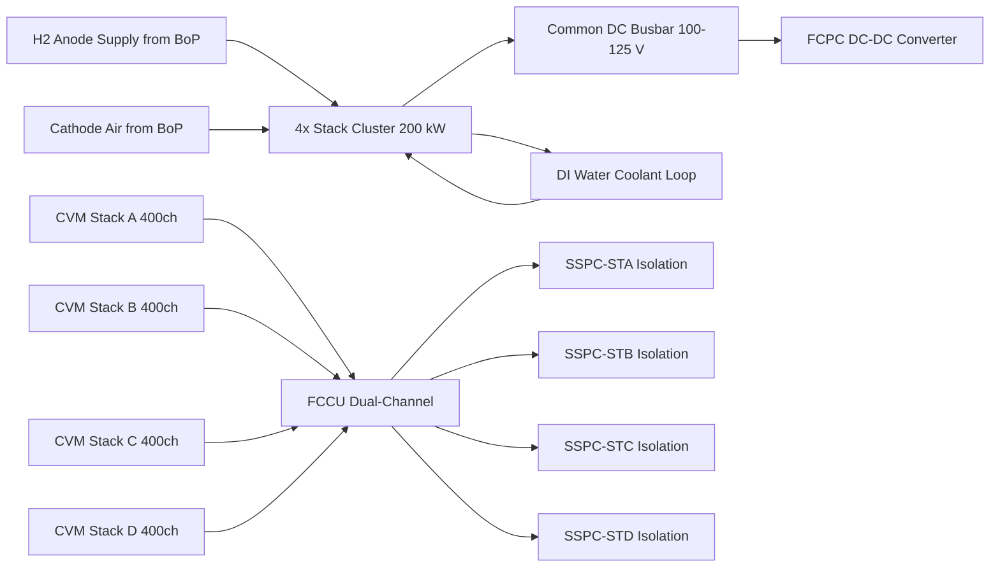
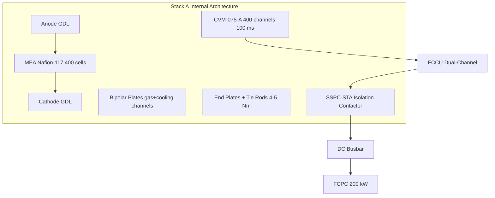

<!-- ──────────────────────────────────────────────────────────────────────────
     QATL-ATLAS-1000-ATLAS-070-079-07-075-010-FUEL-CELL-STACK-ARCHITECTURE
     ATA 75 · Fuel Cell Stack Architecture
     AMPEL360E eWTW — ATLAS Register 1000
────────────────────────────────────────────────────────────────────────────── -->

# Fuel Cell Stack Architecture

---

## §0 Hyperlink Policy

> All hyperlinks in this document are **relative** (five directory levels: `../../../../../`).
> Absolute URLs are forbidden. Every linked document must exist in the Q+ATLANTIDE repository
> before the link is activated. Broken links are treated as open issues and must be resolved
> before the document is promoted from `DRAFT` to `APPROVED`.

---

## §1 Purpose

This document describes the internal architecture of the four PEMFC stack assemblies that compose the FCM cluster on the AMPEL360E eWTW. Each stack consists of 400 individual fuel cells arranged in series, each cell operating at a rated voltage of 0.7 V and drawing a rated current that yields 50 kW per stack. The active electrode area is 400 cm², with a Nafion-117 proton exchange membrane electrolyte and graphite-composite bipolar plates featuring integrated gas distribution and cooling channels.

The four stacks (SA-075-A through SA-075-D) are connected in parallel via a common copper DC busbar producing 100–125 V at the cluster output. Each stack operates within a temperature band of 60–80 °C and a pressure range of 1.5–2.5 bar. A Cell Voltage Monitor (CVM) samples all 400 cell voltages at 100 ms intervals per stack, providing real-time per-cell health data to the FCCU.

Individual stack isolation is provided by dedicated SSPC contactors (SSPC-STA through SSPC-STD) commanded by the FCCU. This architecture allows the FCM to continue operating in a degraded mode if any single stack must be isolated due to cell under-voltage, over-temperature, or other fault conditions, limiting output to 150 kW (3 stacks), 100 kW (2 stacks), or 50 kW (1 stack).

---

## §2 Applicability

| Parameter | Value |
|---|---|
| Aircraft Program | AMPEL360E eWTW |
| ATA reference | ATA 75-010 — Fuel Cell Stack Architecture |
| Certification basis | EASA CS-25 Amdt 27+ |
| S1000D SNS | 075-010-00 |

---

## §3 Functional Description ![DRAFT]

Each PEMFC stack cell consists of an anode Gas Diffusion Layer (GDL), anode catalyst layer, Nafion-117 membrane, cathode catalyst layer, and cathode GDL — collectively the Membrane Electrode Assembly (MEA). H2 is oxidised at the anode (2H₂ → 4H⁺ + 4e⁻), protons migrate through the membrane, and O2 is reduced at the cathode (O2 + 4H⁺ + 4e⁻ → 2H₂O). Graphite-composite bipolar plates provide gas flow channels, electrical conduction between cells, and cooling channel passages for deionised water coolant flow. Stack assemblies are held in compression by tie rods and end plates at a calibrated torque of 4–5 Nm per bolt to maintain MEA contact pressure.

The Cell Voltage Monitor (CVM) unit mounted on each stack measures all 400 cell voltages at 100 ms intervals and transmits data to the FCCU via a dedicated shielded 400-channel data harness. The FCCU software continuously monitors cell voltage distribution; a cell voltage below 0.5 V at 50 % rated load triggers a stack isolation command to the corresponding SSPC contactor. The four CVMs (CVM-075-A through CVM-075-D) each manage 400 channels, providing 1,600 individual cell voltage readings per 100 ms scan cycle.

Stack thermal management is achieved through cooling channels machined into the bipolar plates, through which the DI water coolant flows at approximately 15 L/min per stack at rated power. Inlet and outlet coolant temperature is measured by Pt100 RTD sensors for each stack. The FCCU uses these readings in a model-predictive thermal control algorithm to maintain stack temperatures at 70 °C ±5 °C setpoint by varying BoP cooling pump speed and FCPC power setpoint.

---

## §4 Functional Breakdown

| ID | Name | Description | Lead Division |
|---|---|---|---|
| F-001 | Electrochemical reaction | H2 oxidation at anode, O2 reduction at cathode, generating DC electrical power and product water | Q-GREENTECH |
| F-002 | MEA membrane | Nafion-117 solid polymer electrolyte providing proton conduction and gas separation between anode and cathode | Q-MECHANICS |
| F-003 | Bipolar plate | Gas channel distribution, electrical conduction between cells, and integrated cooling channel passages | Q-MECHANICS |
| F-004 | Cell voltage monitoring (CVM) | Per-cell voltage measurement at 100 ms; 400 channels per stack; fault detection on cell <0.5 V at 50% load | Q-HPC |
| F-005 | Stack isolation contactor | SSPC-STA/B/C/D — galvanic isolation of each stack on FCCU command; prevents cascading failure | Q-GREENTECH |
| F-006 | Stack thermal control | DI water cooling channel flow per stack; inlet/outlet RTD measurement; FCCU MPC control to 70 °C ±5 °C | Q-MECHANICS |

---

## §5 System Context — Mermaid Diagram

---

## §6 Internal Architecture — Mermaid Diagram

---

## §7 Components and LRUs

| Component | Part Number | Qty | Location | Maintenance Interval | Notes |
|---|---|---|---|---|---|
| Stack Assembly SA-075-A | SA-075-A | 1 | FCM bay | D-check / 20,000 FH MEA replacement | 50 kW, 400 cells, 125 V rated |
| Stack Assembly SA-075-B | SA-075-B | 1 | FCM bay | D-check / 20,000 FH MEA replacement | Identical to SA-075-A |
| Stack Assembly SA-075-C | SA-075-C | 1 | FCM bay | D-check / 20,000 FH MEA replacement | Identical to SA-075-A |
| Stack Assembly SA-075-D | SA-075-D | 1 | FCM bay | D-check / 20,000 FH MEA replacement | Identical to SA-075-A |
| CVM Cell Voltage Monitor A/B/C/D | CVM-075-A/B/C/D | 4 | Mounted on each stack | C-check calibration | 100 ms sampling / 400 channels per unit |
| Stack Isolation Contactor SSPC-STA/B/C/D | SSPC-ST-075 | 4 | Busbar junction per stack | On condition | FCCU commanded open/close |
| Stack Temperature RTD array | RTD-ST-075 | 4 sets | Inlet/outlet per stack | Calibration ≤24 months | Pt100, 1 °C resolution, SS sheath |

---

## §8 Interfaces

| Interface Type | Connected System | Protocol / Medium | Data / Function |
|---|---|---|---|
| H2 anode supply | BoP H2 pressure regulators | SS316L H2 piping to anode inlet manifold | H2 fuel gas at 2.0–2.5 bar per stack |
| Cathode air supply | BoP air compressor ABoP-C | Cathode air ducting + flow valve | Humidified air at 1.5–2.5 bar |
| Cooling loop | BoP DWP-A/B and HEX-075 | DI water piping to stack inlet/outlet | Coolant flow ~15 L/min per stack at rated power |
| CVM data | FCCU sensor interface module | ARINC 429 + shielded 400-ch data harness | Per-cell voltage 400 ch at 100 ms per stack |
| Power output | FCPC via common DC busbar | Copper busbar 125 V nominal | Stack cluster DC output power |
| Cathode exhaust | Water separator WST-075 | SS316L piping | Product water + exhaust air from cathode |

---

## §9 Operating Modes

| Mode | Trigger | System State | Actions / Consequences |
|---|---|---|---|
| Normal 4-stack | All 4 stacks healthy, full power demand | All 4 stacks active, 50 kW each = 200 kW total | ECAM normal; full power to HVDC 270 V bus |
| 3-stack degraded | One stack isolated by FCCU | 3 stacks active, 150 kW ceiling | ECAM amber advisory; EMS reduces load allocation |
| 2-stack degraded | Two stacks isolated | 2 stacks active, 100 kW ceiling | ECAM amber; significant power reduction |
| Single-stack | 3 stacks isolated | 1 stack active, 50 kW emergency only | ECAM amber/red; emergency power mode only |
| Stack purge | Shutdown sequence | N2 anode purge before shutdown | Anode and cathode flushed; prevents membrane drying |

---

## §10 Performance and Budgets ![DRAFT]

| Parameter | Requirement | Target / Design Value | Status |
|---|---|---|---|
| Stack cluster peak power | ≥200 kW total | 200 kW (4 × 50 kW) | ![TBD] |
| Rated cell voltage | ≥0.7 V per cell at rated current | 0.7 V | ![TBD] |
| Cell voltage uniformity | <50 mV spread between cells at 50 % load | ≤50 mV | ![TBD] |
| Stack operating temperature | 60–80 °C | 70 °C ±5 °C setpoint | ![TBD] |
| Stack operating pressure | 1.5–2.5 bar | 2.0 bar nominal | ![TBD] |
| MEA service life | ≥10,000 hours | TBD per OEM data | ![TBD] |
| Cell voltage degradation rate | <5 mV / 1,000 hours | TBD per OEM data | ![TBD] |

---

## §11 Safety, Redundancy and Fault Tolerance

- **CVM under-voltage protection**: CVM detects any cell voltage below 0.5 V at 50 % load and triggers FCCU stack isolation command within one 100 ms scan cycle, preventing MEA damage from cell reversal.
- **FCCU dual-channel fault detection**: Cross-channel comparison at 10 ms cycle prevents single-channel FCCU fault from causing false stack isolation or fail-to-unsafe actuation.
- **Independent stack isolation contactors**: SSPC-STA/B/C/D allow individual stack disconnection without affecting the remaining parallel stacks, preventing cascading failure propagation.
- **MEA H2 crossover detection**: Gas composition analyser GCA-075 on anode exhaust monitors O2 fraction; >5 scc/min indicates membrane degradation requiring maintenance action before structural failure.
- **Tie rod torque maintenance**: Bipolar plate bolt torque verification at C-check prevents MEA compression loss which would degrade cell voltage uniformity and accelerate degradation.
- **Stack pressure relief**: Stack operating pressure limited to 2.5 bar max; PRV-075 at 3.0 bar on H2 supply header prevents membrane mechanical damage from regulator failure.
- **Coolant over-temperature protection**: FCCU monitors all 16 stack RTDs; stack temperature exceeding 90 °C triggers FCCU power reduction and forced cooling, preventing thermal membrane damage.

---

## §12 Maintenance and Diagnostics

| Task | Interval | Access | Special Tools |
|---|---|---|---|
| CVM data download and trend analysis | A-check | FCCU ARINC 429 GSE port | CMS GSE Terminal PN CMS-GSE-TRM |
| Stack CVM balance check (all cells ≥0.5 V at 50 % load) | C-check | FCM bay, FCCU GSE port | CVM Interface Unit PN CVMIU-GSE-075 |
| MEA replacement all 4 stacks | D-check / 20,000 FH | FCM bay full access (H2 LOTO) | Stack Torque Wrench Set PN TWS-ST-075 |
| Bipolar plate visual inspection (endoscope) | C-check | FCM bay access panel F-BL-075 | Endoscope/borescope |
| Stack compression torque verification | C-check | FCM bay, stack access | Calibrated torque wrench 4–5 Nm |
| Stack isolation contactor SSPC functional test | C-check | FCCU GSE command | FCCU GSE console |

---

## §13 Footprint

| Footprint Type | Parameter | Value | Notes |
|---|---|---|---|
| Physical dimensions | Stack dimensions per unit | TBD | OEM data required |
| Mass | Stack mass per unit | ~25 kg estimated | TBD from OEM |
| Mass | Total stack cluster mass | ~100 kg estimated | 4 × ~25 kg |
| Volume | FCM bay allocation | TBD | Rear fuselage pressurised bay |
| Cooling | Cooling port spacing per stack | TBD | Inlet/outlet DI water |
| Cabling | CVM cable harness length | TBD | Stack to FCCU EE bay |

---

## §14 Safety and Certification References ![DRAFT]

| Standard / Document | Title | Issuing Body | Applicability |
|---|---|---|---|
| EASA CS-25 §25.1353 | Electrical equipment and installation | EASA | Stack electrical safety |
| IEC 62282-2 | Fuel Cell Technologies — Fuel Cell Modules | IEC | PEMFC stack performance |
| SAE AS6858 | Airworthiness Guidelines for PEMFC Systems | SAE International | PEMFC stack airworthiness |
| DO-160G | Environmental Conditions for Airborne Equipment | RTCA | Stack mechanical environment |
| DO-178C | Software Considerations in Airborne Systems | RTCA | FCCU CVM software DAL B |
| DO-254 | Design Assurance Guidance for Airborne Hardware | RTCA | FCCU CVM hardware DAL B |
| SAE ARP4754A | Guidelines for Development of Civil Aircraft | SAE International | System development assurance |

---

## §15 V&V Approach ![TBD]

| Phase | Method | Acceptance Criterion | Status |
|---|---|---|---|
| Design analysis | Stack electrical model (cell count × V × I) | Predicted 200 kW at rated conditions | ![TBD] |
| Stack bench test | 200 kW proof test; LHV efficiency measurement; all cells ≥0.6 V | ≥200 kW; ≥55 % LHV; all 400 cells ≥0.6 V | ![TBD] |
| CVM calibration | Per-cell measurement accuracy test with precision voltage source | All 400 channels ±5 mV accuracy | ![TBD] |
| Integration test | Full 4-stack cluster ground functional test | All modes demonstrated; CVM data to FCCU verified | ![TBD] |
| Certification | Flight test stack temperature and voltage monitoring in all modes | CS-25 compliance demonstrated | ![TBD] |

---

## §16 Glossary

| Term | Definition |
|---|---|
| MEA | Membrane Electrode Assembly — anode GDL + catalyst + Nafion membrane + catalyst + cathode GDL |
| GDL | Gas Diffusion Layer — porous carbon-based material distributing reactant gases to catalyst layer |
| Nafion-117 | DuPont perfluorosulfonic acid (PFSA) polymer membrane used as PEMFC electrolyte |
| CVM | Cell Voltage Monitor — 400-channel per-stack voltage measurement unit at 100 ms |
| SSPC | Solid-State Power Controller — solid-state isolation contactor for each stack |
| Bipolar plate | Graphite-composite plate providing gas channels, electrical path, and cooling channels |
| LHV | Lower Heating Value — H2 energy content excluding latent heat of water vapour |
| H2 crossover | Hydrogen permeation through MEA membrane — indicates membrane degradation |
| λ | Stoichiometry ratio — actual reactant flow divided by stoichiometric consumption (λH2=1.3, λair=2.0) |
| Tie rod | Compression bolt holding stack end plates together at calibrated torque 4–5 Nm |
| PEMFC | Proton Exchange Membrane Fuel Cell |
| Stack cluster | Parallel arrangement of 4 × 50 kW stacks on common DC busbar |

---

## §17 Open Issues

| ID | Description | Owner | Target |
|---|---|---|---|
| OI-075-010-001 | Confirm MEA OEM selection and Nafion-117 vs next-generation membrane trade study | Q-MECHANICS | 2026-Q4 |
| OI-075-010-002 | Finalise CVM sampling rate and cell voltage acceptance criteria with FCCU DO-178C requirements | Q-HPC | 2026-Q4 |
| OI-075-010-003 | Complete stack compression force vs MEA service life trade study | Q-MECHANICS | 2027-Q1 |

---

## §18 Status Legend

| Badge | Meaning |
|---|---|
| `![DRAFT]` | Section is drafted but not yet reviewed |
| `![TBD]` | Content not yet started — to be defined |
| `![To Be Completed]` | Partially complete — needs additional content |
| `![APPROVED]` | Reviewed and formally approved |

---

## §19 Related Documents (Siblings in this Subsection)

- [075-000](./075-000-Fuel-Cell-Integration-General.md)
- [075-020](./075-020-Balance-of-Plant-Air-Hydrogen-and-Cooling.md)
- [075-030](./075-030-Fuel-Cell-Power-Conditioning.md)
- [075-040](./075-040-Water-Management-and-Purge-Interfaces.md)
- [075-050](./075-050-Fuel-Cell-Safety-Isolation-and-Venting.md)
- [075-060](./075-060-Fuel-Cell-Control-and-Operating-Modes.md)
- [075-070](./075-070-Fuel-Cell-Service-Test-and-Maintenance.md)
- [075-080](./075-080-Fuel-Cell-Monitoring-Diagnostics-and-Control-Interfaces.md)
- [075-090](./075-090-S1000D-CSDB-Mapping-and-Traceability.md)

---

## §20 Change Log

| Rev | Date | Author | Description |
|---|---|---|---|
| 0.1 | 2026-05-12 | @copilot | Initial DRAFT — PEMFC stack architecture for 4×50 kW cluster |
