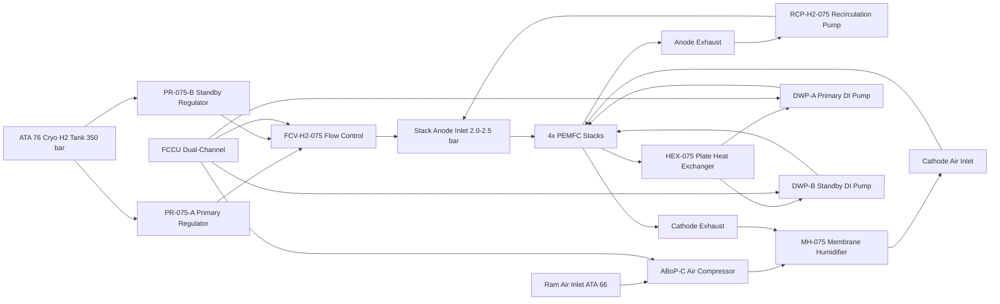

<!-- ──────────────────────────────────────────────────────────────────────────
     QATL-ATLAS-1000-ATLAS-070-079-07-075-020-BALANCE-OF-PLANT-AIR-HYDROGEN-AND-COOLING
     ATA 75 · Balance of Plant — Air, Hydrogen and Cooling
     programme-defined aircraft type — ATLAS Register 1000
────────────────────────────────────────────────────────────────────────────── -->

# Balance of Plant — Air, Hydrogen and Cooling

---

## §0 Hyperlink Policy

> All hyperlinks in this document are **relative** (five directory levels: `../../../../../`).
> Absolute URLs are forbidden. Every linked document must exist in the Q+ATLANTIDE repository
> before the link is activated. Broken links are treated as open issues and must be resolved
> before the document is promoted from `DRAFT` to `APPROVED`.

---

## §1 Purpose

This document defines the agnostic ATLAS standard-level architecture context for `Balance of Plant — Air, Hydrogen and Cooling`.

It describes the controlled scope, functions, interfaces, safety considerations, lifecycle traceability, and S1000D/CSDB mapping logic that programme implementations shall instantiate when this node is applicable.

This document is not a programme design baseline. Programme-specific capacities, locations, part numbers, effectivity, operating limits, maintenance references, and data module codes shall be defined only inside the applicable programme implementation branch.
## §2 Applicability

| Applicability Level | Rule |
|---|---|
| Standard taxonomy | Applies to the ATLAS node `075` |
| Programme implementation | Conditional; determined by programme architecture, trade studies, certification basis, and applicability model |
| Product configuration | Defined in the programme-specific configuration baseline |
| Effectivity | Defined in the programme CSDB / applicability layer |
| Non-applicability | Must be explicitly stated in the programme impact-study branch when excluded |
## §3 Functional Description ![DRAFT]

**Cathode Air Supply**: The ABoP-C is a twin-spool electric scroll compressor drawing from the aircraft's ram air inlet (ATA 66). It delivers cathode air at a mass flow rate of 0.15–0.35 kg/s depending on power demand, compressed to 1.5–2.5 bar. Air passes through an inline particulate filter (PF-CAT-075), then through the membrane humidifier (MH-075) which adds moisture recovered from cathode exhaust to maintain inlet relative humidity ≥70 % RH. A cathode air flow sensor (CFS-075) and pressure transducer (PT-CAT-075) provide closed-loop feedback to the FCCU. A bypass valve (BV-CAT-075) allows air flow diversion during stack warm-up below 60 °C.

**Hydrogen Fuel Supply**: Cryogenic H2 from ATA 76 tanks enters the BoP H2 supply header at approximately 350 bar via a high-pressure flexible hose assembly. Dual redundant pressure regulators PR-075-A (primary) and PR-075-B (standby) reduce supply pressure in two stages to the stack anode inlet operating pressure of 2.0–2.5 bar. A particulate filter (PF-H2-075) protects the regulator seats from contamination. A mass flow sensor (MFS-H2-075) measures H2 consumption in real time. The FCCU controls stoichiometry ratio λH2 = 1.3 at rated power by commanding the anode flow control valve (FCV-H2-075). Anode recirculation via a recirculation pump (RCP-H2-075) recovers unconsumed H2 from the anode exhaust.

**Thermal Management**: Two DI water pumps DWP-A (primary) and DWP-B (standby) operate at variable speeds (0–5,000 RPM) to circulate approximately 60 L/min total coolant through the stack cooling channels and the plate heat exchanger HEX-075. The HEX-075 is a compact brazed aluminium heat exchanger mounted on the ventral fuselage skin, using ram airflow for heat rejection. An expansion tank (ET-075) accommodates coolant volume changes with temperature. Coolant temperature at the stack inlet is maintained at ≤65 °C by FCCU DWP speed control; outlet temperature rises to ≤80 °C at rated power. DI water purity is monitored by an inline conductivity sensor (CS-DWI-075); conductivity >10 µS/cm triggers a maintenance advisory to replace the DI resin bed (RB-075).

---

## §4 Functional Breakdown

| ID | Name | Description | Lead Division |
|---|---|---|---|
| F-001 | Cathode air compression | ABoP-C twin-spool electric scroll compressor 0.15–0.35 kg/s at 1.5–2.5 bar | Q-MECHANICS |
| F-002 | Cathode air humidification | MH-075 membrane humidifier recovers cathode exhaust moisture; maintains ≥70 % RH at cathode inlet | Q-MECHANICS |
| F-003 | H2 pressure regulation | Dual PR-075-A/B two-stage pressure regulators from ~350 bar cryogenic to 2.0–2.5 bar stack inlet | Q-MECHANICS |
| F-004 | H2 stoichiometry control | FCV-H2-075 flow control valve commanded by FCCU; λH2 = 1.3 at rated power | Q-HPC |
| F-005 | H2 anode recirculation | RCP-H2-075 anode recirculation pump recovers unconsumed H2 from anode exhaust | Q-MECHANICS |
| F-006 | DI water cooling circulation | DWP-A/B variable speed DI water pumps; 60 L/min total; inlet ≤65 °C, outlet ≤80 °C | Q-MECHANICS |
| F-007 | Waste heat rejection | HEX-075 ventral plate heat exchanger; up to 60 kW rejection at cruise ram airflow | Q-AIR |
| F-008 | DI water purity monitoring | CS-DWI-075 conductivity sensor; >10 µS/cm triggers resin bed RB-075 replacement advisory | Q-MECHANICS |

---

## §5 System Context — Mermaid Diagram

---

## §6 Internal Architecture — Mermaid Diagram

```mermaid
flowchart TB
    subgraph BOP_AIR[BoP Cathode Air Subsystem]
        ABOP_C_INT[ABoP-C Twin-Spool Compressor]
        PF_CAT[PF-CAT-075 Air Particulate Filter]
        MH_INT[MH-075 Membrane Humidifier]
        CFS[CFS-075 Cathode Flow Sensor]
        PT_CAT[PT-CAT-075 Pressure Transducer]
        BV_CAT[BV-CAT-075 Bypass Valve]
        ABOP_C_INT --> PF_CAT --> MH_INT --> CFS --> PT_CAT
    end
    subgraph BOP_H2[BoP Hydrogen Subsystem]
        PR_A_INT[PR-075-A Primary Regulator]
        PR_B_INT[PR-075-B Standby Regulator]
        PF_H2[PF-H2-075 H2 Particulate Filter]
        MFS[MFS-H2-075 Mass Flow Sensor]
        FCV_INT[FCV-H2-075 Flow Control Valve]
        RCP_INT[RCP-H2-075 Recirculation Pump]
        PR_A_INT --> PF_H2 --> MFS --> FCV_INT
        PR_B_INT --> PF_H2
        FCV_INT --> RCP_INT
    end
    subgraph BOP_COOL[BoP Thermal Subsystem]
        DWP_A_INT[DWP-A Primary Pump]
        DWP_B_INT[DWP-B Standby Pump]
        HEX_INT[HEX-075 Ventral Heat Exchanger]
        ET_INT[ET-075 Expansion Tank]
        CS_DWI[CS-DWI-075 Conductivity Sensor]
        RB_INT[RB-075 DI Resin Bed]
        DWP_A_INT --> HEX_INT --> ET_INT --> CS_DWI --> RB_INT
        DWP_B_INT --> HEX_INT
    end
    FCCU[FCCU] --> BOP_AIR
    FCCU --> BOP_H2
    FCCU --> BOP_COOL
```

---

## §7 Components and LRUs

| Component | Part Number | Qty | Location | Maintenance Interval | Notes |
|---|---|---|---|---|---|
| BoP Air Compressor ABoP-C | ABoP-C-075 | 1 | FCM bay forward section | C-check bearing/seal inspection | Twin-spool electric scroll; 0.15–0.35 kg/s |
| Cathode Particulate Filter PF-CAT-075 | PF-CAT-075 | 1 | FCM bay | B-check element replacement | 5 µm nominal filter element |
| Membrane Humidifier MH-075 | MH-075 | 1 | FCM bay cathode duct | D-check membrane replacement | Nafion membrane cartridge |
| H2 Pressure Regulator PR-075-A | PR-075-A | 1 | H2 supply line FCM bay | C-check seat inspection | Primary, two-stage, 350→2.5 bar |
| H2 Pressure Regulator PR-075-B | PR-075-B | 1 | H2 supply line FCM bay | C-check seat inspection | Standby, identical to PR-075-A |
| H2 Particulate Filter PF-H2-075 | PF-H2-075 | 1 | H2 supply line | A-check element replacement | 2 µm H2 service rated |
| H2 Flow Control Valve FCV-H2-075 | FCV-H2-075 | 1 | H2 supply line FCM bay | C-check | FCCU PWM controlled, 0–40 g/s range |
| H2 Recirculation Pump RCP-H2-075 | RCP-H2-075 | 1 | Anode recirculation line | C-check seal inspection | Ejector-pump hybrid |
| DI Water Pump DWP-A | DWP-A-075 | 1 | FCM bay cooling circuit | C-check mechanical seal | Primary; 0–5,000 RPM variable |
| DI Water Pump DWP-B | DWP-B-075 | 1 | FCM bay cooling circuit | C-check mechanical seal | Standby; identical to DWP-A |
| Plate Heat Exchanger HEX-075 | HEX-075 | 1 | Ventral fuselage external skin | C-check fouling inspection | Brazed aluminium; 60 kW rated |
| DI Resin Bed RB-075 | RB-075 | 1 | DI water circuit return | On-condition per CS-DWI-075 reading | Mixed-bed DI resin canister |
| Expansion Tank ET-075 | ET-075 | 1 | DI water circuit high point | A-check level inspection | 5 L capacity pressurised with N2 blanket |

---

## §8 Interfaces

| Interface Type | Connected System | Protocol / Medium | Data / Function |
|---|---|---|---|
| Cathode air inlet | ATA 66 ram air ducting | Flexible duct + flow valve | Ram air to ABoP-C at ambient conditions |
| H2 fuel supply | ATA 76 cryogenic H2 tanks | SS316L double-wall high-pressure H2 line | H2 at ~350 bar cryogenic to PR-075-A/B |
| Coolant waste heat | Ventral fuselage skin | HEX-075 structural mounting + ram airflow | Up to 60 kW heat rejection to ram air |
| FCCU control | FCCU sensor and actuator bus | ARINC 429 + discrete I/O | Compressor speed, valve position, pump speed, sensor data |
| Health data to CMS | ATA 45 CMS | AFDX ARINC 664 P7 | BoP sensor data and BITE faults at 100 ms |
| Anode cathode exhaust | ATA 75 water management (075-040) | SS316L piping | Product water + exhaust gases routed to water management |

---

## §9 Operating Modes

| Mode | Trigger | System State | Actions / Consequences |
|---|---|---|---|
| Pre-start purge | Start sequence initiated | PR-075-A open; N2 purge of anode line; ABoP-C off | Anode lines purged; H2 introduced after purge complete |
| Warm-up | Stack temp <60 °C | ABoP-C low flow; H2 low stoichiometry; DWP-A low speed | Stack warming to 60 °C; BV-CAT-075 bypasses humidifier |
| Normal operation | Stack temp 60–80 °C | ABoP-C regulated flow; λH2=1.3; DWP-A primary active | Full BoP support; DWP-B on hot standby |
| High altitude | Altitude >7,000 m | ABoP-C increased speed to compensate lower air density | Cathode air mass flow maintained at target stoichiometry |
| DWP-A fault | DWP-A failure detected | DWP-B automatically switches to primary; ECAM advisory | No interruption to cooling; maintenance on DWP-A at next check |
| Post-shutdown cooldown | FCM shutdown | DWP-A continues running; ABoP-C off; N2 anode purge | Stacks cooled to <40 °C before DWP stops; H2 purged |

---

## §10 Performance and Budgets ![DRAFT]

| Parameter | Requirement | Target / Design Value | Status |
|---|---|---|---|
| Cathode air mass flow at rated power | 0.35 kg/s at 200 kW load | 0.35 kg/s | ![TBD] |
| H2 supply pressure range | 2.0–2.5 bar at stack inlet | 2.0 bar nominal ±0.1 bar | ![TBD] |
| H2 stoichiometry ratio | λH2 ≥ 1.2 at all loads | λH2 = 1.3 regulated | ![TBD] |
| Coolant inlet temperature (max) | ≤65 °C at rated power | 65 °C | ![TBD] |
| Coolant outlet temperature (max) | ≤80 °C at rated power | 78 °C | ![TBD] |
| Total BoP parasitic power | ≤12 kW at rated output | ~10 kW estimated | ![TBD] |
| DI water conductivity limit | <10 µS/cm | Maintained by RB-075 | ![TBD] |
| Cathode air inlet humidity | ≥70 % RH | Maintained by MH-075 | ![TBD] |

---

## §11 Safety, Redundancy and Fault Tolerance

- **Dual H2 pressure regulators**: PR-075-A (primary) and PR-075-B (standby) provide redundant pressure regulation; standby auto-activates on primary failure detected by downstream PT-H2-075 pressure transducer.
- **H2 anode recirculation**: RCP-H2-075 recirculates unconsumed anode exhaust H2 to improve fuel utilisation from ~80 % single-pass to >95 %, reducing H2 vent to atmosphere.
- **Dual DI water pumps**: DWP-A (primary) and DWP-B (standby) provide thermal management redundancy; FCCU auto-switches to DWP-B on DWP-A loss with no stack power interruption.
- **Cathode air bypass valve**: BV-CAT-075 allows cathode air flow bypass during cold start <60 °C, preventing membrane dehydration during warm-up.
- **DI water purity monitoring**: CS-DWI-075 continuous conductivity measurement prevents ion contamination of stack cooling channels, which would cause galvanic corrosion of bipolar plates.
- **H2 filter protection**: PF-H2-075 (2 µm rated for H2 service) prevents particulate contamination of PR regulator seats, which is a leading cause of regulator failure and stuck-open fault.

---

## §12 Maintenance and Diagnostics

| Task | Interval | Access | Special Tools |
|---|---|---|---|
| H2 particulate filter PF-H2-075 element replacement | A-check | FCM bay H2 LOTO required | Torque wrench; H2 service gloves |
| DI water conductivity check (CS-DWI-075 reading) | A-check | FCM bay DI circuit inspection point | Handheld conductivity meter cross-check |
| DI resin bed RB-075 replacement | On condition per CS-DWI-075 | FCM bay DI circuit | Resin bed cartridge PN RB-075-CRT |
| ABoP-C bearing and seal inspection | C-check | FCM bay access panel F-BOP-075 | Vibration analyser PN VA-GSE-075 |
| H2 regulator PR-075-A/B seat leak test | C-check | H2 LOTO; N2 leak test rig | N2 Purge Cart PN N2PC-GSE-075 |
| HEX-075 fouling inspection and cleaning | C-check | External ventral fuselage access | Pressure washer PN PW-GSE-075 |
| Expansion tank ET-075 N2 blanket pressure check | A-check | FCM bay | Calibrated pressure gauge |
| Membrane humidifier MH-075 membrane replacement | D-check | FCM bay | Nafion cartridge MH-075-MEM |

---

## §13 Footprint

| Footprint Type | Parameter | Value | Notes |
|---|---|---|---|
| BoP total estimated mass | All BoP components | ~45 kg estimated | Pumps, compressor, HEX, filters, valves |
| HEX-075 area | Ventral skin mounting | TBD | Structural integration with fuselage |
| ABoP-C power draw | Parasitic electrical | ~6 kW at rated 200 kW | Drawn from HVDC 270 V bus |
| DWP-A/B power draw each | Parasitic electrical | ~1.5 kW each | Variable speed |
| H2 supply line | Penetration size | TBD | SS316L double-wall with annulus vent |
| DI water circuit volume | Total coolant volume | ~12 L nominal | Including ET-075 buffer |

---

## §14 Safety and Certification References ![DRAFT]

| Standard / Document | Title | Issuing Body | Applicability |
|---|---|---|---|
| EASA CS-25 §25.963 | Fuel tanks — general | EASA | H2 supply system safety |
| SAE AS6858 | Airworthiness Guidelines for PEMFC Systems | SAE International | BoP airworthiness |
| IEC 62282-2 | Fuel Cell Technologies — Fuel Cell Modules | IEC | BoP performance |
| DO-160G | Environmental Conditions for Airborne Equipment | RTCA | All BoP LRUs |
| IEC 60079-10-1 | Explosive atmospheres — Classification of areas | IEC | H2 BoP area classification |
| ASTM G4 | Standard Guide for Evaluation of Materials for Oxygen Service | ASTM | Not applicable — oxygen service excluded; reference for H2 compatibility |
| SAE ARP4754A | Guidelines for Development of Civil Aircraft | SAE International | BoP system development |

---

## §15 V&V Approach ![TBD]

| Phase | Method | Acceptance Criterion | Status |
|---|---|---|---|
| Analysis | BoP flow and thermal model | Predicted 60 kW heat rejection; λH2=1.3 confirmed at rated flow | ![TBD] |
| BoP bench test | Full BoP functional test with H2 and thermal load | All sensors within ±2 % of calibrated value; all valves/pumps functional | ![TBD] |
| Integration test | FCM full-power ground test with BoP active | Stack temperatures maintained 60–80 °C at rated load | ![TBD] |
| Altitude simulation | Altitude chamber test at 7,000 m simulated | ABoP-C maintains cathode air mass flow at high altitude | ![TBD] |
| Certification | CS-25 flight test with BoP in all operating modes | CS-25 compliance demonstrated | ![TBD] |

---

## §16 Glossary

| Term | Definition |
|---|---|
| BoP | Balance of Plant — ancillary systems supporting PEMFC stack operation |
| ABoP-C | BoP Air Compressor — twin-spool electric scroll compressor for cathode air supply |
| MH-075 | Membrane Humidifier — Nafion membrane cartridge recovering cathode exhaust moisture |
| PR-075-A/B | Pressure Regulator — dual-redundant H2 pressure regulators from cryogenic to stack pressure |
| FCV-H2-075 | H2 Flow Control Valve — FCCU-commanded valve maintaining λH2 stoichiometry |
| RCP-H2-075 | H2 Recirculation Pump — anode exhaust recirculation to improve H2 fuel utilisation |
| DWP-A/B | DI Water Pump — dual-redundant variable-speed coolant circulation pumps |
| HEX-075 | Plate Heat Exchanger — ventral fuselage brazed aluminium heat exchanger for waste heat rejection |
| RB-075 | DI Resin Bed — mixed-bed deionisation resin canister maintaining coolant purity <10 µS/cm |
| CS-DWI-075 | Conductivity Sensor — inline DI water purity monitor |
| λH2 | Hydrogen stoichiometry ratio — H2 flow / stoichiometric H2 consumption at rated current |
| BV-CAT-075 | Cathode Air Bypass Valve — diverts compressor air around humidifier during cold start |

---

## §17 Open Issues

| ID | Description | Owner | Target |
|---|---|---|---|
| OI-075-020-001 | Confirm ABoP-C compressor OEM selection and performance map at altitude | Q-MECHANICS | 2026-Q4 |
| OI-075-020-002 | Finalise HEX-075 structural integration and ventral skin penetration design with structures team | Q-AIR | 2027-Q1 |
| OI-075-020-003 | Complete H2 recirculation pump RCP-H2-075 trade study vs passive ejector pump approach | Q-MECHANICS | 2026-Q4 |
| OI-075-020-004 | Validate DI water purity maintenance interval with DWP-A/B seal material compatibility | Q-MECHANICS | 2027-Q1 |

---

## §18 Status Legend

| Badge | Meaning |
|---|---|
| `![DRAFT]` | Section is drafted but not yet reviewed |
| `![TBD]` | Content not yet started — to be defined |
| `![To Be Completed]` | Partially complete — needs additional content |
| `![APPROVED]` | Reviewed and formally approved |

---

## §19 Related Documents (Siblings in this Subsection)

- [075-000](./075-000-Fuel-Cell-Integration-General.md)
- [075-010](./075-010-Fuel-Cell-Stack-Architecture.md)
- [075-030](./075-030-Fuel-Cell-Power-Conditioning.md)
- [075-040](./075-040-Water-Management-and-Purge-Interfaces.md)
- [075-050](./075-050-Fuel-Cell-Safety-Isolation-and-Venting.md)
- [075-060](./075-060-Fuel-Cell-Control-and-Operating-Modes.md)
- [075-070](./075-070-Fuel-Cell-Service-Test-and-Maintenance.md)
- [075-080](./075-080-Fuel-Cell-Monitoring-Diagnostics-and-Control-Interfaces.md)
- [075-090](./075-090-S1000D-CSDB-Mapping-and-Traceability.md)

---

## §20 Change Log

| Rev | Date | Author | Description |
|---|---|---|---|
| 0.1 | 2026-05-12 | @copilot | Initial DRAFT — BoP air, hydrogen and cooling subsystems for FCM |
