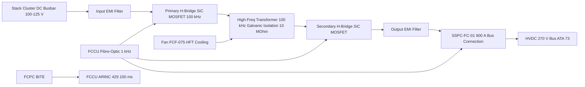
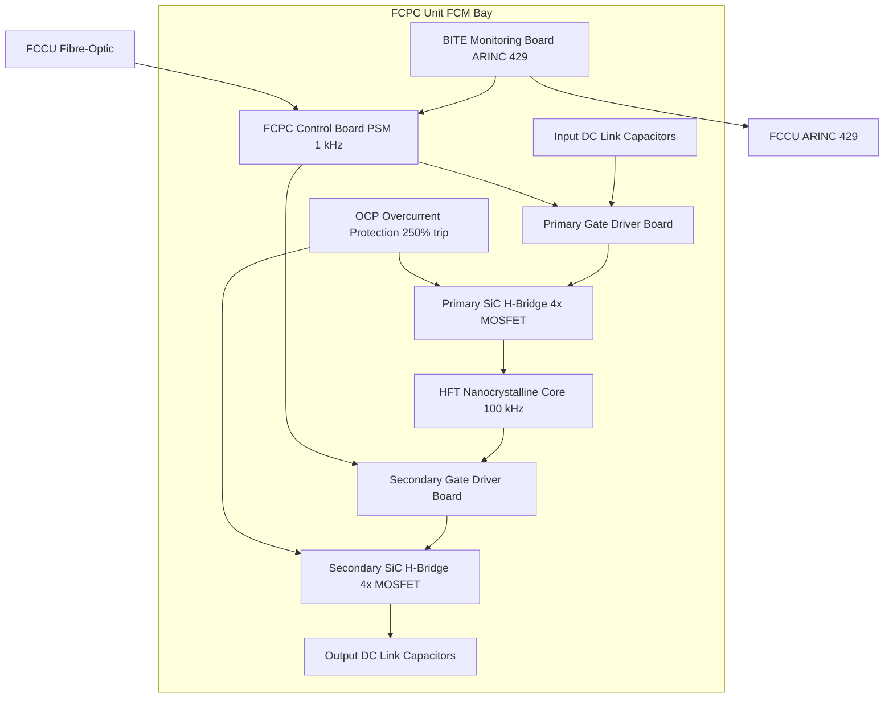

<!-- ──────────────────────────────────────────────────────────────────────────
     QATL-ATLAS-1000-ATLAS-070-079-07-075-030-FUEL-CELL-POWER-CONDITIONING
     ATA 75 · Fuel Cell Power Conditioning
     AMPEL360E eWTW — ATLAS Register 1000
────────────────────────────────────────────────────────────────────────────── -->

# Fuel Cell Power Conditioning

---

## §0 Hyperlink Policy

> All hyperlinks in this document are **relative** (five directory levels: `../../../../../`).
> Absolute URLs are forbidden. Every linked document must exist in the Q+ATLANTIDE repository
> before the link is activated. Broken links are treated as open issues and must be resolved
> before the document is promoted from `DRAFT` to `APPROVED`.

---

## §1 Purpose

This document defines the Fuel Cell Power Converter (FCPC) subsystem of the AMPEL360E eWTW, which conditions the raw DC output of the PEMFC stack cluster for delivery to the aircraft HVDC 270 V primary bus. The FCPC is a 200 kW bidirectional Dual Active Bridge (DAB) DC-DC converter using Silicon Carbide (SiC) MOSFETs, converting the stack cluster output voltage of 100–125 V DC to a regulated 270 V HVDC output compliant with MIL-STD-704F and RTCA DO-160G.

The FCPC provides galvanic isolation of ≥10 MΩ between the PEMFC stack low-voltage domain and the aircraft HVDC bus, preventing ground fault propagation. It implements output current ramping (≤50 A/s) to protect the PEMFC membrane from rapid electrochemical stress. Power transfer is controlled by the FCCU via a high-speed fibre-optic isolated control link operating at 1 kHz, allowing tight integration with the FCCU stoichiometry and thermal control loops.

The FCPC includes an integrated gate driver board, a high-frequency transformer (HFT) with ferrite core operating at 100 kHz, input and output EMI filters, an output SSPC-FC-01 solid-state power controller for bus connection, and a comprehensive BITE system reporting to the FCCU via ARINC 429.

---

## §2 Applicability

| Parameter | Value |
|---|---|
| Aircraft Program | AMPEL360E eWTW |
| ATA reference | ATA 75-030 — Fuel Cell Power Conditioning |
| Certification basis | EASA CS-25 Amdt 27+ |
| S1000D SNS | 075-030-00 |

---

## §3 Functional Description ![DRAFT]

The DAB DC-DC converter topology operates with two active H-bridges — a primary-side bridge connected to the PEMFC stack cluster busbar (100–125 V input) and a secondary-side bridge connected to the HVDC 270 V bus — coupled through a high-frequency transformer operating at 100 kHz. Phase-shift modulation (PSM) between the two bridges controls the direction and magnitude of power transfer. At rated 200 kW output, the primary-side H-bridge switches at 100 kHz with SiC MOSFET devices (1,200 V, 400 A rating) providing low switching losses compared to silicon IGBTs.

The HFT uses a nanocrystalline core with a turns ratio of approximately 1:2.5 (primary 100 V to secondary 270 V) and operates at 100 kHz with a switching frequency chosen to minimise core volume while maintaining low core losses. The transformer is potted in thermally conductive epoxy and air-cooled by a dedicated 24 V DC brushless fan (FCF-075) drawing 150 W. An overcurrent protection (OCP) circuit on both primary and secondary sides provides 250 % instantaneous current limiting without triggering bus fault protection.

Output regulation maintains 270 V ±1 % on the HVDC bus at all loads from 0 % to 100 % rated power. The FCPC output connects to the HVDC 270 V bus via SSPC-FC-01, a 900 A solid-state power controller with electronic trip protection against short circuit, overload, and over-voltage/under-voltage conditions. The FCCU commands SSPC-FC-01 open/close for planned startup and shutdown sequences.

The FCPC BITE system monitors: input voltage/current, output voltage/current, HFT temperature, gate driver supply voltages, SSPC-FC-01 state, fan FCF-075 speed, input/output EMI filter capacitor health, and SiC MOSFET junction temperature via NTC thermistors. All BITE data are transmitted to the FCCU at 100 ms intervals via ARINC 429.

---

## §4 Functional Breakdown

| ID | Name | Description | Lead Division |
|---|---|---|---|
| F-001 | DAB DC-DC conversion | 200 kW bidirectional DAB converter; SiC MOSFET H-bridges; 100 kHz switching; PSM control | Q-GREENTECH |
| F-002 | High-frequency transformer | 100 kHz nanocrystalline HFT; turns ratio ~1:2.5; galvanic isolation ≥10 MΩ | Q-MECHANICS |
| F-003 | Output voltage regulation | 270 V ±1 % at all loads; FCCU PSM phase-shift command at 1 kHz fibre-optic link | Q-HPC |
| F-004 | Bus connection SSPC-FC-01 | 900 A solid-state power controller with OCP/OVP/UVP trip; FCCU commanded | Q-GREENTECH |
| F-005 | EMI filtering | Input and output EMI filters; MIL-STD-461 CE102 compliance | Q-GREENTECH |
| F-006 | BITE monitoring | Input/output V/I, HFT temp, MOSFET temp, gate driver health; ARINC 429 to FCCU at 100 ms | Q-HPC |
| F-007 | Galvanic isolation | ≥10 MΩ stack to HVDC bus isolation via HFT; isolation integrity monitored by FCCU IMR | Q-GREENTECH |

---

## §5 System Context — Mermaid Diagram

---

## §6 Internal Architecture — Mermaid Diagram

---

## §7 Components and LRUs

| Component | Part Number | Qty | Location | Maintenance Interval | Notes |
|---|---|---|---|---|---|
| FCPC Assembly (complete LRU) | FCPC-075 | 1 | FCM bay | C-check efficiency and BITE test | 200 kW DAB; SiC MOSFET; 100 kHz |
| HFT High-Frequency Transformer | HFT-075 | 1 | Internal to FCPC | D-check (replacement in FCPC assembly) | Nanocrystalline core; potted |
| SSPC Bus Connection Controller | SSPC-FC-01 | 1 | FCPC output, FCM bay | C-check trip test | 900 A; FCCU commanded |
| FCPC Cooling Fan FCF-075 | FCF-075 | 1 | FCPC unit forced-air cooling | A-check RPM check via BITE | 24 V DC brushless; 150 W |
| Input EMI Filter | EMI-IN-075 | 1 | Internal to FCPC | D-check (FCPC assembly) | MIL-STD-461 CE102 |
| Output EMI Filter | EMI-OUT-075 | 1 | Internal to FCPC | D-check (FCPC assembly) | MIL-STD-461 CE102 |
| FCPC Control and BITE Board | CTRL-BITE-075 | 1 | Internal to FCPC | SW update per SB | DO-178C DAL B software; DO-254 DAL B hardware |

---

## §8 Interfaces

| Interface Type | Connected System | Protocol / Medium | Data / Function |
|---|---|---|---|
| DC input | Stack cluster DC busbar | Copper busbars; rated 200 kW at 125 V / 1,600 A | PEMFC raw DC power input to FCPC |
| DC output | HVDC 270 V bus (ATA 73) via SSPC-FC-01 | Copper busbars; rated 200 kW at 270 V / 741 A | Regulated 270 V output to primary bus |
| FCCU control link | FCCU fibre-optic isolated | Fibre-optic serial; 1 kHz update rate | PSM phase-shift command and SSPC command |
| BITE data | FCCU ARINC 429 | ARINC 429 high-speed | Voltage, current, temperature, SSPC state at 100 ms |
| Isolation monitoring | FCCU isolation monitor IMR | ARINC 429 | Stack-to-bus isolation resistance measurement |
| Cooling | HFT cooling fan FCF-075 | 24 V DC power + BITE tach signal | HFT thermal management; fan speed monitored |

---

## §9 Operating Modes

| Mode | Trigger | System State | Actions / Consequences |
|---|---|---|---|
| Standby | FCM in standby | FCPC powered but not switching; SSPC-FC-01 open | BITE active; isolation check active; no power transfer |
| Ramp-up | Stack cluster >100 V; FCCU command | SSPC-FC-01 closes; PSM phase shift increases at ≤50 A/s | Output current ramps to demand; ECAM normal |
| Normal power | Rated demand ≤200 kW | FCPC regulates 270 V ±1 %; phase shift modulated by FCCU | Full power to HVDC bus; efficiency ≥97 % |
| Partial load | <200 kW demand | FCPC reduces phase shift; maintains 270 V regulation | Efficiency slightly reduced at light load |
| Overcurrent trip | >250 % rated current | OCP triggers immediate gate shutdown; SSPC-FC-01 opens | ECAM amber; FCCU attempts restart after 30 s |
| Isolation fault | Isolation resistance <1 MΩ | SSPC-FC-01 opens; FCCU logs IMR fault | ECAM amber; FCM isolated from bus; maintenance required |
| Shutdown | FCCU shutdown command | Phase shift reduces to zero; SSPC-FC-01 opens; FCPC de-energises | Orderly shutdown; BITE log preserved |

---

## §10 Performance and Budgets ![DRAFT]

| Parameter | Requirement | Target / Design Value | Status |
|---|---|---|---|
| Rated power output | 200 kW continuous | 200 kW | ![TBD] |
| Input voltage range | 100–125 V DC from stack cluster | 100–125 V | ![TBD] |
| Output voltage regulation | 270 V ±1 % at all loads | 270 V ±2.7 V | ![TBD] |
| Conversion efficiency | ≥97 % at 50 % load | 97.5 % target | ![TBD] |
| Galvanic isolation | ≥10 MΩ stack to bus | ≥10 MΩ | ![TBD] |
| Output current ramp rate limit | ≤50 A/s for stack protection | 50 A/s | ![TBD] |
| Switching frequency | 100 kHz nominal | 100 kHz | ![TBD] |
| Mass (FCPC unit) | TBD | ~25 kg estimated | ![TBD] |
| EMI compliance | MIL-STD-461 CE102 | Meets CE102 | ![TBD] |

---

## §11 Safety, Redundancy and Fault Tolerance

- **Galvanic isolation ≥10 MΩ**: HFT high-frequency transformer provides full galvanic isolation between PEMFC stack domain and HVDC bus, preventing stack ground fault from propagating to aircraft electrical system.
- **Isolation monitoring IMR**: FCCU continuously monitors stack-to-bus isolation resistance via ARINC 429; isolation drop below 1 MΩ triggers automatic SSPC-FC-01 open before isolation failure can cause current injection into the stack.
- **OCP 250 % instantaneous**: Overcurrent protection prevents bus short-circuit fault from destroying SiC MOSFET devices; trip response time <1 µs.
- **Output ramp rate limiting**: 50 A/s output current ramp prevents step-load electrochemical stress on PEMFC membrane which would cause voltage undershoot and potential cell reversal.
- **SSPC-FC-01 bus protection**: Solid-state bus protection controller provides independent over-voltage (>290 V), under-voltage (<240 V), and short-circuit protection without mechanical contacts subject to arcing.
- **BITE continuity**: FCPC BITE operates independently of PSM control logic; BITE reporting continues during FCPC faults to capture fault data for maintenance.

---

## §12 Maintenance and Diagnostics

| Task | Interval | Access | Special Tools |
|---|---|---|---|
| FCPC BITE fault log download | A-check | FCCU ARINC 429 GSE port | CMS GSE Terminal PN CMS-GSE-TRM |
| FCPC efficiency test at 50 % and 100 % load | C-check | FCM bay + calibrated load bank | FCPC Power Analyser PN PAR-GSE-075 |
| SSPC-FC-01 functional trip test | C-check | FCCU GSE command | FCCU GSE console |
| FCF-075 fan RPM and noise check | A-check | FCM bay audible/visual | Tachometer; BITE ARINC 429 fan speed parameter |
| Isolation resistance test (stack to HVDC bus) | C-check | FCM bay; stack and bus isolated | Megohmmeter PN MEG-GSE-075 rated 1 kV |
| FCPC visual inspection (hotspot, corrosion) | C-check | FCM bay access panel F-BL-075 | Thermal camera PN TC-GSE-075 |
| SiC MOSFET thermal profile check | C-check | BITE temperature channel download | CMS GSE Terminal PN CMS-GSE-TRM |

---

## §13 Footprint

| Footprint Type | Parameter | Value | Notes |
|---|---|---|---|
| FCPC unit mass | FCPC assembly | ~25 kg estimated | TBD from final design |
| FCPC unit volume | FCM bay mounting | TBD | Rack-mounted in FCM bay |
| HFT operating temperature | Continuous | ≤120 °C internal winding | Measured by BITE NTC thermistors |
| Switching losses | At rated 200 kW | ~4 kW estimated switching + conduction | Fan-cooled HFT |
| Fan FCF-075 power | Parasitic | 150 W | Drawn from HVDC 270 V bus |
| Cable cross-section input | 100–125 V / 1,600 A | TBD mm² copper | Low-resistance busbar connection |

---

## §14 Safety and Certification References ![DRAFT]

| Standard / Document | Title | Issuing Body | Applicability |
|---|---|---|---|
| EASA CS-25 §25.1353 | Electrical equipment and installation | EASA | FCPC electrical safety |
| MIL-STD-704F | Aircraft Electric Power Characteristics | DoD | HVDC 270 V bus compatibility |
| DO-160G | Environmental Conditions for Airborne Equipment | RTCA | FCPC LRU qualification |
| MIL-STD-461G | Requirements for the Control of Electromagnetic Interference | DoD | EMI filtering compliance |
| DO-178C | Software Considerations in Airborne Systems | RTCA | FCPC control software DAL B |
| DO-254 | Design Assurance Guidance for Airborne Hardware | RTCA | FCPC control hardware DAL B |
| IEC 62477-1 | Safety Requirements for Power Electronic Converter Systems | IEC | SiC MOSFET converter safety |

---

## §15 V&V Approach ![TBD]

| Phase | Method | Acceptance Criterion | Status |
|---|---|---|---|
| Design analysis | SPICE simulation of DAB converter at full load | Predicted 97.5 % efficiency; 270 V ±1 % regulation | ![TBD] |
| Converter bench test | 200 kW load test; efficiency calorimetry; isolation measurement | ≥97 % at 50 % load; ≥10 MΩ isolation | ![TBD] |
| EMI compliance test | MIL-STD-461 CE102 scan with FCPC at rated power | CE102 limits not exceeded | ![TBD] |
| Integration test | FCPC connected to FCM stack cluster and HVDC bus | 270 V ±1 % under all stack and bus load conditions | ![TBD] |
| DO-160G qualification | Temperature, vibration, humidity testing of FCPC LRU | All DO-160G categories met | ![TBD] |

---

## §16 Glossary

| Term | Definition |
|---|---|
| DAB | Dual Active Bridge — bidirectional DC-DC converter topology with two H-bridges and HFT |
| SiC MOSFET | Silicon Carbide Metal-Oxide-Semiconductor Field-Effect Transistor — wide-bandgap power switch |
| PSM | Phase-Shift Modulation — DAB control method varying phase angle between bridges to control power |
| HFT | High-Frequency Transformer — 100 kHz nanocrystalline core transformer providing isolation and voltage conversion |
| SSPC-FC-01 | Solid-State Power Controller for fuel cell bus connection — 900 A rated |
| OCP | Overcurrent Protection — instantaneous current limiting at 250 % rated current |
| IMR | Isolation Monitor Resistance — FCCU function measuring stack-to-bus galvanic isolation |
| EMI | Electromagnetic Interference — electrical noise managed by MIL-STD-461 input/output filters |
| FCF-075 | Fuel Cell Converter Fan — 24 V DC brushless forced-air fan for HFT thermal management |
| LHV | Lower Heating Value — used in FCPC efficiency metric relative to H2 input power |
| HVDC | High-Voltage Direct Current — 270 V DC aircraft primary power bus |

---

## §17 Open Issues

| ID | Description | Owner | Target |
|---|---|---|---|
| OI-075-030-001 | Confirm SiC MOSFET OEM selection and switching loss validation at 100 kHz 200 kW | Q-GREENTECH | 2026-Q4 |
| OI-075-030-002 | Finalise FCPC DO-160G vibration category based on FCM bay structural dynamic analysis | Q-AIR | 2027-Q1 |
| OI-075-030-003 | Complete PSM control algorithm validation including stack voltage sag compensation | Q-HPC | 2026-Q4 |

---

## §18 Status Legend

| Badge | Meaning |
|---|---|
| `![DRAFT]` | Section is drafted but not yet reviewed |
| `![TBD]` | Content not yet started — to be defined |
| `![To Be Completed]` | Partially complete — needs additional content |
| `![APPROVED]` | Reviewed and formally approved |

---

## §19 Related Documents (Siblings in this Subsection)

- [075-000](./075-000-Fuel-Cell-Integration-General.md)
- [075-010](./075-010-Fuel-Cell-Stack-Architecture.md)
- [075-020](./075-020-Balance-of-Plant-Air-Hydrogen-and-Cooling.md)
- [075-040](./075-040-Water-Management-and-Purge-Interfaces.md)
- [075-050](./075-050-Fuel-Cell-Safety-Isolation-and-Venting.md)
- [075-060](./075-060-Fuel-Cell-Control-and-Operating-Modes.md)
- [075-070](./075-070-Fuel-Cell-Service-Test-and-Maintenance.md)
- [075-080](./075-080-Fuel-Cell-Monitoring-Diagnostics-and-Control-Interfaces.md)
- [075-090](./075-090-S1000D-CSDB-Mapping-and-Traceability.md)

---

## §20 Change Log

| Rev | Date | Author | Description |
|---|---|---|---|
| 0.1 | 2026-05-12 | @copilot | Initial DRAFT — FCPC 200 kW DAB DC-DC converter power conditioning |
