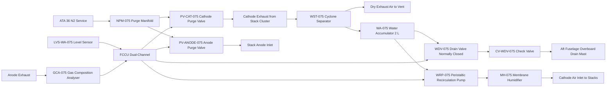
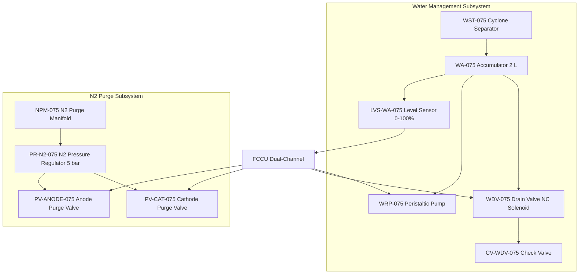

<!-- ──────────────────────────────────────────────────────────────────────────
     QATL-ATLAS-1000-ATLAS-070-079-07-075-040-WATER-MANAGEMENT-AND-PURGE-INTERFACES
     ATA 75 · Water Management and Purge Interfaces
     programme-defined aircraft type — ATLAS Register 1000
────────────────────────────────────────────────────────────────────────────── -->

# Water Management and Purge Interfaces

---

## §0 Hyperlink Policy

> All hyperlinks in this document are **relative** (five directory levels: `../../../../../`).
> Absolute URLs are forbidden. Every linked document must exist in the Q+ATLANTIDE repository
> before the link is activated. Broken links are treated as open issues and must be resolved
> before the document is promoted from `DRAFT` to `APPROVED`.

---

## §1 Purpose

This document defines the agnostic ATLAS standard-level architecture context for `Water Management and Purge Interfaces`.

It describes the controlled scope, functions, interfaces, safety considerations, lifecycle traceability, and S1000D/CSDB mapping logic that programme implementations shall instantiate when this node is applicable.

This document is not a programme design baseline. Programme-specific capacities, locations, part numbers, effectivity, operating limits, maintenance references, and data module codes shall be defined only inside the applicable programme implementation branch.
## §2 Applicability

| Applicability Level | Rule |
|---|---|
| Standard taxonomy | Applies to the ATLAS node `075` |
| Programme implementation | Conditional; determined by programme architecture, trade studies, certification basis, and applicability model |
| Product configuration | Defined in the programme-specific configuration baseline |
| Effectivity | Defined in the programme CSDB / applicability layer |
| Non-applicability | Must be explicitly stated in the programme impact-study branch when excluded |
## §3 Functional Description ![DRAFT]

**Water Separation**: Cathode exhaust from the four stacks enters the common cathode exhaust manifold and flows through the water separator WST-075, a cyclone-type separator that uses centrifugal action to remove entrained liquid water droplets from the gas stream with >98 % liquid separation efficiency at nominal flow rates. Separated liquid water collects in the accumulator WA-075.

**Water Recirculation for Humidification**: Water from WA-075 is pumped by a small peristaltic water recirculation pump (WRP-075) to the membrane humidifier MH-075, where it supplies make-up water to supplement cathode exhaust humidity recovery. The combined moisture content of the cathode exhaust and make-up water maintains cathode air inlet relative humidity ≥70 % RH across all power levels.

**Overboard Drain**: Excess product water that cannot be used by the humidifier is drained overboard through the water drain valve WDV-075, a normally-closed solenoid valve that the FCCU opens when WA-075 level sensor (LVS-WA-075) indicates high level (>80 % full). The drain exits through an overboard drain mast on the aft fuselage undersurface. A check valve (CV-WDV-075) prevents airflow backpressure from forcing moisture back into the accumulator.

**N2 Purge System**: A nitrogen purge manifold (NPM-075) connects to the aircraft N2 service port (ATA 36). Solenoid purge valves (PV-ANODE-075 for anode, PV-CAT-075 for cathode) allow FCCU-commanded N2 injection for three purposes: (1) pre-start anode line purge displacing any residual O2 before H2 introduction; (2) post-shutdown anode purge removing H2 to safe residual levels <1 % v/v before FCM bay access; (3) long-term storage purge maintaining anode atmosphere at N2 during aircraft parking to prevent membrane oxidation.

---

## §4 Functional Breakdown

| ID | Name | Description | Lead Division |
|---|---|---|---|
| F-001 | Cathode water separation | WST-075 cyclone separator; >98 % liquid removal from cathode exhaust at nominal flow | Q-MECHANICS |
| F-002 | Water accumulation and buffering | WA-075 2 L accumulator with LVS-WA-075 level sensor; 80 % high-level drain trigger | Q-MECHANICS |
| F-003 | Water recirculation to humidifier | WRP-075 peristaltic pump; continuous feed to MH-075 for cathode air humidification | Q-MECHANICS |
| F-004 | Overboard water drain | WDV-075 normally-closed solenoid valve; FCCU commanded drain when WA-075 >80 % level | Q-MECHANICS |
| F-005 | Anode N2 purge | PV-ANODE-075 solenoid valve + NPM-075; pre-start O2 purge, post-shutdown H2 purge | Q-AIR |
| F-006 | Cathode N2 purge | PV-CAT-075 solenoid valve; pre-start purge and long-term storage membrane protection | Q-AIR |
| F-007 | H2 exhaust gas concentration monitoring | GCA-075 gas composition analyser on anode exhaust; H2 and O2 fraction monitoring | Q-HPC |

---

## §5 System Context — Mermaid Diagram

---

## §6 Internal Architecture — Mermaid Diagram

---

## §7 Components and LRUs

| Component | Part Number | Qty | Location | Maintenance Interval | Notes |
|---|---|---|---|---|---|
| Water Separator WST-075 | WST-075 | 1 | FCM bay cathode exhaust line | C-check internal inspection | Cyclone type; >98 % liquid separation |
| Water Accumulator WA-075 | WA-075 | 1 | FCM bay | A-check level zero check | 2 L SS316L; pressurised to 2.5 bar max |
| Level Sensor LVS-WA-075 | LVS-WA-075 | 1 | WA-075 accumulator | Calibration ≤24 months | Capacitive 0–100 % level |
| Water Recirculation Pump WRP-075 | WRP-075 | 1 | FCM bay water circuit | C-check tubing replacement | Peristaltic; 0.1 L/min nominal |
| Water Drain Valve WDV-075 | WDV-075 | 1 | FCM bay overboard drain line | C-check functional test | Normally-closed solenoid; FCCU command |
| Check Valve CV-WDV-075 | CV-WDV-075 | 1 | Drain line downstream of WDV-075 | C-check cracking pressure test | SS316L; cracking pressure 0.1 bar |
| N2 Purge Manifold NPM-075 | NPM-075 | 1 | FCM bay H2 and air lines | C-check flow test | SS316L; connects to ATA 36 N2 service |
| N2 Pressure Regulator PR-N2-075 | PR-N2-075 | 1 | NPM-075 assembly | C-check seat inspection | Reduces N2 service pressure to 5 bar |
| Anode Purge Valve PV-ANODE-075 | PV-ANODE-075 | 1 | Anode purge line FCM bay | C-check open/close test | Normally-closed solenoid; FCCU command |
| Cathode Purge Valve PV-CAT-075 | PV-CAT-075 | 1 | Cathode purge line FCM bay | C-check open/close test | Normally-closed solenoid; FCCU command |
| Gas Composition Analyser GCA-075 | GCA-075 | 1 | Anode exhaust line | A-check calibration | H2 and O2 fraction; electrochemical cell |

---

## §8 Interfaces

| Interface Type | Connected System | Protocol / Medium | Data / Function |
|---|---|---|---|
| Cathode exhaust inlet | Stack cathode exhaust manifold | SS316L piping | Wet cathode exhaust gas to WST-075 |
| Humidifier water supply | MH-075 membrane humidifier (075-020) | SS316L tubing | Recirculated product water for cathode air humidification |
| Overboard drain | Aft fuselage undersurface drain mast | SS316L piping + check valve | Excess product water drained overboard |
| N2 purge source | ATA 36 nitrogen service | SS316L N2 service port + hose | N2 at ~200 bar reduced to 5 bar for purging |
| FCCU control | FCCU discrete I/O + ARINC 429 | ARINC 429 + discrete | Valve commands, pump speed, level sensor reading |
| Anode exhaust sampling | GCA-075 gas composition analyser | SS316L sampling line | Anode exhaust H2 and O2 composition |

---

## §9 Operating Modes

| Mode | Trigger | System State | Actions / Consequences |
|---|---|---|---|
| Pre-start N2 purge | Start sequence step 1 | PV-ANODE-075 open, N2 flows for 30 s | Anode lines purged of residual O2/air; FCCU confirms GCA-075 O2 <1 % before H2 introduction |
| Normal water management | FCM in power production | WRP-075 running; WDV-075 opens at WA-075 >80 % | Product water recycled to MH-075; excess drained overboard continuously |
| Accumulated water drain | WA-075 level sensor >80 % | WDV-075 opens until WA-075 <20 % | Excess product water expelled to aft drain mast |
| Post-shutdown H2 purge | Shutdown step 3 | PV-ANODE-075 opens; N2 flows for 60 s | Anode lines purged to <1 % H2 v/v; GCA-075 confirms before bay access allowed |
| Long-term storage purge | Aircraft parked >72 h | Both purge valves open; N2 fills anode and cathode circuits | Membrane preserved in N2 atmosphere preventing oxidative degradation |
| GCA-075 O2 fault | Anode exhaust O2 >5 scc/min | FCCU isolates stack; logs membrane degradation fault | ECAM amber; maintenance action required to replace MEAs |

---

## §10 Performance and Budgets ![DRAFT]

| Parameter | Requirement | Target / Design Value | Status |
|---|---|---|---|
| Water production rate at 200 kW | ~3.6 g/s theoretical | 3.4 g/s accounting for membrane uptake | ![TBD] |
| Water separator efficiency | >95 % liquid removal | >98 % cyclone efficiency | ![TBD] |
| WA-075 accumulator capacity | ≥1.5 L buffer | 2 L | ![TBD] |
| Drain cycle frequency at rated power | TBD | ~1 drain event per 10 min estimated | ![TBD] |
| N2 pre-start purge duration | ≤60 s to <1 % O2 | 30 s typical | ![TBD] |
| N2 post-shutdown purge duration | ≤90 s to <1 % H2 | 60 s typical | ![TBD] |
| Cathode air inlet humidity maintained | ≥70 % RH | ≥75 % RH target | ![TBD] |

---

## §11 Safety, Redundancy and Fault Tolerance

- **Overboard drain check valve**: CV-WDV-075 prevents ram air ingestion into accumulator during high-speed flight, which would contaminate the water management circuit with particulates.
- **WA-075 overflow protection**: LVS-WA-075 dual-threshold (caution at 80 %, emergency at 95 %) with FCCU high-level drain command prevents WA-075 overflow backpressure into cathode exhaust manifold causing stack flooding.
- **N2 purge pre-start O2 check**: FCCU requires GCA-075 anode exhaust O2 fraction <1 % before H2 introduction, preventing formation of explosive H2/O2 mixture in anode lines.
- **Post-shutdown H2 verification**: FCCU requires GCA-075 anode exhaust H2 <1 % v/v before enabling FCM bay access via bay access interlock, preventing maintenance personnel H2 exposure.
- **Normally-closed purge valves**: PV-ANODE-075 and PV-CAT-075 are spring-return normally-closed solenoids, ensuring N2 does not inadvertently flow during normal operation in case of solenoid failure.
- **Drain valve fail-safe**: WDV-075 is normally-closed; electrical failure maintains closed state preventing uncontrolled water loss from WA-075 during flight.

---

## §12 Maintenance and Diagnostics

| Task | Interval | Access | Special Tools |
|---|---|---|---|
| WA-075 accumulator drain and inspection | A-check | FCM bay water drain port | Collection container |
| LVS-WA-075 level sensor calibration check | Calibration ≤24 months | FCM bay | Calibrated fluid level reference |
| WDV-075 solenoid functional open/close test | C-check | FCM bay + FCCU GSE | FCCU GSE console |
| WST-075 internal cyclone inspection | C-check | FCM bay access panel | Borescope/endoscope |
| WRP-075 peristaltic pump tubing replacement | C-check | FCM bay | WRP tube replacement kit PN WRP-TUB-075 |
| GCA-075 gas analyser calibration | A-check | Anode exhaust line sample port | Certified calibration gas mixture H2/N2 |
| N2 purge flow test via NPM-075 | C-check | FCM bay N2 service port | Calibrated flow meter PN CFM-GSE-075 |
| CV-WDV-075 check valve cracking pressure test | C-check | Drain line downstream of WDV-075 | Low pressure test rig |

---

## §13 Footprint

| Footprint Type | Parameter | Value | Notes |
|---|---|---|---|
| Water production rate | At 200 kW rated power | ~3.4 g/s | Mostly drained overboard |
| WA-075 accumulator volume | Buffer capacity | 2 L | SS316L pressurised |
| N2 purge consumption | Per purge cycle (start + shutdown) | ~0.5 L at STP estimated | From ATA 36 N2 service |
| Drain mast location | Aft fuselage undersurface | TBD | Integration with fuselage drain design |
| Total water subsystem mass | WST + WA + valves + pumps | ~5 kg estimated | TBD from final design |
| WRP-075 power draw | Parasitic electrical | ~20 W | Small peristaltic pump |

---

## §14 Safety and Certification References ![DRAFT]

| Standard / Document | Title | Issuing Body | Applicability |
|---|---|---|---|
| EASA CS-25 §25.1183 | Flammable fluid lines and fittings | EASA | H2/water piping in FCM bay |
| SAE AS6858 | Airworthiness Guidelines for PEMFC Systems | SAE International | Water and purge management |
| IEC 62282-2 | Fuel Cell Technologies — Fuel Cell Modules | IEC | Water management performance |
| DO-160G | Environmental Conditions for Airborne Equipment | RTCA | Water management LRUs |
| IEC 60079-10-1 | Explosive atmospheres — Classification of areas | IEC | FCM bay H2/N2 purge area classification |
| SAE ARP4754A | Guidelines for Development of Civil Aircraft | SAE International | System development assurance |

---

## §15 V&V Approach ![TBD]

| Phase | Method | Acceptance Criterion | Status |
|---|---|---|---|
| Analysis | Water balance model at all power levels | Predicted drain rate and accumulator fill frequency | ![TBD] |
| WST-075 bench test | Water separator efficiency test at rated cathode exhaust flow | >98 % liquid removal efficiency | ![TBD] |
| Purge bench test | N2 purge flow test; O2/H2 washout timing | <1 % O2 in 30 s; <1 % H2 in 60 s | ![TBD] |
| Integration test | Full FCM with water management active at rated power | WA-075 level stable; humidifier ≥70 % RH maintained | ![TBD] |
| Certification | CS-25 ground and flight test with overboard drain active | CS-25 compliance; no drain mast icing issue | ![TBD] |

---

## §16 Glossary

| Term | Definition |
|---|---|
| WST-075 | Water Separator — cyclone-type liquid water removal unit on cathode exhaust |
| WA-075 | Water Accumulator — 2 L SS316L buffer reservoir for product water |
| WRP-075 | Water Recirculation Pump — peristaltic pump feeding product water to MH-075 humidifier |
| WDV-075 | Water Drain Valve — normally-closed solenoid overboard drain valve |
| LVS-WA-075 | Level Sensor — capacitive water level sensor in WA-075 accumulator |
| NPM-075 | N2 Purge Manifold — SS316L manifold connecting ATA 36 N2 service to anode/cathode purge valves |
| PV-ANODE-075 | Anode Purge Valve — normally-closed solenoid for N2 anode purge |
| PV-CAT-075 | Cathode Purge Valve — normally-closed solenoid for N2 cathode purge |
| GCA-075 | Gas Composition Analyser — electrochemical H2 and O2 fraction sensor on anode exhaust |
| CV-WDV-075 | Check Valve — downstream of WDV-075 preventing ram air ingestion into accumulator |
| PR-N2-075 | N2 Pressure Regulator — reduces N2 service pressure to 5 bar for purge manifold |

---

## §17 Open Issues

| ID | Description | Owner | Target |
|---|---|---|---|
| OI-075-040-001 | Confirm overboard drain mast location and anti-icing requirement for aft fuselage undersurface | Q-AIR | 2027-Q1 |
| OI-075-040-002 | Validate N2 purge timing constants with GCA-075 sensor response time at cryogenic H2 supply | Q-MECHANICS | 2026-Q4 |
| OI-075-040-003 | Complete water balance model for all altitude and temperature operating conditions | Q-GREENTECH | 2026-Q4 |

---

## §18 Status Legend

| Badge | Meaning |
|---|---|
| `![DRAFT]` | Section is drafted but not yet reviewed |
| `![TBD]` | Content not yet started — to be defined |
| `![To Be Completed]` | Partially complete — needs additional content |
| `![APPROVED]` | Reviewed and formally approved |

---

## §19 Related Documents (Siblings in this Subsection)

- [075-000](./075-000-Fuel-Cell-Integration-General.md)
- [075-010](./075-010-Fuel-Cell-Stack-Architecture.md)
- [075-020](./075-020-Balance-of-Plant-Air-Hydrogen-and-Cooling.md)
- [075-030](./075-030-Fuel-Cell-Power-Conditioning.md)
- [075-050](./075-050-Fuel-Cell-Safety-Isolation-and-Venting.md)
- [075-060](./075-060-Fuel-Cell-Control-and-Operating-Modes.md)
- [075-070](./075-070-Fuel-Cell-Service-Test-and-Maintenance.md)
- [075-080](./075-080-Fuel-Cell-Monitoring-Diagnostics-and-Control-Interfaces.md)
- [075-090](./075-090-S1000D-CSDB-Mapping-and-Traceability.md)

---

## §20 Change Log

| Rev | Date | Author | Description |
|---|---|---|---|
| 0.1 | 2026-05-12 | @copilot | Initial DRAFT — water management and N2 purge interfaces for FCM |
