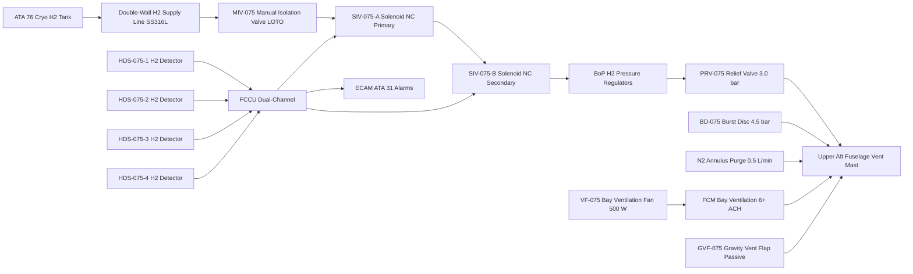
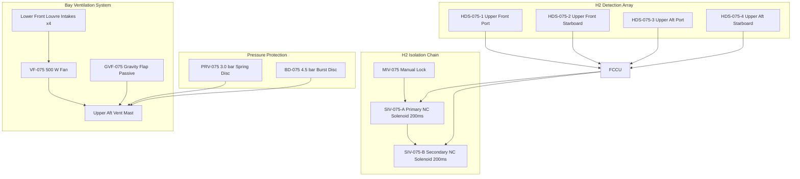

<!-- ──────────────────────────────────────────────────────────────────────────
     QATL-ATLAS-1000-ATLAS-070-079-07-075-050-FUEL-CELL-SAFETY-ISOLATION-AND-VENTING
     ATA 75 · Fuel Cell Safety, Isolation and Venting
     programme-defined aircraft type — ATLAS Register 1000
────────────────────────────────────────────────────────────────────────────── -->

# Fuel Cell Safety, Isolation and Venting

---

## §0 Hyperlink Policy

> All hyperlinks in this document are **relative** (five directory levels: `../../../../../`).
> Absolute URLs are forbidden. Every linked document must exist in the Q+ATLANTIDE repository
> before the link is activated. Broken links are treated as open issues and must be resolved
> before the document is promoted from `DRAFT` to `APPROVED`.

---

## §1 Purpose

This document defines the agnostic ATLAS standard-level architecture context for `Fuel Cell Safety, Isolation and Venting`.

It describes the controlled scope, functions, interfaces, safety considerations, lifecycle traceability, and S1000D/CSDB mapping logic that programme implementations shall instantiate when this node is applicable.

This document is not a programme design baseline. Programme-specific capacities, locations, part numbers, effectivity, operating limits, maintenance references, and data module codes shall be defined only inside the applicable programme implementation branch.
## §2 Applicability

| Applicability Level | Rule |
|---|---|
| Standard taxonomy | Applies to the ATLAS node `075` |
| Programme implementation | Conditional; determined by programme architecture, trade studies, certification basis, and applicability model |
| Product configuration | Defined in the programme-specific configuration baseline |
| Effectivity | Defined in the programme CSDB / applicability layer |
| Non-applicability | Must be explicitly stated in the programme impact-study branch when excluded |
## §3 Functional Description ![DRAFT]

**H2 Supply Isolation**: The H2 supply from ATA 76 cryogenic tanks enters the FCM bay through a double-walled SS316L supply line. The outer annulus carries a small continuous N2 purge flow (0.5 L/min) that would carry any inner-wall H2 leak directly to a safe vent path, preventing accumulation. Dual solenoid isolation valves SIV-075-A (upstream) and SIV-075-B (downstream) are spring-return normally-closed and require active electrical energisation to remain open. Loss of electrical power, FCCU shutdown command, or H2 detection emergency signal causes both SIVs to spring-close within <200 ms, cutting off H2 supply to the FCM stacks. A manual isolation valve MIV-075, accessible from the FCM bay access panel with a quarter-turn lockable handle, provides an additional manual isolation layer for maintenance access.

**H2 Pressure Relief**: Pressure Relief Valve PRV-075 is a spring-loaded disc valve set to open at 3.0 bar gauge on the H2 supply downstream of PR-075-A/B. If a pressure regulator fails in the open position, PRV-075 limits BoP circuit H2 pressure to 3.0 bar, protecting stack anode manifolds rated to 4.0 bar. PRV-075 discharges to the vent mast. A burst disc (BD-075) set at 4.5 bar provides a second-level pressure protection in case PRV-075 fails to open.

**H2 Detection**: Four electrochemical hydrogen detection sensors (HDS-075-1 through HDS-075-4) are mounted at the four upper corners of the FCM bay, positioned near likely leak sources (H2 supply fittings, stack inlet manifolds). Each HDS sensor reports a 4–20 mA analogue signal proportional to 0–100 % LEL H2 concentration to the FCCU sensor interface. The FCCU applies a dual-threshold decision: any sensor >1 % LEL triggers a CAUTION alarm on ECAM and activates increased bay ventilation; any sensor >25 % LEL triggers EMERGENCY shutdown (SIV-075-A/B close, FCCU emergency stop, ECAM red warning, crew advisory).

**Bay Ventilation**: Ventilation fan VF-075 (24 V DC brushless, 500 W) draws air through four louvred intake vents at the lower front of the FCM bay and exhausts through the upper aft fuselage vent mast. At cruise speed, ram air augments forced ventilation achieving ≥12 ACH; on the ground with VF-075 running alone, ≥6 ACH is guaranteed. Ventilation continues automatically whenever aircraft is electrically powered — it cannot be switched off from the flight deck. A backup ventilation path through a passive vent (gravity-actuated flap GVF-075) provides residual natural convection venting even if VF-075 fails.

---

## §4 Functional Breakdown

| ID | Name | Description | Lead Division |
|---|---|---|---|
| F-001 | H2 supply dual isolation valves | SIV-075-A/B spring-return NC solenoids; close <200 ms on de-energise; dual series for positive isolation | Q-AIR |
| F-002 | Manual isolation valve | MIV-075 quarter-turn lockable handle; physical isolation for maintenance LOTO | Q-MECHANICS |
| F-003 | Pressure relief valve | PRV-075 spring-loaded disc; set 3.0 bar gauge; discharge to vent mast; burst disc BD-075 at 4.5 bar | Q-MECHANICS |
| F-004 | H2 detection sensors | 4 × HDS-075 electrochemical sensors; dual threshold 1 % LEL caution / 25 % LEL emergency | Q-AIR |
| F-005 | Bay forced ventilation | VF-075 brushless fan 500 W; ≥6 ACH; continuous when aircraft powered; discharge to upper aft vent mast | Q-AIR |
| F-006 | Passive backup ventilation | GVF-075 gravity-actuated flap vent; natural convection backup if VF-075 fails | Q-AIR |
| F-007 | Double-walled H2 supply line | SS316L double-wall with N2 annulus purge; 0.5 L/min N2 purge to vent mast | Q-MECHANICS |

---

## §5 System Context — Mermaid Diagram

---

## §6 Internal Architecture — Mermaid Diagram

---

## §7 Components and LRUs

| Component | Part Number | Qty | Location | Maintenance Interval | Notes |
|---|---|---|---|---|---|
| Solenoid Isolation Valve SIV-075-A | SIV-075-A | 1 | H2 supply line FCM bay upstream | C-check seat leak and function test | Spring-return NC; close <200 ms; rated 350 bar |
| Solenoid Isolation Valve SIV-075-B | SIV-075-B | 1 | H2 supply line FCM bay downstream | C-check seat leak and function test | Identical to SIV-075-A |
| Manual Isolation Valve MIV-075 | MIV-075 | 1 | H2 supply line bay entry | A-check handle function | Quarter-turn lockable; SS316L; H2 rated |
| Pressure Relief Valve PRV-075 | PRV-075 | 1 | BoP H2 circuit | C-check set pressure verification | 3.0 bar gauge; spring-loaded disc; vent to mast |
| Burst Disc BD-075 | BD-075 | 1 | BoP H2 circuit parallel to PRV | On condition per PRV function | 4.5 bar gauge; single-use; replacement required after activation |
| H2 Detector HDS-075-1/2/3/4 | HDS-075 | 4 | FCM bay 4 upper corners | Calibration ≤12 months per IEC 60079-29-1 | Electrochemical; 4–20 mA; 0–100 % LEL |
| Bay Ventilation Fan VF-075 | VF-075 | 1 | FCM bay lower forward | A-check RPM via BITE | 24 V DC brushless; 500 W; ≥6 ACH on ground |
| Gravity Vent Flap GVF-075 | GVF-075 | 1 | Upper aft FCM bay to vent mast | C-check free movement | Passive spring-loaded; no electrical connection |
| Double-Wall H2 Supply Line | DW-LINE-075 | 1 set | ATA 76 tank to FCM bay SIV | B-check annulus N2 pressure check | SS316L inner; SS316L outer; N2 annulus 0.5 L/min |

---

## §8 Interfaces

| Interface Type | Connected System | Protocol / Medium | Data / Function |
|---|---|---|---|
| H2 supply | ATA 76 H2 cryogenic tanks | SS316L double-wall high-pressure line | H2 fuel at up to 350 bar to SIV-075-A/B |
| Vent mast | Upper aft fuselage vent mast structure | SS316L vent piping | Safe H2 release above aircraft, away from intakes and ignition sources |
| N2 annulus purge | ATA 36 N2 service | SS316L N2 line; 0.5 L/min regulated | Continuous N2 annulus purge of double-wall H2 line |
| H2 detection data | FCCU sensor interface | 4–20 mA analogue to FCCU AI module | HDS-075 concentration signal (0–100 % LEL) at 100 ms |
| ECAM alarms | ATA 31 ECAM | AFDX via FCCU | CAUTION at 1 % LEL; WARNING at 25 % LEL; crew advisory |
| Bay ventilation power | HVDC 270 V bus (ATA 73) | 24 V DC converter | VF-075 fan continuous power |

---

## §9 Operating Modes

| Mode | Trigger | System State | Actions / Consequences |
|---|---|---|---|
| Normal | FCM operating | SIV-075-A/B energised open; VF-075 running; HDS active | H2 supply flowing; bay ventilated; ECAM normal |
| H2 Caution | Any HDS >1 % LEL | SIV remain open; VF-075 at maximum speed | ECAM amber H2 CAUTION; FCCU logs event; crew advisory to prepare for shutdown |
| H2 Emergency | Any HDS >25 % LEL | SIV-075-A/B close <200 ms; FCCU emergency stop; FCPC offline | ECAM red H2 WARNING; FCM isolated; post-shutdown N2 purge sequence initiated |
| Manual isolation | LOTO procedure initiated | MIV-075 turned closed and locked | H2 supply physically isolated; all downstream lines depressurised before access |
| PRV activation | BoP H2 circuit >3.0 bar | PRV-075 opens; H2 vents to vent mast | ECAM advisory; FCCU logs PRV event; maintenance required to identify PR failure |
| BD activation | BoP H2 circuit >4.5 bar | BD-075 ruptures; H2 vents; immediate FCM shutdown | ECAM warning; BD-075 must be replaced before return to service |
| VF-075 failure | Fan fault detected by BITE | GVF-075 passive vent activates; ECAM advisory | Reduced ventilation; FCM may continue at reduced power pending maintenance |

---

## §10 Performance and Budgets ![DRAFT]

| Parameter | Requirement | Target / Design Value | Status |
|---|---|---|---|
| SIV close time | <200 ms on de-energise | <150 ms | ![TBD] |
| HDS-075 detection threshold caution | 1 % LEL (0.04 % v/v H2) | 1 % LEL | ![TBD] |
| HDS-075 detection threshold emergency | 25 % LEL (1.0 % v/v H2) | 25 % LEL | ![TBD] |
| H2 LEL for reference | 4 % v/v in air | 4 % v/v | Fixed physical constant |
| Bay ventilation rate (ground, VF-075 only) | ≥6 ACH | ≥6 ACH | ![TBD] |
| Bay ventilation rate (cruise, ram augmented) | ≥12 ACH | ≥12 ACH target | ![TBD] |
| PRV-075 set pressure | 3.0 bar gauge | 3.0 bar ±0.1 bar | ![TBD] |
| BD-075 set pressure | 4.5 bar gauge | 4.5 bar ±0.2 bar | ![TBD] |
| N2 annulus purge flow | 0.5 L/min continuous | 0.5 L/min | ![TBD] |

---

## §11 Safety, Redundancy and Fault Tolerance

- **Dual-series SIV**: Two series-connected normally-closed SIV-075-A/B provide positive H2 isolation even if one valve fails in the open position, meeting single-failure tolerant design for a Hazardous failure condition.
- **Manual MIV-075 lockout**: Locked quarter-turn valve provides maintenance-safe physical H2 isolation for LOTO that is independent of all electrical systems and FCCU commands.
- **Dual-threshold H2 detection**: 1 % LEL caution provides advance warning well before 25 % LEL emergency action threshold, and both are far below the 100 % LEL (4 % v/v) flammable concentration — providing three safety margins.
- **Continuous bay ventilation**: VF-075 cannot be switched off from flight deck; always-on operation ensures a slow H2 leak rate that exceeds vent capacity would be detected by HDS before reaching flammable concentration.
- **PRV + burst disc redundancy**: Primary relief at 3.0 bar plus secondary burst disc at 4.5 bar provides two independent pressure relief layers, preventing BoP circuit structural over-pressure from a regulator jam-open fault.
- **Vent mast location**: Upper aft fuselage vent mast discharge is away from all engine inlets, APU inlet, and ground personnel areas, preventing H2 from reaching ignition sources or enclosed areas where it could accumulate.

---

## §12 Maintenance and Diagnostics

| Task | Interval | Access | Special Tools |
|---|---|---|---|
| HDS-075 calibration (4 sensors) | ≤12 months (IEC 60079-29-1) | FCM bay upper corners | H2/N2 calibration gas kit PN CALIB-HDS-075 |
| SIV-075-A/B seat leak test and close time | C-check | H2 LOTO; N2 pressure test rig | N2 Purge Cart PN N2PC-GSE-075; timer |
| PRV-075 set pressure bench test | C-check | Remove from aircraft to test bench | Hydraulic test bench PN HTB-GSE-075 |
| BD-075 visual inspection (no activation) | C-check | FCM bay | Visual — check for deformation |
| BD-075 replacement | On condition after PRV activation | FCM bay H2 LOTO | SS316L burst disc PN BD-075-DISC |
| VF-075 fan RPM and power check | A-check | BITE parameter download + audible | CMS GSE Terminal PN CMS-GSE-TRM |
| Double-wall H2 line annulus N2 pressure test | B-check | H2 LOTO; connect N2 to annulus port | N2 Pressure Test Kit PN N2PT-GSE-075 |
| MIV-075 handle smooth operation check | A-check | FCM bay access panel | Visual + manual operation |

---

## §13 Footprint

| Footprint Type | Parameter | Value | Notes |
|---|---|---|---|
| SIV-075-A/B power draw | Energised open | ~10 W each | Spring-return; power to hold open |
| VF-075 power draw | Continuous | 500 W | 24 V DC from converter on HVDC bus |
| N2 annulus purge consumption | Continuous flight | ~0.7 kg/flight (estimated) | From ATA 36 N2 service |
| Vent mast structural load | PRV/BD discharge | TBD | Transient impulse load at PRV open |
| HDS sensor locations | 4 × FCM bay corners | Upper corners 300 mm from ceiling | Per IEC 60079-29-1 guidance for H2 lighter than air |
| Double-wall line routing | H2 supply routing | TBD | Rear fuselage; routed away from electrical buses |

---

## §14 Safety and Certification References ![DRAFT]

| Standard / Document | Title | Issuing Body | Applicability |
|---|---|---|---|
| EASA CS-25 §25.981 | Fuel tank ignition prevention | EASA | H2 fuel system safety |
| EASA CS-25 §25.1183 | Flammable fluid lines and fittings | EASA | H2 double-wall piping |
| SAE AS6858 | Airworthiness Guidelines for PEMFC Systems | SAE International | H2 safety architecture |
| IEC 60079-29-1 | Explosive atmospheres — Gas detectors — Performance | IEC | HDS-075 calibration and performance |
| IEC 60079-10-1 | Explosive atmospheres — Classification of areas | IEC | FCM bay H2 hazardous area classification |
| NFPA 2 | Hydrogen Technologies Code | NFPA | General H2 safety reference |
| DO-160G | Environmental Conditions for Airborne Equipment | RTCA | All safety LRUs qualification |

---

## §15 V&V Approach ![TBD]

| Phase | Method | Acceptance Criterion | Status |
|---|---|---|---|
| Analysis | FMEA of H2 isolation chain; FHA of H2 release scenarios | All single failures identified; no single failure leads to Catastrophic | ![TBD] |
| SIV bench test | Close time measurement; seat leak test at 350 bar; 10,000 cycle endurance | Close <150 ms; leak <1 scc/min at 350 bar; endurance pass | ![TBD] |
| HDS-075 calibration and response test | Calibrated H2/N2 gas injection; response time measurement | Detection at 1 % LEL within 10 s; 25 % LEL within 5 s | ![TBD] |
| Bay ventilation test (ground) | FCM bay ACH measurement with VF-075 at rated speed | ≥6 ACH confirmed | ![TBD] |
| Integration H2 leak simulation | Controlled H2 leak into FCM bay; HDS response; SIV close | ECAM alarms correct; SIV close within 200 ms | ![TBD] |
| Certification | CS-25 H2 system airworthiness compliance demonstration | CS-25 §25.981 and §25.1183 compliance confirmed | ![TBD] |

---

## §16 Glossary

| Term | Definition |
|---|---|
| SIV-075-A/B | Solenoid Isolation Valve — dual series spring-return normally-closed H2 supply isolation valves |
| MIV-075 | Manual Isolation Valve — lockable quarter-turn valve for maintenance H2 LOTO |
| PRV-075 | Pressure Relief Valve — 3.0 bar spring-loaded disc valve protecting BoP H2 circuit |
| BD-075 | Burst Disc — 4.5 bar single-use secondary pressure relief device |
| HDS-075 | Hydrogen Detection Sensor — electrochemical 4–20 mA sensor; 0–100 % LEL range |
| VF-075 | Ventilation Fan — 500 W 24 V DC brushless bay ventilation fan; always-on |
| GVF-075 | Gravity Vent Flap — passive natural convection backup vent for FCM bay |
| LEL | Lower Explosive Limit — H2 4 % v/v in air (100 % LEL); detection at 1 % (0.04 % v/v) and 25 % (1 % v/v) |
| LFL | Lower Flammable Limit — equivalent to LEL for H2 in air |
| LOTO | Lockout/Tagout — safety isolation procedure; requires MIV-075 closed and locked |
| ACH | Air Changes per Hour — volumetric measure of bay ventilation rate |
| Vent mast | Upper aft fuselage exhaust mast for safe H2 venting away from ignition sources |

---

## §17 Open Issues

| ID | Description | Owner | Target |
|---|---|---|---|
| OI-075-050-001 | Complete FMEA for H2 isolation system including SIV-075-A/B common-cause failure modes | Q-AIR / Safety | 2027-Q1 |
| OI-075-050-002 | Validate vent mast location with aerodynamics for all flight envelope conditions (no H2 re-ingestion) | Q-AIR | 2027-Q1 |
| OI-075-050-003 | Confirm HDS-075 electrochemical sensor type for cryogenic H2 temperature range in FCM bay | Q-AIR | 2026-Q4 |
| OI-075-050-004 | Finalise FCM bay H2 area classification (Zone 1 / Zone 2) per IEC 60079-10-1 | Q-MECHANICS | 2026-Q4 |

---

## §18 Status Legend

| Badge | Meaning |
|---|---|
| `![DRAFT]` | Section is drafted but not yet reviewed |
| `![TBD]` | Content not yet started — to be defined |
| `![To Be Completed]` | Partially complete — needs additional content |
| `![APPROVED]` | Reviewed and formally approved |

---

## §19 Related Documents (Siblings in this Subsection)

- [075-000](./075-000-Fuel-Cell-Integration-General.md)
- [075-010](./075-010-Fuel-Cell-Stack-Architecture.md)
- [075-020](./075-020-Balance-of-Plant-Air-Hydrogen-and-Cooling.md)
- [075-030](./075-030-Fuel-Cell-Power-Conditioning.md)
- [075-040](./075-040-Water-Management-and-Purge-Interfaces.md)
- [075-060](./075-060-Fuel-Cell-Control-and-Operating-Modes.md)
- [075-070](./075-070-Fuel-Cell-Service-Test-and-Maintenance.md)
- [075-080](./075-080-Fuel-Cell-Monitoring-Diagnostics-and-Control-Interfaces.md)
- [075-090](./075-090-S1000D-CSDB-Mapping-and-Traceability.md)

---

## §20 Change Log

| Rev | Date | Author | Description |
|---|---|---|---|
| 0.1 | 2026-05-12 | @copilot | Initial DRAFT — H2 safety, isolation, detection and venting architecture |
