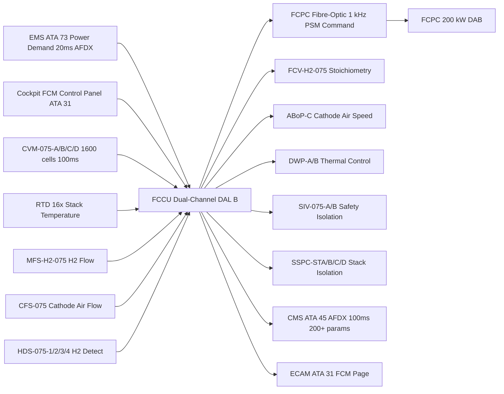
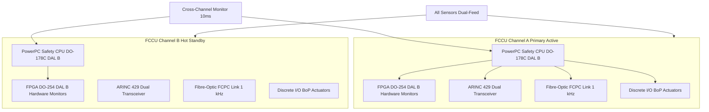

<!-- ──────────────────────────────────────────────────────────────────────────
     QATL-ATLAS-1000-ATLAS-070-079-07-075-060-FUEL-CELL-CONTROL-AND-OPERATING-MODES
     ATA 75 · Fuel Cell Control and Operating Modes
     programme-defined aircraft type — ATLAS Register 1000
────────────────────────────────────────────────────────────────────────────── -->

# Fuel Cell Control and Operating Modes

---

## §0 Hyperlink Policy

> All hyperlinks in this document are **relative** (five directory levels: `../../../../../`).
> Absolute URLs are forbidden. Every linked document must exist in the Q+ATLANTIDE repository
> before the link is activated. Broken links are treated as open issues and must be resolved
> before the document is promoted from `DRAFT` to `APPROVED`.

---

## §1 Purpose

This document defines the agnostic ATLAS standard-level architecture context for `Fuel Cell Control and Operating Modes`.

It describes the controlled scope, functions, interfaces, safety considerations, lifecycle traceability, and S1000D/CSDB mapping logic that programme implementations shall instantiate when this node is applicable.

This document is not a programme design baseline. Programme-specific capacities, locations, part numbers, effectivity, operating limits, maintenance references, and data module codes shall be defined only inside the applicable programme implementation branch.
## §2 Applicability

| Applicability Level | Rule |
|---|---|
| Standard taxonomy | Applies to the ATLAS node `075` |
| Programme implementation | Conditional; determined by programme architecture, trade studies, certification basis, and applicability model |
| Product configuration | Defined in the programme-specific configuration baseline |
| Effectivity | Defined in the programme CSDB / applicability layer |
| Non-applicability | Must be explicitly stated in the programme impact-study branch when excluded |
## §3 Functional Description ![DRAFT]

**FCCU Hardware Architecture**: The FCCU is a 3U VPX format dual-channel controller housed in the EE bay. Channel A is the primary active channel; Channel B is in hot standby with continuous cross-channel monitoring at 10 ms intervals. Both channels receive all sensor inputs in parallel. Channel B monitors Channel A outputs; discrepancy >threshold for >50 ms causes Channel B to assume control and log a Channel A fault. Each channel contains a PowerPC safety-processor running FCCU application software (DO-178C DAL B), a DO-254 DAL B FPGA implementing hardware safety monitors (OCP, CVM threshold, temperature limits), dual ARINC 429 transceivers, fibre-optic FCPC link, and discrete I/O for BoP actuators.

**Control Algorithm Hierarchy**: The FCCU implements four nested control loops: (1) Power Setpoint Loop — EMS requests power P_req (0–200 kW); FCCU computes required phase-shift angle φ for FCPC using power model; output current ramp ≤50 A/s; (2) Stoichiometry Loop — measures H2 mass flow via MFS-H2-075 and cathode air flow via CFS-075; adjusts FCV-H2-075 and ABoP-C speed to maintain λH2=1.3 and λair=2.0; (3) Thermal Loop — measures all 16 stack RTDs; uses Model-Predictive Control (MPC) algorithm to maintain 70 °C ±5 °C by varying DWP speed and adjusting FCPC setpoint by ±10 % for thermal load-following; (4) CVM Supervision Loop — scans all 1,600 cell voltages (4 stacks × 400 cells) at 100 ms; identifies cell voltage <0.5 V and sends stack isolation command to corresponding SSPC.

**FCM State Machine**: The FCCU implements a nine-state finite state machine: POWER-OFF → INITIALISE → PRE-START PURGE → WARM-UP → RAMP-UP → NORMAL POWER → DEGRADED → RAMP-DOWN → SHUTDOWN. State transitions are governed by sensor measurements, timeout conditions, and external commands from EMS and cockpit.

---

## §4 Functional Breakdown

| ID | Name | Description | Lead Division |
|---|---|---|---|
| F-001 | FCCU dual-channel hardware | 3U VPX; PowerPC DO-178C DAL B + FPGA DO-254 DAL B; Channel A/B hot standby; 10 ms cross-check | Q-HPC |
| F-002 | Power setpoint loop | EMS 20 ms AFDX demand; FCPC phase-shift command 1 kHz; output ramp ≤50 A/s | Q-HPC |
| F-003 | Stoichiometry control loop | λH2=1.3 via FCV-H2-075; λair=2.0 via ABoP-C speed; closed-loop with MFS-H2-075 and CFS-075 | Q-HPC |
| F-004 | Thermal MPC loop | 16-RTD measurement; MPC algorithm; DWP speed + FCPC ±10 % setpoint adjustment; 70 °C ±5 °C | Q-HPC |
| F-005 | CVM supervision loop | 1,600 cell scan at 100 ms; cell <0.5 V → stack SSPC isolation command; trend analysis | Q-HPC |
| F-006 | FCM state machine | 9-state FSM: POWER-OFF through SHUTDOWN; state transitions guarded by sensor and timeout conditions | Q-HPC |
| F-007 | FDI fault detection and isolation | Hardware and software fault monitors; FDI isolation of faulty sensors and actuators; BITE log | Q-HPC |
| F-008 | AFDX health reporting | FCCU transmits 200+ parameters to CMS via AFDX ARINC 664 P7 at 100 ms | Q-HPC |

---

## §5 System Context — Mermaid Diagram

---

## §6 Internal Architecture — Mermaid Diagram

---

## §7 Components and LRUs

| Component | Part Number | Qty | Location | Maintenance Interval | Notes |
|---|---|---|---|---|---|
| FCCU Fuel Cell Control Unit | FCCU-075 | 1 | EE bay adjacent to FCM | SW update per SB | 3U VPX; dual-channel; DO-178C DAL B / DO-254 DAL B |
| FCCU Power Supply Module | FCCU-PSM-075 | 1 | EE bay with FCCU | C-check output voltage test | 28 V DC to FCCU internal supplies |
| FCCU ARINC 429 Data Concentrator | FCCU-ADC-075 | 1 | Internal to FCCU | SW update per SB | Aggregates all ARINC 429 sensor inputs |

---

## §8 Interfaces

| Interface Type | Connected System | Protocol / Medium | Data / Function |
|---|---|---|---|
| EMS power demand | ATA 73 Energy Management System | AFDX ARINC 664 P7 at 20 ms | P_req 0–200 kW demand command to FCCU |
| FCPC control | FCPC DAB converter | Fibre-optic serial at 1 kHz | PSM phase-shift command and SSPC-FC-01 command |
| BoP actuator commands | ABoP-C, FCV-H2-075, DWP-A/B | Discrete I/O + ARINC 429 | Speed and position commands to BoP actuators |
| Safety actuator commands | SIV-075-A/B, SSPC-STA/B/C/D | Discrete hardwired outputs | H2 isolation and stack isolation commands |
| Sensor data inputs | All FCM sensors (16 RTDs, 4 CVMs, 4 HDS, MFS, CFS, LVS, GCA) | ARINC 429 + 4–20 mA analogue | Comprehensive FCM state measurement at 100 ms |
| CMS health data | ATA 45 CMS | AFDX ARINC 664 P7 at 100 ms | 200+ FCM parameters, BITE faults, trend data |
| ECAM indication | ATA 31 ECAM | AFDX | FCM synoptic page, caution/warning messages |

---

## §9 Operating Modes — State Machine

| State | Entry Condition | Exit Condition | FCCU Actions |
|---|---|---|---|
| POWER-OFF | Aircraft de-powered | Aircraft powered → INITIALISE | All outputs de-energised; SIV closed |
| INITIALISE | Aircraft powered | Self-test pass → PRE-START PURGE | FCCU BITE self-test; sensor plausibility; channel sync |
| PRE-START PURGE | EMS FCM start command | GCA-075 O2 <1 % v/v for 5 s → WARM-UP | PV-ANODE-075 open; N2 purge for 30 s; H2 lines purged |
| WARM-UP | Pre-start purge complete | Stack temp ≥60 °C → RAMP-UP | SIV open; low H2 and air flow; DWP-A running; ABoP-C low speed |
| RAMP-UP | Stack temp ≥60 °C | Stack cluster ≥100 V → NORMAL POWER | FCPC connects; output ramps at ≤50 A/s; stoichiometry control active |
| NORMAL POWER | Full power available | EMS ramp-down / fault → RAMP-DOWN or DEGRADED | Full 200 kW; all control loops active; CVM and thermal monitoring |
| DEGRADED | Stack isolation by CVM or thermal fault | EMS ramp-down → RAMP-DOWN; all stacks failed → SHUTDOWN | Reduced power ceiling; ECAM amber; remaining stacks controlled |
| RAMP-DOWN | EMS power release or FCM shutdown request | Power =0 → SHUTDOWN | FCPC phase-shift reduces to zero; output current ramps down |
| SHUTDOWN | FCPC output = 0 | Stack temp <40 °C and H2 <1 % → POWER-OFF | N2 anode purge; DWP-A post-shutdown cooling; SIV close |

---

## §10 Performance and Budgets ![DRAFT]

| Parameter | Requirement | Target / Design Value | Status |
|---|---|---|---|
| FCCU channel switchover time | <50 ms on channel fault | <20 ms | ![TBD] |
| Power setpoint response time | <500 ms from EMS demand to 90 % power | <400 ms | ![TBD] |
| Stoichiometry control accuracy | λH2 = 1.3 ±0.05 at all loads | ±0.03 | ![TBD] |
| Thermal control accuracy | 70 °C ±5 °C | ±3 °C MPC | ![TBD] |
| CVM scan cycle time | ≤100 ms for all 1,600 cells | 100 ms | ![TBD] |
| State machine transition time | Pre-start to Normal Power | ≤5 min from −20 °C | ![TBD] |
| FCCU MTBF | ≥50,000 FH | TBD per OEM data | ![TBD] |
| Software coverage (DO-178C DAL B) | MC/DC coverage for all critical paths | 100 % MC/DC | ![TBD] |

---

## §11 Safety, Redundancy and Fault Tolerance

- **Dual-channel hot standby**: Channel B continuously monitors Channel A; automatic switchover in <20 ms prevents single CPU failure from causing FCM shutdown, meeting DO-178C DAL B availability requirements.
- **FPGA hardware monitors**: FPGA implements independent hardware-level CVM threshold, OCP, and temperature limit monitors that operate even if CPU software fails, providing a safety backstop independent of software execution.
- **CVM cell isolation priority**: CVM cell-fault isolation command is implemented in FPGA hardware monitor with direct path to SSPC output, bypassing CPU, ensuring <100 ms cell isolation even under CPU load.
- **EMS demand limiting**: FCCU enforces maximum demand of 200 kW regardless of EMS command, preventing stack over-current from EMS software fault.
- **Sensor plausibility checking**: FCCU performs cross-sensor plausibility checks (e.g., MFS-H2-075 vs FCPC input current) to detect single sensor failures before acting on faulty data, preventing false shutdown.
- **Fail-safe state machine**: All FCCU state machine transitions default to SHUTDOWN on undefined state or channel disagreement, ensuring a detected FCCU fault leads to safe FCM shutdown rather than uncontrolled operation.

---

## §12 Maintenance and Diagnostics

| Task | Interval | Access | Special Tools |
|---|---|---|---|
| FCCU BITE log download | A-check | FCCU ARINC 429 GSE port | CMS GSE Terminal PN CMS-GSE-TRM |
| FCCU software update | Per SB | EE bay FCCU maintenance port | FCCU Software Load Tool PN SLT-FCCU-075 |
| FCCU channel switchover test | C-check | FCCU GSE command | FCCU GSE console; verify Channel B assumes control |
| FCCU power supply output voltage check | C-check | EE bay FCCU-PSM-075 test points | Calibrated DMM |
| Full state machine cycle test (ground) | D-check | FCM full-power ground test with H2 | FCCU GSE console; CMS GSE Terminal |
| ARINC 429 data bus integrity test | C-check | EE bay ARINC 429 GSE port | ARINC 429 Analyser PN AA-GSE-075 |

---

## §13 Footprint

| Footprint Type | Parameter | Value | Notes |
|---|---|---|---|
| FCCU unit dimensions | 3U VPX module | Standard 3U VPX | EE bay rack slot |
| FCCU mass | Controller unit | ~3 kg estimated | TBD from final design |
| FCCU power draw | Internal supply | ~50 W | From FCCU-PSM-075 28 V DC input |
| AFDX bandwidth | FCCU to CMS | ~2 Mbit/s | 200+ params at 100 ms |
| FCPC fibre-optic link | Single fibre | 1 kHz | Per-channel fibre to FCPC |
| EE bay location | FCM bay adjacent | EE bay aft section | Co-located with FCM bay access |

---

## §14 Safety and Certification References ![DRAFT]

| Standard / Document | Title | Issuing Body | Applicability |
|---|---|---|---|
| DO-178C | Software Considerations in Airborne Systems | RTCA | FCCU software DAL B |
| DO-254 | Design Assurance Guidance for Airborne Electronic Hardware | RTCA | FCCU FPGA hardware DAL B |
| DO-160G | Environmental Conditions for Airborne Equipment | RTCA | FCCU environmental qualification |
| SAE ARP4754A | Guidelines for Development of Civil Aircraft and Systems | SAE International | FCCU system development assurance |
| SAE ARP4761 | Guidelines and Methods for Safety Assessment | SAE International | FCCU FHA/FMEA/FTA methodology |
| ARINC 429 | Digital Information Transfer System | ARINC | FCCU sensor data bus standard |
| ARINC 664 P7 | Aircraft Data Network — AFDX | ARINC | FCCU to CMS and EMS data network |

---

## §15 V&V Approach ![TBD]

| Phase | Method | Acceptance Criterion | Status |
|---|---|---|---|
| Software V&V | DO-178C DAL B STRVP; MC/DC coverage analysis | 100 % MC/DC coverage for critical paths | ![TBD] |
| Hardware V&V | DO-254 DAL B design verification; FPGA functional test | All hardware monitors functional per DO-254 | ![TBD] |
| FCCU HILS | Hardware-in-the-loop simulation with FCM plant model | All state machine transitions verified; control accuracy confirmed | ![TBD] |
| Channel switchover test | Inject Channel A fault; measure Channel B switchover time | <20 ms switchover; no FCM shutdown during channel switch | ![TBD] |
| Integration test | FCCU connected to full FCM; all modes demonstrated | All 9 state machine states demonstrated; no spurious transitions | ![TBD] |

---

## §16 Glossary

| Term | Definition |
|---|---|
| FCCU | Fuel Cell Control Unit — dual-channel DO-178C DAL B/DO-254 DAL B FCM controller |
| DAL B | Design Assurance Level B — failure probability ≤10⁻⁷/h; requires MC/DC software coverage |
| MPC | Model-Predictive Control — thermal control algorithm predicting stack temperature response to DWP speed changes |
| PSM | Phase-Shift Modulation — FCPC power control method commanded by FCCU at 1 kHz via fibre-optic |
| λH2 | Hydrogen stoichiometry ratio — H2 supplied / H2 consumed at rated electrochemical reaction |
| λair | Air stoichiometry ratio — cathode air supplied / O2 consumed at rated electrochemical reaction |
| FSM | Finite State Machine — formal FCCU operating mode controller with 9 defined states |
| FDI | Fault Detection and Isolation — FCCU algorithm identifying and isolating failed sensors and actuators |
| MC/DC | Modified Condition/Decision Coverage — DO-178C DAL B software test coverage criterion |
| HILS | Hardware-In-the-Loop Simulation — test environment connecting real FCCU hardware to simulated FCM plant model |
| VPX | VITA 46 high-speed connector standard for avionics computing modules (3U form factor) |
| EMS | Energy Management System — ATA 73 aircraft-level power manager commanding FCCU |

---

## §17 Open Issues

| ID | Description | Owner | Target |
|---|---|---|---|
| OI-075-060-001 | Complete FCCU DO-178C DAL B software development plan and tool qualification approach | Q-HPC | 2026-Q4 |
| OI-075-060-002 | Finalise MPC thermal control model parameters from stack OEM thermal characterisation data | Q-HPC | 2027-Q1 |
| OI-075-060-003 | Define FCCU channel switchover test procedure with FCPC and safety impact assessment | Q-HPC / Q-AIR | 2027-Q1 |

---

## §18 Status Legend

| Badge | Meaning |
|---|---|
| `![DRAFT]` | Section is drafted but not yet reviewed |
| `![TBD]` | Content not yet started — to be defined |
| `![To Be Completed]` | Partially complete — needs additional content |
| `![APPROVED]` | Reviewed and formally approved |

---

## §19 Related Documents (Siblings in this Subsection)

- [075-000](./075-000-Fuel-Cell-Integration-General.md)
- [075-010](./075-010-Fuel-Cell-Stack-Architecture.md)
- [075-020](./075-020-Balance-of-Plant-Air-Hydrogen-and-Cooling.md)
- [075-030](./075-030-Fuel-Cell-Power-Conditioning.md)
- [075-040](./075-040-Water-Management-and-Purge-Interfaces.md)
- [075-050](./075-050-Fuel-Cell-Safety-Isolation-and-Venting.md)
- [075-070](./075-070-Fuel-Cell-Service-Test-and-Maintenance.md)
- [075-080](./075-080-Fuel-Cell-Monitoring-Diagnostics-and-Control-Interfaces.md)
- [075-090](./075-090-S1000D-CSDB-Mapping-and-Traceability.md)

---

## §20 Change Log

| Rev | Date | Author | Description |
|---|---|---|---|
| 0.1 | 2026-05-12 | @copilot | Initial DRAFT — FCCU architecture, control algorithms and FCM operating mode state machine |
