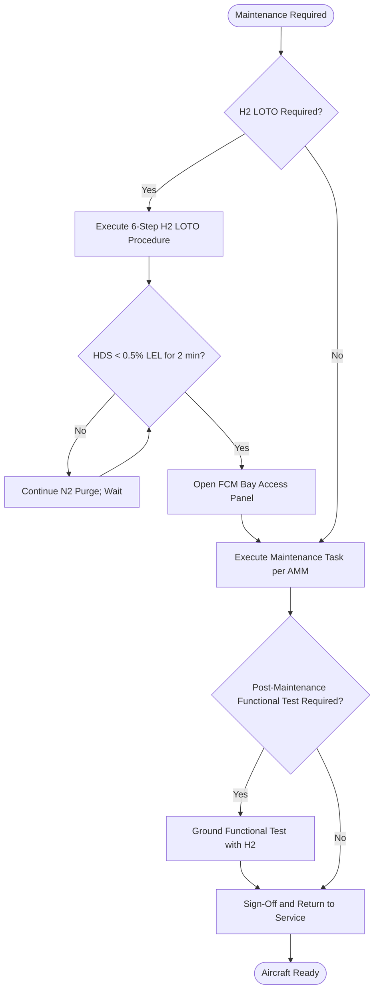

<!-- ──────────────────────────────────────────────────────────────────────────
     QATL-ATLAS-1000-ATLAS-070-079-07-075-070-FUEL-CELL-SERVICE-TEST-AND-MAINTENANCE
     ATA 75 · Fuel Cell Service, Test and Maintenance
     programme-defined aircraft type — ATLAS Register 1000
────────────────────────────────────────────────────────────────────────────── -->

# Fuel Cell Service, Test and Maintenance

---

## §0 Hyperlink Policy

> All hyperlinks in this document are **relative** (five directory levels: `../../../../../`).
> Absolute URLs are forbidden. Every linked document must exist in the Q+ATLANTIDE repository
> before the link is activated. Broken links are treated as open issues and must be resolved
> before the document is promoted from `DRAFT` to `APPROVED`.

---

## §1 Purpose

This document defines the agnostic ATLAS standard-level architecture context for `Fuel Cell Service, Test and Maintenance`.

It describes the controlled scope, functions, interfaces, safety considerations, lifecycle traceability, and S1000D/CSDB mapping logic that programme implementations shall instantiate when this node is applicable.

This document is not a programme design baseline. Programme-specific capacities, locations, part numbers, effectivity, operating limits, maintenance references, and data module codes shall be defined only inside the applicable programme implementation branch.
## §2 Applicability

| Applicability Level | Rule |
|---|---|
| Standard taxonomy | Applies to the ATLAS node `075` |
| Programme implementation | Conditional; determined by programme architecture, trade studies, certification basis, and applicability model |
| Product configuration | Defined in the programme-specific configuration baseline |
| Effectivity | Defined in the programme CSDB / applicability layer |
| Non-applicability | Must be explicitly stated in the programme impact-study branch when excluded |
## §3 Functional Description ![DRAFT]

**Safety Prerequisites**: Before any FCM maintenance task requiring bay access, the technician must: (1) confirm aircraft is de-powered or on ground power with FCM isolated from HVDC bus; (2) close and lock MIV-075; (3) verify SIV-075-A/B closed state via FCCU GSE; (4) connect N2 purge cart to NPM-075 and perform 60 s anode purge; (5) verify HDS-075 sensors all <0.5 % LEL for ≥2 min after purge; (6) attach LOTO tags to MIV-075, electrical isolation panel, and H2 service port; (7) don H2 personal protective equipment (anti-static PPE, face shield). Only after all six steps are confirmed may the FCM bay access panel be opened.

**A-Check Tasks (≤500 FH)**: BITE log download via FCCU ARINC 429 GSE port; coolant pH and conductivity spot check; DI water level and quality check; H2 particulate filter PF-H2-075 element replacement; HDS-075 sensor functional alarm test; VF-075 fan RPM check via BITE; WA-075 accumulator drain and visual; N2 annulus pressure presence check; MIV-075 handle function check; external visual of FCM bay access panels for damage/corrosion.

**C-Check Tasks (≤6,000 FH)**: All A-check tasks plus: SIV-075-A/B seat leak test and close time measurement; FCPC efficiency test at 50 % and 100 % load; stack CVM balance check (all cells ≥0.5 V at 50 % load); coolant pump DWP-A/B mechanical seal check; WDV-075 solenoid open/close test; GCA-075 gas analyser calibration; PRV-075 set pressure bench test (remove to bench); H2 line N2 pressure decay test; FCCU channel switchover test; full FCM functional run on ground with H2 using GSE.

**D-Check Tasks (≤20,000 FH / OEM MEA Life Limit)**: All prior check tasks plus: MEA replacement in all four stacks (SA-075-A/B/C/D) requiring complete stack disassembly with H2 LOTO, calibrated torque application to tie rods, and post-replacement performance verification run. Membrane humidifier MH-075 membrane replacement. Full BoP overhaul including ABoP-C bearing replacement. Full system post-maintenance functional test including all FCM modes.

---

## §4 Functional Breakdown

| ID | Name | Description | Lead Division |
|---|---|---|---|
| F-001 | H2 LOTO safety procedure | 6-step mandatory pre-access safety procedure: MIV close, SIV verify, N2 purge, HDS confirm, LOTO tags, PPE | Q-AIR |
| F-002 | A-check service tasks | BITE log, filter, sensor test, visual, accumulator service (~4 h per aircraft) | Q-MECHANICS |
| F-003 | C-check detailed tasks | SIV test, FCPC efficiency, CVM balance, pump seals, PRV test, H2 line decay, FCCU test (~16 h per aircraft) | Q-MECHANICS |
| F-004 | D-check overhaul | MEA replacement all 4 stacks, humidifier membrane, BoP overhaul (~80 h per aircraft) | Q-MECHANICS |
| F-005 | On-condition maintenance | BITE-triggered work orders; ECAM advisory-driven tasks; CVM trend degradation action | Q-HPC |
| F-006 | Post-maintenance functional test | Ground functional test with H2; all FCM modes; CVM balance; FCPC efficiency verified | Q-GREENTECH |
| F-007 | Special tooling and GSE | H2 LOTO kit; N2 purge cart; FCPC power analyser; CVM interface unit; stack torque wrench set | Q-MECHANICS |

---

## §5 System Context — Mermaid Diagram

---

## §6 Internal Architecture — Mermaid Diagram

---

## §7 Components and LRUs

| Component | Part Number | Qty | Location | Maintenance Interval | Notes |
|---|---|---|---|---|---|
| H2 LOTO Kit | LOTO-H2-075 | 1 per base | MRO stores | Inspect annually | Includes lock, tags, anti-static PPE, face shield |
| N2 Purge Cart | N2PC-GSE-075 | 1 per base | MRO stores | Annual recertification | Portable; N2 service connection; 0–350 bar rated |
| CVM Interface Unit | CVMIU-GSE-075 | 1 per base | MRO stores | Annual calibration | 400-ch FCCU GSE interface for CVM balance check |
| FCPC Power Analyser | PAR-GSE-075 | 1 per base | MRO stores | Annual calibration | 200 kW rated; calibrated load bank interface |
| Stack Torque Wrench Set | TWS-ST-075 | 1 per base | MRO stores | Annual calibration | 4–5 Nm range; certified for H2 service environment |
| DI Conductivity Meter | DICM-GSE-075 | 1 per base | MRO stores | Annual calibration | Handheld; 0–100 µS/cm range |
| FCCU Software Load Tool | SLT-FCCU-075 | 1 per region | MRO stores | Per SB | DO-178C DAL B SW load capability |
| Stack MEA Replacement Kit | MEA-KIT-075 | 4 per D-check | MRO stores | Ordered per D-check | Complete MEA set for all 4 stacks; OEM packaged |

---

## §8 Interfaces

| Interface Type | Connected System | Protocol / Medium | Data / Function |
|---|---|---|---|
| BITE data download | FCCU ARINC 429 GSE port | ARINC 429 via GSE terminal | Fault log, trend data, CVM history |
| N2 purge connection | NPM-075 N2 purge manifold | Standard N2 service hose fitting | N2 purge for pre-access and post-task H2 clearing |
| FCPC load test | FCPC output terminals | Calibrated load bank PN PAR-GSE-075 | FCPC efficiency measurement at 50 % and 100 % load |
| Coolant sample port | DI water circuit drain port | Sample cup or syringe | Coolant pH, conductivity, colour |
| H2 service port | ATA 76 H2 supply to FCM | High-pressure H2 coupling | Ground test H2 supply |
| CMS integration | ATA 45 CMS | AFDX | Real-time performance monitoring during ground test |

---

## §9 Operating Modes

| Mode | Trigger | System State | Actions / Consequences |
|---|---|---|---|
| Ground maintenance — no H2 | Aircraft on ground; FCM isolated | FCM de-energised; MIV-075 closed; no H2 | Bay access allowed without LOTO after HDS confirm |
| Ground maintenance — H2 LOTO | FCM maintenance requiring H2 line access | H2 LOTO complete; N2 purged; HDS <0.5 % LEL | Bay access allowed per LOTO procedure |
| Ground functional test with H2 | Post-maintenance functional test | FCM connected to H2; FCCU active; GSE monitoring | All FCM modes cycled; CVM and FCPC verified |
| On-condition maintenance | BITE fault or ECAM advisory | Aircraft returned to hangar for specific task | Task per maintenance manual; post-task BITE clear verification |

---

## §10 Performance and Budgets ![DRAFT]

| Parameter | Requirement | Target / Design Value | Status |
|---|---|---|---|
| A-check elapsed time | ≤4 h per aircraft | 4 h | ![TBD] |
| C-check elapsed time | ≤16 h per aircraft | 16 h | ![TBD] |
| D-check elapsed time (FCM tasks) | ≤80 h per aircraft | 80 h | ![TBD] |
| MEA service life | ≥10,000 h / 20,000 FH | TBD per OEM data | ![TBD] |
| LOTO procedure time | ≤30 min (6-step) | 20 min typical | ![TBD] |
| Post-maintenance ground test time | ≤2 h | 90 min estimated | ![TBD] |

---

## §11 Safety, Redundancy and Fault Tolerance

- **H2 LOTO is mandatory**: No exceptions to the 6-step LOTO procedure are permitted; all steps must be signed off in the aircraft maintenance record before bay access.
- **Dual HDS confirmation for bay entry**: Bay access is gated on both the FCCU ARINC 429 HDS reading <0.5 % LEL AND an independent handheld H2 detector check by the second maintenance technician.
- **Two-person rule for H2 tasks**: All FCM maintenance tasks requiring H2 LOTO must be performed with a minimum of two qualified technicians; one-person FCM access is prohibited.
- **MEA handling**: MEAs contain platinum catalyst and Nafion membrane; must be handled in clean gloves; must not be creased or compressed outside the stack; disposed of per OEM instructions (platinum recovery programme).
- **Coolant DI purity**: Contamination of DI water circuit with tap water or non-deionised water during maintenance will cause conductivity spike, triggering FCCU advisory at next operation; only OEM-approved DI water (≤1 µS/cm) must be used during top-up.
- **Post-maintenance functional test required**: Any C-check or deeper task on the H2 supply, stack, FCPC, or FCCU requires a ground functional test with H2 before return to service; BITE log must show no new faults after test.

---

## §12 Maintenance and Diagnostics

| Task | Interval | Access | Special Tools |
|---|---|---|---|
| All maintenance tasks performed per this document | Various | As specified per task | As specified per task |
| BITE log review and anomaly action | A-check | FCCU GSE port | CMS GSE Terminal PN CMS-GSE-TRM |
| CVM trend analysis (monthly rolling) | Monthly (via CMS) | CMS ground station | CMS trend analysis software |
| Post-D-check performance test | D-check | Ground test facility | Full GSE suite; H2 supply |

---

## §13 Footprint

| Footprint Type | Parameter | Value | Notes |
|---|---|---|---|
| FCM bay access area | Clearance required per task | ≥2.0 m × 1.5 m working space | Rear fuselage bay |
| MEA kit volume | Per D-check set (4 stacks) | ~0.5 m³ estimated | OEM crated delivery |
| N2 purge cart footprint | Portable GSE | ~0.5 m × 0.8 m | Ground service vehicle access required |
| FCPC load bank footprint | C-check test | ~1.0 m × 0.5 m | Ground power connection required |
| Technician qualification | H2 maintenance licence + FCM type training | TBD | OEM training programme required |

---

## §14 Safety and Certification References ![DRAFT]

| Standard / Document | Title | Issuing Body | Applicability |
|---|---|---|---|
| EASA Part 145 | Aircraft Maintenance Organisation | EASA | FCM maintenance organisation approval |
| SAE AS6858 | Airworthiness Guidelines for PEMFC Systems | SAE International | FCM maintenance requirements |
| IEC 60079-17 | Explosive atmospheres — Inspection and maintenance | IEC | FCM bay maintenance in H2 area |
| IEC 60079-29-1 | Explosive atmospheres — Gas detectors | IEC | HDS-075 calibration during maintenance |
| NFPA 2 | Hydrogen Technologies Code | NFPA | H2 maintenance safety reference |
| DO-160G | Environmental Conditions for Airborne Equipment | RTCA | Maintenance testing environmental reference |

---

## §15 V&V Approach ![TBD]

| Phase | Method | Acceptance Criterion | Status |
|---|---|---|---|
| LOTO procedure validation | Tabletop review + mock-up exercise with maintenance team | All 6 steps executable in ≤20 min; no step bypassed | ![TBD] |
| A-check task time study | Time-and-motion study on aircraft mock-up | ≤4 h confirmed | ![TBD] |
| Ground functional test validation | FCM full power run post-maintenance; CVM, FCPC, safety systems verified | All tests pass; BITE log clean | ![TBD] |
| MEA replacement procedure validation | D-check first article with OEM technician support | Torque values confirmed; post-replacement CVM balance pass | ![TBD] |

---

## §16 Glossary

| Term | Definition |
|---|---|
| LOTO | Lockout/Tagout — mandatory H2 isolation procedure before FCM bay access |
| MEA | Membrane Electrode Assembly — replaceable core electrochemical component at D-check |
| A-check | Line maintenance check at ~500 FH intervals |
| C-check | Heavy maintenance check at ~6,000 FH intervals |
| D-check | Major overhaul check at ~20,000 FH including MEA replacement |
| HDS-075 | Hydrogen Detection Sensor — used for bay entry safety confirmation |
| CVM balance check | Test verifying all 400 cells in each stack maintain ≥0.5 V at 50 % load |
| GSE | Ground Support Equipment — maintenance tooling and test equipment |
| AMM | Aircraft Maintenance Manual — master reference for all maintenance procedures |
| TWS-ST-075 | Stack Torque Wrench Set — calibrated torque tool set for stack tie rod assembly |
| CVMIU-GSE-075 | CVM Interface Unit — GSE tool for reading all 1,600 cell voltages during maintenance |

---

## §17 Open Issues

| ID | Description | Owner | Target |
|---|---|---|---|
| OI-075-070-001 | Develop full LOTO procedure document to AMM level with OEM H2 safety input | Q-MECHANICS | 2027-Q1 |
| OI-075-070-002 | Identify and qualify MRO facilities for FCM D-check MEA replacement capability | Q-INDUSTRY | 2027-Q2 |
| OI-075-070-003 | Define MEA platinum recovery and disposal programme in coordination with OEM | Q-GREENTECH | 2027-Q2 |
| OI-075-070-004 | Finalise H2 LOTO PPE specification and training programme with EASA Part 145 approval | Q-AIR | 2027-Q1 |

---

## §18 Status Legend

| Badge | Meaning |
|---|---|
| `![DRAFT]` | Section is drafted but not yet reviewed |
| `![TBD]` | Content not yet started — to be defined |
| `![To Be Completed]` | Partially complete — needs additional content |
| `![APPROVED]` | Reviewed and formally approved |

---

## §19 Related Documents (Siblings in this Subsection)

- [075-000](./075-000-Fuel-Cell-Integration-General.md)
- [075-010](./075-010-Fuel-Cell-Stack-Architecture.md)
- [075-020](./075-020-Balance-of-Plant-Air-Hydrogen-and-Cooling.md)
- [075-030](./075-030-Fuel-Cell-Power-Conditioning.md)
- [075-040](./075-040-Water-Management-and-Purge-Interfaces.md)
- [075-050](./075-050-Fuel-Cell-Safety-Isolation-and-Venting.md)
- [075-060](./075-060-Fuel-Cell-Control-and-Operating-Modes.md)
- [075-080](./075-080-Fuel-Cell-Monitoring-Diagnostics-and-Control-Interfaces.md)
- [075-090](./075-090-S1000D-CSDB-Mapping-and-Traceability.md)

---

## §20 Change Log

| Rev | Date | Author | Description |
|---|---|---|---|
| 0.1 | 2026-05-12 | @copilot | Initial DRAFT — FCM service, test and maintenance programme including H2 LOTO procedures |
