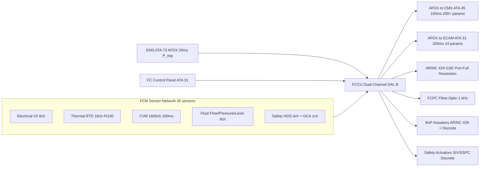
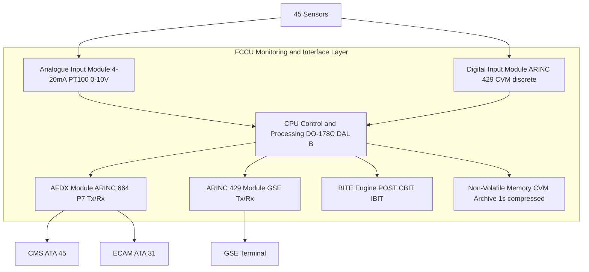

<!-- ──────────────────────────────────────────────────────────────────────────
     QATL-ATLAS-1000-ATLAS-070-079-07-075-080-FUEL-CELL-MONITORING-DIAGNOSTICS-AND-CONTROL-INTERFACES
     ATA 75 · Fuel Cell Monitoring, Diagnostics and Control Interfaces
     AMPEL360E eWTW — ATLAS Register 1000
────────────────────────────────────────────────────────────────────────────── -->

# Fuel Cell Monitoring, Diagnostics and Control Interfaces

---

## §0 Hyperlink Policy

> All hyperlinks in this document are **relative** (five directory levels: `../../../../../`).
> Absolute URLs are forbidden. Every linked document must exist in the Q+ATLANTIDE repository
> before the link is activated. Broken links are treated as open issues and must be resolved
> before the document is promoted from `DRAFT` to `APPROVED`.

---

## §1 Purpose

This document defines the monitoring, diagnostics, and control interface architecture of the AMPEL360E eWTW Fuel Cell Module. The FCM generates over 200 distinct measured parameters at update rates from 10 ms (FCCU control loops) to 1 s (slowly-varying quantities), all of which are collected, aggregated, and transmitted by the FCCU to the Central Maintenance System (CMS, ATA 45), Central Monitoring System, and flight deck ECAM (ATA 31) via AFDX ARINC 664 P7.

The monitoring architecture is designed to support three roles: (1) **Flight crew awareness** — real-time FCM status, power output, and caution/warning indications on ECAM FC synoptic page; (2) **On-board diagnostics** — FCCU BITE logs and CMS health trend analysis enabling on-condition maintenance decisions at A-check and C-check; (3) **Ground maintenance diagnostics** — full-resolution parameter download via ARINC 429 GSE port for troubleshooting and CVM trend analysis.

The FCCU also provides bi-directional control interfaces: it receives power demand commands from the EMS (ATA 73) and FCCU mode commands from the cockpit FC control panel (ATA 31), and it sends actuator commands to all FCM subsystems. This document covers the complete sensor list, data rates, bus architecture, ECAM page definition, BITE structure, and GSE interface.

---

## §2 Applicability

| Parameter | Value |
|---|---|
| Aircraft Program | AMPEL360E eWTW |
| ATA reference | ATA 75-080 — Fuel Cell Monitoring, Diagnostics and Control Interfaces |
| Certification basis | EASA CS-25 Amdt 27+ |
| S1000D SNS | 075-080-00 |

---

## §3 Functional Description ![DRAFT]

**Sensor Network**: The FCM sensor network comprises 45 individual sensors grouped into five categories: (1) Electrical — 8 voltage and current transducers (stack cluster voltage, FCPC input/output V/I, SSPC-FC-01 current); (2) Thermal — 16 Pt100 RTD stack inlet/outlet temperature sensors (4 stacks × 2 locations × 2 pairs for redundancy); (3) Electrochemical — 1,600 CVM cell voltage channels (4 stacks × 400 cells at 100 ms); (4) Fluid — 8 flow, pressure, and level sensors (MFS-H2-075, CFS-075, LVS-WA-075, PT-CAT-075, PT-H2-075, PT-COOL-075 × 4 stack inlet/outlet); (5) Safety — 4 HDS-075 H2 detectors and GCA-075 gas composition analyser.

**Data Bus Architecture**: All analogue sensors (4–20 mA, 0–10 V, Pt100) are wired to FCCU analogue input modules. Digital sensors (CVM, ARINC 429 devices) connect via data bus. The FCCU transmits 200+ aggregated FCM parameters to CMS via AFDX ARINC 664 P7 Endpoint at 100 ms nominal rate. A subset of 24 key parameters are broadcast to ECAM via AFDX at 200 ms. The full 1,600-channel CVM data is archived in FCCU non-volatile memory at 1 s intervals (compressed) and downloaded via ARINC 429 GSE port at maintenance.

**ECAM FC Synoptic Page**: The ECAM FC synoptic page displays: stack cluster power output (kW); individual stack enable/disable status (4 icons); FCPC output power and voltage; stack operating temperature (range); H2 supply pressure; coolant temperature; HDS-075 status (normal/caution/warning); FCM operating state (STANDBY/STARTING/NORMAL/DEGRADED/SHUTDOWN); ECAM caution/warning messages for all FCM fault conditions.

**BITE Architecture**: The FCCU BITE system implements three tiers: (1) Power-On Self-Test (POST) — 30 s CPU, memory, I/O, and sensor plausibility check at initialisation; (2) Continuous Built-In Test (CBIT) — real-time monitoring of all 45 sensors, all control loop states, all actuator feedback, and cross-channel comparison; (3) Initiated Built-In Test (IBIT) — GSE-commanded test sequence that exercises all actuators, reads all sensors, and generates a structured test report.

---

## §4 Functional Breakdown

| ID | Name | Description | Lead Division |
|---|---|---|---|
| F-001 | Sensor network — electrical | 8 channels: stack cluster V/I, FCPC input/output V/I, SSPC-FC-01 I | Q-GREENTECH |
| F-002 | Sensor network — thermal | 16 Pt100 RTDs: 4 stacks × inlet/outlet × 2 redundant pairs | Q-MECHANICS |
| F-003 | Sensor network — CVM | 1,600 cell voltages (4 × 400) at 100 ms; archived at 1 s compressed | Q-HPC |
| F-004 | Sensor network — fluid | 8 flow/pressure/level sensors: H2 supply, cathode air, coolant, water accumulator | Q-MECHANICS |
| F-005 | Sensor network — safety | 4 × HDS-075 H2 detectors (4–20 mA); GCA-075 anode O2/H2 fraction | Q-AIR |
| F-006 | AFDX data transmission to CMS | 200+ FCM parameters to CMS AFDX at 100 ms; trend data archive | Q-HPC |
| F-007 | ECAM FC synoptic page | 24 key parameters on ECAM FC page at 200 ms; caution/warning messages | Q-HPC |
| F-008 | BITE architecture (POST/CBIT/IBIT) | 3-tier BITE; POST at initialise; CBIT continuous; IBIT GSE-commanded | Q-HPC |
| F-009 | GSE interface (ARINC 429) | Full-resolution download: 45 sensors + 1,600 CVM + BITE logs + fault history | Q-HPC |
| F-010 | EMS control interface | AFDX ARINC 664 P7 receive: P_req 0–200 kW at 20 ms; FCCU power demand | Q-HPC |
| F-011 | Cockpit control panel interface | ATA 31 FC CONTROL panel: FCM START/STOP/EMRG SHUTDOWN discrete inputs | Q-HPC |

---

## §5 System Context — Mermaid Diagram

---

## §6 Internal Architecture — Mermaid Diagram

---

## §7 Components and LRUs

| Component | Part Number | Qty | Location | Maintenance Interval | Notes |
|---|---|---|---|---|---|
| FCCU (monitoring functions) | FCCU-075 | 1 | EE bay | As specified in 075-060 | All monitoring functions integrated in FCCU |
| Stack voltage transducer | VT-STK-075 | 4 | Stack cluster busbar | C-check calibration | 0–200 V DC; 0.1 % accuracy |
| Stack current transducer | CT-STK-075 | 4 | SSPC-STA/B/C/D output | C-check calibration | 0–2,000 A DC; Hall-effect; isolated |
| FCPC input voltage transducer | VT-FCPC-IN-075 | 1 | FCPC input | C-check calibration | 0–200 V DC |
| FCPC output voltage transducer | VT-FCPC-OUT-075 | 1 | FCPC output | C-check calibration | 0–350 V DC |
| FCPC output current transducer | CT-FCPC-OUT-075 | 1 | SSPC-FC-01 output | C-check calibration | 0–900 A DC |
| H2 supply pressure transducer | PT-H2-075 | 1 | H2 supply line BoP | C-check calibration | 0–10 bar gauge; 0.1 % accuracy |
| Cathode air pressure transducer | PT-CAT-075 | 1 | Cathode air duct | C-check calibration | 0–5 bar gauge; 0.2 % accuracy |
| Coolant pressure transducers | PT-COOL-075 | 4 | Stack coolant inlet/outlet | C-check calibration | 0–5 bar; 0.2 % accuracy |

---

## §8 Interfaces

| Interface Type | Connected System | Protocol / Medium | Data / Function |
|---|---|---|---|
| CMS health data output | ATA 45 CMS | AFDX ARINC 664 P7 at 100 ms | 200+ FCM parameters, BITE faults, trend data |
| ECAM indication | ATA 31 ECAM | AFDX at 200 ms | 24 key parameters; FCM caution/warning messages |
| EMS power demand input | ATA 73 EMS | AFDX at 20 ms | P_req 0–200 kW continuous demand |
| GSE maintenance data output | Ground maintenance via ARINC 429 GSE port | ARINC 429 high-speed | Full-resolution 45-sensor data + 1,600 CVM + BITE logs |
| FC control panel input | ATA 31 cockpit FC panel | Discrete hardwired | START / STOP / EMRG SHUTDOWN pilot commands |
| ACARS / off-board reporting | ATA 46 aircraft information systems | Via CMS ACARS gateway | Health trend data for line station pre-positioning |

---

## §9 Operating Modes

| Mode | Trigger | System State | Monitoring Actions |
|---|---|---|---|
| Monitoring OFF | Aircraft de-powered | FCCU unpowered | No monitoring |
| Standby monitoring | Aircraft powered, FCM standby | FCCU powered; POST complete; CBIT active | All sensors polled; AFDX to CMS and ECAM active; no power production |
| Normal monitoring | FCM in power production | Full FCCU control and monitoring | All 200+ parameters at 100 ms to CMS; 24 params to ECAM at 200 ms |
| Fault monitoring | BITE fault or sensor alarm | FCCU FDI active; fault logged | Fault code, timestamp, sensor values archived to NV memory; CMS advisory |
| IBIT test mode | GSE command | FCCU in IBIT sequence | All actuators exercised; sensor responses recorded; test report generated |

---

## §10 Performance and Budgets ![DRAFT]

| Parameter | Requirement | Target / Design Value | Status |
|---|---|---|---|
| AFDX to CMS update rate | ≤100 ms nominal | 100 ms | ![TBD] |
| ECAM update rate | ≤500 ms | 200 ms | ![TBD] |
| CVM full scan cycle | ≤100 ms all 1,600 cells | 100 ms | ![TBD] |
| BITE POST duration | ≤60 s | 30 s | ![TBD] |
| NV memory capacity for CVM archive | ≥500 FH at 1 s compressed | TBD | ![TBD] |
| GSE download bandwidth | Full parameter set in ≤10 min | TBD | ![TBD] |
| FCCU parameter count | ≥200 distinct parameters | 210 estimated | ![TBD] |

---

## §11 Safety, Redundancy and Fault Tolerance

- **Dual FCCU channel monitoring**: Both channels continuously poll all sensors; discrepancy between channel sensor readings >threshold flags a sensor fault without requiring controller switchover, enabling fault isolation without service disruption.
- **NV memory fault archive**: All BITE faults are timestamped and stored to NV memory ensuring fault data survives FCCU power cycling and is available for post-event analysis.
- **HDS priority alarm path**: HDS-075 H2 detection signals are hardwired directly to the FCCU FPGA hardware monitor and to a dedicated ECAM discrete output, bypassing AFDX, ensuring <100 ms H2 alarm regardless of AFDX loading.
- **ECAM direct discrete backup**: FCM EMERGENCY SHUTDOWN warning is simultaneously sent to ECAM via AFDX and via a hardwired discrete, ensuring crew warning even if AFDX fails.
- **CVM data compression**: 1,600-channel CVM data archived at 1 s with delta compression preserves long-term MEA degradation trends within manageable NV storage limits.
- **Sensor fault annunciation**: Any sensor reading outside plausibility range is flagged as SENSOR FAULT on ECAM; FCCU substitutes the last valid reading for control purposes for up to 10 s before declaring sensor loss and adjusting control mode.

---

## §12 Maintenance and Diagnostics

| Task | Interval | Access | Special Tools |
|---|---|---|---|
| FCCU parameter log download (200+ params) | A-check | FCCU ARINC 429 GSE port | CMS GSE Terminal PN CMS-GSE-TRM |
| CVM full history download and trend analysis | C-check | FCCU ARINC 429 GSE port | CVM Interface Unit PN CVMIU-GSE-075 |
| ECAM FC page functional check | A-check | ECAM display | Visual verification of FCM synoptic page elements |
| FCCU IBIT test execution | C-check | FCCU GSE port | FCCU GSE console; verify all actuator responses |
| Voltage/current transducer calibration check | C-check | Transducer test points in FCM bay | Calibrated reference standard PN CALREF-GSE-075 |
| NV memory health check and archive backup | C-check | FCCU GSE port | CMS GSE Terminal |

---

## §13 Footprint

| Footprint Type | Parameter | Value | Notes |
|---|---|---|---|
| Total monitored parameters | FCCU output to CMS | ~210 parameters | 100 ms update |
| CVM channels | Total cell voltage channels | 1,600 (4 × 400) | 100 ms scan |
| AFDX bandwidth consumed | CMS reporting | ~2 Mbit/s | 200+ params at 100 ms |
| NV memory | CVM archive | TBD (compressed) | ≥500 FH target |
| Sensor wiring harness | FCM bay to FCCU | TBD | Shielded; routed away from H2 lines |
| GSE port location | FCCU maintenance access | EE bay FCCU front panel | Accessible without H2 LOTO |

---

## §14 Safety and Certification References ![DRAFT]

| Standard / Document | Title | Issuing Body | Applicability |
|---|---|---|---|
| DO-160G | Environmental Conditions for Airborne Equipment | RTCA | All monitoring LRUs |
| ARINC 664 P7 | Aircraft Data Network — AFDX | ARINC | FCCU to CMS and ECAM data network |
| ARINC 429 | Digital Information Transfer System | ARINC | FCCU sensor bus and GSE interface |
| DO-178C | Software Considerations in Airborne Systems | RTCA | FCCU monitoring software DAL B |
| DO-254 | Design Assurance Guidance for Airborne Hardware | RTCA | FCCU monitoring hardware DAL B |
| SAE ARP4754A | Guidelines for Development of Civil Aircraft | SAE International | Monitoring system development |
| CS-25 §25.1431 | Electronic equipment | EASA | Airborne data system certification |

---

## §15 V&V Approach ![TBD]

| Phase | Method | Acceptance Criterion | Status |
|---|---|---|---|
| Parameter ICD validation | Parameter list review vs AFDX ICD | All 200+ parameters defined and verified in AFDX ICD | ![TBD] |
| ECAM page review | Pilot usability evaluation of FC synoptic page | All crew actions supportable from ECAM FC page | ![TBD] |
| BITE POST and CBIT test | Inject known fault; confirm BITE detection and logging | All injected faults detected within specified response time | ![TBD] |
| IBIT end-to-end test | Execute IBIT with full FCM connected | All actuators respond within expected range; test report generated | ![TBD] |
| NV memory endurance | Write/read cycling test of NV memory | ≥1,000 write cycles without data corruption | ![TBD] |

---

## §16 Glossary

| Term | Definition |
|---|---|
| CVM | Cell Voltage Monitor — 400-channel per-stack voltage measurement; 1,600 total |
| BITE | Built-In Test Equipment — POST / CBIT / IBIT structured fault detection architecture |
| POST | Power-On Self-Test — 30 s FCCU self-test at initialisation |
| CBIT | Continuous Built-In Test — real-time FCCU monitoring of all sensors and actuators |
| IBIT | Initiated Built-In Test — GSE-commanded full actuator exercise and test report |
| AFDX | Avionics Full-Duplex Switched Ethernet — ARINC 664 P7 aircraft data network |
| CMS | Central Maintenance System — ATA 45 on-board maintenance data archive |
| ECAM | Electronic Centralised Aircraft Monitor — ATA 31 crew awareness and alerting system |
| EMS | Energy Management System — ATA 73 aircraft power manager |
| NV memory | Non-Volatile Memory — flash or EEPROM storage retaining data after power cycle |
| FC synoptic | ECAM FC synoptic page — visual overview of FCM status for flight crew |
| GSE port | Ground Support Equipment port — maintenance data access interface on FCCU front panel |

---

## §17 Open Issues

| ID | Description | Owner | Target |
|---|---|---|---|
| OI-075-080-001 | Define complete AFDX ICD for all 210 FCM parameters including units, ranges, and validity flags | Q-HPC | 2026-Q4 |
| OI-075-080-002 | Agree ECAM FC synoptic page design with HMI team and flight crew evaluation | Q-HPC / Q-AIR | 2027-Q1 |
| OI-075-080-003 | Define CVM archive compression algorithm and NV memory sizing for ≥500 FH retention | Q-HPC | 2027-Q1 |
| OI-075-080-004 | Finalise ACARS health data package definition for line station pre-positioning | Q-INDUSTRY | 2027-Q2 |

---

## §18 Status Legend

| Badge | Meaning |
|---|---|
| `![DRAFT]` | Section is drafted but not yet reviewed |
| `![TBD]` | Content not yet started — to be defined |
| `![To Be Completed]` | Partially complete — needs additional content |
| `![APPROVED]` | Reviewed and formally approved |

---

## §19 Related Documents (Siblings in this Subsection)

- [075-000](./075-000-Fuel-Cell-Integration-General.md)
- [075-010](./075-010-Fuel-Cell-Stack-Architecture.md)
- [075-020](./075-020-Balance-of-Plant-Air-Hydrogen-and-Cooling.md)
- [075-030](./075-030-Fuel-Cell-Power-Conditioning.md)
- [075-040](./075-040-Water-Management-and-Purge-Interfaces.md)
- [075-050](./075-050-Fuel-Cell-Safety-Isolation-and-Venting.md)
- [075-060](./075-060-Fuel-Cell-Control-and-Operating-Modes.md)
- [075-070](./075-070-Fuel-Cell-Service-Test-and-Maintenance.md)
- [075-090](./075-090-S1000D-CSDB-Mapping-and-Traceability.md)

---

## §20 Change Log

| Rev | Date | Author | Description |
|---|---|---|---|
| 0.1 | 2026-05-12 | @copilot | Initial DRAFT — FCM monitoring, diagnostics, BITE and control interface architecture |
