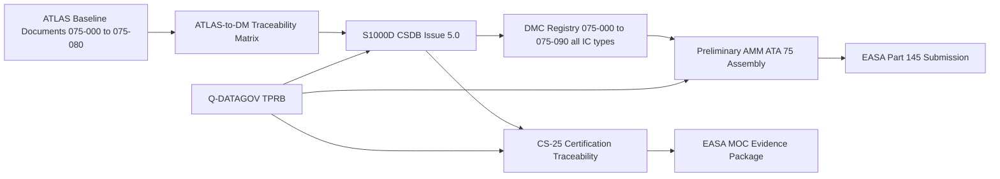
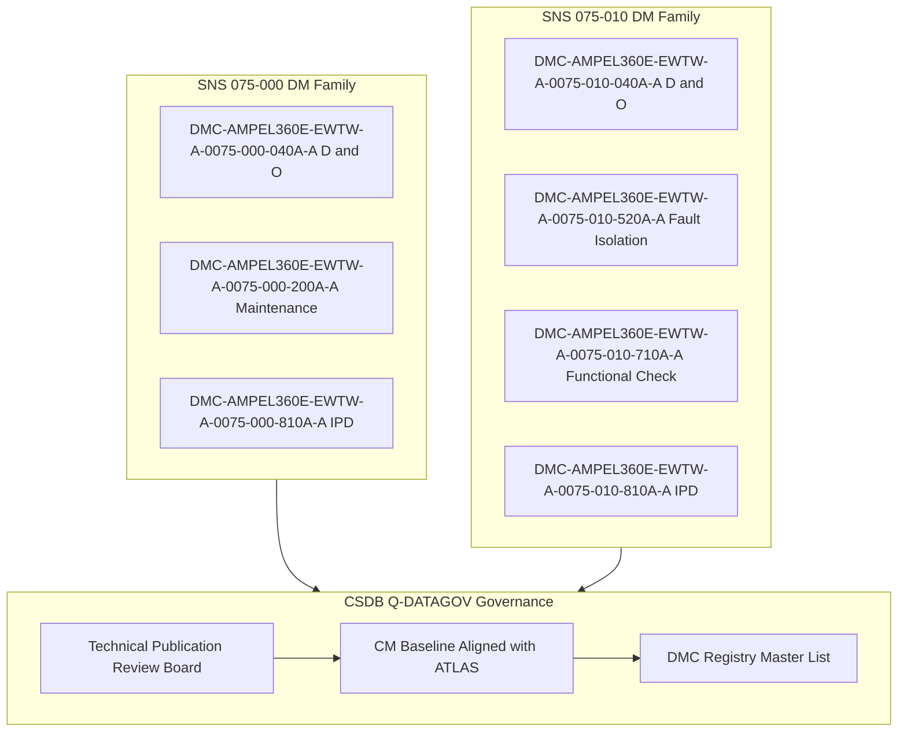

<!-- ──────────────────────────────────────────────────────────────────────────
     QATL-ATLAS-1000-ATLAS-070-079-07-075-090-S1000D-CSDB-MAPPING-AND-TRACEABILITY
     ATA 75 · S1000D CSDB Mapping and Traceability
     AMPEL360E eWTW — ATLAS Register 1000
────────────────────────────────────────────────────────────────────────────── -->

# S1000D CSDB Mapping and Traceability

---

## §0 Hyperlink Policy

> All hyperlinks in this document are **relative** (five directory levels: `../../../../../`).
> Absolute URLs are forbidden. Every linked document must exist in the Q+ATLANTIDE repository
> before the link is activated. Broken links are treated as open issues and must be resolved
> before the document is promoted from `DRAFT` to `APPROVED`.

---

## §1 Purpose

This document provides the S1000D Issue 5.0 Common Source Data Base (CSDB) mapping, Data Module Code (DMC) allocation, and bidirectional traceability between the AMPEL360E eWTW ATA 75 ATLAS baseline documents and their corresponding S1000D Data Modules. It is owned and maintained by Q-DATAGOV as part of the AMPEL360E eWTW Technical Publication governance.

The S1000D standard defines a structured approach to technical documentation using Data Modules (DMs) as the atomic documentation unit. Each DM is identified by a unique Data Module Code (DMC) comprising the Model Identification Code (MIC), System Difference Code (SDC), Standard Numbering System (SNS), Disassembly Code (DIC), Disassembly Code Variant (DIV), Information Code (IC), Information Code Variant (ICV), and Item Location Code (ILC). For the AMPEL360E eWTW, the MIC is AMPEL360E-EWTW and SNS codes are aligned with ATA 75 subsubject codes 075-000 through 075-090.

This document also provides traceability between ATLAS baseline documents (engineering design intent), S1000D Data Modules (technical publications output), and certification documents (CS-25 compliance evidence), ensuring a coherent documentation chain from design to airworthiness and maintenance.

---

## §2 Applicability

| Parameter | Value |
|---|---|
| Aircraft Program | AMPEL360E eWTW |
| ATA reference | ATA 75-090 — S1000D CSDB Mapping and Traceability |
| Certification basis | EASA CS-25 Amdt 27+ |
| S1000D Issue | Issue 5.0 |
| S1000D SNS | 075-090-00 |
| CSDB system | TBD — to be selected from approved CSDB tools | 

---

## §3 Functional Description ![DRAFT]

**S1000D DMC Naming Convention**: For the AMPEL360E eWTW ATA 75 subsection, the DMC structure follows: `DMC-AMPEL360E-EWTW-A-{SNS}-{DIC}{DIV}-{IC}{ICV}-{ILC}` where SNS is the ATA 75 subsubject code (e.g., 0075-000), IC is the information code (e.g., 040 for Description and Operation, 520 for Fault Isolation, 710 for Functional Check), and ILC is typically A for applicability group A.

**Data Module Types Used for ATA 75**: The following S1000D information code categories are applied to ATA 75 DMs: IC-040 (Description and Operation — D&O); IC-200 (Maintenance Procedures — general); IC-520 (Fault Isolation — FI); IC-710 (Functional Check); IC-720 (Operational Check); IC-730 (Visual Check); IC-810 (Illustrated Parts Data — IPD); IC-900 (Wiring Data Module). Each ATLAS subsubject (075-000 through 075-080) generates a family of DMs covering all these information types.

**ATLAS to S1000D Traceability Matrix**: Each section of an ATLAS baseline document is traced to one or more S1000D DMs. For example, §7 Components and LRUs in each ATLAS document traces to the IC-810 IPD DM for the corresponding SNS. §12 Maintenance and Diagnostics traces to IC-200, IC-710, and IC-730 maintenance DMs. §14 Safety and Certification References traces to the ATA 75 compliance summary document.

**CSDB Governance**: Q-DATAGOV maintains the CSDB instance for the AMPEL360E eWTW. All S1000D DMs for ATA 75 are approved through the Q-DATAGOV Technical Publication Review Board (TPRB) prior to inclusion in the Preliminary Aircraft Maintenance Manual (pAMM) submitted to EASA for Part 145 organisation approval. DM change control is governed by a CM baseline aligned with the ATLAS baseline register.

---

## §4 Functional Breakdown

| ID | Name | Description | Lead Division |
|---|---|---|---|
| F-001 | DMC allocation and registry | Assign and register unique DMC for each ATA 75 DM in CSDB; maintain DMC master list | Q-DATAGOV |
| F-002 | ATLAS to DM traceability | Bidirectional trace: ATLAS section → DM; DM → ATLAS section; maintained in CSDB metadata | Q-DATAGOV |
| F-003 | DM to certification traceability | Trace DMs to CS-25 compliance paragraphs; EASA MOC evidence linkage | Q-DATAGOV |
| F-004 | CSDB baseline management | DM versioning aligned with ATLAS revision history; change authority and approval workflow | Q-DATAGOV |
| F-005 | pAMM assembly | Compile ATA 75 DMs into Preliminary AMM structure; TPRB review before EASA submission | Q-DATAGOV |
| F-006 | SNS alignment with ATA 75 | Confirm S1000D SNS codes 075-000 through 075-090 align with ATA 75 subsubject numbering | Q-DATAGOV |

---

## §5 System Context — Mermaid Diagram

---

## §6 Internal Architecture — Mermaid Diagram

---

## §7 S1000D DMC Allocation Table

| ATLAS Document | ATA SNS | S1000D DM Type | DMC | IC | Description |
|---|---|---|---|---|---|
| 075-000 | 075-000-00 | D&O | DMC-AMPEL360E-EWTW-A-0075-000-040A-A | 040 | Fuel Cell Integration General — Description and Operation |
| 075-000 | 075-000-00 | Maintenance | DMC-AMPEL360E-EWTW-A-0075-000-200A-A | 200 | Fuel Cell Integration General — Maintenance Procedures |
| 075-000 | 075-000-00 | IPD | DMC-AMPEL360E-EWTW-A-0075-000-810A-A | 810 | Fuel Cell Integration General — Illustrated Parts Data |
| 075-010 | 075-010-00 | D&O | DMC-AMPEL360E-EWTW-A-0075-010-040A-A | 040 | Stack Architecture — Description and Operation |
| 075-010 | 075-010-00 | Fault Isolation | DMC-AMPEL360E-EWTW-A-0075-010-520A-A | 520 | Stack Architecture — Fault Isolation |
| 075-010 | 075-010-00 | Functional Check | DMC-AMPEL360E-EWTW-A-0075-010-710A-A | 710 | Stack Architecture — Functional Check (CVM balance) |
| 075-010 | 075-010-00 | IPD | DMC-AMPEL360E-EWTW-A-0075-010-810A-A | 810 | Stack Architecture — Illustrated Parts Data |
| 075-020 | 075-020-00 | D&O | DMC-AMPEL360E-EWTW-A-0075-020-040A-A | 040 | BoP — Description and Operation |
| 075-020 | 075-020-00 | Maintenance | DMC-AMPEL360E-EWTW-A-0075-020-200A-A | 200 | BoP — Maintenance Procedures |
| 075-020 | 075-020-00 | Fault Isolation | DMC-AMPEL360E-EWTW-A-0075-020-520A-A | 520 | BoP — Fault Isolation |
| 075-020 | 075-020-00 | IPD | DMC-AMPEL360E-EWTW-A-0075-020-810A-A | 810 | BoP — Illustrated Parts Data |
| 075-030 | 075-030-00 | D&O | DMC-AMPEL360E-EWTW-A-0075-030-040A-A | 040 | FCPC Power Conditioning — Description and Operation |
| 075-030 | 075-030-00 | Functional Check | DMC-AMPEL360E-EWTW-A-0075-030-710A-A | 710 | FCPC — Functional Check (efficiency test) |
| 075-030 | 075-030-00 | IPD | DMC-AMPEL360E-EWTW-A-0075-030-810A-A | 810 | FCPC — Illustrated Parts Data |
| 075-040 | 075-040-00 | D&O | DMC-AMPEL360E-EWTW-A-0075-040-040A-A | 040 | Water Management — Description and Operation |
| 075-040 | 075-040-00 | Maintenance | DMC-AMPEL360E-EWTW-A-0075-040-200A-A | 200 | Water Management — Maintenance Procedures |
| 075-040 | 075-040-00 | IPD | DMC-AMPEL360E-EWTW-A-0075-040-810A-A | 810 | Water Management — Illustrated Parts Data |
| 075-050 | 075-050-00 | D&O | DMC-AMPEL360E-EWTW-A-0075-050-040A-A | 040 | Safety and Isolation — Description and Operation |
| 075-050 | 075-050-00 | Maintenance | DMC-AMPEL360E-EWTW-A-0075-050-200A-A | 200 | Safety and Isolation — Maintenance Procedures (LOTO) |
| 075-050 | 075-050-00 | Fault Isolation | DMC-AMPEL360E-EWTW-A-0075-050-520A-A | 520 | Safety and Isolation — Fault Isolation |
| 075-050 | 075-050-00 | Visual Check | DMC-AMPEL360E-EWTW-A-0075-050-730A-A | 730 | Safety and Isolation — Visual Check (HDS, SIV, PRV) |
| 075-050 | 075-050-00 | IPD | DMC-AMPEL360E-EWTW-A-0075-050-810A-A | 810 | Safety and Isolation — Illustrated Parts Data |
| 075-060 | 075-060-00 | D&O | DMC-AMPEL360E-EWTW-A-0075-060-040A-A | 040 | FCCU Control — Description and Operation |
| 075-060 | 075-060-00 | Fault Isolation | DMC-AMPEL360E-EWTW-A-0075-060-520A-A | 520 | FCCU Control — Fault Isolation |
| 075-060 | 075-060-00 | Operational Check | DMC-AMPEL360E-EWTW-A-0075-060-720A-A | 720 | FCCU Control — Operational Check (state machine) |
| 075-060 | 075-060-00 | IPD | DMC-AMPEL360E-EWTW-A-0075-060-810A-A | 810 | FCCU Control — Illustrated Parts Data |
| 075-070 | 075-070-00 | D&O | DMC-AMPEL360E-EWTW-A-0075-070-040A-A | 040 | Service and Maintenance — Description and Operation |
| 075-070 | 075-070-00 | Maintenance | DMC-AMPEL360E-EWTW-A-0075-070-200A-A | 200 | Service and Maintenance — Scheduled Maintenance Procedures |
| 075-070 | 075-070-00 | Functional Check | DMC-AMPEL360E-EWTW-A-0075-070-710A-A | 710 | Service and Maintenance — Post-Maintenance Functional Check |
| 075-080 | 075-080-00 | D&O | DMC-AMPEL360E-EWTW-A-0075-080-040A-A | 040 | Monitoring and Diagnostics — Description and Operation |
| 075-080 | 075-080-00 | Fault Isolation | DMC-AMPEL360E-EWTW-A-0075-080-520A-A | 520 | Monitoring and Diagnostics — Fault Isolation |
| 075-080 | 075-080-00 | Wiring Data | DMC-AMPEL360E-EWTW-A-0075-080-900A-A | 900 | Monitoring and Diagnostics — Wiring Data Module |
| 075-090 | 075-090-00 | D&O | DMC-AMPEL360E-EWTW-A-0075-090-040A-A | 040 | CSDB Mapping — Description and Operation (this document) |

---

## §8 ATLAS Section to S1000D DM Traceability

| ATLAS Section | Content | Primary DM Type | DM Information Code |
|---|---|---|---|
| §1 Purpose | System functional overview | D&O | IC-040 |
| §2 Applicability | Applicability table | D&O | IC-040 |
| §3 Functional Description | Detailed technical description | D&O | IC-040 |
| §4 Functional Breakdown | Function tree | D&O | IC-040 |
| §5 System Context Diagram | System context | D&O | IC-040 |
| §6 Internal Architecture Diagram | Internal architecture | D&O | IC-040 |
| §7 Components and LRUs | LRU list and part numbers | IPD | IC-810 |
| §8 Interfaces | Interface control data | D&O + Wiring | IC-040 / IC-900 |
| §9 Operating Modes | Mode descriptions | D&O + Operational Check | IC-040 / IC-720 |
| §10 Performance and Budgets | Performance parameters | D&O | IC-040 |
| §11 Safety, Redundancy and FT | Safety analysis | D&O | IC-040 |
| §12 Maintenance and Diagnostics | Task list | Maintenance / Functional Check | IC-200 / IC-710 / IC-730 |
| §13 Footprint | Physical data | D&O | IC-040 |
| §14 Certification References | Standards reference | D&O | IC-040 |
| §15 V&V Approach | Test methods | Operational Check | IC-720 |
| §16 Glossary | Terminology | D&O | IC-040 |
| §17 Open Issues | Issue tracking | Internal baseline only — no DM | N/A |
| §18 Status Legend | Documentation status | Internal baseline only — no DM | N/A |
| §19 Related Documents | Cross-reference | D&O | IC-040 |
| §20 Change Log | Revision history | CM record | N/A (CSDB CM metadata) |

---

## §9 Operating Modes

| Mode | Trigger | System State | Actions / Consequences |
|---|---|---|---|
| CSDB draft | ATLAS document issued DRAFT | DMs in CSDB with status DRAFT | Q-DATAGOV reviews DM content against ATLAS source |
| CSDB review | ATLAS document enters review | DMs in TPRB review | TPRB technical review; comments resolved; DMs updated |
| CSDB approved | ATLAS document APPROVED | DMs in CSDB status APPROVED | Approved DMs assembled into pAMM for EASA submission |
| CSDB change | ATLAS document revised (Rev +1) | DMs updated; CM change record raised | Traceability matrix updated; TPRB re-review of changed DMs |
| pAMM assembly | All ATA 75 DMs approved | pAMM assembled and submitted to EASA | Q-DATAGOV submits ATA 75 chapter to EASA Part 145 |

---

## §10 Performance and Budgets ![DRAFT]

| Parameter | Requirement | Target / Design Value | Status |
|---|---|---|---|
| DM count for ATA 75 | Complete coverage of all 075-000 to 075-080 | ~34 DMs (as listed in §7 table) | ![TBD] |
| ATLAS to DM traceability completeness | 100 % of ATLAS §1–§16 sections traced to DM | 100 % | ![TBD] |
| DM to CS-25 traceability completeness | All airworthiness-relevant DMs traced to CS-25 paragraphs | 100 % | ![TBD] |
| CSDB review cycle time | TPRB review per DM | ≤10 working days per DM | ![TBD] |
| pAMM submission timeline | ATA 75 chapter to EASA | TBD | ![TBD] |

---

## §11 Safety, Redundancy and Fault Tolerance

- **CM baseline alignment**: CSDB DM revisions are locked to ATLAS baseline revisions; a DM cannot be revised without a corresponding ATLAS document change, preventing documentation drift from design intent.
- **TPRB dual-authority approval**: All ATA 75 DMs require approval from both Q-DATAGOV (publication quality) and the relevant technical Q-Division (content accuracy) before CSDB status changes from DRAFT to APPROVED.
- **Traceability gap detection**: Q-DATAGOV maintains an automated traceability completeness check that flags any ATLAS section without a mapped DM IC type, preventing accidental documentation gaps in the pAMM.
- **Version-locked DM packages**: The pAMM ATA 75 chapter is assembled from a version-locked set of CSDB DMs; no ad-hoc DM substitution is permitted after pAMM assembly is initiated.
- **DMC uniqueness enforcement**: The CSDB enforces DMC uniqueness; duplicate DMC assignment is rejected at CSDB entry, preventing documentation identity collisions.

---

## §12 Maintenance and Diagnostics

| Task | Interval | Access | Special Tools |
|---|---|---|---|
| CSDB traceability completeness check | At each ATLAS revision | Q-DATAGOV CSDB tool | CSDB traceability report function |
| DM content review vs ATLAS source | At each DM DRAFT → REVIEW transition | TPRB review process | ATLAS document + DM comparison |
| pAMM ATA 75 chapter compilation | Pre-EASA submission | Q-DATAGOV CSDB tool | S1000D publication module assembly |
| DMC registry reconciliation | Quarterly | Q-DATAGOV | CSDB DMC export vs master registry |
| ATLAS revision to DM change impact assessment | At each ATLAS Rev +1 | Q-DATAGOV change management | CSDB impact assessment tool |

---

## §13 Footprint

| Footprint Type | Parameter | Value | Notes |
|---|---|---|---|
| Total S1000D DMs for ATA 75 | All information types | ~34 DMs | As listed in §7 DMC allocation table |
| CSDB storage | ATA 75 DM set | TBD MB | Depends on graphics and wiring data inclusion |
| TPRB review board members | Q-DATAGOV + technical Q-Divisions | TBD per organisation | TPRB charter to be established |
| pAMM ATA 75 page count estimate | All DMs assembled | TBD pages | Depends on graphics density |

---

## §14 Safety and Certification References ![DRAFT]

| Standard / Document | Title | Issuing Body | Applicability |
|---|---|---|---|
| S1000D Issue 5.0 | International Specification for Technical Publications | ASD/AIA/ATA | All ATA 75 DM production |
| EASA Part 145 | Approved Maintenance Organisation | EASA | pAMM submission and AMM approval |
| ASD SX000i | International Guide for the Use of S1000D | ASD | S1000D implementation guidance |
| EASA CM-CS-001 | Certification Maintenance Requirements | EASA | CMR linkage in DMs |
| SAE ARP4754A | Guidelines for Development of Civil Aircraft | SAE International | Documentation traceability assurance |
| DO-178C Annex A | Software Lifecycle Data | RTCA | FCCU software DM traceability |

---

## §15 V&V Approach ![TBD]

| Phase | Method | Acceptance Criterion | Status |
|---|---|---|---|
| DMC allocation completeness | DMC table reviewed against ATA 75 subsubject breakdown | All 075-000 to 075-080 have complete DM families | ![TBD] |
| Traceability matrix completeness | Automated CSDB traceability check | 100 % ATLAS sections mapped; 0 unmapped gaps | ![TBD] |
| DM technical accuracy | TPRB review of all 34 DMs against ATLAS source | All DMs match ATLAS content; all comments resolved | ![TBD] |
| pAMM assembly check | pAMM ATA 75 chapter compiled and peer reviewed | All DMs present; no broken cross-references; EASA compliant format | ![TBD] |
| CS-25 traceability completeness | Compliance matrix review | All relevant CS-25 paragraphs addressed by at least one DM | ![TBD] |

---

## §16 Glossary

| Term | Definition |
|---|---|
| S1000D | International specification for technical publications (Issues 1–5) |
| CSDB | Common Source Data Base — authoritative repository for S1000D Data Modules |
| DMC | Data Module Code — unique identifier for each S1000D Data Module |
| DM | Data Module — atomic unit of S1000D technical documentation |
| IC | Information Code — S1000D code defining the type of content (040=D&O, 520=FI, 810=IPD, etc.) |
| SNS | Standard Numbering System — S1000D system and subsystem breakdown code aligned with ATA |
| TPRB | Technical Publication Review Board — Q-DATAGOV approval body for CSDB DMs |
| pAMM | Preliminary Aircraft Maintenance Manual — pre-certification AMM submitted to EASA |
| MIC | Model Identification Code — AMPEL360E-EWTW for this programme |
| MOC | Means of Compliance — EASA method by which CS-25 requirement is demonstrated |
| CMR | Certification Maintenance Requirement — mandatory maintenance task identified during certification |
| D&O | Description and Operation — S1000D IC-040 information type |
| IPD | Illustrated Parts Data — S1000D IC-810 information type |
| FI | Fault Isolation — S1000D IC-520 information type |

---

## §17 Open Issues

| ID | Description | Owner | Target |
|---|---|---|---|
| OI-075-090-001 | Select and procure CSDB tool instance for AMPEL360E eWTW programme | Q-DATAGOV | 2026-Q3 |
| OI-075-090-002 | Establish TPRB charter and membership for ATA 75 DM reviews | Q-DATAGOV | 2026-Q4 |
| OI-075-090-003 | Develop complete traceability matrix for ATA 75 ATLAS §1–§16 to all 34 DMs | Q-DATAGOV | 2026-Q4 |
| OI-075-090-004 | Define CS-25 compliance paragraph to DM mapping for ATA 75 | Q-DATAGOV / Q-AIR | 2027-Q1 |
| OI-075-090-005 | Confirm S1000D Issue 5.0 vs Issue 4.1 applicability with EASA acceptance | Q-DATAGOV | 2026-Q3 |

---

## §18 Status Legend

| Badge | Meaning |
|---|---|
| `![DRAFT]` | Section is drafted but not yet reviewed |
| `![TBD]` | Content not yet started — to be defined |
| `![To Be Completed]` | Partially complete — needs additional content |
| `![APPROVED]` | Reviewed and formally approved |

---

## §19 Related Documents (Siblings in this Subsection)

- [075-000](./075-000-Fuel-Cell-Integration-General.md)
- [075-010](./075-010-Fuel-Cell-Stack-Architecture.md)
- [075-020](./075-020-Balance-of-Plant-Air-Hydrogen-and-Cooling.md)
- [075-030](./075-030-Fuel-Cell-Power-Conditioning.md)
- [075-040](./075-040-Water-Management-and-Purge-Interfaces.md)
- [075-050](./075-050-Fuel-Cell-Safety-Isolation-and-Venting.md)
- [075-060](./075-060-Fuel-Cell-Control-and-Operating-Modes.md)
- [075-070](./075-070-Fuel-Cell-Service-Test-and-Maintenance.md)
- [075-080](./075-080-Fuel-Cell-Monitoring-Diagnostics-and-Control-Interfaces.md)

---

## §20 Change Log

| Rev | Date | Author | Description |
|---|---|---|---|
| 0.1 | 2026-05-12 | @copilot | Initial DRAFT — S1000D CSDB mapping, DMC allocation, and ATLAS traceability for ATA 75 |
