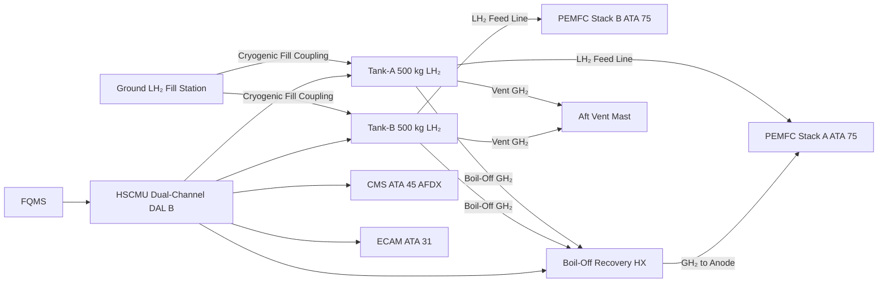
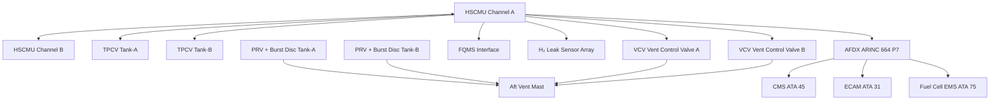

<!-- ──────────────────────────────────────────────────────────────────────────
     QATL-ATLAS-1000-ATLAS-070-079-07-076-000-HYDROGEN-FUEL-STORAGE-ONBOARD-GENERAL
     ATA 28 (LH₂) · Hydrogen Fuel Storage — Onboard General
     AMPEL360E eWTW — ATLAS Register 1000
────────────────────────────────────────────────────────────────────────────── -->

# Hydrogen Fuel Storage — Onboard General

---

## §0 Hyperlink Policy

> All hyperlinks in this document are **relative** (five directory levels: `../../../../../`).
> Absolute URLs are forbidden. Every linked document must exist in the Q+ATLANTIDE repository
> before the link is activated. Broken links are treated as open issues and must be resolved
> before the document is promoted from `DRAFT` to `APPROVED`.

---

## §1 Purpose

ATLAS subsubject 076-000 establishes the general scope, top-level architecture, and governing standards for the Hydrogen Fuel Storage — Onboard system of the AMPEL360E eWTW. This document is the apex reference for all subordinate subsubject documents (076-010 through 076-090).

The AMPEL360E eWTW stores **liquid hydrogen (LH₂)** as the primary energy carrier for the onboard **Hydrogen Fuel Cell (HFC) propulsion system** (ATA 75). LH₂ is stored at cryogenic temperature (≈ 20 K, −253 °C) in two vacuum-jacketed, double-wall pressure vessels located in the aft fuselage. The system is cross-referenced to the legacy ATA 28 chapter (Fuel), adapted to address the unique safety, thermal, and handling requirements of cryogenic hydrogen in a certified aircraft environment.

All subsubject documents (076-010 through 076-090) are subordinate to this general baseline and inherit its governance class, Q-Division authority, and S1000D CSDB affiliation.

---

## §2 Applicability

| Parameter | Value |
|---|---|
| Aircraft Program | AMPEL360E eWTW |
| ATA reference | ATA 28 (LH₂) — 076-000 Hydrogen Fuel Storage Onboard General |
| Certification basis | EASA CS-25 Amdt 27+; CSH-2 (Certification Specifications Hydrogen) |
| S1000D SNS | 076-000-00 |

---

## §3 Functional Description ![DRAFT]

The AMPEL360E eWTW hydrogen fuel storage system consists of two aft-fuselage **LH₂ pressure vessels** (Tank-A port, Tank-B starboard), each with a nominal usable capacity of **500 kg LH₂** (total useable 1 000 kg). Together, they provide sufficient hydrogen mass to power the twin **Proton Exchange Membrane Fuel Cell (PEMFC)** stacks (ATA 75) across a design mission of approximately 1 500 NM at cruise conditions, supplemented by hybrid-electric turbofan propulsion.

Each tank is a **vacuum-jacketed double-wall vessel**: the inner vessel (SS 316L or aluminium alloy 2219) holds LH₂ at 1.5–3.0 bar(a); the outer jacket maintains a hard vacuum (< 10⁻³ Pa) surrounding **multilayer insulation (MLI)** blankets to achieve a static heat leak below the boil-off design allowance. G10/GFRP (glass-fibre reinforced polymer) support struts suspend the inner vessel within the outer jacket with minimal thermal conduction.

The **Hydrogen Storage Control and Monitoring Unit (HSCMU)** — a dual-channel controller qualified to DO-178C DAL B — manages tank pressure via the Tank Pressure Control Valve (TPCV), commands vent operations through the Vent Control Valve (VCV) to the aft vent mast, and integrates with the AMPEL360E's **Fuel Quantity Management System (FQMS)** for continuous LH₂ mass metering. Boil-off gas that exceeds normal operating pressure can be routed to the **boil-off recovery heat exchanger** for vapour delivery to the PEMFC anode feed, maximising hydrogen utilisation.

The system architecture ensures **zero-liquid-hydrogen leakage** during normal operation; all venting is gaseous hydrogen (GH₂) directed to the aft vent mast, where hydrogen is dispersed well above any aircraft surface to preclude accumulation in confined zones.

---

## §4 Functional Breakdown

| ID | Name | Description | Lead Division |
|---|---|---|---|
| F-001 | LH₂ storage vessels (×2) | Tank-A and Tank-B, each 500 kg useable LH₂; vacuum-jacketed MLI double-wall construction | Q-GREENTECH |
| F-002 | Cryogenic insulation | MLI blankets + vacuum jacket + G10 support struts; static heat leak ≤ design allowance | Q-MECHANICS |
| F-003 | Tank pressure control | TPCV + HSCMU logic; normal operating band 1.5–3.0 bar(a); PRV + burst disc protection | Q-GREENTECH |
| F-004 | Boil-off management | Boil-off recovery heat exchanger feeding PEMFC anode; vent path to aft vent mast | Q-GREENTECH |
| F-005 | LH₂ quantity indication | Capacitance probes + cryogenic Pt-1000 temperature array; FQMS mass computation | Q-HPC |
| F-006 | Hydrogen safety zones | Zone 1/2 classification per IEC 60079-10-1; catalytic H₂ sensors; ventilation; ATEX equipment | Q-AIR |
| F-007 | Ground servicing | Cryogenic fill coupling; GN₂ purge/inert; cooldown; vent-to-ground procedures | Q-MECHANICS |
| F-008 | HSCMU monitoring | Dual-channel digital controller; AFDX interface to CMS (ATA 45) and ECAM (ATA 31) | Q-HPC |

---

## §5 System Context — Mermaid Diagram

---

## §6 Internal Architecture — Mermaid Diagram

---

## §7 Components and LRUs

| Component | Part Number | Qty | Location | Maintenance Interval | Notes |
|---|---|---|---|---|---|
| LH₂ Tank-A (inner vessel) | TANK-A-IV-PN-TBD | 1 | Aft fuselage port | On condition; 6-year hydrostatic test | SS 316L or Al 2219; 500 kg useable LH₂ |
| LH₂ Tank-B (inner vessel) | TANK-B-IV-PN-TBD | 1 | Aft fuselage stbd | On condition; 6-year hydrostatic test | Identical to Tank-A |
| Vacuum outer jacket (×2) | JACKET-PN-TBD | 2 | Surrounding each inner vessel | On condition; annual vacuum integrity check | Hard vacuum < 10⁻³ Pa; MLI enclosed |
| HSCMU Hydrogen Storage Control and Monitoring Unit | HSCMU-PN-TBD | 1 | EE bay rack | Software update per SB; C-check BITE | Dual-channel; DO-178C DAL B; DO-254 DAL B |
| TPCV Tank Pressure Control Valve (×2) | TPCV-PN-TBD | 2 | Tank neck assembly | A-check leak check | Cryogenic-rated solenoid; normally closed |
| VCV Vent Control Valve (×2) | VCV-PN-TBD | 2 | Vent manifold | A-check operational test | ATEX rated; cryogenic-compatible |
| PRV Pressure Relief Valve (×4) | PRV-PN-TBD | 4 | Tank neck (2 per tank) | Annual recertification | Set pressure 4.5 bar(a); redundant pair per tank |
| Burst Disc Assembly (×2) | BD-PN-TBD | 2 | Tank neck (1 per tank) | Replace after activation; annual inspection | Last-resort overpressure; 6.0 bar(a) rated |
| Boil-off Recovery Heat Exchanger | BOHX-PN-TBD | 1 | Aft pylon / nacelle interface | C-check effectiveness test | GH₂ → PEMFC anode; warm GH₂ at 280–320 K |
| Cryogenic Fill Coupling (×2) | CFC-PN-TBD | 2 | Aft belly service panel | A-check visual; 2-year seal replacement | ISO 13985 compatible; self-sealing breakaway |
| H₂ Leak Sensor (catalytic, ×8) | H2S-CAT-PN-TBD | 8 | Tank bay; EE bay; vent manifold zone | 6-month calibration | LEL 0–100 % range; Alarm at 10 % LEL |

---

## §8 Interfaces

| Interface Type | Connected System | Protocol / Medium | Data / Function |
|---|---|---|---|
| ATA 75 Fuel Cell Integration | PEMFC Stacks A / B | Cryogenic LH₂ supply line + GH₂ recovery | Hydrogen feed to fuel cell anode |
| ATA 45 CMS | Central Maintenance System | AFDX ARINC 664 P7 | HSCMU BITE faults; tank health; boil-off trend |
| ATA 31 ECAM | Cockpit electronic centralized display | AFDX | FUEL 76 synoptic; tank pressures, temps, LH₂ mass |
| ATA 24 Electrical Power | HVDC 270 V bus | HVDC cable | HSCMU, TPCV, VCV actuator power |
| ATA 21 ECS | Environmental Control System | Pneumatic/electrical interface | Tank bay ventilation air flow demand |
| Ground LH₂ Service | Airfield cryogenic service vehicle | ISO 13985 cryogenic fill coupling | LH₂ ground fill; GN₂ purge/inert |
| ATA 47 NGS | Nitrogen Generation System (GN₂ inert) | GN₂ purge line | Tank pre-cooling; purge before fill/maintenance |

---

## §9 Operating Modes

| Mode | Trigger | System State | Actions / Consequences |
|---|---|---|---|
| Normal cruise | Both tanks healthy; PEMFC running | TPCV modulating pressure 1.5–2.5 bar(a); boil-off to BOHX | Continuous LH₂ feed; HSCMU monitors; ECAM "FUEL 76" normal |
| High-demand (climb/MTOP) | Peak fuel cell power demand | LH₂ feed rate increased; TPCV opens wider | Tank pressure may decrease toward lower band (1.5 bar); boil-off rate changes |
| Pressure relief (vent) | Tank pressure ≥ 3.5 bar(a) | VCV opens; GH₂ vented to aft vent mast | ECAM advisory; HSCMU logs event; pressure returns to band |
| PRV activation | Tank pressure ≥ 4.5 bar(a) — VCV failed | PRV opens automatically | Emergency GH₂ vent; ECAM warning; crew informed; inspection required |
| Ground hold (extended) | Parking > 24 h | Boil-off accumulates; VCV opens per schedule | Controlled vent to ground vent receptacle; mass loss tracked |
| LOTO / maintenance | Aircraft grounded; maintenance access required | TPCV closed; GN₂ purge commanded by HSCMU | Tank atmosphere < 1 % H₂ confirmed by sensors before access |
| Emergency jettison | Not applicable (no LH₂ jettison system) | N/A — LH₂ is consumed or vented only as GH₂ | Design constraint: no liquid hydrogen overboard jettison |

---

## §10 Performance and Budgets ![DRAFT]

| Parameter | Requirement | Target / Design Value | Status |
|---|---|---|---|
| Useable LH₂ capacity (total) | ≥ 1 000 kg | 1 000 kg (2 × 500 kg) | ![TBD] |
| Normal operating pressure | 1.5–3.0 bar(a) | 1.5–2.5 bar(a) cruise | ![TBD] |
| Boil-off rate at parking (< 24 h) | ≤ 0.3 %/day of total mass | ≤ 0.25 %/day target | ![TBD] |
| Static heat leak per tank | ≤ 5 W per tank | ≤ 4 W target | ![TBD] |
| LH₂ quantity accuracy (FQMS) | ± 2 % full scale | ± 1 % target | ![TBD] |
| PRV set pressure | 4.5 bar(a) | 4.5 bar(a) | ![TBD] |
| Burst disc rated pressure | 6.0 bar(a) | 6.0 bar(a) | ![TBD] |
| HSCMU availability | ≥ 99.99 % dispatch | Dual-channel architecture | ![TBD] |
| H₂ sensor alarm threshold | 10 % LEL (≈ 0.4 % v/v H₂) | 10 % LEL | ![TBD] |

---

## §11 Safety, Redundancy and Fault Tolerance

- Two independent LH₂ tanks (Tank-A and Tank-B) provide redundancy; either tank can supply the full PEMFC power demand at reduced mission range.
- Each tank has two independent PRVs plus one burst disc — three-layer overpressure protection.
- HSCMU dual-channel architecture (DO-178C DAL B) ensures no single software or hardware failure causes a latent hazard.
- All venting is gaseous hydrogen (GH₂) routed to the aft vent mast; no liquid hydrogen is ever vented overboard.
- Hydrogen safety zones (Zone 1 around fill couplings; Zone 2 in tank bay and vent manifold area) are defined per IEC 60079-10-1; all installed equipment within these zones is ATEX-rated.
- Eight catalytic H₂ leak sensors (alarm at 10 % LEL) are distributed in the tank bay, EE bay, and vent manifold; any alarm triggers ECAM warning and HSCMU protective response (close TPCV, initiate ventilation purge).
- Loss of HSCMU dual-channel (catastrophic failure mode) is demonstrated Extremely Improbable per FHA per DO-178C DAL B software and DO-254 DAL B hardware requirements.
- LH₂ system is purged with GN₂ (from NGS, ATA 47) before any maintenance access to ensure < 1 % H₂ by volume in the tank bay atmosphere.

---

## §12 Maintenance and Diagnostics

| Task | Interval | Access | Special Tools |
|---|---|---|---|
| HSCMU BITE log download and sensor trend review | A-check | CMS terminal or ACARS | CMS GSE terminal |
| H₂ leak sensor calibration check (all 8) | 6 months | Tank bay / EE bay access panels | Certified H₂ calibration gas kit |
| TPCV and VCV functional test (per tank) | A-check | HSCMU GSE ground command | HSCMU GSE console |
| PRV set-point recertification | Annual | Tank neck access panel | Calibrated PRV test rig |
| Vacuum jacket integrity check (residual gas analysis) | Annual | Vacuum test port on outer jacket | Quadrupole residual gas analyser |
| MLI inspection and bond pad condition | 6-year or on condition | Inner vessel access — requires tank removal | Cryogenic technician; clean room standards |
| Cryogenic fill coupling seal replacement | 2-year or on condition | Aft belly service panel | Cryogenic seal kit; ISO 13985 tools |
| GN₂ purge / inert procedure verification | Before any tank bay maintenance | HSCMU GSE + portable H₂ analyser | Portable electrochemical H₂ detector |
| Tank hydrostatic proof test | 6-year overhaul | Workshop (tank removed) | Hydrostatic test rig per EN 13458-3 |

---

## §13 Footprint

| Footprint Type | Parameter | Value | Notes |
|---|---|---|---|
| Physical | Total LH₂ system mass (tanks + insulation + lines + HSCMU) | ![TBD] | Pending detailed design |
| Physical | Tank-A/B envelope (each) | ![TBD] | Aft fuselage volume allocation TBD |
| Thermal | Static heat leak (each tank at cruise) | ≤ 5 W | MLI + vacuum jacket design target |
| Mass | LH₂ useable capacity (total) | 1 000 kg | 2 × 500 kg |
| Mass | LH₂ density at 1.5 bar(a) | ≈ 70.8 kg/m³ | Saturation liquid hydrogen |
| Volume | Total tank inner volume (both tanks) | ≈ 14.2 m³ | Based on 1 000 kg at 70.8 kg/m³ + ullage |
| Maintenance | Tank bay access time (both panels) | ≈ 2 h | Standard tool access |
| Data | AFDX bandwidth (HSCMU to CMS) | ![TBD] | Per AFDX bus load analysis |

---

## §14 Safety and Certification References ![DRAFT]

| Standard / Document | Title | Issuing Body | Applicability |
|---|---|---|---|
| EASA CS-25 Amdt 27+ | Airworthiness Standards: Large Aeroplanes | EASA | Primary aircraft certification basis |
| EASA CSH-2 | Certification Specifications for Hydrogen Aircraft | EASA | Hydrogen-specific CS for design and operations |
| EN 13458-1/2/3 | Cryogenic vessels — static | CEN | Inner vessel and vacuum jacket design, fabrication, test |
| ISO 13985 | Liquid hydrogen — land vehicle fuelling system interface | ISO | Fill coupling compatibility with ground LH₂ service |
| IEC 60079-10-1 | Explosive atmospheres — Classification of areas (gas) | IEC | H₂ safety zone classification |
| IEC 60079-0 / ATEX | Explosive atmospheres — Equipment | IEC / ATEX | ATEX equipment selection for Zone 1/2 areas |
| DO-160G | Environmental Conditions and Test Procedures | RTCA | Environmental qualification for HSCMU, sensors, valves |
| DO-178C | Software Considerations in Airborne Systems | RTCA | HSCMU software DAL B |
| DO-254 | Design Assurance Guidance for Airborne Electronic Hardware | RTCA | HSCMU hardware DAL B |
| SAE AS6858 | Hydrogen Fueling of Unmanned and Manned Aircraft | SAE | Ground fueling procedures reference |
| NASA-TM-2018-219893 | Cryogenic fluid management technologies | NASA | Background reference for LH₂ insulation design |

---

## §15 V&V Approach ![TBD]

| Phase | Method | Acceptance Criterion | Status |
|---|---|---|---|
| Design | Thermal analysis (FEA/CFD) — boil-off and heat leak | Boil-off ≤ 0.3 %/day; heat leak ≤ 5 W per tank | ![TBD] |
| Design | Structural analysis — inner vessel and jacket burst | Burst pressure ≥ 2× MAWP (6.0 bar minimum) | ![TBD] |
| Unit test | PRV set-point bench test (all 4 PRVs) | Activation within ± 2 % of 4.5 bar(a) | ![TBD] |
| Unit test | HSCMU BITE self-test | All channels pass; fault injection < 50 ms response | ![TBD] |
| Integration | Ground functional test — fill, pressurisation, vent, sensor activation | All FQMS, TPCV, VCV, PRV functional; no leaks (He sniff) | ![TBD] |
| Qualification | DO-160G environmental qualification (HSCMU, sensors, valves) | All categories pass | ![TBD] |
| Qualification | Tank hydrostatic test at 1.5× MAWP | No permanent deformation; no leakage | ![TBD] |
| Certification | EASA CSH-2 compliance; flight test hydrogen system monitoring | All parameters within limits across flight envelope | ![TBD] |

---

## §16 Glossary

| Term | Definition |
|---|---|
| **LH₂** | Liquid Hydrogen — cryogenic fuel stored at ≈ 20 K (−253 °C). |
| **GH₂** | Gaseous Hydrogen — hydrogen in vapour/gas phase, produced by boil-off or vaporisation. |
| **HSCMU** | Hydrogen Storage Control and Monitoring Unit — dual-channel digital controller for ATA 076 system. |
| **TPCV** | Tank Pressure Control Valve — modulating valve regulating LH₂ tank operating pressure. |
| **VCV** | Vent Control Valve — valve routing GH₂ boil-off to the aft vent mast. |
| **PRV** | Pressure Relief Valve — mechanical safety valve preventing overpressure; set at 4.5 bar(a). |
| **MAWP** | Maximum Allowable Working Pressure — design pressure limit for the inner vessel. |
| **MLI** | Multilayer Insulation — cryogenic insulation using alternating layers of aluminised Mylar and fibreglass mesh. |
| **FQMS** | Fuel Quantity Management System — system computing LH₂ mass from sensor data. |
| **BOHX** | Boil-Off Recovery Heat Exchanger — device warming boil-off GH₂ for PEMFC anode delivery. |
| **PEMFC** | Proton Exchange Membrane Fuel Cell — hydrogen fuel cell stack (ATA 75). |
| **LEL** | Lower Explosive Limit — minimum H₂ concentration to sustain combustion (≈ 4 % v/v in air). |
| **ATEX** | Equipment certification for use in potentially explosive atmospheres (EU Directive 2014/34/EU). |
| **GN₂** | Gaseous Nitrogen — inert gas used for purging and inerting the H₂ system during maintenance. |
| **DAL** | Design Assurance Level — DO-178C/DO-254 classification; HSCMU is DAL B. |

---

## §17 Open Issues

| ID | Description | Owner | Target |
|---|---|---|---|
| OI-076-000-001 | Confirm LH₂ tank inner vessel material selection (SS 316L vs. Al 2219) with OEM; validate cryogenic fatigue life | Q-GREENTECH | 2026-Q4 |
| OI-076-000-002 | Complete CSH-2 gap analysis for AMPEL360E eWTW LH₂ storage system; identify additional compliance actions | Q-AIR / Safety | 2027-Q1 |
| OI-076-000-003 | Finalise aft fuselage volume allocation for Tank-A and Tank-B envelopes with structures (ATA 53) | Q-MECHANICS | 2026-Q4 |
| OI-076-000-004 | Define ground LH₂ servicing interface (ISO 13985 compatibility) and airport interoperability plan | Q-GREENTECH | 2027-Q2 |

---

## §18 Status Legend

| Badge | Meaning |
|---|---|
| `![DRAFT]` | Section is drafted but not yet reviewed |
| `![TBD]` | Content not yet started — to be defined |
| `![To Be Completed]` | Partially complete — needs additional content |
| `![APPROVED]` | Reviewed and formally approved |

---

## §19 Related Documents (Siblings in this Subsection)

- [076-010](./076-010-LH2-Tank-Architecture.md)
- [076-020](./076-020-Cryogenic-Tank-Insulation-and-Supports.md)
- [076-030](./076-030-Tank-Pressure-Control-and-Venting.md)
- [076-040](./076-040-Boil-Off-Management.md)
- [076-050](./076-050-Hydrogen-Quantity-Indication-and-Sensing.md)
- [076-060](./076-060-Hydrogen-Storage-Safety-Zones-and-Leak-Detection.md)
- [076-070](./076-070-Hydrogen-Storage-Service-and-Maintenance.md)
- [076-080](./076-080-Hydrogen-Storage-Monitoring-Diagnostics-and-Control-Interfaces.md)
- [076-090](./076-090-S1000D-CSDB-Mapping-and-Traceability.md)

---

## §20 Change Log

| Rev | Date | Author | Description |
|---|---|---|---|
| 0.1 | 2026-05-12 | @copilot | Initial DRAFT — general overview of AMPEL360E eWTW LH₂ onboard storage system |
