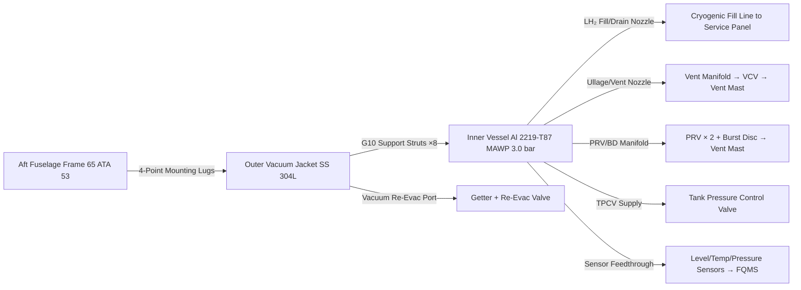
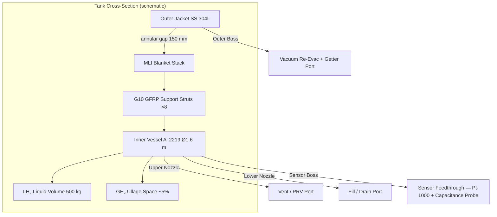

<!-- ──────────────────────────────────────────────────────────────────────────
     QATL-ATLAS-1000-ATLAS-070-079-07-076-010-LH2-TANK-ARCHITECTURE
     ATA 28 (LH₂) · LH₂ Tank Architecture
     AMPEL360E eWTW — ATLAS Register 1000
────────────────────────────────────────────────────────────────────────────── -->

# LH₂ Tank Architecture

---

## §0 Hyperlink Policy

> All hyperlinks in this document are **relative** (five directory levels: `../../../../../`).
> Absolute URLs are forbidden. Every linked document must exist in the Q+ATLANTIDE repository
> before the link is activated. Broken links are treated as open issues and must be resolved
> before the document is promoted from `DRAFT` to `APPROVED`.

---

## §1 Purpose

This document defines the physical architecture and structural design of the AMPEL360E eWTW LH₂ onboard storage tanks (Tank-A and Tank-B). It covers the inner vessel geometry and material, outer vacuum jacket configuration, fill/drain/vent port arrangement, support structure, and installation envelope within the aft fuselage, providing the physical basis upon which the insulation (076-020), pressure control (076-030), and all other subsubject designs are based.

---

## §2 Applicability

| Parameter | Value |
|---|---|
| Aircraft Program | AMPEL360E eWTW |
| ATA reference | ATA 28 (LH₂) — 076-010 LH₂ Tank Architecture |
| Certification basis | EASA CS-25 Amdt 27+; EASA CSH-2; EN 13458-2 |
| S1000D SNS | 076-010-00 |

---

## §3 Functional Description ![DRAFT]

Each LH₂ tank is a **vacuum-jacketed double-wall pressure vessel** of cylindrical form with hemispherical end caps, configured to minimise the surface-to-volume ratio (and hence heat ingress) within the available aft fuselage cross-section.

**Inner vessel:** Fabricated from **aluminium alloy 2219-T87** (selected for high fracture toughness at cryogenic temperatures and low hydrogen embrittlement susceptibility), the inner vessel has a design working pressure (MAWP) of **3.0 bar(a)** and a burst pressure of ≥ 6.0 bar(a). Wall thickness is sized per EN 13458-2 for the combined hoop and axial pressure loads plus flight structural loads transferred through the G10 GFRP support struts. The inner vessel inner diameter is approximately 1.6 m and overall cylindrical length approximately 3.5 m, giving an internal volume of ≈ 7.05 m³ per tank (useable LH₂ ≈ 500 kg at 70.8 kg/m³ saturation density, with 5 % ullage).

**Outer vacuum jacket:** A welded stainless steel (SS 304L) shell surrounds the inner vessel with a nominal annular gap of 150 mm on all sides, enclosing the MLI blanket stack and G10 support strut assemblies. The outer jacket is designed to maintain an internal vacuum of < 10⁻³ Pa (hard vacuum) achieved via a permanently sealed getter-based vacuum system with provision for a re-evacuation valve on the lower boss for maintenance.

**Fill / drain / vent ports:** All penetrations of the vacuum jacket are via **welded vacuum-tight feedthroughs** with bellows-type inner-vessel nozzles to eliminate direct conduction bridges. Port assignments per tank: (1) Cryogenic fill/drain nozzle (lower aft); (2) Ullage/vent nozzle (upper forward); (3) Liquid-level sensor feedthrough (upper aft); (4) PRV/burst disc manifold nozzle (upper); (5) TPCV supply nozzle; (6) Vacuum re-evacuation port (outer jacket boss).

**Support structure:** Four G10/GFRP (glass-fibre reinforced polymer) tension struts at each end-cap (total 8 per tank) suspend the inner vessel concentrically within the outer jacket. The strut geometry is designed for a combined thermal conductance ≤ 0.05 W/K total per tank, while transferring 1.5 g longitudinal and 3 g vertical ultimate loads from inner vessel to outer jacket mounting ring for flight structural compliance.

**Installation:** Tank-A (port) and Tank-B (starboard) are mounted side-by-side in the aft fuselage pressure-relief bay aft of Frame 65, bolted via four-point mounting lugs on each outer jacket to the primary aft fuselage structural frames (ATA 53). Access for ground servicing is via a single underbelly panel (Tank-A: lower port; Tank-B: lower starboard). Tank removal for depot maintenance requires removal of the aft fuselage pressure-relief bay lining and retraction aft on dedicated handling rails.

---

## §4 Functional Breakdown

| ID | Name | Description | Lead Division |
|---|---|---|---|
| F-001 | Inner vessel | Al 2219-T87 cylindrical vessel; MAWP 3.0 bar(a); 500 kg LH₂ useable | Q-GREENTECH |
| F-002 | Outer vacuum jacket | SS 304L welded shell; hard vacuum < 10⁻³ Pa; MLI annular gap 150 mm | Q-MECHANICS |
| F-003 | Port/nozzle arrangement | 6 vacuum-tight feedthrough ports per tank; bellows inner vessel nozzles | Q-MECHANICS |
| F-004 | G10 support struts | 8 per tank; thermal conductance ≤ 0.05 W/K total; 1.5 g / 3 g ultimate load rated | Q-MECHANICS |
| F-005 | Aft fuselage mounting | Four-point lugs on outer jacket; bolt-on to Frame 65 structure; handling rails | Q-AIR |

---

## §5 System Context — Mermaid Diagram

---

## §6 Internal Architecture — Mermaid Diagram

---

## §7 Components and LRUs

| Component | Part Number | Qty | Location | Maintenance Interval | Notes |
|---|---|---|---|---|---|
| Inner vessel — Al 2219-T87 (Tank-A) | IV-A-PN-TBD | 1 | Aft fuselage port | 6-year hydrostatic proof test; on condition | MAWP 3.0 bar(a); 7.05 m³ internal volume |
| Inner vessel — Al 2219-T87 (Tank-B) | IV-B-PN-TBD | 1 | Aft fuselage stbd | 6-year hydrostatic proof test; on condition | Identical to Tank-A |
| Outer vacuum jacket (Tank-A) | OJ-A-PN-TBD | 1 | Surrounding Tank-A inner vessel | Annual vacuum check; 6-year overhaul | SS 304L; 150 mm annular gap |
| Outer vacuum jacket (Tank-B) | OJ-B-PN-TBD | 1 | Surrounding Tank-B inner vessel | Annual vacuum check; 6-year overhaul | Identical to Tank-A jacket |
| G10 GFRP support strut assembly (×8) | STRUT-PN-TBD | 16 (8 per tank) | Inner vessel end caps | On condition; 6-year overhaul inspect | Thermal conductance ≤ 0.05 W/K total; tension loading |
| Bellows inner vessel fill/drain nozzle | FILL-NOZZLE-PN-TBD | 2 (1 per tank) | Lower aft nozzle boss | A-check visual; 2-year seal inspect | ISO 13985 compatible; cryogenic-rated bellows |
| Ullage/vent nozzle with feedthrough | VENT-NOZZLE-PN-TBD | 2 (1 per tank) | Upper forward nozzle boss | A-check visual | Vacuum-tight welded feedthrough |
| Outer jacket mounting lug set (×4) | MNT-LUG-PN-TBD | 2 sets | Outer jacket, Frame 65 bolted | 6-year inspection | Titanium alloy; 4-point symmetric |

---

## §8 Interfaces

| Interface Type | Connected System | Protocol / Medium | Data / Function |
|---|---|---|---|
| ATA 53 Fuselage | Aft fuselage primary structure Frame 65 | Bolt interface | Tank structural mounting; load path |
| 076-020 Cryogenic Insulation | MLI system and vacuum maintenance | Physical/thermal | Insulation performance within annular gap |
| 076-030 Tank Pressure Control | TPCV; PRV; burst disc; vent manifold | Fluid / mechanical | Pressure regulation and overpressure protection |
| 076-050 Hydrogen Quantity | Sensor feedthroughs for capacitance probes + Pt-1000 array | Electrical / mechanical | Level and temperature sensing for FQMS |
| 076-070 Service and Maintenance | Fill/drain coupling; vacuum re-evac port | Fluid / mechanical | Ground LH₂ fill; vacuum maintenance |
| ATA 75 Fuel Cell | PEMFC LH₂ feed line | Cryogenic supply line (vacuum-jacketed) | Hydrogen mass flow to fuel cell stacks |

---

## §9 Operating Modes

| Mode | Trigger | System State | Actions / Consequences |
|---|---|---|---|
| LH₂ full (post-fill) | Ground fill complete | Inner vessel 95 % full LH₂ by volume (500 kg); ullage 5 % GH₂ | Pressure stabilises at fill disconnect pressure; HSCMU arms |
| Cruise drain | PEMFC consuming LH₂ | LH₂ level decreases at 0.3–0.6 kg/min per tank | Inner vessel pressure maintained 1.5–2.5 bar(a) by TPCV |
| Low LH₂ | LH₂ mass < 50 kg per tank | FQMS triggers ECAM advisory | Crew alerted; fuel cell power management engaged |
| Empty | LH₂ mass = 0 | Inner vessel at GH₂ positive pressure | TPCV closes; GN₂ purge before maintenance access |
| Ground storage | Aircraft parked > 24 h | Boil-off raises pressure; VCV cycles to maintain pressure band | Controlled vent; LH₂ mass decreases at ≤ 0.25 %/day |

---

## §10 Performance and Budgets ![DRAFT]

| Parameter | Requirement | Target / Design Value | Status |
|---|---|---|---|
| Inner vessel MAWP | 3.0 bar(a) | 3.0 bar(a) | ![TBD] |
| Inner vessel burst pressure | ≥ 2× MAWP = 6.0 bar(a) | ≥ 6.5 bar(a) target | ![TBD] |
| Useable LH₂ per tank | ≥ 500 kg | 500 kg (95 % fill of 7.05 m³) | ![TBD] |
| Support strut thermal conductance | ≤ 0.05 W/K total per tank | ≤ 0.04 W/K target | ![TBD] |
| Inner vessel cryogenic fatigue life | ≥ 20 000 pressurisation cycles | ≥ 25 000 cycles target | ![TBD] |
| Outer jacket vacuum level | < 10⁻³ Pa | < 5 × 10⁻⁴ Pa target | ![TBD] |
| Tank mass (inner + jacket + struts, each) | ![TBD] | ![TBD] | ![TBD] |

---

## §11 Safety, Redundancy and Fault Tolerance

- Al 2219-T87 exhibits no brittle-to-ductile transition at cryogenic temperatures and is not susceptible to hydrogen embrittlement under LH₂ conditions; material selection is safety-primary.
- Inner vessel designed to EN 13458-2 Category III (highest pressure vessel category); fabrication, inspection, and testing per CE Pressure Equipment Directive PED 2014/68/EU.
- Dual PRVs per tank provide primary and backup pressure relief; burst disc is the final containment barrier (set at 2× MAWP).
- G10 GFRP struts in tension-only configuration: a strut fracture does not cause sudden inner vessel release; vessel remains supported by adjacent struts with HSCMU alarming on anomalous temperature gradient.
- Six penetration nozzles per tank are the only thermal bridging paths (mitigated by bellows design and vacuum feedthrough); all nozzles are leak-tested per EN 13458-2 before first fill.
- Tank-A and Tank-B are structurally isolated from each other; a single tank fault does not propagate to the other.

---

## §12 Maintenance and Diagnostics

| Task | Interval | Access | Special Tools |
|---|---|---|---|
| Outer jacket vacuum level check (residual gas analysis) | Annual | Vacuum test port on outer jacket boss | Quadrupole residual gas analyser |
| Nozzle bellows visual inspection (all 6 per tank) | A-check | Underbelly access panel | Borescope; mirror |
| Support strut visual and dimensional check | 6-year or on condition | Inner vessel access (tank removed) | Cryogenic caliper; go/no-go gauge |
| Hydrostatic proof test of inner vessel | 6-year overhaul | Workshop — tank removed from aircraft | Hydrostatic test rig; per EN 13458-2 |
| Outer jacket weld inspection (ultrasonic) | 6-year overhaul | Workshop | UT weld inspection kit |
| Mounting lug torque and crack inspection | C-check | Aft fuselage bay | Calibrated torque wrench; dye-penetrant kit |

---

## §13 Footprint

| Footprint Type | Parameter | Value | Notes |
|---|---|---|---|
| Physical | Inner vessel OD (each) | ≈ 1.6 m ID + wall | Al 2219-T87 wall TBD by detail design |
| Physical | Overall tank assembly OD (outer jacket) | ≈ 1.93 m | Inner vessel OD + 150 mm annular gap × 2 |
| Physical | Overall tank assembly length (each) | ≈ 3.8 m | Including hemispherical end caps and nozzle bosses |
| Physical | Tank installation location | Aft fuselage Frame 65, port and stbd | Side-by-side mounting |
| Mass | Inner vessel mass (each) | ![TBD] | Pending detail design |
| Mass | Outer jacket + struts assembly mass (each) | ![TBD] | Pending detail design |

---

## §14 Safety and Certification References ![DRAFT]

| Standard / Document | Title | Issuing Body | Applicability |
|---|---|---|---|
| EN 13458-2 | Cryogenic vessels — Static vacuum insulated vessels — design, fabrication, inspection and test | CEN | Inner vessel and outer jacket structural and pressure design |
| PED 2014/68/EU | Pressure Equipment Directive — Category III | EU | CE marking for MAWP 3.0 bar vessels > 1 L |
| EASA CSH-2 | Certification Specifications for Hydrogen | EASA | Hydrogen pressure vessel airworthiness |
| ASTM B247 | Standard Specification for Aluminium Alloy Die Forgings | ASTM | Al 2219-T87 material specification |
| NASA SP-8088 | Cryogenic Hydrogen — Loads on Structural Components | NASA | Background reference for cryogenic structural loading |

---

## §15 V&V Approach ![TBD]

| Phase | Method | Acceptance Criterion | Status |
|---|---|---|---|
| Design | FEA structural analysis — inner vessel under MAWP + 1.5 g / 3 g flight loads | Stress < 0.67 × yield (Al 2219 at 20 K) | ![TBD] |
| Design | Strut thermal analysis | Conductance ≤ 0.05 W/K total | ![TBD] |
| Unit test | Inner vessel hydraulic proof test (1.5× MAWP) | No leakage; no permanent deformation | ![TBD] |
| Unit test | Outer jacket vacuum leak test (He sniff) | Leak rate < 10⁻⁸ mbar·L/s | ![TBD] |
| Integration | First-fill cryogenic cool-down test | No anomalous temperature gradient; all nozzles leak-free | ![TBD] |
| Certification | CS-25 / CSH-2 structural and pressure vessel compliance | Full design documentation submitted and approved | ![TBD] |

---

## §16 Glossary

| Term | Definition |
|---|---|
| **MAWP** | Maximum Allowable Working Pressure — highest pressure at which the inner vessel is rated for continuous operation. |
| **Al 2219-T87** | Aluminium alloy 2219 in T87 temper — selected for cryogenic ductility, weldability, and hydrogen resistance. |
| **SS 304L** | Austenitic stainless steel 304 low-carbon — used for outer vacuum jacket for its weldability and vacuum compatibility. |
| **G10 GFRP** | Glass-fibre reinforced polymer Grade 10 — low thermal conductivity structural material for cryogenic tank support struts. |
| **Bellows nozzle** | Flexible metallic bellows fitting at vacuum jacket penetration — accommodates differential thermal contraction and prevents direct conduction bridge. |
| **Ullage** | Gas/vapour space above the liquid hydrogen surface inside the inner vessel (typically 5 % of inner volume). |
| **Getter** | Material inside the vacuum annular space that chemically absorbs residual gases to maintain hard vacuum over the service life. |

---

## §17 Open Issues

| ID | Description | Owner | Target |
|---|---|---|---|
| OI-076-010-001 | Confirm inner vessel wall thickness and mass by FEA analysis with OEM | Q-GREENTECH | 2026-Q4 |
| OI-076-010-002 | Define aft fuselage stringer cut-outs and local reinforcement at tank mounting Frame 65 (ATA 53 interface) | Q-MECHANICS | 2026-Q4 |
| OI-076-010-003 | Confirm getter type and lifetime (service life vs. vacuum re-evacuation cycle) with tank OEM | Q-GREENTECH | 2027-Q1 |

---

## §18 Status Legend

| Badge | Meaning |
|---|---|
| `![DRAFT]` | Section is drafted but not yet reviewed |
| `![TBD]` | Content not yet started — to be defined |
| `![To Be Completed]` | Partially complete — needs additional content |
| `![APPROVED]` | Reviewed and formally approved |

---

## §19 Related Documents (Siblings in this Subsection)

- [076-000](./076-000-Hydrogen-Fuel-Storage-Onboard-General.md)
- [076-020](./076-020-Cryogenic-Tank-Insulation-and-Supports.md)
- [076-030](./076-030-Tank-Pressure-Control-and-Venting.md)
- [076-040](./076-040-Boil-Off-Management.md)
- [076-050](./076-050-Hydrogen-Quantity-Indication-and-Sensing.md)
- [076-060](./076-060-Hydrogen-Storage-Safety-Zones-and-Leak-Detection.md)
- [076-070](./076-070-Hydrogen-Storage-Service-and-Maintenance.md)
- [076-080](./076-080-Hydrogen-Storage-Monitoring-Diagnostics-and-Control-Interfaces.md)
- [076-090](./076-090-S1000D-CSDB-Mapping-and-Traceability.md)

---

## §20 Change Log

| Rev | Date | Author | Description |
|---|---|---|---|
| 0.1 | 2026-05-12 | @copilot | Initial DRAFT — LH₂ tank physical architecture for AMPEL360E eWTW |
