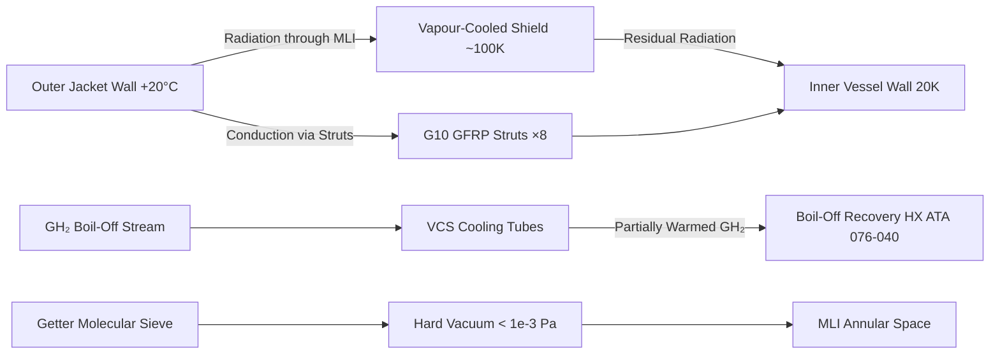
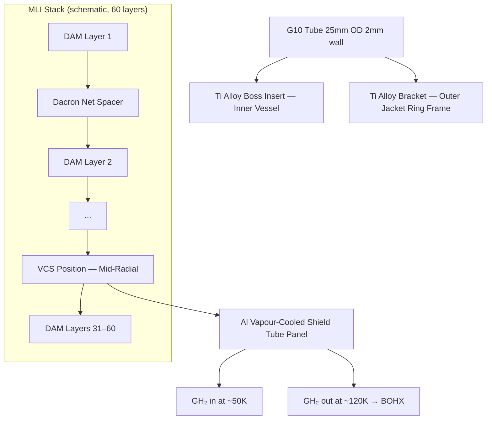

<!-- ──────────────────────────────────────────────────────────────────────────
     QATL-ATLAS-1000-ATLAS-070-079-07-076-020-CRYOGENIC-TANK-INSULATION-AND-SUPPORTS
     ATA 28 (LH₂) · Cryogenic Tank Insulation and Supports
     AMPEL360E eWTW — ATLAS Register 1000
────────────────────────────────────────────────────────────────────────────── -->

# Cryogenic Tank Insulation and Supports

---

## §0 Hyperlink Policy

> All hyperlinks in this document are **relative** (five directory levels: `../../../../../`).
> Absolute URLs are forbidden. Every linked document must exist in the Q+ATLANTIDE repository
> before the link is activated. Broken links are treated as open issues and must be resolved
> before the document is promoted from `DRAFT` to `APPROVED`.

---

## §1 Purpose

This document describes the cryogenic thermal insulation system and structural support arrangement for the AMPEL360E eWTW LH₂ storage tanks. The insulation system is the primary mechanism for minimising heat ingress from the ambient environment into the LH₂ at 20 K, thereby controlling the boil-off rate and maintaining the LH₂ at or below the MAWP without continuous venting. The support strut design simultaneously provides the mechanical load path between the cold inner vessel and the warm outer vacuum jacket while minimising parasitic heat conduction.

---

## §2 Applicability

| Parameter | Value |
|---|---|
| Aircraft Program | AMPEL360E eWTW |
| ATA reference | ATA 28 (LH₂) — 076-020 Cryogenic Tank Insulation and Supports |
| Certification basis | EASA CS-25 Amdt 27+; EASA CSH-2; EN 13458-2 |
| S1000D SNS | 076-020-00 |

---

## §3 Functional Description ![DRAFT]

**Multilayer Insulation (MLI):** The annular space (150 mm nominal) between the inner vessel and outer vacuum jacket is filled with **60 layers of double-aluminised Mylar (DAM) separated by Dacron net spacers**, constituting the MLI blanket. In hard vacuum (< 10⁻³ Pa), radiation is the dominant heat transfer mechanism across the MLI; the effective thermal conductivity under these conditions is ≈ 3 × 10⁻⁵ W/(m·K), giving a total static radiant heat leak of approximately **3.5 W per tank** at the design point (outer jacket at +20 °C, inner vessel at 20 K). The MLI blankets are precision-installed with carefully controlled layer density (8–10 layers/cm) and all seams overlapping to prevent radiation short-circuits at edges.

**Vapour-Cooled Shields (VCS):** A single intermediate **aluminium vapour-cooled radiation shield** is integrated into the MLI stack at the mid-radial position. The VCS is thermally connected to the LH₂ boil-off vapour stream; cold GH₂ flowing through the VCS tubes at ≈ 80–120 K intercepts a significant fraction of the radiant heat load before it reaches the inner vessel. The VCS reduces the effective heat leak at the inner vessel wall by approximately 35 % compared with a pure MLI system, at the cost of consuming approximately 10–15 % of the boil-off vapour flow.

**Vacuum maintenance (getter system):** A molecular sieve getter (zeolite + activated charcoal mix), permanently sealed within the annular vacuum space, adsorbs residual outgassing from the MLI blanket material over the service life of the tank. A dedicated re-evacuation port on the outer jacket lower boss allows vacuum recovery if the getter becomes saturated (anticipated > 15-year service life before first re-evacuation). Vacuum level is monitored indirectly via the tank heat leak; an anomalous boil-off increase triggers a vacuum integrity diagnostic.

**G10 GFRP Support Struts:** Eight struts per tank (four at each hemispherical end cap), fabricated from **G10/GFRP filament-wound tubes** (25 mm OD, 2 mm wall), are the only solid conduction path between the cold inner vessel (20 K) and the warm outer jacket (≈ ambient). Each strut operates in tension, attached via titanium alloy fittings to boss inserts on the inner vessel end caps (conical interface) and to strut brackets on the outer jacket ring frames. The strut length (≈ 300 mm) and cross-section are optimised to achieve a combined strut thermal conductance of ≤ 0.04 W/K per tank at the 20 K/ambient temperature differential, corresponding to a conductive heat leak contribution of ≤ 0.8 W per tank.

**Total heat budget:** The design-point static heat leak is ≤ 4.3 W per tank (3.5 W MLI radiation + 0.8 W strut conduction), driving a theoretical boil-off rate of ≈ 0.22 %/day per tank at full (500 kg LH₂). System design allocates ≤ 0.25 %/day per tank as the boil-off design allowance, providing margin for parasitic heat from penetration nozzles and weld interfaces.

---

## §4 Functional Breakdown

| ID | Name | Description | Lead Division |
|---|---|---|---|
| F-001 | MLI blanket (60 layers DAM/Dacron) | Primary radiant heat barrier in hard vacuum annular space | Q-GREENTECH |
| F-002 | Vapour-cooled radiation shield (VCS) | Aluminium intermediate shield cooled by boil-off GH₂; reduces heat leak ~35 % | Q-MECHANICS |
| F-003 | Getter system | Molecular sieve getter permanently sealed in vacuum annulus; re-evac port for maintenance | Q-MECHANICS |
| F-004 | G10 GFRP support struts (×8 per tank) | Structural support; combined thermal conductance ≤ 0.04 W/K per tank | Q-MECHANICS |
| F-005 | Titanium strut fittings | Boss inserts and bracket attachments for struts; thermal conductance minimised | Q-MECHANICS |

---

## §5 System Context — Mermaid Diagram

---

## §6 Internal Architecture — Mermaid Diagram

---

## §7 Components and LRUs

| Component | Part Number | Qty | Location | Maintenance Interval | Notes |
|---|---|---|---|---|---|
| MLI blanket assembly — Tank-A | MLI-A-PN-TBD | 1 | Annular space Tank-A | 6-year overhaul (tank removed) | 60-layer DAM/Dacron; installed under clean-room conditions |
| MLI blanket assembly — Tank-B | MLI-B-PN-TBD | 1 | Annular space Tank-B | 6-year overhaul (tank removed) | Identical to Tank-A |
| Vapour-cooled shield assembly — Tank-A | VCS-A-PN-TBD | 1 | Mid-radial position in MLI, Tank-A | 6-year overhaul | Aluminium 6061-T6 panel with integral GH₂ tubes |
| Vapour-cooled shield assembly — Tank-B | VCS-B-PN-TBD | 1 | Mid-radial position in MLI, Tank-B | 6-year overhaul | Identical to Tank-A |
| Getter cartridge (×2) | GETTER-PN-TBD | 2 (1 per tank) | Annular vacuum space lower boss | > 15-year life; replace at overhaul | Zeolite + activated charcoal; 500 g capacity |
| G10 GFRP strut assembly (×8 per tank) | STRUT-PN-TBD | 16 total | Inner vessel end cap bosses | 6-year overhaul inspect; on condition | Filament-wound G10; 25 mm OD; 300 mm length |
| Titanium strut fitting set (inner boss + outer bracket) | TI-FIT-PN-TBD | 16 sets | Strut ends at inner vessel / outer jacket | 6-year overhaul | Ti-6Al-4V; low thermal conductivity |

---

## §8 Interfaces

| Interface Type | Connected System | Protocol / Medium | Data / Function |
|---|---|---|---|
| 076-010 LH₂ Tank Architecture | Inner vessel and outer jacket structures | Physical / thermal | MLI and struts installed within the annular gap |
| 076-040 Boil-Off Management | Boil-off recovery system | GH₂ stream | VCS fed by boil-off GH₂; partially warmed vapour exits to BOHX |
| 076-080 HSCMU Monitoring | HSCMU heat leak trending | Sensor data (pressure, temp, boil-off rate) | Anomalous boil-off increase triggers vacuum integrity diagnostic |

---

## §9 Operating Modes

| Mode | Trigger | System State | Actions / Consequences |
|---|---|---|---|
| Normal (full LH₂) | Tank filled; aircraft in service | Hard vacuum maintained; MLI + VCS operative; heat leak ≤ 4.3 W | Boil-off ≤ 0.25 %/day; VCS cooling active |
| Boil-off ceased (PEMFC off) | Fuel cell stacks offline; no VCS flow | VCS passive (no GH₂ cooling flow) | MLI-only insulation; heat leak rises slightly; pressure increases faster; TPCV / VCV manages |
| Vacuum degraded | Getter saturation or micro-leak in outer jacket | Effective heat leak rises; boil-off rate increases | HSCMU flags anomalous boil-off; maintenance action triggered (vacuum check, re-evacuation) |
| MLI partial damage | Strut failure or installation defect | Local radiation short-circuit; increased regional heat leak | HSCMU anomalous local temperature gradient alarm; maintenance inspection of insulation |

---

## §10 Performance and Budgets ![DRAFT]

| Parameter | Requirement | Target / Design Value | Status |
|---|---|---|---|
| MLI effective thermal conductivity (hard vacuum) | ≤ 5 × 10⁻⁵ W/(m·K) | ≈ 3 × 10⁻⁵ W/(m·K) | ![TBD] |
| MLI layer count | 50–70 layers | 60 layers DAM/Dacron | ![TBD] |
| Total radiant heat leak per tank | ≤ 4.0 W | ≤ 3.5 W target | ![TBD] |
| VCS heat interception efficiency | ≥ 30 % | ≈ 35 % target | ![TBD] |
| Strut total thermal conductance per tank | ≤ 0.05 W/K | ≤ 0.04 W/K target | ![TBD] |
| Strut conductive heat leak per tank | ≤ 1.0 W | ≤ 0.8 W target | ![TBD] |
| Total heat leak per tank (design point) | ≤ 5.0 W | ≤ 4.3 W target | ![TBD] |
| Getter service life before re-evacuation | ≥ 15 years | ≥ 15 years | ![TBD] |

---

## §11 Safety, Redundancy and Fault Tolerance

- MLI performance is insensitive to single-layer damage; loss of one or two MLI layers produces negligible heat leak increase in a 60-layer stack.
- The VCS is a passive heat intercept during boil-off flow; its failure (blocked tube) increases heat leak at the inner vessel but does not cause a safety hazard — the boil-off management system (076-040) and pressure control system (076-030) handle the increased boil-off rate.
- Each of the eight struts supports independent load; a single strut fracture is structurally tolerated (remaining seven struts carry load with acceptable margin), and HSCMU alerts maintenance.
- Vacuum degradation (getter saturation) has a slow onset — boil-off rate increases over months, not instantaneously, giving the maintenance programme adequate time to schedule a vacuum re-evacuation before the PRV is challenged.
- All MLI and VCS work is performed under clean-room and dry-nitrogen atmosphere conditions to prevent moisture contamination of the MLI (moisture ice formation at 20 K would create conduction shorts).

---

## §12 Maintenance and Diagnostics

| Task | Interval | Access | Special Tools |
|---|---|---|---|
| Boil-off trend review for vacuum integrity | A-check (via HSCMU data) | CMS terminal | CMS GSE; HSCMU trend log |
| Outer jacket vacuum level measurement (residual gas analysis) | Annual | Vacuum test port (outer jacket lower boss) | Quadrupole residual gas analyser (RGA) |
| VCS GH₂ inlet/outlet temperature check | A-check | HSCMU data stream | No physical access needed |
| MLI visual inspection (accessible panels only) | C-check | Partial access via nozzle boss openings | Borescope; fibre optic light |
| Full MLI and VCS inspection / replacement | 6-year overhaul | Full tank removal; clean-room facility | MLI installation fixture; clean-room gloves; N₂ purge tent |
| G10 strut dimensional and crack check | 6-year overhaul | Inner vessel access (tank removed) | Cryogenic caliper; UV dye-penetrant for GFRP |
| Getter cartridge replacement | ≥ 15 years or on condition | Outer jacket vacuum boss access (tank removed) | Getter extraction tool; vacuum-rated cartridge |

---

## §13 Footprint

| Footprint Type | Parameter | Value | Notes |
|---|---|---|---|
| Thermal | Effective heat leak per tank (design) | ≤ 4.3 W | MLI + VCS + struts |
| Thermal | Boil-off rate (design point, full tank) | ≤ 0.25 %/day per tank | At +20 °C ambient, no active cooling |
| Physical | MLI blanket thickness | ≈ 90–100 mm | 60 layers at controlled density |
| Physical | G10 strut dimensions | 25 mm OD, 2 mm wall, 300 mm length | Per tank; 8 total |
| Mass | MLI + VCS assembly mass (each tank) | ![TBD] | Pending detail design |
| Mass | G10 strut assembly mass (per tank) | ![TBD] | Pending detail design |

---

## §14 Safety and Certification References ![DRAFT]

| Standard / Document | Title | Issuing Body | Applicability |
|---|---|---|---|
| EN 13458-2 | Cryogenic vessels — static — design, fabrication, inspection and test | CEN | Insulation and support system design basis |
| EASA CSH-2 | Certification Specifications for Hydrogen | EASA | Hydrogen airworthiness; heat leak and boil-off management |
| ASTM D709 | Standard Specification for Laminated Thermosetting Materials (G10 GFRP) | ASTM | G10 GFRP strut material specification |
| NASA-CR-2003-212609 | Multilayer Insulation Performance | NASA | Background reference for MLI effective conductivity |
| MIL-I-23586 | Insulation, Thermal, Cryogenic Service | US DoD | MLI installation and layer count reference |

---

## §15 V&V Approach ![TBD]

| Phase | Method | Acceptance Criterion | Status |
|---|---|---|---|
| Design | Thermal model (FEA/hand calc) for MLI + VCS + struts | Total heat leak ≤ 4.3 W per tank | ![TBD] |
| Unit test | MLI calorimeter test (representative panel sample) | Effective conductivity ≤ 3 × 10⁻⁵ W/(m·K) in hard vacuum | ![TBD] |
| Unit test | Strut thermal conductance measurement at cryogenic temperatures | Conductance ≤ 0.04 W/K per strut set | ![TBD] |
| Integration | First-fill boil-off rate measurement (24 h ground soak) | Boil-off ≤ 0.25 %/day | ![TBD] |
| Certification | CSH-2 cryogenic insulation performance compliance documentation | Full thermal budget analysis approved | ![TBD] |

---

## §16 Glossary

| Term | Definition |
|---|---|
| **MLI** | Multilayer Insulation — alternating layers of double-aluminised Mylar (DAM) and Dacron net spacers, effective only in hard vacuum. |
| **DAM** | Double-Aluminised Mylar — aluminised polyester film used as radiation-blocking layers in MLI. |
| **VCS** | Vapour-Cooled Shield — intermediate cryogenic radiation shield thermally coupled to the boil-off vapour stream to intercept heat before it reaches the LH₂. |
| **G10 GFRP** | Grade 10 glass-fibre reinforced polymer — low thermal conductivity (≈ 0.3 W/(m·K)) structural material for cryogenic support struts. |
| **Getter** | Adsorbent material (zeolite + activated charcoal) permanently sealed in the vacuum annulus to maintain hard vacuum by adsorbing outgassed molecules. |
| **Heat leak** | Total parasitic heat ingress from ambient into the LH₂ through all paths (radiation, conduction, convection — convection is zero in hard vacuum). |
| **Boil-off rate** | Rate of hydrogen mass lost as GH₂ vapour per unit time, expressed as % of tank LH₂ mass per day. |

---

## §17 Open Issues

| ID | Description | Owner | Target |
|---|---|---|---|
| OI-076-020-001 | Confirm VCS tube routing path and GH₂ flow rate allocation from boil-off stream (interface with 076-040) | Q-GREENTECH | 2026-Q4 |
| OI-076-020-002 | Validate MLI layer count and effective conductivity with full-scale calorimeter test at OEM | Q-MECHANICS | 2027-Q1 |
| OI-076-020-003 | Define clean-room facility requirements for MLI installation at MRO level (6-year overhaul) | Q-MECHANICS | 2027-Q2 |

---

## §18 Status Legend

| Badge | Meaning |
|---|---|
| `![DRAFT]` | Section is drafted but not yet reviewed |
| `![TBD]` | Content not yet started — to be defined |
| `![To Be Completed]` | Partially complete — needs additional content |
| `![APPROVED]` | Reviewed and formally approved |

---

## §19 Related Documents (Siblings in this Subsection)

- [076-000](./076-000-Hydrogen-Fuel-Storage-Onboard-General.md)
- [076-010](./076-010-LH2-Tank-Architecture.md)
- [076-030](./076-030-Tank-Pressure-Control-and-Venting.md)
- [076-040](./076-040-Boil-Off-Management.md)
- [076-050](./076-050-Hydrogen-Quantity-Indication-and-Sensing.md)
- [076-060](./076-060-Hydrogen-Storage-Safety-Zones-and-Leak-Detection.md)
- [076-070](./076-070-Hydrogen-Storage-Service-and-Maintenance.md)
- [076-080](./076-080-Hydrogen-Storage-Monitoring-Diagnostics-and-Control-Interfaces.md)
- [076-090](./076-090-S1000D-CSDB-Mapping-and-Traceability.md)

---

## §20 Change Log

| Rev | Date | Author | Description |
|---|---|---|---|
| 0.1 | 2026-05-12 | @copilot | Initial DRAFT — cryogenic insulation MLI/VCS/strut system for AMPEL360E eWTW LH₂ tanks |
