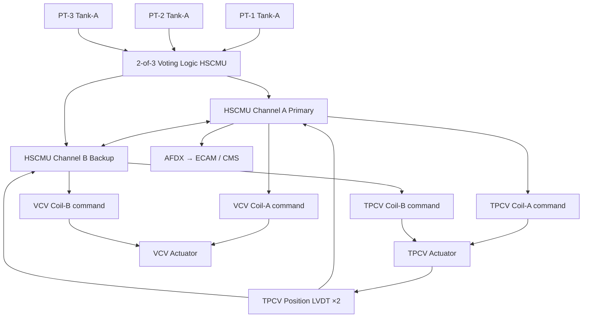

<!-- ──────────────────────────────────────────────────────────────────────────
     QATL-ATLAS-1000-ATLAS-070-079-07-076-030-TANK-PRESSURE-CONTROL-AND-VENTING
     ATA 28 (LH₂) · Tank Pressure Control and Venting
     AMPEL360E eWTW — ATLAS Register 1000
────────────────────────────────────────────────────────────────────────────── -->

# Tank Pressure Control and Venting


---

## §0 Hyperlink Policy

> All hyperlinks in this document are **relative** (five directory levels: `../../../../../`).
> Absolute URLs are forbidden. Every linked document must exist in the Q+ATLANTIDE repository
> before the link is activated. Broken links are treated as open issues and must be resolved
> before the document is promoted from `DRAFT` to `APPROVED`.

---

## §1 Purpose

This document describes the tank pressure control and venting architecture for the AMPEL360E eWTW LH₂ storage system. It covers the normal operating pressure band, the Tank Pressure Control Valve (TPCV) modulation logic managed by the HSCMU, the Vent Control Valve (VCV) and vent manifold routing to the aft vent mast, and the multi-layer overpressure protection system (PRVs and burst discs) that prevents tank overpressure under all failure conditions, including HSCMU fault, stuck-closed TPCV, or prolonged ground hold without servicing.

---

## §2 Applicability

| Parameter | Value |
|---|---|
| Aircraft Program | AMPEL360E eWTW |
| ATA reference | ATA 28 (LH₂) — 076-030 Tank Pressure Control and Venting |
| Certification basis | EASA CS-25 Amdt 27+; EASA CSH-2; EN ISO 4126-1 (PRV); EN 13458-2 |
| S1000D SNS | 076-030-00 |

---

## §3 Functional Description ![DRAFT]

**Normal operating pressure band:** The LH₂ inner vessel operates between a **lower pressure limit of 1.2 bar(a)** (below which cavitation risk in the PEMFC feed pump increases) and an **upper normal limit of 2.5 bar(a)** (above which the HSCMU initiates a controlled vent). The cruise design-point pressure is 1.5–2.0 bar(a), consistent with the LH₂ saturation curve at the fuel cell supply temperature range.

**Tank Pressure Control Valve (TPCV):** Each tank has one **normally-closed cryogenic solenoid TPCV** mounted on the ullage nozzle (upper nozzle boss). The TPCV modulates between fully-closed (pressure below operating band) and fully-open (pressure at or above the upper normal limit), routing GH₂ boil-off to the **boil-off recovery heat exchanger** (BOHX, ATA 076-040) and thence to the PEMFC anode feed. TPCV opening is commanded by HSCMU Channel A (primary) and Channel B (backup), with independent redundant coil sets. TPCV position feedback is via redundant LVDTs to both HSCMU channels.

**Vent Control Valve (VCV):** A **normally-closed cryogenic solenoid VCV** downstream of the TPCV diverts boil-off GH₂ to the **aft vent manifold** when the PEMFC cannot accept additional hydrogen (e.g., fuel cell offline during cruise or PEMFC shutdown). The VCV is opened when tank pressure rises above 3.0 bar(a) (HSCMU command) or if the BOHX circuit is saturated. Vented GH₂ is routed through vacuum-jacketed stainless steel tubing to the **aft vent mast**, which discharges GH₂ ≥ 2 m above the highest aircraft surface in the aft section, oriented athwartship to prevent recirculation into the fuselage. The vent mast incorporates an **electrostatic discharge (ESD) grounding strip** and a **rain/ice exclusion screen**.

**Pressure Relief Valve (PRV) system:** Two independent mechanical spring-loaded PRVs (PRV-1 and PRV-2) per tank are mounted in parallel on the PRV manifold nozzle and are the passive primary overpressure protection. Each PRV is set to open at **4.5 ± 0.1 bar(a)** (1.5× MAWP = 4.5 bar ≥ 1.5 × 3.0 bar MAWP) per EN ISO 4126-1 and re-seats below 4.0 bar(a). Both PRVs vent to the aft vent mast via the PRV vent line. The PRV-1/PRV-2 parallel configuration ensures pressure relief capacity even if one PRV fails to open (jamming) or fails stuck-open (leaking); HSCMU monitors seat leakage via tank pressure trend.

**Burst disc:** A **rupture disc assembly** rated at **6.0 ± 0.3 bar(a)** is installed in series with the PRV vent line (between the PRV outlets and the vent mast) as the final containment barrier. The burst disc activation is a non-reversible single-event protection; activation triggers an ECAM warning and grounds the aircraft for burst disc replacement before the next flight.

**Pressure measurement:** Each tank has three independent cryogenic pressure transducers (PT-1, PT-2, PT-3) measuring inner vessel pressure with ±0.02 bar accuracy, voting 2-of-3 for HSCMU control decisions and ECAM display.

---

## §4 Functional Breakdown

| ID | Name | Description | Lead Division |
|---|---|---|---|
| F-001 | TPCV (×2) | Normally-closed cryogenic solenoid; modulates GH₂ flow to BOHX; HSCMU commanded | Q-GREENTECH |
| F-002 | VCV (×2) | Normally-closed cryogenic solenoid; diverts GH₂ to aft vent mast; HSCMU commanded | Q-GREENTECH |
| F-003 | PRV pair (×4 total, 2 per tank) | Mechanical spring PRV set at 4.5 bar(a); parallel redundant per tank; vent to aft mast | Q-MECHANICS |
| F-004 | Burst disc (×2 total, 1 per tank) | Rupture disc rated 6.0 bar(a); final containment barrier; non-reversible | Q-MECHANICS |
| F-005 | Pressure transducer array (3 per tank) | Redundant PT 2-of-3 vote; HSCMU control and ECAM display input | Q-HPC |
| F-006 | Aft vent mast | GH₂ discharge point ≥ 2 m above aft fuselage; ESD strip; rain/ice screen | Q-AIR |

---

## §5 System Context — Mermaid Diagram

```mermaid
flowchart LR
    INNER_VESSEL[Inner Vessel LH₂ 1.2–2.5 bar(a)] --> ULLAGE[Ullage GH₂]
    ULLAGE --> TPCV[TPCV normally-closed]
    TPCV --> BOHX[Boil-Off Recovery HX 076-040]
    ULLAGE --> VCV[VCV normally-closed]
    VCV --> VENT_MANIFOLD[Vent Manifold]
    ULLAGE --> PRV_MANIFOLD[PRV Manifold Nozzle]
    PRV_MANIFOLD --> PRV1[PRV-1 4.5 bar]
    PRV_MANIFOLD --> PRV2[PRV-2 4.5 bar]
    PRV1 --> PRV_VENT[PRV Vent Line]
    PRV2 --> PRV_VENT
    PRV_VENT --> BURST_DISC[Burst Disc 6.0 bar]
    BURST_DISC --> VENT_MAST[Aft Vent Mast]
    VENT_MANIFOLD --> VENT_MAST
    HSCMU[HSCMU Dual-Channel] --> TPCV
    HSCMU --> VCV
    PT1[PT-1] --> HSCMU
    PT2[PT-2] --> HSCMU
    PT3[PT-3] --> HSCMU
    HSCMU --> ECAM[ECAM ATA 31]
```

---

## §6 Internal Architecture — Mermaid Diagram



---

## §7 Components and LRUs

| Component | Part Number | Qty | Location | Maintenance Interval | Notes |
|---|---|---|---|---|---|
| TPCV Tank Pressure Control Valve (Tank-A) | TPCV-A-PN-TBD | 1 | Tank-A ullage nozzle boss | A-check operational test; 2-year seal inspect | Cryogenic solenoid; normally closed; dual coil |
| TPCV Tank Pressure Control Valve (Tank-B) | TPCV-B-PN-TBD | 1 | Tank-B ullage nozzle boss | A-check operational test; 2-year seal inspect | Identical to TPCV-A |
| VCV Vent Control Valve (Tank-A) | VCV-A-PN-TBD | 1 | Vent manifold, Tank-A branch | A-check operational test | Cryogenic solenoid; normally closed; ATEX rated |
| VCV Vent Control Valve (Tank-B) | VCV-B-PN-TBD | 1 | Vent manifold, Tank-B branch | A-check operational test | Identical to VCV-A |
| PRV Pressure Relief Valve (×4) | PRV-PN-TBD | 4 (2 per tank) | PRV manifold nozzle, each tank | Annual recertification | Set pressure 4.5 ± 0.1 bar(a); EN ISO 4126-1 |
| Burst Disc Assembly (×2) | BD-PN-TBD | 2 (1 per tank) | PRV vent line, downstream of PRV pair | Replace after activation; annual visual inspect | Rated 6.0 ± 0.3 bar(a); non-reversible |
| Cryogenic Pressure Transducer (×6) | PT-PN-TBD | 6 (3 per tank) | Inner vessel pressure port | Annual calibration | ±0.02 bar; 0–10 bar range; cryogenic-rated |
| Aft Vent Mast Assembly | VENT-MAST-PN-TBD | 1 | Aft upper fuselage centreline | Annual inspection; ice exclusion screen clean | GH₂ discharge ≥ 2 m above fuselage; ESD strip |
| TPCV Position LVDT (×4) | LVDT-PN-TBD | 4 (2 per TPCV) | TPCV actuator | 2-year calibration verify | Redundant pair per TPCV; ±0.5 % accuracy |

---

## §8 Interfaces

| Interface Type | Connected System | Protocol / Medium | Data / Function |
|---|---|---|---|
| 076-040 Boil-Off Management | BOHX heat exchanger | GH₂ supply line | TPCV output feeds BOHX for boil-off recovery |
| 076-080 HSCMU Monitoring | HSCMU dual-channel | AFDX + direct valve wiring | TPCV/VCV command and LVDT feedback; PT data |
| ATA 75 Fuel Cell | PEMFC anode feed | GH₂ supply from BOHX | Warmed GH₂ from boil-off delivered to PEMFC |
| ATA 31 ECAM | Cockpit display | AFDX | Tank pressure display; vent and PRV event warnings |
| ATA 45 CMS | Central Maintenance System | AFDX | TPCV/VCV/PRV event logs; pressure trend data |
| ATA 21 ECS | Tank bay ventilation | Ventilation air | Tank bay kept at positive pressure to minimise H₂ leak accumulation |

---

## §9 Operating Modes

| Mode | Trigger | System State | Actions / Consequences |
|---|---|---|---|
| Normal pressure control | Pressure 1.2–2.5 bar(a) | TPCV modulating; VCV closed | Boil-off GH₂ routed to BOHX; PEMFC consumes hydrogen |
| Controlled vent | Pressure ≥ 3.0 bar(a) or BOHX saturated | VCV opens to vent mast; TPCV closes or modulates | GH₂ vented to aft mast; ECAM advisory; mass loss logged |
| PRV activation | Pressure ≥ 4.5 bar(a) — VCV/HSCMU failure | PRV opens mechanically | Emergency GH₂ vent to aft mast; ECAM warning; landing required |
| Burst disc activation | Pressure ≥ 6.0 bar(a) — PRV failure | Burst disc ruptures; full vent capacity | Aircraft grounded; burst disc replacement before next flight |
| PEMFC offline / ground hold | Fuel cells shut down; VCV available | VCV cycles to maintain pressure < 3.0 bar(a); vent to ground vent receptacle | Controlled venting; hydrogen mass decreases; ground handling per SOPs |
| LOTO / maintenance | Aircraft grounded; tank maintenance | TPCV closed; HSCMU commands GN₂ purge before access | Tank atmosphere < 1 % H₂ confirmed before any physical work |

---

## §10 Performance and Budgets ![DRAFT]

| Parameter | Requirement | Target / Design Value | Status |
|---|---|---|---|
| Normal operating pressure band | 1.2–2.5 bar(a) | 1.5–2.0 bar(a) cruise | ![TBD] |
| TPCV response time (open/close) | ≤ 500 ms | ≤ 300 ms target | ![TBD] |
| TPCV leakage rate (closed) | ≤ 10⁻⁵ mbar·L/s GH₂ | ≤ 10⁻⁶ mbar·L/s target | ![TBD] |
| PRV set pressure accuracy | 4.5 ± 0.1 bar(a) | 4.5 bar(a) | ![TBD] |
| PRV re-seat pressure | ≥ 4.0 bar(a) | 4.0–4.2 bar(a) | ![TBD] |
| Burst disc rated pressure | 6.0 ± 0.3 bar(a) | 6.0 bar(a) | ![TBD] |
| Pressure transducer accuracy | ± 0.05 bar | ± 0.02 bar | ![TBD] |
| Vent mast discharge height | ≥ 2 m above fuselage | ≥ 2.2 m target | ![TBD] |

---

## §11 Safety, Redundancy and Fault Tolerance

- Three-layer overpressure protection: (1) HSCMU-commanded VCV controlled vent, (2) dual independent PRVs (mechanical), (3) burst disc (mechanical, final containment).
- TPCV dual coil (Channel A + Channel B) — loss of one HSCMU channel does not prevent TPCV operation.
- PRV-1 and PRV-2 parallel configuration: single PRV stuck-closed or stuck-open does not compromise overall pressure relief capacity.
- Burst disc failure to operate (stick-open) scenario: burst disc is passive and rated to open before the inner vessel pressure reaches its structural limit; a stuck-open burst disc is a maintenance defect, not a safety hazard, as it routes GH₂ to the vent mast.
- Aft vent mast designed to preclude GH₂ accumulation on any aircraft surface; vent direction and height validated by CFD diffusion analysis per CSH-2.
- All GH₂ vent paths are stainless steel with ATEX-rated seals; no aluminium alloy components in the vent lines (hydrogen embrittlement mitigation).
- Loss of all pressure control capability (HSCMU failure + VCV stuck-closed + TPCV stuck-closed) is mitigated by the passive PRV system; this scenario is demonstrated Extremely Improbable per FHA.

---

## §12 Maintenance and Diagnostics

| Task | Interval | Access | Special Tools |
|---|---|---|---|
| TPCV and VCV operational test (each) | A-check | HSCMU GSE command | HSCMU GSE console |
| Pressure transducer calibration check (all 6) | Annual | Tank-A/B access panels | Calibrated pressure reference (0–10 bar) |
| PRV set-point recertification (all 4) | Annual | PRV nozzle access panel | Certified PRV test rig; calibrated spring scale |
| Burst disc condition inspection | Annual | PRV vent line access | Visual; replace if any deformation |
| Vent mast inspection (rain screen; ESD strip; corrosion) | A-check | External aft fuselage | Ladder / platform; mirror |
| TPCV LVDT calibration verify | 2-year | TPCV actuator | LVDT calibration kit |
| PRV vent line leak check (GHe sniff) | C-check | PRV vent line access panel | Helium leak detector |

---

## §13 Footprint

| Footprint Type | Parameter | Value | Notes |
|---|---|---|---|
| Physical | TPCV envelope | ![TBD] | Cryogenic solenoid body; OEM design |
| Physical | PRV body (each) | ![TBD] | EN ISO 4126-1 rated; OEM selection |
| Fluid | Max controlled vent flow rate (per VCV) | ![TBD] | Sized for worst-case boil-off + heat soak scenario |
| Fluid | PRV relief capacity (per pair) | ![TBD] | Sized for worst-case heat soak at maximum fire load |
| Maintenance | PRV recertification time | ≈ 4 h (all 4 PRVs) | Off-aircraft test rig |

---

## §14 Safety and Certification References ![DRAFT]

| Standard / Document | Title | Issuing Body | Applicability |
|---|---|---|---|
| EASA CSH-2 | Certification Specifications for Hydrogen | EASA | Overpressure protection and vent system requirements |
| EN ISO 4126-1 | Safety devices for protection against excessive pressure — safety valves | ISO / CEN | PRV design and set-pressure accuracy |
| EN 13458-2 | Cryogenic vessels — static | CEN | Overpressure protection design basis |
| ISO 21013-3 | Cryogenic vessels — pressure relief fittings for non-transportable vessels | ISO | PRV and burst disc configuration requirements |
| ATEX Directive 2014/34/EU | Equipment and protective systems in explosive atmospheres | EU | ATEX compliance for TPCV, VCV, PRV, vent mast fittings |
| SAE ARP1870 | Aerospace Systems Electrical Bonding and Grounding | SAE | ESD grounding for vent mast |

---

## §15 V&V Approach ![TBD]

| Phase | Method | Acceptance Criterion | Status |
|---|---|---|---|
| Design | PRV vent capacity analysis (worst-case fire scenario) | PRV flow capacity prevents inner vessel from exceeding burst disc pressure | ![TBD] |
| Unit test | TPCV response time and leakage test (cryogenic bench) | Response ≤ 300 ms; leakage ≤ 10⁻⁶ mbar·L/s | ![TBD] |
| Unit test | PRV set-point test (all 4 PRVs) | Activation 4.5 ± 0.1 bar(a) | ![TBD] |
| Integration | Functional test — full pressure control sequence (fill → cruise → controlled vent → PRV activation) | All valves respond correctly; vent mast discharge confirmed | ![TBD] |
| Certification | CSH-2 overpressure protection compliance review | Three-layer protection demonstrated; FHA approved | ![TBD] |

---

## §16 Glossary

| Term | Definition |
|---|---|
| **TPCV** | Tank Pressure Control Valve — normally-closed cryogenic solenoid modulating GH₂ flow to the BOHX. |
| **VCV** | Vent Control Valve — normally-closed cryogenic solenoid diverting excess GH₂ to the aft vent mast. |
| **PRV** | Pressure Relief Valve — mechanical spring-loaded valve opening at 4.5 bar(a) for passive overpressure protection. |
| **MAWP** | Maximum Allowable Working Pressure — 3.0 bar(a) for the AMPEL360E eWTW LH₂ inner vessel. |
| **Burst disc** | Non-reseating rupture membrane, rated 6.0 bar(a); ultimate containment barrier. |
| **LVDT** | Linear Variable Differential Transducer — position feedback sensor on the TPCV actuator. |
| **ESD** | Electrostatic Discharge — static charge grounding required on vent mast to prevent ignition of discharged GH₂. |

---

## §17 Open Issues

| ID | Description | Owner | Target |
|---|---|---|---|
| OI-076-030-001 | Confirm PRV vent capacity (flow rate at 4.5 bar(a)) covers worst-case fire scenario heat soak rate | Q-GREENTECH / Safety | 2026-Q4 |
| OI-076-030-002 | Complete CFD diffusion analysis for aft vent mast GH₂ discharge; confirm no accumulation on fuselage surfaces | Q-AIR | 2027-Q1 |
| OI-076-030-003 | Define TPCV cryogenic seal material (PTFE vs. PCTFE) and qualification test plan at 20 K | Q-MECHANICS | 2026-Q4 |

---

## §18 Status Legend

| Badge | Meaning |
|---|---|
| `![DRAFT]` | Section is drafted but not yet reviewed |
| `![TBD]` | Content not yet started — to be defined |
| `![To Be Completed]` | Partially complete — needs additional content |
| `![APPROVED]` | Reviewed and formally approved |

---

## §19 Related Documents (Siblings in this Subsection)

- [076-000](./076-000-Hydrogen-Fuel-Storage-Onboard-General.md)
- [076-010](./076-010-LH2-Tank-Architecture.md)
- [076-020](./076-020-Cryogenic-Tank-Insulation-and-Supports.md)
- [076-040](./076-040-Boil-Off-Management.md)
- [076-050](./076-050-Hydrogen-Quantity-Indication-and-Sensing.md)
- [076-060](./076-060-Hydrogen-Storage-Safety-Zones-and-Leak-Detection.md)
- [076-070](./076-070-Hydrogen-Storage-Service-and-Maintenance.md)
- [076-080](./076-080-Hydrogen-Storage-Monitoring-Diagnostics-and-Control-Interfaces.md)
- [076-090](./076-090-S1000D-CSDB-Mapping-and-Traceability.md)

---

## §20 Change Log

| Rev | Date | Author | Description |
|---|---|---|---|
| 0.1 | 2026-05-12 | @copilot | Initial DRAFT — tank pressure control (TPCV/VCV/PRV/burst disc) for AMPEL360E eWTW LH₂ system |
