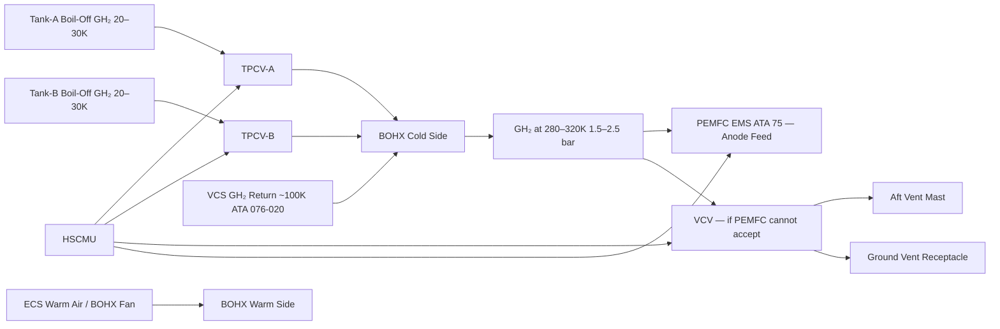
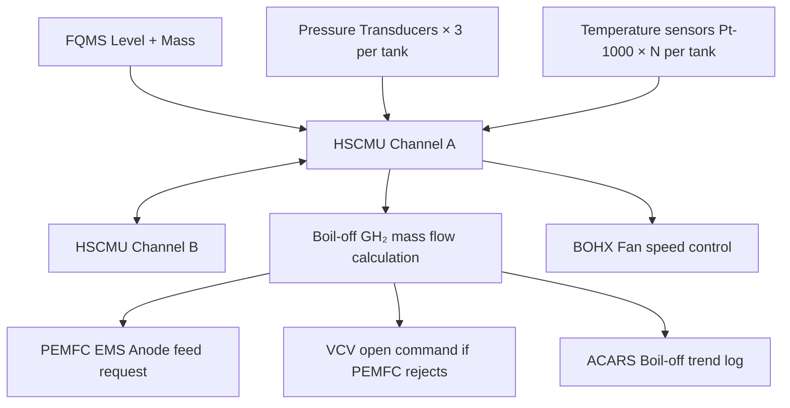

<!-- ──────────────────────────────────────────────────────────────────────────
     QATL-ATLAS-1000-ATLAS-070-079-07-076-040-BOIL-OFF-MANAGEMENT
     ATA 28 (LH₂) · Boil-Off Management
     AMPEL360E eWTW — ATLAS Register 1000
────────────────────────────────────────────────────────────────────────────── -->

# Boil-Off Management

---

## §0 Hyperlink Policy

> All hyperlinks in this document are **relative** (five directory levels: `../../../../../`).
> Absolute URLs are forbidden. Every linked document must exist in the Q+ATLANTIDE repository
> before the link is activated. Broken links are treated as open issues and must be resolved
> before the document is promoted from `DRAFT` to `APPROVED`.

---

## §1 Purpose

This document describes the boil-off management system for the AMPEL360E eWTW LH₂ storage tanks. Boil-off — the phase change of liquid hydrogen to gaseous hydrogen driven by parasitic heat ingress through the tank insulation — is an inherent characteristic of cryogenic LH₂ storage. The boil-off management system maximises hydrogen utilisation by recovering boil-off vapour for delivery to the PEMFC anode feed (via the Boil-Off Recovery Heat Exchanger, BOHX), and manages residual unrecoverable boil-off via controlled venting, thereby minimising wasted hydrogen mass across all phases of flight and ground operations.

---

## §2 Applicability

| Parameter | Value |
|---|---|
| Aircraft Program | AMPEL360E eWTW |
| ATA reference | ATA 28 (LH₂) — 076-040 Boil-Off Management |
| Certification basis | EASA CS-25 Amdt 27+; EASA CSH-2 |
| S1000D SNS | 076-040-00 |

---

## §3 Functional Description ![DRAFT]

**Boil-off generation:** The passive heat leak into each LH₂ tank (≤ 4.3 W per tank as specified in 076-020) vaporises a fraction of the LH₂ at the liquid surface. At the design point (500 kg LH₂, 1.5 bar(a), 20.3 K saturation), the latent heat of vaporisation of LH₂ is approximately 446 J/g, yielding a boil-off mass flow rate of approximately **0.035 g/s per tank** (≈ 127 g/h per tank, or 0.025 % of full tank mass per hour = 0.60 kg/day ≤ 0.25 %/day of 500 kg). Both tanks combined generate approximately **1.2 kg/day boil-off GH₂** under ground hold conditions.

**Boil-Off Recovery Heat Exchanger (BOHX):** The primary boil-off management element is the **BOHX**, a plate-fin aluminium cryogenic heat exchanger located in the aft pylon region. Cold boil-off GH₂ from both tanks (exiting the TPCV at 20–30 K, 1.5–2.5 bar(a)) passes through the BOHX on the cold side; warm air from the ECS conditioned supply or a dedicated BOHX fan circuit flows on the warm side. The BOHX warms the GH₂ to approximately **280–320 K** at pressures compatible with the PEMFC anode inlet conditions (1.5–2.5 bar(a)), enabling the GH₂ to be delivered directly to the PEMFC fuel processor without further temperature conditioning. The BOHX also provides the thermal interface for the **Vapour-Cooled Shield (VCS)** GH₂ circuit return (076-020).

**Boil-off utilisation strategy:** The PEMFC Energy Management System (ATA 75) is designed to consume the continuous boil-off GH₂ stream preferentially before drawing additional liquid-phase hydrogen from the feed lines, maximising utilisation. The HSCMU communicates the boil-off GH₂ available (mass flow rate derived from FQMS data and tank pressure trending) to the PEMFC EMS to allow it to adjust anode supply accordingly. Under typical cruise conditions, the PEMFC hydrogen consumption (~20 g/s per stack at rated power) far exceeds the boil-off rate (~0.07 g/s combined), so the boil-off stream is a minor supplementary feed.

**Residual boil-off vent path:** If the PEMFC cannot accept additional hydrogen (fuel cell offline, anode inlet saturated, or BOHX warm-side flow failed), the HSCMU opens the VCV (076-030) to route accumulated GH₂ to the aft vent mast. This controlled vent is logged and transmitted to ACARS for ground trending. On the ground during extended parking (> 4 h), the BOHX warm-side fan is electrically powered from the Ground Power Unit (GPU) to sustain recovery; beyond 24 h, venting to a ground vent receptacle (ISO 13985 compatible) is the preferred strategy to minimise hydrogen loss to atmosphere.

**Active boil-off minimisation (optional future growth):** A recondenser/re-liquefaction option (cryocooler circuit) has been reserved in the system architecture as a future growth feature for extended ground hold scenarios. This is not part of the EIS (Entry Into Service) configuration.

---

## §4 Functional Breakdown

| ID | Name | Description | Lead Division |
|---|---|---|---|
| F-001 | BOHX — Boil-Off Recovery Heat Exchanger | Plate-fin cryogenic HX; warms GH₂ from 20–30 K to 280–320 K for PEMFC delivery | Q-GREENTECH |
| F-002 | BOHX warm-side fan | ECS or dedicated fan provides warm-side air flow to BOHX; GPU powered on ground | Q-MECHANICS |
| F-003 | HSCMU boil-off flow metering | Boil-off GH₂ mass flow derived from FQMS + tank pressure trend; reported to PEMFC EMS | Q-HPC |
| F-004 | Boil-off utilisation logic | PEMFC EMS preferentially consumes boil-off GH₂ before drawing liquid-phase feed | Q-HPC |
| F-005 | Residual vent path | VCV opens to aft vent mast when PEMFC cannot accept boil-off; HSCMU commanded | Q-GREENTECH |
| F-006 | Ground vent receptacle interface | ISO 13985 compatible GH₂ vent receptacle for extended ground hold hydrogen capture | Q-AIR |

---

## §5 System Context — Mermaid Diagram

---

## §6 Internal Architecture — Mermaid Diagram

---

## §7 Components and LRUs

| Component | Part Number | Qty | Location | Maintenance Interval | Notes |
|---|---|---|---|---|---|
| BOHX Boil-Off Recovery Heat Exchanger | BOHX-PN-TBD | 1 | Aft pylon / fuselage interface | C-check effectiveness test (ΔT and ΔP) | Plate-fin Al 6061; cold side: 20–320 K cryogenic-rated |
| BOHX warm-side fan assembly | BOHXFAN-PN-TBD | 1 | BOHX warm-side duct | A-check visual; C-check bearing inspect | Electrically powered; GPU compatible; ATEX rated |
| BOHX cold-side inlet temperature sensor (Pt-1000) | TT-BOHX-IN-PN-TBD | 2 | BOHX cold-side inlet nozzle | Annual calibration | Cryogenic Pt-1000; redundant pair |
| BOHX cold-side outlet temperature sensor (Pt-1000) | TT-BOHX-OUT-PN-TBD | 2 | BOHX cold-side outlet nozzle | Annual calibration | Cryogenic Pt-1000; redundant pair |
| GH₂ boil-off mass flow meter | MFM-PN-TBD | 2 (1 per tank TPCV outlet) | TPCV outlet to BOHX | 2-year calibration | Coriolis or thermal mass flow meter; cryogenic-rated |
| Ground vent receptacle (ISO 13985) | GVR-PN-TBD | 1 | Aft belly service panel | Annual seal inspect | Connects to ground H₂ capture system for extended parking |

---

## §8 Interfaces

| Interface Type | Connected System | Protocol / Medium | Data / Function |
|---|---|---|---|
| 076-030 Tank Pressure Control | TPCV (per tank) | GH₂ fluid line | TPCV output feeds BOHX cold-side inlet |
| 076-020 Cryogenic Insulation | VCS circuit | GH₂ vapour return | VCS return GH₂ (≈ 100 K) enters BOHX cold side |
| ATA 75 Fuel Cell | PEMFC EMS — anode feed | AFDX + GH₂ supply line | Warmed boil-off GH₂ delivered to PEMFC anode |
| ATA 21 ECS | ECS conditioned air | Ducted air | Warm-side air feed to BOHX; alternative to dedicated fan |
| ATA 45 CMS | Central Maintenance System | AFDX | Boil-off trend data; BOHX effectiveness parameters |
| Ground LH₂ service | Airport ground H₂ service | ISO 13985 GVR coupling | Extended parking GH₂ recovery to ground system |

---

## §9 Operating Modes

| Mode | Trigger | System State | Actions / Consequences |
|---|---|---|---|
| Cruise (nominal) | PEMFC running at rated power | BOHX processes boil-off GH₂; warms to 280–320 K; PEMFC consumes boil-off supplementary | Minimal VCV venting; hydrogen mass loss ≈ 0 (all boil-off consumed) |
| Reduced power (descent) | PEMFC at reduced load | Boil-off GH₂ may exceed PEMFC anode demand | Partial vent via VCV; HSCMU logs excess |
| PEMFC offline (ground) | Fuel cells shut down; GPU connected | BOHX fan running on GPU; GH₂ vented or captured at ground vent receptacle | Controlled vent to GVR; H₂ mass tracked |
| Extended parking (> 24 h) | No ground GPU; batteries low | BOHX fan offline; tank pressure rises | VCV cycles to vent mast at scheduled interval; mass loss ≤ 0.25 %/day |
| Post-landing cool (short turn) | Quick turnaround < 4 h | BOHX fan on GPU; PEMFC restarting | Boil-off managed by BOHX; minimal vent |
| BOHX warm-side failure | Fan failure; ECS air blocked | Cold-side BOHX GH₂ not warmed to PEMFC temperature | VCV directed vent (GH₂ too cold for PEMFC); ECAM advisory; BOHX fan fault |

---

## §10 Performance and Budgets ![DRAFT]

| Parameter | Requirement | Target / Design Value | Status |
|---|---|---|---|
| BOHX cold-side outlet temperature | 280–320 K | 300 K nominal at cruise | ![TBD] |
| BOHX cold-side pressure drop | ≤ 0.2 bar across BOHX | ≤ 0.1 bar target | ![TBD] |
| Boil-off recovery efficiency (in-flight) | ≥ 90 % of boil-off GH₂ delivered to PEMFC | ≥ 95 % target | ![TBD] |
| Boil-off rate at full tank (ground) | ≤ 0.25 %/day per tank | ≤ 0.22 %/day target | ![TBD] |
| Boil-off GH₂ mass flow at design point | ≈ 0.035 g/s per tank | 0.035 g/s (≈ 127 g/h) | ![TBD] |
| BOHX effectiveness (ε) | ≥ 0.85 | ≥ 0.90 target | ![TBD] |

---

## §11 Safety, Redundancy and Fault Tolerance

- Failure of the BOHX warm side (fan failure) results in delivery of unwarmed GH₂ to the VCV path (vent mast) rather than the PEMFC — a controlled safe state.
- GH₂ at BOHX cold outlet is always gaseous (no LH₂ can reach the PEMFC anode feed lines) because the TPCV/BOHX system ensures GH₂ is never at liquid-phase conditions downstream of the TPCV.
- Boil-off mass flow rate is low (0.07 g/s combined from both tanks) relative to PEMFC consumption (≫ 20 g/s at rated power) — loss of the boil-off recovery path is a minor efficiency degradation, not a safety hazard.
- The BOHX is constructed from cryogenic-compatible aluminium (Al 6061) with no polymeric seals on the cold side (all-metal construction); cryogenic seal failure modes are limited to leakage, not fracture.
- Ground vent receptacle is interlocked with the HSCMU: if the GVR coupling is not mated and PEMFC is offline, HSCMU routes GH₂ to vent mast (not to open atmosphere at ground level).

---

## §12 Maintenance and Diagnostics

| Task | Interval | Access | Special Tools |
|---|---|---|---|
| BOHX effectiveness check (ΔT cold in/out; ΔP across cold side) | C-check | Aft pylon access panel | Portable temperature + pressure gauge set |
| BOHX warm-side fan inspection (bearing, blade, duct seals) | C-check | BOHX duct access panel | Bearing vibration analyser |
| GH₂ mass flow meter calibration (both) | 2-year | TPCV outlet access panel | Calibrated GH₂ flow reference; N₂ equivalence allowed |
| BOHX cold-side temperature sensor calibration (all 4 Pt-1000) | Annual | BOHX nozzle access | Ice-point and dry-ice temperature reference |
| Ground vent receptacle coupling seal inspection | Annual | Aft belly service panel | Seal replacement kit; torque wrench |
| Boil-off trend review (HSCMU data) | A-check | CMS terminal | CMS GSE terminal; HSCMU trend report |

---

## §13 Footprint

| Footprint Type | Parameter | Value | Notes |
|---|---|---|---|
| Physical | BOHX envelope | ![TBD] | Aft pylon area allocation TBD |
| Thermal | BOHX heat duty (cold side) | ≈ 9 W at design point | 4.3 W × 2 tanks boil-off heat; VCS return adds ≈ 0.5 W |
| Fluid | GH₂ boil-off flow (combined tanks) | ≈ 0.07 g/s (≈ 252 g/h) | Design point; increases at elevated ambient |
| Mass | BOHX assembly mass | ![TBD] | Pending detail design |
| Maintenance | BOHX access time | ≈ 2 h | Aft pylon panel removal |

---

## §14 Safety and Certification References ![DRAFT]

| Standard / Document | Title | Issuing Body | Applicability |
|---|---|---|---|
| EASA CSH-2 | Certification Specifications for Hydrogen | EASA | Boil-off management and venting requirements |
| EN 13458-2 | Cryogenic vessels — static | CEN | BOHX cryogenic design basis |
| ISO 21013-3 | Cryogenic vessels — pressure relief | ISO | GVR coupling and ground vent interface |
| ASHRAE Fundamentals | Heat transfer — heat exchangers | ASHRAE | BOHX effectiveness calculation methodology |

---

## §15 V&V Approach ![TBD]

| Phase | Method | Acceptance Criterion | Status |
|---|---|---|---|
| Design | Thermal analysis of BOHX at design point | Outlet GH₂ ≥ 280 K; ΔP ≤ 0.1 bar | ![TBD] |
| Unit test | BOHX bench test with LN₂ (liquid nitrogen proxy) cold side | Effectiveness ε ≥ 0.90 | ![TBD] |
| Integration | First-fill boil-off recovery measurement (24 h ground soak with BOHX active) | Recovery ≥ 90 % of boil-off GH₂ to BOHX outlet | ![TBD] |
| Certification | CSH-2 boil-off utilisation and vent compliance review | All vent events accounted for; HSCMU logs verified | ![TBD] |

---

## §16 Glossary

| Term | Definition |
|---|---|
| **BOHX** | Boil-Off Recovery Heat Exchanger — plate-fin cryogenic HX warming boil-off GH₂ for PEMFC delivery. |
| **Boil-off** | Phase change of LH₂ to GH₂ caused by parasitic heat ingress through tank insulation. |
| **GH₂** | Gaseous Hydrogen — hydrogen in vapour phase delivered from BOHX to PEMFC anode. |
| **VCS** | Vapour-Cooled Shield — GH₂ circuit that pre-cools the BOHX cold-side inlet via the insulation shield (076-020). |
| **GVR** | Ground Vent Receptacle — ISO 13985 compatible coupling for extended parking GH₂ capture. |
| **Boil-off rate** | LH₂ mass lost as GH₂ per unit time; ≤ 0.25 %/day per tank at design point. |
| **BOHX effectiveness (ε)** | Ratio of actual heat transferred to maximum possible heat transfer in the BOHX. |

---

## §17 Open Issues

| ID | Description | Owner | Target |
|---|---|---|---|
| OI-076-040-001 | Define BOHX warm-side air flow source — ECS tap or dedicated fan — and confirm flow rate at cruise and ground | Q-MECHANICS | 2026-Q4 |
| OI-076-040-002 | Confirm VCS GH₂ return flow rate allocation to BOHX cold side (interaction with 076-020 VCS design) | Q-GREENTECH | 2026-Q4 |
| OI-076-040-003 | Specify airport ground vent receptacle (GVR) compatibility with ISO 13985 and national hydrogen refuelling infrastructure | Q-AIR | 2027-Q2 |

---

## §18 Status Legend

| Badge | Meaning |
|---|---|
| `![DRAFT]` | Section is drafted but not yet reviewed |
| `![TBD]` | Content not yet started — to be defined |
| `![To Be Completed]` | Partially complete — needs additional content |
| `![APPROVED]` | Reviewed and formally approved |

---

## §19 Related Documents (Siblings in this Subsection)

- [076-000](./076-000-Hydrogen-Fuel-Storage-Onboard-General.md)
- [076-010](./076-010-LH2-Tank-Architecture.md)
- [076-020](./076-020-Cryogenic-Tank-Insulation-and-Supports.md)
- [076-030](./076-030-Tank-Pressure-Control-and-Venting.md)
- [076-050](./076-050-Hydrogen-Quantity-Indication-and-Sensing.md)
- [076-060](./076-060-Hydrogen-Storage-Safety-Zones-and-Leak-Detection.md)
- [076-070](./076-070-Hydrogen-Storage-Service-and-Maintenance.md)
- [076-080](./076-080-Hydrogen-Storage-Monitoring-Diagnostics-and-Control-Interfaces.md)
- [076-090](./076-090-S1000D-CSDB-Mapping-and-Traceability.md)

---

## §20 Change Log

| Rev | Date | Author | Description |
|---|---|---|---|
| 0.1 | 2026-05-12 | @copilot | Initial DRAFT — boil-off management (BOHX/VCS/GVR) for AMPEL360E eWTW LH₂ storage |
