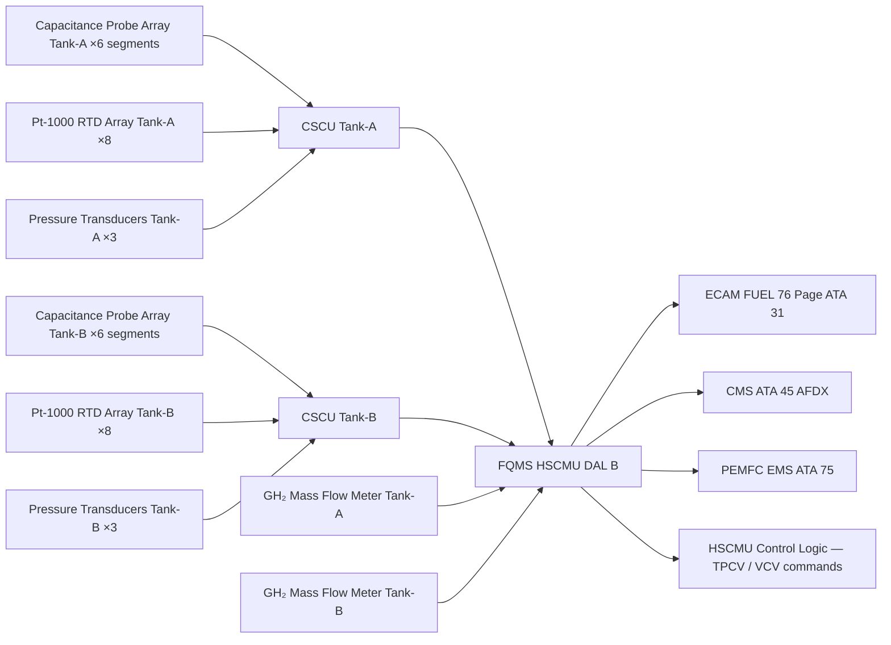
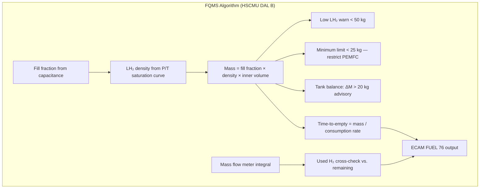

<!-- ──────────────────────────────────────────────────────────────────────────
     QATL-ATLAS-1000-ATLAS-070-079-07-076-050-HYDROGEN-QUANTITY-INDICATION-AND-SENSING
     ATA 28 (LH₂) · Hydrogen Quantity Indication and Sensing
     AMPEL360E eWTW — ATLAS Register 1000
────────────────────────────────────────────────────────────────────────────── -->

# Hydrogen Quantity Indication and Sensing

---

## §0 Hyperlink Policy

> All hyperlinks in this document are **relative** (five directory levels: `../../../../../`).
> Absolute URLs are forbidden. Every linked document must exist in the Q+ATLANTIDE repository
> before the link is activated. Broken links are treated as open issues and must be resolved
> before the document is promoted from `DRAFT` to `APPROVED`.

---

## §1 Purpose

This document describes the Hydrogen Quantity Indication and Sensing (HQIS) system of the AMPEL360E eWTW, which comprises the sensor suite, signal processing, and the Fuel Quantity Management System (FQMS) algorithms used to determine and display the onboard LH₂ mass in each tank. Accurate and reliable LH₂ mass indication is essential for mission planning, in-flight PEMFC power management, fuel cell equalisation between tanks, crew awareness (ECAM "FUEL 76" page), and ground servicing operations.

---

## §2 Applicability

| Parameter | Value |
|---|---|
| Aircraft Program | AMPEL360E eWTW |
| ATA reference | ATA 28 (LH₂) — 076-050 Hydrogen Quantity Indication and Sensing |
| Certification basis | EASA CS-25 Amdt 27+; EASA CSH-2; DO-178C DAL B (FQMS software) |
| S1000D SNS | 076-050-00 |

---

## §3 Functional Description ![DRAFT]

**Liquid level sensing (capacitance probes):** Each tank is instrumented with a vertical **multi-segment capacitance probe array** (6 segments per tank, spanning the full inner vessel height). The capacitance difference between liquid-immersed and vapour-exposed segments provides a liquid fill fraction with an accuracy of **± 0.5 % of full scale**. Capacitance probe electronics are cryogenic-rated (operational to 20 K) and installed through the upper sensor feedthrough nozzle. The probe output is conditioned by a cryogenic signal conditioner unit (CSCU) located on the tank neck (thermally shielded to < −50 °C) and transmitted via twisted-shielded pairs to the FQMS in the EE bay.

**Temperature sensing (Pt-1000 array):** A **longitudinal array of 8 Pt-1000 cryogenic resistance temperature detectors (RTDs)** per tank measures the temperature distribution along the inner vessel wall from bottom to top. The temperature profile reveals the liquid/vapour interface position (liquid phase at saturation temperature ~20 K; ullage vapour at a slightly higher temperature). The combined capacitance + temperature data allows the FQMS to compute the liquid density from the LH₂ saturation curve, and hence the **LH₂ mass** with a total system accuracy of **± 1 % of full scale (± 5 kg at full 500 kg tank)**.

**Pressure sensing:** Three independent cryogenic pressure transducers per tank (described in 076-030) provide the inner vessel pressure used by the FQMS to interpolate the LH₂ saturation temperature and density, completing the thermodynamic state calculation.

**Fuel Quantity Management System (FQMS):** The FQMS is a dedicated software function hosted within the HSCMU (DO-178C DAL B). It performs:
1. Real-time LH₂ mass computation per tank using the sensor fusion algorithm (capacitance fill fraction × liquid density from P/T saturation curve × tank inner volume).
2. Tank balancing advisory — if Tank-A and Tank-B differ in LH₂ mass by > 20 kg, the FQMS issues an ECAM advisory and recommends equalisation by adjusting PEMFC draw priority.
3. Used fuel accumulation — integrating boil-off GH₂ mass flow meters (076-040) and PEMFC liquid H₂ consumption meters to cross-check the capacitance-based quantity measurement (analogous to fuel used vs. fuel remaining cross-check in conventional ATA 28 FQMS).
4. Low LH₂ warning at 50 kg per tank (≈ 10 % of full), crew advisory on ECAM.
5. Minimum LH₂ limit at 25 kg per tank — HSCMU restricts PEMFC draw to protect against pump starvation.

**ECAM display:** The FQMS outputs LH₂ mass per tank (kg, displayed to nearest 1 kg), total LH₂ mass, and time-to-empty estimate (based on current PEMFC consumption rate) to the **ECAM "FUEL 76"** synoptic page, formatted per ATA 31 display conventions.

---

## §4 Functional Breakdown

| ID | Name | Description | Lead Division |
|---|---|---|---|
| F-001 | Capacitance probe array (×2 tanks) | 6-segment cryogenic capacitance level sensor per tank; ± 0.5 % level accuracy | Q-HPC |
| F-002 | Pt-1000 RTD temperature array (×2 tanks) | 8 RTDs per tank; temperature profile → liquid density calculation | Q-HPC |
| F-003 | Cryogenic signal conditioner units (CSCU ×2) | Per-tank CSCU conditions capacitance and RTD signals; cryogenic-rated electronics | Q-HPC |
| F-004 | FQMS — mass computation | HSCMU-hosted DAL B software; sensor fusion → LH₂ mass per tank; ± 1 % accuracy | Q-HPC |
| F-005 | FQMS — tank balancing advisory | ECAM advisory if ΔM > 20 kg between tanks | Q-HPC |
| F-006 | FQMS — used fuel cross-check | Mass flow meter integration vs. capacitance remainder | Q-HPC |
| F-007 | ECAM FUEL 76 display | LH₂ mass per tank; total; time-to-empty; low warning; ECAM page | Q-AIR |

---

## §5 System Context — Mermaid Diagram

---

## §6 Internal Architecture — Mermaid Diagram

---

## §7 Components and LRUs

| Component | Part Number | Qty | Location | Maintenance Interval | Notes |
|---|---|---|---|---|---|
| Capacitance probe assembly — Tank-A | CAP-A-PN-TBD | 1 | Inner vessel vertical axis, Tank-A | 2-year functional check; on condition | 6-segment; cryogenic-rated to 20 K |
| Capacitance probe assembly — Tank-B | CAP-B-PN-TBD | 1 | Inner vessel vertical axis, Tank-B | 2-year functional check; on condition | Identical to Tank-A |
| Pt-1000 RTD array assembly — Tank-A (×8) | RTD-A-PN-TBD | 1 set | Inner vessel wall, Tank-A (bottom to top) | Annual calibration | Cryogenic Pt-1000; ±0.1 K at 20 K |
| Pt-1000 RTD array assembly — Tank-B (×8) | RTD-B-PN-TBD | 1 set | Inner vessel wall, Tank-B (bottom to top) | Annual calibration | Identical to Tank-A |
| CSCU — Cryogenic Signal Conditioner Unit (Tank-A) | CSCU-A-PN-TBD | 1 | Tank-A neck, thermally shielded | 2-year BITE verify | Cryogenic electronics; −50 °C rated |
| CSCU — Cryogenic Signal Conditioner Unit (Tank-B) | CSCU-B-PN-TBD | 1 | Tank-B neck, thermally shielded | 2-year BITE verify | Identical to Tank-A CSCU |
| FQMS software module | SW-FQMS-076-050 | 1 (hosted in HSCMU) | HSCMU EE bay | Per SB software update cycle | DO-178C DAL B; mass computation + display |

---

## §8 Interfaces

| Interface Type | Connected System | Protocol / Medium | Data / Function |
|---|---|---|---|
| 076-030 Pressure Control | Pressure transducers (3 per tank) | Analogue / CSCU | Inner vessel pressure for FQMS density calculation |
| 076-040 Boil-Off Management | GH₂ mass flow meters | Analogue / CSCU | Used H₂ cross-check in FQMS |
| 076-080 HSCMU Monitoring | HSCMU dual-channel | Internal HSCMU software | FQMS data feeds HSCMU TPCV/VCV control logic |
| ATA 31 ECAM | ECAM display | AFDX | FUEL 76 synoptic page — LH₂ mass, total, time-to-empty |
| ATA 45 CMS | Central Maintenance System | AFDX | FQMS sensor health; calibration due alerts; quantity trend logs |
| ATA 75 PEMFC EMS | Fuel cell Energy Management System | AFDX | LH₂ quantity available; balancing advisory |

---

## §9 Operating Modes

| Mode | Trigger | System State | Actions / Consequences |
|---|---|---|---|
| Normal indication | Tank-A and -B healthy; FQMS running | Continuous LH₂ mass computed; displayed on ECAM | ECAM shows mass per tank; time-to-empty updated each minute |
| Tank imbalance advisory | ΔM > 20 kg between tanks | FQMS outputs advisory | ECAM "FUEL IMBAL" message; PEMFC EMS adjusts draw priority |
| Low LH₂ warning | M < 50 kg per tank | FQMS triggers ECAM advisory | Crew aware; mission planning adjustment |
| Minimum LH₂ limit | M < 25 kg per tank | HSCMU restricts PEMFC draw | Fuel cell power reduced; ECAM caution |
| Cross-check fault | Capacitance vs. mass flow discrepancy > 5 % | FQMS flags ECAM advisory | Sensor fault investigation at next landing; no immediate action required |
| Sensor fault (CSCU or probe) | CSCU BITE fault | Affected tank falls back to pressure/temperature-only estimation | ECAM amber advisory; quantity accuracy degrades to ± 3 %; maintenance required |

---

## §10 Performance and Budgets ![DRAFT]

| Parameter | Requirement | Target / Design Value | Status |
|---|---|---|---|
| LH₂ quantity accuracy (full FQMS) | ± 2 % full scale | ± 1 % full scale (± 5 kg at 500 kg) | ![TBD] |
| Capacitance probe level accuracy | ± 1 % full scale | ± 0.5 % full scale | ![TBD] |
| RTD temperature accuracy at 20 K | ± 0.5 K | ± 0.1 K | ![TBD] |
| FQMS update rate | ≥ 1 Hz | 1 Hz | ![TBD] |
| ECAM display update rate | ≥ 1 Hz | 1 Hz | ![TBD] |
| Cross-check (mass flow vs. capacitance) | ± 5 % consistency | ± 3 % target | ![TBD] |
| FQMS software DAL | DAL B (DO-178C) | DAL B | Defined |

---

## §11 Safety, Redundancy and Fault Tolerance

- Dual capacitance probe segments (6 segments per probe) provide intrinsic averaging — failure of a single segment degrades resolution but not the indicative mass within ± 1 % accuracy.
- 8 Pt-1000 RTDs per tank provide redundant temperature coverage; loss of up to 2 RTDs does not prevent density calculation (saturation curve lookup still possible with remaining sensors).
- CSCU failure is detected by HSCMU BITE within one FQMS update cycle; fallback mass estimate from pressure/temperature only achieves ± 3 % accuracy — acceptable for crew awareness.
- FQMS software is DO-178C DAL B (same as HSCMU); failure of the FQMS function results in a conservative ECAM "FUEL QTY UNAVAIL" message with the last known quantity frozen — crew reverts to time-based fuel management.
- No FQMS sensor or function failure can cause a spurious low-quantity alarm that results in premature PEMFC shutdown (minimum LH₂ logic requires confirmation from two independent sensor paths).

---

## §12 Maintenance and Diagnostics

| Task | Interval | Access | Special Tools |
|---|---|---|---|
| FQMS BITE self-test (both tanks) | A-check | HSCMU GSE terminal | HSCMU GSE |
| Capacitance probe functional check (partial fill bench) | 2-year | Tank access via sensor feedthrough nozzle | Cryogenic calibration stand; known dielectric medium |
| Pt-1000 RTD calibration (all 16) | Annual | CSCU connection panel | Cryogenic dry-block calibrator; traceable reference standard |
| CSCU BITE and output accuracy verify | 2-year | CSCU access panel (tank neck) | CSCU test harness; known resistance and capacitance references |
| FQMS software version verify | Each SB | CMS terminal | CMS GSE; software CRC check tool |
| Cross-check (capacitance vs. mass flow) trend review | A-check | CMS terminal | CMS GSE; HSCMU trend report |

---

## §13 Footprint

| Footprint Type | Parameter | Value | Notes |
|---|---|---|---|
| Physical | Capacitance probe length (per tank) | ≈ 3.2 m | Spans inner vessel vertical height |
| Physical | RTD array installation (per tank) | 8 RTDs over 3.2 m | ~400 mm spacing |
| Data | FQMS output data rate | 16 parameters at 1 Hz | Per tank: mass, level, 8 temps, 3 pressures, status |
| Software | FQMS code size (estimate) | ![TBD] | DO-178C DAL B compliance documentation required |
| Mass | Sensor suite and CSCU (per tank) | ![TBD] | Pending detail design |

---

## §14 Safety and Certification References ![DRAFT]

| Standard / Document | Title | Issuing Body | Applicability |
|---|---|---|---|
| EASA CS-25 §25.1337 | Powerplant instruments — fuel quantity indication | EASA | Fuel quantity indication requirements |
| EASA CSH-2 | Certification Specifications for Hydrogen | EASA | Hydrogen quantity indication and accuracy |
| DO-178C | Software Considerations in Airborne Systems | RTCA | FQMS software DAL B |
| RTCA DO-160G | Environmental Conditions and Test Procedures | RTCA | CSCU and sensor environmental qualification |
| IEC 60751 | Industrial Platinum RTDs | IEC | Pt-1000 RTD specification and tolerance |

---

## §15 V&V Approach ![TBD]

| Phase | Method | Acceptance Criterion | Status |
|---|---|---|---|
| Design | FQMS algorithm review — sensor fusion model verification | Mass accuracy ± 1 % across fill fractions 10–100 % | ![TBD] |
| Unit test | Capacitance probe bench test (LN₂ liquid level reference) | Level accuracy ± 0.5 % | ![TBD] |
| Unit test | RTD calibration at 77 K (LN₂) and 20 K (LH₂ equivalent) | Temperature ± 0.1 K | ![TBD] |
| Integration | First-fill ground test: FQMS vs. gravimetric reference | Mass error ≤ ± 1 % at known fill quantities | ![TBD] |
| Certification | CS-25 §25.1337 and CSH-2 compliance — FQMS accuracy flight demonstration | ECAM indication within ± 2 % at all tested conditions | ![TBD] |

---

## §16 Glossary

| Term | Definition |
|---|---|
| **FQMS** | Fuel Quantity Management System — HSCMU-hosted DAL B software computing LH₂ mass per tank from sensor fusion. |
| **Capacitance probe** | Multi-segment sensor measuring LH₂ liquid fill fraction via dielectric constant difference between LH₂ (ε ≈ 1.05) and GH₂ vapour (ε ≈ 1.0). |
| **Pt-1000** | Platinum RTD with 1000 Ω at 0 °C; used for cryogenic temperature measurement per IEC 60751. |
| **CSCU** | Cryogenic Signal Conditioner Unit — electronics conditioning raw capacitance and RTD signals near the tank (< −50 °C environment). |
| **Saturation curve** | P-T relationship for LH₂ at saturation; used by FQMS to compute liquid density from measured pressure and temperature. |
| **Time-to-empty** | FQMS-computed estimate of time until tank reaches minimum LH₂ limit at current consumption rate. |
| **Cross-check** | Comparison of mass flow meter integral (used H₂) against capacitance-derived remaining quantity; analogous to ATA 28 fuel used / fuel remaining check. |

---

## §17 Open Issues

| ID | Description | Owner | Target |
|---|---|---|---|
| OI-076-050-001 | Confirm capacitance probe segment count and geometry with OEM for required ± 0.5 % accuracy at 20 K | Q-HPC | 2026-Q4 |
| OI-076-050-002 | Validate FQMS sensor fusion algorithm with LN₂ (proxy) bench test before LH₂ first fill | Q-HPC | 2027-Q1 |
| OI-076-050-003 | Define ECAM FUEL 76 display format (kg vs. %; time-to-empty precision) with crew interface design (ATA 31) | Q-AIR | 2026-Q4 |

---

## §18 Status Legend

| Badge | Meaning |
|---|---|
| `![DRAFT]` | Section is drafted but not yet reviewed |
| `![TBD]` | Content not yet started — to be defined |
| `![To Be Completed]` | Partially complete — needs additional content |
| `![APPROVED]` | Reviewed and formally approved |

---

## §19 Related Documents (Siblings in this Subsection)

- [076-000](./076-000-Hydrogen-Fuel-Storage-Onboard-General.md)
- [076-010](./076-010-LH2-Tank-Architecture.md)
- [076-020](./076-020-Cryogenic-Tank-Insulation-and-Supports.md)
- [076-030](./076-030-Tank-Pressure-Control-and-Venting.md)
- [076-040](./076-040-Boil-Off-Management.md)
- [076-060](./076-060-Hydrogen-Storage-Safety-Zones-and-Leak-Detection.md)
- [076-070](./076-070-Hydrogen-Storage-Service-and-Maintenance.md)
- [076-080](./076-080-Hydrogen-Storage-Monitoring-Diagnostics-and-Control-Interfaces.md)
- [076-090](./076-090-S1000D-CSDB-Mapping-and-Traceability.md)

---

## §20 Change Log

| Rev | Date | Author | Description |
|---|---|---|---|
| 0.1 | 2026-05-12 | @copilot | Initial DRAFT — hydrogen quantity indication (FQMS/capacitance/RTD) for AMPEL360E eWTW |
