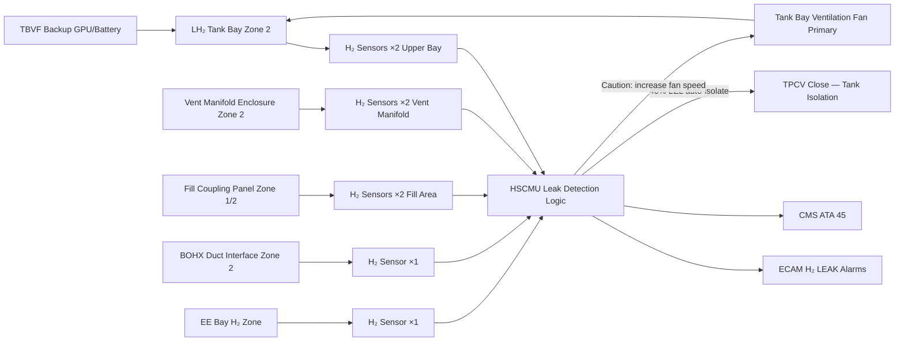
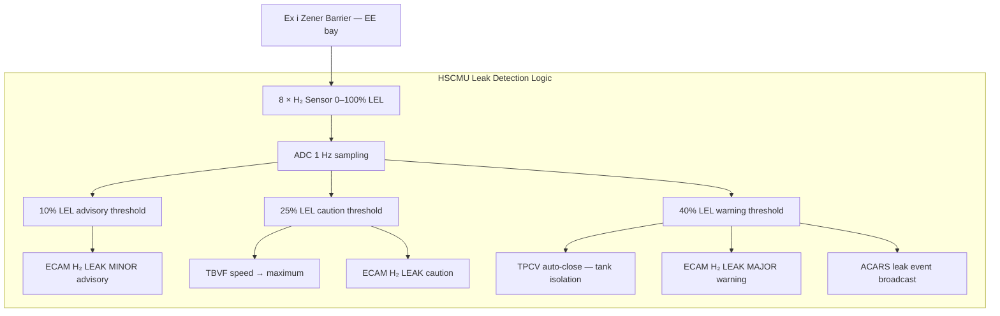

<!-- ──────────────────────────────────────────────────────────────────────────
     QATL-ATLAS-1000-ATLAS-070-079-07-076-060-HYDROGEN-STORAGE-SAFETY-ZONES-AND-LEAK-DETECTION
     ATA 28 (LH₂) · Hydrogen Storage Safety Zones and Leak Detection
     AMPEL360E eWTW — ATLAS Register 1000
────────────────────────────────────────────────────────────────────────────── -->

# Hydrogen Storage Safety Zones and Leak Detection

---

## §0 Hyperlink Policy

> All hyperlinks in this document are **relative** (five directory levels: `../../../../../`).
> Absolute URLs are forbidden. Every linked document must exist in the Q+ATLANTIDE repository
> before the link is activated. Broken links are treated as open issues and must be resolved
> before the document is promoted from `DRAFT` to `APPROVED`.

---

## §1 Purpose

This document defines the hydrogen safety zone classification, ventilation requirements, and hydrogen leak detection system for the AMPEL360E eWTW LH₂ storage system. Hydrogen is a flammable gas with a wide flammability range (4–75 % v/v in air) and a very low ignition energy (≈ 0.017 mJ), making zone classification and continuous leak monitoring essential safety barriers. The safety zone and leak detection design ensures that no ignitable hydrogen-air mixture can form at any ignition source location under normal or credible failure conditions.

---

## §2 Applicability

| Parameter | Value |
|---|---|
| Aircraft Program | AMPEL360E eWTW |
| ATA reference | ATA 28 (LH₂) — 076-060 Hydrogen Storage Safety Zones and Leak Detection |
| Certification basis | EASA CS-25 Amdt 27+; EASA CSH-2; IEC 60079-10-1; ATEX Directive 2014/34/EU |
| S1000D SNS | 076-060-00 |

---

## §3 Functional Description ![DRAFT]

**Hydrogen safety zones:** The AMPEL360E eWTW hydrogen system areas are classified per **IEC 60079-10-1** (Explosive atmospheres — Classification of areas — Gas). Three zone tiers apply:

- **Zone 0:** Inside the LH₂ tank (inner vessel); hydrogen is always present as LH₂ / GH₂. No installed electrical equipment within Zone 0.
- **Zone 1:** Areas where a flammable hydrogen-air atmosphere is likely during normal operation — defined as within 300 mm of: fill/drain couplings during ground servicing; TPCV/VCV valve bonnets; PRV outlet nozzle; vent line flexible connections. All installed equipment within Zone 1 is **ATEX Category 1G** (IIC T6, Group IIC = hydrogen service).
- **Zone 2:** Areas where a flammable hydrogen-air atmosphere is not likely during normal operation but may occur under abnormal conditions — defined as the entire **LH₂ tank bay** (aft fuselage bay aft of Frame 65), the vent manifold enclosure, and within 500 mm of the aft vent mast base. All installed equipment within Zone 2 is **ATEX Category 2G** or better (IIC T6).

**Outside the zone boundary:** All electrical equipment (wiring, connectors, sensors, avionics) outside defined Zone 1 and Zone 2 boundaries is standard aircraft-grade per DO-160G, with no ATEX rating required.

**Ventilation:** The LH₂ tank bay is continuously ventilated at a **minimum air change rate of 10 air changes per hour (ACH)** provided by a dedicated tank bay ventilation fan (TBVF, powered from the HVDC 270 V bus, ATA 73). In the event of a fan failure, natural ventilation through louvred panels provides a minimum of 3 ACH. A backup TBVF (GPU/battery powered) activates automatically on primary fan failure. The ventilation design is validated by CFD dispersion analysis per EASA CSH-2 to confirm that no zone boundary is exceeded at 10 ACH even under the credible single-seal-failure leakage rate.

**Hydrogen leak detection:** Eight **catalytic-bead hydrogen sensors** (H2S-CAT) are distributed throughout the Zone 2 classified areas:
- 2 sensors in the upper tank bay (above Tank-A and Tank-B)
- 2 sensors at the vent manifold enclosure
- 2 sensors at the fill coupling access panel
- 1 sensor at the BOHX duct interface
- 1 sensor in the EE bay hydrogen system area

Each catalytic sensor operates on the principle of catalytic oxidation of H₂ on a heated bead; output is 0–100 % LEL (Lower Explosive Limit, where 100 % LEL = 4 % v/v H₂). The **HSCMU monitors all 8 sensors continuously** at 1 Hz:

- **Advisory alarm at 10 % LEL (0.4 % v/v H₂):** ECAM "H₂ LEAK MINOR" advisory; HSCMU logs event; crew awareness.
- **Caution alarm at 25 % LEL (1.0 % v/v H₂):** ECAM "H₂ LEAK" caution; ventilation fan speed increased to maximum; crew initiates hydrogen system isolation procedure.
- **Warning alarm at 40 % LEL (1.6 % v/v H₂):** ECAM "H₂ LEAK MAJOR" warning; HSCMU automatically commands TPCV closed (tank isolation); vent system remains active to purge bay; immediate landing required.

**Electrostatic discharge (ESD) control:** All metallic components within Zone 1 and Zone 2 are bonded to airframe earth per SAE ARP1870, with bond resistance < 0.1 Ω. The aft vent mast incorporates a dedicated ESD grounding strip. Non-metallic equipment within Zone 1/2 is antistatic-rated (surface resistivity < 10⁹ Ω/□) to prevent static charge accumulation.

**Intrinsically safe circuits:** All sensor signal wiring within Zone 1/2 uses **ATEX-certified intrinsically safe (Ex i) barriers** at the EE bay entry point, limiting energy available in the zone wiring to below the minimum ignition energy of hydrogen (0.017 mJ).

---

## §4 Functional Breakdown

| ID | Name | Description | Lead Division |
|---|---|---|---|
| F-001 | Zone classification (Zone 0/1/2) | IEC 60079-10-1 classification; Zone boundaries defined; ATEX equipment selection | Q-AIR |
| F-002 | Tank bay ventilation | TBVF primary + backup; 10 ACH normal; 3 ACH natural minimum; CSH-2 CFD validated | Q-MECHANICS |
| F-003 | Catalytic H₂ sensor array (×8) | 0–100 % LEL; 1 Hz monitoring; three-tier alarm at 10/25/40 % LEL | Q-HPC |
| F-004 | HSCMU leak detection logic | Alarm processing; automatic TPCV closure at 40 % LEL; ECAM and CMS reporting | Q-HPC |
| F-005 | ESD bonding and intrinsic safety | Zone 1/2 bonding < 0.1 Ω; Ex i barriers on all sensor wiring | Q-MECHANICS |
| F-006 | ATEX equipment compliance | All Zone 1 equipment IIC T6 Cat 1G; Zone 2 equipment IIC T6 Cat 2G | Q-MECHANICS |

---

## §5 System Context — Mermaid Diagram

---

## §6 Internal Architecture — Mermaid Diagram

---

## §7 Components and LRUs

| Component | Part Number | Qty | Location | Maintenance Interval | Notes |
|---|---|---|---|---|---|
| Catalytic H₂ sensor — upper tank bay (×2) | H2S-CAT-BAY-PN-TBD | 2 | Upper LH₂ tank bay | 6-month calibration; 3-year bead replacement | 0–100 % LEL; ATEX Cat 2G IIC T6 |
| Catalytic H₂ sensor — vent manifold (×2) | H2S-CAT-VENT-PN-TBD | 2 | Vent manifold enclosure | 6-month calibration; 3-year bead replacement | Identical to tank bay sensors |
| Catalytic H₂ sensor — fill coupling (×2) | H2S-CAT-FILL-PN-TBD | 2 | Fill coupling access panel | 6-month calibration; 3-year bead replacement | ATEX Cat 1G (Zone 1) rated |
| Catalytic H₂ sensor — BOHX duct (×1) | H2S-CAT-BOHX-PN-TBD | 1 | BOHX duct interface | 6-month calibration; 3-year bead replacement | Identical to tank bay sensors |
| Catalytic H₂ sensor — EE bay (×1) | H2S-CAT-EE-PN-TBD | 1 | EE bay H₂ area | 6-month calibration; 3-year bead replacement | Standard aircraft EE bay |
| Tank Bay Ventilation Fan — primary (TBVF) | TBVF-PRI-PN-TBD | 1 | Tank bay forward bulkhead | A-check operational check; C-check bearing inspect | ATEX Cat 2G; HVDC 270 V powered |
| Tank Bay Ventilation Fan — backup (TBVF-BKP) | TBVF-BKP-PN-TBD | 1 | Tank bay aft bulkhead | A-check operational check | GPU/battery powered; auto-activate on primary fail |
| Ex i Zener barrier assembly (per sensor) | EXI-BARRIER-PN-TBD | 8 | EE bay — EE panel sensor entry | 2-year continuity check | ATEX Ex i certified; limits energy in Zone 1/2 wiring |
| ESD bonding strap set (Zone 1/2 metallic components) | ESD-BOND-PN-TBD | 1 set | All Zone 1/2 metallic structures | A-check bond resistance check (< 0.1 Ω) | SAE ARP1870 compliant |

---

## §8 Interfaces

| Interface Type | Connected System | Protocol / Medium | Data / Function |
|---|---|---|---|
| 076-030 Tank Pressure Control | TPCV | HSCMU command | Auto-close TPCV at 40 % LEL for tank isolation |
| 076-080 HSCMU Monitoring | HSCMU dual-channel | Direct sensor wiring + Ex i barriers | All 8 sensor readings at 1 Hz; alarm logic |
| ATA 31 ECAM | Cockpit display | AFDX | H₂ LEAK advisory/caution/warning alerts |
| ATA 45 CMS | Central Maintenance System | AFDX | Sensor calibration due alerts; leak event logs; trend |
| ATA 21 ECS | Tank bay ventilation | Power / control signal | TBVF speed control; backup fan activation |
| ATA 73 Power Distribution | HVDC 270 V bus | HVDC power | TBVF primary power supply |

---

## §9 Operating Modes

| Mode | Trigger | System State | Actions / Consequences |
|---|---|---|---|
| Normal | All sensors < 10 % LEL | TBVF running at nominal 10 ACH; sensors healthy | ECAM "H₂ SYS NORM"; continuous monitoring |
| Advisory (minor leak) | Any sensor 10–24 % LEL | No automatic action | ECAM "H₂ LEAK MINOR"; HSCMU logs; crew monitors; land at next opportunity |
| Caution (significant leak) | Any sensor 25–39 % LEL | TBVF speed → maximum; ECAM caution | Crew initiates H₂ isolation checklist; expedite landing |
| Warning (major leak) | Any sensor ≥ 40 % LEL | TPCV auto-closes; TBVF at maximum; ECAM warning | Immediate landing; H₂ system isolated; PEMFC degraded |
| Sensor fault | HSCMU detects sensor BITE failure | Affected sensor isolated; remaining sensors cover zone | ECAM "H₂ SENSOR FAULT"; maintenance required at next opportunity |
| Ground maintenance | LOTO in progress; aircraft grounded | All sensors active; portable analyser deployed | Entry to Zone 1 requires < 1 % LEL on portable detector |

---

## §10 Performance and Budgets ![DRAFT]

| Parameter | Requirement | Target / Design Value | Status |
|---|---|---|---|
| H₂ sensor range | 0–100 % LEL (0–4 % v/v H₂) | 0–100 % LEL | ![TBD] |
| H₂ sensor accuracy | ± 5 % LEL full scale | ± 3 % LEL target | ![TBD] |
| H₂ sensor response time (T90) | ≤ 30 s | ≤ 20 s target | ![TBD] |
| Alarm threshold accuracy | ± 2 % LEL at set points | ± 1 % LEL target | ![TBD] |
| Tank bay ventilation rate (normal) | ≥ 10 ACH | 12 ACH design point | ![TBD] |
| Tank bay ventilation rate (natural fallback) | ≥ 3 ACH | 4 ACH target | ![TBD] |
| ESD bond resistance (Zone 1/2) | < 0.1 Ω | < 0.05 Ω target | ![TBD] |
| Ex i barrier energy limit | < 0.017 mJ in Zone wiring | Certified per ATEX | Defined |

---

## §11 Safety, Redundancy and Fault Tolerance

- Eight independent sensors at distributed locations provide full zone coverage; no single sensor failure leaves an entire zone unmonitored (≥ 2 sensors cover each critical area).
- Three-tier alarm escalation (10/25/40 % LEL) allows graduated crew response rather than abrupt automatic isolation.
- Automatic TPCV closure at 40 % LEL is an HSCMU function executed on both Channel A and Channel B independently; failure of one HSCMU channel does not prevent tank isolation.
- TBVF primary + backup ensures ventilation is maintained even after primary fan failure; loss of both fans is demonstrated Extremely Remote per FHA.
- Ex i barriers are hard-wired protection: they cannot be inadvertently defeated by software failure and do not require any active command to limit energy.
- Zone classification (IEC 60079-10-1) is validated by CFD dispersion modelling at the credible single-point-failure leakage rate per EASA CSH-2; the zone boundaries are shown to be conservative at the installed ventilation rate.
- Hydrogen flammability range (4–75 % v/v) is much wider than hydrocarbons; LEL-based alarms are set at 10 % LEL (0.4 % v/v), well below the 4 % LEL, providing a safety factor of 10× from the Lower Flammable Limit.

---

## §12 Maintenance and Diagnostics

| Task | Interval | Access | Special Tools |
|---|---|---|---|
| H₂ sensor calibration (all 8, in-situ) | 6 months | Tank bay / vent manifold / fill panel access | Certified H₂ calibration gas kit (10 %, 25 %, 40 % LEL) |
| Catalytic bead replacement (all 8) | 3 years | Sensor body removal | Replacement bead kit; torque wrench |
| TBVF primary fan operational test (airflow measurement) | A-check | Tank bay forward bulkhead | Anemometer |
| TBVF backup fan auto-activation test | A-check | Simulate primary fan failure from HSCMU GSE | HSCMU GSE console |
| ESD bond resistance check (all Zone 1/2 bonds) | A-check | Zone 1/2 metallic structure access | Calibrated low-resistance ohmmeter (< 0.1 Ω) |
| Ex i barrier continuity and integrity check | 2 years | EE bay sensor entry panel | ATEX Ex i test instrument |
| Zone 1/2 wiring insulation resistance check | C-check | EE bay | Insulation resistance tester (500 V DC) |
| HSCMU leak detection logic functional test (alarm simulation) | A-check | HSCMU GSE | HSCMU GSE console |

---

## §13 Footprint

| Footprint Type | Parameter | Value | Notes |
|---|---|---|---|
| Physical | Sensor count | 8 catalytic sensors | Distributed in Zone 1/2 classified areas |
| Physical | TBVF envelope (each) | ![TBD] | OEM selection pending |
| Ventilation | Tank bay volume (estimate) | ![TBD] | Required to size TBVF flow rate for 10 ACH |
| Safety | Zone 1 boundary radius | 300 mm from fill/vent/PRV nozzles | Per IEC 60079-10-1 simplified method |
| Safety | Zone 2 boundary | Entire LH₂ tank bay + vent manifold enclosure + 500 mm around vent mast base | Per IEC 60079-10-1 |
| Maintenance | Sensor calibration time (all 8) | ≈ 4 h | Per 6-month cycle |

---

## §14 Safety and Certification References ![DRAFT]

| Standard / Document | Title | Issuing Body | Applicability |
|---|---|---|---|
| EASA CSH-2 | Certification Specifications for Hydrogen | EASA | Zone classification, leak detection, ventilation requirements |
| IEC 60079-10-1 | Explosive atmospheres — Classification of areas — Gas | IEC | Zone 0/1/2 classification methodology |
| ATEX Directive 2014/34/EU | Equipment and protective systems in explosive atmospheres | EU | ATEX equipment selection and marking |
| IEC 60079-11 | Explosive atmospheres — Intrinsic safety "i" | IEC | Ex i barrier design and certification |
| IEC 60079-29-1 | Explosive atmospheres — Gas detectors — Part 1 | IEC | Catalytic H₂ sensor performance requirements |
| SAE ARP1870 | Aerospace Systems Electrical Bonding and Grounding | SAE | ESD bonding requirements for Zone 1/2 |
| EN 60079-0 | Explosive atmospheres — General requirements | CEN/IEC | ATEX equipment general requirements |
| NFPA 2 | Hydrogen Technologies Code | NFPA | Background reference for H₂ safety zone design |

---

## §15 V&V Approach ![TBD]

| Phase | Method | Acceptance Criterion | Status |
|---|---|---|---|
| Design | IEC 60079-10-1 zone classification analysis | Zone boundaries documented and agreed with EASA | ![TBD] |
| Design | CFD H₂ dispersion analysis (credible leak rate, 10 ACH) | Zone 2 boundary not exceeded at sensor alarm locations | ![TBD] |
| Unit test | Sensor calibration at 10/25/40 % LEL using certified gas | Response ± 3 % LEL; T90 ≤ 20 s | ![TBD] |
| Integration | HSCMU alarm logic functional test — inject simulated sensor signal | All three alarm tiers trigger correctly; TPCV closes at 40 % | ![TBD] |
| Certification | CSH-2 zone classification and leak detection compliance review | All ATEX documentation submitted; zone map approved | ![TBD] |

---

## §16 Glossary

| Term | Definition |
|---|---|
| **LEL** | Lower Explosive Limit — minimum hydrogen concentration to sustain combustion; 4 % v/v H₂ in air (= 100 % LEL). |
| **ATEX** | Equipment certification mark for use in potentially explosive atmospheres (EU ATEX Directive 2014/34/EU). |
| **Ex i** | ATEX protection concept "intrinsic safety" — limits electrical energy in Zone wiring below the minimum ignition energy. |
| **IIC** | Highest ATEX gas group classification; hydrogen is Group IIC (widest flammability range, lowest ignition energy). |
| **T6** | ATEX temperature class; maximum surface temperature ≤ 85 °C — below hydrogen's auto-ignition temperature (585 °C). |
| **Catalytic bead sensor** | H₂ sensor operating by oxidising hydrogen on a heated platinum-catalysed bead; output proportional to H₂ concentration in % LEL. |
| **ACH** | Air Changes per Hour — ventilation rate expressed as total air volume replaced per hour relative to enclosed volume. |
| **ESD** | Electrostatic Discharge — uncontrolled release of static electric charge; must be controlled in Zone 1/2 areas. |
| **TBVF** | Tank Bay Ventilation Fan — dedicated fan maintaining minimum air change rate in the LH₂ tank bay. |

---

## §17 Open Issues

| ID | Description | Owner | Target |
|---|---|---|---|
| OI-076-060-001 | Commission CFD H₂ dispersion analysis at credible single-seal-failure leak rate; confirm zone boundary at 10 ACH | Q-AIR | 2027-Q1 |
| OI-076-060-002 | Confirm ATEX IIC T6 Category 1G sensor availability meeting DO-160G environmental categories for aircraft application | Q-MECHANICS | 2026-Q4 |
| OI-076-060-003 | Define Zone 1 equipment list (all components within 300 mm of fill/vent nozzles) and confirm ATEX Cat 1G certification status | Q-MECHANICS | 2026-Q4 |

---

## §18 Status Legend

| Badge | Meaning |
|---|---|
| `![DRAFT]` | Section is drafted but not yet reviewed |
| `![TBD]` | Content not yet started — to be defined |
| `![To Be Completed]` | Partially complete — needs additional content |
| `![APPROVED]` | Reviewed and formally approved |

---

## §19 Related Documents (Siblings in this Subsection)

- [076-000](./076-000-Hydrogen-Fuel-Storage-Onboard-General.md)
- [076-010](./076-010-LH2-Tank-Architecture.md)
- [076-020](./076-020-Cryogenic-Tank-Insulation-and-Supports.md)
- [076-030](./076-030-Tank-Pressure-Control-and-Venting.md)
- [076-040](./076-040-Boil-Off-Management.md)
- [076-050](./076-050-Hydrogen-Quantity-Indication-and-Sensing.md)
- [076-070](./076-070-Hydrogen-Storage-Service-and-Maintenance.md)
- [076-080](./076-080-Hydrogen-Storage-Monitoring-Diagnostics-and-Control-Interfaces.md)
- [076-090](./076-090-S1000D-CSDB-Mapping-and-Traceability.md)

---

## §20 Change Log

| Rev | Date | Author | Description |
|---|---|---|---|
| 0.1 | 2026-05-12 | @copilot | Initial DRAFT — H₂ safety zones (IEC 60079-10-1), ATEX, catalytic sensors, TBVF for AMPEL360E eWTW |
