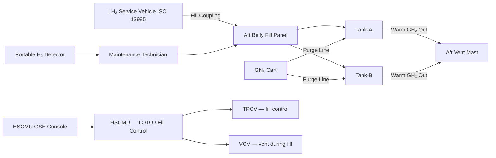

<!-- ──────────────────────────────────────────────────────────────────────────
     QATL-ATLAS-1000-ATLAS-070-079-07-076-070-HYDROGEN-STORAGE-SERVICE-AND-MAINTENANCE
     ATA 28 (LH₂) · Hydrogen Storage Service and Maintenance
     AMPEL360E eWTW — ATLAS Register 1000
────────────────────────────────────────────────────────────────────────────── -->

# Hydrogen Storage Service and Maintenance

---

## §0 Hyperlink Policy

> All hyperlinks in this document are **relative** (five directory levels: `../../../../../`).
> Absolute URLs are forbidden. Every linked document must exist in the Q+ATLANTIDE repository
> before the link is activated. Broken links are treated as open issues and must be resolved
> before the document is promoted from `DRAFT` to `APPROVED`.

---

## §1 Purpose

This document defines the service and maintenance procedures, access requirements, tooling, special precautions, and personnel qualification requirements for the AMPEL360E eWTW LH₂ onboard storage system. Cryogenic hydrogen servicing is a highly specialised activity requiring dedicated training, personal protective equipment (PPE), and specific ground service equipment (GSE) not used in conventional aircraft maintenance. This document is the primary reference for the development of the Airworthiness Limitations (AWL) and Maintenance Planning Document (MPD) tasks for ATA 076.

---

## §2 Applicability

| Parameter | Value |
|---|---|
| Aircraft Program | AMPEL360E eWTW |
| ATA reference | ATA 28 (LH₂) — 076-070 Hydrogen Storage Service and Maintenance |
| Certification basis | EASA CS-25 Amdt 27+; EASA CSH-2; CS-25 §25.1529 (ICA) |
| S1000D SNS | 076-070-00 |

---

## §3 Functional Description ![DRAFT]

**Safety precautions for all LH₂ maintenance activities:**
All maintenance and servicing activities on the LH₂ system require the following minimum safety controls, regardless of specific task:

1. **LOTO (Lockout/Tagout):** The LH₂ system LOTO procedure (HSCMU-commanded via GSE) is applied before any physical work on the LH₂ tanks, valves, sensors, or lines. LOTO includes: TPCV and VCV locked closed, fill coupling dust caps installed and safety-wired, HSCMU isolated from power.
2. **Atmosphere verification:** Before entry into Zone 1 or Zone 2 areas, portable electrochemical H₂ detector reading must confirm < 10 % LEL (< 0.4 % v/v) inside the work area.
3. **GN₂ purge / inerting:** For any task involving tank opening (e.g., sensor replacement, hydrostatic test), the tank must first be warmed to ambient temperature via controlled GN₂ purge until all internal LH₂ is vaporised and displaced, confirmed by sensor reading < 1 % H₂ v/v.
4. **Cryogenic PPE:** Full cryogenic PPE (face shield, cryogenic gauntlet gloves, cryogenic apron / coverall, closed-toe safety footwear) is mandatory for LH₂ fill, drain, and initial cooldown operations.
5. **Fire watch:** A trained fire-watch person with a dry-powder extinguisher and fire blanket is stationed at the work area during LH₂ fill, drain, and any open-line cryogenic work.

**LH₂ ground refuelling procedure:**
LH₂ is loaded from a cryogenic service vehicle via the ISO 13985 fill coupling at the aft belly service panel. The procedure sequence is:
1. Connect ground LH₂ service vehicle to aircraft fill coupling (ISO 13985 breakaway self-sealing coupling).
2. Perform pre-fill safety checks: H₂ sensor < 10 % LEL; LOTO removed; fill coupling mated and locked.
3. Initiate pre-cool cycle: flow cold GH₂ through the fill line to cool the line and inner vessel nozzle to near-LH₂ temperature before liquid flow begins (prevents vapour lock and thermal shock).
4. Transfer LH₂: flow LH₂ at controlled rate (max fill rate limited by HSCMU to prevent excessive boil-off and pressure excursion); FQMS monitors fill quantity.
5. Top-off and disconnect: at FQMS-indicated 95 % fill (500 kg), HSCMU commands fill valve close; LH₂ service vehicle disconnects; coupling self-seals.
6. Leak check: H₂ sensors confirm < 10 % LEL at coupling; visual inspection of coupling nose cap.
7. LOTO re-applied if not proceeding to flight.

**Valve and sensor replacement (TPCV / VCV):**
Replacement of cryogenic solenoid valves requires tank isolation (LOTO), warm-up to ambient (GN₂ purge), pressure relief to atmospheric, then nozzle fitting removal. Replacement valve is pre-chilled to −50 °C before installation to minimise thermal shock on re-introduction to the cryogenic environment. Post-replacement, a leak check and functional test (HSCMU GSE command) is performed before re-sealing.

**Annual PRV recertification:**
PRVs are removed from the tank nozzle manifold (tank isolation required; no warm-up needed — PRV can be removed cryogenically if using appropriate tools) and sent to a certified test rig for set-point verification. Replacement PRVs (calibrated) are installed while the originals are being tested.

**Six-year overhaul (MLI, tank hydrostatic test):**
Full overhaul requires tank removal from the aircraft, transport to a cryogenic workshop, GN₂ warm-up and purge, hydrostatic proof test, MLI and VCS inspection/replacement, outer jacket vacuum measurement and re-evacuation if needed, and re-certification before reinstallation. Duration: approximately 6 weeks per tank (2 tanks may be done sequentially or in parallel at a facility with sufficient capacity).

---

## §4 Functional Breakdown

| ID | Name | Description | Lead Division |
|---|---|---|---|
| F-001 | LH₂ LOTO procedure | HSCMU-commanded TPCV/VCV lockout; atmosphere verify; coupling dust caps | Q-MECHANICS |
| F-002 | LH₂ ground refuelling | ISO 13985 fill coupling; pre-cool; controlled fill; FQMS monitoring; top-off | Q-MECHANICS |
| F-003 | GN₂ purge / warm-up procedure | Controlled GN₂ flow to vaporise LH₂ and inert for open-work access | Q-MECHANICS |
| F-004 | Cryogenic PPE and fire watch | Mandatory PPE list; fire-watch staffing; emergency response plan | Q-AIR |
| F-005 | Valve / sensor R&R procedures | TPCV/VCV/PRV/sensor removal and replacement; pre-chill; leak and functional check | Q-MECHANICS |
| F-006 | 6-year overhaul | Tank removal; hydrostatic test; MLI/VCS; vacuum re-evacuation; re-certification | Q-MECHANICS |
| F-007 | Personnel qualification | LH₂ system maintenance training and authorisation requirements | Q-AIR |

---

## §5 System Context — Mermaid Diagram

---

## §6 Internal Architecture — Mermaid Diagram

---

## §7 Components and LRUs (GSE)

| Component | Part Number | Qty | Location | Maintenance Interval | Notes |
|---|---|---|---|---|---|
| ISO 13985 cryogenic fill coupling — aircraft side | CFC-ACFT-PN-TBD | 2 (1 per tank) | Aft belly service panel | 2-year seal replacement | Self-sealing breakaway; ATEX compatible |
| GN₂ purge line assembly | GN2-LINE-PN-TBD | 1 per tank | Tank neck GN₂ port | Annual inspect | Stainless steel flex hose; quick-disconnect ends |
| HSCMU GSE console | HSCMU-GSE-PN-TBD | 1 (GSE item) | Maintenance crew GSE trolley | Per SB software update | Communicates with HSCMU via Ethernet / CAN for LOTO and fill control |
| Portable electrochemical H₂ detector | H2D-PORT-PN-TBD | 1+ (GSE item) | Station/MRO GSE | 6-month calibration | 0–4 % v/v; ATEX Cat 1G; personal and area monitoring |
| Cryogenic PPE kit (per technician) | PPE-CRYO-PN-TBD | Per tech | Maintenance crew | Inspect before each use; replace on damage | Includes face shield, cryogenic gauntlets, apron, footwear |
| LH₂ fill isolation valve (aircraft-side backup) | FIV-PN-TBD | 2 (1 per tank) | Fill line, inboard of coupling | A-check operational check | Manual isolation valve; backup to TPCV |
| PRV test rig (GSE) | PRV-TEST-RIG-PN-TBD | 1 (GSE item) | MRO facility | Annual calibration | 0–10 bar; certified PRV set-point test |

---

## §8 Interfaces

| Interface Type | Connected System | Protocol / Medium | Data / Function |
|---|---|---|---|
| 076-030 Tank Pressure Control | TPCV / VCV | HSCMU GSE command | LOTO application and fill valve control |
| 076-050 Quantity Indication | FQMS | HSCMU GSE | Fill quantity monitoring during ground refuelling |
| 076-060 Safety Zones | H₂ sensor array; TBVF | Safety precondition | Atmosphere < 10 % LEL required before maintenance entry |
| 076-080 HSCMU Monitoring | HSCMU | Ethernet / CAN (GSE) | LOTO control; fill sequencing; BITE access |
| ATA 47 NGS | GN₂ supply (tank purge) | GN₂ purge hose | Inerting gas for tank warm-up and open-access procedures |
| ATA 53 Fuselage | Aft belly access panels | Physical | Tank bay, fill coupling, and service panel access |

---

## §9 Operating Modes

| Mode | Trigger | System State | Actions / Consequences |
|---|---|---|---|
| Normal turnaround fill | Aircraft at gate/apron; LH₂ < threshold | HSCMU in fill-ready mode; LOTO not applied | Connect service vehicle; execute fill sequence; fill complete in < 60 min |
| Pre-maintenance LOTO | Maintenance task requiring physical access | LOTO applied; TPCV/VCV locked closed | No hydrogen flow possible; area monitor required before entry |
| GN₂ purge (open-access) | Task requires inner vessel or valve open work | GN₂ flow commenced; LH₂ vaporised | Duration ≈ 8–12 h for full warm-up; H₂ < 1 % v/v confirmed |
| PRV replacement | Annual recertification due | Tank isolation; PRV removed at cryogenic temperature | Replacement PRV installed; functional test before return to service |
| 6-year overhaul (tank removal) | Scheduled overhaul | Aircraft grounded; tank bay open; tank on handling rails | Tank transport to cryogenic workshop; ~6 weeks per tank |
| Emergency drain | Tank damaged; maintenance required | HSCMU commands controlled boil-off vent; NO liquid drain | LH₂ is NOT liquid-drained overboard; only gaseous vent to mast |

---

## §10 Performance and Budgets ![DRAFT]

| Parameter | Requirement | Target / Design Value | Status |
|---|---|---|---|
| LH₂ fill time (0 → 500 kg per tank) | ≤ 60 min | ≤ 45 min target | ![TBD] |
| Max LH₂ fill rate | Controlled by HSCMU | ![TBD] kg/min | ![TBD] |
| GN₂ purge / warm-up time (full tank) | ![TBD] h | ≈ 8–12 h | ![TBD] |
| Pre-cool line cycle time | ≤ 5 min | ≤ 3 min target | ![TBD] |
| TPCV operational test response time | ≤ 500 ms | ≤ 300 ms | ![TBD] |
| PRV recertification time (all 4) | ≈ 4 h off-aircraft | ≈ 4 h | ![TBD] |
| Tank 6-year overhaul cycle time | ≤ 6 weeks per tank | ≤ 5 weeks target | ![TBD] |

---

## §11 Safety, Redundancy and Fault Tolerance

- LOTO is a two-barrier system: HSCMU software lockout (TPCV/VCV commanded closed) + physical dust caps and safety wire on the fill coupling. Neither barrier alone is sufficient; both must be applied.
- GN₂ purge before open-access work removes both hydrogen flammability risk and the cryogenic asphyxiation risk (LH₂ expanding to ≈ 800 × volume as GH₂; GN₂ displaces both the LH₂-derived hydrogen and provides a breathable-atmosphere clearance check step).
- Cryogenic PPE protects against liquid hydrogen splash (−253 °C cryogenic burns) and hydrogen vapour cloud inhalation (cold GH₂ is dense and can displace oxygen in confined spaces).
- The aft belly fill panel is located in a ventilated open area; ground-level hydrogen release during fill is dispersed by natural ventilation. The refuelling exclusion zone (10 m radius) is marked on the apron and enforced by ground handling SOPs.
- There is no provision for liquid hydrogen overboard dump/jettison — the design philosophy is that all hydrogen exits the system only as gaseous hydrogen through the vent mast, managed by HSCMU at rates compliant with the vent mast design.

---

## §12 Maintenance and Diagnostics

| Task | Interval | Access | Special Tools |
|---|---|---|---|
| LH₂ system LOTO application and verification | Before any system access | HSCMU GSE + fill panel | HSCMU GSE console; portable H₂ detector |
| Ground refuelling (LH₂ fill) | As required (each flight day or as mission dictates) | Aft belly fill panel | LH₂ service vehicle; ISO 13985 coupling; cryogenic PPE |
| Fill coupling seal inspection and replacement | 2-year | Aft belly fill panel | Cryogenic seal kit; torque wrench |
| TPCV / VCV replacement (cryogenic) | On condition per HSCMU BITE | Tank neck valve access panel | Cryogenic valve installation tool; pre-chill bath |
| PRV removal, bench test, reinstallation | Annual | PRV manifold nozzle | PRV test rig; calibrated torque wrench |
| GN₂ warm-up and purge (before open-tank work) | Before each open-access maintenance event | Tank neck GN₂ port; vent mast open | GN₂ cart; portable H₂ detector; temperature probe |
| Tank removal and 6-year overhaul | 6-year scheduled | Full aft fuselage bay opening; handling rails | Tank handling rails; cryogenic workshop; hydrostatic rig |
| Personnel LH₂ qualification training | Prerequisite before any LH₂ work | Training centre | LH₂ safety training course + hands-on assessment |

---

## §13 Footprint

| Footprint Type | Parameter | Value | Notes |
|---|---|---|---|
| Physical | Fill coupling panel location | Aft belly, port and stbd | Below each tank |
| Physical | Tank bay access panels | 4 panels (2 per tank) | Side + belly access |
| Maintenance | LH₂ fill time per turn | ≤ 60 min | ISO 13985 service vehicle |
| Maintenance | GN₂ purge time (full warm-up) | ≈ 8–12 h | Before open-access work |
| Maintenance | 6-year overhaul cycle (per tank) | ≤ 6 weeks | Cryogenic workshop |
| Personnel | Minimum crew for LH₂ fill | 2 technicians + 1 fire watch | Per filling SOP |

---

## §14 Safety and Certification References ![DRAFT]

| Standard / Document | Title | Issuing Body | Applicability |
|---|---|---|---|
| EASA CSH-2 | Certification Specifications for Hydrogen | EASA | LH₂ servicing safety requirements; ICA mandate |
| EASA CS-25 §25.1529 | Instructions for Continued Airworthiness | EASA | AMM/CMM content requirements |
| ISO 13985 | Liquid hydrogen — land vehicle fuelling system interface | ISO | Fill coupling compatibility |
| EN 13458-3 | Cryogenic vessels — operational requirements | CEN | Tank operation, service, and maintenance |
| OSHA 29 CFR 1910.147 | Control of Hazardous Energy (LOTO) | OSHA | LOTO regulatory basis |
| SAE ARP6801 | Hydrogen Fuel System Design Guidelines | SAE | Ground servicing design basis |
| NFPA 2 | Hydrogen Technologies Code | NFPA | Refuelling exclusion zone and safety procedure reference |
| EN ISO 14687 | Hydrogen fuel quality | ISO | LH₂ purity specification for PEMFC compatibility |

---

## §15 V&V Approach ![TBD]

| Phase | Method | Acceptance Criterion | Status |
|---|---|---|---|
| Design | LOTO procedure review vs. OSHA 29 CFR 1910.147 and CSH-2 | All energy sources addressed; no residual hazard | ![TBD] |
| Unit test | Fill coupling mating and self-seal test (ambient and cryogenic) | No leakage at ± 10 % of MAWP; self-seal confirmed at breakaway | ![TBD] |
| Integration | Full ground fill demonstration (first LH₂ fill) | Fill complete ≤ 60 min; FQMS accurate ± 1 %; no leak events | ![TBD] |
| Integration | GN₂ purge warm-up demonstration | Tank < 1 % H₂ v/v after purge within estimated time | ![TBD] |
| Certification | CS-25 §25.1529 AMM review; CSH-2 servicing procedures approval | EASA-approved AMM task cards for all LH₂ maintenance actions | ![TBD] |

---

## §16 Glossary

| Term | Definition |
|---|---|
| **LOTO** | Lockout/Tagout — mandatory energy isolation procedure before maintenance access; OSHA 29 CFR 1910.147 based. |
| **ISO 13985** | International standard for LH₂ land vehicle fuelling interface — defines the fill coupling design used by the AMPEL360E eWTW. |
| **GN₂ purge** | Procedure using gaseous nitrogen to vaporise residual LH₂ and displace hydrogen from the tank before open-access maintenance. |
| **Cryogenic PPE** | Personal protective equipment for LH₂ work: face shield, cryogenic gauntlet gloves, cryogenic apron/coverall, closed-toe footwear. |
| **Fire watch** | Trained personnel stationed at the work area with extinguisher and fire blanket during cryogenic open-line operations. |
| **Pre-cool cycle** | Controlled flow of cold GH₂ through the fill line before LH₂ flow, to minimise thermal shock and vapour lock. |
| **EN ISO 14687** | LH₂ purity standard; required purity for PEMFC anode feed (total impurities < 1 ppm). |
| **ICA** | Instructions for Continued Airworthiness — maintenance data required per CS-25 §25.1529; includes AMM and CMM. |

---

## §17 Open Issues

| ID | Description | Owner | Target |
|---|---|---|---|
| OI-076-070-001 | Define LH₂ fill rate limit (kg/min) for HSCMU fill control based on tank thermal analysis and boil-off during fill | Q-GREENTECH | 2026-Q4 |
| OI-076-070-002 | Establish LH₂ technician qualification training programme content and assessment criteria with EASA Part-66/CSH-2 alignment | Q-AIR | 2027-Q1 |
| OI-076-070-003 | Confirm airport LH₂ service vehicle (ISO 13985) availability at first EIS airports; develop ground handling ops manual | Q-AIR | 2027-Q2 |

---

## §18 Status Legend

| Badge | Meaning |
|---|---|
| `![DRAFT]` | Section is drafted but not yet reviewed |
| `![TBD]` | Content not yet started — to be defined |
| `![To Be Completed]` | Partially complete — needs additional content |
| `![APPROVED]` | Reviewed and formally approved |

---

## §19 Related Documents (Siblings in this Subsection)

- [076-000](./076-000-Hydrogen-Fuel-Storage-Onboard-General.md)
- [076-010](./076-010-LH2-Tank-Architecture.md)
- [076-020](./076-020-Cryogenic-Tank-Insulation-and-Supports.md)
- [076-030](./076-030-Tank-Pressure-Control-and-Venting.md)
- [076-040](./076-040-Boil-Off-Management.md)
- [076-050](./076-050-Hydrogen-Quantity-Indication-and-Sensing.md)
- [076-060](./076-060-Hydrogen-Storage-Safety-Zones-and-Leak-Detection.md)
- [076-080](./076-080-Hydrogen-Storage-Monitoring-Diagnostics-and-Control-Interfaces.md)
- [076-090](./076-090-S1000D-CSDB-Mapping-and-Traceability.md)

---

## §20 Change Log

| Rev | Date | Author | Description |
|---|---|---|---|
| 0.1 | 2026-05-12 | @copilot | Initial DRAFT — LH₂ storage service and maintenance procedures for AMPEL360E eWTW |
