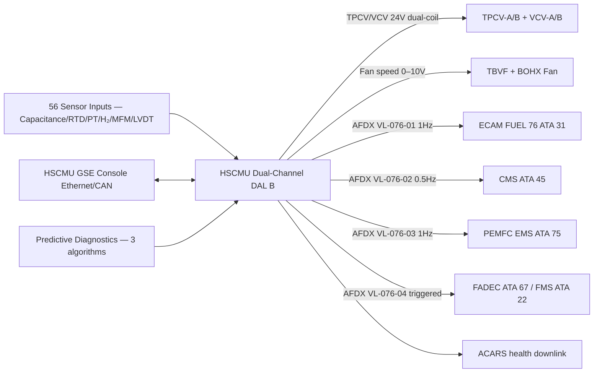
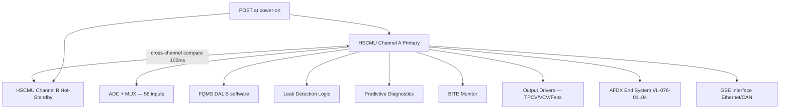

<!-- ──────────────────────────────────────────────────────────────────────────
     QATL-ATLAS-1000-ATLAS-070-079-07-076-080-HYDROGEN-STORAGE-MONITORING-DIAGNOSTICS-AND-CONTROL-INTERFACES
     ATA 28 (LH₂) · Hydrogen Storage Monitoring, Diagnostics and Control Interfaces
     AMPEL360E eWTW — ATLAS Register 1000
────────────────────────────────────────────────────────────────────────────── -->

# Hydrogen Storage Monitoring, Diagnostics and Control Interfaces

---

## §0 Hyperlink Policy

> All hyperlinks in this document are **relative** (five directory levels: `../../../../../`).
> Absolute URLs are forbidden. Every linked document must exist in the Q+ATLANTIDE repository
> before the link is activated. Broken links are treated as open issues and must be resolved
> before the document is promoted from `DRAFT` to `APPROVED`.

---

## §1 Purpose

This document describes the Hydrogen Storage Control and Monitoring Unit (HSCMU) architecture, its built-in test equipment (BITE) functions, diagnostic algorithms, and all control and data interfaces to the wider AMPEL360E eWTW avionics suite. The HSCMU is the central controller for the ATA 076 LH₂ storage system and the primary data source for the ECAM "FUEL 76" synoptic page, the CMS BITE database, and the PEMFC Energy Management System (ATA 75). This document consolidates the monitoring and diagnostics perspective across all other ATA 076 subsubjects.

---

## §2 Applicability

| Parameter | Value |
|---|---|
| Aircraft Program | AMPEL360E eWTW |
| ATA reference | ATA 28 (LH₂) — 076-080 Hydrogen Storage Monitoring, Diagnostics and Control Interfaces |
| Certification basis | EASA CS-25 Amdt 27+; DO-178C DAL B (HSCMU software); DO-254 DAL B (HSCMU hardware) |
| S1000D SNS | 076-080-00 |

---

## §3 Functional Description ![DRAFT]

**HSCMU architecture:** The HSCMU is a **dual-channel, dual-processor digital controller** qualified to DO-178C DAL B (software) and DO-254 DAL B (hardware), installed in the EE bay rack (1U). Channel A is the primary executive; Channel B runs in hot-standby. Cross-channel data comparison occurs every 100 ms; a discrepancy exceeding threshold on two consecutive cycles triggers a channel-B takeover and ECAM "HSCMU CH-A FAULT" advisory. Loss of both channels is a Major failure; demonstrated Extremely Improbable per FHA.

The HSCMU integrates all sensor inputs from both tanks:
- 6 capacitance probe segment signals per tank (12 total)
- 8 Pt-1000 RTD signals per tank (16 total)
- 3 pressure transducer signals per tank (6 total)
- 8 catalytic H₂ sensor signals (from Zone 1/2 areas, ATA 076-060)
- 2 GH₂ mass flow meter signals (boil-off, ATA 076-040)
- 2 TPCV position LVDT signals per TPCV (4 total)
- 2 VCV position feedback signals

**HSCMU control outputs:**
- TPCV-A and TPCV-B command (open/close/modulate) — 24 V DC dual-coil
- VCV-A and VCV-B command (open/close) — 24 V DC dual-coil
- TBVF speed command (analogue 0–10 V)
- BOHX fan speed command (analogue 0–10 V)
- FQMS output bus (AFDX) to ECAM and PEMFC EMS

**BITE (Built-In Test Equipment):** The HSCMU BITE performs continuous in-flight monitoring and power-on self-test (POST):
- *In-flight BITE:* Validates sensor range plausibility (e.g., temperature not below −256 °C or above +50 °C; pressure within 0–7 bar range); cross-checks capacitance-derived level against RTD thermal profile; confirms TPCV LVDT tracks command; compares GH₂ mass flow integral against FQMS quantity delta.
- *POST (power-on):* Exercises all sensor input channels; confirms actuator coil continuity; validates FQMS memory CRC; checks AFDX link quality.
- *Maintenance BITE:* Accessible via HSCMU GSE Ethernet/CAN interface; provides fault history, sensor trend logs, and allow manual actuation of TPCV/VCV for ground functional testing.

**Predictive diagnostics:** The HSCMU runs three predictive diagnostic algorithms:
1. **Vacuum degradation trend:** Computes normalised boil-off rate daily and compares against the baseline (first-fill calibration). A rising trend exceeding +20 % of baseline triggers a "VACUUM DEGRADE" advisory, scheduling a vacuum check within 500 FH.
2. **PRV seat leakage trend:** Monitors tank pressure decay rate during overnight ground hold with VCV and TPCV closed; a PRV pressure decay > 0.05 bar/h suggests PRV seat leakage, triggering a maintenance advisory.
3. **Sensor drift detection:** Compares redundant sensor readings (pressure 2-of-3; RTD pairs) over rolling 30-day windows; a drift exceeding ± 2σ of the initial paired spread triggers a sensor-calibration advisory.

**AFDX interface:** The HSCMU communicates on the **ARINC 664 P7 (AFDX)** network as a virtual link (VL) end system. It transmits:
- FUEL 76 display data packet (16 parameters, 1 Hz, VL-076-01) to ECAM (ATA 31)
- HSCMU BITE and health packet (32 parameters, 0.5 Hz, VL-076-02) to CMS (ATA 45)
- LH₂ quantity and boil-off available packet (4 parameters, 1 Hz, VL-076-03) to PEMFC EMS (ATA 75)
- Emergency isolation event packet (triggered, VL-076-04) to FADEC and FMS (ATA 67, ATA 22)

---

## §4 Functional Breakdown

| ID | Name | Description | Lead Division |
|---|---|---|---|
| F-001 | HSCMU dual-channel controller | DO-178C DAL B / DO-254 DAL B; 1U EE bay; hot-standby Ch-B | Q-HPC |
| F-002 | Sensor input processing | 56 inputs (capacitance, RTD, PT, H₂ sensor, MFM, LVDT) at 1–10 Hz | Q-HPC |
| F-003 | Control output management | TPCV/VCV dual-coil commands; TBVF/BOHX fan speed; 24 V DC | Q-HPC |
| F-004 | In-flight and POST BITE | Continuous plausibility monitoring; actuator coil continuity; FQMS CRC | Q-HPC |
| F-005 | Predictive diagnostics | Vacuum trend; PRV leakage trend; sensor drift detection | Q-HPC |
| F-006 | AFDX interface | ARINC 664 P7; 4 virtual links; ECAM / CMS / PEMFC EMS / FADEC | Q-HPC |
| F-007 | Maintenance BITE (GSE interface) | Fault history; trend logs; manual actuation via Ethernet/CAN GSE | Q-HPC |

---

## §5 System Context — Mermaid Diagram

---

## §6 Internal Architecture — Mermaid Diagram

---

## §7 Components and LRUs

| Component | Part Number | Qty | Location | Maintenance Interval | Notes |
|---|---|---|---|---|---|
| HSCMU — Hydrogen Storage Control and Monitoring Unit | HSCMU-PN-TBD | 1 | EE bay rack — 1U | Software update per SB; C-check BITE; on condition hardware | Dual-channel; DO-178C DAL B; DO-254 DAL B; AFDX ARINC 664 P7 |
| HSCMU output driver board (×2 per channel) | HSCMU-ODR-PN-TBD | 2 | Integrated in HSCMU | Per HSCMU removal | 24 V DC dual-coil drivers for TPCV/VCV |
| AFDX end system module (HSCMU) | HSCMU-AFDX-PN-TBD | 1 | Integrated in HSCMU | Per HSCMU removal | ARINC 664 P7 compliant; 4 VLs |
| HSCMU GSE cable assembly | HSCMU-GSE-CBL-PN-TBD | 1 (GSE item) | Maintenance GSE trolley | Annual inspect | Ethernet + CAN dual-interface; HSCMU maintenance port |

---

## §8 Interfaces

| Interface Type | Connected System | Protocol / Medium | Data / Function |
|---|---|---|---|
| ATA 31 ECAM | Electronic Centralised Aircraft Monitor | AFDX VL-076-01 | FUEL 76 synoptic: LH₂ mass per tank; pressure; temperature; leak alarms |
| ATA 45 CMS | Central Maintenance System | AFDX VL-076-02 | BITE fault codes; sensor health; predictive advisory data; trend logs |
| ATA 75 Fuel Cell | PEMFC Energy Management System | AFDX VL-076-03 | LH₂ mass available; boil-off GH₂ flow available; PEMFC draw limits |
| ATA 67 / FADEC | Full Authority Digital Engine Control | AFDX VL-076-04 | Emergency H₂ isolation event notification |
| ATA 22 FMS | Flight Management System | AFDX VL-076-04 | H₂ quantity for mission range calculation |
| ATA 73 Power Distribution | HVDC 270 V bus | HVDC power | HSCMU 270 V DC power supply |
| ATA 24 Electrical | Essential bus backup | HVDC 270 V essential | HSCMU powered from essential bus |
| ACARS | Aircraft Communication Addressing and Reporting | AFDX → ACARS gateway | Health and leak event downlinks |
| GSE Ethernet/CAN | Maintenance GSE | Ethernet / CAN physical | BITE download; trend log; ground functional test command |

---

## §9 Operating Modes

| Mode | Trigger | System State | Actions / Consequences |
|---|---|---|---|
| Normal flight | Both tanks healthy; no alarms | HSCMU Ch-A primary; Ch-B standby; all 56 inputs valid | Continuous 1 Hz sensor monitoring; ECAM normal |
| Ch-A fault | Cross-channel discrepancy > threshold | Ch-B takes over; Ch-A deactivated | ECAM "HSCMU CH-A FAULT" advisory; maintenance required |
| H₂ leak alarm | Any H₂ sensor ≥ threshold | Automated response per 076-060 logic | ECAM alarm; TPCV isolation at 40 % LEL |
| Predictive advisory | Vacuum/PRV/sensor drift threshold exceeded | HSCMU raises maintenance advisory | ECAM or CMS maintenance message; no automatic action |
| Ground maintenance (BITE) | HSCMU GSE connected | Maintenance BITE mode active | All sensor readings visible; manual actuation enabled |
| POST failure | Power-on self-test fails any channel | Affected channel disabled; advisory raised | ECAM "HSCMU CH-X INOP"; single-channel operation |

---

## §10 Performance and Budgets ![DRAFT]

| Parameter | Requirement | Target / Design Value | Status |
|---|---|---|---|
| HSCMU sensor scan rate | ≥ 1 Hz | 1 Hz (all 56 inputs) | ![TBD] |
| HSCMU cross-channel comparison rate | ≥ 10 Hz | 10 Hz | ![TBD] |
| AFDX VL latency (HSCMU to ECAM) | ≤ 100 ms | ≤ 50 ms target | ![TBD] |
| HSCMU POST duration | ≤ 30 s | ≤ 20 s target | ![TBD] |
| HSCMU fault detection latency (in-flight BITE) | ≤ 1 s | ≤ 0.5 s target | ![TBD] |
| HSCMU availability (dispatch) | ≥ 99.99 % | Dual-channel architecture | ![TBD] |
| HSCMU power consumption | ≤ 50 W | ≤ 40 W target | ![TBD] |
| HSCMU software DAL | DAL B (DO-178C) | DAL B | Defined |

---

## §11 Safety, Redundancy and Fault Tolerance

- HSCMU dual-channel hot-standby with cross-channel comparison at 10 Hz provides near-instantaneous detection of a channel fault.
- All TPCV/VCV actuator commands use dual-coil (Channel A coil + Channel B coil) design: loss of one HSCMU channel does not prevent valve command from the surviving channel.
- HSCMU is powered from the HVDC 270 V essential bus (ATA 24), which is maintained during battery emergency operation — ensuring HSCMU remains functional even with both PEMFC stacks and both PMSGs offline.
- Loss of HSCMU both channels simultaneously places TPCV and VCV in "normally closed" (fail-safe state): tanks become isolated; PRVs and burst discs provide passive protection; PEMFC is starved of hydrogen and shuts down. This scenario is Extremely Improbable per FHA.
- HSCMU predictive diagnostics are advisory-only (no automatic action) — false-positive advisories are tolerated; false-negative predictions are mitigated by the scheduled maintenance programme.
- All AFDX messages from HSCMU are transmitted with message integrity fields per ARINC 664 P7; a corrupted message is detected by ECAM/CMS and the last-known-good value is frozen with an advisory flag.

---

## §12 Maintenance and Diagnostics

| Task | Interval | Access | Special Tools |
|---|---|---|---|
| HSCMU BITE download and fault review | A-check | HSCMU GSE Ethernet/CAN | HSCMU GSE console; BITE reader software |
| HSCMU POST functional check (power-on) | Each flight (automatic) | No maintenance action (auto) | — |
| HSCMU software version and CRC verify | Each SB update | CMS terminal or HSCMU GSE | CMS GSE; HSCMU loader tool |
| AFDX VL link quality check (latency and packet loss) | C-check | HSCMU GSE | AFDX analyser |
| HSCMU output driver functional test (TPCV/VCV actuation) | A-check | HSCMU GSE manual actuation | HSCMU GSE console |
| HSCMU predictive advisory trend review | A-check | CMS terminal | CMS GSE; HSCMU trend report |
| HSCMU replacement (LRU swap) | On condition per BITE | EE bay rack | Standard EE bay tools; HSCMU GSE for software load |
| Cross-channel comparison test (inject known fault) | C-check | HSCMU GSE | HSCMU GSE fault injection test mode |

---

## §13 Footprint

| Footprint Type | Parameter | Value | Notes |
|---|---|---|---|
| Physical | HSCMU envelope | 1U (44 mm H × 480 mm W × 300 mm D estimated) | EE bay standard rack unit |
| Physical | HSCMU mass | ![TBD] | Pending OEM |
| Data | Total sensor inputs | 56 | Capacitance + RTD + PT + H₂ sensor + MFM + LVDT |
| Data | AFDX virtual links | 4 (VL-076-01 to -04) | ECAM / CMS / PEMFC EMS / FADEC-FMS |
| Power | HSCMU power (270 V DC) | ≤ 50 W | Essential bus powered |
| Software | HSCMU code size (estimate) | ![TBD] | DO-178C DAL B compliance package required |

---

## §14 Safety and Certification References ![DRAFT]

| Standard / Document | Title | Issuing Body | Applicability |
|---|---|---|---|
| EASA CSH-2 | Certification Specifications for Hydrogen | EASA | HSCMU functional requirements and safety objectives |
| DO-178C | Software Considerations in Airborne Systems | RTCA | HSCMU DAL B software qualification |
| DO-254 | Design Assurance Guidance for Airborne Electronic Hardware | RTCA | HSCMU DAL B hardware qualification |
| DO-160G | Environmental Conditions and Test Procedures | RTCA | HSCMU environmental qualification |
| ARINC 664 P7 | Aircraft Data Network (AFDX) | ARINC | HSCMU AFDX interface standard |
| ARP4754A | Guidelines for Development of Civil Aircraft and Systems | SAE | System-level HSCMU development assurance |
| ARP4761 | Guidelines and Methods for Safety Assessment | SAE | FHA/FMEA for HSCMU |

---

## §15 V&V Approach ![TBD]

| Phase | Method | Acceptance Criterion | Status |
|---|---|---|---|
| Design | FHA / FMEA — HSCMU dual-channel failure modes | Dual-channel loss = Extremely Improbable; single channel loss = Major (acceptable) | ![TBD] |
| Unit test | HSCMU hardware qualification (DO-254 DAL B) | All DO-254 objectives met | ![TBD] |
| Unit test | HSCMU software qualification (DO-178C DAL B) | All DO-178C DAL B objectives met; 100 % MC/DC coverage | ![TBD] |
| Integration | HSCMU-ECAM AFDX latency test | VL-076-01 latency ≤ 50 ms; zero packet loss | ![TBD] |
| Integration | Full HSCMU functional test (all 56 inputs; all outputs; BITE; predictive algorithms) | All functions operate within specification | ![TBD] |
| Certification | DO-160G environmental qualification | All categories pass | ![TBD] |

---

## §16 Glossary

| Term | Definition |
|---|---|
| **HSCMU** | Hydrogen Storage Control and Monitoring Unit — dual-channel digital controller for the ATA 076 LH₂ storage system. |
| **BITE** | Built-In Test Equipment — automated fault detection and reporting functions within the HSCMU. |
| **POST** | Power-On Self-Test — HSCMU self-diagnostic sequence executed at power application. |
| **AFDX** | Avionics Full-Duplex Switched Ethernet (ARINC 664 P7) — deterministic aircraft data network. |
| **VL** | Virtual Link — unidirectional AFDX communication channel with guaranteed bandwidth and latency. |
| **DAL B** | Design Assurance Level B — second-highest DO-178C/DO-254 classification; failure could cause severe injury. |
| **MC/DC** | Modified Condition/Decision Coverage — DO-178C DAL B structural coverage criterion for software. |
| **Hot-standby** | Channel B is powered and running in parallel with Channel A, ready to take over immediately without power-on delay. |

---

## §17 Open Issues

| ID | Description | Owner | Target |
|---|---|---|---|
| OI-076-080-001 | Define AFDX VL bandwidth allocation for all 4 HSCMU virtual links and confirm AFDX bus load budget at aircraft level | Q-HPC | 2026-Q4 |
| OI-076-080-002 | Complete HSCMU FHA / FMEA with FHA team for DAL B rationale documentation | Q-HPC / Safety | 2027-Q1 |
| OI-076-080-003 | Define predictive diagnostic algorithm threshold values for vacuum degradation and PRV leakage trends (requires first-article calibration data) | Q-HPC | 2027-Q2 |

---

## §18 Status Legend

| Badge | Meaning |
|---|---|
| `![DRAFT]` | Section is drafted but not yet reviewed |
| `![TBD]` | Content not yet started — to be defined |
| `![To Be Completed]` | Partially complete — needs additional content |
| `![APPROVED]` | Reviewed and formally approved |

---

## §19 Related Documents (Siblings in this Subsection)

- [076-000](./076-000-Hydrogen-Fuel-Storage-Onboard-General.md)
- [076-010](./076-010-LH2-Tank-Architecture.md)
- [076-020](./076-020-Cryogenic-Tank-Insulation-and-Supports.md)
- [076-030](./076-030-Tank-Pressure-Control-and-Venting.md)
- [076-040](./076-040-Boil-Off-Management.md)
- [076-050](./076-050-Hydrogen-Quantity-Indication-and-Sensing.md)
- [076-060](./076-060-Hydrogen-Storage-Safety-Zones-and-Leak-Detection.md)
- [076-070](./076-070-Hydrogen-Storage-Service-and-Maintenance.md)
- [076-090](./076-090-S1000D-CSDB-Mapping-and-Traceability.md)

---

## §20 Change Log

| Rev | Date | Author | Description |
|---|---|---|---|
| 0.1 | 2026-05-12 | @copilot | Initial DRAFT — HSCMU architecture, BITE, predictive diagnostics, AFDX interfaces for AMPEL360E eWTW |
