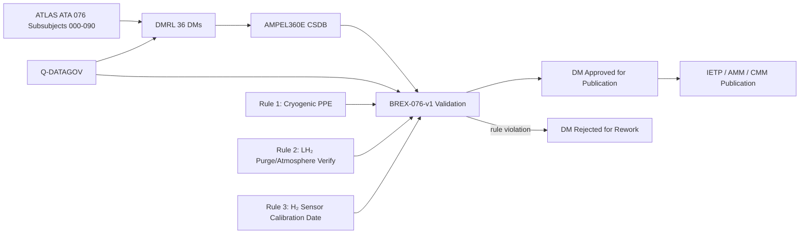
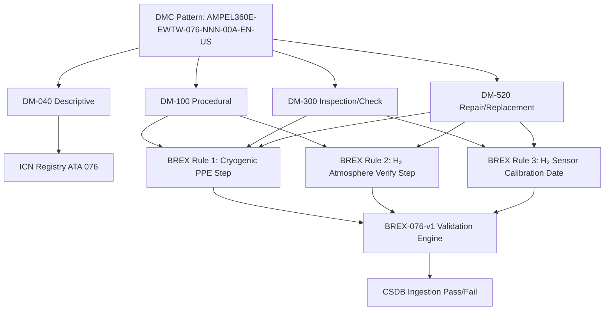

<!-- ──────────────────────────────────────────────────────────────────────────
     QATL-ATLAS-1000-ATLAS-070-079-07-076-090-S1000D-CSDB-MAPPING-AND-TRACEABILITY
     ATA 28 (LH₂) · S1000D / CSDB Mapping and Traceability
     AMPEL360E eWTW — ATLAS Register 1000
────────────────────────────────────────────────────────────────────────────── -->

# S1000D / CSDB Mapping and Traceability

---

## §0 Hyperlink Policy

> All hyperlinks in this document are **relative** (five directory levels: `../../../../../`).
> Absolute URLs are forbidden. Every linked document must exist in the Q+ATLANTIDE repository
> before the link is activated. Broken links are treated as open issues and must be resolved
> before the document is promoted from `DRAFT` to `APPROVED`.

---

## §1 Purpose

This document maps the ATLAS ATA 28 (LH₂) subsubject 076 structure to S1000D Data Module Codes (DMCs) and defines the Data Module Requirement List (DMRL) and Business Rules eXchange (BREX) constraints for the AMPEL360E eWTW Hydrogen Fuel Storage — Onboard Common Source DataBase (CSDB).

ATA 076 DMRL for AMPEL360E eWTW: **36 data modules**. DMC pattern: `AMPEL360E-EWTW-076-{NNN}-00A-EN-US`. BREX document: `AMPEL360E-BREX-076-v1`, enforcing three domain-specific constraints specific to cryogenic hydrogen storage systems as described in §3.

This document is owned by Q-DATAGOV and reviewed at each CSDB milestone (DMRL baseline, DMRL first issue, DMRL final). It is the authoritative traceability record linking ATLAS ATA 076 documents to the S1000D technical publication set, including the Aircraft Maintenance Manual (AMM), Component Maintenance Manual (CMM), and Interactive Electronic Technical Publication (IETP).

---

## §2 Applicability

| Parameter | Value |
|---|---|
| Aircraft Program | AMPEL360E eWTW |
| ATA reference | ATA 28 (LH₂) — 076-090 S1000D / CSDB Mapping and Traceability |
| Certification basis | S1000D Issue 5.0; CS-25 §25.1529 (ICA); EASA CSH-2 |
| S1000D SNS | 076-090-00 |

---

## §3 Functional Description ![DRAFT]

**BREX AMPEL360E-BREX-076-v1 enforces three domain-specific cryogenic hydrogen constraints:**

1. **Cryogenic PPE rule:** All maintenance Data Modules (DM type 100, 300, or 520) that require physical access to the LH₂ tank bay, fill couplings, TPCV/VCV valves, PRV manifold, or any component within Zone 1 or Zone 2 (as defined in ATLAS 076-060) must include the **mandatory cryogenic PPE step**: face shield, cryogenic gauntlet gloves, cryogenic apron/coverall, closed-toe safety footwear. This rule prevents maintenance DMs from being published without the mandatory cryogenic personal protection, protecting technicians from LH₂ splash burns (−253 °C) and cold GH₂ asphyxiation.

2. **LH₂ purge/atmosphere verification rule:** All DMs for tasks requiring entry into Zone 1 or Zone 2 areas (DM type 100, 300, or 520 for tank bay access, valve R&R, sensor R&R, or open-tank work) must include a **hydrogen atmosphere verification step** before entry: portable H₂ detector reading < 10 % LEL (< 0.4 % v/v). For open-tank work (tank access, valve open-work), an additional **GN₂ purge confirmation step** (H₂ < 1 % v/v) must precede any task step involving direct contact with LH₂-wetted surfaces. This rule prevents DMs from authorising access to hazardous hydrogen atmospheres without the verified atmospheric safety pre-condition.

3. **H₂ sensor calibration rule:** All DMs referencing catalytic H₂ sensor readings (any use of sensor output as an access precondition or as a test acceptance criterion) must cite the **H₂ sensor calibration date** (≤ 6 months) before the reading is considered valid. This rule prevents maintenance decisions — including safe-access declarations — from being made on readings from an out-of-calibration or degraded catalytic sensor, whose bead poisoning could produce falsely low readings that mask true hydrogen leakage.

---

## §4 Functional Breakdown

| ID | Name | Description | Lead Division |
|---|---|---|---|
| F-001 | DMRL — 36 DMs | Full DMRL for ATA 076: all 36 DM codes tracked; status managed by Q-DATAGOV | Q-DATAGOV |
| F-002 | BREX-076-v1 — 3 rules | Cryogenic PPE rule, LH₂ purge/atmosphere rule, H₂ sensor calibration rule; checked at CSDB ingestion | Q-DATAGOV |
| F-003 | ICN registry ATA 076 | Illustration Control Numbers for LH₂ tank cross-section, MLI detail, PRV manifold schematic, vent mast, HSCMU block diagram, zone maps, fill coupling | Q-DATAGOV |
| F-004 | DM-040 descriptive modules | System description DMs for tanks, insulation, TPCV/VCV, PRVs, BOHX, FQMS, HSCMU, safety zones | Q-GREENTECH |
| F-005 | DM-300 inspection / check modules | Scheduled maintenance task DMs for A-check, C-check, and annual tasks per MPD | Q-AIR |
| F-006 | DM-520 repair / replacement modules | Unscheduled maintenance DMs for TPCV/VCV/PRV/sensor R&R; burst disc replacement; HSCMU swap | Q-MECHANICS |
| F-007 | DM-100 procedural modules | Operational and servicing procedure DMs: LH₂ fill; GN₂ purge; LOTO; vent mast inspection | Q-MECHANICS |

---

## §5 System Context — Mermaid Diagram

---

## §6 Internal Architecture — Mermaid Diagram

---

## §7 Components and LRUs

| Component | Part Number | Qty | Location | Maintenance Interval | Notes |
|---|---|---|---|---|---|
| S1000D Issue 5.0 | S1000D.org | CSDB | IT infrastructure | Per S1000D issue update | XML authoring standard for all 36 DMs |
| BREX-076-v1 | Programme document | CSDB validator | IT | Per programme revision | Three cryogenic H₂ domain rules enforced |
| DMRL — 36 DMs | Q-DATAGOV tracker | PMO | PMO tool | Monthly review | All 36 DMs tracked for status per subsubject |
| ICN registry ATA 076 | Q-DATAGOV database | CSDB | IT | Continuous | All LH₂ system diagrams and zone maps traced |
| H₂ sensor calibration registry | Q-DATAGOV document control | CSDB | IT | Per calibration event | Source data for BREX Rule 3 — calibration dates |
| AMM task card set (ATA 076) | Q-DATAGOV + CAMO | Technician use | IT / paper | Per revision cycle | Approved by EASA per CS-25 §25.1529 |

---

## §8 Interfaces

| Interface Type | Connected System | Protocol / Medium | Data / Function |
|---|---|---|---|
| ATA 45 CMS | Central Maintenance System | AFDX | BITE fault codes cross-referenced to DM-300 task codes |
| S1000D CSDB | Common Source DataBase | XML / HTTP | DM storage, BREX validation, publication |
| H₂ Sensor Calibration Registry | Q-DATAGOV document control | Document exchange | Source data for BREX Rule 3 — calibration dates |
| HSCMU BITE Log | HSCMU NV memory / CMS | GSE serial / CMS | Maintenance event history cross-referenced to DM-520 task codes |
| IETP Publication | Interactive Electronic Technical Publication | HTML5 / XML | Technician access to approved DMs via tablet/laptop |
| Q-DATAGOV DMRL Tracker | PMO tool | Web-based | 36 DM status tracking, milestone reporting |

---

## §9 Operating Modes

| Mode | Trigger | System State | Actions / Consequences |
|---|---|---|---|
| DMRL baseline | PDR milestone | Initial 36 DM codes allocated | Q-DATAGOV issues DMRL-076-v0 |
| DM authoring | Programme schedule | Authors create DMs per DMRL and BREX | BREX-076-v1 checked at CSDB ingestion |
| BREX violation | Rule 1, 2, or 3 triggered | DM rejected | Author corrects DM; re-submits to CSDB |
| CSDB milestone review | Per programme gate | All DMs reviewed for status | Q-DATAGOV reports DM completion % |
| LH₂ fill procedure update | Fill rate or coupling design change | DM-100 fill procedure revised | BREX Rule 2 atmosphere verify step re-confirmed in revision |
| Sensor replacement event | H₂ sensor R&R in service | DM-520 sensor task must reference calibration date per Rule 3 | Post-replacement sensor calibration recorded in Q-DATAGOV registry |
| IETP publication | Certification milestone | All 36 DMs approved | IETP issued to airline customers and MRO facilities |

---

## §10 Performance and Budgets ![DRAFT]

| Parameter | Requirement | Target / Design Value | Status |
|---|---|---|---|
| DMRL completeness at CDR | ≥ 80 % DMs in DRAFT | 90 % target | ![TBD] |
| BREX validation pass rate | 100 % at final milestone | 100 % | ![TBD] |
| ICN traceability coverage | 100 % of figures in DMs | 100 % | ![TBD] |
| DM review cycle time | ≤ 10 working days per DM | 7 days target | ![TBD] |
| IETP publication lead time | ≤ 3 months pre-EIS | On schedule | ![TBD] |

---

## §11 Safety, Redundancy and Fault Tolerance

- BREX Rule 1 (Cryogenic PPE) is a safety-critical rule: absence of the mandatory PPE step in a maintenance DM could expose technicians to LH₂ cryogenic burns or cold GH₂ asphyxiation. The BREX engine rejects any DM requiring physical access without the PPE step.
- BREX Rule 2 (LH₂ purge/atmosphere verification) is a safety-critical rule: authorising entry to Zone 1/2 without atmospheric verification could expose technicians to flammable or oxygen-deficient atmospheres. The BREX engine rejects any access DM missing the atmosphere check step.
- BREX Rule 3 (H₂ sensor calibration date) is a safety-relevant quality rule: a catalytic sensor with a poisoned bead produces falsely low readings — an out-of-calibration sensor could indicate "safe" when the atmosphere is actually above LEL. The 6-month calibration requirement matches the sensor calibration interval defined in 076-060.
- CSDB version control ensures only approved DMs are published; superseded DMs are archived with obsolescence date.
- BREX rules are programme-configuration-controlled; any rule change requires Q-DATAGOV change authority approval.
- All three BREX rules derive directly from the safety analysis of the AMPEL360E eWTW LH₂ system hazards identified in the FHA for ATA 076; they are not generic best-practice rules but system-specific safety requirements.

---

## §12 Maintenance and Diagnostics

| Task | Interval | Access | Special Tools |
|---|---|---|---|
| DMRL status review | Monthly | Q-DATAGOV PMO tool | PMO tracker |
| BREX validation run on all 36 DMs | At each CSDB milestone | CSDB BREX engine | CSDB tool |
| H₂ sensor calibration registry update | After each sensor calibration (every 6 months per 8 sensors) | Q-DATAGOV document control | Calibration certificate database |
| ICN registry audit | Annually | Q-DATAGOV database | ICN tool |
| AMM task card currency check (against HSCMU BITE update) | Per HSCMU software SB | Q-DATAGOV + CAMO | DM revision tool |
| BREX rule change review | Per programme design change | Q-DATAGOV change authority | BREX document version control |

---

## §13 Footprint

| Footprint Type | Parameter | Value | Notes |
|---|---|---|---|
| Data | Total DMs ATA 076 | 36 DMs | Per DMRL-076 |
| Data | DM types | 040 / 100 / 300 / 520 | Descriptive / Procedural / Inspection / Repair |
| Data | CSDB storage estimate | ![TBD] | Per DM average size × 36 |
| Maintenance | DMRL review man-hours | ~2 h/month | Q-DATAGOV |
| Data | BREX rules count | 3 rules | BREX-076-v1 |
| Data | ICN count (estimate) | ~45 ICNs | Tank cross-section, MLI detail, zone maps, HSCMU diagram, fill/vent schematics, PRV manifold |

---

## §14 Safety and Certification References ![DRAFT]

| Standard / Document | Title | Issuing Body | Applicability |
|---|---|---|---|
| S1000D Issue 5.0 | Technical Publications Standard | S1000D.org | DM authoring standard for all 36 DMs |
| ATA iSpec 2200 | Chapter 28 (Fuel) | ATA | ATA SNS reference for DM coding (adapted to LH₂) |
| EASA CS-25 §25.1529 | Instructions for Continued Airworthiness | EASA | ICA requirement driving DM content |
| EASA CSH-2 | Certification Specifications for Hydrogen | EASA | Hydrogen-specific ICA requirements |
| AMPEL360E GP-CSDB-001 | CSDB Governance Procedure | Q-DATAGOV | CSDB workflow and DMRL management |
| OSHA 29 CFR 1910.147 | Control of Hazardous Energy (LOTO) | OSHA | Regulatory basis for BREX Rule 2 atmosphere verification |
| IEC 60079-29-1 | Explosive atmospheres — Gas detectors | IEC | Regulatory basis for BREX Rule 3 catalytic sensor calibration |

---

## §15 V&V Approach ![TBD]

| Phase | Method | Acceptance Criterion | Status |
|---|---|---|---|
| Design | DMRL review at PDR | All 36 DM codes allocated and scoped | ![TBD] |
| Integration | BREX validation run at CDR | Zero BREX violations in submitted DMs | ![TBD] |
| Qualification | Full CSDB review at SOW milestone | All 36 DMs in REVIEW or APPROVED status | ![TBD] |
| Certification | EASA ICA review — CS-25 §25.1529 + CSH-2 | AMM/CMM approved; IETP published | ![TBD] |

---

## §16 Glossary

| Term | Definition |
|---|---|
| **DMC** | Data Module Code — unique S1000D identifier for each DM (format: AMPEL360E-EWTW-076-NNN-00A-EN-US). |
| **DMRL** | Data Module Requirement List — list of all 36 required DMs for the ATA 076 CSDB publication. |
| **BREX** | Business Rules eXchange — programme-specific rules enforced at CSDB ingestion; 3 rules in BREX-076-v1. |
| **ICN** | Illustration Control Number — unique identifier for each graphic/figure in a DM. |
| **CSDB** | Common Source DataBase — authoritative storage for S1000D DMs. |
| **IETP** | Interactive Electronic Technical Publication — electronic format for technician use (tablet/laptop). |
| **DM-040** | S1000D descriptive data module type (system/component description). |
| **DM-100** | S1000D procedural data module type (operational and servicing procedures). |
| **DM-300** | S1000D inspection/check data module type (scheduled maintenance tasks). |
| **DM-520** | S1000D repair data module type (unscheduled maintenance, LRU replacement). |
| **Cryogenic PPE rule** | BREX Rule 1: all Zone 1/2 access DMs must include face shield, cryogenic gloves, apron/coverall, footwear step. |
| **LH₂ purge rule** | BREX Rule 2: all Zone 1/2 access DMs must include H₂ atmosphere < 10 % LEL verification step; open-tank work requires < 1 % v/v GN₂ purge confirmation. |
| **H₂ sensor calibration rule** | BREX Rule 3: all DMs using H₂ sensor readings must cite calibration date ≤ 6 months. |

---

## §17 Open Issues

| ID | Description | Owner | Target |
|---|---|---|---|
| OI-076-090-001 | Complete DMRL-076 DM scoping with content authors for all 36 DMs; agree DM type (040/100/300/520) assignments | Q-DATAGOV | 2026-Q4 |
| OI-076-090-002 | Confirm CSDB BREX engine capability to validate PPE step presence in procedural DMs (BREX Rule 1) | Q-DATAGOV / IT | 2026-Q4 |
| OI-076-090-003 | Define ICN numbering scheme for all ATA 076 illustrations (tank cross-section, MLI, zone maps, HSCMU block diagram) | Q-DATAGOV | 2027-Q1 |

---

## §18 Status Legend

| Badge | Meaning |
|---|---|
| `![DRAFT]` | Section is drafted but not yet reviewed |
| `![TBD]` | Content not yet started — to be defined |
| `![To Be Completed]` | Partially complete — needs additional content |
| `![APPROVED]` | Reviewed and formally approved |

---

## §19 Related Documents (Siblings in this Subsection)

- [076-000](./076-000-Hydrogen-Fuel-Storage-Onboard-General.md)
- [076-010](./076-010-LH2-Tank-Architecture.md)
- [076-020](./076-020-Cryogenic-Tank-Insulation-and-Supports.md)
- [076-030](./076-030-Tank-Pressure-Control-and-Venting.md)
- [076-040](./076-040-Boil-Off-Management.md)
- [076-050](./076-050-Hydrogen-Quantity-Indication-and-Sensing.md)
- [076-060](./076-060-Hydrogen-Storage-Safety-Zones-and-Leak-Detection.md)
- [076-070](./076-070-Hydrogen-Storage-Service-and-Maintenance.md)
- [076-080](./076-080-Hydrogen-Storage-Monitoring-Diagnostics-and-Control-Interfaces.md)

---

## §20 Change Log

| Rev | Date | Author | Description |
|---|---|---|---|
| 0.1 | 2026-05-12 | @copilot | Initial DRAFT — S1000D CSDB mapping, DMRL 36 DMs, BREX-076-v1 (3 cryogenic H₂ rules) for AMPEL360E eWTW ATA 076 |
