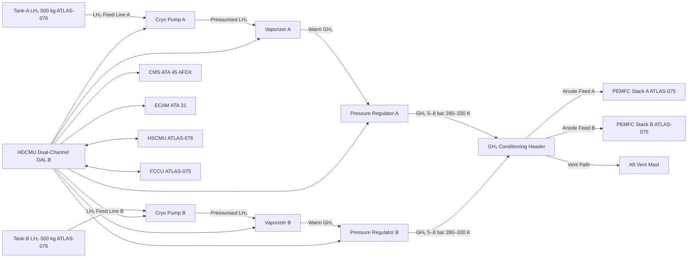
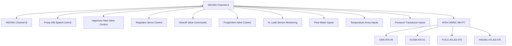

<!-- ──────────────────────────────────────────────────────────────────────────
     QATL-ATLAS-1000-ATLAS-070-079-07-077-000-HYDROGEN-DISTRIBUTION-AND-CONDITIONING-GENERAL
     ATA 28 (GH₂/LH₂ Distribution) · Hydrogen Distribution and Conditioning — General
     programme-defined aircraft type — ATLAS Register 1000
────────────────────────────────────────────────────────────────────────────── -->

# Hydrogen Distribution and Conditioning — General

---

## §0 Hyperlink Policy

> All hyperlinks in this document are **relative** (five directory levels: `../../../../../`).
> Absolute URLs are forbidden. Every linked document must exist in the Q+ATLANTIDE repository
> before the link is activated. Broken links are treated as open issues and must be resolved
> before the document is promoted from `DRAFT` to `APPROVED`.

---

## §1 Purpose

This document defines the agnostic ATLAS standard-level architecture context for `Hydrogen Distribution and Conditioning — General`.

It describes the controlled scope, functions, interfaces, safety considerations, lifecycle traceability, and S1000D/CSDB mapping logic that programme implementations shall instantiate when this node is applicable.

This document is not a programme design baseline. Programme-specific capacities, locations, part numbers, effectivity, operating limits, maintenance references, and data module codes shall be defined only inside the applicable programme implementation branch.
## §2 Applicability

| Applicability Level | Rule |
|---|---|
| Standard taxonomy | Applies to the ATLAS node `077` |
| Programme implementation | Conditional; determined by programme architecture, trade studies, certification basis, and applicability model |
| Product configuration | Defined in the programme-specific configuration baseline |
| Effectivity | Defined in the programme CSDB / applicability layer |
| Non-applicability | Must be explicitly stated in the programme impact-study branch when excluded |
## §3 Functional Description ![DRAFT]

The programme-defined aircraft type Hydrogen Distribution and Conditioning (HDC) system bridges the onboard LH₂ cryogenic storage (ATLAS 076) and the PEMFC power generation system (ATLAS 075). Its principal function is to convert LH₂ stored at approximately 20 K, 1.5–3.0 bar(a) into warm, regulated GH₂ delivered at the PEMFC anode inlet at 5–8 bar(a) and 280–330 K, at a combined flow rate supporting **200 kW total fuel cell power** (2 × 100 kW stacks under maximum continuous output).

The **Hydrogen Distribution and Conditioning Monitoring Unit (HDCMU)** — a dual-channel controller qualified to DO-178C DAL B / DO-254 DAL B — governs the entire HDC system. The HDCMU executes pressure and flow control loops, monitors line and component temperatures, supervises leak-detection sensors, and coordinates system isolation in abnormal or emergency conditions. It communicates with the **Fuel Cell Control Unit (FCCU, ATA 75)**, the **Hydrogen Storage Control and Monitoring Unit (HSCMU, ATA 076)**, and the **Central Maintenance System (CMS, ATA 45)** over the AFDX ARINC 664 P7 network; cockpit synoptic data are presented on the ECAM (ATA 31).

The HDC system is designed to handle **both cryogenic LH₂ (liquid phase) in the upstream feed sections and warm GH₂ (gas phase) in the downstream conditioning and delivery sections**, with material selection, insulation strategy, and component ratings matched to the operating phase in each segment. The system architecture ensures no LH₂ liquid carryover reaches the PEMFC stacks; all hydrogen delivered to the fuel cells is fully vaporized and within the PEMFC inlet temperature envelope.

---

## §4 Functional Breakdown

| ID | Name | Description | Lead Division |
|---|---|---|---|
| F-001 | LH₂ feed lines and manifolds | Cryogenic-insulated lines from Tank-A/B outlet to vaporizer inlets; vacuum-jacketed where required | Q-MECHANICS |
| F-002 | Cryogenic pumps / recirculators | LH₂ cryogenic centrifugal pumps boost flow and feed pressure; two pumps (A/B), redundant | Q-MECHANICS |
| F-003 | Vaporizers / heat exchangers | BOHX (boil-off recovery) and primary vaporizer warm LH₂ to GH₂; fuel cell coolant loop as heat source | Q-GREENTECH |
| F-004 | Pressure regulators and shutoff valves | Staged pressure regulation from tank pressure (1.5–3.0 bar) to PEMFC inlet (5–8 bar) via regulators; SOVs for isolation | Q-MECHANICS |
| F-005 | GH₂ conditioning manifold | Warm GH₂ common header distributes regulated gas to stacks A and B; cross-connect valve for redundancy | Q-GREENTECH |
| F-006 | Purge, vent, and drain interfaces | GN₂ purge lines; GH₂ vent path to aft vent mast; low-point drain provisions for water from warm sections | Q-AIR |
| F-007 | Leak detection and isolation | Catalytic H₂ sensors in all distribution zones; automatic isolation valves; HDCMU isolation logic | Q-GREENTECH |
| F-008 | HDCMU monitoring and control | Dual-channel DAL B controller; AFDX interface; pressure, temperature, flow-rate control loops | Q-HPC |

---

## §5 System Context — Mermaid Diagram

---

## §6 Internal Architecture — Mermaid Diagram

---

## §7 Components and LRUs

| Component | Part Number | Qty | Location | Maintenance Interval | Notes |
|---|---|---|---|---|---|
| HDCMU Hydrogen Distribution and Conditioning Monitoring Unit | HDCMU-PN-TBD | 1 | EE bay rack | Software update per SB; C-check BITE | Dual-channel; DO-178C DAL B; DO-254 DAL B |
| Cryogenic Feed Line Assembly A | CFLА-PN-TBD | 1 | Aft fuselage, port side | On condition; annual inspection | Vacuum-jacketed SS 316L; Tank-A outlet to Pump-A |
| Cryogenic Feed Line Assembly B | CFLB-PN-TBD | 1 | Aft fuselage, stbd side | On condition; annual inspection | Vacuum-jacketed SS 316L; Tank-B outlet to Pump-B |
| LH₂ Cryogenic Pump A | CPMP-A-PN-TBD | 1 | Aft pylon port | 2 500 h/C-check overhaul | Cryogenic centrifugal; ATEX rated; 0–3.5 bar(a) boost |
| LH₂ Cryogenic Pump B | CPMP-B-PN-TBD | 1 | Aft pylon stbd | 2 500 h/C-check overhaul | Identical to Pump-A; cross-feed capable |
| Vaporizer Heat Exchanger A | VAP-A-PN-TBD | 1 | Aft nacelle port | C-check effectiveness test | LH₂-to-GH₂; FC coolant loop heat source; Al alloy |
| Vaporizer Heat Exchanger B | VAP-B-PN-TBD | 1 | Aft nacelle stbd | C-check effectiveness test | Identical to Vaporizer-A |
| GH₂ Pressure Regulator A | PREG-A-PN-TBD | 1 | Nacelle port gas section | A-check set-point verification | 2-stage regulator; 1.5–3.5 bar in → 5–8 bar out |
| GH₂ Pressure Regulator B | PREG-B-PN-TBD | 1 | Nacelle stbd gas section | A-check set-point verification | Identical to Regulator-A |
| GH₂ Shutoff Valve (×4) | SOV-PN-TBD | 4 | Feed lines upstream/downstream of vaporizers | A-check operational test | NC solenoid; ATEX; cryogenic-rated upstream pair |
| GH₂ Conditioning Header Cross-Connect Valve | XCON-PN-TBD | 1 | Header manifold mid-section | A-check operational test | Enables single-pump/single-tank feed to both stacks |
| H₂ Leak Sensor, catalytic (×10) | H2S-CAT-PN-TBD | 10 | Feed line zone; vaporizer zone; header zone | 6-month calibration | 0–100 % LEL; alarm at 10 % LEL |
| GN₂ Purge Valve (×3) | PRGV-PN-TBD | 3 | Feed line purge points | A-check operational test | Normally closed; GN₂ supply from ATA 47 NGS |
| GH₂ Vent Valve (×2) | VNTV-PN-TBD | 2 | Header vent branch | A-check operational test | Normally closed; GH₂ to aft vent mast |
| Mass Flow Meter (×4) | MFM-PN-TBD | 4 | Feed lines A/B; header outlets to FC-A/B | C-check calibration | Coriolis type; cryogenic-compatible upstream pair |

---

## §8 Interfaces

| Interface Type | Connected System | Protocol / Medium | Data / Function |
|---|---|---|---|
| ATA 076 H₂ Storage | HSCMU — LH₂ Tanks A/B | LH₂ cryogenic line + AFDX | LH₂ supply from tanks; HSCMU ↔ HDCMU coordination |
| ATA 075 Fuel Cell | FCCU — PEMFC Stacks A/B | GH₂ anode feed line + AFDX | GH₂ delivery at 5–8 bar, 280–330 K; flow demand signal from FCCU |
| ATA 45 CMS | Central Maintenance System | AFDX ARINC 664 P7 | HDCMU BITE faults; leak events; pressure/temperature trend data |
| ATA 31 ECAM | Cockpit ECAM display | AFDX | FUEL 77 synoptic: pressures, temperatures, pump status, valve state, leak alarms |
| ATA 24 Electrical Power | HVDC 270 V bus | HVDC cable | HDCMU, pump motors, solenoid valves, sensor excitation power |
| ATA 74 Thermal Management | FC coolant loop (ATLAS 074) | EGW coolant tube | Heat source for vaporizer HX; coolant flow rate demand signal |
| ATA 47 NGS | Nitrogen Generation System | GN₂ purge line | GN₂ supply for pre-maintenance purge and inerting |
| ATA 21 ECS | Environmental Control System | Duct/electrical | Distribution zone ventilation air demand |

---

## §9 Operating Modes

| Mode | Trigger | System State | Actions / Consequences |
|---|---|---|---|
| Normal operation (cruise) | Both pumps and FC stacks healthy | Pumps at cruise speed; vaporizers at thermal steady-state; regulators holding 6 bar(a) | Continuous GH₂ feed to PEMFC; HDCMU monitors all parameters; ECAM normal |
| Max power (climb/MTOP) | FCCU demands peak hydrogen flow | Pump speed increased; regulator set-point held at 7–8 bar(a) | Increased LH₂ draw; HDCMU verifies temperature and pressure margins |
| Single-pump / cross-feed | One pump fails | Surviving pump feeds both stacks via cross-connect valve | Reduced power margin; ECAM advisory; crew informed |
| Single-stack isolation | PEMFC stack fault (FCCU command) | SOV on faulted branch closed; cross-connect supplies surviving stack | Degraded power mode; vent valve on isolated branch may open for pressure relief |
| GH₂ vent | Header pressure ≥ 8.5 bar(a) | Vent valve opens; GH₂ to aft vent mast | ECAM advisory; HDCMU logs event; pressure returns to band |
| Purge / LOTO | Pre-maintenance command | All SOVs closed; purge valves open; GN₂ fills distribution system | H₂ < 1 % v/v confirmed by sensors before access; HDCMU in maintenance mode |
| Leak isolation | H₂ sensor ≥ 25 % LEL in any zone | SOVs upstream and downstream of affected zone commanded closed by HDCMU | Zone isolated; ECAM warning; crew/maintenance informed; flight/ground impact assessed |
| Emergency shutdown | ECAM FUEL 77 EMERG or FCCU command | All SOVs closed; vaporizers de-energised; HDCMU isolates system | System safe within 5 s; vent valves hold closed unless overpressure relief required |

---

## §10 Performance and Budgets ![DRAFT]

| Parameter | Requirement | Target / Design Value | Status |
|---|---|---|---|
| Max GH₂ delivery flow (both stacks) | ≥ 2.8 g/s at 200 kW PEMFC | 3.0 g/s design margin | ![TBD] |
| GH₂ delivery pressure (PEMFC anode inlet) | 5–8 bar(a) | 6 bar(a) nominal cruise | ![TBD] |
| GH₂ delivery temperature | 280–330 K | 300 K nominal | ![TBD] |
| LH₂ feed-line heat ingress (total, both lines) | ≤ 10 W total | ≤ 8 W target | ![TBD] |
| Vaporizer effectiveness (LH₂ → GH₂) | ≥ 99 % GH₂ quality at outlet | ≥ 99.5 % target | ![TBD] |
| Pump pressure boost range | 0–3.5 bar above tank pressure | 0–3.0 bar nominal | ![TBD] |
| System isolation time (SOV close, all) | ≤ 5 s from HDCMU command | ≤ 3 s target | ![TBD] |
| H₂ leak sensor alarm threshold | 10 % LEL (≈ 0.4 % v/v) | 10 % LEL | ![TBD] |
| H₂ leak isolation threshold | 25 % LEL (≈ 1.0 % v/v) | 25 % LEL | ![TBD] |
| HDCMU availability | ≥ 99.99 % dispatch | Dual-channel architecture | ![TBD] |

---

## §11 Safety and Airworthiness Considerations

The HDC system is classified as a **safety-critical system** (failure condition: hazardous / catastrophic per CS-25 §25.1309). The HDCMU is therefore developed to **DO-178C DAL B** (software) and **DO-254 DAL B** (hardware). Key safety design provisions include:

- **Redundant feed paths:** Independent Pump-A and Pump-B with cross-connect capability ensure no single pump failure isolates all hydrogen supply.
- **Fail-safe SOVs:** All shutoff valves are **normally closed (NC)**; loss of actuation power results in valve closure, isolating the hydrogen system.
- **Multi-level leak detection:** Catalytic sensors in all distribution zones, with alarm at 10 % LEL and auto-isolation at 25 % LEL, ahead of the LFL (4 % v/v) with substantial margin.
- **ATEX compliance:** All electrical equipment in hydrogen zones is ATEX Group IIC Temperature Class T4 certified, per IEC 60079 zone classification.
- **Cryogenic material qualification:** All LH₂-wetted components (lines, pumps, vaporizer cores, upstream SOVs) are qualified to the cryogenic temperature range (20–300 K) with zero embrittlement risk at operating pressures.

---

## §12 Standards and Regulatory References

| Standard / Regulation | Title | Applicability |
|---|---|---|
| EASA CS-25 Amdt 27+ | Airworthiness Standards — Large Aeroplanes | Overall system airworthiness |
| EASA CSH-2 | Certification Specifications — Hydrogen | Hydrogen-specific certification requirements |
| DO-178C | Software Considerations in Airborne Systems — DAL B | HDCMU flight software |
| DO-254 | Design Assurance Guidance for Airborne Electronic Hardware — DAL B | HDCMU hardware |
| ISO 15649 | Pipework for the petroleum and natural gas industries (adapted) | Pipe design, material, and testing |
| IEC 60079-10-1 | Explosive Atmospheres — Classification of Areas | Zone 1/2 classification for H₂ areas |
| NFPA 2 | Hydrogen Technologies Code | Hydrogen safety, venting, detection |
| SAE AIR6464 | Hydrogen Fuel Cell Aircraft — System Considerations | FC/H₂ aircraft guidance |

---

## §13 Document Cross-References

| Document | Location | Relevance |
|---|---|---|
| 077-010 Hydrogen Feed Lines and Manifolds | [077-010-Hydrogen-Feed-Lines-and-Manifolds.md](./077-010-Hydrogen-Feed-Lines-and-Manifolds.md) | Feed line design and routing |
| 077-020 Hydrogen Pumps, Compressors and Conditioning | [077-020-Hydrogen-Pumps-Compressors-and-Conditioning.md](./077-020-Hydrogen-Pumps-Compressors-and-Conditioning.md) | Cryogenic pump design and operation |
| 077-030 Hydrogen Valves, Regulators and Shutoff | [077-030-Hydrogen-Valves-Regulators-and-Shutoff.md](./077-030-Hydrogen-Valves-Regulators-and-Shutoff.md) | Valve and regulator specifications |
| 077-040 Heat Exchangers and Vaporizers | [077-040-Heat-Exchangers-and-Vaporizers.md](./077-040-Heat-Exchangers-and-Vaporizers.md) | Vaporizer and HX design |
| 077-050 Purge, Vent and Drain Interfaces | [077-050-Purge-Vent-and-Drain-Interfaces.md](./077-050-Purge-Vent-and-Drain-Interfaces.md) | Purge and vent system |
| 077-060 Hydrogen Leak Detection and Isolation | [077-060-Hydrogen-Leak-Detection-and-Isolation.md](./077-060-Hydrogen-Leak-Detection-and-Isolation.md) | Leak detection logic and zoning |
| 077-070 Hydrogen Distribution Service, Test and Maintenance | [077-070-Hydrogen-Distribution-Service-Test-and-Maintenance.md](./077-070-Hydrogen-Distribution-Service-Test-and-Maintenance.md) | Maintenance procedures and tooling |
| 077-080 Monitoring, Diagnostics and Control Interfaces | [077-080-Hydrogen-Distribution-Monitoring-Diagnostics-and-Control-Interfaces.md](./077-080-Hydrogen-Distribution-Monitoring-Diagnostics-and-Control-Interfaces.md) | HDCMU architecture and AFDX interfaces |
| 077-090 S1000D/CSDB Mapping and Traceability | [077-090-S1000D-CSDB-Mapping-and-Traceability.md](./077-090-S1000D-CSDB-Mapping-and-Traceability.md) | DMRL, BREX, CSDB traceability |
| ATLAS 076 H₂ Storage General | [../076_Hydrogen-Fuel-Storage-Onboard/076-000-Hydrogen-Fuel-Storage-Onboard-General.md](../076_Hydrogen-Fuel-Storage-Onboard/076-000-Hydrogen-Fuel-Storage-Onboard-General.md) | Upstream LH₂ storage system |
| ATLAS 075 Fuel Cell Integration General | [../075_Fuel-Cell-Integration/075-000-Fuel-Cell-Integration-General.md](../075_Fuel-Cell-Integration/075-000-Fuel-Cell-Integration-General.md) | Downstream PEMFC consumer |
| ATLAS 074 Thermal Management | [../074_Thermal-Management-Hybrid/074-000-Thermal-Management-Hybrid-General.md](../074_Thermal-Management-Hybrid/074-000-Thermal-Management-Hybrid-General.md) | Vaporizer heat source (FC coolant loop) |

---

## §14 Revision History

| Rev | Date | Author | Description |
|---|---|---|---|
| 0.1 | 2026-05-12 | Q-GREENTECH | Initial DRAFT baseline release |
