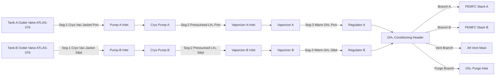

<!-- ──────────────────────────────────────────────────────────────────────────
     QATL-ATLAS-1000-ATLAS-070-079-07-077-010-HYDROGEN-FEED-LINES-AND-MANIFOLDS
     ATA 28 (GH₂/LH₂ Distribution) · Hydrogen Feed Lines and Manifolds
     programme-defined aircraft type — ATLAS Register 1000
────────────────────────────────────────────────────────────────────────────── -->

# Hydrogen Feed Lines and Manifolds

---

## §0 Hyperlink Policy

> All hyperlinks in this document are **relative** (five directory levels: `../../../../../`).
> Absolute URLs are forbidden. Every linked document must exist in the Q+ATLANTIDE repository
> before the link is activated. Broken links are treated as open issues and must be resolved
> before the document is promoted from `DRAFT` to `APPROVED`.

---

## §1 Purpose

This document defines the agnostic ATLAS standard-level architecture context for `Hydrogen Feed Lines and Manifolds`.

It describes the controlled scope, functions, interfaces, safety considerations, lifecycle traceability, and S1000D/CSDB mapping logic that programme implementations shall instantiate when this node is applicable.

This document is not a programme design baseline. Programme-specific capacities, locations, part numbers, effectivity, operating limits, maintenance references, and data module codes shall be defined only inside the applicable programme implementation branch.
## §2 Applicability

| Applicability Level | Rule |
|---|---|
| Standard taxonomy | Applies to the ATLAS node `077` |
| Programme implementation | Conditional; determined by programme architecture, trade studies, certification basis, and applicability model |
| Product configuration | Defined in the programme-specific configuration baseline |
| Effectivity | Defined in the programme CSDB / applicability layer |
| Non-applicability | Must be explicitly stated in the programme impact-study branch when excluded |
## §3 Functional Description ![DRAFT]

The HDC feed line system is divided into three thermal regimes:

**Segment 1 — Cryogenic LH₂ feed (Tank outlet → Pump inlet):**
Both Segment-1 lines (port and starboard) operate continuously at LH₂ temperature (20–30 K) and tank pressure (1.5–3.0 bar(a)). Lines are **vacuum-jacketed double-wall** assemblies: 25 mm nominal bore inner tube (SS 316L, Schedule 40S) wrapped with **multilayer insulation (MLI, 30 layers)** within an evacuated outer jacket (Al alloy 6061-T6). Bellows expansion joints (cryogenic-rated Inconel 625) at each structural attach point accommodate differential thermal contraction between inner tube (shrinks ≈ 3 mm/m from ambient to 20 K) and outer jacket. Maximum static heat leak per line: ≤ 2 W at vacuum integrity ≥ 10⁻³ Pa.

**Segment 2 — Pressurised LH₂ (Pump outlet → Vaporizer inlet):**
Pump discharge pressure raises lines to up to 6 bar(a); lines remain at cryogenic temperature. Constructed as single-wall SS 316L (25 mm bore) with aerogel blanket wrap and outer braid. Flex sections (PTFE-lined SS 316 braid) accommodate pump vibration. Flanged joints use cryogenic-rated PTFE encapsulated spiral-wound gaskets.

**Segment 3 — Warm GH₂ (Vaporizer outlet → PEMFC inlet manifolds):**
Downstream of the vaporizers, hydrogen is fully gaseous at 250–330 K and 5–8 bar(a). Lines are single-wall SS 316L, 20 mm bore, with 25 mm mineral-wool thermal insulation wrap to prevent surface condensation. Flex hoses (PTFE/SS 316 braid) isolate vibration at nacelle/airframe interfaces. The **GH₂ conditioning header** is a 40 mm bore SS 316L manifold with welded branch tees for Stack-A, Stack-B, cross-connect, and vent/purge ports.

All hydrogen-wetted joints downstream of the tank outlet valves are **orbital-welded butt joints** (no threaded fittings in the primary flow path). Flanged connections are limited to LRU attachment points and are 100 % helium-leak tested (acceptance: ≤ 1 × 10⁻⁸ Pa·m³/s) at assembly.

---

## §4 Functional Breakdown

| ID | Name | Description | Lead Division |
|---|---|---|---|
| F-001 | LH₂ cryogenic feed lines (×2) | Vacuum-jacketed, MLI insulated; Tank-A/B outlet to Pump-A/B inlet | Q-MECHANICS |
| F-002 | Pump discharge lines (×2) | Single-wall SS 316L, aerogel-wrapped; Pump outlet to Vaporizer inlet | Q-MECHANICS |
| F-003 | GH₂ warm distribution lines (×4) | Single-wall SS 316L; Vaporizer outlet to regulator to header | Q-MECHANICS |
| F-004 | GH₂ conditioning header | 40 mm bore SS 316L manifold; common GH₂ header feeding both PEMFC stacks | Q-GREENTECH |
| F-005 | Bellows / flex joints | Cryogenic bellows at cryogenic segments; PTFE flex hose at warm nacelle interface | Q-MECHANICS |
| F-006 | Structural supports and clamps | Anti-vibration clamps every 500 mm; cryogenic-rated bonded elastomer isolators; airframe attach brackets | Q-MECHANICS |

---

## §5 Routing and Zone Map — Mermaid Diagram

---

## §6 Components and LRUs

| Component | Part Number | Qty | Location | Notes |
|---|---|---|---|---|
| Vacuum-jacketed LH₂ feed line assembly A | VJFL-A-PN-TBD | 1 | Aft fuselage port | Seg-1; 25 mm bore; 1.2 m nominal length |
| Vacuum-jacketed LH₂ feed line assembly B | VJFL-B-PN-TBD | 1 | Aft fuselage stbd | Seg-1; identical to VJFL-A |
| Pump discharge line assembly A | PDL-A-PN-TBD | 1 | Port pylon | Seg-2; 25 mm bore; aerogel wrap; 0.8 m nominal |
| Pump discharge line assembly B | PDL-B-PN-TBD | 1 | Stbd pylon | Seg-2; identical to PDL-A |
| GH₂ warm line, vaporizer to regulator A | WGL-VA-PN-TBD | 1 | Port nacelle | Seg-3; 20 mm bore; mineral-wool wrap |
| GH₂ warm line, vaporizer to regulator B | WGL-VB-PN-TBD | 1 | Stbd nacelle | Seg-3; identical to WGL-VA |
| GH₂ conditioning header manifold | GCH-PN-TBD | 1 | Centre pylon | 40 mm bore; SS 316L; welded tee branches |
| Cryogenic bellows expansion joint (×4) | CBEJ-PN-TBD | 4 | At structural attach points Seg-1/2 | Inconel 625; ±10 mm axial travel |
| Anti-vibration line clamp set | AVLC-PN-TBD | 40 | Along all line segments | Cryogenic bonded elastomer; 500 mm spacing |

---

## §7 Interfaces

| Interface | Connected System | Medium | Function |
|---|---|---|---|
| Tank-A/B outlet valves | ATLAS 076 — HSCMU | LH₂ cryogenic line | LH₂ supply from tanks |
| Pump-A/B inlet flanges | ATLAS 077-020 — Cryogenic Pumps | LH₂ cryogenic line | Feed to pump inlet |
| Vaporizer-A/B inlet flanges | ATLAS 077-040 — Vaporizers | LH₂ line Seg-2 | Feed to vaporizer |
| Regulator-A/B inlet flanges | ATLAS 077-030 — Regulators | GH₂ warm line Seg-3 | Regulated GH₂ to header |
| PEMFC Stack-A/B anode manifolds | ATLAS 075 — FCCU | GH₂ header branch | GH₂ delivery to fuel cell |
| Vent branch | ATLAS 077-050 — Vent interface | GH₂ vent line | Header overpressure vent to mast |
| Purge branch | ATLAS 077-050 — Purge interface | GN₂ purge line | GN₂ inerting for maintenance |

---

## §8 Operating Limits

| Parameter | Minimum | Maximum | Notes |
|---|---|---|---|
| LH₂ feed line operating temperature | 20 K | 300 K (warm-up) | Normal operation 20–30 K |
| LH₂ feed line operating pressure | 1.0 bar(a) | 4.0 bar(a) | Design proof 1.5× = 6.0 bar |
| GH₂ warm line operating temperature | 250 K | 360 K | Max transient on ground with solar load |
| GH₂ warm line operating pressure | 0 bar(a) | 9.0 bar(a) | Design proof 1.5× = 13.5 bar |
| Vacuum jacket integrity (Seg-1) | < 10⁻³ Pa | — | Annual check required |
| Helium leak rate (all joints) | — | 1 × 10⁻⁸ Pa·m³/s | Acceptance leak test criterion |

---

## §9 Maintenance Tasks

| Task | Interval | Procedure Reference |
|---|---|---|
| Visual inspection of line assemblies and clamps | A-check (600 FH) | AMM 28-77-010-201 |
| Vacuum integrity check (Seg-1 outer jacket) | Annual | AMM 28-77-010-202 |
| Bellows expansion joint inspection | C-check (6 000 FH) | AMM 28-77-010-203 |
| Helium leak test — all flanged joints | After R&R or annual | AMM 28-77-010-204 |
| Line assembly removal and installation | On condition | AMM 28-77-010-301 |

---

## §10 Revision History

| Rev | Date | Author | Description |
|---|---|---|---|
| 0.1 | 2026-05-12 | Q-MECHANICS | Initial DRAFT baseline release |
