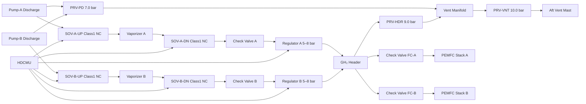

<!-- ──────────────────────────────────────────────────────────────────────────
     QATL-ATLAS-1000-ATLAS-070-079-07-077-030-HYDROGEN-VALVES-REGULATORS-AND-SHUTOFF
     ATA 28 (GH₂/LH₂ Distribution) · Hydrogen Valves, Regulators and Shutoff
     programme-defined aircraft type — ATLAS Register 1000
────────────────────────────────────────────────────────────────────────────── -->

# Hydrogen Valves, Regulators and Shutoff

---

## §0 Hyperlink Policy

> All hyperlinks in this document are **relative** (five directory levels: `../../../../../`).
> Absolute URLs are forbidden. Every linked document must exist in the Q+ATLANTIDE repository
> before the link is activated. Broken links are treated as open issues and must be resolved
> before the document is promoted from `DRAFT` to `APPROVED`.

---

## §1 Purpose

This document defines the agnostic ATLAS standard-level architecture context for `Hydrogen Valves, Regulators and Shutoff`.

It describes the controlled scope, functions, interfaces, safety considerations, lifecycle traceability, and S1000D/CSDB mapping logic that programme implementations shall instantiate when this node is applicable.

This document is not a programme design baseline. Programme-specific capacities, locations, part numbers, effectivity, operating limits, maintenance references, and data module codes shall be defined only inside the applicable programme implementation branch.
## §2 Applicability

| Applicability Level | Rule |
|---|---|
| Standard taxonomy | Applies to the ATLAS node `077` |
| Programme implementation | Conditional; determined by programme architecture, trade studies, certification basis, and applicability model |
| Product configuration | Defined in the programme-specific configuration baseline |
| Effectivity | Defined in the programme CSDB / applicability layer |
| Non-applicability | Must be explicitly stated in the programme impact-study branch when excluded |
## §3 Functional Description ![DRAFT]

All HDC valves are **normally closed (NC)** — the safe/power-loss state is isolation of hydrogen from the distribution system. Valves are opened by HDCMU command via 28 V DC solenoid actuation (primary) or electro-mechanical servo actuator (pressure regulators). The HDCMU monitors valve position via integral feedback switches (open/closed micro-switches); miscompare between commanded and feedback position generates a BITE fault within 2 s.

**Valve classification within the HDC system:**

**Class 1 — Primary Isolation SOVs (×4):** Installed upstream and downstream of each vaporizer (2 per vaporizer = 4 total). These are the principal isolation barriers: loss of power or HDCMU command de-energises all four, isolating the entire hydrogen flow path and leaving the PEMFC stacks without hydrogen supply within ≤ 3 s. Material: SS 316L body with PCTFE (polychlorotrifluoroethylene) seat seals (cryogenic-rated for upstream pair, FKM for downstream GH₂ pair). Actuation: 28 V DC solenoid, spring-return NC.

**Class 2 — Cross-Connect SOV (XCSOV, ×1):** Detailed in ATLAS 077-020. Normally closed; opens on pump fault for cross-feed. Included here for completeness of valve register.

**Class 3 — GH₂ Pressure Regulators (×2):** Two-stage servo-controlled pressure regulators, one per feed path (A/B), positioned downstream of each vaporizer. Each regulator steps inlet GH₂ pressure (2.5–6.5 bar(a)) down to a stable outlet pressure of 5–8 bar(a) at the PEMFC anode header. First stage: pilot-operated self-regulating diaphragm; second stage: HDCMU-servo fine-trim actuator adjusting set-point ±1.5 bar in response to FCCU demand. Regulator set-point range: 5.0–8.0 bar(a); pressure accuracy: ±0.15 bar.

**Class 4 — GH₂ Pressure Relief Valves (PRVs, ×3):** Installed at: (a) pump discharge manifold (PRV-PD, 7.0 bar(a)); (b) GH₂ conditioning header upstream of PEMFC inlets (PRV-HDR, 9.0 bar(a)); (c) header vent path downstream of vent valve (PRV-VNT, 10.0 bar(a) last-resort). PRVs discharge to the aft vent mast via the purge/vent manifold (ATLAS 077-050). All PRVs are spring-loaded, direct-acting, fail-safe open on overpressure.

**Class 5 — Non-return check valves (×4):** Installed at vaporizer outlets and at the PEMFC stack inlet branches to prevent back-flow of humidified exhaust gas into the GH₂ distribution system. SS 316L body; PTFE disc; cracking pressure 0.05 bar.

---

## §4 Functional Breakdown

| ID | Name | Description | Lead Division |
|---|---|---|---|
| F-001 | Primary Isolation SOVs (×4) | NC solenoid; Class 1; upstream/downstream of each vaporizer; ≤ 3 s close | Q-MECHANICS |
| F-002 | Cross-Connect SOV (XCSOV) | NC solenoid; Class 2; pump-discharge cross-feed; auto on pump fault | Q-MECHANICS |
| F-003 | GH₂ Pressure Regulators (×2) | 2-stage servo; Class 3; 5–8 bar(a) outlet; FCCU demand-follow | Q-MECHANICS |
| F-004 | Pump Discharge PRV (PRV-PD) | Spring-loaded; Class 4; 7.0 bar(a); discharge to vent manifold | Q-MECHANICS |
| F-005 | Header PRV (PRV-HDR) | Spring-loaded; Class 4; 9.0 bar(a); discharge to vent manifold | Q-MECHANICS |
| F-006 | Vent Path PRV (PRV-VNT) | Spring-loaded; Class 4; 10.0 bar(a) last-resort; discharge to vent mast | Q-MECHANICS |
| F-007 | Non-return check valves (×4) | PTFE disc; cracking pressure 0.05 bar; anti-backflow at vaporizer outlet and PEMFC inlet | Q-MECHANICS |

---

## §5 Valve Architecture — Mermaid Diagram

---

## §6 Component Register

| Component | ID | Part Number | Qty | Location | Set-Point / Rating | Actuation | Maintenance Interval |
|---|---|---|---|---|---|---|---|
| Isolation SOV upstream Vap-A | SOV-A-UP | SOV-CRY-PN-TBD | 1 | Port vaporizer inlet | NC; 0–6.5 bar cryo-rated | 28 V DC solenoid spring-return | A-check test |
| Isolation SOV downstream Vap-A | SOV-A-DN | SOV-GH2-PN-TBD | 1 | Port vaporizer outlet | NC; 0–10 bar GH₂ rated | 28 V DC solenoid spring-return | A-check test |
| Isolation SOV upstream Vap-B | SOV-B-UP | SOV-CRY-PN-TBD | 1 | Stbd vaporizer inlet | NC; 0–6.5 bar cryo-rated | 28 V DC solenoid spring-return | A-check test |
| Isolation SOV downstream Vap-B | SOV-B-DN | SOV-GH2-PN-TBD | 1 | Stbd vaporizer outlet | NC; 0–10 bar GH₂ rated | 28 V DC solenoid spring-return | A-check test |
| Cross-Connect SOV | XCSOV | XCSOV-PN-TBD | 1 | Pump discharge manifold | NC; 0–6.5 bar cryo-rated | 28 V DC solenoid spring-return | A-check test |
| GH₂ Pressure Regulator A | REG-A | PREG-A-PN-TBD | 1 | Port nacelle gas section | 5.0–8.0 bar(a) outlet | Servo + self-acting pilot | A-check set-point |
| GH₂ Pressure Regulator B | REG-B | PREG-B-PN-TBD | 1 | Stbd nacelle gas section | 5.0–8.0 bar(a) outlet | Servo + self-acting pilot | A-check set-point |
| Pump Discharge PRV | PRV-PD | PRV-PD-PN-TBD | 1 | Pump discharge manifold | 7.0 bar(a) | Spring-loaded direct-acting | Annual recertification |
| Header PRV | PRV-HDR | PRV-HDR-PN-TBD | 1 | GH₂ conditioning header | 9.0 bar(a) | Spring-loaded direct-acting | Annual recertification |
| Vent Path PRV | PRV-VNT | PRV-VNT-PN-TBD | 1 | Vent manifold exit | 10.0 bar(a) | Spring-loaded direct-acting | Annual recertification |
| Non-return check valve (×4) | CHK-A/B/FCA/FCB | CHK-PN-TBD | 4 | Vaporizer outlets; PEMFC branches | 0.05 bar cracking pressure | Self-acting | C-check inspection |

---

## §7 Interfaces

| Interface | Connected System | Function |
|---|---|---|
| SOV upstream pair | ATLAS 077-020 Pumps; ATLAS 077-040 Vaporizers | Primary isolation of cryogenic LH₂ segment |
| SOV downstream pair | ATLAS 077-040 Vaporizers; ATLAS 077-030 Regulators | Primary isolation of warm GH₂ segment |
| Pressure regulators | ATLAS 075 FCCU demand signal (AFDX); ATLAS 077-080 HDCMU | Regulated GH₂ to PEMFC anode manifolds |
| PRV discharge lines | ATLAS 077-050 Vent manifold | Overpressure relief routing to aft vent mast |
| HDCMU command bus | ATLAS 077-080 HDCMU | SOV position commands; regulator set-point updates |
| 28 V DC power | ATA 24 Electrical Power | SOV solenoid and servo actuator power |

---

## §8 Maintenance Tasks

| Task | Interval | Procedure Reference |
|---|---|---|
| SOV functional test (open/close/position feedback) | A-check (600 FH) | AMM 28-77-030-201 |
| Regulator set-point verification (A/B) | A-check | AMM 28-77-030-202 |
| PRV set-pressure pop-test (bench) | Annual | AMM 28-77-030-203 |
| Check valve leakage test | C-check | AMM 28-77-030-204 |
| SOV seal and seat replacement | 3 000 FH / on condition | AMM 28-77-030-301 |
| Regulator diaphragm inspection | C-check | AMM 28-77-030-302 |

---

## §9 Revision History

| Rev | Date | Author | Description |
|---|---|---|---|
| 0.1 | 2026-05-12 | Q-MECHANICS | Initial DRAFT baseline release |
