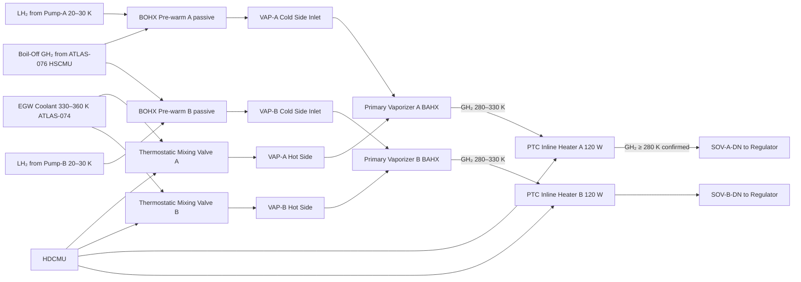

<!-- ──────────────────────────────────────────────────────────────────────────
     QATL-ATLAS-1000-ATLAS-070-079-07-077-040-HEAT-EXCHANGERS-AND-VAPORIZERS
     ATA 28 (GH₂/LH₂ Distribution) · Heat Exchangers and Vaporizers
     programme-defined aircraft type — ATLAS Register 1000
────────────────────────────────────────────────────────────────────────────── -->

# Heat Exchangers and Vaporizers

---

## §0 Hyperlink Policy

> All hyperlinks in this document are **relative** (five directory levels: `../../../../../`).
> Absolute URLs are forbidden. Every linked document must exist in the Q+ATLANTIDE repository
> before the link is activated. Broken links are treated as open issues and must be resolved
> before the document is promoted from `DRAFT` to `APPROVED`.

---

## §1 Purpose

This document defines the agnostic ATLAS standard-level architecture context for `Heat Exchangers and Vaporizers`.

It describes the controlled scope, functions, interfaces, safety considerations, lifecycle traceability, and S1000D/CSDB mapping logic that programme implementations shall instantiate when this node is applicable.

This document is not a programme design baseline. Programme-specific capacities, locations, part numbers, effectivity, operating limits, maintenance references, and data module codes shall be defined only inside the applicable programme implementation branch.
## §2 Applicability

| Applicability Level | Rule |
|---|---|
| Standard taxonomy | Applies to the ATLAS node `077` |
| Programme implementation | Conditional; determined by programme architecture, trade studies, certification basis, and applicability model |
| Product configuration | Defined in the programme-specific configuration baseline |
| Effectivity | Defined in the programme CSDB / applicability layer |
| Non-applicability | Must be explicitly stated in the programme impact-study branch when excluded |
## §3 Functional Description ![DRAFT]

**Primary Vaporizers (VAP-A and VAP-B):**
Each vaporizer is a **compact brazed aluminium plate-fin heat exchanger** (BAHX type), designed to transfer heat from the PEMFC cooling loop (ethylene-glycol/water, EGW, coolant supply temperature 330–360 K at rated FC power) to the LH₂ flow. The large enthalpy difference between warm EGW and cryogenic LH₂ ensures complete phase change (LH₂ → GH₂) and superheating within the single unit. The vaporizer design incorporates:

- **LH₂ side (cold side):** Corrugated aluminium fins, 25 mm bore inlet/outlet ports; LH₂ enters at 20–30 K, 2.5–6.5 bar(a) and exits as superheated GH₂ at 280–330 K, same pressure (negligible pressure drop ≤ 0.3 bar through vaporizer).
- **EGW side (hot side):** EGW loop from ATLAS 074 (FC coolant loop); inlet 330–360 K; outlet 295–325 K (coolant temperature drop ≈ 30–40 K at rated operation). Flow rate modulated by a thermostatic mixing valve commanded by the HDCMU to maintain GH₂ outlet temperature within specification.
- **Thermal performance:** Each vaporizer must vaporise and superheat up to 1.5 g/s of LH₂ (per unit; 3.0 g/s combined max demand). Minimum effectiveness: ≥ 99 % vapour quality at GH₂ outlet over the full flow range.

**Boil-off Recovery Heat Exchanger (BOHX):**
A smaller supplementary heat exchanger recovers warm GH₂ from the LH₂ tank boil-off stream (ATLAS 076) and re-uses it to pre-warm the Segment-2 LH₂ line, reducing the thermal load on the primary vaporizers. The BOHX uses the boil-off GH₂ from the HSCMU boil-off recovery path as the warm fluid; LH₂ in Segment-2 passes through the cold side. The BOHX is passively controlled (no HDCMU actuation), regulated by the boil-off valve position in ATLAS 076.

**GH₂ Post-conditioning warm-up section (inline):**
A short **inline electric heating element** (120 W, 28 V DC, PTC thermistor type) is integrated on each GH₂ warm line downstream of the vaporizer to ensure minimum GH₂ delivery temperature of 280 K is maintained during ground start-up and low-power FC operation when EGW coolant may not yet be at full temperature. The PTC element self-limits; the HDCMU enables/disables it based on a downstream GH₂ temperature sensor reading.

---

## §4 Functional Breakdown

| ID | Name | Description | Lead Division |
|---|---|---|---|
| F-001 | Primary Vaporizer A (VAP-A) | BAHX; LH₂ in at 20–30 K → GH₂ out 280–330 K; EGW hot side; 1.5 g/s max | Q-GREENTECH |
| F-002 | Primary Vaporizer B (VAP-B) | Identical to VAP-A; stbd feed path | Q-GREENTECH |
| F-003 | Boil-off Recovery HX (BOHX) | Pre-warms Seg-2 LH₂ using boil-off GH₂; passive; integrated with ATLAS 076 HSCMU | Q-GREENTECH |
| F-004 | GH₂ inline electric heater A | PTC 120 W; 28 V DC; cold-start top-up; HDCMU enable/disable | Q-HPC |
| F-005 | GH₂ inline electric heater B | Identical to heater A; stbd path | Q-HPC |
| F-006 | EGW thermostatic mixing valve A | Modulates EGW flow to VAP-A; HDCMU servo command | Q-MECHANICS |
| F-007 | EGW thermostatic mixing valve B | Identical to mixing valve A; VAP-B side | Q-MECHANICS |
| F-008 | GH₂ outlet temperature sensors (×2) | Pt-1000 probes downstream of each vaporizer; HDCMU feedback | Q-HPC |

---

## §5 Thermal Architecture — Mermaid Diagram

---

## §6 Components and LRUs

| Component | Part Number | Qty | Location | Maintenance Interval | Notes |
|---|---|---|---|---|---|
| Primary Vaporizer A (VAP-A) | VAP-A-PN-TBD | 1 | Aft nacelle port | C-check effectiveness test; on condition R&R | BAHX Al alloy; LH₂ in, EGW hot side; 1.5 g/s LH₂ |
| Primary Vaporizer B (VAP-B) | VAP-B-PN-TBD | 1 | Aft nacelle stbd | C-check effectiveness test; on condition R&R | Identical to VAP-A |
| Boil-Off Recovery HX (BOHX) | BOHX-PN-TBD | 1 | Aft pylon centre | C-check inspection | Shell-and-tube Al alloy; passive; GH₂ hot / LH₂ cold |
| PTC Inline Heater A | HEATA-PN-TBD | 1 | GH₂ warm line port | Annual resistance check | PTC thermistor; 120 W at 28 V DC; self-limiting |
| PTC Inline Heater B | HEATB-PN-TBD | 1 | GH₂ warm line stbd | Annual resistance check | Identical to Heater A |
| EGW Thermostatic Mixing Valve A | TMV-A-PN-TBD | 1 | EGW supply port nacelle | A-check operational check | Servo-actuated; 0–100 % EGW modulation |
| EGW Thermostatic Mixing Valve B | TMV-B-PN-TBD | 1 | EGW supply stbd nacelle | A-check operational check | Identical to TMV-A |
| GH₂ Outlet Temperature Sensor A | TGH2-A-PN-TBD | 1 | Downstream VAP-A | Annual calibration | Pt-1000; 250–400 K range; HDCMU input |
| GH₂ Outlet Temperature Sensor B | TGH2-B-PN-TBD | 1 | Downstream VAP-B | Annual calibration | Identical to Sensor A |

---

## §7 Performance Specification

| Parameter | Minimum | Nominal | Maximum | Notes |
|---|---|---|---|---|
| LH₂ max flow per vaporizer | — | 1.2 g/s (cruise) | 1.5 g/s | At max FC demand per stack |
| GH₂ outlet temperature | 280 K | 300 K | 330 K | PEMFC anode inlet requirement |
| EGW inlet temperature to vaporizer | 325 K | 345 K | 365 K | FC coolant supply temp |
| GH₂ outlet vapour quality | 99 % | 99.5 % | 100 % | No liquid carryover to PEMFC |
| Vaporizer pressure drop (LH₂/GH₂ side) | — | 0.15 bar | 0.30 bar | Over full flow range |
| PTC heater steady-state power | 0 W (off) | 30–80 W | 120 W | Self-limiting; duty dependent on FC power |
| BOHX pre-warm ΔT | 0 K (no boil-off) | +10 K | +30 K | Pre-warms LH₂ Seg-2 before vaporizer |

---

## §8 Interfaces

| Interface | Connected System | Medium | Function |
|---|---|---|---|
| LH₂ inlet (×2) | ATLAS 077-020 Pump discharge lines | Pressurised LH₂ at 2.5–6.5 bar | Feed to vaporizer cold side |
| GH₂ outlet (×2) | ATLAS 077-030 SOV-DN; Regulator inlet | Warm GH₂ at 280–330 K | Conditioned GH₂ from vaporizer |
| EGW supply/return (×2) | ATLAS 074 Thermal Management — FC coolant loop | EGW liquid | Vaporizer heat source; TMV-modulated |
| BOHX GH₂ inlet | ATLAS 076 HSCMU boil-off recovery path | Boil-off GH₂ | Heat source for LH₂ pre-warm |
| PTC heater power | ATA 24 HVDC 28 V DC bus | 28 V DC | Cold-start GH₂ heating |
| HDCMU control | ATLAS 077-080 HDCMU | AFDX + analogue | TMV servo command; heater enable; temp monitoring |

---

## §9 Maintenance Tasks

| Task | Interval | Procedure Reference |
|---|---|---|
| Vaporizer effectiveness check (ΔT, ΔP) | C-check (6 000 FH) | AMM 28-77-040-201 |
| PTC inline heater resistance and function check | Annual | AMM 28-77-040-202 |
| TMV servo operational test (A/B) | A-check (600 FH) | AMM 28-77-040-203 |
| BOHX visual and leakage inspection | C-check | AMM 28-77-040-204 |
| Vaporizer removal and installation | On condition | AMM 28-77-040-301 |
| BAHX core cleaning (if fouled) | On condition | AMM 28-77-040-401 |

---

## §10 Revision History

| Rev | Date | Author | Description |
|---|---|---|---|
| 0.1 | 2026-05-12 | Q-GREENTECH | Initial DRAFT baseline release |
