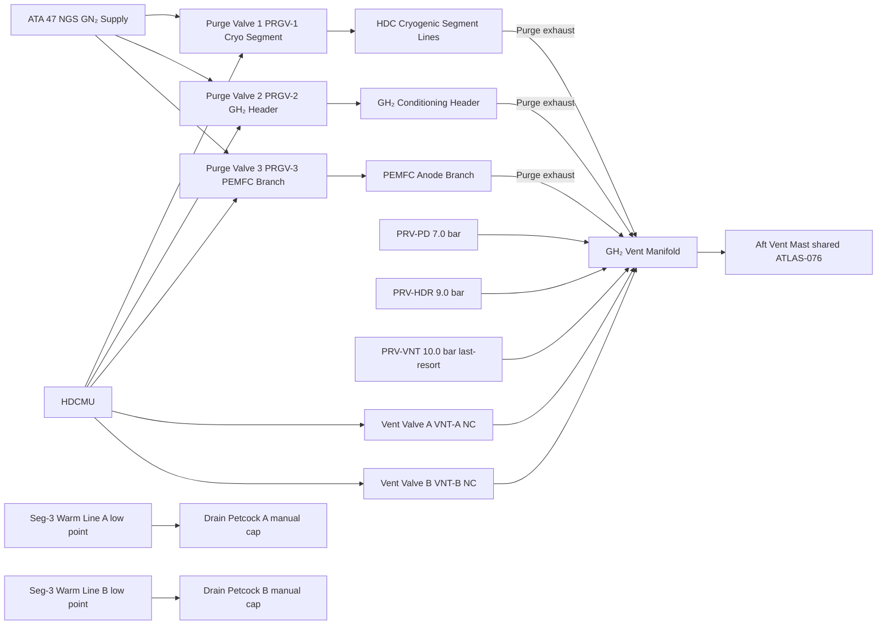

<!-- ──────────────────────────────────────────────────────────────────────────
     QATL-ATLAS-1000-ATLAS-070-079-07-077-050-PURGE-VENT-AND-DRAIN-INTERFACES
     ATA 28 (GH₂/LH₂ Distribution) · Purge, Vent and Drain Interfaces
     AMPEL360E eWTW — ATLAS Register 1000
────────────────────────────────────────────────────────────────────────────── -->

# Purge, Vent and Drain Interfaces

---

## §0 Hyperlink Policy

> All hyperlinks in this document are **relative** (five directory levels: `../../../../../`).
> Absolute URLs are forbidden. Every linked document must exist in the Q+ATLANTIDE repository
> before the link is activated. Broken links are treated as open issues and must be resolved
> before the document is promoted from `DRAFT` to `APPROVED`.

---

## §1 Purpose

This document defines all purge, vent, and drain provisions in the AMPEL360E eWTW Hydrogen Distribution and Conditioning (HDC) system. It covers the GN₂ purge subsystem that renders the HDC piping inert for maintenance, the GH₂ vent subsystem that routes system pressure relief and overpressure gas safely to the aft vent mast, and the drain provisions for removing condensate or trapped liquid from the warm GH₂ sections during ground maintenance.

---

## §2 Applicability

| Parameter | Value |
|---|---|
| Aircraft Program | AMPEL360E eWTW |
| ATA reference | ATA 28 (GH₂/LH₂ Distribution) — 077-050 Purge, Vent and Drain Interfaces |
| Certification basis | EASA CS-25 Amdt 27+; CSH-2; NFPA 2 (§6.4 Ventilation/venting); SAE AIR6464 |
| S1000D SNS | 077-050-00 |

---

## §3 Functional Description ![DRAFT]

**GN₂ Purge Subsystem:**
Prior to any maintenance access requiring opening of the hydrogen flow path, the entire HDC distribution system must be purged with **gaseous nitrogen (GN₂)** supplied by the onboard Nitrogen Generation System (NGS, ATA 47). The purge sequence displaces residual GH₂ or vaporised LH₂ from all lines, valve bodies, and manifolds, achieving a hydrogen concentration below 1 % v/v before physical access is permitted.

Three GN₂ purge valves (PRGV-1, PRGV-2, PRGV-3) are installed at strategic injection points: (1) upstream of the vaporizer isolation SOVs (cryogenic segment inlet), (2) at the GH₂ conditioning header mid-section, and (3) at the PEMFC anode header branch. Each purge valve is NC solenoid-actuated (28 V DC), opened by HDCMU command in the maintenance/purge mode. Purge flow is confirmed by HDCMU via GN₂ pressure sensing and sequential H₂ sensor readings at each zone until all readings < 1 % H₂ v/v.

**GH₂ Vent Subsystem:**
GH₂ venting from the HDC system is routed via a dedicated **vent manifold** to the **aft vent mast** (shared with ATLAS 076 storage vent). The vent manifold collects:
- GH₂ released by the three PRVs (ATLAS 077-030: PRV-PD at 7.0 bar, PRV-HDR at 9.0 bar, PRV-VNT at 10.0 bar)
- Controlled venting via the two **GH₂ vent valves** (VNT-A and VNT-B, NC solenoid): HDCMU opens these to reduce system pressure below high-pressure alarm limits during hold or transitional conditions; these also provide a controlled purge exhaust path during GN₂ purge sequences.
- The vent manifold is single-wall SS 316L tubing (10 mm bore), fully welded, routed aft of the pressure bulkhead to the vent mast stub.

The aft vent mast design (ATLAS 076-030, shared) ensures GH₂ is expelled above all aircraft surfaces, oriented upward and aft at ≥ 30° from horizontal, to preclude re-ingestion into the engines or ECS intakes. Maximum vent flow at full PRV activation: 0.5 kg/min GH₂.

**Drain Provisions:**
Water condensate may accumulate at low points in the warm GH₂ section (Segment 3) during ground cooling after flight. Two manual **drain petcocks** (DP-A, DP-B) are installed at the lowest accessible points of the warm GH₂ lines (at the nacelle/pylon interface). These are manually operated during pre-maintenance inspection. Drain valve design: stainless steel ¼-turn petcock, PTFE-seated, cap-sealed during normal operation.

---

## §4 Functional Breakdown

| ID | Name | Description | Lead Division |
|---|---|---|---|
| F-001 | GN₂ purge valves (×3) | NC solenoid; HDCMU-commanded; GN₂ injection at three HDC segment points | Q-AIR |
| F-002 | GH₂ vent valves (×2) | NC solenoid; HDCMU-commanded; controlled pressure release to vent manifold | Q-AIR |
| F-003 | GH₂ vent manifold | 10 mm bore SS 316L fully-welded manifold; collects PRV and vent valve discharge | Q-MECHANICS |
| F-004 | Aft vent mast interface | GH₂ vent mast stub connection; shared with ATLAS 076; upward-aft discharge ≥ 30° | Q-AIR |
| F-005 | Drain petcocks (×2) | Manual ¼-turn; Seg-3 low-point condensate drain; cap-sealed during flight | Q-MECHANICS |
| F-006 | Purge sequence logic | HDCMU-managed purge mode: sequential valve open/sensor confirm/HDC isolation | Q-HPC |

---

## §5 Purge and Vent Architecture — Mermaid Diagram

---

## §6 Components and LRUs

| Component | Part Number | Qty | Location | Maintenance Interval | Notes |
|---|---|---|---|---|---|
| GN₂ Purge Valve 1 (PRGV-1) | PRGV-1-PN-TBD | 1 | Upstream SOV-A-UP cryo segment | A-check operational test | NC solenoid; GN₂ rated; 0–10 bar; ATEX IIC T4 |
| GN₂ Purge Valve 2 (PRGV-2) | PRGV-2-PN-TBD | 1 | GH₂ header mid-point | A-check operational test | Identical to PRGV-1 |
| GN₂ Purge Valve 3 (PRGV-3) | PRGV-3-PN-TBD | 1 | PEMFC anode branch stub | A-check operational test | Identical to PRGV-1 |
| GH₂ Vent Valve A (VNT-A) | VNTV-A-PN-TBD | 1 | Header vent branch port | A-check operational test | NC solenoid; GH₂ rated; 0–10 bar; ATEX IIC T4 |
| GH₂ Vent Valve B (VNT-B) | VNTV-B-PN-TBD | 1 | Header vent branch stbd | A-check operational test | Identical to VNT-A |
| GH₂ Vent Manifold Assembly | VNT-MFD-PN-TBD | 1 | Aft pylon/fuselage route | Annual visual inspection | SS 316L; 10 mm bore fully welded; insulated |
| Drain Petcock A (DP-A) | DP-A-PN-TBD | 1 | Port nacelle/pylon Seg-3 low point | A-check visual; on-condition seal replacement | ¼-turn SS petcock; PTFE seat; cap-sealed |
| Drain Petcock B (DP-B) | DP-B-PN-TBD | 1 | Stbd nacelle/pylon Seg-3 low point | A-check visual; on-condition seal replacement | Identical to DP-A |

---

## §7 Purge Sequence (Maintenance Mode)

The HDCMU executes the following mandatory purge sequence when commanded to **MAINTENANCE/LOTO mode**:

1. **Close all primary isolation SOVs** (SOV-A-UP/DN, SOV-B-UP/DN) — hydrogen flow path isolated.
2. **De-energise cryogenic pumps** (Pump-A, Pump-B) — no residual flow.
3. **Open GH₂ Vent Valves** (VNT-A, VNT-B) — release residual GH₂ pressure to vent manifold → vent mast.
4. **Confirm system pressure < 0.5 bar(a)** — via HDCMU pressure transducer readings.
5. **Open GN₂ Purge Valves** sequentially: PRGV-1 → PRGV-2 → PRGV-3. GN₂ fills the distribution system at ≈ 1.5 bar(a).
6. **Monitor H₂ sensors** in all distribution zones. Continue GN₂ purge until all zone sensors read < 1 % H₂ v/v.
7. **HDCMU declares system PURGED** — illuminates ECAM FUEL 77 PURGE COMPL advisory; logs event with timestamp.
8. Maintenance crew may now open drain petcocks for water drainage and proceed with LOTO (physical lockout of SOVs and pump power isolators).

**Purge duration budget:** ≤ 15 min from HDCMU MAINTENANCE mode command to PURGE COMPL advisory under standard conditions.

---

## §8 Interfaces

| Interface | Connected System | Medium | Function |
|---|---|---|---|
| GN₂ supply | ATA 47 NGS | GN₂ pipeline | Nitrogen source for purge sequence |
| GH₂ vent discharge | ATLAS 076 aft vent mast (shared) | GH₂ gas | Safe dispersal of vented hydrogen |
| PRV discharge inputs | ATLAS 077-030 PRVs | GH₂ gas | Overpressure relief collection |
| HDCMU commands | ATLAS 077-080 HDCMU | AFDX + 28 V DC solenoid | Purge/vent valve actuation and sequencing |
| PEMFC anode branch | ATLAS 075 FCCU | GN₂/GH₂ gas | Purge extends to PEMFC anode inlet manifold |
| H₂ zone sensors | ATLAS 077-060 Leak Detection | Analogue AFDX | Purge completion confirmation |

---

## §9 Maintenance Tasks

| Task | Interval | Procedure Reference |
|---|---|---|
| Purge valve functional test (PRGV 1/2/3) | A-check (600 FH) | AMM 28-77-050-201 |
| Vent valve functional test (VNT-A/B) | A-check | AMM 28-77-050-202 |
| Vent manifold visual inspection (joints, routing) | Annual | AMM 28-77-050-203 |
| Drain petcock function and seal check | A-check | AMM 28-77-050-204 |
| Full purge sequence operational test (ground) | C-check | AMM 28-77-050-205 |
| Vent manifold helium leak test (after R&R) | On condition | AMM 28-77-050-301 |

---

## §10 Revision History

| Rev | Date | Author | Description |
|---|---|---|---|
| 0.1 | 2026-05-12 | Q-AIR | Initial DRAFT baseline release |
