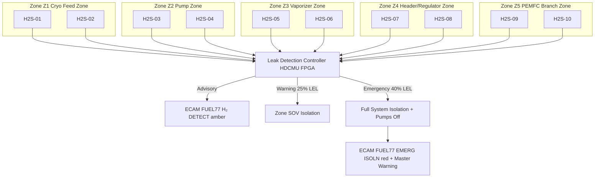

<!-- ──────────────────────────────────────────────────────────────────────────
     QATL-ATLAS-1000-ATLAS-070-079-07-077-060-HYDROGEN-LEAK-DETECTION-AND-ISOLATION
     ATA 28 (GH₂/LH₂ Distribution) · Hydrogen Leak Detection and Isolation
     programme-defined aircraft type — ATLAS Register 1000
────────────────────────────────────────────────────────────────────────────── -->

# Hydrogen Leak Detection and Isolation

---

## §0 Hyperlink Policy

> All hyperlinks in this document are **relative** (five directory levels: `../../../../../`).
> Absolute URLs are forbidden. Every linked document must exist in the Q+ATLANTIDE repository
> before the link is activated. Broken links are treated as open issues and must be resolved
> before the document is promoted from `DRAFT` to `APPROVED`.

---

## §1 Purpose

This document defines the agnostic ATLAS standard-level architecture context for `Hydrogen Leak Detection and Isolation`.

It describes the controlled scope, functions, interfaces, safety considerations, lifecycle traceability, and S1000D/CSDB mapping logic that programme implementations shall instantiate when this node is applicable.

This document is not a programme design baseline. Programme-specific capacities, locations, part numbers, effectivity, operating limits, maintenance references, and data module codes shall be defined only inside the applicable programme implementation branch.
## §2 Applicability

| Applicability Level | Rule |
|---|---|
| Standard taxonomy | Applies to the ATLAS node `077` |
| Programme implementation | Conditional; determined by programme architecture, trade studies, certification basis, and applicability model |
| Product configuration | Defined in the programme-specific configuration baseline |
| Effectivity | Defined in the programme CSDB / applicability layer |
| Non-applicability | Must be explicitly stated in the programme impact-study branch when excluded |
## §3 Functional Description ![DRAFT]

**Hazard context:** Hydrogen has a wide flammable range (4–75 % v/v in air, LFL 4 % v/v) and a very low ignition energy (≈ 0.017 mJ). Any hydrogen release in an enclosed or semi-enclosed aircraft zone constitutes a serious fire/explosion risk. The HDC system is enclosed within nacelle and pylon zones that receive active ventilation (ATA 21 ECS zone air); the catalytic sensor alarm at 10 % LEL (≈ 0.4 % v/v H₂) provides a minimum 10× safety margin below the LFL.

**Sensor technology:** All distribution zone sensors are **catalytic bead (pellistor) type**, specifically:
- Dual-bead configuration: active bead (platinum-catalysed) + compensating bead (inert); bridge-circuit output proportional to H₂ concentration.
- Range: 0–100 % LEL (0–4 % v/v H₂); resolution ≤ 0.1 % LEL.
- Response time: T₉₀ ≤ 30 s to a step change in H₂ concentration.
- Operating temperature range: −55 °C to +125 °C (do-160G Cat. F2).
- Calibration: 6-month cycle; reference gas 50 % LEL H₂/N₂ blend.
- ATEX Group IIC Temperature Class T4 certified.

**Zone definitions and sensor placement (10 sensors total):**

| Zone | Area | Sensors | Rationale |
|---|---|---|---|
| Z1 — Cryogenic feed zone | Aft fuselage where Seg-1 vacuum-jacketed lines route from Tank-A/B to Pump-A/B inlets | H2S-01, H2S-02 | LH₂ joint/fitting area; highest consequence of release |
| Z2 — Pump and pump discharge zone | Aft pylon vicinity of Pump-A/B and Seg-2 discharge lines | H2S-03, H2S-04 | Pump mechanical seals; discharge line joints |
| Z3 — Vaporizer zone | Nacelle area around VAP-A, VAP-B, and adjacent SOVs | H2S-05, H2S-06 | GH₂ phase transition zone; highest gas volume release risk |
| Z4 — GH₂ header and regulator zone | Nacelle/pylon header manifold and pressure regulators | H2S-07, H2S-08 | Warm GH₂ at full pressure; regulator seat leak risk |
| Z5 — PEMFC anode branch zone | Nacelle PEMFC anode inlet manifolds | H2S-09, H2S-10 | Downstream delivery point; PEMFC boundary |

**Alarm levels and HDCMU response:**

| Level | Threshold | HDCMU Response | Crew Indication |
|---|---|---|---|
| ADVISORY | 10 % LEL (≈ 0.4 % v/v) in any zone | Log event; increase scan rate; alert crew | ECAM FUEL 77 H₂ DETECT ADVISORY (amber) |
| WARNING | 25 % LEL (≈ 1.0 % v/v) in any zone | Automatic isolation of affected zone: close upstream/downstream SOVs for that zone; open vent valve if safe | ECAM FUEL 77 H₂ HIGH WARNING (red); MASTER WARNING |
| EMERGENCY | 40 % LEL (≈ 1.6 % v/v) in any zone, OR simultaneous advisory in 2+ zones | Full HDC system isolation: all SOVs closed; all pumps de-energised; HDCMU enters emergency mode | ECAM FUEL 77 EMERG ISOLN; MASTER WARNING + chime; crew emergency checklist |

**Sensor failure:** A failed or saturated sensor (HDCMU BITE fault) in any zone triggers an ECAM FUEL 77 H₂ SENSOR FAULT advisory and that zone is treated as if at ADVISORY level for fault-tolerance — isolation is not automatic on sensor failure alone, but the failed sensor is flagged as MEL-required maintenance item (no-dispatch without serviceable sensor in all zones).

---

## §4 Functional Breakdown

| ID | Name | Description | Lead Division |
|---|---|---|---|
| F-001 | Catalytic H₂ sensors (×10) | Dual-bead pellistor; ATEX IIC T4; 0–100 % LEL; T₉₀ ≤ 30 s; 6-month calibration | Q-GREENTECH |
| F-002 | Zone Z1 — Cryo feed sensors | H2S-01/02; aft fuselage cryo zone; highest consequence area | Q-AIR |
| F-003 | Zone Z2 — Pump zone sensors | H2S-03/04; pump and discharge zone | Q-AIR |
| F-004 | Zone Z3 — Vaporizer zone sensors | H2S-05/06; nacelle vaporizer area | Q-AIR |
| F-005 | Zone Z4 — Header zone sensors | H2S-07/08; GH₂ manifold and regulator area | Q-AIR |
| F-006 | Zone Z5 — PEMFC branch sensors | H2S-09/10; PEMFC anode inlet zone | Q-AIR |
| F-007 | Leak Detection Controller (LDC) — within HDCMU | Dedicated FPGA-based processing block within HDCMU; evaluates 10 sensor signals; executes alarm/isolation logic | Q-HPC |
| F-008 | Isolation logic — zone-level and system-level | HDCMU logic layer: zone-specific SOV closure + vent-valve action; full-system emergency isolation | Q-HPC |

---

## §5 Sensor and Zone Layout — Mermaid Diagram

---

## §6 Components and LRUs

| Component | Part Number | Qty | Location | Maintenance Interval | Notes |
|---|---|---|---|---|---|
| Catalytic H₂ Sensor H2S-01 | H2S-CAT-PN-TBD | 1 | Zone Z1 aft fuselage port | 6-month calibration | Dual-bead pellistor; ATEX IIC T4 |
| Catalytic H₂ Sensor H2S-02 | H2S-CAT-PN-TBD | 1 | Zone Z1 aft fuselage stbd | 6-month calibration | Identical to H2S-01 |
| Catalytic H₂ Sensors H2S-03/04 | H2S-CAT-PN-TBD | 2 | Zone Z2 pump area port/stbd | 6-month calibration | Identical; pump discharge area |
| Catalytic H₂ Sensors H2S-05/06 | H2S-CAT-PN-TBD | 2 | Zone Z3 nacelle vaporizer area | 6-month calibration | Identical; upper nacelle zone |
| Catalytic H₂ Sensors H2S-07/08 | H2S-CAT-PN-TBD | 2 | Zone Z4 header and regulator zone | 6-month calibration | Identical; regulator housing |
| Catalytic H₂ Sensors H2S-09/10 | H2S-CAT-PN-TBD | 2 | Zone Z5 PEMFC anode branch | 6-month calibration | Identical; anode inlet manifold area |

---

## §7 ATEX Zone Classification

| Zone | IEC 60079 Classification | Justification |
|---|---|---|
| Z1 (Cryo feed, aft fuselage) | Zone 1 | Cryogenic LH₂ line joints in semi-enclosed space; potential for intermittent H₂ release from joint weepage at cryogenic cycling |
| Z2 (Pump area) | Zone 1 | Pump mechanical seals; intermittent LH₂ release risk during pump transients |
| Z3 (Vaporizer zone, nacelle) | Zone 1 | GH₂ phase transition; valve joint leak potential in relatively enclosed nacelle compartment |
| Z4 (Header/regulator, nacelle) | Zone 1 | Warm GH₂ at 5–8 bar(a); regulator body and joint leak risk |
| Z5 (PEMFC branch) | Zone 2 | GH₂ leak from PEMFC anode manifold flanges unlikely under normal operation but possible during transients |

All electrical equipment in Zones Z1–Z5 is **ATEX Group IIC Temperature Class T4** certified per IEC 60079-14 installation standard.

---

## §8 Interfaces

| Interface | Connected System | Function |
|---|---|---|
| Sensor power supply | ATA 24 HVDC 28 V DC | Sensor bridge circuit excitation |
| Sensor signal output | ATLAS 077-080 HDCMU LDC FPGA | Analogue (4–20 mA) or AFDX sensor signals |
| Isolation command output | ATLAS 077-030 SOVs | Zone/system isolation valve commands |
| Vent command output | ATLAS 077-050 Vent Valves | Vent valve open on WARNING/EMERGENCY |
| Zone ventilation demand | ATA 21 ECS | Increased zone ventilation airflow request on ADVISORY |
| ECAM display | ATA 31 ECAM | H₂ DETECT, H₂ HIGH WARNING, EMERG ISOLN crew alerts |
| CMS BITE | ATA 45 CMS | Sensor fault codes; calibration-due flags; event log |
| Storage leak detection | ATLAS 076-060 Leak Detection | Common architecture reference; sensor design identical |

---

## §9 Maintenance Tasks

| Task | Interval | Procedure Reference |
|---|---|---|
| H₂ sensor calibration (all 10) | 6 months | AMM 28-77-060-201 |
| Sensor BITE self-test verification | A-check (600 FH) | AMM 28-77-060-202 |
| Zone ventilation flow confirmation | C-check | AMM 28-77-060-203 |
| Sensor response time check (T₉₀ test) | Annual | AMM 28-77-060-204 |
| Sensor removal and installation | 6-month / on condition | AMM 28-77-060-301 |

---

## §10 Revision History

| Rev | Date | Author | Description |
|---|---|---|---|
| 0.1 | 2026-05-12 | Q-GREENTECH | Initial DRAFT baseline release |
