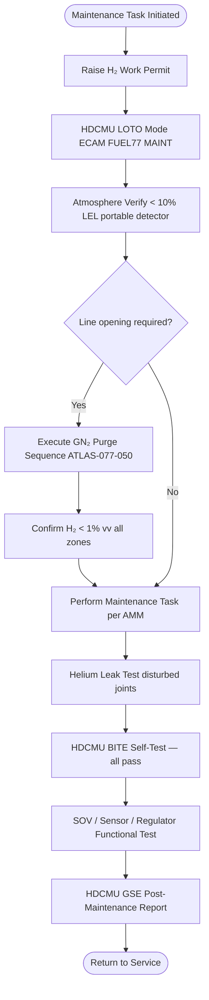

<!-- ──────────────────────────────────────────────────────────────────────────
     QATL-ATLAS-1000-ATLAS-070-079-07-077-070-HYDROGEN-DISTRIBUTION-SERVICE-TEST-AND-MAINTENANCE
     ATA 28 (GH₂/LH₂ Distribution) · Hydrogen Distribution Service, Test and Maintenance
     AMPEL360E eWTW — ATLAS Register 1000
────────────────────────────────────────────────────────────────────────────── -->

# Hydrogen Distribution Service, Test and Maintenance

---

## §0 Hyperlink Policy

> All hyperlinks in this document are **relative** (five directory levels: `../../../../../`).
> Absolute URLs are forbidden. Every linked document must exist in the Q+ATLANTIDE repository
> before the link is activated. Broken links are treated as open issues and must be resolved
> before the document is promoted from `DRAFT` to `APPROVED`.

---

## §1 Purpose

This document defines the service, functional test, and maintenance procedures for the AMPEL360E eWTW Hydrogen Distribution and Conditioning (HDC) system. It covers maintenance philosophy, LOTO requirements, qualification prerequisites for maintenance personnel, special tooling and GSE, scheduled maintenance task intervals, and functional test acceptance criteria. This document is the primary reference for the Airworthiness Limitations (AWL) and Maintenance Planning Document (MPD) entries for ATA 077.

---

## §2 Applicability

| Parameter | Value |
|---|---|
| Aircraft Program | AMPEL360E eWTW |
| ATA reference | ATA 28 (GH₂/LH₂ Distribution) — 077-070 Hydrogen Distribution Service, Test and Maintenance |
| Certification basis | EASA CS-25 Amdt 27+; CSH-2; CS-25 §25.1529 (ICA); EASA Part-145 |
| S1000D SNS | 077-070-00 |

---

## §3 Safety Precautions — Mandatory for All HDC Maintenance

All maintenance and servicing activities on the HDC system require the following minimum safety controls, regardless of specific task:

1. **LOTO (Lockout/Tagout):** HDCMU-commanded MAINTENANCE/LOTO mode must be active (ECAM FUEL 77 MAINT confirmed) before any physical work on HDC components. LOTO includes: all SOVs locked closed (via HDCMU command + physical lock tags on actuator caps), pump motor power isolators locked open, HDCMU isolated from propulsion power bus.

2. **Atmosphere verification:** A **calibrated portable electrochemical H₂ detector** (calibration ≤ 6 months old, ATEX rated) must confirm H₂ < 10 % LEL at each access point before opening any HDC component. For tasks requiring line opening (valve, sensor, or line R&R), a zone reading < 1 % H₂ v/v is required, confirmed after the GN₂ purge sequence (ATLAS 077-050).

3. **Cryogenic PPE (for Segment-1 / LH₂-wetted component maintenance):** Full cryogenic PPE is mandatory for any maintenance task on components in the cryogenic LH₂ segments (Seg-1 lines, Pump-A/B, upstream SOVs): face shield (anti-splash), cryogenic gauntlet gloves (to elbow), cryogenic apron/coverall, closed-toe insulating safety footwear.

4. **Fire watch:** A trained fire-watch person with dry-powder extinguisher (ABC, ≥ 6 kg) and fire blanket is stationed at the work area during any HDC open-work tasks.

5. **Ventilation confirmation:** Confirm zone ventilation is active (zone airflow > design minimum) before and during all HDC maintenance tasks.

6. **Work permit / authorisation:** An approved **Hydrogen Work Permit** (per airline/MRO SMS) must be raised and signed before any HDC maintenance activity begins.

---

## §4 Functional Description ![DRAFT]

**Maintenance philosophy:**
HDC system maintenance is divided into three categories:
- **Line-replaceable unit (LRU) replacement:** Cryogenic pumps, SOVs, pressure regulators, H₂ sensors, inline heaters, TMVs. LRU R&R requires full LOTO and purge sequence; functional test (SOV operational test, regulator set-point check, pump operational check) post-installation.
- **Scheduled inspections:** Visual checks of line assemblies, clamps, flex joints, and manifold insulation. Leak tests at defined intervals. Calibration tasks (sensors, PRVs).
- **Bench-level overhaul:** Cryogenic pumps at 2 500 FH; PRV recertification annually; regulator diaphragm replacement at C-check.

**Personnel qualification:**
All personnel performing maintenance on the HDC system must hold:
- EASA Part-66 Cat. B1/B2 licence (or operator-authorised equivalent)
- Hydrogen systems ground maintenance training certificate (company-specific, ≥ 16 h, to be defined in operator Training Needs Analysis per CSH-2)
- Cryogenic handling qualification (for Seg-1 and cryo-pump tasks)

**GSE requirements:**

| GSE Item | Purpose | Notes |
|---|---|---|
| Portable electrochemical H₂ detector | Zone atmosphere verification | ATEX IIC; calibration ≤ 6 months |
| GN₂ service cart (mobile) | Supplementary GN₂ purge when ATA 47 NGS unavailable (ground) | ISO connector to aircraft purge valve ports |
| Cryogenic PPE kit | Personal protection for cryo-segment tasks | Face shield, gauntlet gloves, cryo apron |
| Helium leak detector (mass-spectrometer) | Post-maintenance joint leak test | Acceptance ≤ 1 × 10⁻⁸ Pa·m³/s |
| Calibrated torque tools (cryogenic) | Cryogenic-rated torque wrenches for flange bolts | Per AMM torque values |
| HDCMU GSE laptop (H2-DIST-GSE-1) | HDCMU BITE read-out, mode commands, maintenance test sequences | Proprietary H₂ distribution diagnostic software |

---

## §5 Scheduled Maintenance Task Summary

| Task ID | Description | Interval | Access Level | Procedure |
|---|---|---|---|---|
| T-077-A01 | SOV operational test (all 4 primary SOVs + XCSOV) | A-check 600 FH | Line | AMM 28-77-070-201 |
| T-077-A02 | GH₂ pressure regulator set-point verification (A/B) | A-check 600 FH | Line | AMM 28-77-070-202 |
| T-077-A03 | H₂ sensor functional check (all 10) — 10 % LEL alarm test | A-check 600 FH | Line | AMM 28-77-070-203 |
| T-077-A04 | Purge valve and vent valve operational test | A-check 600 FH | Line | AMM 28-77-070-204 |
| T-077-A05 | Drain petcock visual and seal check | A-check 600 FH | Line | AMM 28-77-070-205 |
| T-077-A06 | HDC visual inspection: line clamps, insulation, flex joints | A-check 600 FH | Line | AMM 28-77-070-206 |
| T-077-6M | H₂ sensor calibration (all 10) — 50 % LEL reference gas | 6 months | Line | AMM 28-77-070-207 |
| T-077-AN | PRV set-pressure pop test (PRV-PD, PRV-HDR, PRV-VNT) | Annual | Shop bench | AMM 28-77-070-208 |
| T-077-AN | Vacuum-jacket integrity check (Seg-1 outer jacket; both lines) | Annual | Line | AMM 28-77-070-209 |
| T-077-C01 | Full purge sequence operational test (HDCMU GSE commanded) | C-check 6 000 FH | Line | AMM 28-77-070-210 |
| T-077-C02 | Vaporizer effectiveness test (ΔT/ΔP both VAP-A/B) | C-check 6 000 FH | Line | AMM 28-77-070-211 |
| T-077-C03 | Helium leak test — all flanged joints in HDC system | C-check 6 000 FH | Line | AMM 28-77-070-212 |
| T-077-C04 | Pump inlet filter element replacement (PIF-A/B) | C-check 6 000 FH | Line | AMM 28-77-070-213 |
| T-077-C05 | Regulator diaphragm inspection (A/B) | C-check 6 000 FH | Shop | AMM 28-77-070-214 |
| T-077-OV | Cryogenic pump overhaul (Pump-A/B) | 2 500 FH hard time | Shop | AMM 28-77-070-215 |

---

## §6 Functional Test — Post-Maintenance Acceptance

After any LRU replacement or line/valve work on the HDC system, the following acceptance functional test must be performed before return-to-service:

1. **System purge and atmosphere verification** (per ATLAS 077-050 purge sequence).
2. **HDCMU BITE self-test pass** — no active maintenance faults.
3. **SOV operational test** — all SOVs (primary, XCSOV, vent, purge) open/close on HDCMU command; position feedback confirmed.
4. **H₂ sensor function test** — all 10 sensors respond to reference gas (50 % LEL blend) within T₉₀ ≤ 30 s; alarm thresholds confirmed.
5. **Regulator set-point verification** — REG-A and REG-B output pressure within 6.0 ± 0.2 bar(a) at nominal HDCMU command.
6. **Helium leak test** — any disturbed joints ≤ 1 × 10⁻⁸ Pa·m³/s.
7. **HDCMU GSE post-maintenance report** — all BITE faults cleared; maintenance mode exited; system declared READY.

---

## §7 Mermaid — Maintenance Activity Flow

---

## §8 Interfaces

| Interface | Connected System | Function |
|---|---|---|
| HDCMU GSE port | ATLAS 077-080 HDCMU | Maintenance mode commands; BITE read-out; test sequence execution |
| GN₂ purge system | ATLAS 077-050 Purge interface | Purge sequence before open-work |
| H₂ leak detection | ATLAS 077-060 | Sensor calibration; post-maintenance function test |
| ATA 45 CMS | Central Maintenance System | Fault retrieval; maintenance task scheduling; SB status |
| ATA 47 NGS | Nitrogen Generation System | GN₂ supply for purge (aircraft or mobile cart) |

---

## §9 Revision History

| Rev | Date | Author | Description |
|---|---|---|---|
| 0.1 | 2026-05-12 | Q-GREENTECH | Initial DRAFT baseline release |
