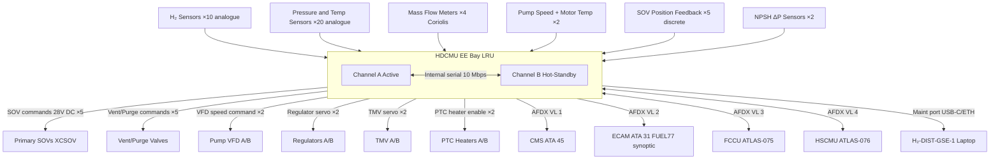

<!-- ──────────────────────────────────────────────────────────────────────────
     QATL-ATLAS-1000-ATLAS-070-079-07-077-080-HYDROGEN-DISTRIBUTION-MONITORING-DIAGNOSTICS-AND-CONTROL-INTERFACES
     ATA 28 (GH₂/LH₂ Distribution) · Hydrogen Distribution Monitoring, Diagnostics and Control Interfaces
     programme-defined aircraft type — ATLAS Register 1000
────────────────────────────────────────────────────────────────────────────── -->

# Hydrogen Distribution Monitoring, Diagnostics and Control Interfaces

---

## §0 Hyperlink Policy

> All hyperlinks in this document are **relative** (five directory levels: `../../../../../`).
> Absolute URLs are forbidden. Every linked document must exist in the Q+ATLANTIDE repository
> before the link is activated. Broken links are treated as open issues and must be resolved
> before the document is promoted from `DRAFT` to `APPROVED`.

---

## §1 Purpose

This document defines the agnostic ATLAS standard-level architecture context for `Hydrogen Distribution Monitoring, Diagnostics and Control Interfaces`.

It describes the controlled scope, functions, interfaces, safety considerations, lifecycle traceability, and S1000D/CSDB mapping logic that programme implementations shall instantiate when this node is applicable.

This document is not a programme design baseline. Programme-specific capacities, locations, part numbers, effectivity, operating limits, maintenance references, and data module codes shall be defined only inside the applicable programme implementation branch.
## §2 Applicability

| Applicability Level | Rule |
|---|---|
| Standard taxonomy | Applies to the ATLAS node `077` |
| Programme implementation | Conditional; determined by programme architecture, trade studies, certification basis, and applicability model |
| Product configuration | Defined in the programme-specific configuration baseline |
| Effectivity | Defined in the programme CSDB / applicability layer |
| Non-applicability | Must be explicitly stated in the programme impact-study branch when excluded |
## §3 Functional Description ![DRAFT]

**HDCMU architecture:**
The HDCMU is a **dual-channel, cross-monitoring controller** housed in the aircraft EE bay (LRU format, 3-MCU rack). Each channel (CHA, CHB) contains an independent microprocessor (32-bit safety-grade CPU), FPGA for sensor signal processing and LDC (Leak Detection Controller) logic, and dedicated I/O boards for analogue sensor inputs and discrete output drivers. Both channels receive identical sensor inputs; each can independently command SOV actuation, purge/vent valve actuation, and pump VFD commands. In normal operation CHA is the active command channel and CHB operates in hot-standby monitor mode; automatic channel changeover occurs within 50 ms on CHA fault detection. Inter-channel crosstalk uses a high-speed internal serial bus (10 Mbps).

**HDCMU software (DO-178C DAL B, 9 partitions):**
1. Sensor acquisition and signal validation
2. Pressure and flow control loops (pump VFD command; regulator servo)
3. Temperature monitoring and PTC heater control
4. Leak Detection Controller (LDC) — catalytic sensor signal evaluation; alarm/isolation logic
5. Purge and vent sequence management
6. Mode management (Normal / Degraded / Emergency / Maintenance / LOTO)
7. AFDX communication management
8. BITE and fault logging
9. GSE data-link (maintenance mode)

**Monitored parameters (continuous):**
All sensor inputs are sampled at ≥ 10 Hz; critical safety parameters (H₂ sensors, pressure sensors) at ≥ 25 Hz.

| Parameter Group | Sensors | Range | HDCMU Use |
|---|---|---|---|
| H₂ concentration (zones Z1–Z5) | H2S-01 to H2S-10 (catalytic) | 0–100 % LEL | Leak alarm / isolation logic (LDC partition) |
| LH₂ feed line pressure (Seg-1/2) | PT-SEG1-A/B, PT-SEG2-A/B | 0–8 bar(a) | NPSH monitor; pump load; SOV condition |
| GH₂ pressure (header + branches) | PT-HDR-A/B/FCA/FCB | 0–12 bar(a) | PRV pre-alarm; regulator control loop |
| GH₂ temperature (vaporizer outlet) | TT-VAP-A/B | 200–400 K | Vaporizer quality; PTC heater control |
| LH₂ pump speed (×2) | SPD-PMP-A/B (Hall effect) | 0–20 000 RPM | Pump control loop; overspeed protection |
| Mass flow rate (×4) | MFM-SEG2-A/B, MFM-HDR-FCA/FCB (Coriolis) | 0–5 g/s | Flow balance; demand matching with FCCU |
| Pump motor winding temperature (×2) | TT-PMP-A/B (Pt-1000 cryo) | 4–400 K | Motor overheat protection |
| Vaporizer EGW inlet/outlet temperature | TT-EGW-A/B (×4) | 200–450 K | Vaporizer effectiveness monitoring |
| NPSH differential pressure (×2) | ΔPT-NPSH-A/B | 0–5 bar | Cavitation prevention |
| SOV position feedback (×5) | MCS-SOV-1..5 (micro-switch) | Open/Closed | SOV state confirmation; BITE miscompare |

**ECAM FUEL 77 synoptic:**
The HDCMU publishes real-time system state data to the ECAM (ATA 31) via AFDX. The FUEL 77 synoptic displays:
- Animated flow diagram: line pressures; pump run/fault icons; vaporizer status; regulator set-point bars; header pressure and stack feed pressure.
- H₂ concentration bar graphs for all 5 zones.
- Active faults and alarm messages.
- HDCMU mode indication (NORMAL / DEGRADED / EMERG / MAINT).

**ECAM messages:**

| Message | Colour | Trigger |
|---|---|---|
| FUEL 77 H₂ DETECT | Amber | Any zone sensor ≥ 10 % LEL |
| FUEL 77 H₂ HIGH | Red | Any zone sensor ≥ 25 % LEL |
| FUEL 77 EMERG ISOLN | Red + Master Warning | Any zone ≥ 40 % LEL or multi-zone advisory |
| FUEL 77 PUMP A/B FAULT | Amber | Pump speed deviation > ±10 % commanded; winding overheat; cavitation |
| FUEL 77 SNSR FAULT | Amber | H₂ sensor BITE fault (out-of-range / no response) |
| FUEL 77 SOV FAULT | Amber | SOV position feedback miscompare > 2 s |
| FUEL 77 MAINT | White | HDCMU in MAINTENANCE / LOTO mode |
| FUEL 77 PURGE COMPL | White | Purge sequence completed; H₂ < 1 % v/v all zones |
| FUEL 77 REG A/B FAULT | Amber | Regulator outlet pressure deviation > ±0.5 bar from set-point for > 5 s |

---

## §4 Functional Breakdown

| ID | Name | Description | Lead Division |
|---|---|---|---|
| F-001 | HDCMU hardware — dual-channel controller | 3-MCU EE bay LRU; CHA active / CHB hot-standby; 50 ms auto-changeover | Q-HPC |
| F-002 | HDCMU software — 9 partitions DAL B | Sensor acquisition, control loops, LDC, purge/vent seq., mode mgmt, AFDX, BITE, GSE | Q-HPC |
| F-003 | Pressure and flow control (partitions 2) | Closed-loop pump VFD speed + regulator servo to match FCCU GH₂ demand | Q-HPC |
| F-004 | Leak Detection Controller (partition 4) | FPGA-based; 10 sensor inputs; alarm/isolation decision at ≤ 500 ms from threshold exceedance | Q-HPC |
| F-005 | AFDX communication (partition 7) | ARINC 664 P7; VL to CMS, ECAM, FCCU, HSCMU | Q-HPC |
| F-006 | BITE and fault logging (partition 8) | NVM fault log ≥ 200 entries; parameter snapshot ±30 s around each fault event | Q-HPC |
| F-007 | GSE data-link (partition 9) | USB-C or Ethernet maintenance port; H₂-DIST-GSE-1 laptop tool interface | Q-HPC |

---

## §5 HDCMU Interface Architecture — Mermaid Diagram

---

## §6 Components and LRUs

| Component | Part Number | Qty | Location | Maintenance Interval | Notes |
|---|---|---|---|---|---|
| HDCMU Controller | HDCMU-PN-TBD | 1 | EE bay rack Row 3 | Software update per SB; C-check BITE; on condition swap | DO-178C DAL B / DO-254 DAL B; 3-MCU; dual-channel |

---

## §7 AFDX Virtual Links (VL) Summary

| VL ID | Source | Destination | Data | Rate |
|---|---|---|---|---|
| VL-077-01 | HDCMU | CMS (ATA 45) | BITE faults; fault log; parameter snapshots | 10 Hz |
| VL-077-02 | HDCMU | ECAM (ATA 31) | FUEL 77 synoptic data; alarm messages | 25 Hz |
| VL-077-03 | HDCMU ↔ FCCU (ATA 075) | FCCU | GH₂ demand signal; flow rate actual; SOV state; HDCMU mode | 25 Hz bidirectional |
| VL-077-04 | HDCMU ↔ HSCMU (ATA 076) | HSCMU | Tank pressure and quantity (feed to HDCMU); HDCMU pump-speed request to HSCMU-aware state | 10 Hz bidirectional |
| VL-077-05 | HDCMU | ATA 24 EPMU | Pump power draw; heater power status; SOV actuation power status | 5 Hz |

---

## §8 BITE Architecture

The HDCMU BITE operates continuously in Normal mode and is invoked explicitly in Maintenance/GSE mode. BITE coverage:

| BITE Function | Detection Method | Fault Action |
|---|---|---|
| H₂ sensor bridge balance check | Continuous bridge-balance monitoring | Sensor fault ECAM amber; zone treated as ADVISORY level |
| Pressure transducer range check | Out-of-range and stuck-value detection | Sensor fault ECAM amber; control loop uses remaining sensors |
| SOV position miscompare | Command vs feedback within 2 s window | SOV fault ECAM amber; HDCMU assumes valve in last commanded position |
| Pump speed deviation | ±10 % deviation from commanded speed > 5 s | PUMP FAULT amber; cross-connect SOV auto-open if 100 % deviation |
| Regulator out-of-tolerance | Outlet pressure deviation > ±0.5 bar for > 5 s | REG FAULT amber; FCCU notified |
| Mass flow imbalance | > 15 % imbalance between measured and FCCU-demanded flow | FLOW IMBAL advisory; log event |
| AFDX VL timeout | Loss of VL from FCCU or HSCMU > 2 s | Comms fault; HDCMU enters degraded mode using last-known demand |
| Channel CHA/CHB miscompare | Command output disagreement between CHA and CHB | CHB takes over as active; CHA fault logged; HDCMU CHAN B ACTIVE advisory |

---

## §9 Interfaces

| Interface | Connected System | Protocol | Function |
|---|---|---|---|
| FCCU | ATLAS 075 Fuel Cell Control Unit | AFDX VL-077-03 | GH₂ demand; flow rate actual; SOV state exchange |
| HSCMU | ATLAS 076 Hydrogen Storage | AFDX VL-077-04 | Tank state; boil-off info; coordinated isolation |
| CMS | ATA 45 Central Maintenance System | AFDX VL-077-01 | BITE fault logs; MPD task data |
| ECAM | ATA 31 Display System | AFDX VL-077-02 | FUEL 77 synoptic; alarm messages |
| HVDC 270 V | ATA 24 Electrical Power | HVDC cable | HDCMU primary power |
| 28 V DC ESS | ATA 24 Essential Bus | DC cable | HDCMU emergency power (safe-state hold) |
| GSE laptop | H₂-DIST-GSE-1 | USB-C / Ethernet maintenance port | Maintenance test sequences; BITE read-out |

---

## §10 Maintenance Tasks

| Task | Interval | Procedure Reference |
|---|---|---|
| HDCMU BITE self-test (power-on) | Every flight | Automatic (no AMM task) |
| HDCMU BITE download via GSE | A-check (600 FH) | AMM 28-77-080-201 |
| HDCMU software configuration check | C-check | AMM 28-77-080-202 |
| AFDX VL integrity check (GSE) | C-check | AMM 28-77-080-203 |
| HDCMU removal and installation | On condition | AMM 28-77-080-301 |

---

## §11 Revision History

| Rev | Date | Author | Description |
|---|---|---|---|
| 0.1 | 2026-05-12 | Q-HPC | Initial DRAFT baseline release |
