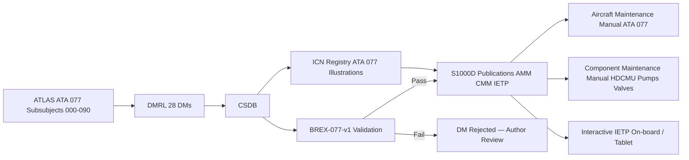

<!-- ──────────────────────────────────────────────────────────────────────────
     QATL-ATLAS-1000-ATLAS-070-079-07-077-090-S1000D-CSDB-MAPPING-AND-TRACEABILITY
     ATA 28 (GH₂/LH₂ Distribution) · S1000D / CSDB Mapping and Traceability
────────────────────────────────────────────────────────────────────────────── -->

# S1000D / CSDB Mapping and Traceability

---

## §0 Hyperlink Policy

> All hyperlinks in this document are **relative** (five directory levels: `../../../../../`).
> Absolute URLs are forbidden. Every linked document must exist in the Q+ATLANTIDE repository
> before the link is activated. Broken links are treated as open issues and must be resolved
> before the document is promoted from `DRAFT` to `APPROVED`.

---

## §1 Purpose

This document maps the ATLAS ATA 28 (GH₂/LH₂ Distribution) subsubject 077 structure to S1000D Data Module Codes (DMCs) and defines the Data Module Requirement List (DMRL) and Business Rules eXchange (BREX) constraints for any programme implementing this ATLAS standard node Hydrogen Distribution and Conditioning Common Source DataBase (CSDB).

ATA 077 DMRL for <PROGRAMME>: **28 data modules**. DMC pattern: `DMC-<MODEL>-<SYSTEMDIFF>-077-{NNN}-00A-EN-US`. BREX document: `BREX-077-v1`, enforcing three domain-specific hydrogen distribution safety constraints as described in §3.

This document is owned by Q-DATAGOV and reviewed at each CSDB milestone (DMRL baseline, DMRL first issue, DMRL final). It is the authoritative traceability record linking ATLAS ATA 077 documents to the S1000D technical publication set, including the Aircraft Maintenance Manual (AMM), Component Maintenance Manual (CMM), and Interactive Electronic Technical Publication (IETP).

---

## §2 Applicability

| Parameter | Value |
|---|---|
| Programme | (defined in programme implementation branch) |
| ATA reference | ATA 28 (GH₂/LH₂ Distribution) — 077-090 S1000D / CSDB Mapping and Traceability |
| Certification basis | S1000D Issue 5.0; CS-25 §25.1529 (ICA); EASA CSH-2 |
| S1000D SNS | 077-090-00 |

---

## §3 Functional Description ![DRAFT]

**BREX BREX-077-v1 enforces three domain-specific hydrogen distribution constraints:**

1. **Hydrogen atmosphere pre-verification rule:** All maintenance Data Modules (DM type 100, 300, or 520) requiring physical access to any HDC component — including valve R&R, pump R&R, line segment disconnection, sensor R&R, or vaporizer service — must include a **mandatory atmosphere pre-verification step** as the first task step: portable H₂ detector reading < 10 % LEL at the work location, confirmed before any mechanical work begins. For tasks requiring line opening (any component involving breaking of the H₂ pressure boundary), an additional **GN₂ purge completion confirmation step** (H₂ < 1 % v/v, all zones, per ATLAS 077-050 sequence) must precede any mechanical disconnection. This rule prevents maintenance DMs from authorising physical access to HDC components without verified hydrogen-free atmosphere, protecting technicians from ignition and asphyxiation risks.

2. **LOTO pre-condition rule:** All DMs for HDC tasks (types 100, 300, or 520 that involve any mechanical work on the hydrogen pressure boundary — lines, valves, pumps, sensors, vaporizers, regulators) must cite the **HDCMU LOTO mode confirmation** (ECAM FUEL 77 MAINT advisory active) as a mandatory precondition step before the first mechanical task step. This rule ensures that no maintenance DM authorises opening any hydrogen-wetted component while the HDC system remains in an energised, pressurised state — preventing inadvertent hydrogen release from a live system during maintenance.

3. **Cryogenic PPE mandatory-action rule:** All DMs for tasks in the cryogenic segments of the HDC system (Zone Z1 — Segment-1 vacuum-jacketed lines, Zone Z2 — pump area) must include the **mandatory cryogenic PPE step** as a pre-task action: face shield, cryogenic gauntlet gloves, cryogenic apron/coverall, insulating closed-toe safety footwear. This rule prevents maintenance DMs from being published for cryogenic segment tasks without the mandatory cold-burn and asphyxiation protection, given the LH₂ saturation temperature of approximately 20 K (−253 °C) which causes rapid tissue damage on contact.

---

## §4 Functional Breakdown

| ID | Name | Description | Lead Division |
|---|---|---|---|
| F-001 | DMRL — 28 DMs | Full DMRL for ATA 077: all 28 DM codes tracked; status managed by Q-DATAGOV | Q-DATAGOV |
| F-002 | BREX-077-v1 — 3 rules | H₂ atmosphere pre-verification rule, LOTO pre-condition rule, Cryogenic PPE rule; enforced at CSDB ingestion | Q-DATAGOV |
| F-003 | ICN registry ATA 077 | Illustration Control Numbers for HDC system diagram, feed line cross-section, pump assembly, vaporizer schematic, valve assembly, sensor zone map, HDCMU block diagram, ECAM FUEL 77 synoptic, purge/vent flow diagram | Q-DATAGOV |
| F-004 | DM-040 descriptive modules | System description DMs for HDC general, feed lines, pumps, valves/regulators, vaporizers, purge/vent, leak detection, HDCMU | Q-GREENTECH |
| F-005 | DM-300 inspection / check modules | Scheduled maintenance task DMs for A-check, C-check, 6-month, and annual tasks per MPD | Q-AIR |
| F-006 | DM-520 repair / replacement modules | Unscheduled maintenance DMs: SOV R&R, pump R&R, regulator R&R, sensor R&R, line segment repair, vaporizer replacement | Q-MECHANICS |
| F-007 | DM-100 procedural modules | Operational and servicing procedure DMs: LOTO and purge sequence, SOV operational test, regulator set-point check, full post-maintenance functional test | Q-MECHANICS |

---

## §5 System Context — Mermaid Diagram

---

## §6 DMRL — 28 Data Modules

| DM Code | Title | Type | Owning Subsubject | Status |
|---|---|---|---|---|
| <MODEL>-<SYSTEMDIFF>-077-000-00A-EN-US | HDC System — General Description | 040 | 077-000 | Planned |
| <MODEL>-<SYSTEMDIFF>-077-010-00A-EN-US | Hydrogen Feed Lines and Manifolds — Description | 040 | 077-010 | Planned |
| <MODEL>-<SYSTEMDIFF>-077-011-00A-EN-US | Cryogenic Feed Line Inspection | 300 | 077-010 | Planned |
| <MODEL>-<SYSTEMDIFF>-077-012-00A-EN-US | Cryogenic Feed Line Removal and Installation | 520 | 077-010 | Planned |
| <MODEL>-<SYSTEMDIFF>-077-020-00A-EN-US | Hydrogen Pumps — Description | 040 | 077-020 | Planned |
| <MODEL>-<SYSTEMDIFF>-077-021-00A-EN-US | Cryogenic Pump Operational Check | 300 | 077-020 | Planned |
| <MODEL>-<SYSTEMDIFF>-077-022-00A-EN-US | Cryogenic Pump Removal and Installation | 520 | 077-020 | Planned |
| <MODEL>-<SYSTEMDIFF>-077-030-00A-EN-US | Hydrogen Valves and Regulators — Description | 040 | 077-030 | Planned |
| <MODEL>-<SYSTEMDIFF>-077-031-00A-EN-US | SOV Operational Test | 300 | 077-030 | Planned |
| <MODEL>-<SYSTEMDIFF>-077-032-00A-EN-US | SOV Removal and Installation | 520 | 077-030 | Planned |
| <MODEL>-<SYSTEMDIFF>-077-033-00A-EN-US | Pressure Regulator Set-Point Check | 300 | 077-030 | Planned |
| <MODEL>-<SYSTEMDIFF>-077-034-00A-EN-US | PRV Set-Pressure Pop-Test (Bench) | 300 | 077-030 | Planned |
| <MODEL>-<SYSTEMDIFF>-077-040-00A-EN-US | Heat Exchangers and Vaporizers — Description | 040 | 077-040 | Planned |
| <MODEL>-<SYSTEMDIFF>-077-041-00A-EN-US | Vaporizer Effectiveness Test | 300 | 077-040 | Planned |
| <MODEL>-<SYSTEMDIFF>-077-042-00A-EN-US | Vaporizer Removal and Installation | 520 | 077-040 | Planned |
| <MODEL>-<SYSTEMDIFF>-077-050-00A-EN-US | Purge, Vent and Drain Interfaces — Description | 040 | 077-050 | Planned |
| <MODEL>-<SYSTEMDIFF>-077-051-00A-EN-US | GN₂ Purge Sequence Procedure | 100 | 077-050 | Planned |
| <MODEL>-<SYSTEMDIFF>-077-052-00A-EN-US | Vent Valve Operational Test | 300 | 077-050 | Planned |
| <MODEL>-<SYSTEMDIFF>-077-060-00A-EN-US | Hydrogen Leak Detection — Description | 040 | 077-060 | Planned |
| <MODEL>-<SYSTEMDIFF>-077-061-00A-EN-US | H₂ Sensor Calibration Procedure | 100 | 077-060 | Planned |
| <MODEL>-<SYSTEMDIFF>-077-062-00A-EN-US | H₂ Sensor Removal and Installation | 520 | 077-060 | Planned |
| <MODEL>-<SYSTEMDIFF>-077-070-00A-EN-US | HDC LOTO and Maintenance Procedures | 100 | 077-070 | Planned |
| <MODEL>-<SYSTEMDIFF>-077-071-00A-EN-US | Post-Maintenance Functional Test | 300 | 077-070 | Planned |
| <MODEL>-<SYSTEMDIFF>-077-080-00A-EN-US | HDCMU — Description and Architecture | 040 | 077-080 | Planned |
| <MODEL>-<SYSTEMDIFF>-077-081-00A-EN-US | HDCMU BITE Download and GSE Procedure | 300 | 077-080 | Planned |
| <MODEL>-<SYSTEMDIFF>-077-082-00A-EN-US | HDCMU Removal and Installation | 520 | 077-080 | Planned |
| <MODEL>-<SYSTEMDIFF>-077-090-00A-EN-US | S1000D CSDB Mapping and Traceability | 040 | 077-090 | Planned |
| <MODEL>-<SYSTEMDIFF>-077-099-00A-EN-US | DMRL Status and BREX Validation Report | 040 | 077-090 | Planned |

---

## §7 ICN Registry — ATA 077

| ICN Number | Title | Format | Source Document |
|---|---|---|---|
| ICN-077-001 | HDC System Overall Flow Diagram | SVG/PDF | 077-000 |
| ICN-077-002 | LH₂ Cryogenic Feed Line Cross-Section (Vacuum-Jacketed) | SVG | 077-010 |
| ICN-077-003 | HDC System Routing Diagram (Zones Z1–Z5) | SVG/PDF | 077-010 |
| ICN-077-004 | Cryogenic Pump Assembly Drawing | SVG | 077-020 |
| ICN-077-005 | Pump Cross-Connect SOV Schematic | SVG | 077-020 |
| ICN-077-006 | Valve and Regulator Assembly Diagram | SVG | 077-030 |
| ICN-077-007 | Pressure Regulation Architecture Schematic | SVG | 077-030 |
| ICN-077-008 | Vaporizer (BAHX) Thermal Schematic | SVG | 077-040 |
| ICN-077-009 | EGW-to-GH₂ Thermal Exchange Architecture | SVG/PDF | 077-040 |
| ICN-077-010 | Purge and Vent System Schematic | SVG | 077-050 |
| ICN-077-011 | H₂ Sensor Zone Map (Z1–Z5, aircraft plan view) | SVG/PDF | 077-060 |
| ICN-077-012 | HDCMU Block Diagram (Dual-Channel CHA/CHB) | SVG | 077-080 |
| ICN-077-013 | ECAM FUEL 77 Synoptic Screen Layout | PNG/SVG | 077-080 |
| ICN-077-014 | AFDX VL Architecture ATA 077 | SVG | 077-080 |

---

## §8 CSDB Milestone Plan

| Milestone | Description | Target (TBD) |
|---|---|---|
| DMRL-077 Baseline | 28 DM codes allocated; SNS confirmed; ICN list issued | TBD |
| DMRL-077 First Issue | All 28 DMs authored in draft; BREX-077-v1 rules active in CSDB | TBD |
| DMRL-077 Final | All DMs peer-reviewed; BREX validation pass; CMS mapping complete | TBD |
| IETP ATA 077 Release | Interactive IETP module for HDC system published to airline/MRO | TBD |

---

## §9 Interfaces

| Interface | Connected System | Function |
|---|---|---|
| CSDB ingest | <PROGRAMME> CSDB (S1000D Issue 5.0) | DM authoring, BREX validation, publication pipeline |
| ATA 076 CSDB | ATLAS 076 S1000D CSDB | Cross-references for shared vent mast DMs and LH₂ tank interface |
| ATA 075 CSDB | ATLAS 075 S1000D CSDB | Cross-references for PEMFC anode feed interface DMs |
| ATA 45 CMS | Aircraft CMS maintenance task integration | MPD task IDs linked to DMRL DM codes |
| BREX validator | BREX-077-v1 | Three domain-specific constraints checked at CSDB ingest |

---

## §10 Revision History

| Rev | Date | Author | Description |
|---|---|---|---|
| 0.1 | 2026-05-12 | Q-DATAGOV | Initial DRAFT baseline release; 28 DMs planned; BREX-077-v1 three rules defined |
