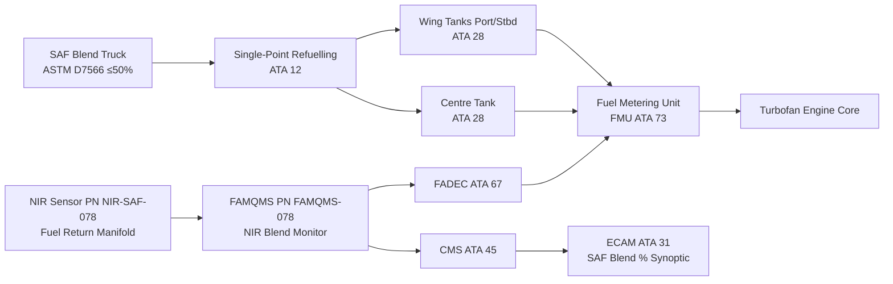
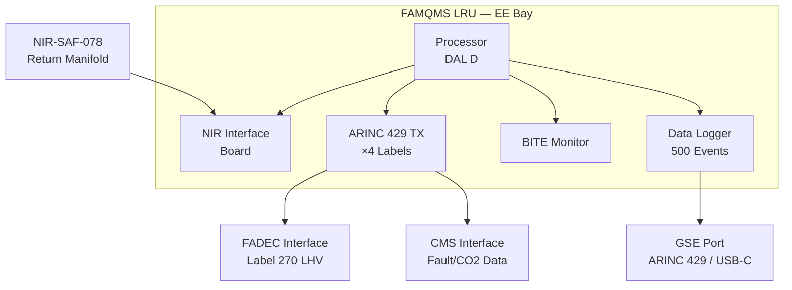

<!-- ──────────────────────────────────────────────────────────────────────────
     QATL-ATLAS-1000-ATLAS-070-079-07-078-000-SAF-AND-DROP-IN-COMPATIBILITY-GENERAL
     ATA 78 · SAF and Drop-In Compatibility General
     programme-defined aircraft type — ATLAS Register 1000
────────────────────────────────────────────────────────────────────────────── -->

# SAF and Drop-In Compatibility General

---

## §0 Hyperlink Policy

> All hyperlinks in this document are **relative** (five directory levels: `../../../../../`).
> Absolute URLs are forbidden. Every linked document must exist in the Q+ATLANTIDE repository
> before the link is activated. Broken links are treated as open issues and must be resolved
> before the document is promoted from `DRAFT` to `APPROVED`.

---

## §1 Purpose

This document defines the agnostic ATLAS standard-level architecture context for `SAF and Drop-In Compatibility General`.

It describes the controlled scope, functions, interfaces, safety considerations, lifecycle traceability, and S1000D/CSDB mapping logic that programme implementations shall instantiate when this node is applicable.

This document is not a programme design baseline. Programme-specific capacities, locations, part numbers, effectivity, operating limits, maintenance references, and data module codes shall be defined only inside the applicable programme implementation branch.
## §2 Applicability

| Applicability Level | Rule |
|---|---|
| Standard taxonomy | Applies to the ATLAS node `078` |
| Programme implementation | Conditional; determined by programme architecture, trade studies, certification basis, and applicability model |
| Product configuration | Defined in the programme-specific configuration baseline |
| Effectivity | Defined in the programme CSDB / applicability layer |
| Non-applicability | Must be explicitly stated in the programme impact-study branch when excluded |
## §3 Functional Description ![DRAFT]

The programme-defined aircraft type fuel system (ATA 28) consists of integral wing tanks (port and starboard) and a centre tank, feeding the conventional turbofan engine core via the fuel metering unit (FMU, ATA 73) under FADEC control (ATA 67). The SAF compatibility programme ensures that all approved SAF blends (per ASTM D7566) can be used in this fuel system without modification to the aircraft, engine, or ground handling infrastructure — the defining characteristic of a "drop-in" fuel.

Five approved SAF production pathways are qualified under ASTM D7566:

- **HEFA-SPK** (Annex A1): Hydroprocessed Esters and Fatty Acids Synthetic Paraffinic Kerosene — from animal/vegetable fats and oils. Current technology readiness level (TRL) 9; commercially available. CO₂ lifecycle reduction up to 80 % (waste-fat feedstock, well-to-wake basis per ICAO CORSIA methodology).
- **FT-SPK** (Annex A2): Fischer-Tropsch Synthetic Paraffinic Kerosene — from biomass or municipal solid waste gasification. TRL 7–8; small-scale commercial production. CO₂ reduction 60–90 % depending on feedstock.
- **ATJ-SPK** (Annex A3): Alcohol-to-Jet Synthetic Paraffinic Kerosene — from fermentation of agricultural residues to isobutanol or ethanol. TRL 7; emerging production. CO₂ reduction 40–70 %.
- **SIP** (Annex A4): Synthesised Iso-Paraffins from hydroprocessed fermented sugars. TRL 7; niche production. CO₂ reduction 40–80 %.
- **DHC-SPK** (Annex A5): Direct Hydrothermally Converted SPK from wet biomass/algae. TRL 6–7; pre-commercial. CO₂ reduction potential 70–90 %.

All neat SAF streams are blended with conventional Jet-A1 to produce a compliant blend meeting ASTM D7566 Table 1 properties before delivery to the aircraft. The current 50 % v/v blend limit reflects conservative ASTM qualification boundaries; a roadmap to 100 % neat SAF (ASTM D7566 ballot in progress) is anticipated by 2030.

The FAMQMS LRU (PN FAMQMS-078) uses a NIR spectroscopy sensor (PN NIR-SAF-078) installed in the fuel return manifold to measure blend ratio continuously (±2 % accuracy) and logs every refuelling event against the supplier Certificate of Analysis (CoA) and ICAO CORSIA Chain of Sustainability (CoS) documentation. This data supports real-time CO₂ accounting and regulatory compliance reporting.

---

## §4 Functional Breakdown

| ID | Name | Description | Lead Division |
|---|---|---|---|
| F-001 | SAF pathway qualification | ASTM D7566 compliance verification for all five approved SAF annexes | Q-GREENTECH |
| F-002 | Material compatibility | Elastomer, metal, coating, and sealant compatibility with SAF blends ≤50 % | Q-MECHANICS |
| F-003 | Fuel quality and traceability | Receiving inspection, contamination monitoring, CoA/CoS chain management | Q-INDUSTRY |
| F-004 | Storage and servicing | On-aircraft storage, ground refuelling, cold soak protection, CTRH | Q-MECHANICS |
| F-005 | Combustion and emissions | NOx, nvPM, CO₂ lifecycle, SFC effects of SAF blends | Q-GREENTECH |
| F-006 | Certification compliance | EASA CS-25, SC E-19, ASTM D7566 Table 1, OEM fuel spec EOFS-001 compliance | Q-AIR |
| F-007 | SAF monitoring — FAMQMS | NIR blend measurement, FADEC interface, CMS/ECAM interface, data logging | Q-HPC |
| F-008 | S1000D documentation | CSDB mapping, DMRL, BREX, traceability matrix for ATA 78 | Q-DATAGOV |

---

## §5 System Context — Mermaid Diagram

---

## §6 Internal Architecture — Mermaid Diagram

---

## §7 Components and LRUs

| Component | Part Number | Qty | Location | Maintenance Interval | Notes |
|---|---|---|---|---|---|
| FAMQMS Avionics LRU | FAMQMS-078 | 1 | EE bay, zone 121 | SW update per SB; calibration 500 FH | DO-178C DAL D; ARINC 429 I/O |
| NIR Spectroscopy Sensor | NIR-SAF-078 | 1 | Fuel return manifold, zone 131 | Calibration every 500 FH | ±2 % SAF blend accuracy; in-line installation |
| SAF Switching Valve | SVSV-078 | 2 | Wing root fuel manifolds | On-condition per FAMQMS log | Motorised ball valve, 28 V DC |
| Fuel Filter Cartridge (SAF-rated) | FFC-078 | 4 | Engine pylons (1 per engine side) | A-check replacement | Beta 15 filtration; ΔP alert at 250 mbar |
| Fuel System Sealant Kit | FSS-078 | — | Stores/logistics | On-condition at C-check | PR-1776 B-2 polysulfide, SAF-compatible |
| Central Tank Re-circulation Heater | CTRH-078 | 1 | Centre tank bay | C-check functional check | Thermostatic 2 °C above freeze point |

---

## §8 Interfaces

| Interface Type | Connected System | Protocol / Medium | Data / Function |
|---|---|---|---|
| SAF blend ratio | ATA 67 FADEC | ARINC 429 Label 270 | LHV correction factor for fuel scheduling |
| Fault and CO₂ data | ATA 45 CMS | ARINC 429 | FAMQMS BITE faults, CO₂ lifecycle savings log |
| Crew indication | ATA 31 ECAM | Via CMS / AFDX | SAF blend % displayed on fuel synoptic page |
| Refuelling data | ATA 12 ground services | Manual entry / GSE port | Refuelling event log (date, volume, CoA, pathway) |
| Fuel supply | ATA 28 fuel system | Integral wing/centre tanks | SAF blend stored in standard integral tanks |
| Fuel metering | ATA 73 FMU | Physical fuel flow | Blended fuel delivered to engine combustor |

---

## §9 Operating Modes

| Mode | Trigger | System State | Actions / Consequences |
|---|---|---|---|
| Normal SAF blend | SAF blend ≤50 % v/v confirmed | FAMQMS monitoring active; FADEC LHV corrected | Full engine power available; ECAM normal; CO₂ saving logged |
| High-blend advisory | FAMQMS reads >50 % SAF (NIR amber) | FAMQMS amber alert to CMS | Maintenance advisory generated; no immediate power restriction |
| Pure Jet-A | SAF = 0 % (no SAF in refuelling log) | FAMQMS baseline; FADEC nominal LHV | Standard operation; no CO₂ savings credited |
| Contamination alert | Water >30 mg/kg or particulate >1 mg/L detected | FAMQMS red alert to CMS | Crew advisory; fuel dump/transfer procedure per AMM |
| Cold soak protection | Fuel temp approaching freeze point | CTRH-078 active | Recirculation heating maintains fuel >freeze point +2 °C |

---

## §10 Performance and Budgets ![DRAFT]

| Parameter | Requirement | Target / Design Value | Status |
|---|---|---|---|
| SAF blend measurement accuracy | ±2 % v/v (NIR) | ±1.8 % v/v | ![TBD] |
| FAMQMS data log capacity | ≥500 refuelling events | 500 events | ![TBD] |
| CO₂ lifecycle reduction (50 % HEFA blend) | ≥40 % well-to-wake | ~40 % | ![TBD] |
| CO₂ lifecycle reduction (50 % FT-SPK blend) | ≥30 % well-to-wake | ~35 % | ![TBD] |
| NIR sensor calibration interval | ≥500 FH | 500 FH | ![TBD] |
| Max SAF blend limit (current certification) | 50 % v/v | 50 % v/v | ![TBD] |
| SFC change at 50 % SAF blend | <0.5 % increase vs Jet-A | 0.3 % increase | ![TBD] |

---

## §11 Safety, Redundancy and Fault Tolerance

- **Drop-in safety**: SAF blends meeting ASTM D7566 Table 1 are fully interchangeable with Jet-A1 in all fuel system components — no additional hazards introduced versus baseline Jet-A1 operation.
- **Blend limit monitoring**: FAMQMS provides continuous NIR-based blend ratio monitoring; amber advisory at >50 % SAF prevents inadvertent exceedance of current ASTM certification limit.
- **Seal integrity**: FAMQMS logs cumulative SAF exposure; accelerated seal inspection programme triggers at ≥40 % average SAF blend to detect potential seal shrinkage or softening before failure.
- **Contamination detection**: Integrated conductometric water sensor and particle counter in FAMQMS detect contamination exceedances within one fuel circulation cycle; crew and maintenance alerts are generated automatically.
- **Cold soak protection**: CTRH-078 thermostatic controller maintains centre tank fuel above freeze point +2 °C to prevent HEFA-SPK wax precipitation at altitude.
- **Data integrity**: FAMQMS event log is non-volatile (flash memory) with checksums; dual-copy redundancy prevents data loss; downloadable via GSE port for CoS documentation audit.

---

## §12 Maintenance and Diagnostics

| Task | Interval | Access | Special Tools |
|---|---|---|---|
| FAMQMS BITE log download | A-check | EE bay GSE port | CMS Terminal PN CMS-GSE-TRM |
| NIR-SAF-078 calibration check | 500 FH | Return manifold access panel, zone 131 | NIR Calibration Reference Cell PN NIR-CAL-078 |
| Fuel filter FFC-078 ΔP check | A-check | Engine pylon access | Differential Pressure Gauge PN DPG-GSE-078 |
| Water contamination — Karl Fischer | A-check | Fuel drain port, zone 131 | Karl Fischer Titrator PN KFT-GSE-078 |
| Tank sealant condition inspection | C-check | Wing tank access panels | Inspection Mirror PN MIR-GSE-078 |
| CTRH-078 functional test | C-check | Centre tank bay | Thermocouple Calibrator PN TCC-GSE-078 |

---

## §13 Footprint

| Footprint Type | Parameter | Value | Notes |
|---|---|---|---|
| Physical location | FAMQMS LRU | EE bay zone 121 | Standard ARINC 404A 1/2 ATR short tray |
| Physical location | NIR-SAF-078 | Fuel return manifold zone 131 | In-line installation; access panel required |
| Mass | FAMQMS LRU | 2.1 kg estimated | Subject to CDR confirmation |
| Mass | NIR-SAF-078 | 0.45 kg estimated | Including in-line housing |
| Power | FAMQMS (28 V DC) | 35 W nominal | From EE bay 28 V DC essential bus |
| Thermal | FAMQMS dissipation | 30 W | Convection cooled in EE bay |

---

## §14 Safety and Certification References ![DRAFT]

| Standard / Document | Title | Issuing Body | Applicability |
|---|---|---|---|
| ASTM D7566 | Standard Specification for Aviation Turbine Fuel Containing Synthesized Hydrocarbons | ASTM International | All SAF pathway qualifications |
| ASTM D1655 | Standard Specification for Aviation Turbine Fuels | ASTM International | Conventional Jet-A/A1 baseline |
| DEF STAN 91-091 | Turbine Fuel, Kerosine Type, Jet A-1; NATO Code F-35 | UK MOD | European Jet-A1 standard |
| EASA CS-25 §25.951–25.979 | Fuel System — General through Fuel System Drains | EASA | Fuel system airworthiness |
| EASA SC E-19 | Special Condition: Sustainable Aviation Fuels | EASA | SAF-specific airworthiness requirements |
| ICAO Annex 16 Vol IV | Carbon Offsetting and Reduction Scheme for International Aviation (CORSIA) | ICAO | CO₂ lifecycle methodology |
| SAE ARP1179 | Aircraft Fuel System and Component Icing Test | SAE International | Fuel system icing qualification |
| EU RED II (2018/2001) | Renewable Energy Directive II — sustainability criteria | European Parliament | SAF sustainability certification |

---

## §15 V&V Approach ![TBD]

| Phase | Method | Acceptance Criterion | Status |
|---|---|---|---|
| Fuel property analysis | Laboratory analysis per ASTM D7566 Table 1 for each SAF pathway | All properties within specification limits | ![TBD] |
| Material compatibility bench test | Coupon immersion tests per ASTM standards for all wetted materials | No degradation beyond limits in MTBF analysis | ![TBD] |
| FAMQMS calibration validation | NIR sensor measurement compared against GC reference analysis | Blend ratio accuracy ±2 % v/v | ![TBD] |
| Engine ground test with SAF blends | Full performance sweep at 0 %, 30 %, 50 % SAF blend | SFC change <0.5 %; combustion efficiency ≥99.9 % | ![TBD] |
| Certification flight test | CS-25 / SC E-19 compliance flight tests | Full compliance demonstrated | ![TBD] |

---

## §16 Glossary

| Term | Definition |
|---|---|
| SAF | Sustainable Aviation Fuel — alternative aviation fuel produced from non-petroleum feedstocks meeting ASTM D7566 |
| HEFA-SPK | Hydroprocessed Esters and Fatty Acids Synthetic Paraffinic Kerosene (ASTM D7566 Annex A1) |
| FT-SPK | Fischer-Tropsch Synthetic Paraffinic Kerosene (ASTM D7566 Annex A2) |
| ATJ-SPK | Alcohol-to-Jet Synthetic Paraffinic Kerosene (ASTM D7566 Annex A3) |
| SIP | Synthesised Iso-Paraffins (ASTM D7566 Annex A4) |
| DHC-SPK | Direct Hydrothermally Converted Synthetic Paraffinic Kerosene (ASTM D7566 Annex A5) |
| FAMQMS | Fuel Accountability and Material Quality Monitoring System — avionics LRU for SAF blend monitoring |
| NIR | Near-Infrared Spectroscopy — optical technique for blend ratio measurement |
| CoA | Certificate of Analysis — laboratory fuel quality document issued per batch |
| CoS | Chain of Sustainability — ICAO CORSIA traceability documentation for SAF carbon credits |
| LHV | Lower Heating Value — fuel energy content on mass basis (MJ/kg) |
| nvPM | Non-volatile Particulate Matter — combustion soot particles relevant to air quality |
| CTRH | Central Tank Recirculation Heater — thermostatic fuel heater preventing wax precipitation |
| FADEC | Full Authority Digital Engine Control (ATA 67) |
| FMU | Fuel Metering Unit (ATA 73) |

---

## §17 Open Issues

| ID | Description | Owner | Target |
|---|---|---|---|
| OI-078-000-001 | Define FAMQMS interface ICD with FADEC (Label 270 word format and update rate) | Q-HPC / Q-GREENTECH | 2026-Q4 |
| OI-078-000-002 | Confirm DHC-SPK (Annex A5) qualification status and timeline for [PROGRAMME-AIRCRAFT] approval | Q-GREENTECH | 2027-Q1 |
| OI-078-000-003 | Establish CoS documentation workflow between fuel supplier, ground ops, and FAMQMS data logger | Q-INDUSTRY | 2026-Q4 |
| OI-078-000-004 | Review ASTM D7566 ballot for 100 % neat SAF and update certification roadmap | Q-AIR / Safety | 2027-Q2 |

---

## §18 Status Legend

| Badge | Meaning |
|---|---|
| `![DRAFT]` | Section is drafted but not yet reviewed |
| `![TBD]` | Content not yet started — to be defined |
| `![To Be Completed]` | Partially complete — needs additional content |
| `![APPROVED]` | Reviewed and formally approved |

---

## §19 Related Documents (Siblings in this Subsection)

- [078-010](./078-010-SAF-Fuel-Compatibility-Basis.md)
- [078-020](./078-020-Drop-In-Fuel-Material-Compatibility.md)
- [078-030](./078-030-Fuel-Quality-Contamination-and-Traceability.md)
- [078-040](./078-040-SAF-Storage-Handling-and-Servicing.md)
- [078-050](./078-050-Combustion-Emissions-and-Performance-Effects.md)
- [078-060](./078-060-SAF-Certification-and-Operational-Limits.md)
- [078-070](./078-070-SAF-System-Inspection-Test-and-Maintenance.md)
- [078-080](./078-080-SAF-Monitoring-Diagnostics-and-Control-Interfaces.md)
- [078-090](./078-090-S1000D-CSDB-Mapping-and-Traceability.md)

---

## §20 Change Log

| Rev | Date | Author | Description |
|---|---|---|---|
| 0.1 | 2026-05-12 | @copilot | Initial DRAFT — general scope and architecture for ATA 78 SAF and Drop-In Compatibility |
