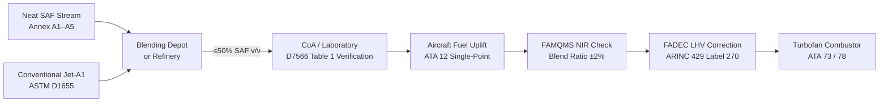
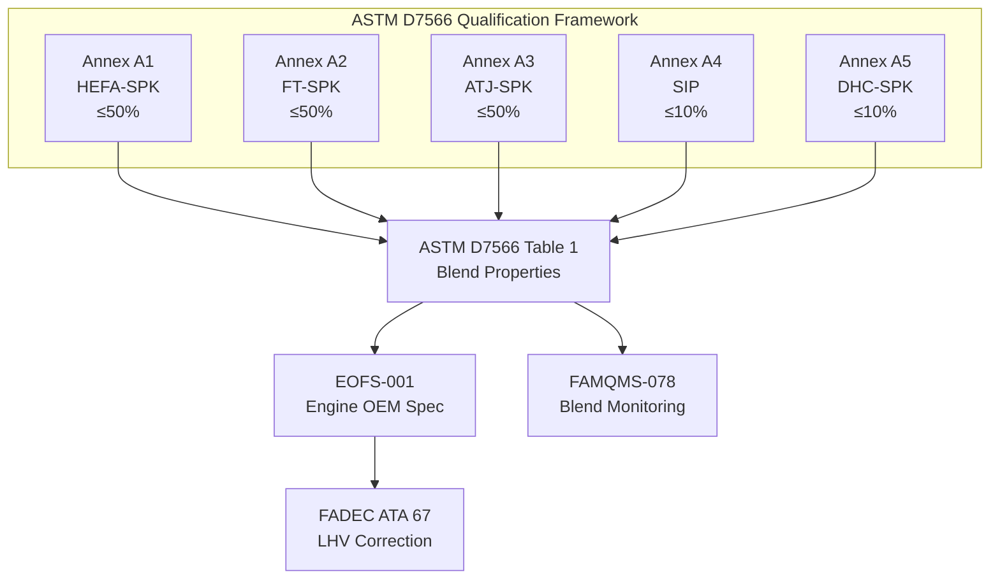

<!-- ──────────────────────────────────────────────────────────────────────────
     QATL-ATLAS-1000-ATLAS-070-079-07-078-010-SAF-FUEL-COMPATIBILITY-BASIS
     ATA 78 · SAF Fuel Compatibility Basis
     AMPEL360E eWTW — ATLAS Register 1000
────────────────────────────────────────────────────────────────────────────── -->

# SAF Fuel Compatibility Basis

---

## §0 Hyperlink Policy

> All hyperlinks in this document are **relative** (five directory levels: `../../../../../`).
> Absolute URLs are forbidden. Every linked document must exist in the Q+ATLANTIDE repository
> before the link is activated. Broken links are treated as open issues and must be resolved
> before the document is promoted from `DRAFT` to `APPROVED`.

---

## §1 Purpose

This document (078-010) defines the fuel chemistry qualification basis for Sustainable Aviation Fuel (SAF) compatibility on the AMPEL360E eWTW turbofan engine and fuel system. It establishes the ASTM D7566 qualification pathways, critical fuel property requirements, blend ratio limits, and the process by which novel SAF candidates may be evaluated for future approval.

The AMPEL360E eWTW is designed to accept blends of conventional Jet-A1 (ASTM D1655 / DEF STAN 91-091) with approved SAF streams from any of the five currently approved ASTM D7566 annexes. The Engine OEM Fuel Specification EOFS-001 is the controlling document for the turbofan engine combustor; all SAF blends must conform to EOFS-001 as well as ASTM D7566 Table 1. The FAMQMS LRU (PN FAMQMS-078) provides real-time blend ratio monitoring that confirms conformance during every flight.

---

## §2 Applicability

| Parameter | Value |
|---|---|
| Aircraft Program | AMPEL360E eWTW |
| ATA reference | ATA 78-010 — SAF Fuel Compatibility Basis |
| Certification basis | EASA CS-25 Amdt 27+; EASA SC E-19; ASTM D7566 Ed. 2023 |
| S1000D SNS | 078-010-00 |
| Approved ASTM annexes | A1 (HEFA-SPK), A2 (FT-SPK), A3 (ATJ-SPK), A4 (SIP), A5 (DHC-SPK) |
| Applicable engine spec | Engine OEM Fuel Specification EOFS-001, Rev C |

---

## §3 Functional Description ![DRAFT]

ASTM D7566 defines the qualification framework for SAF blended with conventional Jet-A/Jet-A1 as aviation turbine fuel. The standard mandates that each approved neat SAF stream (Annex A1–A5) must individually meet a defined set of hydrocarbon composition and physical property requirements before blending. After blending at the approved maximum ratio (currently 10–50 % v/v depending on annex), the blend must also meet ASTM D1655 / ASTM D7566 Table 1 full-specification properties as if it were conventional Jet-A.

The ASTM D4054 fast-track evaluation process provides a pathway for novel SAF candidates not yet qualified under any annex. D4054 requires graduated testing from Tier 1 (fuel property screening) through Tier 4 (rig and engine testing) before an applicant can petition for inclusion as a new D7566 annex. The AMPEL360E OEM participates in the Aviation Fuel Quality Requirements for Jointly Operated Systems (AFQRJOS) committee review for D4054 candidate fuels.

Critical fuel properties governing compatibility with the AMPEL360E combustor and fuel system are listed in §10 (Performance and Budgets). Key parameters include:

- **Flash point**: Minimum 38 °C (safety; D93 Pensky-Martens closed cup) — all SAF blends comply by specification.
- **Freeze point**: Maximum −47 °C (D7153 — cold soak operability at altitude) — pure HEFA-SPK can have higher freeze points; blending with Jet-A1 restores compliance.
- **Aromatics content**: 8–25 % v/v (D1319 FIA or D6379 HPLC) — minimum 8 % required for elastomer seal swell (see 078-020); maximum 25 % per ASTM D7566 Table 1 for total hydrocarbon class balance.
- **Lubricity**: ≤0.85 mm WSD at 60 °C (D5001 BOCLE) — neat SAF streams with very low aromatic/sulphur content may have reduced lubricity; blending restores lubricity to acceptable levels.
- **Viscosity at −20 °C**: ≤12 mm²/s (D445) — fuel system pumpability requirement.
- **Thermal stability (JFTOT)**: ≥260 °C breakpoint temperature (D3241) — combustor liner and fuel nozzle coking resistance.
- **LHV (Lower Heating Value)**: ≥42.8 MJ/kg for 50 % SAF blend (vs ~43.2 MJ/kg for Jet-A1) — FADEC LHV correction applied via ARINC 429 from FAMQMS.

The combustor liner coating (MCrAlY thermal barrier on Inconel 625 substrate) and fuel injector nozzles (Hastelloy X with carbide wear tips) have been tested with all five approved SAF pathways per EOFS-001 qualification programme. Injector spray pattern atomisation tests confirm no measurable change in Sauter Mean Diameter (SMD) across the 0–50 % SAF blend range at all power settings.

The 100 % neat SAF roadmap is being pursued through ASTM D7566 technical committee ballot process. Anticipated regulatory acceptance by 2030 will require dedicated combustor rich-extinction re-test, fuel nozzle coking at maximum temperature soak conditions, and material compatibility verification at neat SAF aromatic content as low as 0 % for synthetic paraffinic kerosenes.

---

## §4 Functional Breakdown

| ID | Name | Description | Lead Division |
|---|---|---|---|
| F-001 | ASTM D7566 property verification | Confirm all ASTM D7566 Table 1 properties for each approved SAF blend at point of uplift | Q-GREENTECH |
| F-002 | OEM fuel spec EOFS-001 compliance | Verify blend meets Engine OEM Fuel Specification EOFS-001 Rev C prior to aircraft release | Q-MECHANICS |
| F-003 | Aromatics content control | Monitor and maintain aromatics 8–25 % v/v in blend to ensure elastomer compatibility and combustion balance | Q-GREENTECH |
| F-004 | Blend ratio verification | NIR spectroscopy (FAMQMS) confirms blend ratio ±2 % v/v at all times during operation | Q-HPC |
| F-005 | Lubricity specification | Verify BOCLE ≤0.85 mm WSD for each delivered blend; additive lubricity improver authorised per EOFS-001 | Q-MECHANICS |

---

## §5 System Context — Mermaid Diagram

---

## §6 Internal Architecture — Mermaid Diagram

---

## §7 Components and LRUs

| Component | Part Number | Qty | Location | Maintenance Interval | Notes |
|---|---|---|---|---|---|
| FAMQMS Avionics LRU | FAMQMS-078 | 1 | EE bay zone 121 | Calibration 500 FH | DAL D; blend ratio monitoring |
| NIR Spectroscopy Sensor | NIR-SAF-078 | 1 | Fuel return manifold zone 131 | Calibration 500 FH | In-line; ±2 % accuracy |
| Fuel Filter Cartridge (SAF-rated) | FFC-078 | 4 | Engine pylons | A-check replacement | ASTM D2276 compatible |
| Combustor Fuel Injector Assembly | FIA-078 | 24 | Engine combustor (12/engine) | On-condition per borescope | Hastelloy X; carbide wear tips; SMD tested |
| Lubricity Improver Additive Kit | LIA-078 | — | Ground stores | Per blending batch if required | EOFS-001 approved DCI-4A; max 100 mg/L |

---

## §8 Interfaces

| Interface Type | Connected System | Protocol / Medium | Data / Function |
|---|---|---|---|
| LHV correction signal | ATA 67 FADEC | ARINC 429 Label 270 | Blend ratio → FADEC calculates LHV offset for fuel metering |
| Fuel property data | ATA 45 CMS | ARINC 429 | Blend ratio, pathway, alert status logged to CMS |
| Fuel supply | ATA 28 fuel tanks | Physical fuel flow | Blended SAF stored in standard integral tanks |
| Refuelling CoA input | Ground operations (manual) | GSE port USB-C | Supplier CoA and CoS data entered at refuelling |
| Combustor inlet fuel | ATA 73 FMU | Physical fuel flow | Metered fuel to injectors; LHV-corrected by FADEC |

---

## §9 Operating Modes

| Mode | Trigger | System State | Actions / Consequences |
|---|---|---|---|
| Pre-flight blend check | Ground, before engine start | FAMQMS NIR measurement active; blend ratio read and logged | Blend ratio transmitted to FADEC for LHV scheduling |
| Inflight monitoring | Continuous during flight | NIR sensor sampling at 1 Hz; FAMQMS updates blend ratio log | FADEC LHV correction updated; CO₂ saving computed |
| Blend advisory (>50 %) | NIR detects >50 % SAF | FAMQMS amber alert to CMS | Maintenance advisory; no immediate flight restriction |
| Lubricity low alert | CoA lubricity >0.85 mm WSD | FAMQMS flags CoA parameter | Lubricity improver addition required per AMM; no dispatch until resolved |
| Novel SAF candidate | D4054 evaluation batch | Special test programme (STP) flight | All data recorded with special STP FAMQMS configuration |

---

## §10 Performance and Budgets ![DRAFT]

| Parameter | Specification Limit | ASTM Ref | Current SAF Blend Design Value | Status |
|---|---|---|---|---|
| Flash point | ≥38 °C (min) | D93 | ≥42 °C (50 % HEFA/Jet-A1) | ![TBD] |
| Freeze point | ≤−47 °C (max) | D7153 | −52 °C (50 % HEFA/Jet-A1 blend) | ![TBD] |
| Aromatics content | 8–25 % v/v | D1319 / D6379 | 12–18 % v/v (typical 50 % SAF blend) | ![TBD] |
| Lubricity (BOCLE WSD) | ≤0.85 mm at 60 °C | D5001 | 0.72 mm (50 % HEFA/Jet-A1) | ![TBD] |
| Kinematic viscosity at −20 °C | ≤12 mm²/s | D445 | 9.8 mm²/s | ![TBD] |
| Thermal stability (JFTOT BPT) | ≥260 °C | D3241 | 285 °C (50 % HEFA/Jet-A1) | ![TBD] |
| Net heat of combustion (LHV) | ≥42.8 MJ/kg | D3338 | 43.0 MJ/kg (50 % HEFA/Jet-A1) | ![TBD] |
| Total aromatics | ≤25 % v/v | D1319 | <20 % v/v | ![TBD] |
| FAME content | ≤5 mg/kg | D7797 | <5 mg/kg (no FAME in HEFA/FT) | ![TBD] |
| Max blend ratio (current) | 50 % v/v SAF | ASTM D7566 | 50 % v/v | ![TBD] |

---

## §11 Safety, Redundancy and Fault Tolerance

- **Blend ratio guard**: FAMQMS amber advisory at >50 % SAF prevents inadvertent exceedance of ASTM D7566 maximum blend limit and potential FADEC LHV under-correction.
- **Aromatics floor**: Minimum 8 % v/v aromatics in blend is specified in aircraft Approved Fuel List (AFL) to prevent elastomer seal shrinkage; FAMQMS flags blends with CoA showing <8 % aromatics before refuelling acceptance.
- **FAME guard**: Maximum 5 mg/kg FAME (Fatty Acid Methyl Ester — biodiesel contamination) enforced via CoA verification; FAME can degrade thermal stability and increase microbial growth risk.
- **Thermal stability**: JFTOT breakpoint ≥260 °C maintained for all approved blends; combustor liner temperature measurements during qualification testing confirm no coking increase over Jet-A1 baseline.
- **Combustor injector integrity**: Injector atomisation and spray pattern tested at 0 %, 30 %, and 50 % SAF blends; SMD change <3 % — within combustor stability envelope.
- **FADEC LHV correction**: FAMQMS provides LHV correction factor to FADEC; if FAMQMS fails (BITE fault), FADEC defaults to conservative Jet-A1 LHV — slight fuel-rich scheduling ensures engine performance with no safety impact.

---

## §12 Maintenance and Diagnostics

| Task | Interval | Access | Special Tools |
|---|---|---|---|
| FAMQMS blend ratio log review | A-check | CMS terminal | CMS Terminal PN CMS-GSE-TRM |
| NIR-SAF-078 calibration | 500 FH | Return manifold access panel zone 131 | NIR Reference Cell PN NIR-CAL-078 |
| Fuel injector FIA-078 borescope | B-check / as required by EGT margin | Borescope access ports on engine | Borescope PN BSC-ENG-078 |
| CoA record audit | At each refuelling event | Ground — FAMQMS GSE port | FAMQMS Download Terminal PN FAM-DL-078 |
| FAME contamination test | C-check or after suspected contamination | Fuel drain port | FAME Test Kit PN FAME-TST-078 (D7797 field kit) |

---

## §13 Footprint

| Footprint Type | Parameter | Value | Notes |
|---|---|---|---|
| Fuel system modification | Nil — drop-in compatibility | No hardware change vs Jet-A1 baseline | All materials pre-qualified for SAF |
| FAMQMS LRU (additional) | 2.1 kg, 35 W | EE bay 121 | New LRU for SAF monitoring |
| NIR sensor (additional) | 0.45 kg | Return manifold zone 131 | New sensor for blend ratio |
| Injector FIA-078 | 24 off; ~0.6 kg each | Combustor ring | Pre-qualified for SAF; no interval change |
| Ground support equipment | LIA-078 lubricity improver kit | Ground stores | Only required for low-lubricity blends |

---

## §14 Safety and Certification References ![DRAFT]

| Standard / Document | Title | Issuing Body | Applicability |
|---|---|---|---|
| ASTM D7566-23 | Standard Specification for Aviation Turbine Fuel Containing Synthesized Hydrocarbons | ASTM International | Primary SAF qualification standard |
| ASTM D4054-22 | Standard Practice for Qualification and Approval of New Aviation Turbine Fuels and Fuel Additives | ASTM International | Novel SAF pathway evaluation |
| ASTM D1655-23 | Standard Specification for Aviation Turbine Fuels | ASTM International | Conventional Jet-A/A1 baseline properties |
| EASA SC E-19 | Special Condition: Sustainable Aviation Fuels for Turbine Engines | EASA | SAF combustor and fuel system certification |
| EOFS-001 Rev C | Engine OEM Fuel Specification — AMPEL360E Turbofan | Engine OEM (TBD) | Combustor and FMU fuel property requirements |
| AFQRJOS Issue 30 | Aviation Fuel Quality Requirements for Jointly Operated Systems | EI/IATA | Minimum fuel quality for jointly operated systems |
| SAE ARP1533B | Procedure for the Analysis and Evaluation of Gaseous Emissions from Aircraft Engines | SAE International | Engine emissions under SAF operation |

---

## §15 V&V Approach ![TBD]

| Phase | Method | Acceptance Criterion | Status |
|---|---|---|---|
| Fuel property verification | Laboratory analysis per ASTM D7566 Table 1 | All properties in limits for each approved annex | ![TBD] |
| JFTOT thermal stability | D3241 JFTOT test at 260 °C and 285 °C for 50 % SAF blend | Tube rating ≤3 (visual); BPT ≥260 °C | ![TBD] |
| FAMQMS NIR calibration | GC reference versus NIR measurement for 5 blend ratios | NIR accuracy ±2 % v/v vs GC | ![TBD] |
| Combustor rig test — SAF | 50 % HEFA-SPK/Jet-A1 blend at idle, cruise, T/O power | SFC change <0.5 %; no coking; EGT within limits | ![TBD] |
| FADEC LHV correction validation | Full engine envelope test with FAMQMS LHV correction active | Fuel metering accuracy unchanged; no surge/stall | ![TBD] |

---

## §16 Glossary

| Term | Definition |
|---|---|
| ASTM D7566 | SAF qualification standard — defines blend properties and approved production annexes |
| ASTM D4054 | Fast-track evaluation process for novel SAF candidates not yet in D7566 annexes |
| LHV | Lower Heating Value — fuel energy per unit mass (MJ/kg), used by FADEC for fuel metering |
| JFTOT | Jet Fuel Thermal Oxidation Tester — measures fuel thermal stability by deposit formation at set temperature |
| BPT | Breakpoint Temperature — D3241 JFTOT result parameter; higher is better |
| BOCLE WSD | Ball-On-Cylinder Lubricity Evaluator Wear Scar Diameter — lubricity test result (mm) |
| SMD | Sauter Mean Diameter — atomisation quality metric for fuel injector spray droplet size |
| FAME | Fatty Acid Methyl Ester — biodiesel; cross-contamination contaminant in SAF |
| CoA | Certificate of Analysis — per-batch fuel quality document |
| EOFS-001 | Engine OEM Fuel Specification — defines turbofan combustor fuel requirements |
| AFQRJOS | Aviation Fuel Quality Requirements for Jointly Operated Systems (EI/IATA) |
| AFL | Approved Fuel List — aircraft-level list of approved fuel types and blends |
| FIA | Fuel Injector Assembly — combustor fuel atomiser |

---

## §17 Open Issues

| ID | Description | Owner | Target |
|---|---|---|---|
| OI-078-010-001 | Confirm EOFS-001 Rev C acceptance criteria for ATJ-SPK Annex A3 at 50 % blend | Q-GREENTECH / Engine OEM | 2026-Q4 |
| OI-078-010-002 | Agree with ASTM on timeline for 100 % neat SAF ballot and AMPEL360E participation | Q-AIR | 2027-Q1 |
| OI-078-010-003 | Validate NIR sensor (NIR-SAF-078) accuracy against GC reference for SIP (Annex A4) blend | Q-HPC | 2026-Q4 |
| OI-078-010-004 | Define lubricity improver (LIA-078) addition procedure in AMM task card | Q-MECHANICS | 2026-Q4 |

---

## §18 Status Legend

| Badge | Meaning |
|---|---|
| `![DRAFT]` | Section is drafted but not yet reviewed |
| `![TBD]` | Content not yet started — to be defined |
| `![To Be Completed]` | Partially complete — needs additional content |
| `![APPROVED]` | Reviewed and formally approved |

---

## §19 Related Documents (Siblings in this Subsection)

- [078-000](./078-000-SAF-and-Drop-In-Compatibility-General.md)
- [078-020](./078-020-Drop-In-Fuel-Material-Compatibility.md)
- [078-030](./078-030-Fuel-Quality-Contamination-and-Traceability.md)
- [078-040](./078-040-SAF-Storage-Handling-and-Servicing.md)
- [078-050](./078-050-Combustion-Emissions-and-Performance-Effects.md)
- [078-060](./078-060-SAF-Certification-and-Operational-Limits.md)
- [078-070](./078-070-SAF-System-Inspection-Test-and-Maintenance.md)
- [078-080](./078-080-SAF-Monitoring-Diagnostics-and-Control-Interfaces.md)
- [078-090](./078-090-S1000D-CSDB-Mapping-and-Traceability.md)

---

## §20 Change Log

| Rev | Date | Author | Description |
|---|---|---|---|
| 0.1 | 2026-05-12 | @copilot | Initial DRAFT — SAF fuel compatibility basis for ATA 78-010 |
