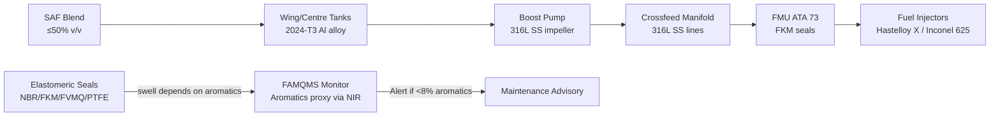
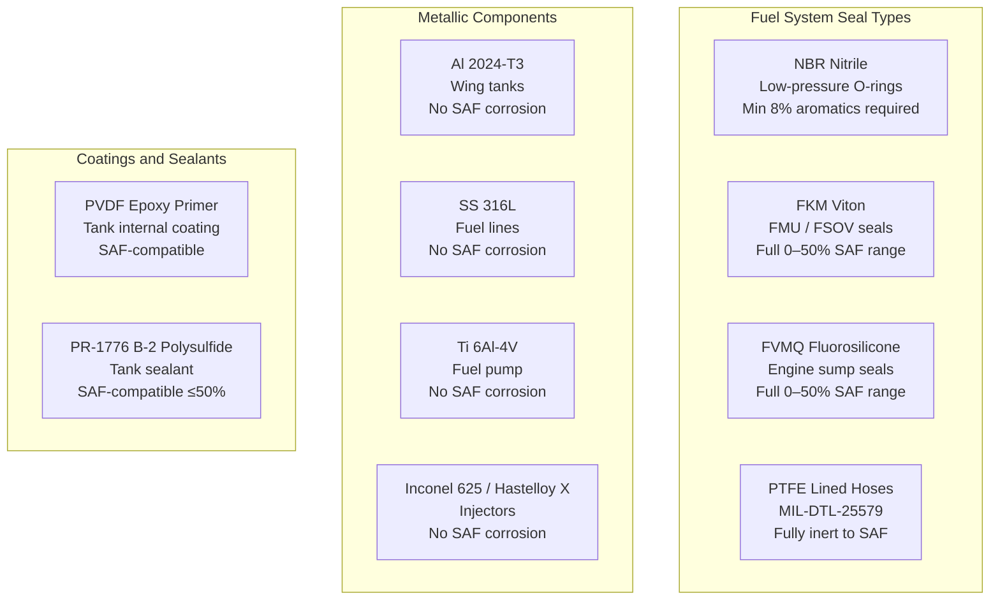

<!-- ──────────────────────────────────────────────────────────────────────────
     QATL-ATLAS-1000-ATLAS-070-079-07-078-020-DROP-IN-FUEL-MATERIAL-COMPATIBILITY
     ATA 78 · Drop-In Fuel Material Compatibility
     programme-defined aircraft type — ATLAS Register 1000
────────────────────────────────────────────────────────────────────────────── -->

# Drop-In Fuel Material Compatibility

---

## §0 Hyperlink Policy

> All hyperlinks in this document are **relative** (five directory levels: `../../../../../`).
> Absolute URLs are forbidden. Every linked document must exist in the Q+ATLANTIDE repository
> before the link is activated. Broken links are treated as open issues and must be resolved
> before the document is promoted from `DRAFT` to `APPROVED`.

---

## §1 Purpose

This document defines the agnostic ATLAS standard-level architecture context for `Drop-In Fuel Material Compatibility`.

It describes the controlled scope, functions, interfaces, safety considerations, lifecycle traceability, and S1000D/CSDB mapping logic that programme implementations shall instantiate when this node is applicable.

This document is not a programme design baseline. Programme-specific capacities, locations, part numbers, effectivity, operating limits, maintenance references, and data module codes shall be defined only inside the applicable programme implementation branch.
## §2 Applicability

| Applicability Level | Rule |
|---|---|
| Standard taxonomy | Applies to the ATLAS node `078` |
| Programme implementation | Conditional; determined by programme architecture, trade studies, certification basis, and applicability model |
| Product configuration | Defined in the programme-specific configuration baseline |
| Effectivity | Defined in the programme CSDB / applicability layer |
| Non-applicability | Must be explicitly stated in the programme impact-study branch when excluded |
## §3 Functional Description ![DRAFT]

SAF streams (particularly HEFA-SPK, FT-SPK, and ATJ-SPK) are highly paraffinic and contain very low concentrations of aromatic and cycloparaffinic hydrocarbons compared with conventional Jet-A1. Aromatic hydrocarbons in jet fuel serve an important secondary function: they swell elastomeric seals and O-rings to provide a positive interference fit and prevent fuel leakage. When aromatic content drops below approximately 8 % v/v, certain nitrile (NBR) elastomers may shrink from their equilibrium dimensions, leading to seal leakage.

The programme-defined aircraft type addresses this risk through three complementary means:

1. **Blend specification floor**: The Approved Fuel List (AFL) mandates minimum 8 % v/v aromatics in any blended fuel delivered to the aircraft (enforced at depot blending). This prevents use of 100 % neat synthetic paraffinic kerosene in the current configuration.
2. **FAMQMS aromatics monitoring**: The NIR sensor (PN NIR-SAF-078) provides a proxy aromatics estimate from the blend ratio reading, cross-referenced against the CoA aromatics value. An advisory alert is issued if CoA aromatics fall below 8 %.
3. **Material selection**: Where possible, fuel system seals are specified in fluoroelastomers (FKM/Viton) or fluorosilicone (FVMQ), which are less sensitive to aromatic content for swell maintenance compared with NBR.

**Elastomer compatibility matrix**: Nitrile (NBR) O-rings and static seals in the low-pressure fuel circuit are compatible with SAF blends ≥8 % aromatics per ASTM immersion test data (D471 at 70 °C for 72 hours). Fluorosilicone (FVMQ) sump seals (engine drain) are compatible at 0–50 % SAF. Viton (FKM) seals in the fuel metering unit (FMU) and FADEC-controlled fuel shutoff valve (FSOV) are compatible across the full 0–50 % range. PTFE-lined flexible fuel hoses (MIL-DTL-25579) are fully inert to all SAF blends.

**Metallic compatibility**: Aluminium alloy 2024-T3 (integral wing tank construction) shows no corrosion susceptibility to SAF blends — paraffinic SAF is actually less aggressive than conventional Jet-A1 due to lower sulphur and aromatic content. Titanium 6Al-4V (fuel pump impeller) is fully compatible. Stainless steel 316L (all fuel lines aft of firewall, fuel crossfeed manifolds) is fully compatible. Inconel 625 (combustor fuel injector bodies) and Hastelloy X (injector nozzle tips) are fully compatible.

**Tank coatings and sealants**: The integral wing tank internal coating is Solvay Solef PVDF-based epoxy primer — SAF-compatible per OEM qualification testing. Tank sealant is PRC-DeSoto PR-1776 B-2 polysulfide, qualified for SAF blends up to 50 % v/v per AMS 3281 immersion test. No sealant re-application is required as part of SAF introduction; however, the inspection interval at C-check monitors for any softening or adhesion loss.

---

## §4 Functional Breakdown

| ID | Name | Description | Lead Division |
|---|---|---|---|
| F-001 | Elastomer compatibility verification | Test and qualify all NBR, FKM, FVMQ, and PTFE seals per D471 for SAF blends ≤50 % | Q-MECHANICS |
| F-002 | Metal compatibility | Verify aluminium, titanium, stainless steel, and superalloy corrosion resistance to SAF blends | Q-MECHANICS |
| F-003 | Coating compatibility | Qualify PVDF epoxy tank coating and all painted/anodised surfaces for SAF exposure | Q-INDUSTRY |
| F-004 | Sealant compatibility | Qualify PR-1776 B-2 polysulfide and structural adhesives for SAF blends to AMS 3281 | Q-MECHANICS |
| F-005 | Seal swell monitoring | FAMQMS cumulative SAF exposure log triggers accelerated seal inspection at ≥40 % avg blend | Q-HPC |

---

## §5 System Context — Mermaid Diagram

---

## §6 Internal Architecture — Mermaid Diagram

---

## §7 Components and LRUs

| Component | Part Number | Qty | Location | Maintenance Interval | Notes |
|---|---|---|---|---|---|
| NBR O-ring set (low-pressure circuit) | ORS-NBR-078 | ~120 | Fuel system zones 131–141 | On-condition; accelerated at ≥40% SAF | MIL-P-5315 Type I |
| FKM O-ring and seal set (FMU) | ORS-FKM-078 | ~30 | FMU, FSOV, fuel control | On-condition per AMM | AMS 7276 Viton |
| FVMQ sump seal set (engine) | ORS-FVMQ-078 | 8 | Engine 1/2 sump drains | On-condition | MIL-R-83248C Class 1 |
| PTFE flexible hose (fuel) | FHL-PTFE-078 | ~14 m | Engine pylon fuel lines | No SAF-specific interval | MIL-DTL-25579 |
| Tank sealant kit PR-1776 B-2 | FSS-078 | — | Wing/centre tank bays | C-check condition inspection | PRC-DeSoto PR-1776 B-2; AMS 3281 |
| FAMQMS LRU | FAMQMS-078 | 1 | EE bay 121 | 500 FH calibration | Seal exposure log function |

---

## §8 Interfaces

| Interface Type | Connected System | Protocol / Medium | Data / Function |
|---|---|---|---|
| Aromatics advisory | ATA 45 CMS | ARINC 429 | Alert if CoA aromatics <8 % v/v |
| Cumulative SAF exposure | FAMQMS internal log | Flash memory | Tracks cumulative avg blend %; triggers 40 % inspection threshold |
| Seal inspection data | AMM Task Card 078-020-01 | Manual / FAMQMS GSE port | Inspection results recorded against FAMQMS event log |
| CoA aromatics value | Ground operations | GSE port manual entry | Entered at refuelling; cross-checked against NIR proxy |

---

## §9 Operating Modes

| Mode | Trigger | System State | Actions / Consequences |
|---|---|---|---|
| Normal operation | SAF blend 8–50 % aromatics in spec | All seals within swell range; FAMQMS green | No special action; CO₂ savings logged |
| Aromatics low advisory | CoA or NIR proxy <8 % aromatics | FAMQMS amber alert to CMS | Maintenance advisory; check CoA; do not accept fuel until resolved |
| High-cumulative SAF | FAMQMS cumulative SAF avg ≥40 % | FAMQMS flag in maintenance event log | Accelerated seal inspection at next A-check |
| Post-SAF introduction | First SAF refuelling event | FAMQMS logs event; initial inspection triggered | Visual inspect drain manifold seals after first SAF uplift |
| Sealant degradation found | C-check sealant inspection | Soft/swollen sealant noted | Re-application of PR-1776 B-2 per AMM; FAMQMS event logged |

---

## §10 Performance and Budgets ![DRAFT]

| Material | Test Method | Acceptance Criterion | SAF 50% Result | Status |
|---|---|---|---|---|
| NBR O-ring (D471, 70 °C, 72 h) | ASTM D471 | Volume swell +5 to +25 % | +14 % (50% HEFA/Jet-A1) | ![TBD] |
| FKM seal (D471, 70 °C, 72 h) | ASTM D471 | Volume swell +0 to +10 % | +4 % | ![TBD] |
| FVMQ sump seal (D471) | ASTM D471 | Volume swell +0 to +15 % | +8 % | ![TBD] |
| PTFE hose liner (D471) | ASTM D471 | Volume swell ≤1 % | <0.5 % | ![TBD] |
| PR-1776 B-2 sealant adhesion | AMS 3281 peel | ≥15 N/25 mm | 22 N/25 mm | ![TBD] |
| Al 2024-T3 coupon (ASTM G31) | ASTM G31 | Corrosion rate <0.01 mm/yr | <0.005 mm/yr | ![TBD] |
| SS 316L coupon (ASTM G31) | ASTM G31 | No pitting at 1000 h | No pitting | ![TBD] |

---

## §11 Safety, Redundancy and Fault Tolerance

- **Aromatics floor 8 % v/v**: Prevents NBR seal shrinkage below minimum operating interference; enforced by AFL and monitored by FAMQMS CoA aromatics check at each refuelling.
- **Dual-seal architecture**: All fuel shutoff valves use dual (primary + secondary) seal configuration; seal failure of primary results in leakage to drain cavity, not to environment — detected at next inspection.
- **Sealant inspection programme**: C-check tank sealant inspection (PR-1776 B-2 visual and adhesion check) ensures fuel-tight tank structure over the SAF operational life; re-application before in-service degradation.
- **FAMQMS exposure log**: Non-volatile flash memory log prevents loss of cumulative exposure data; dual copy with checksum; if lost, inspection defaults to most conservative (pre-50 % SAF) baseline.
- **Accelerated inspection trigger**: At ≥40 % cumulative average SAF blend, accelerated inspection at next A-check (not delayed to C-check) provides additional defence-in-depth for seal integrity assurance.
- **PTFE hose on critical lines**: Engine pylon fuel supply lines (highest temperature zone) use PTFE-lined hoses inherently inert to SAF — no swell risk regardless of aromatic content.

---

## §12 Maintenance and Diagnostics

| Task | Interval | Access | Special Tools |
|---|---|---|---|
| Drain manifold seal visual inspection | First SAF refuelling; then A-check | Fuel drain access panels, zone 131 | Inspection Mirror PN MIR-GSE-078; Borescope PN BSC-TK-078 |
| FAMQMS cumulative exposure log review | A-check | EE bay GSE port | FAMQMS Download Terminal PN FAM-DL-078 |
| NBR O-ring condition assessment | On-condition (trigger at ≥40% cumulative) | Fuel system access panels | Seal Calliper PN CAL-GSE-078; O-ring condition card |
| Tank sealant adhesion and visual check | C-check | Wing/centre tank entry (confined space) | Adhesion Tester PN ADH-GSE-078; PR-1776 replenishment kit FSS-078 |
| PTFE hose external visual inspection | B-check | Engine pylon cowl open | Visual inspection; no special tools |
| FKM FMU seal replacement | On-condition per AMM | Engine pylon (H/F procedure) | FMU seal kit ORS-FKM-078; torque wrench set |

---

## §13 Footprint

| Footprint Type | Parameter | Value | Notes |
|---|---|---|---|
| Modified hardware (drop-in) | Nil | No hardware change | All materials pre-qualified for SAF ≤50% |
| Consumable seals stock | ORS-NBR-078, ORS-FKM-078, ORS-FVMQ-078 | Per stores plan | Increased inspection frequency may increase consumption rate |
| Tank sealant stock | FSS-078 (PR-1776 B-2) | Per maintenance plan | Standard tank sealant; SAF-rated qualification |
| FAMQMS exposure log | Flash memory 500 events | EE bay 121 | Non-volatile; dual copy |

---

## §14 Safety and Certification References ![DRAFT]

| Standard / Document | Title | Issuing Body | Applicability |
|---|---|---|---|
| ASTM D471-23 | Standard Test Method for Rubber Property — Effect of Liquids | ASTM International | Elastomer immersion testing |
| AMS 3281 | Sealing Compound, Polysulfide, Integral Fuel Tanks and Fuel Cell Cavities | SAE International | Tank sealant qualification |
| MIL-DTL-25579 | Hose Assembly, Tetrafluoroethylene, High-Temperature | US DoD | PTFE hose liner specification |
| ASTM G31 | Standard Guide for Laboratory Immersion Corrosion Testing of Metals | ASTM International | Metallic coupon corrosion test |
| EASA CS-25 §25.963 | Fuel Tanks — general | EASA | Tank structural and material integrity |
| MIL-P-5315 | Packing, Preformed, Petroleum Hydraulic Fluid Resistant | US DoD | NBR O-ring baseline spec |
| AMS 7276 | Seals, O-Rings, Fluorocarbon Elastomers (FKM) | SAE International | FKM O-ring specification |
| MIL-R-83248C | Rubber, Fluorosilicone, Solid | US DoD | FVMQ sump seal spec |

---

## §15 V&V Approach ![TBD]

| Phase | Method | Acceptance Criterion | Status |
|---|---|---|---|
| NBR elastomer immersion | D471 at 70 °C, 72 h in 50 % HEFA/Jet-A1 | Swell +5 to +25 %; no cracking | ![TBD] |
| FKM seal immersion | D471 at 70 °C, 72 h | Swell +0 to +10 %; no cracking | ![TBD] |
| Tank sealant immersion | AMS 3281 peel adhesion after 500 h exposure | ≥15 N/25 mm | ![TBD] |
| Metallic coupon tests | ASTM G31 1000 h immersion | No pitting or mass loss >0.01 mm/yr | ![TBD] |
| System-level wet assembly leak test | Full fuel system leak test at 1.1× MAWP with SAF blend | Zero fuel leakage | ![TBD] |
| FAMQMS swell trigger validation | Test: inject 40 % average SAF log; confirm inspection advisory | Advisory generated correctly | ![TBD] |

---

## §16 Glossary

| Term | Definition |
|---|---|
| NBR | Nitrile Butadiene Rubber — standard fuel system O-ring material; requires ≥8% aromatics for correct swell |
| FKM | Fluorocarbon Elastomer (Viton) — premium fuel seal material; low swell sensitivity to aromatics |
| FVMQ | Fluorosilicone — engine sump seal material; intermediate aromatic sensitivity |
| PTFE | Polytetrafluoroethylene (Teflon) — fuel hose liner; fully inert to all hydrocarbons |
| PR-1776 B-2 | PRC-DeSoto polysulfide tank sealant; two-part, AMS 3281 rated |
| Seal swell | Volumetric expansion of elastomer in fuel — necessary for leak-tight interference fit |
| AFL | Approved Fuel List — aircraft-level list of approved fuel types and blend specifications |
| MAWP | Maximum Allowable Working Pressure — design pressure for fuel system components |
| BOCLE | Ball-On-Cylinder Lubricity Evaluator — fuel lubricity test apparatus |
| PVDF | Polyvinylidene Fluoride — base resin in Solvay Solef epoxy tank coating |

---

## §17 Open Issues

| ID | Description | Owner | Target |
|---|---|---|---|
| OI-078-020-001 | Complete full D471 immersion test matrix for NBR seals at 10 %, 30 %, 50 % SAF (all five pathways) | Q-MECHANICS | 2026-Q4 |
| OI-078-020-002 | Confirm PR-1776 B-2 qualification for ATJ-SPK at 50 % blend (AMS 3281 data pending) | Q-MECHANICS | 2027-Q1 |
| OI-078-020-003 | Define FAMQMS aromatics proxy accuracy validation plan versus HPLC reference | Q-HPC | 2026-Q4 |
| OI-078-020-004 | Confirm Al 2024-T3 tank compatibility with DHC-SPK (Annex A5) — limited test data available | Q-INDUSTRY | 2027-Q1 |

---

## §18 Status Legend

| Badge | Meaning |
|---|---|
| `![DRAFT]` | Section is drafted but not yet reviewed |
| `![TBD]` | Content not yet started — to be defined |
| `![To Be Completed]` | Partially complete — needs additional content |
| `![APPROVED]` | Reviewed and formally approved |

---

## §19 Related Documents (Siblings in this Subsection)

- [078-000](./078-000-SAF-and-Drop-In-Compatibility-General.md)
- [078-010](./078-010-SAF-Fuel-Compatibility-Basis.md)
- [078-030](./078-030-Fuel-Quality-Contamination-and-Traceability.md)
- [078-040](./078-040-SAF-Storage-Handling-and-Servicing.md)
- [078-050](./078-050-Combustion-Emissions-and-Performance-Effects.md)
- [078-060](./078-060-SAF-Certification-and-Operational-Limits.md)
- [078-070](./078-070-SAF-System-Inspection-Test-and-Maintenance.md)
- [078-080](./078-080-SAF-Monitoring-Diagnostics-and-Control-Interfaces.md)
- [078-090](./078-090-S1000D-CSDB-Mapping-and-Traceability.md)

---

## §20 Change Log

| Rev | Date | Author | Description |
|---|---|---|---|
| 0.1 | 2026-05-12 | @copilot | Initial DRAFT — drop-in fuel material compatibility for ATA 78-020 |
